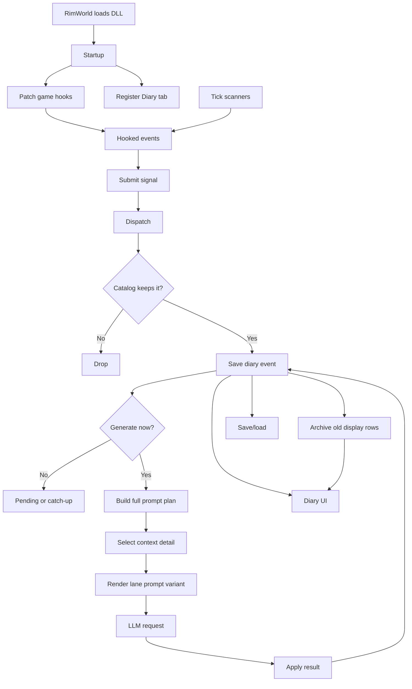
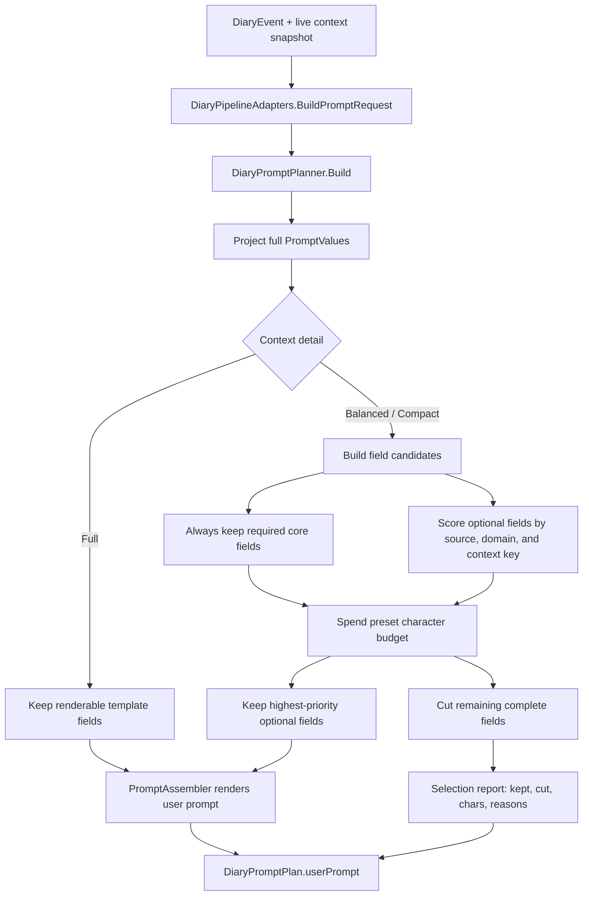
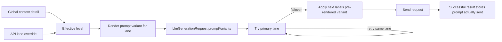

# Pawn Diary - Maintainer Guide

Last updated: 2026-07-12

Related files:

- `AGENTS.md`: detailed rules for code agents and deep architecture constraints.
- `EVENT_PROMPT_MAP.md`: event-to-prompt coverage map.
- `INTEGRATIONS.md`: the shipped public integration contract for other mods (adapter reference).
- `CHANGELOG.md`: milestone history.
- `design/`: design and planning notes kept out of the root — the planned external API capability
  queue (`design/EXTERNAL_API_CAPABILITIES.md`), plus historical implementation/gap-analysis plans
  (`design/EVENT_COVERAGE_PLAN.md`, `design/BODY_PART_EVENTS_PLAN.md`).

## 1. Purpose

Pawn Diary records meaningful RimWorld colony moments and turns them into short diary pages through
configured OpenAI-compatible API lanes. RimWorld loads the compiled DLL at startup through Harmony
patches, Defs, a `GameComponent`, and an inspector tab. There is no `main()`.

Diary pages belong only to free humanlike colonists old enough for first-person writing
(`DiaryTuningDef.minimumFirstPersonAgeYears`, default 13). Animals, prisoners, slaves, enemies,
visitors, non-colonists, and underage colonists do not own pages. If only one participant is eligible,
the event becomes a solo entry. If two eligible colonists are involved, the initiator entry is
generated first and the recipient entry gets hidden continuity from it.

Arrivals and deaths are neutral boundary pages. Arrival pages introduce a pawn's diary and are forced
to the front of that pawn's saved event list; on a new game, non-arrival capture waits until founding
colonist arrivals have been recorded. Loading a save re-arms that founding bootstrap when any
diary-eligible free colonist is missing an arrival page (a session wedged by the pre-2026-07-08
backstory bug, a mid-game install of the mod, or a join that happened while recording was off); the
ArrivalSignal capture drops pawns that already have their page, so healthy saves are untouched.
Death pages end the diary and hide later same-tick events for
that pawn. If RimWorld resurrects the same saved pawn, the death page stays in history but stops
acting as a terminal boundary, so later diary pages can attach, generate, render, and compact normally
until another death occurs.

## 2. Repository Map

RimWorld loads `About/`, `1.6/`, `Languages/`, and the compiled DLL in
`1.6/Assemblies/PawnDiary.dll`. Source and tests are kept in the repo for development, but the
Workshop payload omits source code and other development-only folders.

| Path | Role |
|---|---|
| `About/` | Mod metadata, mod version, preview, icon, dependency declaration. |
| `1.6/Defs/` | XML-owned policy: event groups, tuning, prompts, styles, UI, text effects. |
| `Languages/` | Keyed and DefInjected English text plus optional translation sources. |
| `Source/Capture/` | Pure Event Catalog payloads and decisions. |
| `Source/Ingestion/` | `DiaryEvents.Submit` bus + one `DiarySignal` capture/emit class per source (impure edge). |
| `Source/Integration/` | Public API surface for other mods (`PawnDiaryApi`, request DTOs). Contract: `INTEGRATIONS.md`. |
| `Source/Core/` | `DiaryGameComponent` partials: dispatch pipeline, save/load, scans, generation queue. |
| `Source/Generation/` | Runtime context builders, prompt adapters, LLM client, DLC-safe live reads. |
| `Source/Pipeline/` | Pure prompt planning, archive eligibility, progression/arc selection policy, request JSON, response cleanup, text decoration, API policy. |
| `Source/Patches/` | Harmony startup, domain hooks, inspect-tab/command patches. |
| `Source/Settings/` | Saved settings, API lane UI/controller, prompt/style editors, XML tuning/template override tabs. |
| `Source/UI/` | Diary inspect tab, card rendering, paging, formatting. |
| `tests/` | Standalone pure-helper test projects. |
| `prompt-lab/` | Prompt fixture and variant validation harness. |
| `integrations/` | Separate adapter mods for other mods: example/API explorer, RimTalk, SpeakUp, Rimpsyche, VSIE, and 1-2-3 Personalities. Not loaded in-game until deployed. |
| `scripts/publish.ps1` | Local Workshop payload prep; also builds/packages the example and reflection-only SpeakUp adapters by default. |
| `scripts/deploy-integrations.ps1` | Creates sibling-mod junctions for every adapter under `integrations/` in the RimWorld `Mods/` root. |

## 3. Runtime Flow

The mod is a loaded RimWorld library, not a standalone program. Startup, capture, generation,
storage, and UI are all framework callbacks around one saved `DiaryGameComponent`.
Runtime code reaches that saved component through `DiaryGameComponent.Instance`; `Current` is kept
only as a compile-time-blocked binary-compatibility alias so it does not shadow `Verse.Current`.

This is the top-level shape:



### 3.1 Startup

`DiaryModStartup` is the startup hook. RimWorld runs its static constructor when the DLL loads.

Startup does three jobs:

1. Apply normal Harmony patches.
2. Register fragile reflection patches through `DiaryPatchRegistrar`.
3. Inject the hidden Diary inspect tab onto humanlike pawn and corpse defs.

The Diary tab is hidden from the normal tab strip, but it must still be registered. The inspect
command, diary links, selected pawns, and selected corpses all open that same registered tab.
`PatchAllSafely` also catches partial assembly type-load failures before per-class Harmony patching,
then patches whatever types were available so one reflection problem cannot abort startup.

### 3.2 Capture And Dispatch

There are two ways events reach the diary system.

Harmony hooks submit one-shot events, such as social interactions, mental breaks, quests, raids,
deaths, arrivals, rituals, abilities, and thoughts.

`DiaryGameComponent` tick scans submit slower state-based events, such as work sampling, thought
progression, hediff progression, pawn progression, quest state recovery, day reflections, yearly arc
reflections, event windows, and observed conditions.

Both paths submit a `DiarySignal` through `DiaryEvents.Submit`. From there, every event uses the same
dispatcher path:

1. Confirm the game is in a recordable state.
2. Check `recentEvents` for deduplication.
3. Build a plain capture payload and `CaptureContext`.
4. Ask the pure Event Catalog whether to record, drop, batch, fan out, or route the event.
5. Emit the chosen diary event shape.

Live RimWorld objects stay in the signal adapters. The Event Catalog works on DTOs and primitive
context so its decisions remain testable without loading RimWorld.

### 3.3 Storage And Retention

Recorded events are saved as full hot `DiaryEvent` rows in `DiaryEventRepository`.

Each pawn has a `PawnDiaryRecord` containing references to the hot events that belong to that pawn.
Pair and shared events can therefore stay as one backing event while appearing in more than one
pawn's diary.

Retention keeps recent pages hot and moves old displayable POVs into compact `ArchivedDiaryEntry`
rows owned by `DiaryArchiveRepository`. Archived rows remain visible in the Diary tab, but they no
longer retry generation, receive title backfill, feed prompt continuity, or count as evidence for
day/quadrum reflection scans. Yearly arc reflections deliberately sample both hot and archived diary
pages as memory candidates, then de-duplicate by event ID so a shared hot/archive page appears once.

### 3.4 Generation

Generation starts only after an event exists in the saved hot store.

`DiaryPipelineAdapters` copy current settings, XML Def policy, localization, and live pawn facts
into pure pipeline contracts. Pure helpers then plan the prompt, build request JSON, parse provider
responses, clean generated text, and decide title behavior.

`LlmClient` owns the background HTTP work for OpenAI-compatible API lanes. It handles retries,
failover, cooldowns, timeouts, and session cancellation. Finished results return to the main thread,
where the matching `DiaryEvent` is updated with text, status, model metadata, titles, and unread
flags.

Completed LLM results are drained from both `GameComponentTick` and `GameComponentUpdate`. That means
requests already in flight can still finish while the game is paused.
Do not use `LongEventHandler.ExecuteWhenFinished` as a background-to-main-thread marshal for this
path; queue results and drain them from a real main-thread hook such as `GameComponentUpdate` or
`OnGUI`.

### 3.5 Tick Work And Catch-Up

`GameComponentTick` always runs cheap game-time scans.

Expensive generation catch-up is demand-driven. Load catch-up, delayed raid pages, and orphaned
"writing..." recovery request a pass; the pass scans only the XML-tuned `activeScanEventWindow` hot
events, which defaults to 1000 events globally.

Pending LLM work itself is not saved. After load, only hot events still inside the active scan window
can be requeued.

First-person generation is skipped for pawns below the XML Consciousness floor. Neutral arrival and
death pages bypass that guard because they are boundary chronicle pages, not first-person writing.
Resurrected pawns reuse their existing `PawnDiaryRecord`; generation checks ignore an older death
boundary while the same pawn load ID is alive again.

### 3.6 Ingestion Bus (`DiaryEvents.Submit`)

Every captured event enters through `DiaryEvents.Submit(signal)` (`Source/Ingestion/`). A Harmony
hook or scanner builds the matching `DiarySignal` subclass and submits it; the dispatcher then runs
the universal path:

| Step | What happens |
|---|---|
| Guard | `CanRecordGameplayEventNow` rejects events when the game is not in normal play. |
| Starting-arrival flush | On new games, any non-arrival signal first tries to record founding-colonist arrivals, so the arrival page remains the first diary page even if a Harmony source fires early. Each colonist is isolated: a pawn whose context build or capture throws loses only their own arrival page, and the flush still completes so the gate cannot wedge the diary. |
| Dedup check | `recentEvents` rejects duplicate source keys before payload/context work runs. |
| Decide | `DiaryEventCatalog.Get(payload.EventType).Decide(payload, ctx)` applies pure XML-backed policy. |
| Generic dedup | A short XML-tuned event-type safety key (`genericEventTypeDedupTicks`) rejects repeat type+subject emissions after the decision. Death descriptions share one key across Tale and fallback sources. |
| Dedup mark | Source and generic keys are marked only after the catalog keeps the event. |
| Emit | `signal.Emit(sink, decision)` creates the selected diary event shape and queues follow-up work. |

The dedup order is intentional. The check happens before `Decide`, so a duplicate does not build
context, run pure policy, or consume source-side random state. `AbilitySignal` depends on this because
its chance roll is read lazily from `Rand.Value`.

The generic event-type check happens after `Decide` because it needs the payload event type and final
decision shape. It is a short safety net for sources with no detailed key and for cross-source shapes
that should collapse together, currently neutral death-description pages.

The mark happens after `Decide` and both dedup checks. If the catalog drops an event, such as an
ability that fails its chance roll, the dedup window is not consumed.

A `DiarySignal` is the impure capture+emit half of one source. Pure decision data and game-context
formatting stay in `Source/Capture/Events/*EventData.cs`, covered by standalone tests where possible.
Colony-wide sources extend `DiaryFanoutSignal`.

For fan-out events, the dispatcher checks the colony key once. It then runs each per-pawn child
through the same path and marks the colony key only after at least one entry emits.

Every `DiaryEventType` now routes through this bus.

One-shot Harmony captures submit directly. Scanner and flush sources are still triggered by component
scans, but they also submit signals. A scan whose episode state depends on whether the entry recorded
can call `Dispatch` directly and read its `bool` result.

Adding a source means adding the hook or scanner, a signal, the catalog `Spec`, and XML policy.
Shared guard, dedup, decision, and emission glue stays in `Dispatch`.

The old per-source dedup dictionaries are gone. `recentEvents` stores the source-prefixed or generic
event-type key, that key's own dedup window, and the recorded tick.
`Source/Capture/RecentEventExpiry.cs` owns the pure expiry rule, and
`Source/Capture/GenericEventTypeDedup.cs` owns the generic key format.

A short-window source cannot evict a still-live long-window key. A zero or negative window opts out
of dedup instead of clearing the store. The coverage table below lists each source's signal.

### 3.7 External integrations (`PawnDiaryApi`)

Other mods push events INTO the diary through one public facade:
`PawnDiary.Integration.PawnDiaryApi.SubmitEvent(ExternalEventRequest)` (or the
`SubmitEvent(ExternalEventRequest, out SubmitEventOutcome)` overload when they need to distinguish
the reason a submission did not record), when they need to track the created entry
`SubmitEventWithHandle(ExternalEventRequest)`, or when they already own final prose
`SubmitDirectEntry(ExternalDirectEntryRequest)`, or when they want Pawn Diary to write from a
caller-authored instruction `SubmitPromptEntry(ExternalPromptEntryRequest)` (`Source/Integration/`).
Calls are validated, wrapped so an adapter bug can never break the game loop, main-thread guarded,
and then submitted as external ingestion signals — so external events get the standard treatment: pure
`ExternalEventData.Decide`, the shared dedup store (`externalEventDedupTicks`, with a per-request
override), and event-store writes. Player event filters affect only Pawn Diary's automatic game
listeners; external API submissions are still triggerable when their own validation, master
integration switch, budget, dedup, and pawn gates pass. A supplied eligible partner makes ordinary
external events pairwise; direct entries require nonblank `partnerText` too. Write request DTOs can
set `forceRecord=true` for adapter-owned triggers that must record a diary event. Forced writes skip
soft gates (external budget, source and generic dedup); they still require valid fields,
main-thread/game readiness, the master integration toggle, the ordinary `SubmitEvent` group
requirement, and a base diary-eligible subject.

The master integration toggle is saved in `PawnDiarySettings.allowExternalIntegrations`, appears on
the main mod settings page as *Allow external mod integrations*, and defaults to enabled. The public
facade exposes `PawnDiaryApi.IsExternalApiEnabled` so adapters can distinguish "the game/component is
not ready yet" (`IsReady=false`) from "the player has disabled external API behavior"
(`IsExternalApiEnabled=false`). When disabled, submissions and reads return their safe empty values
and registered providers/listeners are not invoked; registration itself remains accepted so a later
re-enable works without restarting.

Beyond diary events, the v2 API exposes the LLM connection itself (`ApiVersion` bumped `1 → 2`).
`GetApiSetup()` returns a `DiaryApiSetupSnapshot` — routing mode, global request knobs, and one
`DiaryApiLaneSnapshot` per configured endpoint/model lane — and `AddApiLane(ExternalApiLaneRequest)`
appends a new lane that, when enabled, becomes active immediately: it is persisted via
`PawnDiarySettings.Write` and pushed to the shared `LlmClient` through `ApplyLaneConfiguration`,
mirroring the lane-relevant steps `PawnDiaryMod.WriteSettings` runs when the settings window closes.
Both live in `Source/Settings/IntegrationApiSettings.cs`, with pure token↔enum mapping and add-request
validation in `Source/Pipeline/ApiLaneImport.cs` (covered by `DiaryPipelineTests`). Unlike the diary
reads, these operate on **global** mod settings, so they are gated by the main thread and the master
toggle but **not** by `IsReady` — an adapter can read or configure lanes at the main menu. Public DTOs
speak stable string tokens (`authMode`, `apiMode`, `routingMode`, `contextDetailOverride`) rather than
the internal enums. `DiaryApiLaneSnapshot` can return the player's real `apiKey` — so an adapter can
reuse the player's provider (the "one key serves both mods" case) — but because **any** loaded mod can
call `GetApiSetup()`, the raw key is **withheld by default**: it is included only when the player opts
in with the separate **Share API keys with other mods** checkbox (`enableExternalKeySharing`, default
`false`), surfaced on the snapshot as `keySharingEnabled`. When off, `apiKey` is empty and `hasApiKey`
still reports presence. The master integration toggle governs event/context/lane access; sharing a
plaintext key is a strictly higher-trust action on its own switch. `AddApiLane` records the requesting
mod's `sourceId` on the lane (`addedBySourceId`, echoed in the snapshot) so an API-injected lane stays
attributable rather than indistinguishable from a hand-added row.

API v3 (`ApiVersion` `2 → 3`) exposes the automatic-capture **event filters** — the per-interaction-
group on/off toggles on the settings *Events* tab. `GetEventFilters()` returns a
`DiaryEventFilterSnapshot` per settings-visible group (key = defName, label, domain, `enabled`,
`defaultEnabled`, `hasOverride`); `IsEventFilterEnabled(key)` reads one; `SetEventFilterEnabled(key,
enabled)` flips it using the **same saved flag** as the tab — `PawnDiarySettings.SetGroupEnabled`,
which drops the override when it matches the XML default — then persists via `PawnDiarySettings.Write`.
The change takes effect for future captured events immediately (filters are read per event via
`IsInteractionEnabled`/`IsTaleEnabled`/… at capture time), so no cache invalidation is needed. The API
and the Events tab share one source of truth: `IntegrationApiSettings` calls the now-internal
`PawnDiaryMod.EventFilterGroupsForSettings` / `IsSettingsEventFilterGroup` / `EventFilterLabel`, so the
exposed set (non-External, non-package-gated groups) and its order cannot drift from the UI. Same
gating as the v2 members (master toggle + main thread, no loaded game).

API v4 (`ApiVersion` `3 → 4`) adds editable-psychotype setters and one-shot LLM completions.
`SetPsychotype(pawn, defName, pin)` and `SetPsychotypeCustomRule(pawn, rule)` write the pawn's
player-editable psychotype — its base type / custom rule, the layers the Psychotype Studio edits — so an
adapter can *seed* an outlook the player can then tweak or clear, rather than the source-locked override
slot. `RequestLlmCompletion(request)` runs one instruction+input prompt on a chosen (or the first active)
lane and returns a poll handle read via `GetLlmCompletionResult(handle)`; it wraps a new one-shot
`LlmClient.SendSingleCompletion` (sibling of the connection test, but with a real system prompt and token
budget) behind a handle store (`ExternalLlmCompletionService`) that marshals the background result back to
the main-thread poller. It spends the player's tokens, so it is master-toggle-gated, sourceId-attributed,
one-shot, and input/output-capped. Unlike the global lane-management reads, completion requests require
a loaded game so they can reserve the same XML-tuned per-source/global rolling prompt budget as other
token-spending adapter calls. They share normal diary lane concurrency, cooldown, timeout, and game-
session cancellation; at most 64 handles are admitted until terminal results are polled. Turning the
master integration toggle off blocks new work but does not block polling an already-issued handle:
terminal polling is the cleanup operation that consumes its bounded service slot. Adapters must still
discard such a result when their own feature or the master integration switch is off.

API v5 (`ApiVersion` `4 → 5`) adds `RegisterExternalPsychotypeGenerator(ExternalPsychotypeGenerator)` — an
adapter that produces a pawn's outlook asynchronously (e.g. the 1-2-3 Personalities bridge's LLM transform)
registers three main-thread callbacks (`canReroll` / `isBusy` / `reroll`), and the per-pawn voice editor
(`Dialog_PawnWritingStyle`) shows a **Regenerate** button and a live **generating…** status for pawns it
owns, refreshing the editable custom rule when the new outlook lands. Registration mirrors
`RegisterPawnContextProvider` (process-global, main-thread, replace-by-sourceId, a throwing generator
disabled for the session) through the `ExternalPsychotypeGenerators` registry.

API v6 (`ApiVersion` `5 → 6`) additively exposes `DiaryPsychotypeSnapshot.savedCustomRule`: the saved
player-editable custom outlook before external-override resolution. `rule` remains the effective prompt
rule. This lets an adapter migrate away from its own old locked override without mistaking that override
for, or overwriting, player-authored custom text.

For ordinary `SubmitEvent` calls, policy stays in XML: the request's `eventKey` string plays the
defName role, and an External-domain `DiaryInteractionGroupDef` must claim it (required-match, like
Romance — an unclaimed key records nothing and logs one warning naming the submitting mod). The
classifier applies the same package gates as every other domain: an External group that is inert
(`disableWhenPackageIdsLoaded` active, or `enableWhenPackageIdsLoaded` unsatisfied) is treated as
absent, so its key is rejected with the same "no group claims eventKey" warning. Adapter mods ship
their own External groups plus optional narrower `DiaryEventPromptDef` rows; the core ships only the
`externalDevTest` group so the Debug Actions entry "Submit test external event..." can exercise the
whole path with no adapter installed. The full public contract — versioning, threading, eventKey
conventions, packaging — lives in `INTEGRATIONS.md`.
Wrapped prompt entries are the middle ground between ordinary events and direct text injection: the
adapter supplies `promptInstruction`, Pawn Diary stores it as protected `external_prompt_instruction`
context, and the normal first-person prompt wrapper still owns persona/style, safety text, live
context, response parsing, budget, lifecycle, and persistence. Their External group is optional; if
one claims the submitted key, its label, styling, and prompt metadata still apply.
Every `PawnDiaryApi` entry point is main-thread only. Off-main-thread calls return the documented
safe value, use a thread-safe diagnostic path, and do not ask RimWorld to marshal work. Adapters that
collect data on worker threads must own their queue and drain it from a main-thread callback such as
their own `GameComponentUpdate` or `OnGUI` hook.

The public adapter contract is only the `PawnDiary.Integration` namespace: `PawnDiaryApi` plus its
request/result/snapshot DTOs. Runtime helpers in capture, ingestion, generation, pipeline, UI, and
settings stay `internal` unless RimWorld needs a public type for XML Def loading, Scribe/save data,
settings serialization, debug-action discovery, or lifecycle reflection (`Mod`, `GameComponent`,
`ITab`). `[InternalsVisibleTo("DiaryPipelineTests")]` lets the standalone pure test project reach
the internal pure helpers without widening the mod's external compile-time surface. A defensive
`ExternalEventRequestText.MaxRequestContextLines` (64) caps the total
`key=value` fields one request can write into saved gameContext, so raising the XML-tuned
enchantment-candidate cap cannot grow saved state without bound (mirrors `MaxListeners`). Protected
prompt fields are added first; ordinary adapter `extraContext` can only use the remaining slots, so a
candidate-heavy request cannot exceed the same absolute ceiling.
Saved external `gameContext` always starts with `external=...`; the domain classifier gives that
marker precedence so adapter-supplied `extraContext` keys cannot make an external page display as a
native Thought, Work, Hediff, or other built-in event domain. Adapter input is confined to being a
*value*, never a structural field. `ExternalEventData.BuildGameContext` flattens the `;` field
separator (and line breaks) out of the adapter-controlled `eventKey`/`sourceId` and length-caps them
before they become marker values, so a `;`-laden key cannot forge an extra `key=value` field.
`ExternalEventRequestText.JoinAdapterExtraContext` — shared by the ordinary event path and the
direct-entry path — drops any `extraContext` line whose key is a reserved internal game-context key:
the event-domain markers, the structural death/arrival/reflection markers, classifier value keys,
prompt `ContextField` keys, and the protected `external_prompt_*` fields (its reserved set is the one
place to register a new internal key). Free-form adapter keys (`location`, `weather`, ...) still pass
through. Because `DiaryContextFields` reads first-match, a caller can therefore neither smuggle an
extra field through a marker nor override an API-owned or internal field.
That same marker now drives external authorship attribution: `DiaryEntryView` derives a cleaned
`ExternalSourceId` from the saved `source=` field, the Diary tab shows it in the entry footer, and
public entry snapshots expose `externallyAuthored` / `externalSourceId` without adding save fields.

Token-spending external submissions pass one more API-side guard before dispatch. The component owns
a transient rolling reservation list (not saved) and evaluates it with the pure
`ExternalApiBudgetPolicy`: ordinary `SubmitEvent` / `SubmitEventWithHandle` requests estimate main
generation cost from the player's `maxTokens`, the queueable POV count, and optional title follow-up
tokens; `SubmitPromptEntry` uses that same estimate but does not require an External group; while
`SubmitDirectEntry` estimates only the title-only requests it can actually queue when
`generateTitleIfMissing` is true. `forceRecord=true` skips this reservation for valid write
requests. Prompt-test mode, missing active API lanes, per-pawn diary-generation disablement, and
incapacitation skips do not consume budget because they would not enqueue LLM work. The XML knobs live in `DiaryTuningDef`
(`integrationPromptBudgetEnabled`, `integrationPromptBudgetWindowTicks`,
`integrationPromptBudgetMaxRequestsPerSource`, `integrationPromptBudgetMaxRequestsGlobal`,
`integrationPromptBudgetMaxTokensPerSource`, `integrationPromptBudgetMaxTokensGlobal`); a 0/negative
`windowTicks` is clamped to the default by the tuning accessor, so it never silently disables the
gate. Rejections return the existing safe API values (`false` / `recorded=false`) and log once per
source/reason. A reservation is refunded (`ReleaseExternalApiBudgetReservation`) when the dispatcher
then drops the event (dedup window or pawn state), so a burst of duplicate or invalid
submissions cannot exhaust an adapter's window without any tokens actually being queued. `SubmitEvent`
dispatches the signal directly (rather than fire-and-forget) so it can apply that refund while keeping
its documented "validated and handed off" return; callers needing the real outcome use
`SubmitEventWithHandle`, or the `SubmitEvent(request, out SubmitEventOutcome)` overload which
distinguishes `DroppedBudget` from `DroppedByPipeline` and the other drop reasons.

The public v1 read side is prompt-free and snapshot-based. `GetRecentEntryTitles`,
`GetContextSnapshot`, `GetEntryStats`, `GetEntrySnapshot`, and `GetEntryStatus` all read the same hot
plus compact-archive views used by the Diary tab, apply `DiaryEntryTitleQuery` where relevant, and
return plain DTOs rather than live RimWorld objects. Snapshots can expose external source
attribution (`externallyAuthored`, `externalSourceId`), lifecycle status, title/prose presence,
semantic domain, atmosphere, and aggregate counts, but never prompts, raw provider responses, errors,
or in-flight pages.

The public v1 context side exposes the machinery Pawn Diary already builds for prompts without
driving another LLM call. `GetWritingStyle` publishes the pawn's base saved diary voice;
`GetAvailableWritingStyles` lists the effective style catalog; `SetWritingStyleOverride` and
`ResetWritingStyleOverride` manage source-owned temporary voice rules (when two adapters contend for
the same slot and both sourceIds are packageIds of active mods, the later-loading mod wins —
`ExternalOverrideArbitration` + `ExternalSourceLoadOrder`; unresolvable sourceIds keep
last-writer-wins); `RegisterPawnContextProvider`
adds compact adapter-owned `key=value` lines to pawn summaries; `GetPawnSummary` returns structured
identity/mood/health/thought/provider facts; `GetPromptEnchantments` returns the prompt-enchantment
candidate set before the final weighted roll; and `GetContextBundle` packages style, summary,
enchantments, and recent memory in one DTO.

The buildable example adapter keeps all direct public API calls in
`integrations/PawnDiary.ExampleAdapter/Source/PawnDiaryExampleApi.cs`. That file acts as the
copyable integration layer: it wraps status checks, submissions, reads, prompt previews, context
providers, status listeners, and style overrides, with XML doc comments spelling out required args
and safe return values. The explorer window and quick debug actions call through that facade so
adapter authors can ignore the UI harness when copying the sample.

`SubmitEventWithHandle` returns stable `DiaryEntryHandle` values when the pipeline creates an entry,
and `RegisterEntryStatusListener` lets adapters receive compact lifecycle snapshots after a POV's
main text or title status changes. `SubmitDirectEntry` creates normal saved diary events from
caller-authored prose without queuing the main LLM rewrite; optional caller titles are cleaned and
stored immediately, and `generateTitleIfMissing` may use the existing title-only path when enabled.
`forceRecord=true` still requires a base diary-eligible subject, but bypasses soft direct-entry gates
so caller-authored prose can be stored for adapter-owned triggers.

`PreviewPrompt(ExternalEventRequest, string povRole = null)` and
`PreviewPrompt(ExternalPromptEntryRequest, string povRole = null)` build side-effect-free prompt
snapshots with RNG save/restore. They never register an event, cross-reference pawn diaries, consume
dedup windows, queue generation, or spend tokens. `ExternalPromptEntryRequest` adds required
`promptInstruction`; the live generation path stores it as protected `external_prompt_instruction`
context while Pawn Diary still owns persona/style, safety, context, parser expectations, budget,
title follow-ups, and storage. Ordinary external requests can also provide `promptFragment`,
`promptEnchantmentCandidates`, and `replacePromptEnchantments`; those fields are cleaned, capped, and
protected from `extraContext` spoofing.

The preview snapshot additionally reports `contextDetailLevel` (the effective global preset) and a
`contextPresets` list — one `DiaryPromptContextPresetPreview` per preset (Full/Balanced/Compact) with
that preset's `budgetChars`, assembled prompt text, and `keptFields`/`cutFields` diagnostics. The
per-field `reason` strings are fixed-English diagnostic tokens (like the `event:`/`sex=` sentinels),
not localized text: they explain why a field was kept or cut for tooling, not for player display.
Balanced/Compact budgets come from `DiaryContextDetailDef` (`Diary_ContextDetail`), so they can be
retuned in XML; Full is unbudgeted and preserves the original prompt shape.

`integrations/PawnDiary.RimTalkBridge/` is the first real adapter target: a two-way bridge between
Pawn Diary and RimTalk, shipped as the separate mod `PawnDiary: RimTalk bridge`. Its behavior is
gated by an **integration-level** setting (`PawnDiaryRimTalkBridgeSettings.integrationLevel`, an int
Scribe key so save data stays stable), with `PawnDiaryRimTalkBridgeMod.LevelAtLeast(n)` as the
null-safe gate everywhere:

The bridge settings use one vertically scrolling `Listing_Standard`. The listing explicitly sets
`maxOneColumn`: without it, Verse moves overflowing rows into off-screen columns and `CurHeight`
measures only the last column, causing the scroll canvas to collapse until the window appears empty.
The canvas is also floored to the visible viewport height before drawing.

- **Off (0)** — no data crosses in either direction and no chat-originated entry is possible.
- **Shared context (1, default)** — outbound, `DiaryContextInjector` registers a diary-memories
  section into RimTalk's prompt builder (`ContextHookRegistry.InjectPawnSection` on
  `ContextCategories.Pawn.Thoughts`, plus a `{{pawn1.diary}}` Scriban variable) and inbound,
  `PersonaSync` registers a `chat_persona=` pawn-context provider so Pawn Diary summaries see the
  RimTalk persona. Both directions are additive context only; no diary entry originates from chat.
- **Shared context + conversations (2)** — `ConversationTracker` (fed by the
  `RimTalkCreateInteractionPatch` Harmony postfix on `TalkService.CreateInteraction`) groups displayed
  chat by reply chain and quiet window, then passes each finished conversation through the bounded
  editorial funnel below. Per-line PlayLog capture is disabled while the bridge package is installed,
  so only an accepted whole conversation can create an entry.

The Level-2 funnel is:

```text
RimTalk reply chain
→ cheap local scoring
→ bounded ranked queue
→ small batched LLM assessment
→ accepted candidates use normal Pawn Diary generation
→ exactly one linked pairwise DiaryEvent (two POV pages)
```

`ConversationCandidatePolicy` is pure. It rejects monologues, duplicate chains, empty speakers, and
zero caps, then scores personal signals such as reciprocal talk, speaker alternation, and localized
keyword categories. Event overlap, announcements, and duplicate pairs reduce the score; length alone
is never enough. Reaction terms are normalized, de-duplicated, and count/length-limited before saving,
with XML categories retained and custom additions kept in one bounded category.

`ConversationCandidateQueue` ranks by score descending, older first, then stable root-talk id. It
deduplicates root ids, enforces its global and per-pair limits, replaces the weakest only when a
stronger candidate arrives, and expires old work. Defaults live in
`1.6/Defs/RimTalkConversationAssessmentDefs.xml`: 12 queued candidates, 6 per batch, 2 per pair, at
most 2 assessment batches per in-game day, a 15,000-tick retry gap, and 60,000-tick expiry. Local
scoring is free. The daily count and retry gap are saved; the queue and request are transient, so
reloading cannot reopen the paid allowance.

`RecentDiaryEventCache` listens through the frozen id
`aimmlegate.pawndiary.rimtalkbridge.assessmentstatus`. It keeps bounded, locked event facts, excludes
this bridge's own entries, and adds both participants' context on the main thread. Failed, skipped,
and prompt-only outcomes remove pending seeds, so nonexistent pages cannot become related-event
aliases. This helps distinguish a native-event echo from a new personal consequence without expanding
the core API.

`ConversationAssessmentCoordinator` owns one transient queue and one completion handle. Its ~250-tick
main-thread pass polls first, then starts at most one batch through
`PawnDiaryApi.RequestLlmCompletion`. Each candidate sends short aliases, up to four capped transcript
lines, and up to three recent event summaries (default user-text cap: 3,600 characters). Charged,
user-authored, and keyword lines receive priority slots. No persona, pawn summary, surroundings,
writing style, or diary prose is sent. The response parser accepts only the frozen schema and active
aliases, caps focus text, fills missing rows with `ignore`, and fails closed on invalid output.

Every assessed conversation has one outcome: `ignore`; `related` (new explicit personal consequence
linked to one supplied event); or `standalone` (explicit durable interpersonal content independent of
the supplied events). Only the latter two reserve the existing per-pawn/colony/pair throttle and call
`SubmitPromptEntry`. Their extra context carries `conversation_assessment`, stable reason, explicit
`conversation_focus`, and—only for related outcomes—the actual `related_event_id` plus
`avoid_related_event_recap=true`. The final localized prompt tells normal generation to focus on that
consequence and not retell the native event. A rejected Pawn Diary submission refunds the throttle.
The root dedup token remains `rimtalkbridge|<RootTalkId>`.

Accepted chat events charge both POV pawns a rolling **60,000-tick (one game day) cooldown**.
Conversations involving either pawn are discarded early and checked again before submission; rejected
submissions refund the reservation. The pawn-id/tick map is saved under
`rimTalkConversationCooldownTicksByPawn`, so reloads cannot bypass it. The legacy per-pawn setting is
now `0` or `1`, and pre-0.3 zero values migrate to enabled recording before the new zero-means-off
behavior is applied.

Semantic assessment defaults on and uses a saved lane selector (`assessmentLaneIndex=-1` means first
active lane). Candidates wait until expiry when no lane is active. Budget or concurrency rejection
keeps the queue for retry; transport or invalid-output failure creates nothing. Turning semantic mode
or the master integration switch off still polls an in-flight handle to release it, then discards the
result. Off mode uses the stricter XML-tuned local scorer and makes no assessment request.

The settings expose two editable inputs. `conversationReactionTermsCsv` overrides the localized
reaction lexicon (blank restores the DefInjected defaults); `assessmentPromptOverride` replaces the
localized assessment policy (blank restores `assessmentSystemPrompt`). A code-owned English JSON
schema prefix is always added before the editable text, so overrides and translations cannot remove the
contract. XML owns the editor limits and cooldown. Unicode text-element counting is used consistently,
and invalid provider output fails closed.

Threading and lifecycle are the two subtle parts. The diary-memory section is served to RimTalk from
a **cache** that is refreshed only on the main thread (`DiaryContextInjector.RefreshFor`), because
RimTalk may call the section delegate on a background prompt-assembly task and `PawnDiaryApi` reads
are main-thread-only; a lock guards the shared cache. `RimTalkBridgeGameComponent` runs one throttled
(~250-tick) pass that refreshes stale diary/colony/shared-memory caches, runs Tier-B persona sync,
flushes quiet conversations into the candidate queue, polls/applies assessment, then starts new work.
It resets the recent-event cache, queue, in-flight map, assembler, throttle, and other static caches in
`FinalizeInit`, then restores only the scribed rolling pawn cooldown (statics leak across exit-to-menu +
load). All RimTalk-typed methods are `[MethodImpl(NoInlining)]`
and only reached after the mod's cached `RimTalkActive` (`cj.rimtalk`) guard, so a missing RimTalk can
never raise `TypeLoadException`. Pure decision logic (assembly, Unicode matching/overlap, scoring,
queue ranking/gating, editable-policy validation, batch formatting, response parsing, submission
planning, throttling, and context
formatting) lives under `Source/Pure/` and is unit-tested by
`tests/RimTalkBridgeLogicTests/` without loading the game.

Persona synchronization now has one explicit authority direction: **Pawn Diary → RimTalk** publishes
the pawn's effective diary outlook plus writing style through RimTalk's supported `PersonaService.SetPersonality`,
while **Pawn Diary ← RimTalk** imports RimTalk's persona as a source-owned **psychotype (outlook)**
override (`PersonaSync` applies `SetPsychotypeOverride`). An optional LLM transform uses Pawn Diary's
first active API lane to reshape the source for the receiving mod and falls back to direct sync on
admission failure, no configured lane, or generation failure. The older `personaLedDiaryVoice` key
remains serialized for settings compatibility but no longer controls behavior. Import mode reapplies
on persona-hash change and clears via `ResetPsychotypeOverride` when the direction changes; every reset
also sweeps the stale writing-style override older bridge versions placed, so existing saves migrate
cleanly. Other advanced controls cover semantic/local-only assessment and lane selection, editable
reaction terms and semantic prompt, and per-pawn/colony/pair throttle knobs
(`ThrottlePolicy`; daily/colony counters are transient, but the one-day pawn cooldown is saved; a zero
per-pawn daily cap disables conversation recording). The old `useRimTalkEngine` Scribe key remains readable but
its toggle is hidden and its value is ignored: accepted conversations always use normal pairwise
`SubmitPromptEntry`. The legacy `minRepliesForImportant` key is likewise still read but no longer shown
or used. Frozen save/registry tokens (source id, `rimtalkbridge_conversation` event key, three listener
ids) live in `BridgeIds`. The full design rationale is in `design/RIMTALK_BRIDGE_PLAN.md`.

Template authors can explicitly place `{{pawn1.diary_persona}}` (and the corresponding `pawn2` form).
It returns Pawn Diary's combined outlook and writing-style rules from a main-thread-built cache. The
variable is registered for opt-in use only: the bridge never auto-injects it or creates a prompt entry.

Two further Level-1 outbound context variables extend the bridge (both follow the same
main-thread-refresh / background-read cache split, `design/RIMTALK_BRIDGE_CONTEXT_EXTENSION_PLAN.md`):

- **`{{colony_events}}` — colony situation (`ColonyContextInjector`, default OFF).** A short curated
  line about the colony *right now*: threat level (`Map.dangerWatcher.DangerRating`), active game
  conditions (`GameConditionManager.ActiveConditions`), an atmospheric Anomaly note (DLC-gated on
  `ModsConfig.AnomalyActive` via `Find.Anomaly`), and the top ongoing quests
  (`QuestManager.QuestsListForReading`). Weather/season are left to RimTalk. Lines are weighted, then
  ordered/trimmed by the pure `ColonyEventsFormat` (settings cap `colonyEventCount`, hard cap 400
  chars). Registered as a `RegisterEnvironmentVariable` **and** an `InjectEnvironmentSection` after
  `Environment.Weather`; the per-map cache is keyed by `map.uniqueID` and refreshed on the tick pass.
  The read path has no expiry of its own, so the refresh pass clears a map's block when it has no free
  colonists (an old line such as "under serious attack" stops once everyone has left) and evicts blocks
  for maps that no longer exist. Off by default because it overlaps RimTalk's own live-event mods —
  Pawn Diary contributes a curated, atmospheric summary instead of a live feed.
- **`{{diary_shared}}` — pair shared memory (`SharedMemoryInjector`, default ON).** When two colonists
  talk, the diary moments they *share* (entries where one is subject and the other partner, via
  `DiaryEntryTitleQuery.partnerPawnId`) are injected as "previous interactions", picked
  weighted-randomly by the pure `SharedMemorySelection` (recency × importance, seeded from a stable
  per-pair value — **never `Verse.Rand`**; settings cap `sharedMemoryCount`, hard cap 500 chars). This
  is a **context** variable (RimTalk hands the provider a `RimTalk.Prompt.PromptContext` with all
  participants), so it registers via `ContextHookRegistry.RegisterContextVariable`. Because a context
  variable is invoked at prompt time for a pair only then known, the provider is *lazy*: it serves the
  cached block or enqueues the pair on a `ConcurrentQueue` and returns "" once; the main-thread pass
  drains the queue, reads the shared entries, and fills a `pairKey`-keyed cache (a second entry-status
  listener marks a pair stale when either pawn's diary changes; `Mod.WriteSettings` marks all pairs
  stale so a changed `sharedMemoryCount`/toggle takes effect at once). The block is symmetric, so the
  pass prefers the lower-load-id pawn as subject but falls back to the other pawn when the first is
  unreadable (unspawned or diary-ineligible, e.g. a prisoner) — so a colonist↔non-colonist pair still
  surfaces the colonist's shared memories; a build where neither pawn can be read retries later rather
  than caching a permanent empty. `IsPreview` returns a cheap localized sample. Zero-config delivery:
  since RimTalk has no context-*section* injection, an optional system
  **prompt entry** embedding `{{diary_shared}}` is auto-registered (`autoInjectSharedMemory`, default
  ON) via `RimTalkPromptAPI.CreatePromptEntry`/`AddPromptEntry`; it is reconciled idempotently
  (remove-by-modId then add) from the tick pass and `Mod.WriteSettings`, and **removed** when the
  feature is turned off — prompt entries persist in the user's active RimTalk preset, so that cleanup
  is mandatory.

Verified against the installed `cj.rimtalk` **v1.0.13** DLL (plan ⚠️ V1): `RegisterContextVariable`,
`RegisterEnvironmentVariable`, `InjectEnvironmentSection`, `RegisterEnvironmentHook`, the
`PromptContext` fields (`AllPawns`/`Pawns`, `IsMonologue`, `IsPreview`), and the prompt-entry API all
exist, so no degrade path was needed. **⚠️ U1 (open, verify in-game):** whether RimTalk renders an
`InjectEnvironmentSection` into its *default* prompt is still unconfirmed for `{{colony_events}}` (the
same open question the shipped `InjectPawnSection` carries). The `{{colony_events}}` variable and the
`{{diary_shared}}` prompt entry work regardless; if the injected environment *section* does not render,
switch `ColonyContextInjector.RegisterAll` to `RegisterEnvironmentHook(Environment.Weather, Append, …)`.

Compatibility groups shipped inside this repo for other mods use the group gate
`enableWhenPackageIdsLoaded` (inverse of `disableWhenPackageIdsLoaded`): the group is enabled only
while one of the listed target mods is in the mod list, so it sits fully inert otherwise.
`1.6/Defs/Compat/DiaryCompat_RimTalk.xml` adds `rimtalk_chatter`, an Interaction-domain compat
group gated on RimTalk's packageId (`cj.rimtalk`). It claims `RimTalkInteraction` PlayLog rows before
the broad `other` fallback can see them, captures the rendered chat text, and routes ordinary chatter
through the same `AmbientDayNote` batching/promotion policy as SpeakUp **only when the bridge is not
installed**. Its `disableWhenPackageIdsLoaded` contains
`aimmlegate.pawndiary.rimtalkbridge`, removing the old parallel ambient/promotion path at all bridge
levels. Therefore: RimTalk alone keeps the ambient fallback; bridge Level 0 is fully off; Level 1 is
context-only; and Level 2 can record only an assessed whole conversation. With RimTalk absent, the row
does not appear in event settings and has no runtime effect.

The remaining core compatibility packs are pure XML and Russian-localized. All target content is
matched by plain strings and package gates, so none creates a target-mod or DLC assembly dependency:

- **Alpha Memes** (`Sarg.AlphaMemes`) separates funerals, other rituals, eligible thoughts, baptism,
  and two visible reflective hediffs. Ritual matchers use the runtime classifier shape
  `PreceptDefName;BehaviorWorkerClass`: exact precept stems are therefore `matchPrefixes`, followed by
  the broader `AM_` ritual family.
- **Vanilla Ideology Expanded - Memes and Structures** (`VanillaExpanded.VMemesE`) separates four
  verified severe rites from the general `VME_` ceremony family, plus eligible ritual afterthoughts
  and interrogation. The severe rows use the installed `*Precept` names, not similarly named workers.
- **Way Better Romance** (`divineDerivative.Romance`) themes its three real InteractionDefs and fourteen
  memory ThoughtDefs with pairing/orientation-neutral prose. Date/hangout invitations ambient-batch;
  hookup attempts remain immediate. Its apparent succeeded/failed names are RulePackDefs, not events.
- **Vanilla Traits Expanded** (`VanillaExpanded.VanillaTraitsExpanded`) adds exact allowlists for its
  recordable memories and three actual MentalStateDefs. A target-gated XML patch appends twenty
  trait-to-psychotype affinity rules without referencing a VTE Def directly.
- **Hospitality** (`Orion.Hospitality`) records colonist-owned guest diplomacy/charm as ambient hosting
  work and guest scrounging only when a colonist actually participates. Guest-held recruitment and
  bookkeeping thoughts are deliberately excluded. The generic `allowSingleEligiblePawn` batch flag
  lets XML batch the one diary-eligible side of a colonist/guest interaction while every group that
  does not opt in keeps the old solo route. Guest arrival and the `HappyGuestJoins` join-request
  incident use one-shot `MapWitness` pages; the latter never claims the player has accepted the
  request. The optional guest-presence context-provider phase remains deliberately deferred; Phase 1
  is complete.
- **Vanilla Events Expanded** (`VanillaExpanded.VEE`) adds purple-raid and visible ambient-hediff
  groups, six live GameCondition prompt tints, and four one-shot incident families (earthquake,
  meteorites, space battle/shuttle crash, and purple manhunters). Each incident chooses one stable map
  witness instead of fanning out. Verification intentionally omitted the neutral
  `VEE_VisitorGroupRaid`, hidden traitor hediffs, and situational-not-memory thoughts so the diary never
  records a betrayal too early or exposes secret state.

`EventWindowRecordScope.MapWitness` is the reusable middle ground for an incident hook that supplies a
map but no subject pawn: the eligible colonist with the smallest stable load ID owns exactly one page.
`Map` still fans out and `SubjectPawn` still requires a pawn supplied by the signal. Thought capture now
classifies the live `ThoughtDef`, so package-wide Thought groups can inspect `modContentPack`; saved-event
recovery remains defName-only by design.

Four further personality/social integrations ship as **standalone adapter mods** under `integrations/`
(deployed by `scripts/deploy-integrations.ps1`), not as compat groups inside the core mod — so a
player installs only the ones matching their mod list:

- **`PawnDiary.SpeakUp` (`Pawn Diary: SpeakUp`)** — five target-gated Tier-1 Interaction groups classify
  deep talks, jokes, prisoner talks, thought reactions, and catch-all chatter. They preserve rendered
  dialogue; core's SpeakUp `Ensue` suppression guard prevents rendering from scheduling another reply.
  The prisoner group matches SpeakUp's exact `Prisoner*` conversation defNames (not a bare `Prisoner`
  prefix, which would swallow Anomaly DLC's `PrisonerStudyAnomaly` from the core anomaly group), and all
  five ambient groups set `allowSingleEligiblePawn` so a colonist↔prisoner/guest talk batches into one
  day note instead of emitting solo pages. A default-on reflection-only Tier 2 observes the verified
  `DialogManager`/`Talk` surface without a SpeakUp.dll build reference, samples already-rendered
  emitter-POV lines, and submits one `speakupbridge_conversation` External pair event at the configurable
  threshold (default 3, range 1–5). It attaches to a `Talk` only from its opening reply (checked via
  `Statement.Iteration`), so a conversation already in flight when capture is enabled is skipped rather
  than recorded with inverted roles or partial samples. In-flight Talk state clears on load/toggle-off;
  pawn departure or death drops it. Tier-1 ambient
  fragments deliberately coexist with the whole-conversation event pending the diary-level duplication
  smoketest. The old `speakup_chitchat`/`SpeakUpAmbientDay` fallback and saved setting token moved
  unchanged into `Defs/Compat`: SpeakUp alone keeps that behavior, loading the adapter disables only the
  fallback, and force-loading the adapter without SpeakUp is inert. Core `teaching`'s existing SpeakUp
  disable gate remains unchanged until its original collision rationale is reproduced.
- **`PawnDiary.RimpsycheBridge` (`Pawn Diary: Rimpsyche`)** — XML assigns Rimpsyche conversation rows
  (ambient min 6/sample 3) and package-owned memories their own voice. Tier A contributes a cached
  `psyche=` context line: up to three localized descriptors above the XML magnitude floor and two
  interests, never raw floats. Default-on Tier B maps the two dominant nodes from distinct behavioral
  families into a source-owned psychotype outlook on a 250-tick change-detected pass and releases owned
  overrides on toggle/new-game. Default-on Tier C signature-checks Rimpsyche v1.0.41's
  `InteractionHook`, records only conversations over the XML absolute-alignment threshold (`0.55`)
  under frozen key `rimpsyche_conversation`, and persists a per-pair 60,000-tick cooldown. The
  six-family mapping, compact formatter, stable hash, threshold, and cooldown are pure-tested. Typed
  RimPsyche reads stay behind the active-package guard; core code and the public API are unchanged.
- **`PawnDiary.Vsie` (`Pawn Diary: Vanilla Social Interactions Expanded`)** — mostly XML, **plus** a
  tiny assembly (`PawnDiaryVsie.dll`) for the gathering hook. Four gated `DiaryInteractionGroupDef`s
  for VSIE (`VanillaExpanded.VanillaSocialInteractionsExpanded`): `vsie_vent` (Interaction, ambient
  batch + promotion), `vsie_teaching` (Interaction, prefix matcher `VSIE_Teaching` covering the base
  def and all 12 skill variants, ambient batch), `friendship_relation` (Romance, `VSIE_BestFriend`),
  and `vsie_thoughts` (Thought, `matchPackageIds`). `VSIE_Discord` (an anger-driven insult, not
  co-working chatter) is routed into the core `insults` group via a VSIE-gated `PatchOperationFindMod`
  in `1.6/Patches/` rather than a group of its own, so it batches with the social fight it usually
  triggers. **Gathering bridge:** VSIE's group gatherings emit no InteractionDef/TaleDef, so a Harmony
  postfix on the **base-game** `RimWorld.GatheringWorker.TryExecute` (no VSIE assembly reference —
  `__instance.def.defName` is matched as a string, like the core capture pattern) forwards the two
  colony-important ones — `VSIE_BirthdayParty` and `VSIE_Funeral` — to the public API as External
  events (`vsie_birthday` / `vsie_funeral`), claimed by two `domain=External` groups
  (`vsieBirthdayGathering` / `vsieFuneralGathering`) in `1.6/Defs/DiaryExternalGroups_Vsie.xml`. The
  event is recorded once, from the organizer's POV, so the colony **moment** is remembered; each
  attendee's private feeling already arrives via `vsie_thoughts` (VSIE's `VSIE_Attended…`/`VSIE_Had…`
  mood thoughts). The flavor gatherings (dates, movie night, skygazing, snowmen, beer/binge/outdoor
  parties) are intentionally not captured (pure map `Source/Pure/VsieGatheringMap.cs`, covered by
  `tests/VsieBridgeLogicTests/`). Every group is `enableWhenPackageIdsLoaded`-gated and the gathering
  `PatchAll` is skipped unless VSIE is active, so the whole mod is inert without VSIE. Because the
  gathering entries are External-domain (which Pawn Diary's Events tab deliberately excludes — see
  `IsSettingsEventFilterGroup`), the adapter carries its **own mod settings** (`VsieBridgeMod` +
  `VsieBridgeSettings`) with a per-type toggle for birthdays and funerals (both default on; the postfix
  checks `AllowsEventKey`); VSIE's four non-External XML groups stay toggleable in Pawn Diary's Events tab.
- **`PawnDiary.PersonalitiesBridge` (`Pawn Diary: 1-2-3 Personalities`)** — XML **plus** a small
  assembly. Tier 1 (XML): `personalities123_thoughts` (Thought, `matchPackageIds` on M1+M2) and
  `personalities123_interactions` (Interaction, `matchPackageIds` on M2, not batched). The assembly
  (`PawnDiaryPersonalities123.dll`, net472, hard-refs `SP_Module1.dll`) turns each colonist's Enneagram
  root (`SP_Root1..9`) into their **editable** Pawn Diary psychotype through one single-choice **mode**
  setting with three escalating tiers: *map to a built-in psychotype* (`SetPsychotype` to the mapped
  `DiaryPsychotype_*`, pinned), *override from personality* (`SetPsychotypeCustomRule` from the pure
  `EnneagramLensMapping` outlook text), or *experimental LLM transform* (`RequestLlmCompletion` on a
  selectable lane with an editable prompt, seeding the custom rule from the model's rewrite and falling
  back to the override text on any miss; the transform input carries the localized base outlook as the
  text to rewrite, so a small model reshapes known-good text rather than inventing from a type number).
  Change-detected by `<mode>:<root>` and **saved** with the game
  (a reload never re-seeds over the player's edits); re-seeds on a mode or root change, and re-seeds the
  whole colony on **any effective** bridge or selected Pawn Diary lane change. The component saves a
  deterministic, secret-free configuration fingerprint, so changes are detected across process restarts
  and no raw prompt/endpoint credential is written to the game save. In the LLM tier the bridge also registers an
  external psychotype generator (`RegisterExternalPsychotypeGenerator`), so the per-pawn voice editor gets
  a Regenerate button + loading status wired to the component's `RerollTransform` / `IsTransformInFlight`. The pure mapper
  (root → outlook rule, root → built-in psychotype, transform-input assembly) is unit-tested by
  `tests/Personalities123BridgeLogicTests/`. Read-only toward 1-2-3 Personalities; a one-time first-tick
  sweep releases locked overrides earlier versions placed (even when 1-2-3 is inactive) and preserves
  any player custom rule underneath. SP_Module1-typed reads are `[NoInlining]` behind the cached `SimplePersonalitiesActive`
  (`hahkethomemah.simplepersonalities`) guard.

Thought-domain caveat (applies to all `*_thoughts` compatibility groups above): a Thought-domain
group only assigns instruction/tone; whether a thought is recorded, and whether it folds into the
ambient thought note, is
governed by Pawn Diary's global thought policy (mood-offset thresholds), **not** by a per-group
`<batch>` (which is Interaction-only and silently ignored elsewhere). Those groups therefore theme
their thoughts and lean on the mood threshold as the flood guard.

## 4. Event Sources

The catalog of every event the diary reacts to (`DiaryEventType`), with the `DiarySignal` that carries
it onto the bus.

| Event type | Observed by | Ingestion | Shape |
|---|---|---|---|
| Thought | `MemoryThoughtHandler.TryGainMemory` | `ThoughtSignal` | solo (+ ambient) |
| Inspiration | `InspirationHandler.TryStartInspiration` | `InspirationSignal` | solo |
| Ability | `Ability.Activate` overloads | `AbilitySignal` | solo (sampled) |
| Romance | `Pawn_RelationsTracker.AddDirectRelation` | `RomanceSignal` | pair |
| Raid | `IncidentWorker.TryExecute` | `RaidFanoutSignal` | fan-out |
| MoodEvent | `GameConditionManager.RegisterCondition` | `MoodEventFanoutSignal` | fan-out |
| MentalState | `MentalStateHandler.TryStartMentalState` | `MentalStateSignal` | pair + solo |
| Tale | `TaleRecorder.RecordTale` | `TaleSignal` | solo / batch / death |
| Hediff | `Pawn_HealthTracker.AddHediff` + scan | `HediffSignal` | solo body/health page or day-reflection |
| Interaction | `PlayLog.Add` | `InteractionSignal` | pair / solo / batch / ambient |
| Work | Periodic job sampling | `WorkSignal` (via work scan) | solo |
| ThoughtProgression | Periodic scan | `ThoughtProgressionSignal` (via scan) | solo |
| Progression | Periodic scan | `ProgressionSignal` (via scan) | solo |
| DayReflection | Sleep/rest flush | `DayReflectionSignal` (aggregation flush) | solo day/quadrum reflection |
| ArcReflection | Sleep/rest flush + major psylink/xenotype progression trigger | `ArcReflectionSignal` (memory aggregation flush) | solo yearly arc reflection |
| Quest | `Quest.Accept`/`End` + state scan | `QuestFanoutSignal` | fan-out |
| Ritual | Ideology/psychic ritual completion | `RitualFanoutSignal` / `PsychicRitualFanoutSignal` | fan-out; XML group guidance plus role/perspective instruction |
| Death | `Pawn.Kill` + death TaleDefs | `DeathFallbackSignal` (+ Tale death routes) | neutral description |
| Arrival | Starting scan + `Pawn.SetFaction` | `ArrivalSignal` | neutral description |
| External | `PawnDiaryApi.SubmitEvent` / `SubmitPromptEntry` (other mods) | `ExternalEventSignal` | solo / pair |

| Source | How it is observed | Result |
|---|---|---|
| Social interactions | `PlayLog.Add` | Pair, solo, batched, or ambient note by XML group; optional batch promotion is scaled by the shared random-generation setting. |
| Mental states | `MentalStateHandler.TryStartMentalState` | Social fighting can be pairwise; other breaks are solo. |
| Romance | `Pawn_RelationsTracker.AddDirectRelation` | Pairwise lover/spouse/ex relation moments. |
| Tales and combat | `TaleRecorder.RecordTale` | Solo, pair, delayed combat batches, or death description. |
| Arrivals | Starting-colonist scan and `Pawn.SetFaction` | Neutral first page. |
| Deaths | `Pawn.Kill` plus XML death TaleDefs | Neutral final page. |
| Mood events | `GameConditionManager.RegisterCondition` | One entry per eligible colonist on affected maps. |
| Thoughts | `MemoryThoughtHandler.TryGainMemory` | XML-filtered memory entries; ambient thoughts can batch. Memories vanilla rejects (accept-gates fire before `thought.pawn` is assigned) are ignored — never gained, so never recorded. |
| Thought progression | Periodic scan | Hunger, rest, outdoors, chemical, and similar worsening stages. |
| Pawn progression | Periodic scan | Passion-only skill milestones, psylink level gains, xenotype changes, royal-title changes, and newly gained personality traits. Trait gains feed the trait's own character-card description (no stat/mechanic lines) into the prompt so any trait — vanilla or modded — is voiced as a felt personality shift without a hardcoded per-trait table. The first scan baselines existing saves to avoid retroactive spam (a pawn's starting traits never record); major psylink/xenotype changes can request a rare arc reflection after the normal page records. |
| Inspirations | `InspirationHandler.TryStartInspiration` | Solo inspiration entry. |
| Hediffs | `Pawn_HealthTracker.AddHediff` and scan | Immediate or day-reflection health entries by XML policy, including string-matched Anomaly mental afflictions, artificial/anomalous body-part gains, and living-pawn natural body-part losses. |
| Work | Periodic current-job sampling | Non-social, non-violent work, controlled by XML odds/cooldowns and the shared random-generation setting. |
| Raids and infestations | `IncidentWorker.TryExecute` | Fan-out to eligible colonists; ordinary raids can delay generation. |
| Quests | `Quest.Accept`, `Quest.End`, defensive UI/state scan | Accepted quests are bookkeeping/event-window signals only. Completed and failed quest outcomes create shared-effort entries; prompt labels reject placeholder names and humanize code-like quest defNames. |
| Event windows | `IncidentWorker.TryExecute`, `Quest` lifecycle, `Thing.SpawnSetup`, `SignalAction_Letter`, `CompProximityLetter`, `Building_VoidMonolith.Activate`, `Pawn_AgeTracker.BirthdayBiological`, `Pawn_HealthTracker.AddHediff`, `PrisonBreakUtility.StartPrisonBreak` | XML starts/ends narrative windows or one-shot events, writes phase entries, and can bias prompts while active. |
| Observed conditions | Periodic live-state scan (map danger, active game conditions, evidence things, pawn hediffs) | Lasting states read from live state, not a guessed duration: bias prompts while present, optionally record start/end pages, and end after a debounce when live state stops showing them (Plan 12; see §5.1). |
| Rituals | Ideology and psychic ritual completion hooks | Fan-out by role/perspective when DLC content is active. |
| Abilities | `Ability.Activate` overloads | Cooldown-weighted caster entry, scaled by the shared random-generation setting. |
| Day reflections | Sleep/rest trigger | One reflective page per pawn/day when important signals exist. Near the end of a quadrum, a pawn with enough important entries may write one longer quadrum reflection instead; that skips the ordinary daily reflection for that night. |
| Arc reflections | Sleep/rest trigger and major psylink/xenotype progression trigger | Rare yearly life-arc page per pawn, with optional extra major-event pages after the configured gap up to `arcReflectionMaxEntriesPerYear` (default 2). The sleep/rest annual check is gated by `arcReflectionEnabled`, not by day summaries. It samples existing hot/archive diary pages from the current year, de-duplicates by event ID, excludes prior reflections/death descriptions/recently used memories, and never stores a separate history fact database. |
| External mod events | `PawnDiaryApi.SubmitEvent` / `SubmitPromptEntry` called by adapter mods (§3.7, `INTEGRATIONS.md`) | Solo or pairwise page from another mod. Ordinary `SubmitEvent` requires External-domain group XML to claim the submitted `eventKey`; wrapped prompt entries can be group-less because their protected `promptInstruction` supplies the entry instruction. |

Hooks are grouped by domain under `Source/Patches/`. Fragile reflection targets register through
`DiaryPatchRegistrar` so missing methods warn and no-op instead of breaking startup. Capture hooks,
per-tick work, save/load bookkeeping, startup registration, and vanilla UI overlays isolate failures
with one-time logging and preserve vanilla behavior.

## 5. XML Policy

XML owns policy that designers should be able to change without recompiling.

| XML file | Owns |
|---|---|
| `DiaryInteractionGroupDefs.xml` / `Defs/Compat/*.xml` | event classification, group instructions/tones, batching, hediff modes, colors, default enablement, optional-mod compat groups |
| `DiaryEventWindowDefs.xml` | one-shot or timed story windows from game signals |
| `DiaryObservedConditionDefs.xml` | live-state conditions such as map danger, game conditions, evidence things, and visible hediffs |
| `DiaryEventPromptDefs.xml` | event prompt text, enhancements, and optional forced model names |
| `DiaryPromptTemplateDefs.xml` / `DiaryPromptDef.xml` | prompt field shapes and shared system/final instructions |
| `DiaryPersonaDefs.xml` / `DiaryHediffPersonaOverrideDefs.xml` | writing styles (incl. child styles) and temporary hediff-driven style overrides |
| `DiaryPsychotypeDefs.xml` | pawn psychotypes (outlook layer): Neutral + 17 adult + 3 trait-gated + 5 child types, families, skill affinities, trait gates |
| `DiaryPsychotypeTraitPolicyDefs.xml` | canonical trait/degree mappings, family/member roll bonuses, and gated takeover chance |
| `DiaryPromptEnchantmentDefs.xml` / `DiaryHumorCueDefs.xml` | weighted live-context and hidden humor cues |
| `DiarySignalPolicyDefs.xml` / `DiaryTuningDef.xml` | scan intervals, odds, cooldowns, thresholds, reflection policy, fallback tuning |
| `DiaryUiStyleDef.xml` / `DiaryTextDecorationDefs.xml` | UI dimensions/colors and display-only rich-text decoration |

`DiaryUiStyleDef.xml` owns the Diary tab's preferred size. `<tabHeight>` is a preferred height, not
an absolute one: before every draw the tab clamps itself to the space actually available above its
bottom anchor — inspect tabs hang above the inspect pane's tab strip, not the screen bottom — minus
`<tabScreenHeightMargin>` of clear screen kept above the tab, while `<tabMinHeight>` keeps it usable
on ordinary resolutions. If the screen is shorter than that minimum, the tab shrinks further rather
than running off-screen.

Interaction groups match by domain, exact `defName`, optional package id, and ordered token matchers.
Prefer exact names, `matchPrefixes`, `matchSuffixes`, and `matchSegments`; use legacy
substring-style `matchTokens` only when broad matching is truly intended. Lower `order` wins, so put
specific groups before broad groups. The pure matcher lives in `Source/Capture/GroupNameMatcher.cs`.
Two package gates control availability: `disableWhenPackageIdsLoaded` silences a group while a
replacement mod is loaded, and `enableWhenPackageIdsLoaded` keeps a compatibility group inert unless
one of its target mods is present. Both gates are enforced uniformly: `IsGroupEnabled`,
`EventFilterGroupsForSettings`, and the External-domain classifier (`ClassifyExternal` consumers in
`PawnDiaryApi` and `ExternalEventSignal`) all treat a gated group as inert, so a compatibility group
sits harmless across automatic capture, the settings UI, and the integration API. External-domain
groups classify the integration-API `eventKey` strings other mods submit (see §3.7).

`DiaryEventWindowDef.enableWhenPackageIdsLoaded` provides the corresponding gate for compatibility
windows. Start matching, restored active state, prompt candidates, timeout scanning, and direct
recording all reject a missing target package, so removing a mod also clears its saved active window.
Observed-condition compatibility still uses exact live-state strings because that Def type never
resolves target content and a missing condition can never become active.

Hediff body-part events use the same XML classifier, but classify by a synthetic key when the live
HediffDef is a body-part change: `BionicArm_addedpart`, `Tentacle_addedpart_organicpart`, or
`MissingBodyPart_missingpart`. The saved `gameContext` carries `part_kind=`, `part_tier=`,
`body_attitude=`, and optional `part_cause=` markers so saved pages recover the same group after
load. `DiaryTuningDef.xml` owns body-part tier overrides, body-mod trait/precept/inhumanized lists,
and efficiency thresholds; the C# fallback values keep missing XML safe. The localized prompt prose
for these groups deliberately carries the atmosphere in XML: anomalous flesh leans sensory and
unexplained, artificial parts stay embodied and practical, and lost natural parts emphasize absence,
phantom feeling, and adjustment.

Interaction `PairEvent` batches only use the combined batch prompt when two or more moments collect in
the quiet window. If the window flushes with a single moment, the entry is emitted as a normal
standalone interaction with the original defName, label, first POV texts, and group instruction. That
keeps low-frequency insults/slights from being written as artificial "batch" summaries.

Event prompts resolve from narrow to broad: source defName, interaction group, classifier key, then
domain. Prompt text, enhancement text, and forced-model text resolve independently, so a narrow row can
override one field and inherit the others.

Progression policy is split the same way as other sources: `DiaryInteractionGroupDefs.xml` owns the
`Progression` and `Reflection` groups and their importance, `DiaryEventPromptDefs.xml` owns broad
progression/arc prompt guidance, `DiaryPromptTemplateDefs.xml` exposes progression fields and the
`SoloArcReflection` template, and `DiaryTuningDef.xml` owns milestones, psylink hediff defName
matchers, arc cadence, major-progression policy for psylink severity and configured xenotype
defNames, high-stakes arc memory tokens, and the memory-shortfall retry backoff.

Optional DLC or mod content should normally be handled as string matches. Do not hard-reference DLC
defs or C# types unless they are guarded as described in `AGENTS.md`. Missing DLC content should
simply never match.

Hediff policy has two separate knobs:

- `DiaryPromptEnchantmentDefs.xml` adds condition/status context to prompts.
- `DiaryHediffPersonaOverrideDefs.xml` can temporarily force the writing style.

If the same hediff wins a writing-style override, its matching prompt-enchantment cue is suppressed so
the condition is not repeated in both the style block and the `important context:` line. A saved
external writing-style override shadows hediff-driven style, so hediff prompt enchantments are not
suppressed on behalf of a hediff style while the external rule is active.

Event windows are for one-shot signals and bounded story phases. A `DiaryEventWindowDef` can start,
end, time out, write phase pages, and add a weighted prompt candidate while it is active.
`keepActive=false` turns the start signal into a one-shot page. `recordScope=SubjectPawn` records only
the pawn carried by the signal; `recordScope=MapWitness` deterministically records one eligible
colonist from a map-level signal that has no subject, while `Map` retains colony-wide fan-out.
Load-time `ConfigErrors` reject a persistent window with
`keepActive=true`, no positive `timeoutTicks`, and no usable `endSignals` trigger, because that shape
has no guaranteed close path and could leave prompt context active forever.

A persistent window can also declare a **still-present probe** so it closes early once its spawning
threat is gone, instead of waiting out its full `timeoutTicks`. Two optional plain-string lists drive
it (empty/absent = no probe = timeout-only behavior, as before): `stillPresentThingDefNames` (the
window stays active while any listed ThingDef is spawned on its map, DLC-safe via `GetNamedSilentFail`)
and `stillPresentFactionDefNames` (stays active while any spawned pawn of a listed faction defName is
on the map). The timeout scan probes these every scan; when neither matcher is satisfied the window is
silently removed (no end page — use `endSignals` for a resolution page). This is the event-window
analog of how an observed condition ends when its observation stops. `MechClusterLanded` uses it: a
`Mechanoid`-faction probe ends the up-to-three-day dread window as soon as no mechanoids remain, so a
destroyed cluster stops coloring prompts promptly.

Hot event-window paths use `EventWindowPolicy.CouldMatchByDefName` before resolving labels or doing
expensive work. Window recording is isolated from normal raid, quest, hediff, and other capture paths;
a window failure must not suppress the base diary entry.

The event-coverage pass added three incident-driven tone windows: `MechClusterLanded` (records one
start page per map colonist, then keeps a decaying dread candidate active for up to three days),
plus `ShortCircuitAftermath` and `SelfTameJoined` (tone-only, never pages). Every def that records
a page has a companion Interaction-domain display group (`eventWindow*`, `observedPitGate`,
`observedFleshmassHeart`) so the saved page classifies to a proper label/importance in the Diary
tab instead of the catch-all.

**In-game API Explorer.** `integrations/PawnDiary.ExampleAdapter/` ships a Dev-mode window that
drives every public `PawnDiaryApi` method from a three-pane UI (method tree | request form | running
result log). It exists so adapter authors and the maintainer can probe the contract interactively
without writing throwaway code. Open it via Dev mode → Debug Actions → *Pawn Diary Example Adapter*
→ *Open API explorer…*. The method tree supports filtering/collapse, the request form exposes
width-aware single-line fields plus multiline editors for prose/context values and a shared-state
reset button, method rows show plain-language endpoint descriptions under each API signature,
method titles and field labels show short help popovers on hover, and the result log keeps short
histories compact so the selected detail stays visible. All request fields start with quiet-moment
sample values for quick submit/preview testing. Opening the explorer closes the Debug Actions
launcher, and the window has a thin drag strip so it behaves as a movable, resizeable debug overlay:
clicking outside it keeps it open while normal game UI/camera input still passes through. A concise operator guide lives at
`integrations/PawnDiary.ExampleAdapter/API_EXPLORER.md`. The same mod also registers the two process-global hooks
(`RegisterEntryStatusListener`, `RegisterPawnContextProvider`) through the copyable
`PawnDiaryExampleApi.cs` facade and exposes their activity in the explorer's Hooks tab. Its pure
text-parsing helpers are unit-tested by
`tests/ExampleAdapterParsingTests/`.

### 5.1 Observed conditions (lasting game state, Plan 12)

Observed conditions are for lasting states that should be re-read from live game state instead of
guessed from a timeout. Examples: map danger, toxic fallout, solar flare, or observable Anomaly
evidence.

The flow is:

1. `DiaryGameComponent.ObservedConditions.cs` polls due `DiaryObservedConditionDef` rows.
2. Live state is copied into plain `ObservedConditionObservation` DTOs.
3. `ObservedConditionPolicy.Plan(...)` diffs observations against saved active rows.
4. The component persists `ActiveObservedConditionState` rows and optionally records start/end pages.

The pure policy lives under `Source/Capture/ObservedConditions/` and is covered by
`tests/DiaryObservedConditionTests`. Ticks only gate debounce. Truth always comes from the current
observation set, so loading a save mid-condition or missing an end signal self-corrects on the next
poll.

Observer types are DLC-safe:

- `MapDanger`: home-map danger rating or spawned hostile count.
- `GameCondition`: matching active game condition defName.
- `ThingPresent`: spawned observable things/filth via `ListerThings.ThingsOfDef`. A Def can also
  list `suppressWhenThingDefNames`; if any of those spawned thing defs are present on the same map,
  that Def reports no observation and the normal end-debounce path resolves its active state.
- `PawnHediff`: visible pawn hediffs only; hidden hediffs are skipped.
- `PawnUnnaturalCorpse`: Anomaly, pawn-scoped. No defName list — the matcher is the DLC's own
  tracker (`GameComponent_Anomaly.PawnHasUnnaturalCorpse` via the guarded `DlcContext` accessor).
  Emits one Pawn-scoped observation per colonist who is currently being imitated by an unnatural
  corpse, so the prompt bias lands only on the haunted pawn (not the whole map). When the corpse is
  destroyed/dissolves vanilla clears the tracker link, the observation stops, and the pure policy
  ends the state via its normal missing/end-debounce path — the same end-on-disappearance mechanism
  `MetalhorrorEmergence` relies on. No-ops cleanly without the Anomaly DLC.
- `MapHiddenHediff`: senses whether ANY home-map colonist carries a matching hediff **including hidden
  ones**, collapsed to a single map-level boolean. Tone-only by contract — the collector emits an empty
  evidence label and never names the hediff or a host, so a Def can color prompts with "the colony is in
  this hidden state" dread without revealing the hidden mechanic. This is how `MetalhorrorInfection`
  senses an undiscovered infection.
- `RecentEvidence`: reserved, currently no-op.

Prompt influence from lasting sources is age-aware. `DiaryEventWindowDef` and
`DiaryObservedConditionDef` both support `promptDecayTicks` and `promptDecayMinMultiplier`: as the
window/condition ages, its candidate weight fades toward the multiplier floor and any
`normalPromptWeightMultiplier` override relaxes back toward ordinary prompt-enchantment context.
Observed conditions also support `maxActiveTicks` and `restartCooldownTicks`, saved per condition
identity, so a condition can force-stop after a configured age and then avoid immediately restarting
if its original evidence lingers.

Prompt bias follows the same missing/end debounce as the lifecycle policy. A condition that is missing
but still inside its `endDebounceTicks` can continue to color prompts, which smooths short lulls during
combat or similar states. Once the debounce boundary is reached, prompt bias stops even if the saved row
is retained to retry an optional end page because no eligible pawn was available.

Shipped notable defs:

- `MapThreatActive`, `ToxicFalloutActive`, `SolarFlareActive`: prompt-tone only.
- `AnomalyGrayFleshEvidence`: records the observable Anomaly sample but hides the item label from
  prompts; the LLM-facing wording frames it as paranoia and fear that something may infect and
  imitate people. It decays over time, is suppressed once a visible metalhorror or metalhorror debris
  appears, and force-stops with a restart cooldown if no emergence happens, so lingering evidence
  cannot keep or immediately reactivate suspicion forever.
- `MetalhorrorEmergence`: enabled map-scoped observer for the spawned visible `Metalhorror` ThingDef. It
  has **no** `maxActiveTicks` cap — its natural end trigger is reliable: when a metalhorror dies it
  becomes a `Corpse_Entity` (a different def), so `ThingsOfDef(Metalhorror)` stops matching and the end
  debounce releases the `normalPromptWeightMultiplier=0` override shortly after the kill. That lets a
  multi-day rampage keep the override live as long as the metalhorror is actually on the map. The cap and
  cooldown that `AnomalyGrayFleshEvidence` carries are intentionally absent here, because the lingering
  plain-item problem those guard against does not apply to a dead entity.
- `MetalhorrorInfection`: enabled map-scoped `MapHiddenHediff` observer for the hidden `MetalhorrorImplant`
  hediff. The metalhorror situation often is not over once the visible entity is killed — one metalhorror
  emerges from one host at roughly half-colony infection, so other colonists can still be carrying the
  implant silently. This condition senses "is any home-map colonist infected?" as a map-level boolean and
  keeps a softer dread-tone override alive until the colony is genuinely clean. It is tone-only by
  contract: the collector emits an empty evidence label and the prompt prose never names a hediff or a
  host, so the hidden mechanic is never revealed. Like emergence it carries no cap, because a cured-or-dead
  host's `hediffSet` is genuinely empty. While a metalhorror rampages and colonists are also infected,
  both conditions fire and the stronger (Emergence) candidate wins the weighted pick.
- Event-coverage pass (see `EVENT_PROMPT_MAP.md` §5 for the full weight table): `ColdSnapActive`,
  `HeatWaveActive`, `VolcanicWinterActive` (base-game climate), `BloodRainActive`, `DeathPallActive`,
  `UnnaturalDarknessActive` (Anomaly game conditions), and `ObeliskPresence` (the three
  `WarpedObelisk_*` ThingDefs), `HarbingerTreePresence`, `NociospherePresence`, and
  `UnnaturalCorpsePresence` are all prompt-tone only. `UnnaturalCorpsePresence` is the lone
  `PawnUnnaturalCorpse` observer: it keys on the haunted pawn via the Anomaly tracker so only the
  colonist being imitated gets the dread, and it ends automatically when the corpse is destroyed. Its
  localized prompt text frames the condition as a personal haunting by a corpse wearing that pawn's
  face, without explaining the Anomaly mechanics.
  `PitGatePresence` and `FleshmassHeartPresence` additionally record one start page per map
  colonist and have companion display groups (`observedPitGate`, `observedFleshmassHeart`).
  `HarbingerTreePresence`, `PitGatePresence`, and `FleshmassHeartPresence` carry
  `maxActiveTicks`/`restartCooldownTicks` backstops (mirroring `AmbrosiaSprouted`) so their prompt
  bias cannot run unbounded in the rare case a resolved threat leaves a same-defName remnant.
  `ThrumboVisit`, `AlphabeaversActive`, `CropBlightActive`, and `AmbrosiaSprouted` are light
  weighted-random flavor with `maxActiveTicks` caps and `restartCooldownTicks` so long-lived
  evidence cannot push prompts forever. `ThingPresent` matches exact defNames only, so every row
  above lists verified ThingDef names; a wrong name is silently inert.
- VEE adds six exact-string `GameCondition` observers: drought, long night, scorch, whiteout,
  psychic bloom, and a psychic-hum family (`VEE_PsychicHum`, overdrive, stimulation, and unprefixed
  `PsychicRain`). They are tone-only, decay over 120,000 ticks, and disappear through the ordinary
  live-state debounce; no VEE Def is resolved when the mod is absent. Short `SpaceBattle` is handled
  by its one-shot incident window instead of receiving a second, lingering tint.

Page recording is transactional: start/end state is committed only after a page is actually written.
`ConfigErrors` rejects `recordScope=SubjectPawn` unless `scope=Pawn`.

## 6. Prompts And Writing Styles

Prompts are compact `key: value` lines. Empty values and `none`/`n/a`/`unknown` sentinels are dropped.
Templates cover solo, pair, batch, day reflection, quadrum reflection, neutral arrival/death, and
title requests.

Prompt policy layers:

1. Shared system prompts from `DiaryPromptDef`. The shared first-person prompt asks for 1-3
   sentences and carries two anti-sameness rules (vary the opening; avoid a short list of stock
   phrases). The important/combat templates (`SoloImportant`, `PairImportant`, `PairCombat`)
   override it with a 2-5 sentence variant, matching 2-5 final instructions, and a 200-token
   response cap so high-stakes moments get more page weight than small talk.
2. Structured fields from `DiaryPromptTemplateDef`.
3. Event prompt/enhancement/forced-model rows from `DiaryEventPromptDef`.
4. Interaction-group instructions and tones. Groups may carry `instructions`/`tones` variant pools
   next to the legacy singular fields; a non-empty pool fully replaces the singular value and one
   variant is picked per entry by a stable hash, so repeated events of the same kind rotate their
   angle instead of always receiving the same guidance. Most high-traffic groups now ship both
   pools.
5. Writing style from the pawn's saved `DiaryPersonaDef`, unless temporarily overridden by hediff.
6. Psychotype (outlook) from the pawn's saved `DiaryPsychotypeDef` — an independent second voice layer
   (see §6.1), folded into the same combined voice block, before the writing style.
7. Optional prompt enchantments, event windows, observed conditions, and humor cues.

Prompt context detail is applied after those layers have produced the full typed prompt value set,
but before `PromptAssembler` renders the user prompt. `Full` is the compatibility preset and keeps
the current template field list unchanged. `Balanced` and `Compact` run the pure
`PromptContextSelector`: core event facts, role names, direct instructions, external wrapped-prompt
fields, and structural reflection/death/arrival fields are always kept; optional continuity,
enchantment, relationship, setting, pawn-summary, hidden-humor, and broad game-context fields are
ranked by event domain and field source, then kept until the preset's character budget is spent. The
selector is deterministic, records kept/cut fields with reasons, and never changes saved
`gameContext` or archived diary data. A cut only means that field is omitted from this one LLM user
prompt.

There is no random chance in context trimming. The selector uses fixed scores so a given event,
template, context detail level, and prompt-field list always produce the same kept/cut result. The
only "probability-like" behavior is upstream: optional pages, prompt enchantments, observed-condition
cues, and humor cues may or may not be present before the selector runs. Once they are in the typed
prompt values, `PromptContextSelector` treats them deterministically.

Context detail presets:

| Preset | Budget target | Selection behavior | Intended use |
|---|---:|---|---|
| `Full` | unlimited | Passes through every renderable template field. | Compatibility and larger models. |
| `Balanced` | 650 chars default; 1,000 reflection; 600 neutral death/arrival | Keeps required fields, then preserves high-signal optional context such as severe pawn state, combat tools, event guidance, domain-specific quest/ritual/ability/progression facts, and threatening surroundings. On ordinary events it also drops the weakest optional fields (routine continuity hints, low-signal tone/setting). | General small models where the strongest flavor should survive. |
| `Compact` | 350 chars default; 600 reflection; 400 neutral death/arrival | Keeps the same required fields but cuts aggressively, usually dropping weaker continuity, numeric metadata, ordinary tone/setting, and broad low-signal context first. | Very small or local fallback models. |

The selector never rewrites, compresses, or summarizes a field value. It either keeps the complete
`label: value` line or cuts that entire field. This is deliberate: prompt previews and saved debug
prompts remain auditable, and the cut report can name exactly which field was removed.



Prompt Studio can override shared system prompts and per-event prompt/enhancement/forced-model text.
Saved override keys must stay stable because they are part of mod settings.

Quest prompts are deliberately sanitized. The raw quest defName stays in saved context for UI/domain
classification, but model-facing fields use labels, signals, factions, and rewards. Accepted quests
do not generate diary pages; completed and failed outcomes fan out as shared colony effort.

Writing styles are backed by `DiaryPersonaDef`. Some code and save fields still say "persona" for
compatibility, but player-facing text should call them writing styles. Hediff style overrides are
prompt-time only and never change the saved picker value. External writing-style overrides are saved
separately above the base style and are owned by the adapter `sourceId` that set them.

The stock catalog deliberately spreads styles across sentence *syntax*, not just mood: besides the
terse/fragment presets it includes six syntax-outlier styles (run-on chains, formal address to the
diary, self-debate in question-and-answer turns, counting habits, second-person self-address, and
least-important-detail-first openings). Style rules avoid hard per-entry sentence counts so they
compose with both the shared 1-3 sentence prompt and the 2-5 sentence important/combat templates;
a rule may still fix a *shape* (for example fragment triplets), just not the entry length.

Each pawn can also carry an optional **pawn-specific custom writing-style prompt** authored by the
player from the pawn's Diary tab (`PawnDiaryRecord.customWritingStyleRule`). Blank means "use the
selected base style"; nonblank means "use this prompt when no higher-priority override is active." It
is saved on the pawn's own diary record, so it never touches `DiaryPersonaDef` XML or the global
`PersonaPresetStore` catalog. The custom prompt keeps line breaks (sanitized by the pure
`PlayerWritingStyleText.CleanRule`, which wraps `PromptTextSanitizer.Multiline`) so the editor stays
readable, unlike the one-line external-API override sanitizer.

The effective writing-style priority, resolved by the pure `WritingStyleResolutionPolicy` from a
runtime snapshot built in `HediffPersonaOverrides.ResolveWritingStyle`, is:

1. **External API override** rule (adapter-owned, highest).
2. **Hediff override** style rule (temporary, while the condition is present).
3. **Pawn-specific custom prompt** (player-authored from the Diary tab).
4. **Base selected style** Def rule (lowest).

Generation only consumes the final `rule` string; the Diary tab opens the Writing Style dialog
(`Dialog_PawnWritingStyle`) from a compact header icon, so the editor affordance does not reserve a
separate row above the diary pages. The dialog uses the full `WritingStyleResolution` metadata to
show the effective prompt and explain why a saved custom prompt is temporarily inactive when an
override shadows it.
The integration API's `PawnDiaryApi.GetWritingStyle` continues to return the base saved style only
(custom prompt and temporary overrides are not exposed there).

The writing-style rule is appended to the **system prompt** for first-person shapes, never rendered
as a field in the **user** prompt. The single load-bearing line is
`PromptAssembler.ComposeSystem(baseSystemPrompt, personaVoiceBlock, includePersona)`; the voice block
is built by `DiaryPipelineAdapters.CombinedVoiceBlock`, which joins the psychotype lens, the writing
style, and the humor cue in that fixed order (outlook first, style last as the harder mechanical
constraint). The neutral death/arrival chronicles and the title follow-up set `includePersona=false`
so they stay voice-free (psychotype included). Regression tests in `tests/DiaryPipelineTests` pin this
contract: pure unit tests on `ComposeSystem`, an end-to-end test that the psychotype lens reaches the
system prompt before the style and never the user prompt, and a shipped-XML contract test asserting
every first-person template keeps `includePersona=true` and every neutral/title template opts out.

### 6.1 Psychotypes (outlook layer)

The **psychotype** is a second per-pawn voice layer, independent of the writing style. Where a writing
style controls sentence *mechanics* (how a pawn writes), a psychotype is a 1-2 sentence semantic *lens*
(who is looking; what they notice, value, and fear, and how they judge). Rolling the two independently
multiplies them into many distinct diary voices. Psychotypes are backed by `DiaryPsychotypeDef`
(`1.6/Defs/DiaryPsychotypeDefs.xml`): a Neutral (empty-rule) fallback, 17 adult types across four
families (grounded, inward, intense, anxious), 3 **trait-gated** adult types, and 5 child types. The
**label is picker text only and is never injected into the prompt** — `DiaryPsychotypes.RuleFor`
deliberately drops it, a documented divergence from `DiaryPersonas.RuleFor`; the outlook must show
through the entry, never be named.

The initial roll (pure `PsychotypeRollPolicy`, snapshotted by `PsychotypeRolls`) is a two-stage draw
from the pawn's **skill passions** (minor = 1 pt, burning = 2): stage 0 folds the 12 skills into five
domains; stage 1 weights the four families; stage 2 weights the members inside the rolled family
(per-skill nudges on the def, combo signatures, a child→adult continuity nudge, a band-aware duplicate
penalty), with deliberate extra randomness (a 12% wildcard branch that ignores the profile, plus a
per-candidate jitter). A Psychopath never rolls Dependent and a Kind pawn never rolls Ruthless.

**Traits feed the roll** through `DiaryPsychotypeTraitPolicyDefs.xml`, projected into the pure
`PsychotypeTraitAffinities` algorithm, additively on top of the
passion signals and deliberately scaled above them — a supported trait dominates the outcome while
the passions break ties and colour the rest (a Sanguine pawn leans Content even against a burning
violence profile). Each supported trait maps to a canonical key — simple traits by
defName (Psychopath, Cannibal, Bloodlust, Jealous, Greedy, TooSmart, TorturedArtist, Kind, Abrasive,
Recluse), spectrum traits per degree (NaturalMood → Depressive/Pessimist/Optimist/Sanguine, Nerves →
Nervous/Volatile, Neurotic → Neurotic/VeryNeurotic) — and adds stage-1 family weight plus stage-2
member weight toward its compatible psychotypes (a Sanguine pawn leans Content, a Very neurotic one
Perfectionist/Paranoid, and so on). The three **extreme traits** go further: Psychopath, Cannibal, and
Bloodlust each unlock a psychotype of their own — **Hollow**, **Ravenous**, **Bloodthirsty** (all
intense) — gated by `<requiredTrait>` on the def so no other pawn can ever roll them (the gate holds
on every branch: profile, wildcard, and flat rolls). A pawn holding such a trait adopts its gated
psychotype outright `<gatedTakeoverChance>` (45% in the shipped Def) of the time; otherwise the normal roll continues with
the gate open and the trait bonuses applying, so the outcome is dominant, not guaranteed. The manual
per-pawn picker ignores the gate — the player may hand-assign anything. Unknown/modded traits simply
contribute nothing unless a compatibility patch supplies an affinity. The shipped
`1.6/Patches/VtePsychotypeAffinities.xml` does exactly that for twenty Vanilla Traits Expanded
trait/degree keys through `PatchOperationFindMod`; without VTE, the patch is a clean no-op.

The effective psychotype priority, resolved by the pure `PsychotypeResolutionPolicy`, is **External API
override > pawn custom rule > base type** (there is no hediff psychotype layer in v1). The master
setting **Use pawn psychotypes** (`enablePsychotypes`, default on) gates the *automatic* layer: when off,
the base/custom outlook resolves to an empty rule (the block is omitted) and pending rolls stay deferred.
An active **external API override** (e.g. the RimTalk bridge) is an explicit opt-in from another mod, so
it still applies while the toggle is off rather than being silently dropped. The prompt wrapper is the
keyed string `PawnDiary.Prompt.PsychotypeLens`, placed before the writing-style block by
`CombinedVoiceBlock`.

**Children and crystallization.** The first-person minimum age (`minimumFirstPersonAgeYears`) drops to
7, so children keep a diary in the naive child catalogs of *both* layers. A record stamps which band
("child"/"adult") its rolls were made for; a lazy main-thread check
(`DiaryGameComponent.EnsureVoiceStage`, run before generation resolves the voice) compares that band to
the pawn's current age against `psychotypeCrystallizationAgeYears` (default 13, the final vanilla growth
moment) and, on mismatch, re-rolls both unpinned layers onto the adult catalogs (psychotype with a +1
continuity nudge from the child type). Player-made picks/edits/re-rolls are **pinned** and never
auto-re-rolled. `EnsureVoiceStage` never runs during a UI draw or a read-only prompt preview (it consumes
`Rand` and mutates the record); the tab tooltip and dialog repaint use the read-only
`ResolvePsychotypeForDisplay`, and `PreviewExternalEventPrompt` resolves rules with `ensureVoiceStage:false`.
The band stamp is also deferred for a still-unstamped legacy record while the layer is off, so enabling it
later still freezes an established pre-feature voice to Neutral instead of re-rolling it.

**Save compatibility.** New per-pawn fields (`psychotypeDefName`, `customPsychotypeRule`,
`externalPsychotypeOverrideRule/SourceId`, `voiceStageBand`, `psychotypePinned`, `writingStylePinned`)
default safely on old saves. On load, a legacy record with generated entries adopts **Neutral** (so an
established voice does not shift) while an entry-less record rolls a fresh psychotype lazily on its next
entry — the type is always created if missing. The `DiaryPsychotypeDef` XML is loaded at startup like
any Def, so the "type" exists regardless of the save.

**Editing and API.** Per-pawn, the psychotype is edited from the **same** editor as the writing style
(`Dialog_PawnWritingStyle`, opened by the Diary tab header icon), as a second section with a
stage-filtered picker, a re-roll button, a custom-rule area, a pin/unpin control, and an
override-explanation panel; the header-icon tooltip shows both layers. The **catalog** itself is edited
from the settings **Styles** tab — a *Psychotypes* studio under *Writing styles*
(`PawnDiaryMod.PsychotypeStudio`, backed by `PsychotypePresetStore`, Scribe key `psychotypePresets`) that
mirrors the writing-style Persona Studio: the player retunes a built-in's label/rule/family or adds a
**custom** psychotype (label + rule + family). `DiaryPsychotypes.All` merges those edits over the XML
defs and caches the result (mirroring `DiaryPersonas.All`), so overrides flow to the roll, the per-pawn
picker, and generation in one place. Custom rows are **manual-only**: the merge flags them `custom` so
`RollCandidates` skips them (never auto-assigned) while `PickerDefsFor` keeps them for hand assignment;
built-in *overrides* keep the built-in defName, so they still roll with the edited family/rule. The
public integration API adds `GetPsychotype` (read the effective outlook), the source-owned
`SetPsychotypeOverride` / `ResetPsychotypeOverride` pair (mirroring the writing-style override), and — in
v4 — the **editable-layer** setters `SetPsychotype` (base type, pinned) and `SetPsychotypeCustomRule`
(the player's custom rule), which let an adapter *seed* an outlook the player can then edit rather than
locking one. The RimTalk bridge's Tier B uses the source-owned override so RimTalk supplies *who* the pawn
is while Pawn Diary keeps *how* they write; the 1-2-3 Personalities bridge instead seeds the editable
layers. When two adapters contend for the same pawn's **override** slot, the LATER-loading mod wins and the earlier mod's write
returns `false` — the RimWorld "lower in the list overrides" convention, decided by the pure
`ExternalOverrideArbitration.MayDisplace` over load-order indexes resolved (and process-cached) by
`ExternalSourceLoadOrder`. SourceIds that are not active-mod packageIds keep the old last-writer-wins,
and a stale owner whose mod was removed is always displaceable. `Reset*` stays owner-guarded. The
v4 editable-layer setters are plain last-writer-wins — no arbitration — since they write the player's own slot.

Prompt enchantments add one weighted live-context cue to eligible first-person prompts. Event windows
and observed conditions feed the same planner, so active threats can bias otherwise unrelated diary
pages until they close. `normalPromptWeightMultiplier` can dampen ordinary health/mood context.
Eligible first-person prompts can also receive one hidden humor cue; `DiaryTuningDef.humorChance`
defaults to `0.20` (roughly one in five eligible entries), while cue flavor is selected by event
stakes.
When an active hediff forces a temporary writing-style override, all hediffs matched by any active
persona-override rule are suppressed from the prompt-enchantment pool so the same condition does not
arrive once as style and again as "important context." When an external writing-style override is
active, it sits above the hediff style layer, so those hediff prompt-enchantment suppressions are not
applied.

First-person prompts also receive two compact continuity hints from the pawn's previous page when one
exists. `LastOpener` is the first sentence and is labeled as an opening to avoid repeating;
`PreviousEntryEnding` is the XML-tuned final sentence excerpt (`previousEntryEndingSentenceCount`,
`previousEntryEndingMaxChars`) and is labeled for continuation. Both are captured as plain strings on
the new `DiaryEvent`; arrival/death boundary pages use their neutral display role when they are the
previous page.

Imported game/mod text is flattened and capped before it reaches the model. This applies to live
hediff descriptions, labels, titles/roles, scenario text, and quest descriptions. Pawn Diary's own
XML/Keyed prompt text, field labels, writing styles, and humor cues are not sentence-capped by that
guard.

Starting-colonist arrival prompts are the exception for pawn backstories: the founding arrival
context includes each pawn's childhood and adulthood title, full in-game backstory description, and
compact mechanical effects (skill bonuses, disabled work/tasks/tags, required tags, and
forced/disallowed traits). These backstory descriptions are flattened to one prompt-safe line and
semicolon-stripped so they stay inside the saved arrival field, but they are not sentence-capped; the
arrival instruction asks the model to connect those facts with the starting scenario to explain how
the pawn plausibly reached that beginning. The description read does not trust vanilla's
`BackstoryDef.FullDescriptionFor` (other mods transpile it, and a bad interaction can throw for
specific modded backstories): on failure it warns once per backstory def and falls back to the raw
description template, so the arrival flush never aborts on a broken description.

Direct speech is allowed only in selected first-person interaction prompts, and only inside a closed
`[[speech]]...[[/speech]]` block. The speech instruction is phrased default-off: the model is told
that the notes almost never contain the POV pawn's actual spoken words and to write a private
reaction with no speech markup unless the notes really quote or report words the pawn said (small
and large models alike were inventing quotes when the old wording led with the positive case and a
worked speech example). Generated Social-log speech injection remains disabled/hidden; the
saved setting exists only for compatibility.

Title generation is enabled by default. Main entries queue their own title request after successful
generation. The broad missing-title sweep runs after load or settings save, not every generation
scan. Bad title responses are rejected and fall back to the opening words of the finished entry:
titles must stay within the short one-line title contract, and answer labels, instruction echoes,
reasoning-style lines, or terminal periods are treated as unusable model output.

## 7. Settings And UI

The settings window is split into **Main**, **Prompts**, **Styles**, **Events**, and **Advanced** tabs. Main
covers API lanes, routing mode, request tuning, a dedicated prompt context detail section, title generation,
atmospheric formatting, prompt enchantments, the "Show experimental XML override pages" switch, one
shared random-generation weight for optional chance-gated pages, and diary-event retention caps. Dev mode
exposes prompt-test mode and extra diagnostics in settings; bulk export
lives in RimWorld's Debug Actions menu. The export writes every saved hot page, compact archived
page, archive-only orphan row, and backing event record to `PawnDiaryExports/` under RimWorld's
save-data folder, and copies the generated file path to the clipboard.
Connection rows use a fixed label column and shared right-side action-button columns so endpoint,
model, API-key, auth, reasoning-effort, and reasoning-tag controls stay aligned across localized UI
text.
The global prompt context detail setting defaults to `Full` and is shown in its own section at the
bottom of the Main tab. The `Full`, `Balanced`, and `Compact` rows are the selector: clicking a row
changes the shared setting. The section shows an illustrative "sent vs cut first" display for the
presets. The display is not a live prompt preview; it explains the selector's shape so players can
see which kinds of facts lower presets keep and trim. Each API lane can inherit the global setting
or force its own `Full`, `Balanced`, or
`Compact` level, so a small fallback/local model can receive a shorter prompt without changing
richer primary lanes. Live generation first builds the full plan only to resolve prompt routing and
forced-model hints, then pre-renders prompt variants for the selected primary lane and its failover
lanes at each lane's effective detail level. Retry within one lane reuses that lane's variant;
failover switches to the next lane's pre-rendered variant.



Prompts is the home for normal prompt text editing: the four shared system prompts plus per-event
prompt/enhancement/forced-model overrides. Its prompt-type picker uses compact labels and keeps
internal event keys out of the visible menu. It no longer exposes the experimental raw
prompt-policy drawer; template fields, prompt weights, hidden prompt policy, and other prompt Def
schema remain XML-owned instead of being edited through the normal settings UI.
Styles is the writing-style editor for `DiaryPersonaDef` labels, rules, and theme tags.

Events is the home for automatic event filters. Each visible `DiaryInteractionGroupDef` can be
disabled per player to stop Pawn Diary's own game listeners and scanners from auto-recording that
event group. The list shows every non-External, non-package-gated group, including
`defaultEnabled=false` rows (such as `questAccepted`) so the player can opt INTO a group the XML
ships disabled; a group with no player override still inherits its XML default. The single
`reflection` row governs all three reflection signals — day, quadrum, and life-arc pages — because
that group matches `DayReflection`, `QuadrumReflection`, and `PawnArcReflection` via `matchDefNames`.
These filters intentionally do not block external mod API submissions, so adapter-owned triggers
remain callable through `PawnDiaryApi`. The raw XML override editor on Advanced is disabled until the experimental override switch is
enabled from Main or from the Advanced gate panel. Advanced uses a compact two-pane editor: a left rail of
groups and a right body that draws one widget per field type -- checkbox, slider, numeric text,
single-line text, or multi-line text/list/table area -- with per-field and per-group reset, accent
coloring for customized values, a name filter that
flattens the rail into a search view, All/Changed/Raw text filters, "Reset changed in this tab",
and "Copy changed summary". The copy action is intentionally only a plain text review summary
(key, label, current snippet, XML/default snippet), not a stable import/export format. Rich tooltips
combine authored help with the live value, XML default, range, and customized status. Tuning contains
XML-owned parameters (dedup windows, ability sampling,
surroundings, weather chances, ritual quality labels, mood-condition families, health/enchantment
thresholds, body-part event tier/attitude policy, mood/pain/opinion buckets, hediff/skill scanner
intervals, day/quadrum/arc reflection weights, signal policies, context reactions). The thought,
ambient-thought, thought-progression, pawn-progression, and work knobs are edited **only** in the
signal-policy groups (`DiarySignalPolicyDef`): `DiarySignalPolicies` reads the policy def before
falling back to `DiaryTuningDef`, so the duplicate rows that also existed in the tuning groups were
dead controls and were removed (the `DiaryTuningDef` fields remain solely as the getter fallback when
a signal def is absent; `TuningOverrideMigration` prunes any saved override for the removed rows).
Field labels span the full row width so long names never clip. The catalog (`AdvancedFieldCatalog`)
is declarative and drives both the UI and the runtime override seam. Static tuning fields build during
settings load; Def-backed prompt-policy groups are appended lazily after `DefDatabase` has loaded, so
dynamic groups such as humor cues cannot be cached empty by early settings deserialization.
Dynamic Def-backed group prefixes are Keyed UI strings, while each Def's label still comes from its
DefInjected label or defName fallback. The Advanced page labels these overrides experimental because
they write directly into live XML Def instances and are intended as a testing/escape-hatch surface.

Overrides persist per player in `TuningOverrideStore` (a typed twin of `PromptOverrideDictionary`) and
take effect immediately by writing straight into the live Def instance fields via cached reflection or
small custom accessors for nested policy objects. Every existing `DiaryTuning.Current.field` /
`def.field` reader picks the new value up with no call-site changes; pristine XML defaults are
snapshotted once before the first override so Reset can restore them (signal/context `-1` "inherit
tuning" sentinels and `<null>` list inheritance markers are preserved). Prompt text overrides use the
same `{0}`, `{1}` placeholder convention as Keyed strings; cue lists use one item per line and accept
`<null>` to suppress configured cue rows. Empty inherited multi-line text/list overrides collapse to a
single effective-value preview drawer row until the player explicitly opens them, so optional
prompt-text escape hatches do not dominate the Advanced UI. The preview names the source
(override/XML default/shared prompt) and shows a short snippet of the active value. Clearing a string
override back to blank restores the
snapshotted XML value for the live session because the persisted override store treats blank as "no
override". Prompt-enchantment appearance odds expose the canonical `chance` field only; the legacy
`<frequency>` XML alias is still accepted for compatibility but is not a separate settings override.
Compact tables use these line formats: `WeatherDef=chance`,
`maxExclusive=ritualQualityLabel`, `enabled|label|source|contextKey` for prompt fields,
`level|chance|frequency|weight|severity` for prompt-enchantment severity tiers, and
`categoryKey|thoughtDefName|stageIndex:severity,...` for thought progression rules, mirroring the
XML fields `categoryKey`, `thoughtDefName`, and `stages/li/stageIndex` + `severity`. These compact
tables, plus one-integer-per-line progression skill milestones, draw a small syntax strip under the
raw box: parsed columns are color-previewed, the first malformed line is shown immediately, and
invalid edits stay in the box without being applied to the live Def override until the same checked
parse succeeds.
Structural non-prompt UI and text-decoration XML remains XML-only.

The Diary UI is an inspect tab registered for humanlike pawns and their corpse defs. By default it
appears in the pawn inspect-tab row for eligible colonists and selected colonist corpses. A setting can
instead hide the tab and add a bottom command button that opens the same UI. Programmatic opens from
that command, Social-log links, and linked-entry cards temporarily expose the hidden tab long enough
for RimWorld's inspect-pane opener to resolve it, then clear that state when the tab closes. The
inspect-tab draw path and programmatic open helper also re-apply tab registration once after startup,
covering load orders where RimWorld finalizes resolved tab lists after static constructors. The
command helper is marked with RimWorld's `StaticConstructorOnStartup` because it owns the static Unity
texture cache for the button icon; the icon itself still loads lazily from the main-thread gizmo path
and falls back to the vanilla book icon if the mod texture is missing.
Inspect-tab mode intentionally does not draw unread-page badges on the tab button. When the tab is
hidden and the bottom command button is active instead, that command still shows its unread/writing
status overlay.

Production UI shows completed pages. Each expanded non-archived page has a muted rewrite icon beside
the model/provenance footer, so players can regenerate that page with the current model routing;
pairwise pages rewrite both POVs when both are still eligible. Dev mode also shows pending/failure
rows, raw prompt/status data, and copy buttons. Bulk dev actions live under RimWorld's Debug Actions
menu as `Pawn Diary > Event test panel...`, which opens a non-pausing sectioned dev panel for
selecting a test pawn and partner. The same debug category also exposes
`Pawn Diary > Export all diary pages...` for full hot/archive text export and
`Pawn Diary > Purge archived entries for pawn...` for direct per-pawn cleanup. The panel shows two
sections. Diary owns the former Diary tab action strip: a mock-page filler, per-pawn archive purge,
the per-pawn persona picker, and transient formatting preview buttons. Fixtures owns prompt-only
fixture batch/clear tools. The old real-event trigger buttons are intentionally not exposed; saved
`events` section selections fall back to Diary. Buttons that mutate or delete save data use the
XML-owned danger tint. The selected pawn, partner, active section, per-section scroll, and selected
fixture IDs are saved on `DiaryGameComponent`, so the panel state survives closing/reopening and
normal save/load.
Preview
buttons open the selected pawn's Diary tab only to display the transient card; they do not save diary
events. The prompt-only section uses the same synthetic fixture registry as the old Diary tab
prompt-suite controls, but can create a selected prompt-test batch at once and can clear all
prompt-suite entries afterward. The mock
filler seeds 6,000 saved pages over 3
in-game years (about 2,000 pages per year) without calling the LLM, and dev-mode retention skips
mock stress histories so autosaves do not immediately shrink the fixture. Histories page by in-game
year; newest cards start expanded. Long histories are kept cheap by the active-event cap,
visible-entry caching, sliced main-thread year indexing, cached virtual row offsets/heights, and
viewport drawing that only emits cards inside the scroll slice plus the XML-tuned overscan buffer
(`virtualizedEntryOverscanHeight`, default 800 pixels above and below the viewport). The sliced indexer
uses `uiHistoryScanMaxEventsPerFrame` and `uiHistoryScanFrameBudgetSeconds` for year indexing,
selected-year card materialization, and selected-year row layout, so opening a pawn with thousands of
pages shows a loading panel instead of freezing the game. The loading panel reports the active load
phase only when no usable cached list exists yet: first open, uncached pawn switch, or opening a year
with no cached cards. The tab keeps a small LRU of loaded pawn views so returning to a recent pawn
restores its visible list instead of rebuilding from zero. Same-pawn index refreshes and selected-year
card refreshes build quietly behind the currently visible list; the full-tab index loading gate is
based on the absence of a cached year index, not on the selected-year card-loading flag, so pagination
cannot make a quiet refresh flash the blocking loading panel. Once a year is visible, same-year data
and layout refreshes, including completed generation/title updates, scroll, highlight refreshes, and
collapse/expand, rebuild row offsets in place instead of returning to the loading panel; loaded large
years seed the clicked card's current blend so the clicked card can still animate open or closed.
Expanded-card height measurement is isolated in `DiaryEntryCardMeasurer`, which owns the wrapped-text
height cache and invalidates it on card width, debug display, render token, and pawn-name highlight
revision. The highlight revision itself only advances when the periodically rebuilt name/color set
actually differs from the cached one (compared order-insensitively by the pure
`DiaryNameHighlighter.SameHighlights`), so the routine refresh of an unchanged colony no longer
re-measures every expanded card. Expanded-card drawing is routed through a renderer request in
`ITab_Pawn_Diary.EntryCards.cs`, leaving selection, scroll, sliced layout, and expansion state in the
inspect tab while keeping the Verse/Unity IMGUI measurement and draw paths together.
Selected-year rebuilds invalidate row layout defensively so virtualized row offset
arrays cannot be reused against a changed list. An in-progress sliced build (year index, selected-year
cards, or row layout) is invalidated only by a STRUCTURAL change — a different pawn, a tab filter
toggle, or a different event count — never by a `DiaryStateVersion` tick. That counter is process-wide,
so it advances whenever any pawn's entry status/text/title changes anywhere in the colony; tying the
build identity to it made active generation reset an in-progress scan to event zero on every tick, so
a large history could never finish loading. Letting each scan complete once started keeps switching
responsive under generation; the completed index quietly refreshes behind the visible list to pick up
the new state within a few frames. Per-event work in those sliced scans is kept cheap by
`DiaryContextFields`: each indexed event and each materialized card calls it several times (arrival
and death bounds checks, status reads, and source-domain recovery, which probes up to ~13 markers).
It scans the context string in place and allocates only when a value is returned, so the common
"key absent" path is allocation-free — important because the per-frame time budget would otherwise
run out after only a couple of entries, making a long history take many seconds to load. The tab indexer does not perform the older
cross-colony arrival-page fallback scan while opening; it scans the selected pawn's saved diary
references once, resumes selected-year loading across frames, skips any bad/stale entry with a
one-time log, then slices the selected year's card and layout work. Inspect-tab and command badges
do not touch saved diary records during pawn
selection; they read a transient per-pawn status cache. The new-page badge is backed by a saved
per-pawn unread flag that is set when main LLM text finishes and cleared when that pawn's Diary tab
opens, while writing dots reuse cached pending counts after the Diary tab finishes its sliced load.
Archived pages use the same cards and dev copy controls as hot pages, but the normal rewrite icon is
hidden because compact archive rows intentionally discard prompt/raw-response/retry state.

`DiaryTextFormat` escapes raw model rich text before applying safe formatting. Display-only text
decorations and pawn-name highlights happen at render time; generated text is not mutated on save.

**Per-entry accent color (color cues).** Each saved `DiaryEvent` carries a stable `colorCue` string
chosen at record time from the matching interaction-group / event-window / observed-condition Def.
At render time `DiaryUiStyleDef.ColorForCue` maps that cue to the card's accent color, which drives
the left spine strip and the group-label chip (and, for the three distress cues `combat`,
`socialFight`, `mentalBreak`, also a matching page tint and header rule). The full palette lives in
`DiaryUiStyleDef.xml` (`<cueColors>`); the cue vocabulary is documented in the
`DiaryInteractionGroupDefs.xml` header comment. Current themed cues beyond the distress/generic
ones: `bodyPartAnomalous` (living/wrong body changes), `bodyPartArtificial` (prosthetic/bionic
body-part gains), `bodyPartLost` (natural part loss), `psychic` (bright violet — psylink gains,
psycast abilities), `royalty` (gold — royal-title gains, royal rituals), `strangeChat` (green),
`white` (warm white — heartfelt moments, birthdays, skill passions, day reflections), and
`quadrumReflection` (light blue). `extremeDark` (dark blood-red) is reserved for broader
Anomaly/dread content (void monolith, metalhorror, anomaly tales) and is deliberately not used for
psylink, which is bright-psychic rather than horror. `colorCue` is saved per-event, so historical
entries keep whatever cue they were recorded with.

**Render-time paragraph reflow (default atmosphere).** Because prompts only ever ask for sentence
counts (1-3, 2-5, 2-4, 4-7, 5-8) and never for explicit paragraph breaks, a multi-sentence entry arrives
as a single line that would otherwise wrap as one dense block. For the ordinary (non-Fractured /
-Unsettled /-Memorial) atmosphere, `NormalRoleplayBlocks` runs each prose line through the pure
`DiaryParagraphReflow.ReflowLine` helper and turns the returned chunks into separate paragraph
blocks separated by a blank-line gap. Breaks land, in priority order, at sentence ends (`.!?`),
RimWorld year mentions (`55xx` followed by a clause boundary), semicolons, and em-dashes, with a
hard length cap that falls back to a space boundary (words are never split mid-token). Saved
`GeneratedText` is never mutated — both the height-measure pass and the draw pass use the same
helper, so wrapped heights stay in sync. Tuning is in `DiaryUiStyleDef.xml`
(`paragraphReflowEnabled`, `paragraphReflowTargetChars`/`MaxChars`, the four `…SplitOn…` cue
toggles, and `paragraphReflowMinBreakSpacing`); set `paragraphReflowEnabled=false` to render the
model's own line breaks verbatim. The style accessor clamps target/max lengths to at least 1 and
`max >= target`; if invalid options still reach the pure helper, it returns the line whole instead of
attempting a split. `[[speech]]` blocks and the three special atmospheres are not reflowed; they
already own their line/sentence styling.

## 8. API And Reliability

Each enabled endpoint/model/mode/auth row is an API lane. Supported request modes are OpenAI-compatible
Chat Completions and OpenAI Responses. Auth can be bearer, no auth, custom API-key header, or `key=`
query parameter. Logs **and every player-visible status/error string** (settings-window row status,
model-fetch and connection-test failures, diary-tab errors) pass through the same redaction, so a
`key=` query parameter echoed back in an error body or a `Bearer` token is masked before it is shown or
logged; bearer tokens are masked in full regardless of which characters they contain. A non-finite
temperature is coerced to a valid value when the request body is built, so a corrupt setting can never
emit `NaN`/`Infinity` and invalidate the JSON.

Routing modes are Balanced, Prefer top rows, and Failover only. A `DiaryEventPromptDef.forcedModel`
can try a matching active model first; blank, unknown, disabled, or failed forced lanes fall back to
normal routing. Recipient follow-ups and title requests try to pin to the previous successful lane.
The shipped `QuadrumReflection` and `ArcReflection` prompt rows can use the same forced-model field
for rare long reflections.

`LlmClient` handles concurrency, per-lane cooldowns, transient retries, timeout/permanent failures,
session cancellation on new game/load, and result handoff to the main thread. On a 429/503 that
carries a `Retry-After` header it skips the fast local retries and cools the lane for the longer of
the server's requested wait (capped at one hour) and the local exponential backoff, so a rate-limited
endpoint is not re-hit before it allows. `LlmResponseParser` supports Chat and Responses output
shapes, strips reasoning/transcript leaks, normalizes or removes malformed speech markers (including
common `speach` typos and incomplete bracket tags), removes model-leaked Unity rich-text angle tags
and stray numbered format placeholders (`{0}`/`{1}`/`{0:D2}`/`{}`) echoed from an unfilled prompt
template, unwraps whole-response Markdown fences from compatible models, strips leading final-answer labels
after reasoning cleanup, and trims saved text locally. The reasoning-scrub stages are guarded so a
malformed or mismatched reasoning tag, or an ordinary diary line that merely resembles a label or
self-audit, can never empty or truncate an otherwise valid entry (which would surface as a spurious
"no content" failure): mismatched close tags recover the answer, a trailing stray closer drops only
itself, and only unambiguous `final:`/`final answer:` prefixes are stripped from the very start.

In settings, each row's reasoning-capability probe (`/models`) is single-flight per row but re-runs
once if the row's endpoint/key changed while a probe was in flight, so the cache reflects the final
edit rather than a stale intermediate value.

Reasoning-effort serialization differs by mode. In OpenAI Responses, every explicit effort
(`none`/`minimal`/`low`/`medium`/`high`/`xhigh`) is sent as `reasoning.effort`, since the server
honors `none`. In Chat Completions there is no "off" wire value, so a `none` effort is expressed by
**omitting** `reasoning_effort` entirely — sending `reasoning_effort:"none"` makes
OpenAI-compatible gateways try to apply a thinking budget, which non-reasoning models reject (e.g.
Google's endpoint returns HTTP 400 "Thinking budget is not supported for this model." for Gemma).
`default` omits the field in both modes.

**Capability-aware effort (clamping).** Some `/models` responses (OpenRouter, some gateways) attach
a per-model `reasoning` object (`default_enabled`, `supported_efforts[]`, `default_effort`,
`mandatory`, `supports_max_tokens`). When present, `ModelReasoningCapability` parses it and
`ModelCapabilityCache` stores it (keyed by endpoint+model, deliberately excluding the API key).
`LlmClient.BuildRequestJson` then runs the chosen effort through
`ModelReasoningCapability.EffectiveReasoningEffort`: a non-reasoning model forces `none` (the direct
fix for the Gemma 400 above); an explicit `none` stays `none` even when the provider does not list it
as a supported effort; an unsupported enabled effort clamps to the provider default or the highest
supported level; an unknown capability (OpenAI-direct, local GGUF — no `reasoning` object) passes the
effort through unchanged, preserving today's unconditional behavior. The settings effort
dropdown also consults the cache: when capability is known it only offers supported levels and shows
a tooltip; when unknown the full ladder is offered as before. **Capability auto-refreshes** on four
triggers so a player rarely clicks Fetch manually: when the settings window opens (one-shot, for any
row whose capability is not yet cached), when a row's URL/key/auth changes (background refresh, once
per change), when Test connection runs (in parallel), and on the manual Fetch click. A lightweight
capability-only refresh path (`ApiConnectionController.RefreshCapability`) updates just the
thread-safe cache without disturbing the single-flight picker, so several rows can refresh at once;
its per-row in-flight guard is lock-protected because cancellation happens on the UI thread while
async continuations may finish on a worker thread.
Providers that return no `reasoning` object cache nothing and degrade gracefully.

**Per-lane reasoning tag.** A **Reasoning tag** dropdown (default *Auto*) controls how
`LlmResponseParser.StripReasoningTextBlocks` removes private thinking leaked into message content.
*Auto* uses the built-in broad tag/fence/heading list (`think`/`thinking`/`reasoning`/`analysis`/
`thought`/`reflection`/`scratchpad`), which is wide enough that most players never need to pick a tag
manually — the dropdown is an escape hatch, not a required step. Picking a specific tag **prepends**
it so it is tried first, useful only for an exotic wrapper not yet in Auto's list; common tags keep
working regardless. False-positive risk is negligible because the strippers only act on wrapper form
(`<tag>…</tag>`), fenced ```` ```tag ```` blocks, and `Tag:` headings — never the bare word in prose,
so a pawn writing "my reflections on the raid" is safe. The tag is normalized by
`ApiEndpointPolicy.NormalizeReasoningTag` and threaded through `LlmGenerationRequest.reasoningTag`.

The settings-window **Test connection** button runs independently per row: starting a test on one
lane does not block or cancel a test on another, and each row shows its own "Testing…"/success/
failure status. `ApiConnectionController` keeps per-row state (a generation counter for stale-result
rejection plus a busy flag and status string) and a thread-safe `ConcurrentQueue` for the
background-to-main-thread result handoff, drained each UI frame. The test prompt is translated on the
main thread before calling `LlmClient`, which does not own prompt-prose fallbacks because its transport
code can run off-thread. (The **Fetch models** button on the same screen is still single-flight global
— only one fetch at a time across all rows.)

### 8.1 Error reporting (opt-out)

Optional, **on by default** crash telemetry that reports **only the errors the Pawn Diary mod family
raises** (the main mod and its first-party integration submods) so bugs can be found and fixed. The player turns it off with the **Send anonymous error reports** checkbox on
the main settings tab (`enableErrorReporting`, default `true`). A one-time informational notice
(`DiaryGameComponent.MaybeShowErrorReportingNotice`, shown from the first `LoadedGame`/`StartedNewGame`
and gated by the persisted `errorReportingNoticeShown` flag) tells the player it is on and offers a
**Turn it off** button, so "on by default" is disclosed rather than silent. Lives under
`Source/Diagnostics/`.

- **Capture.** `DiaryLogReportPatch` is a Harmony postfix on `Verse.Log.Error` / `Log.ErrorOnce`
  (registered via `DiaryPatchRegistrar`). It forwards a message only when it starts with a **Pawn Diary
  family** log prefix — the main mod (`[Pawn Diary]`) **or** a first-party integration submod
  (`[Pawn Diary: 1-2-3 Personalities]`, `[Pawn Diary: VSIE]`, `[PawnDiary: RimTalk bridge]`). The
  bridges log through the same `Verse.Log`, so this one global postfix captures the whole family; other
  mods, base-game lines, and the copy-me `PawnDiary.ExampleAdapter` template (a third-party starting
  point) are ignored. Which prefixes count as "ours" is the pure, unit-tested `ModErrorPrefixPolicy`,
  which matches by the two family name **roots** (`[Pawn Diary:` and `[PawnDiary`) so a new
  `[Pawn Diary: X]` bridge is covered without a code change. A `[ThreadStatic]` re-entrancy flag plus a total `try/catch` mean a fault in
  reporting can never crash the caller or loop. (Known limits: an error site without a family prefix is
  not captured until its prefix is added; and the report's `modVersion` is always the *main* mod's
  assembly version, so a submod error is identified by its message prefix rather than a separate field.)
- **Transport.** `DiaryErrorReporter` mirrors `LlmClient`'s shape — a shared static `HttpClient` and
  fire-and-forget `Task.Run` sends, so the game thread never blocks. It dedupes by fingerprint (each
  distinct error sent once per session), caps distinct reports per session and concurrent sends, and
  never re-logs its own failures. The `ErrorReportEndpoint` constant points at the deployed Cloudflare
  Worker (`services/error-endpoint/`); set it to `""` to make the reporter inert again. Per-session
  dedupe resets in the `DiaryGameComponent` ctor alongside `LlmClient.BeginSession()`.
- **Privacy (pure, tested).** `ErrorScrub` masks the username segment of any file path, redacts the
  configured API keys/endpoint URLs (passed in) plus `Bearer`/`key=`/`sk-` shapes (reusing
  `ApiLaneLabels.RedactSecrets`), and caps length. As defense in depth against a future error site that
  interpolates a name, `DiaryGameComponent.MaybeRefreshErrorRedactionNames` publishes the live colony
  and colonist names to the reporter on a coarse tick cadence (main-thread read, `volatile` array); the
  reporter feeds them through the same exact-substring redaction as the configured secrets. Today's
  Pawn Diary error sites (main mod and submods) embed exceptions/defNames, not names, so this is
  belt-and-suspenders.
  `ErrorFingerprint` is a deterministic FNV-1a over the normalized stack (line numbers/addresses
  blanked) so the same crash groups across machines. `ErrorReportPayload` builds the wire JSON by hand
  (no serializer in Mono). The payload carries only: schema version, mod version (stamped into the
  assembly from `About.xml` at build time by the `StampVersionFromAbout` target in `PawnDiary.csproj`,
  so `About.xml` is the single source of truth), RimWorld version, active DLC, coarse OS string, install
  source (`workshop`/`local`, classified once on the main thread in the mod ctor via
  `DiaryErrorReporter.CacheInstallSource` so the send thread never reads `ModContentPack`), an
  **anonymous random install GUID** (`errorReportInstallId`, generated **and persisted** once on the
  main thread by `EnsureErrorReportInstallIdPersisted` in the mod ctor, so it is stable across sessions
  and not a machine/hardware id), the fingerprint, a UTC timestamp, and the scrubbed message. Because
  the message comes from exception text, it is scrubbed best-effort — an unusual message could still
  carry an unanticipated in-game value. The pure helpers (scrub, fingerprint, payload, install-source)
  are covered by `tests/DiaryPipelineTests`.
- **Endpoint (deployed).** `POST {ErrorReportEndpoint}`, `Content-Type: application/json`, body =
  `ErrorReportPayload.ToJson`. The receiver is a Cloudflare Worker + D1 in `services/error-endpoint/`
  that validates/size-clamps the body and folds it into per-fingerprint and distinct-install
  aggregates (including `install_source`), with a daily cron retention prune; `schemaVersion` lets the
  shape evolve. The endpoint is public and unauthenticated, so a per-IP rate limiter binding
  (`INGEST_RATE_LIMITER`, 60/min) rejects floods with `429` before any DB write. The D1 schema is
  applied via **D1 migrations** (`migrations/`, `npm run db:migrate`) rather than a one-shot
  `schema.sql`, so re-running is idempotent and a database created before a column existed is upgraded
  in place (migration `0002` backfills `install_source`) — a fresh clone can no longer silently drop
  reports against an out-of-date DB.

## 9. Save Data And Compatibility

`DiaryGameComponent.ExposeData` owns the top-level save shape.

| Scribe key | Contents |
|---|---|
| `diaries` | per-pawn `PawnDiaryRecord` rows |
| `diaryEvents` | hot full `DiaryEvent` rows |
| `diaryArchiveEntries` | compact display-only `ArchivedDiaryEntry` rows |
| `activeEventWindows` | currently active XML event windows |
| `activeObservedConditions` | currently active live-state observed conditions |
| `observedConditionCooldownUntilTick` | saved restart cooldowns for ended observed-condition identities |

Hot events and archive rows are separate on purpose. Hot `DiaryEvent` rows keep prompts, retry state,
raw/generated text, status, LLM metadata, titles, context, source ids, and per-role state. Compact
archive rows keep only what the Diary UI needs to render an old page.

History retention is per pawn:

- `maxActiveDiaryEvents` keeps each pawn's newest hot refs. The key name is historical and must not be
  renamed.
- `maxArchivedDiaryEvents` keeps each pawn's newest compact archive rows. A value of `0` purges old
  compact pages once they fall out of the hot set.
- Shared pair events remain hot until every linked pawn has either kept or archived its POV.
- Pending/not-generated hot refs are not destroyed just because the pawn is over the active cap.
- A death boundary is terminal for retention only while the same pawn load ID is not alive. After
  resurrection, post-death refs are retained/archived like ordinary in-bounds pages.

`DiaryTuningDef.activeScanEventWindow` is a separate XML-only global hot-event window. It controls
retry, title catch-up, orphan recovery, work cooldowns, prompt continuity, opener history, and
previous-ending history, and day/quadrum evidence scans. Compact archive rows never enter those
scans.

`PawnDiaryRecord` also owns nullable per-pawn progression state and arc schedule state. Old saves load
with those fields absent, then normalize to empty baseline-pending state. The progression state stores
only highest passion-skill milestones, last observed psylink/xenotype/royal-title values, and the set
of known trait keys (`<defName>|<degree>`) used to detect newly gained traits. The arc
schedule stores only cadence bookkeeping (`lastArcEntryTick`, `lastArcEntryYear`,
`arcEntriesThisYear`, `forcedArcYear`, recently used memory ids, and the last retryable
memory-shortfall tick/year). Neither field is a history database; existing diary pages remain the
source of truth for reflections.

Failed/stale pages can be archived as displayable fallbacks. The fallback body/title is resolved
before compaction because the archive drops raw prompt data. Prompt-only dev capture rows stay hot for
the same reason.

Adding Pawn Diary to an existing save is safe; it records future events only. Removing the mod is
gameplay-safe because it does not attach custom components or gameplay defs to vanilla pawns/maps. The
diary UI/history disappears without the mod.

### 9a. Scribe-key stability contract

Every string passed to `Scribe_Values.Look` or `Scribe_Collections.Look` is stable save-format API.
Renaming a key silently makes old saves load defaults instead of player data.

Before touching save keys, read:

- `DiaryEvent.ExposeData`, `ScribePawnSlot`, and `ScribeNeutralSlot`.
- `ArchivedDiaryEntry.ExposeData`.
- `DiaryGameComponent.ExposeData`.
- `PawnDiarySettings.ExposeData`, plus `PersonaPresetStore` and `PromptOverrideDictionary`.

Do not rename historical flat POV keys such as `initiator*`, `recipient*`, or `neutral*`. Do not
rename `maxActiveDiaryEvents`; the meaning changed to per-pawn hot refs, but the saved key remains
the compatibility bridge.

### 9b. Post-load repair, and where it is tested

Loaded data is normalized in `LoadSaveMode.PostLoadInit`; code should not assume loaded strings,
lists, statuses, indexes, or refs are valid.

Pure repair lives in:

- `Source/Pipeline/DiarySaveNormalization.cs`
- `Source/Pipeline/DiaryGenerationStatus.cs`
- `tests/DiarySaveNormalizationTests/`
- related status fixtures in `tests/DiaryPipelineTests/`

Impure repair stays on save models: GUID minting, `DefDatabase`-based color-cue recovery, index
rebuilds, and the Scribe round trip. Run `tests/SAVE_COMPATIBILITY_SMOKETEST.md` when changing
`ExposeData`, saved settings, or Scribe keys.

### 9c. Allowed migration pattern

Only rename a Scribe key for an intentional format migration:

1. Keep reading the **old** key during a transition window so existing saves load.
2. On load, if the old key is present and the new key is absent, copy the value across.
3. Write only the new key on save.
4. Document the rename, the window, and the removal date in `CHANGELOG.md` and this section.

Never rename a key "for cleanliness" alone.

## 10. Runtime And DLC Constraints

- Runtime is RimWorld's Unity Mono. Use only assemblies available in `RimWorldWin64_Data/Managed`
  plus the declared Harmony dependency.
- JSON uses `Source/Util/MiniJson.cs`. Do not add `System.Web.Extensions` or external JSON libraries.
- Harmony is declared as a dependency on `brrainz.harmony` in `About/About.xml`; the Harmony runtime
  comes from that active mod at game-time. Pawn Diary compiles against `Source/Libs/0Harmony.dll`
  (`Private=False`, so it is never copied to the output), which must match the active brrainz Harmony
  DLL's assembly version (currently `2.4.1.0` in this checkout). It ships **only**
  `PawnDiary.dll` — it must never bundle `0Harmony.dll` in `1.6/Assemblies/`.
- No paid DLC is required. Optional DLC data must no-op cleanly when absent.
- DLC pawn data belongs in `DlcContext`, guarded by `ModsConfig.<Dlc>Active` and null checks. This
  includes Ideology precept/role reads used by body-mod stance policy; other code consumes plain
  labels, defNames, or booleans from the helper.
- Avoid `DefDatabase<T>.GetNamed("DlcDef")` for optional content; use string matching or
  `GetNamedSilentFail`.

## 11. Localization

Player-facing UI strings and natural-language prompt text must be localizable.

Use:

- Keyed strings in `Languages/English/Keyed/PawnDiary.xml` for code-owned UI/prompt text.
- `.Translate()` only on the main thread.
- DefInjected text for XML Def labels, instructions, tones, prompts, personas, templates, and cues.

Do not translate or localize:

- internal prompt/context schema keys such as `thought=`;
- role/status/sentinel tokens such as `initiator`, `recipient`, `neutral`, `none`, `n/a`, `unknown`;
- defNames, API model ids, and saved context keys;
- background-thread `LlmClient` strings, because `.Translate()` is not thread-safe there.

When editing XML Def text:

- Keep English DefInjected stubs in sync.
- Use fully qualified custom-Def folders, such as
  `Languages/English/DefInjected/PawnDiary.DiaryInteractionGroupDef/`.
- Keep indexed variant pools aligned; avoid blank list entries that shift keys such as
  `<group.instructions.0>`.
- Add or update the matching Russian key/file at the same time.

The in-game Prompt policy editor keeps key-backed fields as blank literal override boxes until the
player types a replacement. Those per-player overrides live in `*Text`/cue fields only; XML/Keyed and
DefInjected entries remain the source that translators must keep aligned.

Russian lives in `Languages/Russian (Русский)/` and mirrors the English Keyed + DefInjected layout.
Use `Languages/Russian (Русский)/GLOSSARY.md` for game terms. Russian UI should stay compact for
RimWorld's narrow settings/tab surfaces, avoid unexplained English calques, and keep protocol/product
tokens such as `API`, `OpenAI`, `URL`, `Bearer`, `XML`, and `UTF-8` only where they name the actual
thing.

Russian prompt prose should be idiomatic, not literal English. For placeholders, avoid making a
dynamic pawn/target/work value the subject of gendered or numbered past-tense grammar unless the code
guarantees agreement. Writing styles and humor cues should be culturally rebuilt in Russian rather
than line-by-line translations.

Reflection/progression changes usually touch more than `Keyed/PawnDiary.xml`: keep the matching
`DiaryEventPromptDef`, `DiaryPromptTemplateDef`, and `DiaryInteractionGroupDef` DefInjected files in
English and Russian aligned so long LLM prompt text never falls back to English in Russian games.

## 12. Build, Tests, Prompt Lab

Build:

```powershell
MSBuild Source\PawnDiary.csproj /t:Build /p:Configuration=Debug
```

If `MSBuild` is not on `PATH`, use Visual Studio Developer PowerShell or locate it with `vswhere`.
The Debug build writes `1.6/Assemblies/PawnDiary.dll`, which is committed on purpose.

Pure tests:

```powershell
dotnet run --project tests/LlmResponseParserTests/LlmResponseParserTests.csproj
dotnet run --project tests/DiaryRetentionTests/DiaryRetentionTests.csproj
dotnet run --project tests/DiaryPipelineTests/DiaryPipelineTests.csproj
dotnet run --project tests/DiaryTextDecorationTests/DiaryTextDecorationTests.csproj
dotnet run --project tests/DiaryCapturePolicyTests/DiaryCapturePolicyTests.csproj
dotnet run --project tests/PromptVariantsTests/PromptVariantsTests.csproj
dotnet run --project tests/DiarySaveNormalizationTests/DiarySaveNormalizationTests.csproj
dotnet run --project tests/DiaryObservedConditionTests/DiaryObservedConditionTests.csproj
dotnet run --project tests/SpeakUpBridgeLogicTests/SpeakUpBridgeLogicTests.csproj
dotnet run --project tests/RimpsycheBridgeLogicTests/RimpsycheBridgeLogicTests.csproj
```

Adapter assemblies are built from their own projects; notably SpeakUp stays reflection-only, while
Rimpsyche needs the installed `RimPsyche.dll` compile reference:

```powershell
MSBuild integrations/PawnDiary.SpeakUp/Source/PawnDiarySpeakUp.csproj /t:Build /p:Configuration=Debug
MSBuild integrations/PawnDiary.RimpsycheBridge/Source/PawnDiaryRimpsyche.csproj /t:Build /p:Configuration=Debug
```

Prompt lab:

```powershell
cd prompt-lab
npm test
npm run from-defs
node run.js --from-defs --save --model <model-name>
node run.js --all-variants --passes 2 --save --no-title --model <model-name>
```

Live hook checks use a disposable save, dev mode, prompt-test mode, and RimBridge/GABS. RimWorld dev
mode's Debug Actions menu exposes `Pawn Diary > Event test panel...` for common real trigger paths
`Pawn Diary > Export all diary pages...` for UTF-8 export, and
`Pawn Diary > Purge archived entries for pawn...` for a direct pawn picker that clears only that
pawn's compact archived pages. In the event panel, select an eligible colonist and optionally select
a partner. Real event trigger buttons are not exposed in the panel; exercise those hook paths by
playing them out in-game. For Diary UI stress checks, use the panel's Diary section to fill mock
pages, switch personas, or open transient card previews. For prompt shape checks that do not need a
real gameplay trigger, use the Fixtures section and generate all or selected fixtures for an eligible
colonist. Prompt-test mode intercepts only after an event reaches
`QueuePrompt`; a successful capture logs:

```text
[PawnDiary debug] Captured prompt without generation event=<id> role=<role>
```

Release payloads are prepared with:

```powershell
scripts\publish.ps1
```

The publish script builds the example/API-explorer and SpeakUp adapter payloads by default; pass
`-PublishExampleAdapter:$false` or `-PublishSpeakUpAdapter:$false` to skip either. Other typed adapters
remain independently built/deployed through their project and `scripts/deploy-integrations.ps1`.

The source `About/About.xml` carries the mod's `<modVersion>` (`0.2.0` for the current release). The publish
script stamps that value into the generated main and Russian localization `About.xml` files; pass
`-Version <value>` to override the release payload version without editing source metadata.

The script builds a throwaway Release DLL, copies runnable mod files, runtime textures, and reference
docs into `dist/<published packageId>`, and installs the payloads into the detected RimWorld `Mods`
folder through junctions by default. The published main payload keeps `README.md`,
`DOCUMENTATION.md`, `CHANGELOG.md`, `EVENT_PROMPT_MAP.md`, and any license file, but intentionally
excludes `Source/`, `tests/`, `prompt-lab/`, and other development-only files. Pass
`-InstallToMods:$false` to prepare `dist/` only.

Russian is packaged as a separate Workshop localization mod by default. The script produces the
normal main payload plus `dist/<published packageId>.russian`; the main payload excludes
`Languages/Russian (Русский)/`. The localization payload contains only its own translated Russian
`About/` metadata, `About/Preview-Russian.png` copied as the Workshop `Preview.png`, and the Russian
language folder. It declares a dependency/load-after on the main published packageId, uses packageId
`<published packageId>.russian` unless overridden with `-RussianLocalizationPackageId`, and installs
its own junction next to the main mod junction. Before updating an existing localization Workshop
item, either pass `-RussianLocalizationPublishedFileId <id>` or store that id in
`About/PublishedFileId-Russian.txt`; the script copies it into the localization payload as
`About/PublishedFileId.txt`. Use `-SplitRussianLocalization:$false` or
`-IncludeRussianInMainPayload` only for a legacy bundled-language payload.

The example adapter is packaged as a third payload by default. The script builds
`integrations/PawnDiary.ExampleAdapter/Source/PawnDiaryExampleAdapter.csproj` against the freshly
built core DLL, writes the runnable example mod to `dist/<example adapter packageId>`, rewrites its
dependency/load-after metadata to the published core packageId, adds the core Workshop URL from
`About/PublishedFileId.txt` when present, and installs a matching Mods-folder junction. Unlike the
main Workshop payload, this example payload intentionally ships its `Source/` folder plus
`API_EXPLORER.md`, `INTEGRATIONS.md`, and `EXTERNAL_API.md`, so adapter authors can open the mod and
copy the integration pattern directly. Pass `-PublishExampleAdapter:$false` to skip the example
payload, `-ExampleAdapterPackageId` or `-ExampleAdapterOutDir` to override its identity or location,
and `-ExampleAdapterPublishedFileId` or `About/PublishedFileId-ExampleAdapter.txt` when updating an
existing example-adapter Workshop item.

## 13. When Changing The Mod

- Follow `AGENTS.md` for detailed architecture, DLC, localization, and validation rules.
- Keep tunable policy in XML when possible.
- Keep live RimWorld objects at adapter/UI/transport edges; pure helpers should use DTOs/primitives.
- Add or update focused pure tests when changing pure logic.
- Update `DOCUMENTATION.md` and `CHANGELOG.md` for behavior, structure, release, or workflow changes.
