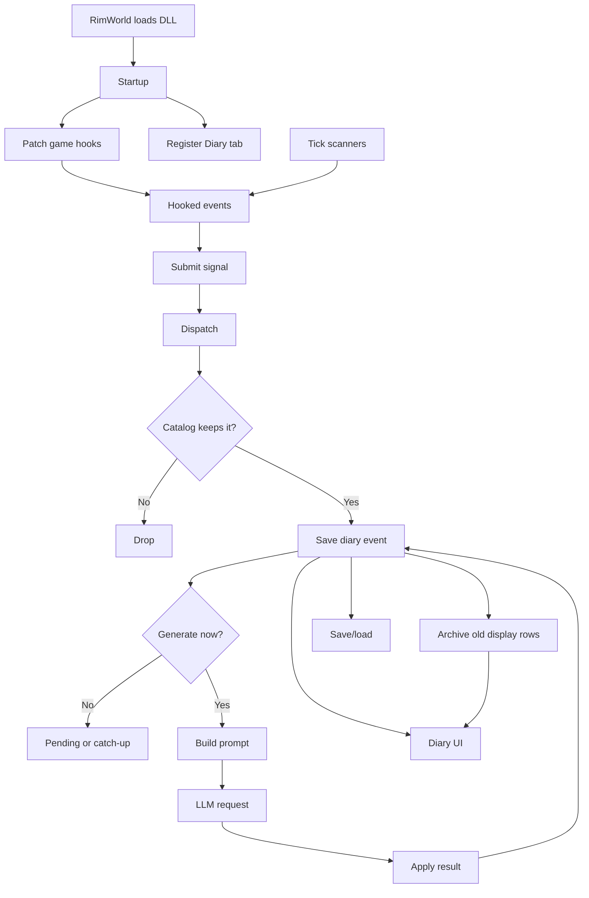

# Pawn Diary - Maintainer Guide

Last updated: 2026-07-01

Related files:

- `AGENTS.md`: detailed rules for code agents and deep architecture constraints.
- `EVENT_PROMPT_MAP.md`: event-to-prompt coverage map.
- `ARCHIVE_COMPACTION_DESIGN.md`: reviewed-before-code design for real cold archive compaction.
- `PAWN_ARC_REFLECTION_IMPLEMENTATION.md`: current progression and yearly life-arc reflection flow.
- `CHANGELOG.md`: milestone history.

## 1. Purpose

Pawn Diary records meaningful RimWorld colony moments and turns them into short diary pages through
configured OpenAI-compatible API lanes. RimWorld loads the compiled DLL at startup through Harmony
patches, Defs, a `GameComponent`, and an inspector tab. There is no `main()`.

Diary pages belong only to free humanlike colonists old enough for first-person writing
(`DiaryTuningDef.minimumFirstPersonAgeYears`, default 13). Animals, prisoners, slaves, enemies,
visitors, non-colonists, and underage colonists do not own pages. If only one participant is eligible,
the event becomes a solo entry. If two eligible colonists are involved, the initiator entry is
generated first and the recipient entry gets hidden continuity from it.

Arrivals and deaths are neutral boundary pages. Arrival pages introduce a pawn's diary and are forced
to the front of that pawn's saved event list; on a new game, non-arrival capture waits until founding
colonist arrivals have been recorded. Death pages end the diary and hide later same-tick events for
that pawn. If RimWorld resurrects the same saved pawn, the death page stays in history but stops
acting as a terminal boundary, so later diary pages can attach, generate, render, and compact normally
until another death occurs.

## 2. Repository Map

RimWorld loads `About/`, `1.6/`, `Languages/`, and the compiled DLL in
`1.6/Assemblies/PawnDiary.dll`. Source and tests are kept in the repo for development, but the
Workshop payload omits source code and other development-only folders.

| Path | Role |
|---|---|
| `About/` | Mod metadata, mod version, preview, icon, dependency declaration. |
| `1.6/Defs/` | XML-owned policy: event groups, tuning, prompts, styles, UI, text effects. |
| `Languages/` | Keyed and DefInjected English text plus optional translation sources. |
| `Source/Capture/` | Pure Event Catalog payloads and decisions. |
| `Source/Ingestion/` | `DiaryEvents.Submit` bus + one `DiarySignal` capture/emit class per source (impure edge). |
| `Source/Core/` | `DiaryGameComponent` partials: dispatch pipeline, save/load, scans, generation queue. |
| `Source/Generation/` | Runtime context builders, prompt adapters, LLM client, DLC-safe live reads. |
| `Source/Pipeline/` | Pure prompt planning, archive eligibility, progression/arc selection policy, request JSON, response cleanup, text decoration, API policy. |
| `Source/Patches/` | Harmony startup, domain hooks, inspect-tab/command patches. |
| `Source/Settings/` | Saved settings, API lane UI/controller, prompt/style editors, XML tuning/template override tabs. |
| `Source/UI/` | Diary inspect tab, card rendering, paging, formatting. |
| `tests/` | Standalone pure-helper test projects. |
| `prompt-lab/` | Prompt fixture and variant validation harness. |
| `scripts/publish.ps1` | Local Workshop payload prep. |

## 3. Runtime Flow

The mod is a loaded RimWorld library, not a standalone program. Startup, capture, generation,
storage, and UI are all framework callbacks around one saved `DiaryGameComponent`.

This is the top-level shape:



### 3.1 Startup

`DiaryModStartup` is the startup hook. RimWorld runs its static constructor when the DLL loads.

Startup does three jobs:

1. Apply normal Harmony patches.
2. Register fragile reflection patches through `DiaryPatchRegistrar`.
3. Inject the hidden Diary inspect tab onto humanlike pawn and corpse defs.

The Diary tab is hidden from the normal tab strip, but it must still be registered. The inspect
command, diary links, selected pawns, and selected corpses all open that same registered tab.

### 3.2 Capture And Dispatch

There are two ways events reach the diary system.

Harmony hooks submit one-shot events, such as social interactions, mental breaks, quests, raids,
deaths, arrivals, rituals, abilities, and thoughts.

`DiaryGameComponent` tick scans submit slower state-based events, such as work sampling, thought
progression, hediff progression, pawn progression, quest state recovery, day reflections, yearly arc
reflections, event windows, and observed conditions.

Both paths submit a `DiarySignal` through `DiaryEvents.Submit`. From there, every event uses the same
dispatcher path:

1. Confirm the game is in a recordable state.
2. Check `recentEvents` for deduplication.
3. Build a plain capture payload and `CaptureContext`.
4. Ask the pure Event Catalog whether to record, drop, batch, fan out, or route the event.
5. Emit the chosen diary event shape.

Live RimWorld objects stay in the signal adapters. The Event Catalog works on DTOs and primitive
context so its decisions remain testable without loading RimWorld.

### 3.3 Storage And Retention

Recorded events are saved as full hot `DiaryEvent` rows in `DiaryEventRepository`.

Each pawn has a `PawnDiaryRecord` containing references to the hot events that belong to that pawn.
Pair and shared events can therefore stay as one backing event while appearing in more than one
pawn's diary.

Retention keeps recent pages hot and moves old displayable POVs into compact `ArchivedDiaryEntry`
rows owned by `DiaryArchiveRepository`. Archived rows remain visible in the Diary tab, but they no
longer retry generation, receive title backfill, feed prompt continuity, or count as evidence for
day/quadrum reflection scans. Yearly arc reflections deliberately sample both hot and archived diary
pages as memory candidates, then de-duplicate by event ID so a shared hot/archive page appears once.

### 3.4 Generation

Generation starts only after an event exists in the saved hot store.

`DiaryPipelineAdapters` copy current settings, XML Def policy, localization, and live pawn facts
into pure pipeline contracts. Pure helpers then plan the prompt, build request JSON, parse provider
responses, clean generated text, and decide title behavior.

`LlmClient` owns the background HTTP work for OpenAI-compatible API lanes. It handles retries,
failover, cooldowns, timeouts, and session cancellation. Finished results return to the main thread,
where the matching `DiaryEvent` is updated with text, status, model metadata, titles, and unread
flags.

Completed LLM results are drained from both `GameComponentTick` and `GameComponentUpdate`. That means
requests already in flight can still finish while the game is paused.

### 3.5 Tick Work And Catch-Up

`GameComponentTick` always runs cheap game-time scans.

Expensive generation catch-up is demand-driven. Load catch-up, delayed raid pages, and orphaned
"writing..." recovery request a pass; the pass scans only the XML-tuned `activeScanEventWindow` hot
events, which defaults to 1000 events globally.

Pending LLM work itself is not saved. After load, only hot events still inside the active scan window
can be requeued.

First-person generation is skipped for pawns below the XML Consciousness floor. Neutral arrival and
death pages bypass that guard because they are boundary chronicle pages, not first-person writing.
Resurrected pawns reuse their existing `PawnDiaryRecord`; generation checks ignore an older death
boundary while the same pawn load ID is alive again.

### 3.6 Ingestion Bus (`DiaryEvents.Submit`)

Every captured event enters through `DiaryEvents.Submit(signal)` (`Source/Ingestion/`). A Harmony
hook or scanner builds the matching `DiarySignal` subclass and submits it; the dispatcher then runs
the universal path:

| Step | What happens |
|---|---|
| Guard | `CanRecordGameplayEventNow` rejects events when the game is not in normal play. |
| Starting-arrival flush | On new games, any non-arrival signal first tries to record founding-colonist arrivals, so the arrival page remains the first diary page even if a Harmony source fires early. |
| Dedup check | `recentEvents` rejects duplicate source keys before payload/context work runs. |
| Decide | `DiaryEventCatalog.Get(payload.EventType).Decide(payload, ctx)` applies pure XML-backed policy. |
| Dedup mark | The source key is marked only after the catalog keeps the event. |
| Emit | `signal.Emit(sink, decision)` creates the selected diary event shape and queues follow-up work. |

The dedup order is intentional. The check happens before `Decide`, so a duplicate does not build
context, run pure policy, or consume source-side random state. `AbilitySignal` depends on this because
its chance roll is read lazily from `Rand.Value`.

The mark happens after `Decide`. If the catalog drops an event, such as an ability that fails its
chance roll, the dedup window is not consumed.

A `DiarySignal` is the impure capture+emit half of one source. Pure decision data and game-context
formatting stay in `Source/Capture/Events/*EventData.cs`, covered by standalone tests where possible.
Colony-wide sources extend `DiaryFanoutSignal`.

For fan-out events, the dispatcher checks the colony key once. It then runs each per-pawn child
through the same path and marks the colony key only after at least one entry emits.

Every `DiaryEventType` now routes through this bus.

One-shot Harmony captures submit directly. Scanner and flush sources are still triggered by component
scans, but they also submit signals. A scan whose episode state depends on whether the entry recorded
can call `Dispatch` directly and read its `bool` result.

Adding a source means adding the hook or scanner, a signal, the catalog `Spec`, and XML policy.
Shared guard, dedup, decision, and emission glue stays in `Dispatch`.

The old per-source dedup dictionaries are gone. `recentEvents` stores the source-prefixed key, the
source's own dedup window, and the recorded tick. `Source/Capture/RecentEventExpiry.cs` owns the pure
expiry rule.

A short-window source cannot evict a still-live long-window key. A zero or negative window opts out
of dedup instead of clearing the store. The coverage table below lists each source's signal.

## 4. Event Sources

The catalog of every event the diary reacts to (`DiaryEventType`), with the `DiarySignal` that carries
it onto the bus.

| Event type | Observed by | Ingestion | Shape |
|---|---|---|---|
| Thought | `MemoryThoughtHandler.TryGainMemory` | `ThoughtSignal` | solo (+ ambient) |
| Inspiration | `InspirationHandler.TryStartInspiration` | `InspirationSignal` | solo |
| Ability | `Ability.Activate` overloads | `AbilitySignal` | solo (sampled) |
| Romance | `Pawn_RelationsTracker.AddDirectRelation` | `RomanceSignal` | pair |
| Raid | `IncidentWorker.TryExecute` | `RaidFanoutSignal` | fan-out |
| MoodEvent | `GameConditionManager.RegisterCondition` | `MoodEventFanoutSignal` | fan-out |
| MentalState | `MentalStateHandler.TryStartMentalState` | `MentalStateSignal` | pair + solo |
| Tale | `TaleRecorder.RecordTale` | `TaleSignal` | solo / batch / death |
| Hediff | `Pawn_HealthTracker.AddHediff` + scan | `HediffSignal` | solo / day-reflection |
| Interaction | `PlayLog.Add` | `InteractionSignal` | pair / solo / batch / ambient |
| Work | Periodic job sampling | `WorkSignal` (via work scan) | solo |
| ThoughtProgression | Periodic scan | `ThoughtProgressionSignal` (via scan) | solo |
| Progression | Periodic scan | `ProgressionSignal` (via scan) | solo |
| DayReflection | Sleep/rest flush | `DayReflectionSignal` (aggregation flush) | solo day/quadrum reflection |
| ArcReflection | Sleep/rest flush + major psylink/xenotype progression trigger | `ArcReflectionSignal` (memory aggregation flush) | solo yearly arc reflection |
| Quest | `Quest.Accept`/`End` + state scan | `QuestFanoutSignal` | fan-out |
| Ritual | Ideology/psychic ritual completion | `RitualFanoutSignal` / `PsychicRitualFanoutSignal` | fan-out |
| Death | `Pawn.Kill` + death TaleDefs | `DeathFallbackSignal` (+ Tale death routes) | neutral description |
| Arrival | Starting scan + `Pawn.SetFaction` | `ArrivalSignal` | neutral description |

| Source | How it is observed | Result |
|---|---|---|
| Social interactions | `PlayLog.Add` | Pair, solo, batched, or ambient note by XML group; optional batch promotion is scaled by the shared random-generation setting. |
| Mental states | `MentalStateHandler.TryStartMentalState` | Social fighting can be pairwise; other breaks are solo. |
| Romance | `Pawn_RelationsTracker.AddDirectRelation` | Pairwise lover/spouse/ex relation moments. |
| Tales and combat | `TaleRecorder.RecordTale` | Solo, pair, delayed combat batches, or death description. |
| Arrivals | Starting-colonist scan and `Pawn.SetFaction` | Neutral first page. |
| Deaths | `Pawn.Kill` plus XML death TaleDefs | Neutral final page. |
| Mood events | `GameConditionManager.RegisterCondition` | One entry per eligible colonist on affected maps. |
| Thoughts | `MemoryThoughtHandler.TryGainMemory` | XML-filtered memory entries; ambient thoughts can batch. |
| Thought progression | Periodic scan | Hunger, rest, outdoors, chemical, and similar worsening stages. |
| Pawn progression | Periodic scan | Passion-only skill milestones, psylink level gains, xenotype changes, and royal-title changes. The first scan baselines existing saves to avoid retroactive spam; major psylink/xenotype changes can request a rare arc reflection after the normal page records. |
| Inspirations | `InspirationHandler.TryStartInspiration` | Solo inspiration entry. |
| Hediffs | `Pawn_HealthTracker.AddHediff` and scan | Immediate or day-reflection health entries by XML policy, including string-matched Anomaly mental afflictions. |
| Work | Periodic current-job sampling | Non-social, non-violent work, controlled by XML odds/cooldowns and the shared random-generation setting. |
| Raids and infestations | `IncidentWorker.TryExecute` | Fan-out to eligible colonists; ordinary raids can delay generation. |
| Quests | `Quest.Accept`, `Quest.End`, defensive UI/state scan | Accepted quests are bookkeeping/event-window signals only. Completed and failed quest outcomes create shared-effort entries; prompt labels reject placeholder names and humanize code-like quest defNames. |
| Event windows | `IncidentWorker.TryExecute`, `Quest` lifecycle, `Thing.SpawnSetup`, `SignalAction_Letter`, `CompProximityLetter`, `Building_VoidMonolith.Activate`, `Pawn_AgeTracker.BirthdayBiological`, `Pawn_HealthTracker.AddHediff`, `PrisonBreakUtility.StartPrisonBreak` | XML starts/ends narrative windows or one-shot events, writes phase entries, and can bias prompts while active. |
| Observed conditions | Periodic live-state scan (map danger, active game conditions, evidence things, pawn hediffs) | Lasting states read from live state, not a guessed duration: bias prompts while present, optionally record start/end pages, and end after a debounce when live state stops showing them (Plan 12; see §5.1). |
| Rituals | Ideology and psychic ritual completion hooks | Fan-out by role/perspective when DLC content is active. |
| Abilities | `Ability.Activate` overloads | Cooldown-weighted caster entry, scaled by the shared random-generation setting. |
| Day reflections | Sleep/rest trigger | One reflective page per pawn/day when important signals exist. Near the end of a quadrum, a pawn with enough important entries may write one longer quadrum reflection instead; that skips the ordinary daily reflection for that night. |
| Arc reflections | Sleep/rest trigger and major psylink/xenotype progression trigger | Rare yearly life-arc page per pawn, with an optional second major-event page after the configured gap. The sleep/rest annual check is gated by `arcReflectionEnabled`, not by day summaries. It samples existing hot/archive diary pages from the current year, de-duplicates by event ID, excludes prior reflections/death descriptions/recently used memories, and never stores a separate history fact database. |

Hooks are grouped by domain under `Source/Patches/`. Fragile reflection targets register through
`DiaryPatchRegistrar` so missing methods warn and no-op instead of breaking startup. Capture hooks,
per-tick work, save/load bookkeeping, startup registration, and vanilla UI overlays isolate failures
with one-time logging and preserve vanilla behavior.

## 5. XML Policy

XML owns policy that designers should be able to change without recompiling.

| XML file | Owns |
|---|---|
| `DiaryInteractionGroupDefs.xml` | event classification, group instructions/tones, batching, hediff modes, colors, default enablement |
| `DiaryEventWindowDefs.xml` | one-shot or timed story windows from game signals |
| `DiaryObservedConditionDefs.xml` | live-state conditions such as map danger, game conditions, evidence things, and visible hediffs |
| `DiaryEventPromptDefs.xml` | event prompt text, enhancements, and optional forced model names |
| `DiaryPromptTemplateDefs.xml` / `DiaryPromptDef.xml` | prompt field shapes and shared system/final instructions |
| `DiaryPersonaDefs.xml` / `DiaryHediffPersonaOverrideDefs.xml` | writing styles and temporary hediff-driven style overrides |
| `DiaryPromptEnchantmentDefs.xml` / `DiaryHumorCueDefs.xml` | weighted live-context and hidden humor cues |
| `DiarySignalPolicyDefs.xml` / `DiaryTuningDef.xml` | scan intervals, odds, cooldowns, thresholds, reflection policy, fallback tuning |
| `DiaryUiStyleDef.xml` / `DiaryTextDecorationDefs.xml` | UI dimensions/colors and display-only rich-text decoration |

Interaction groups match by domain, exact `defName`, optional package id, and ordered token matchers.
Prefer exact names, `matchPrefixes`, `matchSuffixes`, and `matchSegments`; use legacy
substring-style `matchTokens` only when broad matching is truly intended. Lower `order` wins, so put
specific groups before broad groups. The pure matcher lives in `Source/Capture/GroupNameMatcher.cs`.

Event prompts resolve from narrow to broad: source defName, interaction group, classifier key, then
domain. Prompt text, enhancement text, and forced-model text resolve independently, so a narrow row can
override one field and inherit the others.

Progression policy is split the same way as other sources: `DiaryInteractionGroupDefs.xml` owns the
`Progression` and `Reflection` groups and their importance, `DiaryEventPromptDefs.xml` owns broad
progression/arc prompt guidance, `DiaryPromptTemplateDefs.xml` exposes progression fields and the
`SoloArcReflection` template, and `DiaryTuningDef.xml` owns milestones, psylink hediff defName
matchers, arc cadence, major-progression policy for psylink severity and configured xenotype
defNames, high-stakes arc memory tokens, and the memory-shortfall retry backoff.

Optional DLC or mod content should normally be handled as string matches. Do not hard-reference DLC
defs or C# types unless they are guarded as described in `AGENTS.md`. Missing DLC content should
simply never match.

Hediff policy has two separate knobs:

- `DiaryPromptEnchantmentDefs.xml` adds condition/status context to prompts.
- `DiaryHediffPersonaOverrideDefs.xml` can temporarily force the writing style.

If the same hediff wins a writing-style override, its matching prompt-enchantment cue is suppressed so
the condition is not repeated in both the style block and the `important context:` line.

Event windows are for one-shot signals and bounded story phases. A `DiaryEventWindowDef` can start,
end, time out, write phase pages, and add a weighted prompt candidate while it is active.
`keepActive=false` turns the start signal into a one-shot page. `recordScope=SubjectPawn` records only
the pawn carried by the signal.

Hot event-window paths use `EventWindowPolicy.CouldMatchByDefName` before resolving labels or doing
expensive work. Window recording is isolated from normal raid, quest, hediff, and other capture paths;
a window failure must not suppress the base diary entry.

### 5.1 Observed conditions (lasting game state, Plan 12)

Observed conditions are for lasting states that should be re-read from live game state instead of
guessed from a timeout. Examples: map danger, toxic fallout, solar flare, or observable Anomaly
evidence.

The flow is:

1. `DiaryGameComponent.ObservedConditions.cs` polls due `DiaryObservedConditionDef` rows.
2. Live state is copied into plain `ObservedConditionObservation` DTOs.
3. `ObservedConditionPolicy.Plan(...)` diffs observations against saved active rows.
4. The component persists `ActiveObservedConditionState` rows and optionally records start/end pages.

The pure policy lives under `Source/Capture/ObservedConditions/` and is covered by
`tests/DiaryObservedConditionTests`. Ticks only gate debounce. Truth always comes from the current
observation set, so loading a save mid-condition or missing an end signal self-corrects on the next
poll.

Observer types are DLC-safe:

- `MapDanger`: home-map danger rating or spawned hostile count.
- `GameCondition`: matching active game condition defName.
- `ThingPresent`: spawned observable things/filth via `ListerThings.ThingsOfDef`. A Def can also
  list `suppressWhenThingDefNames`; if any of those spawned thing defs are present on the same map,
  that Def reports no observation and the normal end-debounce path resolves its active state.
- `PawnHediff`: visible pawn hediffs only; hidden hediffs are skipped.
- `RecentEvidence`: reserved, currently no-op.

Prompt influence from lasting sources is age-aware. `DiaryEventWindowDef` and
`DiaryObservedConditionDef` both support `promptDecayTicks` and `promptDecayMinMultiplier`: as the
window/condition ages, its candidate weight fades toward the multiplier floor and any
`normalPromptWeightMultiplier` override relaxes back toward ordinary prompt-enchantment context.
Observed conditions also support `maxActiveTicks` and `restartCooldownTicks`, saved per condition
identity, so a condition can force-stop after a configured age and then avoid immediately restarting
if its original evidence lingers.

Shipped notable defs:

- `MapThreatActive`, `ToxicFalloutActive`, `SolarFlareActive`: prompt-tone only.
- `AnomalyGrayFleshEvidence`: records the observable Anomaly sample but hides the item label from
  prompts; the LLM-facing wording frames it as paranoia and fear that something may infect and
  imitate people. It decays over time, is suppressed once a visible metalhorror or metalhorror debris
  appears, and force-stops with a restart cooldown if no emergence happens, so lingering evidence
  cannot keep or immediately reactivate suspicion forever.
- `MetalhorrorEmergence`: enabled map-scoped observer for the spawned visible `Metalhorror` ThingDef.

Page recording is transactional: start/end state is committed only after a page is actually written.
`ConfigErrors` rejects `recordScope=SubjectPawn` unless `scope=Pawn`.

## 6. Prompts And Writing Styles

Prompts are compact `key: value` lines. Empty values and `none`/`n/a`/`unknown` sentinels are dropped.
Templates cover solo, pair, batch, day reflection, quadrum reflection, neutral arrival/death, and
title requests.

Prompt policy layers:

1. Shared system prompts from `DiaryPromptDef`.
2. Structured fields from `DiaryPromptTemplateDef`.
3. Event prompt/enhancement/forced-model rows from `DiaryEventPromptDef`.
4. Interaction-group instructions and tones.
5. Writing style from the pawn's saved `DiaryPersonaDef`, unless temporarily overridden by hediff.
6. Optional prompt enchantments, event windows, observed conditions, and humor cues.

Prompt Studio can override shared system prompts and per-event prompt/enhancement/forced-model text.
Saved override keys must stay stable because they are part of mod settings.

Quest prompts are deliberately sanitized. The raw quest defName stays in saved context for UI/domain
classification, but model-facing fields use labels, signals, factions, and rewards. Accepted quests
do not generate diary pages; completed and failed outcomes fan out as shared colony effort.

Writing styles are backed by `DiaryPersonaDef`. Some code and save fields still say "persona" for
compatibility, but player-facing text should call them writing styles. Hediff style overrides are
prompt-time only and never change the saved picker value.

Prompt enchantments add one weighted live-context cue to eligible first-person prompts. Event windows
and observed conditions feed the same planner, so active threats can bias otherwise unrelated diary
pages until they close. `normalPromptWeightMultiplier` can dampen ordinary health/mood context.
When an active hediff forces a temporary writing-style override, all hediffs matched by any active
persona-override rule are suppressed from the prompt-enchantment pool so the same condition does not
arrive once as style and again as "important context."

First-person prompts also receive two compact continuity hints from the pawn's previous page when one
exists. `LastOpener` is the first sentence and is labeled as an opening to avoid repeating;
`PreviousEntryEnding` is the XML-tuned final sentence excerpt (`previousEntryEndingSentenceCount`,
`previousEntryEndingMaxChars`) and is labeled for continuation. Both are captured as plain strings on
the new `DiaryEvent`; arrival/death boundary pages use their neutral display role when they are the
previous page.

Imported game/mod text is flattened and capped before it reaches the model. This applies to live
hediff descriptions, labels, titles/roles, scenario text, and quest descriptions. Pawn Diary's own
XML/Keyed prompt text, field labels, writing styles, and humor cues are not sentence-capped by that
guard.

Starting-colonist arrival prompts are the exception for pawn backstories: the founding arrival
context includes each pawn's childhood and adulthood title, full in-game backstory description, and
compact mechanical effects (skill bonuses, disabled work/tasks/tags, required tags, and
forced/disallowed traits). These backstory descriptions are flattened to one prompt-safe line and
semicolon-stripped so they stay inside the saved arrival field, but they are not sentence-capped; the
arrival instruction asks the model to connect those facts with the starting scenario to explain how
the pawn plausibly reached that beginning.

Direct speech is allowed only in selected first-person interaction prompts, and only inside a closed
`[[speech]]...[[/speech]]` block. Generated Social-log speech injection remains disabled/hidden; the
saved setting exists only for compatibility.

Title generation is enabled by default. Main entries queue their own title request after successful
generation. The broad missing-title sweep runs after load or settings save, not every generation
scan. Bad title responses are rejected and fall back to the opening words of the finished entry.

## 7. Settings And UI

The settings window is split into **Main**, **Prompts**, **Styles**, and **Tuning** tabs. Main covers
API lanes, routing mode, request tuning, title generation, atmospheric formatting, prompt
enchantments, one shared random-generation weight for optional chance-gated pages, and diary-event
retention caps. Dev mode exposes prompt-test mode and extra diagnostics in settings; bulk export
lives in RimWorld's Debug Actions menu. The export writes every saved hot page, compact archived
page, archive-only orphan row, and backing event record to `PawnDiaryExports/` under RimWorld's
save-data folder, and copies the generated file path to the clipboard.

Prompts is the single home for prompt text editing. Its **Shared/event prompts** subpage edits the
four shared system prompts plus per-event prompt/enhancement/forced-model overrides. Its prompt-type
picker uses compact labels and keeps internal event keys out of the visible menu. Its
**Prompt policy and weights** subpage exposes prompt-related XML from `DiaryPromptDef`,
`DiaryPromptTemplateDef`, `DiaryPromptEnchantmentDef`, `DiaryHumorCueDef`,
`DiaryEventWindowDef`, `DiaryObservedConditionDef`, `DiaryInteractionGroupDef`, and
`DiaryHediffPersonaOverrideDef`. That includes template prompt text, final instructions,
template field lists, include/exclude prompt switches, per-template token caps, prompt cue text,
prompt weights, event-window/observed-condition prompt biasing and decay, observed-condition
force-stop/cooldown/suppression/evidence-label caps, group instructions/tone variants,
batch/promotion weights, humor cue rules/weights, and hediff-driven writing-style override policy.
Template prompt text boxes are raw per-template overrides; blank means "inherit" and intentionally
stays blank so Shared/event prompts remains the only place that displays shared system prompt text.
Prompt-policy fields that are backed by translation keys display the resolved text and write literal
override fields (`*Text`, `conditionLabel`, cue lists) instead of asking players to edit raw key names.
Styles is the writing-style editor for `DiaryPersonaDef` labels, rules, and theme tags.

Tuning is the low-level XML parameter editor. Tuning and the Prompt tab's policy/weights subpage share
a compact two-pane editor: a left rail of groups and a right body that draws one widget per field type
-- checkbox, slider, numeric text, single-line text, or multi-line text/list/table area -- with
per-field and per-group reset, accent coloring for customized values, a name filter that flattens the
rail into a search view, and rich tooltips that combine authored help with the live value, XML default,
range, and customized status. Tuning contains XML-owned parameters (dedup windows, ability sampling,
surroundings, weather chances, ritual quality labels, mood-condition families, health/enchantment
thresholds, mood/pain/opinion buckets, thought token lists, thought progression rules, scanner
intervals, work sampling, day/quadrum/arc reflection weights, signal policies, context reactions).
Field labels span the full row width so long names never clip. The catalog (`AdvancedFieldCatalog`)
is declarative and drives both the UI and the runtime override seam. Static tuning fields build during
settings load; Def-backed prompt-policy groups are appended lazily after `DefDatabase` has loaded, so
dynamic groups such as humor cues cannot be cached empty by early settings deserialization.

Overrides persist per player in `TuningOverrideStore` (a typed twin of `PromptOverrideDictionary`) and
take effect immediately by writing straight into the live Def instance fields via cached reflection or
small custom accessors for nested policy objects. Every existing `DiaryTuning.Current.field` /
`def.field` reader picks the new value up with no call-site changes; pristine XML defaults are
snapshotted once before the first override so Reset can restore them (signal/context `-1` "inherit
tuning" sentinels and `<null>` list inheritance markers are preserved). Prompt text overrides use the
same `{0}`, `{1}` placeholder convention as Keyed strings; cue lists use one item per line and accept
`<null>` to suppress configured cue rows. Compact tables use these line formats: `WeatherDef=chance`,
`maxExclusive=ritualQualityLabel`, `enabled|label|source|contextKey` for prompt fields,
`level|chance|frequency|weight|severity` for prompt-enchantment severity tiers, and
`category|ThoughtDef|stageIndex:severity,...` for thought progression rules. Structural non-prompt UI
and text-decoration XML remains XML-only.

The Diary UI is an inspect tab registered for humanlike pawns and their corpse defs. By default it
appears in the pawn inspect-tab row for eligible colonists and selected colonist corpses. A setting can
instead hide the tab and add a bottom command button that opens the same UI. Programmatic opens from
that command, Social-log links, and linked-entry cards temporarily expose the hidden tab long enough
for RimWorld's inspect-pane opener to resolve it, then clear that state when the tab closes. The
inspect-tab draw path and programmatic open helper also re-apply tab registration once after startup,
covering load orders where RimWorld finalizes resolved tab lists after static constructors. The
command helper is marked with RimWorld's `StaticConstructorOnStartup` because it owns the static Unity
texture cache for the button icon; the icon itself still loads lazily from the main-thread gizmo path
and falls back to the vanilla book icon if the mod texture is missing.
When a selected pawn has unread generated pages, inspect-tab mode draws the XML-tuned unread marker at
the top middle of the Diary tab; its configured width is clamped to remain inside the vanilla tab.

Production UI shows completed pages. Each expanded non-archived page has a muted rewrite icon beside
the model/provenance footer, so players can regenerate that page with the current model routing;
pairwise pages rewrite both POVs when both are still eligible. Dev mode also shows pending/failure
rows, raw prompt/status data, and copy buttons. Bulk dev actions live under RimWorld's Debug Actions
menu as `Pawn Diary > Event test panel...`, which opens a sectioned dev panel for selecting a test
pawn and partner. The same debug category also exposes
`Pawn Diary > Export all diary pages...` for full hot/archive text export and
`Pawn Diary > Purge archived entries for pawn...` for direct per-pawn cleanup. The panel has separate
Events, Diary, and Fixtures sections and owns the former Diary tab action strip: a mock-page filler,
per-pawn archive purge, the per-pawn persona picker, transient formatting preview buttons, real
vanilla gameplay triggers, and prompt-only fixture batch/clear tools. Buttons that mutate or delete
save data use the XML-owned danger tint. The selected pawn,
partner, active section, per-section scroll, selected trigger Def names, and selected fixture IDs are
saved on `DiaryGameComponent`, so the panel state survives closing/reopening and normal save/load.
Real trigger buttons cover paths that Pawn Diary patches, such as thoughts, inspirations, mental
states, tales, hediffs, map conditions, social play-log entries, romance relations, arrivals, deaths,
raids, quests, abilities, and the scanner-based work/day-summary flows. In the Events section,
Def-backed rows are direct buttons: left-click fires the shown Def, and right-click opens the Def
selector for memory thought, inspiration, mental state, tale, hediff, game condition, interaction,
relation, incident, quest script, and pawn ability; the row title mirrors the selected menu label
after a selector choice is committed. Preview
buttons open the selected pawn's Diary tab only to display the transient card; they do not save diary
events. The prompt-only section uses the same synthetic fixture registry as the old Diary tab
prompt-suite controls, but can create a selected prompt-test batch at once and can clear all
prompt-suite entries afterward. The mock
filler seeds 6,000 saved pages over 3
in-game years (about 2,000 pages per year) without calling the LLM, and dev-mode retention skips
mock stress histories so autosaves do not immediately shrink the fixture. Histories page by in-game
year; newest cards start expanded. Long histories are kept cheap by the active-event cap,
visible-entry caching, sliced main-thread year indexing, cached virtual row offsets/heights, and
viewport drawing that only emits cards inside the scroll slice plus the XML-tuned overscan buffer
(`virtualizedEntryOverscanHeight`, default 800 pixels above and below the viewport). The sliced indexer
uses `uiHistoryScanMaxEventsPerFrame` and `uiHistoryScanFrameBudgetSeconds` for year indexing,
selected-year card materialization, and selected-year row layout, so opening a pawn with thousands of
pages shows a loading panel instead of freezing the game. The loading panel reports the active load
phase only when no usable cached list exists yet: first open, uncached pawn switch, or opening a year
with no cached cards. The tab keeps a small LRU of loaded pawn views so returning to a recent pawn
restores its visible list instead of rebuilding from zero. Same-pawn index refreshes and selected-year
card refreshes build quietly behind the currently visible list; the full-tab index loading gate is
based on the absence of a cached year index, not on the selected-year card-loading flag, so pagination
cannot make a quiet refresh flash the blocking loading panel. Once a year is visible, same-year data
and layout refreshes, including completed generation/title updates, scroll, highlight refreshes, and
collapse/expand, rebuild row offsets in place instead of returning to the loading panel; loaded large
years seed the clicked card's current blend so the clicked card can still animate open or closed.
Expanded-card height measurement is isolated in `DiaryEntryCardMeasurer`, which owns the wrapped-text
height cache and invalidates it on card width, debug display, render token, and pawn-name highlight
revision. Expanded-card drawing is routed through a renderer request in
`ITab_Pawn_Diary.EntryCards.cs`, leaving selection, scroll, sliced layout, and expansion state in the
inspect tab while keeping the Verse/Unity IMGUI measurement and draw paths together.
Selected-year rebuilds invalidate row layout defensively so virtualized row offset
arrays cannot be reused against a changed list. An in-progress sliced build (year index, selected-year
cards, or row layout) is invalidated only by a STRUCTURAL change — a different pawn, a tab filter
toggle, or a different event count — never by a `DiaryStateVersion` tick. That counter is process-wide,
so it advances whenever any pawn's entry status/text/title changes anywhere in the colony; tying the
build identity to it made active generation reset an in-progress scan to event zero on every tick, so
a large history could never finish loading. Letting each scan complete once started keeps switching
responsive under generation; the completed index quietly refreshes behind the visible list to pick up
the new state within a few frames. Per-event work in those sliced scans is kept cheap by
`DiaryContextFields`: each indexed event and each materialized card calls it several times (arrival
and death bounds checks, status reads, and source-domain recovery, which probes up to ~13 markers).
It scans the context string in place and allocates only when a value is returned, so the common
"key absent" path is allocation-free — important because the per-frame time budget would otherwise
run out after only a couple of entries, making a long history take many seconds to load. The tab indexer does not perform the older
cross-colony arrival-page fallback scan while opening; it scans the selected pawn's saved diary
references once, resumes selected-year loading across frames, skips any bad/stale entry with a
one-time log, then slices the selected year's card and layout work. Inspect-tab and command badges
do not touch saved diary records during pawn
selection; they read a transient per-pawn status cache. The new-page badge is backed by a saved
per-pawn unread flag that is set when main LLM text finishes and cleared when that pawn's Diary tab
opens, while writing dots reuse cached pending counts after the Diary tab finishes its sliced load.
Archived pages use the same cards and dev copy controls as hot pages, but the normal rewrite icon is
hidden because compact archive rows intentionally discard prompt/raw-response/retry state.

`DiaryTextFormat` escapes raw model rich text before applying safe formatting. Display-only text
decorations and pawn-name highlights happen at render time; generated text is not mutated on save.

## 8. API And Reliability

Each enabled endpoint/model/mode/auth row is an API lane. Supported request modes are OpenAI-compatible
Chat Completions and OpenAI Responses. Auth can be bearer, no auth, custom API-key header, or `key=`
query parameter. Logs strip secrets and query strings.

Routing modes are Balanced, Prefer top rows, and Failover only. A `DiaryEventPromptDef.forcedModel`
can try a matching active model first; blank, unknown, disabled, or failed forced lanes fall back to
normal routing. Recipient follow-ups and title requests try to pin to the previous successful lane.
The shipped `QuadrumReflection` and `ArcReflection` prompt rows can use the same forced-model field
for rare long reflections.

`LlmClient` handles concurrency, per-lane cooldowns, transient retries, timeout/permanent failures,
session cancellation on new game/load, and result handoff to the main thread. `LlmResponseParser`
supports Chat and Responses output shapes, strips reasoning/transcript leaks, normalizes or removes
malformed speech markers (including common `speach` typos and incomplete bracket tags), removes
model-leaked Unity rich-text angle tags, and trims saved text locally.

## 9. Save Data And Compatibility

`DiaryGameComponent.ExposeData` owns the top-level save shape.

| Scribe key | Contents |
|---|---|
| `diaries` | per-pawn `PawnDiaryRecord` rows |
| `diaryEvents` | hot full `DiaryEvent` rows |
| `diaryArchiveEntries` | compact display-only `ArchivedDiaryEntry` rows |
| `activeEventWindows` | currently active XML event windows |
| `activeObservedConditions` | currently active live-state observed conditions |
| `observedConditionCooldownUntilTick` | saved restart cooldowns for ended observed-condition identities |

Hot events and archive rows are separate on purpose. Hot `DiaryEvent` rows keep prompts, retry state,
raw/generated text, status, LLM metadata, titles, context, source ids, and per-role state. Compact
archive rows keep only what the Diary UI needs to render an old page.

History retention is per pawn:

- `maxActiveDiaryEvents` keeps each pawn's newest hot refs. The key name is historical and must not be
  renamed.
- `maxArchivedDiaryEvents` keeps each pawn's newest compact archive rows. A value of `0` purges old
  compact pages once they fall out of the hot set.
- Shared pair events remain hot until every linked pawn has either kept or archived its POV.
- Pending/not-generated hot refs are not destroyed just because the pawn is over the active cap.
- A death boundary is terminal for retention only while the same pawn load ID is not alive. After
  resurrection, post-death refs are retained/archived like ordinary in-bounds pages.

`DiaryTuningDef.activeScanEventWindow` is a separate XML-only global hot-event window. It controls
retry, title catch-up, orphan recovery, work cooldowns, prompt continuity, opener history, and
previous-ending history, and day/quadrum evidence scans. Compact archive rows never enter those
scans.

`PawnDiaryRecord` also owns nullable per-pawn progression state and arc schedule state. Old saves load
with those fields absent, then normalize to empty baseline-pending state. The progression state stores
only highest passion-skill milestones and last observed psylink/xenotype/royal-title values. The arc
schedule stores only cadence bookkeeping (`lastArcEntryTick`, `lastArcEntryYear`,
`arcEntriesThisYear`, `forcedArcYear`, recently used memory ids, and the last retryable
memory-shortfall tick/year). Neither field is a history database; existing diary pages remain the
source of truth for reflections.

Failed/stale pages can be archived as displayable fallbacks. The fallback body/title is resolved
before compaction because the archive drops raw prompt data. Prompt-only dev capture rows stay hot for
the same reason.

Adding Pawn Diary to an existing save is safe; it records future events only. Removing the mod is
gameplay-safe because it does not attach custom components or gameplay defs to vanilla pawns/maps. The
diary UI/history disappears without the mod.

### 9a. Scribe-key stability contract

Every string passed to `Scribe_Values.Look` or `Scribe_Collections.Look` is stable save-format API.
Renaming a key silently makes old saves load defaults instead of player data.

Before touching save keys, read:

- `DiaryEvent.ExposeData`, `ScribePawnSlot`, and `ScribeNeutralSlot`.
- `ArchivedDiaryEntry.ExposeData`.
- `DiaryGameComponent.ExposeData`.
- `PawnDiarySettings.ExposeData`, plus `PersonaPresetStore` and `PromptOverrideDictionary`.

Do not rename historical flat POV keys such as `initiator*`, `recipient*`, or `neutral*`. Do not
rename `maxActiveDiaryEvents`; the meaning changed to per-pawn hot refs, but the saved key remains
the compatibility bridge.

### 9b. Post-load repair, and where it is tested

Loaded data is normalized in `LoadSaveMode.PostLoadInit`; code should not assume loaded strings,
lists, statuses, indexes, or refs are valid.

Pure repair lives in:

- `Source/Pipeline/DiarySaveNormalization.cs`
- `Source/Pipeline/DiaryGenerationStatus.cs`
- `tests/DiarySaveNormalizationTests/`
- related status fixtures in `tests/DiaryPipelineTests/`

Impure repair stays on save models: GUID minting, `DefDatabase`-based color-cue recovery, index
rebuilds, and the Scribe round trip. Run `tests/SAVE_COMPATIBILITY_SMOKETEST.md` when changing
`ExposeData`, saved settings, or Scribe keys.

### 9c. Allowed migration pattern

Only rename a Scribe key for an intentional format migration:

1. Keep reading the **old** key during a transition window so existing saves load.
2. On load, if the old key is present and the new key is absent, copy the value across.
3. Write only the new key on save.
4. Document the rename, the window, and the removal date in `CHANGELOG.md` and this section.

Never rename a key "for cleanliness" alone.

## 10. Runtime And DLC Constraints

- Runtime is RimWorld's Unity Mono. Use only assemblies available in `RimWorldWin64_Data/Managed`
  plus the bundled/declared Harmony dependency.
- JSON uses `Source/Util/MiniJson.cs`. Do not add `System.Web.Extensions` or external JSON libraries.
- Harmony is declared in `About/About.xml`; runtime and build copies of `0Harmony.dll` are kept in
  `1.6/Assemblies/` and `Source/Libs/`.
- No paid DLC is required. Optional DLC data must no-op cleanly when absent.
- DLC pawn data belongs in `DlcContext`, guarded by `ModsConfig.<Dlc>Active` and null checks.
- Avoid `DefDatabase<T>.GetNamed("DlcDef")` for optional content; use string matching or
  `GetNamedSilentFail`.

## 11. Localization

Player-facing UI strings and natural-language prompt text must be localizable.

Use:

- Keyed strings in `Languages/English/Keyed/PawnDiary.xml` for code-owned UI/prompt text.
- `.Translate()` only on the main thread.
- DefInjected text for XML Def labels, instructions, tones, prompts, personas, templates, and cues.

Do not translate or localize:

- internal prompt/context schema keys such as `thought=`;
- role/status/sentinel tokens such as `initiator`, `recipient`, `neutral`, `none`, `n/a`, `unknown`;
- defNames, API model ids, and saved context keys;
- background-thread `LlmClient` strings, because `.Translate()` is not thread-safe there.

When editing XML Def text:

- Keep English DefInjected stubs in sync.
- Use fully qualified custom-Def folders, such as
  `Languages/English/DefInjected/PawnDiary.DiaryInteractionGroupDef/`.
- Keep indexed variant pools aligned; avoid blank list entries that shift keys such as
  `<group.instructions.0>`.
- Add or update the matching Russian key/file at the same time.

The in-game Prompt policy editor shows resolved text for key-backed fields and stores literal
per-player overrides in `*Text`/cue fields. Those overrides are for player settings only; XML/Keyed and
DefInjected entries remain the source that translators must keep aligned.

Russian lives in `Languages/Russian (Русский)/` and mirrors the English Keyed + DefInjected layout.
Use `Languages/Russian (Русский)/GLOSSARY.md` for game terms. Russian UI should stay compact for
RimWorld's narrow settings/tab surfaces, avoid unexplained English calques, and keep protocol/product
tokens such as `API`, `OpenAI`, `URL`, `Bearer`, `XML`, and `UTF-8` only where they name the actual
thing.

Russian prompt prose should be idiomatic, not literal English. For placeholders, avoid making a
dynamic pawn/target/work value the subject of gendered or numbered past-tense grammar unless the code
guarantees agreement. Writing styles and humor cues should be culturally rebuilt in Russian rather
than line-by-line translations.

Reflection/progression changes usually touch more than `Keyed/PawnDiary.xml`: keep the matching
`DiaryEventPromptDef`, `DiaryPromptTemplateDef`, and `DiaryInteractionGroupDef` DefInjected files in
English and Russian aligned so long LLM prompt text never falls back to English in Russian games.

## 12. Build, Tests, Prompt Lab

Build:

```powershell
MSBuild Source\PawnDiary.csproj /t:Build /p:Configuration=Debug
```

If `MSBuild` is not on `PATH`, use Visual Studio Developer PowerShell or locate it with `vswhere`.
The Debug build writes `1.6/Assemblies/PawnDiary.dll`, which is committed on purpose.

Pure tests:

```powershell
dotnet run --project tests/LlmResponseParserTests/LlmResponseParserTests.csproj
dotnet run --project tests/DiaryRetentionTests/DiaryRetentionTests.csproj
dotnet run --project tests/DiaryPipelineTests/DiaryPipelineTests.csproj
dotnet run --project tests/DiaryTextDecorationTests/DiaryTextDecorationTests.csproj
dotnet run --project tests/DiaryCapturePolicyTests/DiaryCapturePolicyTests.csproj
dotnet run --project tests/PromptVariantsTests/PromptVariantsTests.csproj
dotnet run --project tests/DiarySaveNormalizationTests/DiarySaveNormalizationTests.csproj
dotnet run --project tests/DiaryObservedConditionTests/DiaryObservedConditionTests.csproj
```

Prompt lab:

```powershell
cd prompt-lab
npm test
npm run from-defs
node run.js --from-defs --save --model <model-name>
node run.js --all-variants --passes 2 --save --no-title --model <model-name>
```

Live hook checks use a disposable save, dev mode, prompt-test mode, and RimBridge/GABS. RimWorld dev
mode's Debug Actions menu exposes `Pawn Diary > Event test panel...` for common real trigger paths
`Pawn Diary > Export all diary pages...` for UTF-8 export, and
`Pawn Diary > Purge archived entries for pawn...` for a direct pawn picker that clears only that
pawn's compact archived pages. In the event panel, select an eligible colonist, optionally select a
partner, open the Events section, left-click a Def-backed row to trigger it, or right-click it first
to choose a different Def; the row title updates to the selected menu label. Red buttons deliberately
mutate the disposable save, such as spawning a
recruit, killing a test colonist, creating a raid, or
accepting/completing a sample quest. For Diary UI stress checks, use the same panel's Diary section to
fill mock pages, switch personas, or open transient card previews. For prompt shape checks that do not
need a real gameplay trigger, use the Fixtures section and generate all or selected fixtures for an
eligible colonist. Prompt-test mode intercepts only after an event reaches
`QueuePrompt`; a successful capture logs:

```text
[PawnDiary debug] Captured prompt without generation event=<id> role=<role>
```

Release payloads are prepared with:

```powershell
scripts\publish.ps1
```

The source `About/About.xml` carries the mod's `<modVersion>` (`0.1.0` at introduction). The publish
script stamps that value into the generated main and Russian localization `About.xml` files; pass
`-Version <value>` to override the release payload version without editing source metadata.

The script builds a throwaway Release DLL, copies runnable mod files, runtime textures, and reference
docs into `dist/<published packageId>`, and installs the payloads into the detected RimWorld `Mods`
folder through junctions by default. The published payload keeps `README.md`, `DOCUMENTATION.md`,
`CHANGELOG.md`, `EVENT_PROMPT_MAP.md`, and any license file, but intentionally excludes `Source/`,
`tests/`, `prompt-lab/`, and other development-only files. Pass `-InstallToMods:$false` to prepare
`dist/` only.

Russian is packaged as a separate Workshop localization mod by default. The script produces the
normal main payload plus `dist/<published packageId>.russian`; the main payload excludes
`Languages/Russian (Русский)/`. The localization payload contains only its own translated Russian
`About/` metadata, `About/Preview-Russian.png` copied as the Workshop `Preview.png`, and the Russian
language folder. It declares a dependency/load-after on the main published packageId, uses packageId
`<published packageId>.russian` unless overridden with `-RussianLocalizationPackageId`, and installs
its own junction next to the main mod junction. Before updating an existing localization Workshop
item, either pass `-RussianLocalizationPublishedFileId <id>` or store that id in
`About/PublishedFileId-Russian.txt`; the script copies it into the localization payload as
`About/PublishedFileId.txt`. Use `-SplitRussianLocalization:$false` or
`-IncludeRussianInMainPayload` only for a legacy bundled-language payload.

## 13. When Changing The Mod

- Follow `AGENTS.md` for detailed architecture, DLC, localization, and validation rules.
- Keep tunable policy in XML when possible.
- Keep live RimWorld objects at adapter/UI/transport edges; pure helpers should use DTOs/primitives.
- Add or update focused pure tests when changing pure logic.
- Update `DOCUMENTATION.md` and `CHANGELOG.md` for behavior, structure, release, or workflow changes.
