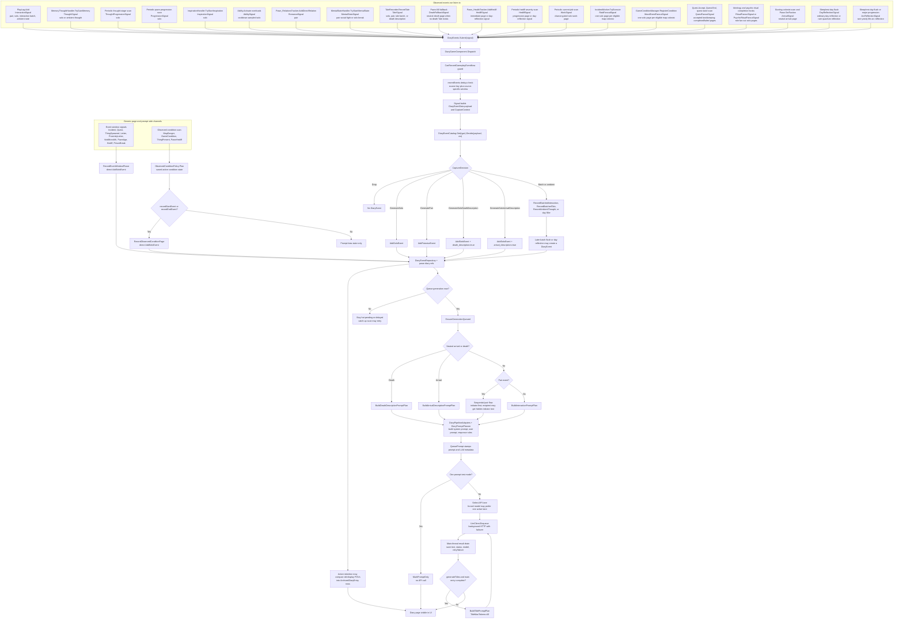
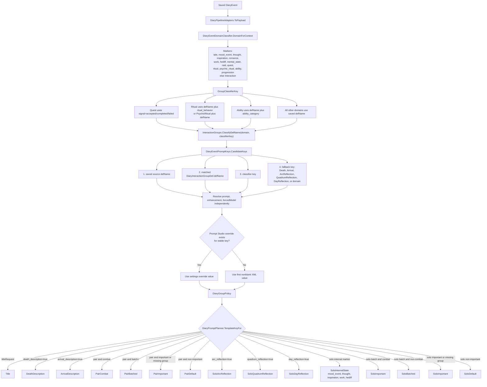
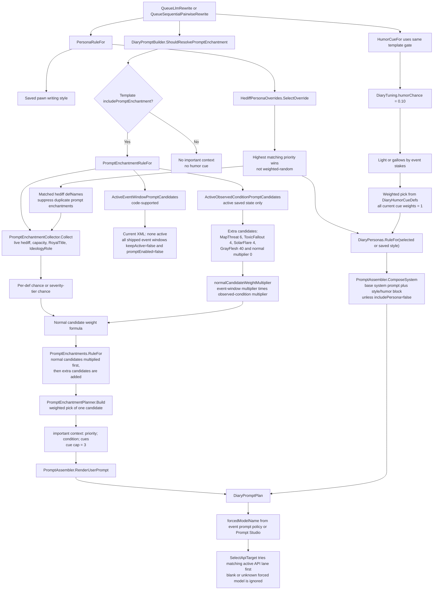
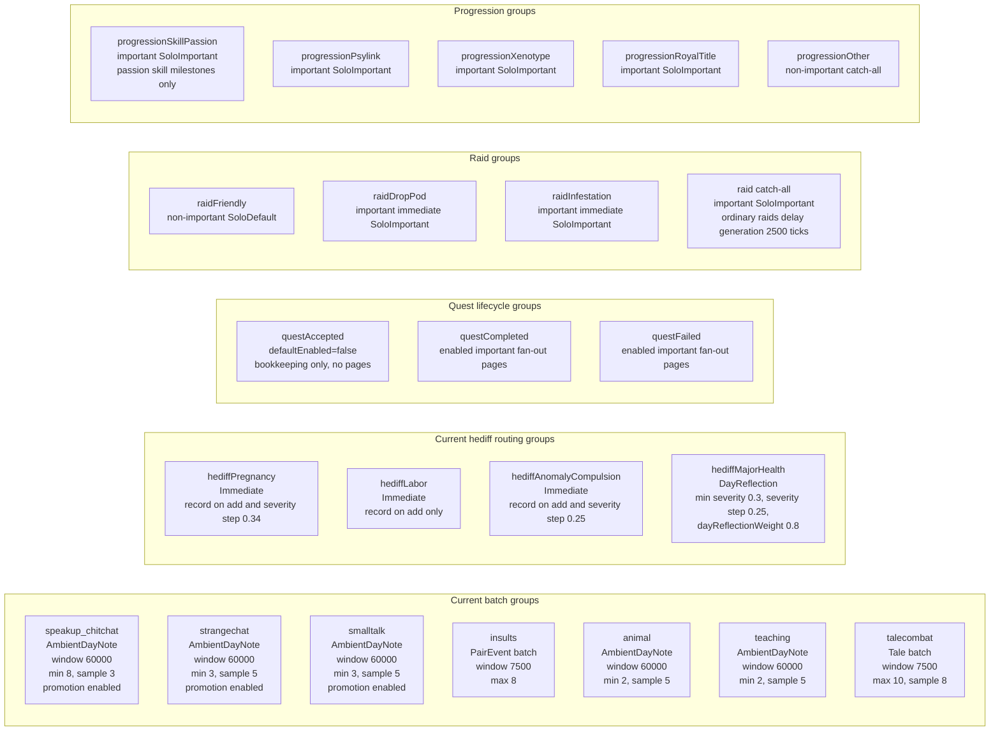
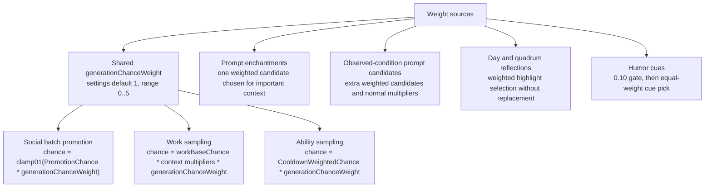
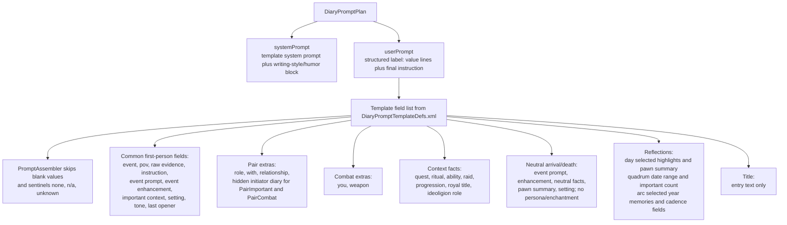

# Event To Prompt Mermaid Map

Current-state reference for how Pawn Diary turns observed RimWorld moments into promptable diary
items. This file describes the shipped code and XML only.

Authoritative sources:

- `Source/Ingestion/`: event signals and fan-out signals.
- `Source/Capture/Events/`: pure capture decisions and game-context formats.
- `Source/Core/DiaryGameComponent.*.cs`: dispatch, event creation, prompt queuing, scans, event
  windows, observed conditions, and day/quadrum reflections.
- `Source/Generation/DiaryPipelineAdapters.cs`: runtime/XML/localization adapter into prompt DTOs.
- `Source/Pipeline/DiaryPromptPlanner.cs`: pure template selection and prompt planning.
- `Source/Generation/PromptEnchantments.cs` and `Source/Pipeline/PromptEnchantmentPlanner.cs`:
  prompt-enchantment collection, weighting, suppression, and final selection.
- `1.6/Defs/DiaryInteractionGroupDefs.xml`: event groups, importance, combat, instructions, tones,
  batching, social promotion, hediff routing.
- `1.6/Defs/DiaryEventPromptDefs.xml`: event prompt/enhancement/forced-model rows.
- `1.6/Defs/DiaryPromptTemplateDefs.xml`: rendered prompt templates and fields.
- `1.6/Defs/DiaryPromptEnchantmentDefs.xml`, `DiaryHediffPersonaOverrideDefs.xml`,
  `DiaryEventWindowDefs.xml`, `DiaryObservedConditionDefs.xml`, `DiaryHumorCueDefs.xml`,
  `DiaryTuningDef.xml`, and `DiarySignalPolicyDefs.xml`: side-channel prompt context and weights.

## 1. End-To-End Diary Item Flow

Important boundaries in the diagram:

- `DiaryEvents.Submit` is the bus for catalog sources. Event-window and observed-condition page
  recording bypass the bus after their own generic policy has matched; they still create normal
  `DiaryEvent` records and use the same generation path.
- Event-window pages save `event_window=` context. Observed-condition pages save
  `observed_condition=` context. Those markers are not separate prompt domains today, so generated
  pages from those systems use the saved defName plus the normal Interaction fallback unless a more
  specific group or event-prompt row is added.
- Accepted quest signals are listened to and stored for bookkeeping/event-window policy, but current
  capture policy does not generate accepted quest diary pages. Completed and failed quest signals do.

## 2. Prompt Policy And Template Selection

Current shipped event-prompt rows in `DiaryEventPromptDefs.xml`:

| Event prompt row | Key | Prompt | Enhancement | Forced model in XML |
|---|---:|---:|---:|---:|
| `DiaryEventPrompt_Interaction` | `Interaction` | yes | yes | blank |
| `DiaryEventPrompt_MentalState` | `MentalState` | yes | yes | blank |
| `DiaryEventPrompt_Tale` | `Tale` | yes | yes | blank |
| `DiaryEventPrompt_MoodEvent` | `MoodEvent` | yes | yes | blank |
| `DiaryEventPrompt_Thought` | `Thought` | yes | yes | blank |
| `DiaryEventPrompt_Inspiration` | `Inspiration` | yes | yes | blank |
| `DiaryEventPrompt_Romance` | `Romance` | yes | yes | blank |
| `DiaryEventPrompt_Work` | `Work` | yes | yes | blank |
| `DiaryEventPrompt_Hediff` | `Hediff` | yes | yes | blank |
| `DiaryEventPrompt_Raid` | `Raid` | yes | yes | blank |
| `DiaryEventPrompt_Quest` | `Quest` | yes | yes | blank |
| `DiaryEventPrompt_Ritual` | `Ritual` | yes | yes | blank |
| `DiaryEventPrompt_Ability` | `Ability` | yes | yes | blank |
| `DiaryEventPrompt_DayReflection` | `DayReflection` | yes | yes | blank |
| `DiaryEventPrompt_QuadrumReflection` | `QuadrumReflection` | yes | yes | blank |
| `DiaryEventPrompt_Progression` | `Progression` | yes | yes | blank |
| `DiaryEventPrompt_ArcReflection` | `ArcReflection` | yes | yes | blank |
| `DiaryEventPrompt_Arrival` | `Arrival` | yes | yes | blank |
| `DiaryEventPrompt_Death` | `Death` | yes | yes | blank |

The resolver supports exact defName and group rows, but the current shipped XML only defines the broad
rows above. Prompt Studio can still override prompt, enhancement, and forced model for resolved keys.

## 3. Prompt Enchantments, Writing-Style Overrides, Humor, And Forced Models

Template side effects:

| Template family | Persona/style block | Prompt enchantment | Humor cue | Direct speech instruction |
|---|---:|---:|---:|---:|
| Normal pair and solo templates | yes | yes | eligible | only when the saved event is a normal social Interaction prompt or interaction batch and template allows it |
| `SoloDayReflection` | yes | yes | eligible | no |
| `SoloQuadrumReflection` | yes | yes, but no `important context` field is present in current XML | eligible | no |
| `SoloArcReflection` | yes | yes, but no `important context` field is present in current XML | eligible | no |
| `DeathDescription` | no | no | no | no |
| `ArrivalDescription` | no | no | no | no |
| `Title` | no | no | no | no |

## 4. Current Event Groups That Affect Shape

Group matching is domain-specific and first-match-wins by ascending `order`. Within a group, exact
defName matching is most precise, then prefixes, suffixes, CamelCase/underscore/digit segments, and
finally legacy substring tokens. Group `important` controls `SoloImportant`/`PairImportant` routing
and day/quadrum evidence. Group `combat` controls `PairCombat`, weapon prompt fields, and some
high-stakes humor classification.

## 5. Current Weights And Chance Formulas

Source recording weights:

| Source | Current formula or value |
|---|---|
| Shared generation chance | `PawnDiarySettings.generationChanceWeight`, default `1`, clamped `0..5`. |
| SpeakUp chatter promotion | `base 0.005 + bonuses`, capped `0.08`, then multiplied by shared generation chance. Bonuses: strong opinion `+0.025` at abs opinion `>=40`; opinion asymmetry `+0.025` at delta `>=40`; low food/rest/joy `+0.025` at `<=0.25`; low mood `+0.025` at `<=0.25`. |
| Strange chat promotion | `base 0.04 + bonuses`, capped `0.6`, then multiplied by shared generation chance. Bonuses: strong opinion `+0.25`; opinion asymmetry `+0.2`; low need `+0.2`; low mood `+0.2`; same thresholds as above. |
| Small talk promotion | Same as strange chat: `base 0.04`, cap `0.6`, bonuses `+0.25/+0.2/+0.2/+0.2`, then shared generation chance. |
| Work sampling | Scan every `2500` ticks. Chance starts at `0.08`; passion multiplier `1.4`; negative chore/low skill multiplier `1.2`; dark study multiplier `1.5`; recent different work multiplier `0.5`; same work cooldown `180000` ticks; then shared generation chance and clamp. Social/violent work types are ignored. |
| Pawn progression | Scan every `2500` ticks. Passion skills emit only when reaching configured milestones `8/12/16/20`; first scan baselines. Psylink hediff defNames are XML string matchers; xenotype and royal-title reads go through DLC-safe `DlcContext`. Major arc triggers use XML severity/list policy: default threshold `90`, psylink severity `level / 6 * 100`, and `Sanguophage` as the default major xenotype defName. |
| Ability sampling | `min 0.03`, `max 0.75`, reference cooldown `60000` ticks. `CooldownWeightedChance = min + (max - min) * cooldown / (cooldown + reference)`, then shared generation chance and clamp. Dedup `300` ticks. |
| Ordinary raid generation delay | `2500` ticks. Drop-pod raids and infestations bypass the delay. |
| Day reflection highlights | Max `3`. Important event weight is `1` for combat and `0.7` for other important events. Hediff day signal default `0.8`. Opinion shift weight is `0.6 * min(2, abs(delta)/15)`. Filler weight is `0.15`, only when at least two filler moments exist. Weighted selection is without replacement with floor `0.0001`; if selected highlights contain no important signal, the strongest important candidate replaces the lightest selected highlight. |
| Quadrum reflection | Enabled. Due date is deterministic per pawn/quadrum inside final `3` days. Requires `6` important entries. Sends at most `8` weighted highlights. Max response tokens `350`. Highlight weights reuse combat `1` and other important `0.7`. |
| Arc reflection | Enabled. One forced yearly entry after day `45` when enough memories exist; optional second major-event entry after `30` days. A forced attempt that has too few memories backs off for `60000` ticks before rescanning. Samples up to `8` hot/archive diary memories, de-duplicates by event id, prefers same-year entries, excludes reflections/death descriptions/recently used ids, weights XML high-stakes defName tokens, and caps repeated domain/group memories. Max response tokens `420`. |
| Humor cues | Base gate `0.10`. High-stakes events use gallows cues; other events use light cues. All current humor cue XML rows have weight `1`. |

Prompt-enchantment selection formula:

- Hediff candidate chance: severity tier `frequency` or `chance` if a tier matches; otherwise Def
  `frequency` when nonnegative; otherwise Def `chance`; clamped `0..1`.
- Hediff candidate weight: `weight * severity * LiveSeverityWeight`, with tier `weight`/`severity`
  overriding the Def when nonnegative.
- `LiveSeverityWeight = max(0.1, 1 + clamp(severity,0,2)*0.5 + lifeThreateningBonus + bleedingBonus
  + clamp(painOffset,0,1) + clamp(-SummaryHealthPercentImpact,0,1))`, where life-threatening adds
  `1.5` and bleeding adds `clamp(bleedRate,0,2)*0.5`.
- Capacity candidate weight: `weight * severity * (1 + clamp01(1 - capacityLevel) * 2)`.
- RoyalTitle and IdeologyRole candidate weight: `weight * severity`, and they only enter the pool for
  important events.
- Normal candidates are multiplied by active event-window and observed-condition
  `normalPromptWeightMultiplier` values before extra event-window/observed-condition candidates are
  added.
- The planner picks one candidate by `candidate.weight / totalPositiveWeight`, then formats priority,
  condition, live impact cues, and configured cues. Current cue cap is `3`.

Current prompt-enchantment tuning thresholds:

| Threshold | Value |
|---|---:|
| Minor hediff severity | `0.05` |
| Moderate hediff severity | `0.25` |
| Major hediff severity | `0.50` |
| Critical hediff severity | `0.75` |
| Clouded consciousness below | `0.55` |
| Fading consciousness below | `0.35` |
| Barely conscious below | `0.20` |
| Max impact cues | `3` |
| First-person generation consciousness floor | `0.11` |

Current prompt-enchantment defs:

| Def | Source or match | Chance | Weight | Severity | Extra gate |
|---|---|---:|---:|---:|---|
| `DiaryEnchant_RoyalTitle` | `RoyalTitle` | `0.22` | `0.55` | `1` | important events only |
| `DiaryEnchant_IdeologyRole` | `IdeologyRole` | `0.22` | `0.55` | `1` | important events only |
| `DiaryEnchant_ConsciousnessClouded` | `Capacity:Consciousness` | `1` | `2.2` | `1.2` | `0.35 <= level < 0.55` |
| `DiaryEnchant_ConsciousnessFading` | `Capacity:Consciousness` | `1` | `3.2` | `1.5` | `0.20 <= level < 0.35` |
| `DiaryEnchant_ConsciousnessBarelyAwake` | `Capacity:Consciousness` | `1` | `5` | `2` | `level < 0.20` |
| `DiaryEnchant_FeverishBody` | `Flu, Malaria, Plague, GutWorms, MuscleParasites, FoodPoisoning, ToxicBuildup, WoundInfection` | `0.65` | `1.2` | `1.2` | min severity `0.05`; severity tiers |
| `DiaryEnchant_BloodLossUrgency` | `BloodLoss` | `0.75` | `1.4` | `1.6` | min severity `0.05`; severity tiers |
| `DiaryEnchant_AlcoholHigh` | `AlcoholHigh` | `0.55` | `0.9` | `1` | severity tiers |
| `DiaryEnchant_Hangover` | `Hangover` | `0.6` | `0.9` | `1.1` | severity tiers |
| `DiaryEnchant_AmbrosiaHigh` | `AmbrosiaHigh` | `0.45` | `0.8` | `0.9` |  |
| `DiaryEnchant_GoJuiceHigh` | `GoJuiceHigh` | `0.65` | `1.1` | `1.25` |  |
| `DiaryEnchant_LuciferiumHigh` | `LuciferiumHigh` | `0.45` | `1` | `1.2` |  |
| `DiaryEnchant_LuciferiumDependency` | `LuciferiumAddiction` | `0.75` | `1.2` | `1.4` | min severity `0.05`; severity tiers |
| `DiaryEnchant_ChemicalCraving` | alcohol, ambrosia, smokeleaf, psychite, wake-up, go-juice addiction/withdrawal hediffs | `0.55` | `1` | `1.2` | min severity `0.05`; severity tiers |
| `DiaryEnchant_FlakeHigh` | `FlakeHigh` | `0.65` | `1` | `1.15` |  |
| `DiaryEnchant_PsychiteTeaHigh` | `PsychiteTeaHigh` | `0.45` | `0.8` | `0.95` |  |
| `DiaryEnchant_YayoHigh` | `YayoHigh` | `0.65` | `1` | `1.15` |  |
| `DiaryEnchant_SmokeleafHigh` | `SmokeleafHigh` | `0.55` | `0.8` | `1` |  |
| `DiaryEnchant_PsychicHangover` | `PsychicHangover` | `0.7` | `1.1` | `1.25` | severity tiers |
| `DiaryEnchant_Blindness` | `Blindness` | `0.75` | `1` | `1.2` |  |
| `DiaryEnchant_MemoryDecay` | `Dementia, Alzheimers, CrumblingMind` | `0.8` | `1.2` | `1.3` |  |
| `DiaryEnchant_TraumaSavant` | `TraumaSavant` | `0.75` | `1.1` | `1.15` |  |
| `DiaryEnchant_ResurrectionPsychosis` | `ResurrectionPsychosis` | `0.85` | `1.4` | `1.5` | severity tiers |
| `DiaryEnchant_Joywire` | `Joywire` | `0.55` | `0.9` | `1.1` |  |
| `DiaryEnchant_ParalyticAbasia` | `Abasia` | `0.75` | `1.1` | `1.2` |  |
| `DiaryEnchant_Mindscrew` | `Mindscrew` | `0.65` | `1.2` | `1.3` |  |
| `DiaryEnchant_Pregnancy` | `Pregnant, PregnantHuman` | `0.45` | `0.9` | `1` |  |
| `DiaryEnchant_HemogenCraving` | `HemogenCraving` | `0.75` | `1.2` | `1.35` | severity tiers |
| `DiaryEnchant_PsychicBondTorn` | `PsychicBondTorn` | `0.8` | `1.3` | `1.4` |  |
| `DiaryEnchant_BlissLobotomy` | `BlissLobotomy` | `0.65` | `1` | `1.2` |  |
| `DiaryEnchant_RevenantHypnosis` | `RevenantHypnosis` | `0.85` | `1.5` | `1.6` |  |
| `DiaryEnchant_CubeInterest` | `CubeInterest` | `0.55` | `1` | `1.1` |  |
| `DiaryEnchant_CubeWithdrawal` | `CubeWithdrawal` | `0.85` | `1.4` | `1.5` | severity tiers |
| `DiaryEnchant_CubeRage` | `CubeRage` | `1` | `1.8` | `1.8` |  |
| `DiaryEnchant_VoidShockOrTouched` | `VoidShock, VoidTouched` | `0.85` | `1.4` | `1.5` |  |
| `DiaryEnchant_CorpseTorment` | `CorpseTorment` | `0.85` | `1.4` | `1.5` |  |
| `DiaryEnchant_Inhumanized` | `Inhumanized` | `1` | `2.2` | `2` | `visibleOnly=false` |
| `DiaryEnchant_FleshMutation` | `Tentacle, FleshTentacle, FleshWhip` | `0.7` | `1.1` | `1.2` |  |

Severity-tier overrides currently exist for `FeverishBody`, `BloodLossUrgency`, `AlcoholHigh`,
`Hangover`, `LuciferiumDependency`, `ChemicalCraving`, `PsychicHangover`,
`ResurrectionPsychosis`, `HemogenCraving`, and `CubeWithdrawal`. Blank tier fields inherit the Def
value.

Current hediff writing-style overrides:

| Override | Forced writing style | Priority | Match | Notes |
|---|---|---:|---|---|
| `HediffPersonaOverride_TraumaSavant` | `DiaryPersona_TraumaSavantSilent` | `110` | `TraumaSavant` | Highest current priority; visible hediff required by default. |
| `HediffPersonaOverride_Inhumanized` | `DiaryPersona_InhumanizedVoid` | `100` | `Inhumanized` | `visibleOnly=false`. |
| `HediffPersonaOverride_CrumbledMind` | `DiaryPersona_CrumbledMindCollapse` | `40` | `CrumbledMind` | Visible hediff required by default. |
| `HediffPersonaOverride_BlissLobotomy` | `DiaryPersona_BlissLobotomyHaze` | `35` | `BlissLobotomy` | Visible hediff required by default. |
| `HediffPersonaOverride_Mindscrew` | `DiaryPersona_MindscrewPain` | `25` | `Mindscrew` | Visible hediff required by default. |
| `HediffPersonaOverride_Joywire` | `DiaryPersona_JoywireHaze` | `20` | `Joywire` | Visible hediff required by default. |

Current observed-condition prompt candidates:

| Condition | Enabled | Observer | Scope | Prompt weight | Normal multiplier | Records page? |
|---|---:|---|---|---:|---:|---|
| `MapThreatActive` | yes | `MapDanger` | Map | `6` | `1` | no |
| `ToxicFalloutActive` | yes | `GameCondition` | Map | `4` | `1` | no |
| `SolarFlareActive` | yes | `GameCondition` | Map | `4` | `1` | no |
| `AnomalyGrayFleshEvidence` | yes | `ThingPresent` | Map | `40` | `0` | start page to map colonists, `extremeDark` cue |
| `MetalhorrorEmergence` | no | `PawnHediff` | Pawn | `60` | `0` | no; disabled and empty matchers |

Current event-window prompt candidates: none in shipped XML. The six current event windows
(`VoidMonolithDiscovery`, `VoidMonolithActivation`, `Birthday`, `HeartAttack`, `PrisonBreak`,
`AncientDanger`) all set `keepActive=false`, `promptEnabled=false`, and `promptWeight=0`; they can
record one-shot pages but do not bias later prompts while active.

## 6. Rendered Prompt Contents

Current template keys:

| Key | Trigger | Current special behavior |
|---|---|---|
| `PairDefault` | Pair, non-combat, non-batched, non-important group | Relationship field; style/enchantment allowed. |
| `PairImportant` | Pair, non-combat, non-batched, important or missing group | Relationship plus hidden initiator field; style/enchantment allowed. |
| `PairCombat` | Pair and combat group, including MentalState domain | Pawn summary, weapon, hidden initiator field; style/enchantment allowed. |
| `PairBatched` | Pair and `batch=` marker, unless combat | No relationship or hidden initiator field; style/enchantment allowed. |
| `SoloDefault` | Solo, non-batched, non-internal, non-important group | Style/enchantment allowed. |
| `SoloImportant` | Solo important or solo batched combat | Pawn summary; style/enchantment allowed. |
| `SoloInternalState` | Solo with `mood_event=`, `thought=`, `inspiration=`, `work=`, or `hediff=` | Internal-state facts; style/enchantment allowed. |
| `SoloBatched` | Solo with `batch=`, non-combat | Batched evidence; style/enchantment allowed. |
| `SoloDayReflection` | `day_reflection=true` | Direct speech disabled; style/enchantment allowed. |
| `SoloQuadrumReflection` | `quadrum_reflection=true` | Direct speech disabled; `maxTokens=350`; current fields omit `important context`. |
| `SoloArcReflection` | `arc_reflection=true` | Direct speech disabled; `maxTokens=420`; selected memory evidence and arc cadence fields. |
| `DeathDescription` | `death_description=true` | Neutral, style-free, enchantment-free. |
| `ArrivalDescription` | `arrival_description=true` | Neutral, style-free, enchantment-free. |
| `Title` | title follow-up | Style-free, enchantment-free, `TitleMaxTokens=40`. |
