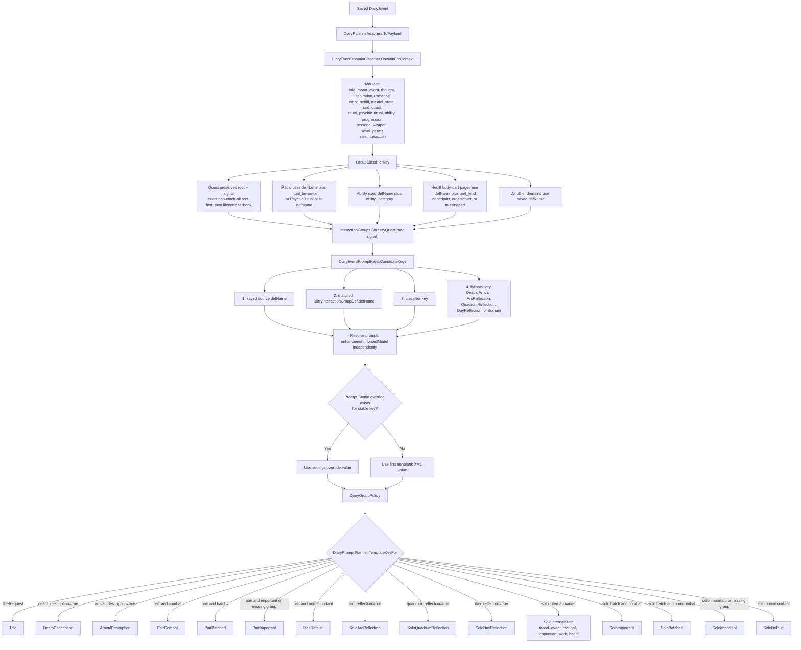
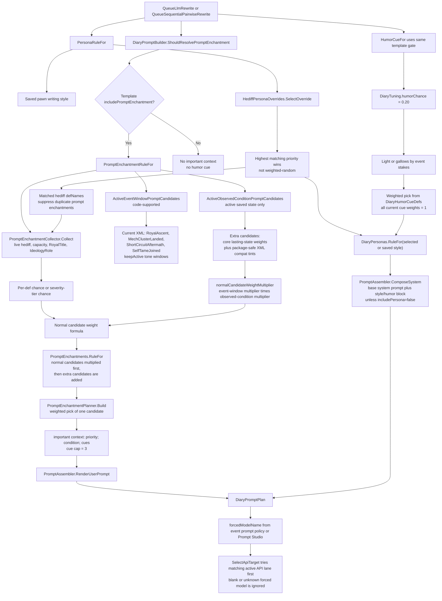
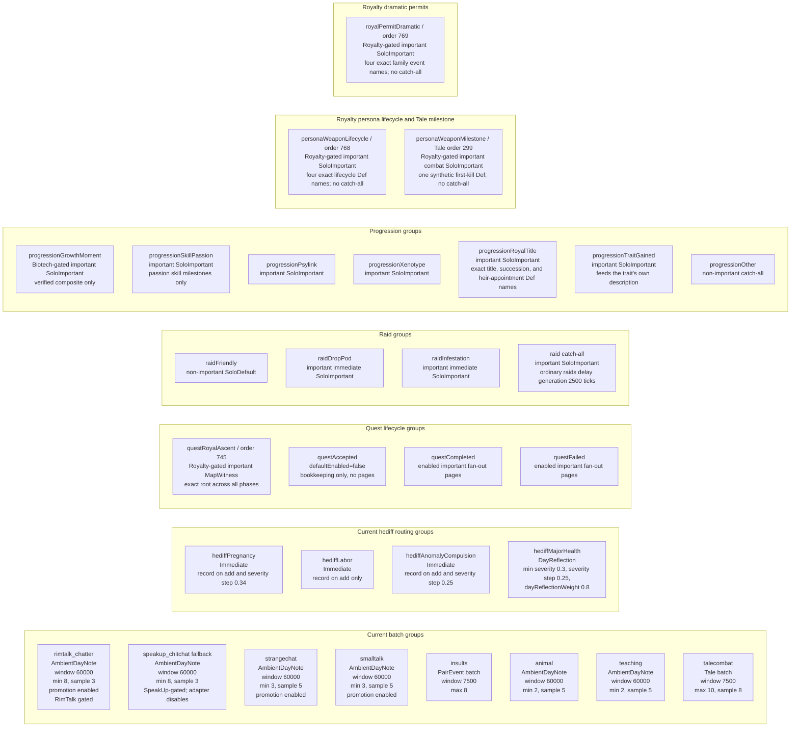
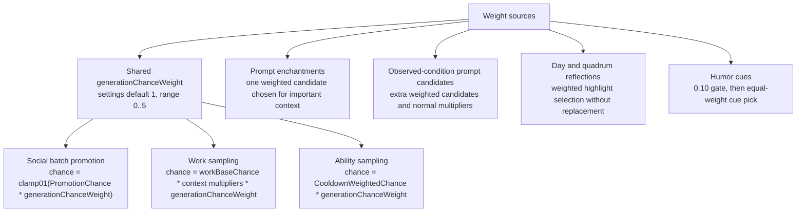
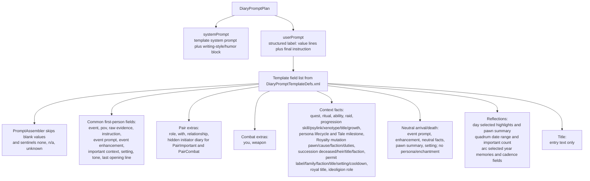

# Event To Prompt Mermaid Map

Current-state reference for how Pawn Diary turns observed RimWorld moments into promptable diary
items. This file describes the shipped code and XML only.

Authoritative sources:

- `Source/Ingestion/`: event signals and fan-out signals.
- `Source/Integration/`: the public API other mods use to submit external events (`INTEGRATIONS.md`).
- `Source/Capture/Events/`: pure capture decisions and game-context formats.
- `Source/Core/DiaryGameComponent.*.cs`: dispatch, event creation, prompt queuing, scans, event
  windows, observed conditions, progression, and day/quadrum/arc reflections.
- `Source/Generation/DiaryPipelineAdapters.cs`: runtime/XML/localization adapter into prompt DTOs.
- `Source/Pipeline/DiaryPromptPlanner.cs`: pure template selection and prompt planning.
- `Source/Pipeline/ProgressionMilestonePolicy.cs`, `ArcReflectionSchedulePolicy.cs`, and
  `ArcReflectionMemorySelector.cs`: pure progression, cadence, and memory-sampling policy.
- `Source/Generation/PromptEnchantments.cs` and `Source/Pipeline/PromptEnchantmentPlanner.cs`:
  prompt-enchantment collection, weighting, suppression, and final selection.
- `1.6/Defs/DiaryInteractionGroupDefs.xml`: event groups, importance, combat, instructions, tones,
  batching, social promotion, hediff routing.
- `1.6/Defs/DiaryEventPromptDefs.xml`: event prompt/enhancement/forced-model rows.
- `1.6/Defs/DiaryPromptTemplateDefs.xml`: rendered prompt templates and fields.
- `1.6/Defs/DiaryPromptEnchantmentDefs.xml`, `DiaryHediffPersonaOverrideDefs.xml`,
  `DiaryEventWindowDefs.xml`, `DiaryObservedConditionDefs.xml`, `DiaryHumorCueDefs.xml`,
  `DiaryTuningDef.xml`, `DiarySignalPolicyDefs.xml`, and `DiaryRoyaltyPolicyDefs.xml`: side-channel
  prompt context, weights, exact Royalty permit mappings/windows/caps, and Royal Ascent identity.

## 1. End-To-End Diary Item Flow

```mermaid
flowchart TD
    subgraph Hooks["Observed events we listen to"]
        I["PlayLog.Add<br/>InteractionSignal<br/>pair, solo, interaction batch, ambient note"]
        T["MemoryThoughtHandler.TryGainMemory<br/>ThoughtSignal<br/>solo or ambient thought"]
        TP["Periodic thought-stage scan<br/>ThoughtProgressionSignal<br/>solo"]
        PR["Periodic pawn progression scan<br/>ProgressionSignal<br/>solo"]
        BG["Biotech birthday + growth letter lifecycle<br/>GrowthMomentSignal<br/>verified age-7/10/13 child solo"]
        PW["Royalty persona coding/equipment/destruction hooks<br/>plus elapsed reconciliation<br/>PersonaWeaponSignal solo lifecycle"]
        RP["Royalty exact title/bestowing/anima/neuroformer hooks<br/>plus succession death and explicit-heir hooks<br/>plus per-faction fallback scan<br/>ProgressionSignal or enriched RitualFanoutSignal"]
        PE["Royalty exact permit owner + successful-use hooks<br/>RoyalPermitSignal solo invocation<br/>quick-aid RaidSignal arbitration"]
        IN["InspirationHandler.TryStartInspiration<br/>InspirationSignal<br/>solo"]
        AB["Ability.Activate overloads<br/>AbilitySignal<br/>cooldown-sampled solo"]
        RO["Pawn_RelationsTracker.AddDirectRelation<br/>RomanceSignal<br/>pair"]
        MS["MentalStateHandler.TryStartMentalState<br/>MentalStateSignal<br/>pair social fight or solo break"]
        TA["TaleRecorder.RecordTale<br/>TaleSignal<br/>solo, pair, tale batch, or death description"]
        DF["Pawn.Kill fallback<br/>DeathFallbackSignal<br/>neutral death page when no death Tale exists"]
        HE["Pawn_HealthTracker.AddHediff<br/>HediffSignal<br/>immediate health/body-part page or day-reflection signal"]
        HS["Periodic hediff severity scan<br/>HediffSignal<br/>progression page or day-reflection signal"]
        WO["Periodic current-job scan<br/>WorkSignal<br/>chance-gated solo work page"]
        RA["IncidentWorker.TryExecute<br/>RaidFanoutSignal<br/>one solo page per eligible map colonist"]
        MO["GameConditionManager.RegisterCondition<br/>MoodEventFanoutSignal<br/>one solo page per eligible map colonist"]
        QU["Quest.Accept, Quest.End, quest-state scan<br/>QuestFanoutSignal<br/>ordinary fanout; exact Royal Ascent stable witness"]
        RI["Ideology and psychic ritual completion hooks<br/>RitualFanoutSignal or PsychicRitualFanoutSignal<br/>role fan-out solo pages"]
        AR["Starting-colonist scan and Pawn.SetFaction<br/>ArrivalSignal<br/>neutral arrival page"]
        DR["Sleep/rest day flush<br/>DayReflectionSignal<br/>ordinary day reflection or rare quadrum reflection"]
        ARC["Sleep/rest day flush or major psylink/xenotype progression<br/>ArcReflectionSignal<br/>rare yearly life-arc reflection"]
        EX["PawnDiaryApi.SubmitEvent from other mods<br/>ExternalEventSignal<br/>solo or pair external page"]
    end

    subgraph Generic["Generic page and prompt side channels"]
        EW["Event-window signals<br/>Incident, Quest, ThingSpawned, Letter, ProximityLetter,<br/>VoidMonolith, PawnAge, Hediff, PrisonBreak"]
        OC["Observed-condition scan<br/>MapDanger, GameCondition, ThingPresent, PawnHediff"]
    end

    I --> Submit
    T --> Submit
    TP --> Submit
    PR --> Submit
    BG --> Submit
    PW --> Submit
    RP --> Submit
    PE --> Submit
    IN --> Submit
    AB --> Submit
    RO --> Submit
    MS --> Submit
    TA --> Submit
    DF --> Submit
    HE --> Submit
    HS --> Submit
    WO --> Submit
    RA --> Submit
    MO --> Submit
    QU --> Submit
    RI --> Submit
    AR --> Submit
    DR --> Submit
    ARC --> Submit
    EX --> Submit

    Submit["DiaryEvents.Submit(signal)"] --> Dispatch["DiaryGameComponent.Dispatch"]
    Dispatch --> Guard["CanRecordGameplayEventNow guard"]
    Guard --> Dedup["recentEvents dedup check<br/>source key plus source-specific window"]
    Dedup --> Payload["Signal builds DiaryEventData payload<br/>and CaptureContext"]
    Payload --> Catalog["DiaryEventCatalog.Get(type).Decide(payload, ctx)"]
    Catalog --> Decision{"CaptureDecision"}
    Decision -- Drop --> Drop["No DiaryEvent"]
    Decision -- GenerateSolo --> Solo["AddSoloEvent"]
    Decision -- GeneratePair --> Pair["AddPairwiseEvent"]
    Decision -- GenerateSoloDeathDescription --> Death["AddSoloEvent + death_description=true"]
    Decision -- GenerateSoloArrivalDescription --> Arrival["AddSoloEvent + arrival_description=true"]
    Decision -- Batch or ambient --> Batch["RecordBatchedInteraction, RecordBatchedTale,<br/>RecordAmbientThought, or day filler"]

    EW --> EWRecord["RecordEventWindowPhase<br/>direct AddSoloEvent"]
    OC --> OCPlan["ObservedConditionPolicy.Plan<br/>saved active condition state"]
    OCPlan --> OCRecord{"recordStartEvent or recordEndEvent?"}
    OCRecord -- Yes --> OCPage["RecordObservedConditionPage<br/>direct AddSoloEvent"]
    OCRecord -- No --> OCOnly["Prompt-bias state only"]

    Solo --> Store
    Pair --> Store
    Death --> Store
    Arrival --> Store
    EWRecord --> Store
    OCPage --> Store
    Batch --> Later["Later batch flush or day reflection may create a DiaryEvent"]
    Later --> Store

    Store["DiaryEventRepository + pawn diary refs"] --> Retention["Active retention may compact old display POVs<br/>into ArchivedDiaryEntry rows"]
    Store --> Queue{"Queue generation now?"}
    Queue -- No --> Pending["Stay hot pending or delayed<br/>catch-up scan may retry"]
    Queue -- Yes --> GenRoute["EnsureGenerationQueued"]
    GenRoute --> Neutral{"Neutral arrival or death?"}
    Neutral -- Death --> DeathPrompt["BuildDeathDescriptionPromptPlan"]
    Neutral -- Arrival --> ArrivalPrompt["BuildArrivalDescriptionPromptPlan"]
    Neutral -- No --> PairCheck{"Pair event?"}
    PairCheck -- Yes --> Seq["Sequential pair flow<br/>initiator first; recipient may get hidden initiator text"]
    PairCheck -- No --> SoloPrompt["BuildInteractionPromptPlan"]
    Seq --> PromptBuild
    SoloPrompt --> PromptBuild
    DeathPrompt --> PromptBuild
    ArrivalPrompt --> PromptBuild
    PromptBuild["DiaryPipelineAdapters + DiaryPromptPlanner<br/>build system prompt, user prompt, response rules"] --> QueuePrompt["QueuePrompt stamps prompt and LLM metadata"]
    QueuePrompt --> TestMode{"Dev prompt-test mode?"}
    TestMode -- Yes --> PromptOnly["MarkPromptOnly<br/>no API call"]
    TestMode -- No --> Lane["Select API lane<br/>forced model may prefer one active lane"]
    Lane --> LLM["LlmClient.Enqueue<br/>background HTTP with failover"]
    LLM --> Apply["Main-thread result drain<br/>save text, status, model, retry/failure"]
    Apply --> Title{"generateTitles and main entry complete?"}
    Title -- Yes --> TitlePrompt["BuildTitlePromptPlan<br/>TitleMaxTokens=40"]
    TitlePrompt --> LLM
    Title -- No --> Done["Diary page visible in UI"]
    PromptOnly --> Done
    Retention --> Done
```

Important boundaries in the diagram:

- `DiaryEvents.Submit` is the bus for catalog sources. Event-window and observed-condition page
  recording bypass the bus after their own generic policy has matched; they still create normal
  `DiaryEvent` records and use the same generation path.
- An exact event-window Def may attach XML-owned `narrativeEvidence` only after its canonical page is
  created. The current three monolith activation chapters use this for prose-free N1 references; it
  does not authorize another page or select prompt context without a later provider.
- Event-window pages save `event_window=` context. Observed-condition pages save
  `observed_condition=` context. Those markers are not separate prompt domains today, so generated
  pages use the saved defName plus the normal Interaction fallback unless a more specific source
  marker/group exists. Royal Ascent's start window deliberately also saves `quest=` and
  `quest_signal=`, so it recovers the exact Quest group without exposing private correlation/arc IDs.
- Ordinary accepted quest signals are bookkeeping/event-window inputs and do not generate accepted
  pages. Exact Royal Ascent acceptance is the one XML-owned start-window exception; completed/failed
  Royal Ascent outcomes and ordinary Quest outcomes still use the canonical Quest page owner.
- Exact persona-trait `killThought` side effects are staged across the active Royalty death/Tale scope
  and its 60-tick inverse-order window, then claimed only if the first-kill milestone page persists.
  Disabled/rejected milestones release each signal once to ordinary Thought capture. This arbitration
  does not create a second page.
- Royalty title and psylink mutations advance saved observation before optional dispatch. Bestowing
  and anima linking hold bounded detached before/after facts for the existing ritual fanout; the first
  stored ritual child claims them, while an expired missing ritual fails open once to Progression.
  Neuroformer owns one immediate cause-aware Progression page. Exact royal-title memories are claimed
  only by matching pawn/title edges and otherwise return unchanged to ordinary Thought capture.
- Royalty succession stages `TryInherit` candidates only inside the exact outer
  `Notify_PawnKilled` scope. A page is authorized only after the matching deceased title row commits
  `wasInherited`; equal-or-higher heirs and candidate-only outcomes remain silent. Exact title,
  bestowing, scanner, and title-memory edges are claimed by the committed heir/faction/title fact.
  Direct/automatic `SetHeir` is silent; only the explicit `ChangeRoyalHeir` quest signal emits an
  appointment page.
- Royalty permit UI lookup records only bounded weak owner evidence. Only the exact successful
  `FactionPermit.Notify_Used()` callback authorizes an allowlisted permit page; invalid targeting,
  cancellation, failed incident execution, routine permits, and unknown mappings remain silent.
  Vanilla quick military aid reports its exact successful `RaidFriendly` first, so that fan-out waits
  briefly for a same-faction/map permit claim. Unmatched, expired, overflowed, or pre-save signals
  return unchanged to the existing raid owner; disabled permit output still owns its source raid.
- Royal Ascent uses the same Quest hooks with real transition guards. Exact root-first classification
  routes `EndGame_RoyalAscent` acceptance to one start-only mapless window and stable witness;
  completion/failure closes only the matching quest instance and creates one exact terminal page.
  Active court pressure requires the saved shared arc or same-POV authority evidence, shades only an
  already-authorized page, and never proves Stellarch arrival, boarding, or escape.

## 2. Prompt Policy And Template Selection

Current shipped event-prompt rows in `DiaryEventPromptDefs.xml`:

| Event prompt row | Key | Prompt | Enhancement | Forced model in XML |
|---|---:|---:|---:|---:|
| `DiaryEventPrompt_Interaction` | `Interaction` | yes | yes | blank |
| `DiaryEventPrompt_MentalState` | `MentalState` | yes | yes | blank |
| `DiaryEventPrompt_Tale` | `Tale` | yes | yes | blank |
| `DiaryEventPrompt_MoodEvent` | `MoodEvent` | yes | yes | blank |
| `DiaryEventPrompt_Thought` | `Thought` | yes | yes | blank |
| `DiaryEventPrompt_Inspiration` | `Inspiration` | yes | yes | blank |
| `DiaryEventPrompt_Romance` | `Romance` | yes | yes | blank |
| `DiaryEventPrompt_Work` | `Work` | yes | yes | blank |
| `DiaryEventPrompt_Hediff` | `Hediff` | yes | yes | blank |
| `DiaryEventPrompt_Raid` | `Raid` | yes | yes | blank |
| `DiaryEventPrompt_Quest` | `Quest` | yes | yes | blank |
| `DiaryEventPrompt_RoyalAscent` | `questRoyalAscent` | yes | yes | blank |
| `DiaryEventPrompt_Ritual` | `Ritual` | yes | yes | blank |
| `DiaryEventPrompt_Ability` | `Ability` | yes | yes | blank |
| `DiaryEventPrompt_DayReflection` | `DayReflection` | yes | yes | blank |
| `DiaryEventPrompt_QuadrumReflection` | `QuadrumReflection` | yes | yes | blank |
| `DiaryEventPrompt_Progression` | `Progression` | yes | yes | blank |
| `DiaryEventPrompt_PersonaWeapon` | `PersonaWeapon` | yes | yes | blank |
| `DiaryEventPrompt_PersonaWeaponBondFormed` | `PersonaWeaponBondFormed` | yes | yes | blank |
| `DiaryEventPrompt_PersonaWeaponBondSeparated` | `PersonaWeaponBondSeparated` | yes | yes | blank |
| `DiaryEventPrompt_PersonaWeaponBondRecovered` | `PersonaWeaponBondRecovered` | yes | yes | blank |
| `DiaryEventPrompt_PersonaWeaponBondEnded` | `PersonaWeaponBondEnded` | yes | yes | blank |
| `DiaryEventPrompt_PersonaWeaponFirstConsequentialKill` | `PersonaWeaponFirstConsequentialKill` | yes | yes | blank |
| `DiaryEventPrompt_RoyalTitleGained` | `RoyalTitleGained` | yes | yes | blank |
| `DiaryEventPrompt_RoyalTitlePromoted` | `RoyalTitlePromoted` | yes | yes | blank |
| `DiaryEventPrompt_RoyalTitleDemoted` | `RoyalTitleDemoted` | yes | yes | blank |
| `DiaryEventPrompt_RoyalTitleLost` | `RoyalTitleLost` | yes | yes | blank |
| `DiaryEventPrompt_RoyalSuccession` | `RoyalSuccession` | yes | yes | blank |
| `DiaryEventPrompt_RoyalHeirAppointed` | `RoyalHeirAppointed` | yes | yes | blank |
| `DiaryEventPrompt_RoyalPermit` | `RoyalPermit` | yes | yes | blank |
| `DiaryEventPrompt_RoyalPermitMilitaryAid` | `RoyalPermitMilitaryAid` | yes | yes | blank |
| `DiaryEventPrompt_RoyalPermitTransportShuttle` | `RoyalPermitTransportShuttle` | yes | yes | blank |
| `DiaryEventPrompt_RoyalPermitOrbitalStrike` | `RoyalPermitOrbitalStrike` | yes | yes | blank |
| `DiaryEventPrompt_RoyalPermitOrbitalSalvo` | `RoyalPermitOrbitalSalvo` | yes | yes | blank |
| `DiaryEventPrompt_PsylinkLevel` | `PsylinkLevel` | yes | yes | blank |
| `DiaryEventPrompt_BestowingCeremony` | `BestowingCeremony` | yes | yes | blank |
| `DiaryEventPrompt_AnimaTreeLinking` | `AnimaTreeLinking` | yes | yes | blank |
| `DiaryEventPrompt_ArcReflection` | `ArcReflection` | yes | yes | blank |
| `DiaryEventPrompt_Arrival` | `Arrival` | yes | yes | blank |
| `DiaryEventPrompt_Death` | `Death` | yes | yes | blank |

The resolver supports exact defName and group rows. Royalty Phase 2 ships the four exact persona
lifecycle rows above in addition to its broad domain fallback; Phase 3 adds the exact Tale-owned
first-kill row; Phase 4 adds the four exact title edges, psylink, bestowing, and anima-linking rows;
Phase 5 adds exact succession and explicit-heir-appointment rows. Phase 6 adds the broad
`RoyalPermit` fallback plus four exact allowlisted-family rows. Phase 7 adds the package-gated exact
Royal Ascent root group/prompt and three bilingual start/completion/failure Prompt Studio fixtures.
All other rows in this table are broad domain/reflection/boundary fallbacks. Prompt
Studio can still override prompt, enhancement, and forced model for resolved keys.

## 3. Prompt Enchantments, Writing-Style Overrides, Humor, And Forced Models

Template side effects:

| Template family | Persona/style block | Prompt enchantment | Humor cue | Direct speech instruction |
|---|---:|---:|---:|---:|
| Normal pair and solo templates | yes | yes | eligible | only when the saved event is a normal social Interaction prompt or interaction batch and template allows it |
| `SoloDayReflection` | yes | yes | eligible | no |
| `SoloQuadrumReflection` | yes | yes, but no `important context` field is present in current XML | eligible | no |
| `SoloArcReflection` | yes | yes, but no `important context` field is present in current XML | eligible | no |
| `DeathDescription` | no | no | no | no |
| `ArrivalDescription` | no | no | no | no |
| `Title` | no | no | no | no |

## 4. Current Event Groups That Affect Shape

Group matching is domain-specific and first-match-wins by ascending `order`. Within a group, exact
defName matching is most precise, then prefixes, suffixes, CamelCase/underscore/digit segments, and
finally legacy substring tokens. Group `important` controls `SoloImportant`/`PairImportant` routing
and day/quadrum evidence. Group `combat` controls `PairCombat`, weapon prompt fields, and some
high-stakes humor classification.

`PersonaWeapon` is its own domain. The Royalty-package-gated `personaWeaponLifecycle` group matches
only `PersonaWeaponBondFormed`, `PersonaWeaponBondSeparated`, `PersonaWeaponBondRecovered`, and
`PersonaWeaponBondEnded`; unknown/modded keys do not fall through into a fabricated lifecycle page.
The source advances saved state even when this visible group is disabled, so re-enabling it cannot
retell an already-consumed phase.

`personaWeaponMilestone` remains in the Tale domain. A configured qualifying source Tale inside the
exact active kill scope is relabeled as `PersonaWeaponFirstConsequentialKill`, forced to one killer POV,
and keeps `tale=`, source Def/label, and killer/victim role facts. It never emits `persona_weapon=`, so
ordinary Tale/death ownership and victim dedup remain authoritative. Observed truth advances even when
the group is disabled; durable-page truth advances only after the event repository accepts the page.

`RoyalPermit` is also its own domain. The Royalty-package-gated `royalPermitDramatic` group matches
only `RoyalPermitMilitaryAid`, `RoyalPermitTransportShuttle`, `RoyalPermitOrbitalStrike`, and
`RoyalPermitOrbitalSalvo`. The allowlist itself remains XML-owned by exact permit Def-name strings;
routine and unknown permits cannot fall through into this group. The page records invocation only,
never an arrival, target hit, transport completion, or favor amount that the success edge did not
prove.

Quest classification is root-first only for exact non-catch-all groups. `questRoyalAscent` matches
the plain string `EndGame_RoyalAscent` before lifecycle-signal groups, uses `MapWitness`, and owns the
same settings/instruction/prompt route for accepted/completed/failed. Acceptance itself is emitted by
the start window; terminal Quest capture emits one witness page and disables the second window-end
page. Ordinary Quest roots fall back to `questAccepted`/`questCompleted`/`questFailed` and preserve
their prior all-eligible fanout.

Ritual fan-out keeps both layers of guidance: the matched XML group's instruction establishes the
specific rite, then the localized participant-role instruction establishes what this pawn did. This
is why Alpha/VIE ritual groups affect prompt content instead of only the settings label.

Anomaly psychic rituals classify by the full saved key
`PsychicRitual;<PsychicRitualDef.defName>`. Exact package-gated families precede the generic
order-`776` fallback and leave page count and role fan-out unchanged:

| Group / order | Exact installed keys | Prompt boundary |
|---|---|---|
| `ritualAnomalyInvitation` / `770` | `VoidProvocation`, `SummonAnimals`, `SummonShamblers` | Deliberate invitation and uncertainty; no claimed arrival. |
| `ritualAnomalyFleshAndWeather` / `771` | `SummonPitGate`, `SummonFleshbeasts`, `SummonFleshbeastsPlayer`, `BloodRain` | Deliberate hostile environment; no claimed harm or persistence. |
| `ritualAnomalyPredation` / `772` | `Philophagy`, `Chronophagy`, `Psychophagy` | Taking from a target, with agency/victimhood limited to supplied perspective facts. |
| `ritualAnomalyMind` / `773` | `Brainwipe`, `PleasurePulse`, `NeurosisPulse` | Mental alteration without giving one role another pawn's inner effects. |
| `ritualAnomalyAbduction` / `774` | `SkipAbduction`, `SkipAbductionPlayer` | Reach and danger; identity/outcome only when target facts supply them. |
| `ritualAnomalyDeathRefusal` / `775` | `ImbueDeathRefusal` | Establishing death refusal; never claims death or resurrection already occurred. |
| `ritualAnomalyPsychic` / `776` | token fallback for unknown/modded `PsychicRitual;...` keys | Visible supplied facts only; downstream effect remains uncertain. |

Anomaly Phase A1.1 also registers one common `AnomalyEvent` catalog envelope and five exact,
package-gated Interaction groups at orders `61..65`: `anomalyStudyBreakthrough`,
`anomalyContainmentBreach`, `anomalyCreepJoinerOutcome`, `anomalyGhoulTransformation`, and
`anomalyVoidOutcome`. Each matches only its frozen `PawnDiary_*` synthetic Def name through
`ClassifyAnomalyEvent`; the required-match route cannot use the ordinary Interaction catch-all.
They expose settings and localized prompt/fallback policy now, but no hook or signal submits an
`AnomalyEvent` in A1.1, so they are intentionally absent from the live-hook diagram above and create
zero pages until the separately tested A1.2/A1.3/A2/A3 sources land. N3-A is similarly wired as an
explicit zero-candidate provider.

Biotech Phases 1–2 activate the exact `progressionGrowthMoment` / order `800` route for
`BiotechGrowthMoment`; the Tale-domain `biotechFamilyBirth` / order `315` contract remains inactive
until Phase 3. Birthday prefix/postfix capture plus the dynamically registered growth-letter hooks
submit only an actual age-7/10/13 before/after mutation. Saved family arcs and exact parent/lesson/play
evidence now select child solo, supporter solo, or child/supporter pair deterministically. Context carries
the stable family key, qualitative opportunity/upbringing, verified trait/interest, nickname,
responsibility, supporter, and writer-role facts while excluding raw tiers, choice/work lists, counts,
and ticks. The source attaches an N1 `identity_transition` phase. N2-B may add an exact saved-family
continuity lens and the child's visible current non-Baseliner xenotype through the bounded shared
selector; it never lists genes, predicts identity, infers feelings, or creates another page/POV.

Mod-compatibility groups that materially change routing/shape (all target-gated; Thought rows still
use the global mood-memory policy):

| Mod / groups | Domain + order | Shape |
|---|---|---|
| SpeakUp adapter: deep talk / jokes / prisoner / reactions / chatter | Interaction `5/6/7/8/10` | Five 60,000-tick `AmbientDayNote` families: min/sample `3/5`, `6/4`, `3/5`, `8/3`, `8/3`; deep-talk promotion `0.02..0.08`, chatter `0.005..0.08`. |
| Rimpsyche: conversations / afterfeel | Interaction `11`; Thought `479` | Conversations ambient-batch at min 6/sample 3 with `0.005..0.08` promotion; afterfeel is normal Thought routing. |
| Way Better Romance: hookup / date-hangout / thoughts | Interaction `15/16`; Thought `488` | Hookup immediate; invitations ambient-batch at min 2/sample 3 with `0.05..0.08` promotion; memories use global Thought policy. |
| Alpha Memes | Ritual `766/767`, Thought `486`, Interaction `19`, Hediff `656` | Funeral/ritual/baptism immediate; memories use global Thought policy; visible hediffs feed `DayReflection`. |
| VIE Memes | Ritual `764/765`, Thought `487`, Interaction `22` | Dark/general rites and interrogation immediate; memories use global Thought policy. |
| Hospitality: guest work / scrounging | Interaction `21/23` | Guest work ambient-batches the one eligible colonist (min 4/sample 3, `0.005..0.08` promotion); scrounging is immediate only when a colonist participates. |
| Vanilla Traits Expanded | MentalState `198`; Thought `489` | Three trait-driven breaks immediate; recordable memories use global Thought policy. |
| Vanilla Events Expanded | Raid `704`; Hediff `655` | Purple raid/infestation immediate; six visible colony-wide hediffs feed `DayReflection`. |
| Adapter whole-conversation events | External `1022/1030` | SpeakUp claims `speakupbridge_conversation`; Rimpsyche claims `rimpsyche_conversation`. Both submit through normal external budgets/dedup. |

## 5. Current Weights And Chance Formulas

Source recording weights:

| Source | Current formula or value |
|---|---|
| Shared generation chance | `PawnDiarySettings.generationChanceWeight`, default `1`, clamped `0..5`. |
| RimTalk chatter promotion | Same as SpeakUp: `base 0.005 + bonuses`, capped `0.08`, then multiplied by shared generation chance. Gated on packageId `cj.rimtalk` and exact interaction defName `RimTalkInteraction`. |
| SpeakUp fallback/chatter promotion | `base 0.005 + bonuses`, capped `0.08`, then multiplied by shared generation chance. Bonuses: strong opinion `+0.025` at abs opinion `>=40`; opinion asymmetry `+0.025` at delta `>=40`; low food/rest/joy `+0.025` at `<=0.25`; low mood `+0.025` at `<=0.25`. The frozen `speakup_chitchat` fallback is used without the adapter; adapter chatter uses the same policy. |
| SpeakUp adapter deep-talk promotion | `base 0.02` with the same `+0.025` pressure bonuses and cap `0.08`, then shared generation chance. |
| Rimpsyche conversation promotion | Same `base 0.005`, bonuses, and `0.08` cap as ordinary SpeakUp chatter. Tier-C charged-conversation capture is separate: absolute alignment strictly `> 0.55`, then a saved 60,000-tick pair cooldown. |
| Hospitality guest-work promotion | Same `base 0.005`, bonuses, and `0.08` cap; `allowSingleEligiblePawn=true` permits the colonist side of guest interactions to reach the ambient batch. |
| WBR date/hangout promotion | `base 0.05` plus the standard `+0.025` pressure bonuses, capped at `0.08`, then shared generation chance. |
| Strange chat promotion | `base 0.04 + bonuses`, capped `0.6`, then multiplied by shared generation chance. Bonuses: strong opinion `+0.25`; opinion asymmetry `+0.2`; low need `+0.2`; low mood `+0.2`; same thresholds as above. |
| Small talk promotion | Same as strange chat: `base 0.04`, cap `0.6`, bonuses `+0.25/+0.2/+0.2/+0.2`, then shared generation chance. |
| Work sampling | Scan every `2500` ticks. Chance starts at `0.08`; passion multiplier `1.4`; negative chore/low skill multiplier `1.2`; dark study multiplier `1.5`; recent different work multiplier `0.5`; same work cooldown `180000` ticks; then shared generation chance and clamp. Social/violent work types are ignored. |
| Pawn progression | Scan every `2500` ticks. Passion skills emit only when reaching configured milestones `8/12/16/20`; first scan baselines. Psylink hediff defNames are XML string matchers; xenotype and royal-title reads go through DLC-safe `DlcContext`. Only psylink level gains and configured major xenotype defNames can currently request a major arc follow-up: default threshold `90`, psylink severity `level / 6 * 100`, and `Sanguophage` as the default major xenotype defName. |
| Royalty persona/title/psylink/succession | Reconcile every `2500` ticks on an independent elapsed deadline. An overdue deadline performs at most one current-state catch-up and rebases from the current tick; it never polls through every skipped cadence. The unscribed deadline uses overflow-safe `long` arithmetic even if a compatibility mod supplies an extreme cadence. Continuous observable not-primary evidence reaches meaningful separation at `60000` ticks; recovery is page-eligible only after that separation page recorded. Exact first-kill `killThought` correlation uses `60` ticks. Title/psylink cause and title-memory windows use `2500` ticks; succession uses that value only to clean its transient same-action exact-edge cache, while a saved committed title chain persists until target or contradiction. Pending mutation/title-memory/succession caps are `64`/`128`/`64`, context text is capped at `120` characters per field, and at most `2` duty categories project. Exact hooks advance truth before optional dispatch; succession requires both candidate and outer `wasInherited` commit. Coding, transfer, destruction, milestone/succession consumption, and state-only cleanup are deterministic rather than chance-weighted. |
| Royalty dramatic permits | Exact string allowlist of six permits. Owner evidence lives for `2500` ticks with caps of `64` permit sessions, `4` owners per session, and `256` fallback pawns. Quick-aid correlation lasts `60` ticks with `32` pending raids and `32` reverse-order owners; overflow and expiry fail open to the ordinary raid route. Immediate repeat suppression is `60` ticks. Permit/setting text caps are `120` characters. All values are XML-owned with defensive fallbacks. |
| Royal Ascent | Exact plain-string root `EndGame_RoyalAscent`; one mapless active row and one deterministic stable witness. The start window silently expires after `1200000` ticks, event dedup is `2500`, correlation/arc caps are `96`/`128` characters, and active prompt weight is `9` with normal-candidate multiplier `0.8`. Completion/failure closes only matching correlation; no polling or timeout page. |
| Biotech growth ownership | Ages `7/10/13` only. A real configured letter saves detached ownership until choice or `180000`-tick expiry; a provably mismatched pawn age may release after the `60000`-tick grace. Auto-resolved growth diffs immediately. Canonical disable/failure releases Birthday once, while trait/skill baselines and the consumed age advance regardless of page settings. |
| Ability sampling | `min 0.03`, `max 0.75`, reference cooldown `60000` ticks. `CooldownWeightedChance = min + (max - min) * cooldown / (cooldown + reference)`, then shared generation chance and clamp. Dedup `300` ticks. |
| Ordinary raid generation delay | `2500` ticks. Drop-pod raids and infestations bypass the delay. |
| Day reflection highlights | Max `3`. Important event weight is `1` for combat and `0.7` for other important events. Hediff day signal default `0.8`. Opinion shift weight is `0.6 * min(2, abs(delta)/15)`. Filler weight is `0.15`, only when at least two filler moments exist. Weighted selection is without replacement with floor `0.0001`; if selected highlights contain no important signal, the strongest important candidate replaces the lightest selected highlight. |
| Quadrum reflection | Enabled. Due date is deterministic per pawn/quadrum inside final `3` days. Requires `6` important entries. Sends at most `8` weighted highlights. Max response tokens `350`. Highlight weights reuse combat `1` and other important `0.7`. |
| Arc reflection | Enabled. One forced yearly entry after day `45` when enough memories exist; optional second major-event entry after `30` days. A forced attempt that has too few memories backs off for `60000` ticks before rescanning. Samples up to `8` hot/archive diary memories, de-duplicates by event id, filters to current-year memories when the year is known, excludes reflections/death descriptions/recently used ids, and caps repeated domain/group memories. Memory weights are base `10`, important `+20`, same-quadrum `+10`, generated text `+5`, progression `+20`, and high-stakes `+15`; high-stakes is inherent for romance, hediff, progression, and death markers, plus XML defName token matches. Max response tokens `420`. |
| Humor cues | Base gate `0.20`. High-stakes events use gallows cues; other events use light cues. All current humor cue XML rows have weight `1`. |

Prompt-enchantment selection formula:

- Hediff candidate chance: severity tier `frequency` or `chance` if a tier matches; otherwise Def
  `frequency` when nonnegative; otherwise Def `chance`; clamped `0..1`.
- Hediff candidate weight: `weight * severity * LiveSeverityWeight`, with tier `weight`/`severity`
  overriding the Def when nonnegative.
- `LiveSeverityWeight = max(0.1, 1 + clamp(severity,0,2)*0.5 + lifeThreateningBonus + bleedingBonus
  + clamp(painOffset,0,1) + clamp(-SummaryHealthPercentImpact,0,1))`, where life-threatening adds
  `1.5` and bleeding adds `clamp(bleedRate,0,2)*0.5`.
- Capacity candidate weight: `weight * severity * (1 + clamp01(1 - capacityLevel) * 2)`.
- RoyalTitle and IdeologyRole candidate weight: `weight * severity`, and they only enter the pool for
  important events.
- Normal candidates are multiplied by active event-window and observed-condition
  `normalPromptWeightMultiplier` values before extra event-window/observed-condition candidates are
  added.
- The planner picks one candidate by `candidate.weight / totalPositiveWeight`, then formats priority,
  condition, live impact cues, and configured cues. Current cue cap is `3`.

Current prompt-enchantment tuning thresholds:

| Threshold | Value |
|---|---:|
| Minor hediff severity | `0.05` |
| Moderate hediff severity | `0.25` |
| Major hediff severity | `0.50` |
| Critical hediff severity | `0.75` |
| Clouded consciousness below | `0.55` |
| Fading consciousness below | `0.35` |
| Barely conscious below | `0.20` |
| Max impact cues | `3` |
| First-person generation consciousness floor | `0.11` |

Current prompt-enchantment defs:

| Def | Source or match | Chance | Weight | Severity | Extra gate |
|---|---|---:|---:|---:|---|
| `DiaryEnchant_RoyalTitle` | `RoyalTitle` | `0.22` | `0.55` | `1` | important events only |
| `DiaryEnchant_IdeologyRole` | `IdeologyRole` | `0.22` | `0.55` | `1` | important events only |
| `DiaryEnchant_ConsciousnessClouded` | `Capacity:Consciousness` | `1` | `2.2` | `1.2` | `0.35 <= level < 0.55` |
| `DiaryEnchant_ConsciousnessFading` | `Capacity:Consciousness` | `1` | `3.2` | `1.5` | `0.20 <= level < 0.35` |
| `DiaryEnchant_ConsciousnessBarelyAwake` | `Capacity:Consciousness` | `1` | `5` | `2` | `level < 0.20` |
| `DiaryEnchant_FeverishBody` | `Flu, Malaria, Plague, GutWorms, MuscleParasites, FoodPoisoning, ToxicBuildup, WoundInfection, SleepingSickness` | `0.65` | `1.2` | `1.2` | min severity `0.05`; severity tiers |
| `DiaryEnchant_BloodLossUrgency` | `BloodLoss` | `0.75` | `1.4` | `1.6` | min severity `0.05`; severity tiers |
| `DiaryEnchant_AlcoholHigh` | `AlcoholHigh` | `0.55` | `0.9` | `1` | severity tiers |
| `DiaryEnchant_Hangover` | `Hangover` | `0.6` | `0.9` | `1.1` | severity tiers |
| `DiaryEnchant_AmbrosiaHigh` | `AmbrosiaHigh` | `0.45` | `0.8` | `0.9` |  |
| `DiaryEnchant_GoJuiceHigh` | `GoJuiceHigh` | `0.65` | `1.1` | `1.25` |  |
| `DiaryEnchant_LuciferiumHigh` | `LuciferiumHigh` | `0.45` | `1` | `1.2` |  |
| `DiaryEnchant_LuciferiumDependency` | `LuciferiumAddiction` | `0.75` | `1.2` | `1.4` | min severity `0.05`; severity tiers |
| `DiaryEnchant_ChemicalCraving` | alcohol, ambrosia, smokeleaf, psychite, wake-up, go-juice addiction/withdrawal hediffs | `0.55` | `1` | `1.2` | min severity `0.05`; severity tiers |
| `DiaryEnchant_FlakeHigh` | `FlakeHigh` | `0.65` | `1` | `1.15` |  |
| `DiaryEnchant_PsychiteTeaHigh` | `PsychiteTeaHigh` | `0.45` | `0.8` | `0.95` |  |
| `DiaryEnchant_YayoHigh` | `YayoHigh` | `0.65` | `1` | `1.15` |  |
| `DiaryEnchant_SmokeleafHigh` | `SmokeleafHigh` | `0.55` | `0.8` | `1` |  |
| `DiaryEnchant_PsychicHangover` | `PsychicHangover` | `0.7` | `1.1` | `1.25` | severity tiers |
| `DiaryEnchant_Blindness` | `Blindness` | `0.75` | `1` | `1.2` |  |
| `DiaryEnchant_MemoryDecay` | `Dementia, Alzheimers, CrumblingMind` | `0.8` | `1.2` | `1.3` |  |
| `DiaryEnchant_TraumaSavant` | `TraumaSavant` | `0.75` | `1.1` | `1.15` |  |
| `DiaryEnchant_ResurrectionPsychosis` | `ResurrectionPsychosis` | `0.85` | `1.4` | `1.5` | severity tiers |
| `DiaryEnchant_Joywire` | `Joywire` | `0.55` | `0.9` | `1.1` |  |
| `DiaryEnchant_ParalyticAbasia` | `Abasia` | `0.75` | `1.1` | `1.2` |  |
| `DiaryEnchant_Mindscrew` | `Mindscrew` | `0.65` | `1.2` | `1.3` |  |
| `DiaryEnchant_Pregnancy` | `Pregnant, PregnantHuman` | `0.45` | `0.9` | `1` |  |
| `DiaryEnchant_HemogenCraving` | `HemogenCraving` | `0.75` | `1.2` | `1.35` | severity tiers |
| `DiaryEnchant_PsychicBondTorn` | `PsychicBondTorn` | `0.8` | `1.3` | `1.4` |  |
| `DiaryEnchant_BlissLobotomy` | `BlissLobotomy` | `0.65` | `1` | `1.2` |  |
| `DiaryEnchant_RevenantHypnosis` | `RevenantHypnosis` | `0.85` | `1.5` | `1.6` |  |
| `DiaryEnchant_CubeInterest` | `CubeInterest` | `0.55` | `1` | `1.1` |  |
| `DiaryEnchant_CubeWithdrawal` | `CubeWithdrawal` | `0.85` | `1.4` | `1.5` | severity tiers |
| `DiaryEnchant_CubeRage` | `CubeRage` | `1` | `1.8` | `1.8` |  |
| `DiaryEnchant_VoidShockOrTouched` | `VoidShock, VoidTouched` | `0.85` | `1.4` | `1.5` |  |
| `DiaryEnchant_CorpseTorment` | `CorpseTorment` | `0.85` | `1.4` | `1.5` |  |
| `DiaryEnchant_Inhumanized` | `Inhumanized` | `1` | `2.2` | `2` | `visibleOnly=false` |
| `DiaryEnchant_FleshMutation` | `Tentacle, FleshTentacle, FleshWhip` | `0.7` | `1.1` | `1.2` |  |
| `DiaryEnchant_Malnutrition` | `Malnutrition` | `0.75` | `1.3` | `1.4` | min severity `0.05`; severity tiers |
| `DiaryEnchant_TemperatureInjury` | `Heatstroke, Hypothermia` | `0.75` | `1.3` | `1.4` | min severity `0.05`; severity tiers |
| `DiaryEnchant_AnestheticHaze` | `Anesthetic` | `0.6` | `1` | `1.1` |  |
| `DiaryEnchant_PsychicShock` | `PsychicShock` | `0.7` | `1.1` | `1.2` |  |
| `DiaryEnchant_Carcinoma` | `Carcinoma` | `0.7` | `1.2` | `1.3` |  |
| `DiaryEnchant_Mechanites` | `FibrousMechanites, SensoryMechanites` | `0.65` | `1.1` | `1.2` |  |
| `DiaryEnchant_WakeUpHigh` | `WakeUpHigh` | `0.55` | `0.9` | `1` |  |
| `DiaryEnchant_CryptosleepSickness` | `CryptosleepSickness` | `0.6` | `1` | `1.1` |  |
| `DiaryEnchant_AgingBody` | `Frail, BadBack, Cataract, HearingLoss` | `0.15` | `0.5` | `0.8` | low chance on purpose: permanent conditions |
| `DiaryEnchant_Deathrest` | `Deathrest, DeathrestExhaustion` | `0.6` | `1` | `1.1` |  |
| `DiaryEnchant_LungRot` | `LungRot, LungRotExposure` | `0.7` | `1.1` | `1.2` | min severity `0.05` |
| `DiaryEnchant_BloodRage` | `BloodRage` | `0.85` | `1.4` | `1.5` |  |
| `DiaryEnchant_VacuumExposure` | `VacuumExposure, VacuumBurn` | `0.8` | `1.3` | `1.4` |  |

Severity-tier overrides currently exist for `FeverishBody`, `BloodLossUrgency`, `AlcoholHigh`,
`Hangover`, `LuciferiumDependency`, `ChemicalCraving`, `PsychicHangover`,
`ResurrectionPsychosis`, `HemogenCraving`, `CubeWithdrawal`, `Malnutrition`, and
`TemperatureInjury`. Blank tier fields inherit the Def value.

Current hediff writing-style overrides:

| Override | Forced writing style | Priority | Match | Notes |
|---|---|---:|---|---|
| `HediffPersonaOverride_TraumaSavant` | `DiaryPersona_TraumaSavantSilent` | `110` | `TraumaSavant` | Highest current priority; visible hediff required by default. |
| `HediffPersonaOverride_Inhumanized` | `DiaryPersona_InhumanizedVoid` | `100` | `Inhumanized` | `visibleOnly=false`. |
| `HediffPersonaOverride_CrumbledMind` | `DiaryPersona_CrumbledMindCollapse` | `40` | `CrumbledMind` | Visible hediff required by default. |
| `HediffPersonaOverride_BlissLobotomy` | `DiaryPersona_BlissLobotomyHaze` | `35` | `BlissLobotomy` | Visible hediff required by default. |
| `HediffPersonaOverride_Mindscrew` | `DiaryPersona_MindscrewPain` | `25` | `Mindscrew` | Visible hediff required by default. |
| `HediffPersonaOverride_Joywire` | `DiaryPersona_JoywireHaze` | `20` | `Joywire` | Visible hediff required by default. |
| `HediffPersonaOverride_Drunk` | `DiaryPersona_DrunkRambling` | `15` | `AlcoholHigh` | `minSeverity=0.4` — proper drunkenness only, not a light buzz. |

Current observed-condition prompt candidates:

| Condition | Enabled | Observer | Scope | Prompt weight | Normal multiplier | Records page? |
|---|---:|---|---|---:|---:|---|
| `MapThreatActive` | yes | `MapDanger` | Map | `6` | `1` | no |
| `ToxicFalloutActive` | yes | `GameCondition` | Map | `4` | `1` | no |
| `SolarFlareActive` | yes | `GameCondition` | Map | `4` | `1` | no |
| `AnomalyGrayFleshEvidence` | yes | `ThingPresent` | Map | `40` | `0` | start page to map colonists, `extremeDark` cue |
| `MetalhorrorEmergence` | yes | `ThingPresent` | Map | `60` | `0` | no |
| `MetalhorrorInfection` | yes | `MapHiddenHediff` | Map | `40` | `0.3` | no |
| `ColdSnapActive` | yes | `GameCondition` | Map | `4` | `1` | no |
| `HeatWaveActive` | yes | `GameCondition` | Map | `4` | `1` | no |
| `VolcanicWinterActive` | yes | `GameCondition` | Map | `3` | `1` | no; also matches Odyssey `VolcanicAsh` |
| `BloodRainActive` | yes | `GameCondition` | Map | `20` | `0.5` | no |
| `DeathPallActive` | yes | `GameCondition` | Map | `20` | `0.5` | no |
| `UnnaturalDarknessActive` | yes | `GameCondition` | Map | `25` | `0.3` | no |
| `PitGatePresence` | yes | `ThingPresent` | Map | `30` | `0.3` | start page to map colonists, `extremeDark` cue |
| `FleshmassHeartPresence` | yes | `ThingPresent` | Map | `30` | `0.3` | start page to map colonists, `extremeDark` cue |
| `ObeliskPresence` | yes | `ThingPresent` | Map | `15` | `0.7` | no; matches the three real `WarpedObelisk_*` ThingDefs |
| `HarbingerTreePresence` | yes | `ThingPresent` | Map | `8` | `1` | no |
| `NociospherePresence` | yes | `ThingPresent` | Map | `25` | `0.5` | no |
| `UnnaturalCorpsePresence` | yes | `ThingPresent` | Map | `20` | `0.7` | no; matches the generated `UnnaturalCorpse_Human` ThingDef |
| `ThrumboVisit` | yes | `ThingPresent` | Map | `5` | `1` | no; capped 2 days active, 5-day restart cooldown |
| `AlphabeaversActive` | yes | `ThingPresent` | Map | `5` | `1` | no; capped 2 days active, 2-day restart cooldown |
| `CropBlightActive` | yes | `ThingPresent` | Map | `5` | `1` | no; capped 3 days active, 1-day restart cooldown |
| `AmbrosiaSprouted` | yes | `ThingPresent` | Map | `3` | `1` | no; capped 2 days active, 10-day restart cooldown |
| `VeeDroughtActive` | yes | `GameCondition` | Map | `4` | `1` | no; VEE exact-string tint, decay 120000 |
| `VeeLongNightActive` | yes | `GameCondition` | Map | `5` | `1` | no; VEE exact-string tint, decay 120000 |
| `VeeScorchActive` | yes | `GameCondition` | Map | `4` | `1` | no; VEE exact-string tint, decay 120000 |
| `VeeWhiteoutActive` | yes | `GameCondition` | Map | `5` | `1` | no; VEE exact-string tint, decay 120000 |
| `VeePsychicBloomActive` | yes | `GameCondition` | Map | `3` | `1` | no; VEE exact-string tint, decay 120000 |
| `VeePsychicHumActive` | yes | `GameCondition` | Map | `3` | `1` | no; hum/overdrive/stimulation/`PsychicRain`, decay 120000 |

Current event-window prompt candidates: three windows keep a decaying prompt bias while active.
`MechClusterLanded` (incident `MechCluster`) records a start page for map colonists and then biases
prompts (weight `12`, normal multiplier `0.7`) for up to three days. `ShortCircuitAftermath`
(incident `ShortCircuit`, weight `3`, six hours) and `SelfTameJoined` (incident `SelfTame`, weight
`3`, half a day) record no pages at all — they only enter the weighted candidate pool so the moment
sometimes flavors a page. Eight one-shot windows (`VoidMonolithDiscovery`, the exact
`VoidMonolithActivation`/`VoidMonolithWaking`/`VoidMonolithVoidAwakened` chapters, `Birthday`,
`HeartAttack`, `PrisonBreak`, `AncientDanger`) set `keepActive=false`, `promptEnabled=false`, and
`promptWeight=0`; they record pages but do not bias later prompts. The three activation chapters
match only reached levels `Stirring`, `Waking`, and `VoidAwakened`, respectively; automatic
`Gleaming` matches none. Ordinary Birthday is delayed when a real pending Biotech growth choice owns
the same age, then is replaced by the verified composite or released at fallback. Each monolith chapter saves a visible N1 `journey_chapter` reference on
`anomaly-monolith|0`, but no narrative prompt text is selected until a future provider exists.

Six compatibility windows use the same one-shot/no-prompt shape plus the package-gated
`MapWitness` scope: VEE earthquake, meteorite shower, space battle/shuttle crash, and purple
manhunter incidents (four windows, `dedupTicks=2500`), plus Hospitality visitor arrival and guest
join-request incidents (two windows, `dedupTicks=30000`). Each selects one deterministic eligible
colonist on the incident map and has a matching Interaction display group at orders `145..149`.
Exact target-mod package gates prevent base-game `VisitorGroup` from starting Hospitality pages.

The three page-recording defs from the event-coverage pass (`MechClusterLanded`,
`PitGatePresence`, `FleshmassHeartPresence`) have companion Interaction-domain display groups
(`eventWindowMechCluster`, `observedPitGate`, `observedFleshmassHeart`, orders 142–144) so their
saved pages classify to a proper label and importance in the Diary tab instead of the "A quiet
day" catch-all, mirroring the existing `eventWindow*` groups.

## 6. Rendered Prompt Contents

Current template keys:

| Key | Trigger | Current special behavior |
|---|---|---|
| `PairDefault` | Pair, non-combat, non-batched, non-important group | Relationship field; style/enchantment allowed. |
| `PairImportant` | Pair, non-combat, non-batched, important or missing group | Relationship plus hidden initiator field; style/enchantment allowed; 2-5 sentence system/final/recipient instructions; `maxTokens=200`. |
| `PairCombat` | Pair and combat group, including MentalState domain | Pawn summary, weapon, hidden initiator field; style/enchantment allowed; 2-5 sentence system/final/recipient instructions; `maxTokens=200`. |
| `PairBatched` | Pair and `batch=` marker, unless combat | No relationship or hidden initiator field; style/enchantment allowed. |
| `SoloDefault` | Solo, non-batched, non-internal, non-important group | Style/enchantment allowed. |
| `SoloImportant` | Solo important or solo batched combat | Pawn summary; style/enchantment allowed; 2-5 sentence system/final instructions; `maxTokens=200`. Royalty persona pages append lifecycle projection fields at stable indices `90–101`, Tale-milestone/source-role fields at `102–106`, Phase-4 mutation pawn/cause/transition/faction/psylink-cause/duty fields at `107–112`, Phase-5 succession deceased/heir/title/faction fields at `113–116`, and Phase-6 permit label/family/faction/title/setting/cooldown fields at `117–122`; required title/psylink before/after facts reuse earlier stable fields, and internal IDs/epoch/ticks/correlation/commit tokens are not projected. |
| `SoloInternalState` | Solo with `mood_event=`, `thought=`, `inspiration=`, `work=`, or `hediff=` | Internal-state facts; style/enchantment allowed. |
| `SoloBatched` | Solo with `batch=`, non-combat | Batched evidence; style/enchantment allowed. |
| `SoloDayReflection` | `day_reflection=true` | Direct speech disabled; style/enchantment allowed. |
| `SoloQuadrumReflection` | `quadrum_reflection=true` | Direct speech disabled; `maxTokens=350`; style/humor eligible; current fields omit `important context`. |
| `SoloArcReflection` | `arc_reflection=true` | Direct speech disabled; `maxTokens=420`; style/humor eligible; selected memory evidence and arc cadence fields; current fields omit `important context`. |
| `DeathDescription` | `death_description=true` | Neutral, style-free, enchantment-free. Phase 3 appends persona milestone/weapon/bond/trait ending fields at stable indices `8–14` when a pre-`UnCode` wielder-death snapshot exists. |
| `ArrivalDescription` | `arrival_description=true` | Neutral, style-free, enchantment-free. |
| `Title` | title follow-up | Style-free, enchantment-free, `TitleMaxTokens=40`. |
