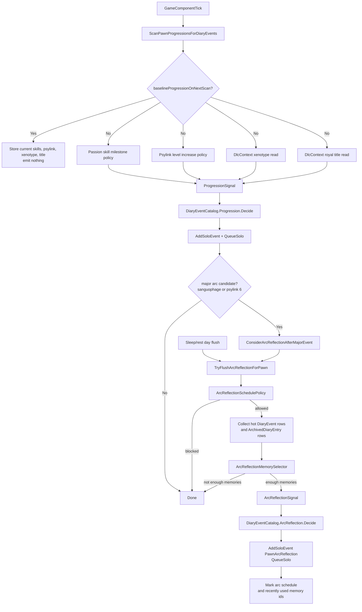
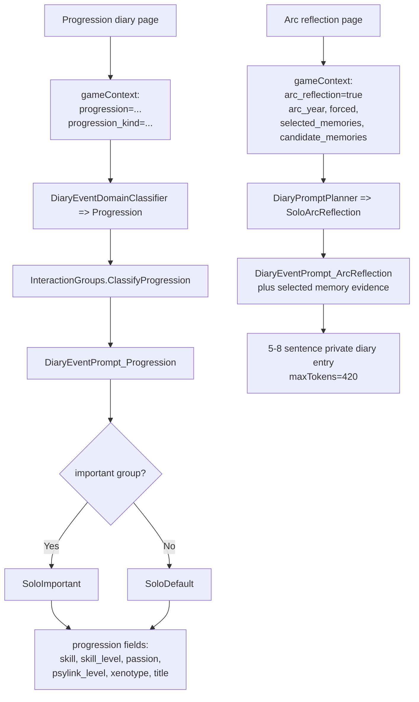

# Pawn Arc Reflection Implementation

Current implementation note for the pawn arc plan. This document describes the shipped branch state,
not the earlier planning checklist.

## Summary

Pawn Diary now records ordinary progression entries first, then uses existing diary pages as memory
evidence for rare yearly arc reflections. There is no separate pawn-history fact database. The only
new saved state is small per-pawn scanner and cadence bookkeeping:

- `PawnDiaryRecord.progressionState`: highest passion-skill milestones plus last observed psylink,
  xenotype, and royal title values.
- `PawnDiaryRecord.arcSchedule`: last arc tick/year, entries this year, forced-year marker, and
  recently used memory ids.

Progression entries are normal diary pages. Arc reflections are long first-person pages generated
from selected hot and archived diary pages from the current game year.

## New Runtime Sources

| Source | Purpose | Shape |
|---|---|---|
| `Progression` | Passion skill milestones, psylink level gains, xenotype changes, royal-title changes. | Solo diary page. |
| `ArcReflection` | Rare yearly life-arc reflection from sampled diary memories. | Solo long reflection. |

Progression scanning is baseline-first: the first scan for an old or newly tracked pawn records
current values and emits nothing. Future increases/changes can emit pages.

## Flowchart

## Prompt Map

## XML Policy

New policy lives in XML:

- `1.6/Defs/DiaryInteractionGroupDefs.xml`
  - Event-window importance groups for void monolith, heart attack, birthday, ancient danger, and
    prison break.
  - `Progression` groups for skill, psylink, xenotype, royal title, and catch-all progression.
- `1.6/Defs/DiaryEventPromptDefs.xml`
  - Broad `Progression` and `ArcReflection` prompt rows.
- `1.6/Defs/DiaryPromptTemplateDefs.xml`
  - Progression context fields in solo templates.
  - Dedicated `SoloArcReflection` template.
- `1.6/Defs/DiaryTuningDef.xml`
  - Progression scan interval, skill milestones, psylink hediff defName matchers, arc cadence, and
    memory-selection caps.
- `1.6/Defs/DiarySignalPolicyDefs.xml`
  - `Progression` scanner policy.

## Arc Cadence

Default behavior:

| Setting | Default |
|---|---:|
| Forced yearly arc day | `45` |
| Preferred memories | `4` |
| Forced minimum memories | `3` |
| Max memories in prompt | `8` |
| Max entries per year | `1` |
| Optional second major entry | enabled |
| Second-entry gap | `30` days |
| Recently used memory id cap | `16` |
| Arc response tokens | `420` |

The forced yearly entry is allowed once the pawn reaches the configured day of year and has enough
memory candidates. A major progression event may create an arc earlier. A second major-event arc is
allowed only after the configured gap and never raises the yearly cap above two.

## Memory Selection

Arc reflections sample existing diary pages:

- hot `DiaryEvent` rows;
- compact `ArchivedDiaryEntry` rows;
- same game year preferred;
- daily, quadrum, arc reflections, death descriptions, and recently used memory ids are excluded;
- high-stakes, progression, important, same-quadrum, and generated-text entries receive higher
  weights;
- selected memories are sorted chronologically before prompt rendering;
- repeated domain/group memories are capped so one source cannot dominate the prompt.

## Validation

Pure tests added or extended:

- `tests/DiaryCapturePolicyTests`
  - `ProgressionEventData`
  - `ArcReflectionEventData`
  - catalog registration and dispatch
- `tests/DiaryPipelineTests`
  - `ProgressionMilestonePolicy`
  - `ArcReflectionSchedulePolicy`
  - `ArcReflectionMemorySelector`
  - `SoloArcReflection` template routing
  - progression prompt fields and domain classification

Dev prompt suite fixtures now include quadrum reflection, progression skill/psylink/xenotype/title,
and arc reflection preview cases.
