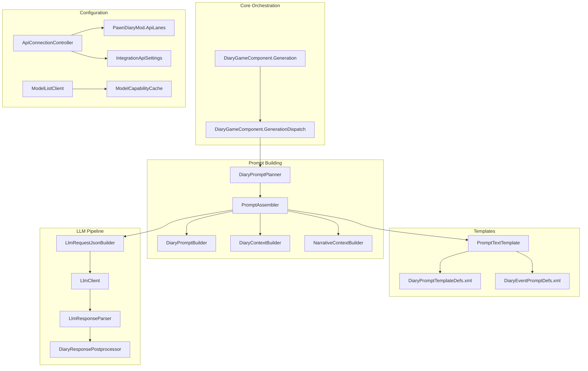
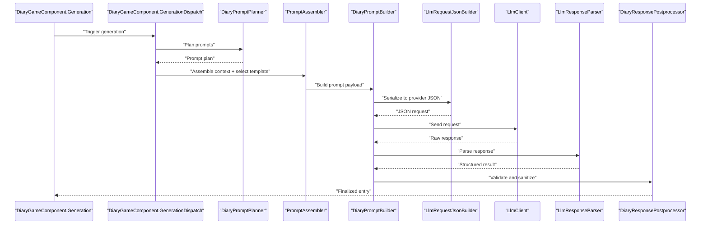
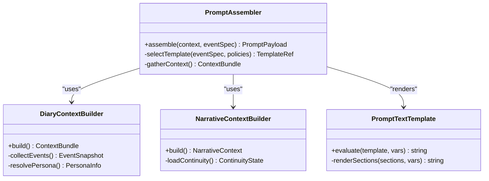
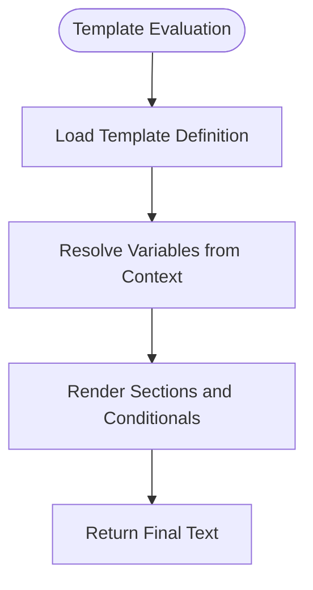
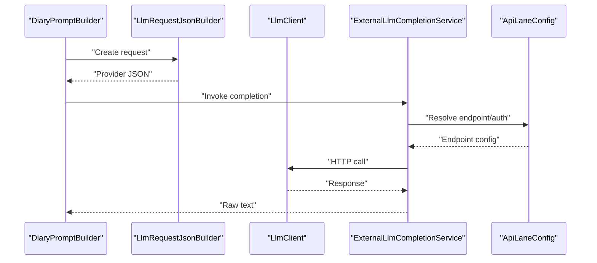
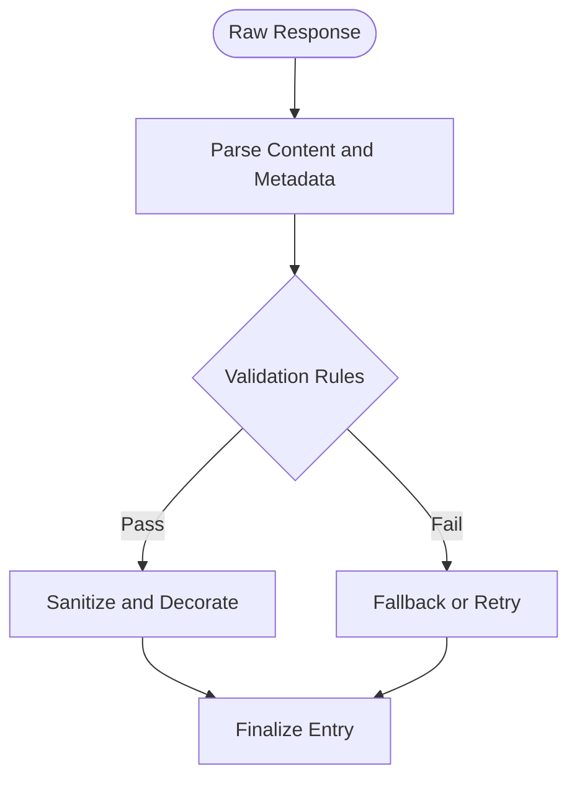
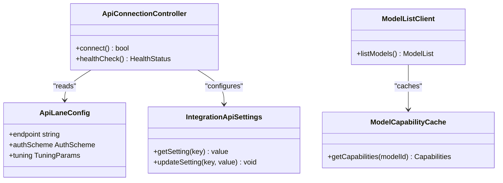
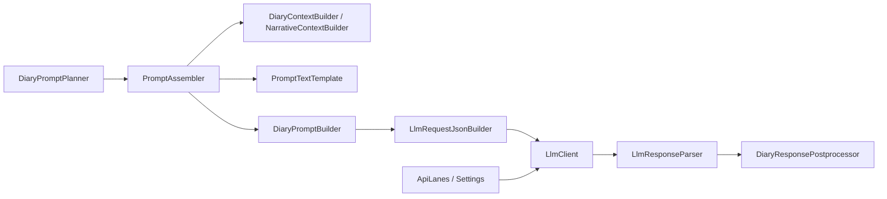

# AI Generation Engine

- [DiaryGameComponent.Generation.cs](../../../../Source/Core/DiaryGameComponent.Generation.cs)
- [DiaryGameComponent.GenerationDispatch.cs](../../../../Source/Core/DiaryGameComponent.GenerationDispatch.cs)
- [PromptAssembler.cs](../../../../Source/Generation/PromptAssembler.cs)
- [DiaryPromptBuilder.cs](../../../../Source/Generation/DiaryPromptBuilder.cs)
- [LlmClient.cs](../../../../Source/Generation/LlmClient.cs)
- [LlmResponseParser.cs](../../../../Source/Generation/LlmResponseParser.cs)
- [LlmRequestJsonBuilder.cs](../../../../Source/Pipeline/LlmRequestJsonBuilder.cs)
- [DiaryResponsePostprocessor.cs](../../../../Source/Pipeline/DiaryResponsePostprocessor.cs)
- [PromptTextTemplate.cs](../../../../Source/Util/PromptTextTemplate.cs)
- [DiaryPromptDef.cs](../../../../Source/Defs/DiaryPromptDef.cs)
- [DiaryPromptTemplateDefs.xml](../../../../1.6/Defs/DiaryPromptTemplateDefs.xml)
- [DiaryEventPromptDefs.xml](../../../../1.6/Defs/DiaryEventPromptDefs.xml)
- [ExternalLlmCompletionService.cs](../../../../Source/Integration/ExternalLlmCompletionService.cs)
- [PawnDiaryMod.ApiLanes.cs](../../../../Source/Settings/PawnDiaryMod.ApiLanes.cs)
- [ApiConnectionController.cs](../../../../Source/Settings/ApiConnectionController.cs)
- [IntegrationApiSettings.cs](../../../../Source/Settings/IntegrationApiSettings.cs)
- [ModelListClient.cs](../../../../Source/Settings/ModelListClient.cs)
- [ModelCapabilityCache.cs](../../../../Source/Settings/ModelCapabilityCache.cs)
- [DiaryPipelineContracts.cs](../../../../Source/Pipeline/DiaryPipelineContracts.cs)
- [DiaryPromptPlanner.cs](../../../../Source/Pipeline/DiaryPromptPlanner.cs)
- [DiaryContextBuilder.cs](../../../../Source/Generation/DiaryContextBuilder.cs)
- [NarrativeContextBuilder.cs](../../../../Source/Generation/NarrativeContextBuilder.cs)
## Table of Contents
1. [Introduction](#introduction)
2. [Project Structure](#project-structure)
3. [Core Components](#core-components)
4. [Architecture Overview](#architecture-overview)
5. [Detailed Component Analysis](#detailed-component-analysis)
6. [Dependency Analysis](#dependency-analysis)
7. [Performance Considerations](#performance-considerations)
8. [Troubleshooting Guide](#troubleshooting-guide)
9. [Conclusion](#conclusion)
10. [Appendices](#appendices)

## Introduction
This document explains the AI-powered generation engine that constructs contextual prompts, communicates with external language model services, and processes responses for narrative entries. It covers prompt building architecture, template system, LLM client integration, response validation, configuration options for multiple providers, error handling strategies, and performance optimization techniques. Examples are provided to guide customization of prompt templates and integration of alternative AI services.

## Project Structure
The AI generation engine spans several subsystems:
- Core orchestration and dispatching
- Prompt assembly and context building
- Template system for dynamic text composition
- LLM request/response pipeline
- Provider configuration and API lanes
- Response postprocessing and validation

**Diagram sources**
- [DiaryGameComponent.Generation.cs](../../../../Source/Core/DiaryGameComponent.Generation.cs)
- [DiaryGameComponent.GenerationDispatch.cs](../../../../Source/Core/DiaryGameComponent.GenerationDispatch.cs)
- [PromptAssembler.cs](../../../../Source/Generation/PromptAssembler.cs)
- [DiaryPromptBuilder.cs](../../../../Source/Generation/DiaryPromptBuilder.cs)
- [DiaryContextBuilder.cs](../../../../Source/Generation/DiaryContextBuilder.cs)
- [NarrativeContextBuilder.cs](../../../../Source/Generation/NarrativeContextBuilder.cs)
- [PromptTextTemplate.cs](../../../../Source/Util/PromptTextTemplate.cs)
- [DiaryPromptTemplateDefs.xml](../../../../1.6/Defs/DiaryPromptTemplateDefs.xml)
- [DiaryEventPromptDefs.xml](../../../../1.6/Defs/DiaryEventPromptDefs.xml)
- [LlmRequestJsonBuilder.cs](../../../../Source/Pipeline/LlmRequestJsonBuilder.cs)
- [LlmClient.cs](../../../../Source/Generation/LlmClient.cs)
- [LlmResponseParser.cs](../../../../Source/Generation/LlmResponseParser.cs)
- [DiaryResponsePostprocessor.cs](../../../../Source/Pipeline/DiaryResponsePostprocessor.cs)
- [PawnDiaryMod.ApiLanes.cs](../../../../Source/Settings/PawnDiaryMod.ApiLanes.cs)
- [ApiConnectionController.cs](../../../../Source/Settings/ApiConnectionController.cs)
- [IntegrationApiSettings.cs](../../../../Source/Settings/IntegrationApiSettings.cs)
- [ModelListClient.cs](../../../../Source/Settings/ModelListClient.cs)
- [ModelCapabilityCache.cs](../../../../Source/Settings/ModelCapabilityCache.cs)

**Section sources**
- [DiaryGameComponent.Generation.cs](../../../../Source/Core/DiaryGameComponent.Generation.cs)
- [DiaryGameComponent.GenerationDispatch.cs](../../../../Source/Core/DiaryGameComponent.GenerationDispatch.cs)
- [PromptAssembler.cs](../../../../Source/Generation/PromptAssembler.cs)
- [DiaryPromptBuilder.cs](../../../../Source/Generation/DiaryPromptBuilder.cs)
- [LlmClient.cs](../../../../Source/Generation/LlmClient.cs)
- [LlmResponseParser.cs](../../../../Source/Generation/LlmResponseParser.cs)
- [LlmRequestJsonBuilder.cs](../../../../Source/Pipeline/LlmRequestJsonBuilder.cs)
- [DiaryResponsePostprocessor.cs](../../../../Source/Pipeline/DiaryResponsePostprocessor.cs)
- [PromptTextTemplate.cs](../../../../Source/Util/PromptTextTemplate.cs)
- [DiaryPromptTemplateDefs.xml](../../../../1.6/Defs/DiaryPromptTemplateDefs.xml)
- [DiaryEventPromptDefs.xml](../../../../1.6/Defs/DiaryEventPromptDefs.xml)
- [PawnDiaryMod.ApiLanes.cs](../../../../Source/Settings/PawnDiaryMod.ApiLanes.cs)
- [ApiConnectionController.cs](../../../../Source/Settings/ApiConnectionController.cs)
- [IntegrationApiSettings.cs](../../../../Source/Settings/IntegrationApiSettings.cs)
- [ModelListClient.cs](../../../../Source/Settings/ModelListClient.cs)
- [ModelCapabilityCache.cs](../../../../Source/Settings/ModelCapabilityCache.cs)

## Core Components
- PromptAssembler: Orchestrates context gathering, template selection, and prompt construction.
- DiaryPromptBuilder: Builds structured prompt payloads from assembled context and templates.
- DiaryContextBuilder and NarrativeContextBuilder: Provide domain-specific context (events, narrative continuity).
- PromptTextTemplate: Evaluates templated strings with captured event data and runtime variables.
- LlmRequestJsonBuilder: Serializes prompts into provider-specific JSON requests.
- LlmClient: Manages HTTP communication, retries, timeouts, and provider routing.
- LlmResponseParser: Parses raw responses into structured content and metadata.
- DiaryResponsePostprocessor: Validates, sanitizes, and enriches generated text before rendering.
- Configuration layer: Api lanes, connection controller, settings, and model capability cache.

**Section sources**
- [PromptAssembler.cs](../../../../Source/Generation/PromptAssembler.cs)
- [DiaryPromptBuilder.cs](../../../../Source/Generation/DiaryPromptBuilder.cs)
- [DiaryContextBuilder.cs](../../../../Source/Generation/DiaryContextBuilder.cs)
- [NarrativeContextBuilder.cs](../../../../Source/Generation/NarrativeContextBuilder.cs)
- [PromptTextTemplate.cs](../../../../Source/Util/PromptTextTemplate.cs)
- [LlmRequestJsonBuilder.cs](../../../../Source/Pipeline/LlmRequestJsonBuilder.cs)
- [LlmClient.cs](../../../../Source/Generation/LlmClient.cs)
- [LlmResponseParser.cs](../../../../Source/Generation/LlmResponseParser.cs)
- [DiaryResponsePostprocessor.cs](../../../../Source/Pipeline/DiaryResponsePostprocessor.cs)
- [PawnDiaryMod.ApiLanes.cs](../../../../Source/Settings/PawnDiaryMod.ApiLanes.cs)
- [ApiConnectionController.cs](../../../../Source/Settings/ApiConnectionController.cs)
- [IntegrationApiSettings.cs](../../../../Source/Settings/IntegrationApiSettings.cs)
- [ModelListClient.cs](../../../../Source/Settings/ModelListClient.cs)
- [ModelCapabilityCache.cs](../../../../Source/Settings/ModelCapabilityCache.cs)

## Architecture Overview
The generation pipeline is orchestrated by core components and flows through well-defined stages: planning, context assembly, prompt building, provider invocation, parsing, and postprocessing.

**Diagram sources**
- [DiaryGameComponent.Generation.cs](../../../../Source/Core/DiaryGameComponent.Generation.cs)
- [DiaryGameComponent.GenerationDispatch.cs](../../../../Source/Core/DiaryGameComponent.GenerationDispatch.cs)
- [DiaryPromptPlanner.cs](../../../../Source/Pipeline/DiaryPromptPlanner.cs)
- [PromptAssembler.cs](../../../../Source/Generation/PromptAssembler.cs)
- [DiaryPromptBuilder.cs](../../../../Source/Generation/DiaryPromptBuilder.cs)
- [LlmRequestJsonBuilder.cs](../../../../Source/Pipeline/LlmRequestJsonBuilder.cs)
- [LlmClient.cs](../../../../Source/Generation/LlmClient.cs)
- [LlmResponseParser.cs](../../../../Source/Generation/LlmResponseParser.cs)
- [DiaryResponsePostprocessor.cs](../../../../Source/Pipeline/DiaryResponsePostprocessor.cs)

## Detailed Component Analysis

### Prompt Assembly and Context Building
- PromptAssembler coordinates context providers and selects appropriate templates based on event type and policy.
- DiaryContextBuilder aggregates game state, recent events, and persona details into a unified context object.
- NarrativeContextBuilder adds continuity-aware context such as prior entries and thematic references.
- PromptTextTemplate evaluates templated strings using captured event data and runtime variables, supporting conditional sections and formatting helpers.

**Diagram sources**
- [PromptAssembler.cs](../../../../Source/Generation/PromptAssembler.cs)
- [DiaryContextBuilder.cs](../../../../Source/Generation/DiaryContextBuilder.cs)
- [NarrativeContextBuilder.cs](../../../../Source/Generation/NarrativeContextBuilder.cs)
- [PromptTextTemplate.cs](../../../../Source/Util/PromptTextTemplate.cs)

**Section sources**
- [PromptAssembler.cs](../../../../Source/Generation/PromptAssembler.cs)
- [DiaryContextBuilder.cs](../../../../Source/Generation/DiaryContextBuilder.cs)
- [NarrativeContextBuilder.cs](../../../../Source/Generation/NarrativeContextBuilder.cs)
- [PromptTextTemplate.cs](../../../../Source/Util/PromptTextTemplate.cs)

### Template System
- Templates are defined via XML definitions and referenced by prompt keys.
- The template engine supports variable substitution, conditional blocks, and list rendering.
- Event-driven prompt definitions map specific events to templates and parameters.

**Diagram sources**
- [PromptTextTemplate.cs](../../../../Source/Util/PromptTextTemplate.cs)
- [DiaryPromptTemplateDefs.xml](../../../../1.6/Defs/DiaryPromptTemplateDefs.xml)
- [DiaryEventPromptDefs.xml](../../../../1.6/Defs/DiaryEventPromptDefs.xml)
- [DiaryPromptDef.cs](../../../../Source/Defs/DiaryPromptDef.cs)

**Section sources**
- [PromptTextTemplate.cs](../../../../Source/Util/PromptTextTemplate.cs)
- [DiaryPromptTemplateDefs.xml](../../../../1.6/Defs/DiaryPromptTemplateDefs.xml)
- [DiaryEventPromptDefs.xml](../../../../1.6/Defs/DiaryEventPromptDefs.xml)
- [DiaryPromptDef.cs](../../../../Source/Defs/DiaryPromptDef.cs)

### LLM Request Construction and Communication
- LlmRequestJsonBuilder transforms prompt payloads into provider-specific JSON structures, including model selection, parameters, and message history.
- LlmClient handles HTTP transport, authentication, retries, timeouts, and rate limiting.
- ExternalLlmCompletionService provides an abstraction over different providers and integrates with the API lane configuration.

**Diagram sources**
- [DiaryPromptBuilder.cs](../../../../Source/Generation/DiaryPromptBuilder.cs)
- [LlmRequestJsonBuilder.cs](../../../../Source/Pipeline/LlmRequestJsonBuilder.cs)
- [LlmClient.cs](../../../../Source/Generation/LlmClient.cs)
- [ExternalLlmCompletionService.cs](../../../../Source/Integration/ExternalLlmCompletionService.cs)
- [PawnDiaryMod.ApiLanes.cs](../../../../Source/Settings/PawnDiaryMod.ApiLanes.cs)

**Section sources**
- [DiaryPromptBuilder.cs](../../../../Source/Generation/DiaryPromptBuilder.cs)
- [LlmRequestJsonBuilder.cs](../../../../Source/Pipeline/LlmRequestJsonBuilder.cs)
- [LlmClient.cs](../../../../Source/Generation/LlmClient.cs)
- [ExternalLlmCompletionService.cs](../../../../Source/Integration/ExternalLlmCompletionService.cs)
- [PawnDiaryMod.ApiLanes.cs](../../../../Source/Settings/PawnDiaryMod.ApiLanes.cs)

### Response Parsing and Validation
- LlmResponseParser extracts content from provider responses, handling variations in format and metadata.
- DiaryResponsePostprocessor validates length, sanitizes unsafe characters, applies decorations, and ensures consistency with writing style and persona constraints.

**Diagram sources**
- [LlmResponseParser.cs](../../../../Source/Generation/LlmResponseParser.cs)
- [DiaryResponsePostprocessor.cs](../../../../Source/Pipeline/DiaryResponsePostprocessor.cs)

**Section sources**
- [LlmResponseParser.cs](../../../../Source/Generation/LlmResponseParser.cs)
- [DiaryResponsePostprocessor.cs](../../../../Source/Pipeline/DiaryResponsePostprocessor.cs)

### Configuration and Provider Management
- Api lanes define endpoints, authentication schemes, and per-provider tuning.
- ApiConnectionController manages lifecycle and connectivity checks.
- IntegrationApiSettings centralizes configuration values and exposes them to UI and runtime.
- ModelListClient and ModelCapabilityCache assist in selecting suitable models and caching capabilities.

**Diagram sources**
- [PawnDiaryMod.ApiLanes.cs](../../../../Source/Settings/PawnDiaryMod.ApiLanes.cs)
- [ApiConnectionController.cs](../../../../Source/Settings/ApiConnectionController.cs)
- [IntegrationApiSettings.cs](../../../../Source/Settings/IntegrationApiSettings.cs)
- [ModelListClient.cs](../../../../Source/Settings/ModelListClient.cs)
- [ModelCapabilityCache.cs](../../../../Source/Settings/ModelCapabilityCache.cs)

**Section sources**
- [PawnDiaryMod.ApiLanes.cs](../../../../Source/Settings/PawnDiaryMod.ApiLanes.cs)
- [ApiConnectionController.cs](../../../../Source/Settings/ApiConnectionController.cs)
- [IntegrationApiSettings.cs](../../../../Source/Settings/IntegrationApiSettings.cs)
- [ModelListClient.cs](../../../../Source/Settings/ModelListClient.cs)
- [ModelCapabilityCache.cs](../../../../Source/Settings/ModelCapabilityCache.cs)

## Dependency Analysis
The generation engine exhibits clear separation of concerns:
- Orchestration depends on planning and assembly but not on provider specifics.
- Prompt building depends on templates and context builders.
- LLM communication depends on request builders and configuration.
- Response processing depends on parsers and postprocessors.

**Diagram sources**
- [DiaryPromptPlanner.cs](../../../../Source/Pipeline/DiaryPromptPlanner.cs)
- [PromptAssembler.cs](../../../../Source/Generation/PromptAssembler.cs)
- [DiaryContextBuilder.cs](../../../../Source/Generation/DiaryContextBuilder.cs)
- [NarrativeContextBuilder.cs](../../../../Source/Generation/NarrativeContextBuilder.cs)
- [PromptTextTemplate.cs](../../../../Source/Util/PromptTextTemplate.cs)
- [DiaryPromptBuilder.cs](../../../../Source/Generation/DiaryPromptBuilder.cs)
- [LlmRequestJsonBuilder.cs](../../../../Source/Pipeline/LlmRequestJsonBuilder.cs)
- [LlmClient.cs](../../../../Source/Generation/LlmClient.cs)
- [LlmResponseParser.cs](../../../../Source/Generation/LlmResponseParser.cs)
- [DiaryResponsePostprocessor.cs](../../../../Source/Pipeline/DiaryResponsePostprocessor.cs)
- [PawnDiaryMod.ApiLanes.cs](../../../../Source/Settings/PawnDiaryMod.ApiLanes.cs)
- [IntegrationApiSettings.cs](../../../../Source/Settings/IntegrationApiSettings.cs)

**Section sources**
- [DiaryPromptPlanner.cs](../../../../Source/Pipeline/DiaryPromptPlanner.cs)
- [PromptAssembler.cs](../../../../Source/Generation/PromptAssembler.cs)
- [DiaryContextBuilder.cs](../../../../Source/Generation/DiaryContextBuilder.cs)
- [NarrativeContextBuilder.cs](../../../../Source/Generation/NarrativeContextBuilder.cs)
- [PromptTextTemplate.cs](../../../../Source/Util/PromptTextTemplate.cs)
- [DiaryPromptBuilder.cs](../../../../Source/Generation/DiaryPromptBuilder.cs)
- [LlmRequestJsonBuilder.cs](../../../../Source/Pipeline/LlmRequestJsonBuilder.cs)
- [LlmClient.cs](../../../../Source/Generation/LlmClient.cs)
- [LlmResponseParser.cs](../../../../Source/Generation/LlmResponseParser.cs)
- [DiaryResponsePostprocessor.cs](../../../../Source/Pipeline/DiaryResponsePostprocessor.cs)
- [PawnDiaryMod.ApiLanes.cs](../../../../Source/Settings/PawnDiaryMod.ApiLanes.cs)
- [IntegrationApiSettings.cs](../../../../Source/Settings/IntegrationApiSettings.cs)

## Performance Considerations
- Batch planning: Use prompt planning to group related events and reduce redundant context assembly.
- Caching: Cache model capabilities and frequently used context snapshots to avoid repeated computation.
- Streaming: If supported by provider, stream tokens to improve perceived latency.
- Rate limiting: Respect provider quotas and implement backoff strategies in the client.
- Prompt size control: Truncate or summarize long contexts to stay within token limits.
- Parallelism: Where safe, parallelize independent prompt generations across pawns or domains.

[No sources needed since this section provides general guidance]

## Troubleshooting Guide
Common issues and resolutions:
- Authentication failures: Verify API keys and endpoint URLs; use health checks to validate connectivity.
- Malformed responses: Inspect parser logs and adjust regex or JSON schema expectations.
- Excessive token usage: Reduce context size, enable truncation, and refine templates.
- Timeouts: Increase timeout thresholds or switch to faster models; consider retry with exponential backoff.
- Inconsistent style: Adjust writing style overrides and persona constraints in postprocessing.

**Section sources**
- [LlmClient.cs](../../../../Source/Generation/LlmClient.cs)
- [LlmResponseParser.cs](../../../../Source/Generation/LlmResponseParser.cs)
- [DiaryResponsePostprocessor.cs](../../../../Source/Pipeline/DiaryResponsePostprocessor.cs)
- [ApiConnectionController.cs](../../../../Source/Settings/ApiConnectionController.cs)

## Conclusion
The AI generation engine combines robust prompt assembly, flexible templating, and resilient LLM communication to produce high-quality narrative entries. Its modular design allows easy customization of templates and integration of alternative providers while maintaining strong validation and performance controls.

[No sources needed since this section summarizes without analyzing specific files]

## Appendices

### Customizing Prompt Templates
- Add new templates in the template definitions file and reference them via prompt keys.
- Use variables from captured event data and persona context to personalize output.
- Employ conditional sections to adapt tone and detail based on mood, traits, or DLC features.

**Section sources**
- [DiaryPromptTemplateDefs.xml](../../../../1.6/Defs/DiaryPromptTemplateDefs.xml)
- [DiaryEventPromptDefs.xml](../../../../1.6/Defs/DiaryEventPromptDefs.xml)
- [PromptTextTemplate.cs](../../../../Source/Util/PromptTextTemplate.cs)

### Integrating Alternative AI Services
- Define a new API lane with endpoint and authentication scheme.
- Implement provider-specific request serialization in the request builder.
- Extend the completion service to route requests to the new provider.
- Update model capability cache to reflect supported features.

**Section sources**
- [PawnDiaryMod.ApiLanes.cs](../../../../Source/Settings/PawnDiaryMod.ApiLanes.cs)
- [LlmRequestJsonBuilder.cs](../../../../Source/Pipeline/LlmRequestJsonBuilder.cs)
- [ExternalLlmCompletionService.cs](../../../../Source/Integration/ExternalLlmCompletionService.cs)
- [ModelCapabilityCache.cs](../../../../Source/Settings/ModelCapabilityCache.cs)
