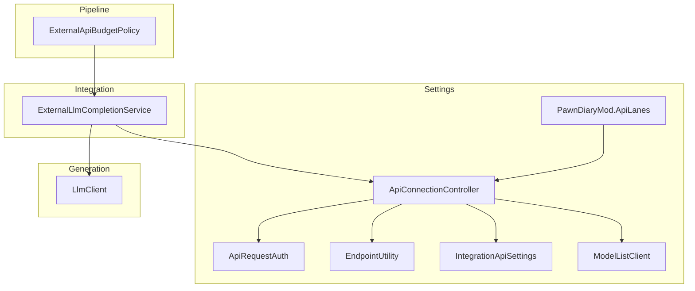
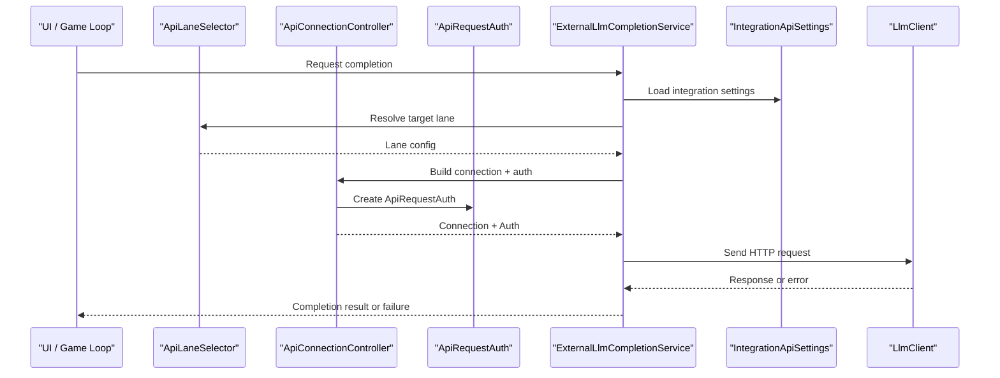
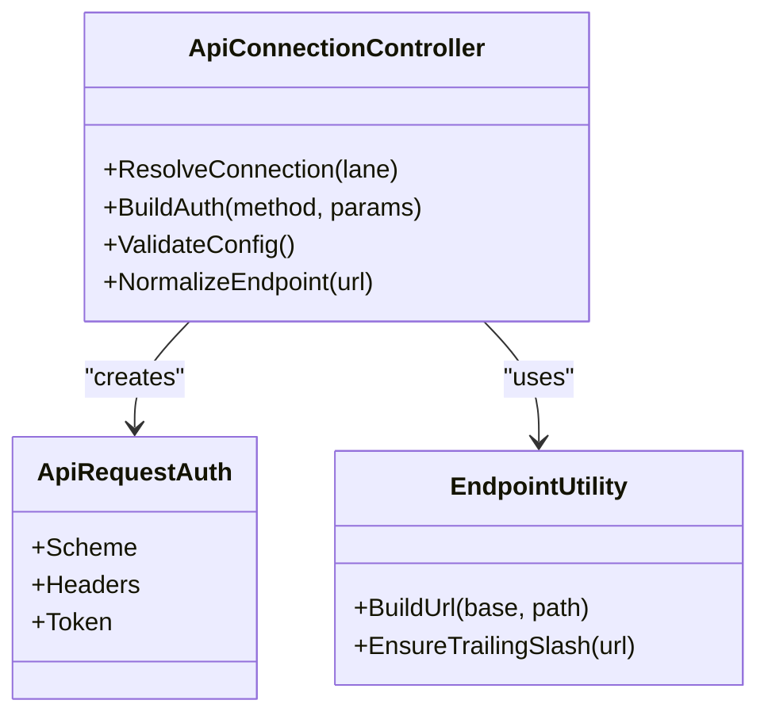
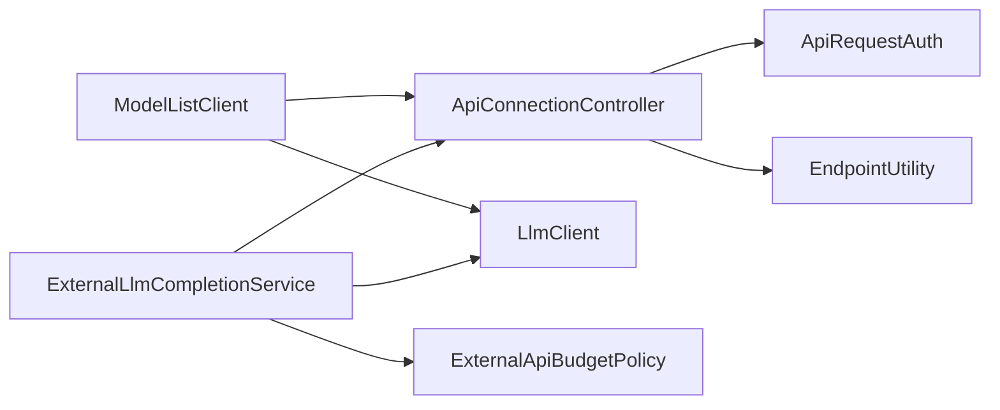

# Configuration & Authentication

<cite>
**Referenced Files in This Document**
- [ApiConnectionController.cs](../../../../../Source/Settings/ApiConnectionController.cs)
- [ApiRequestAuth.cs](../../../../../Source/Settings/ApiRequestAuth.cs)
- [EndpointUtility.cs](../../../../../Source/Settings/EndpointUtility.cs)
- [IntegrationApiSettings.cs](../../../../../Source/Settings/IntegrationApiSettings.cs)
- [ModelListClient.cs](../../../../../Source/Settings/ModelListClient.cs)
- [ExternalLlmCompletionService.cs](../../../../../Source/Integration/ExternalLlmCompletionService.cs)
- [LlmClient.cs](../../../../../Source/Generation/LlmClient.cs)
- [PawnDiaryMod.ApiLanes.cs](../../../../../Source/Settings/PawnDiaryMod.ApiLanes.cs)
- [ExternalApiBudgetPolicy.cs](../../../../../Source/Pipeline/ExternalApiBudgetPolicy.cs)
</cite>

## Table of Contents
1. [Introduction](#introduction)
2. [Project Structure](#project-structure)
3. [Core Components](#core-components)
4. [Architecture Overview](#architecture-overview)
5. [Detailed Component Analysis](#detailed-component-analysis)
6. [Dependency Analysis](#dependency-analysis)
7. [Performance Considerations](#performance-considerations)
8. [Troubleshooting Guide](#troubleshooting-guide)
9. [Conclusion](#conclusion)
10. [Appendices](#appendices)

## Introduction
This document explains how LLM service configuration and authentication are implemented, focusing on the ApiConnectionController and related components. It covers connection settings, credential storage, supported authentication methods (API keys, OAuth tokens, custom schemes), security best practices, provider configuration examples, implementing custom authentication handlers, and graceful handling of authentication failures.

## Project Structure
The relevant code for configuration and authentication is primarily located under Source/Settings and integrates with Generation and Integration layers:
- Settings layer: connection controller, request auth model, endpoint utilities, integration API settings, model list client, and UI wiring for API lanes.
- Generation layer: HTTP client used to call LLM endpoints.
- Integration layer: higher-level completion service that composes requests and responses.

**Diagram sources**
- [ApiConnectionController.cs](../../../../../Source/Settings/ApiConnectionController.cs)
- [ApiRequestAuth.cs](../../../../../Source/Settings/ApiRequestAuth.cs)
- [EndpointUtility.cs](../../../../../Source/Settings/EndpointUtility.cs)
- [IntegrationApiSettings.cs](../../../../../Source/Settings/IntegrationApiSettings.cs)
- [ModelListClient.cs](../../../../../Source/Settings/ModelListClient.cs)
- [PawnDiaryMod.ApiLanes.cs](../../../../../Source/Settings/PawnDiaryMod.ApiLanes.cs)
- [ExternalLlmCompletionService.cs](../../../../../Source/Integration/ExternalLlmCompletionService.cs)
- [LlmClient.cs](../../../../../Source/Generation/LlmClient.cs)
- [ExternalApiBudgetPolicy.cs](../../../../../Source/Pipeline/ExternalApiBudgetPolicy.cs)

**Section sources**
- [ApiConnectionController.cs](../../../../../Source/Settings/ApiConnectionController.cs)
- [ApiRequestAuth.cs](../../../../../Source/Settings/ApiRequestAuth.cs)
- [EndpointUtility.cs](../../../../../Source/Settings/EndpointUtility.cs)
- [IntegrationApiSettings.cs](../../../../../Source/Settings/IntegrationApiSettings.cs)
- [ModelListClient.cs](../../../../../Source/Settings/ModelListClient.cs)
- [PawnDiaryMod.ApiLanes.cs](../../../../../Source/Settings/PawnDiaryMod.ApiLanes.cs)
- [ExternalLlmCompletionService.cs](../../../../../Source/Integration/ExternalLlmCompletionService.cs)
- [LlmClient.cs](../../../../../Source/Generation/LlmClient.cs)
- [ExternalApiBudgetPolicy.cs](../../../../../Source/Pipeline/ExternalApiBudgetPolicy.cs)

## Core Components
- ApiConnectionController: Centralizes connection settings per lane/provider, resolves endpoints, and prepares credentials for outbound requests. It exposes helpers to validate and normalize configuration and to build authenticated requests.
- ApiRequestAuth: Represents authentication data attached to a request (e.g., header names/values, token types). Used by controllers and clients to inject credentials into HTTP calls.
- EndpointUtility: Provides helper methods for building and validating URLs, normalizing base endpoints, and constructing full request paths.
- IntegrationApiSettings: Holds persistent or runtime settings for external integrations, including provider selection and feature toggles.
- ModelListClient: Queries available models from a configured provider using current connection settings and authentication.
- ExternalLlmCompletionService: Orchestrates LLM completion calls, composing context, selecting lanes, applying budgets, and invoking the underlying HTTP client.
- LlmClient: Low-level HTTP client abstraction for sending requests to LLM providers and parsing responses.
- PawnDiaryMod.ApiLanes: UI and runtime wiring for defining and managing API lanes (provider-specific configurations).
- ExternalApiBudgetPolicy: Enforces rate limits and budget constraints around external API usage.

Key responsibilities:
- Connection management: resolve base URL, timeouts, retries, and headers.
- Credential management: store and apply API keys, bearer tokens, or custom schemes.
- Provider configuration: map logical lanes to concrete providers and their specific options.
- Error handling: translate provider errors into consistent application exceptions.

**Section sources**
- [ApiConnectionController.cs](../../../../../Source/Settings/ApiConnectionController.cs)
- [ApiRequestAuth.cs](../../../../../Source/Settings/ApiRequestAuth.cs)
- [EndpointUtility.cs](../../../../../Source/Settings/EndpointUtility.cs)
- [IntegrationApiSettings.cs](../../../../../Source/Settings/IntegrationApiSettings.cs)
- [ModelListClient.cs](../../../../../Source/Settings/ModelListClient.cs)
- [ExternalLlmCompletionService.cs](../../../../../Source/Integration/ExternalLlmCompletionService.cs)
- [LlmClient.cs](../../../../../Source/Generation/LlmClient.cs)
- [PawnDiaryMod.ApiLanes.cs](../../../../../Source/Settings/PawnDiaryMod.ApiLanes.cs)
- [ExternalApiBudgetPolicy.cs](../../../../../Source/Pipeline/ExternalApiBudgetPolicy.cs)

## Architecture Overview
The system separates concerns across layers:
- Settings layer defines and validates connections and credentials.
- Integration layer composes requests and applies policies (budgets).
- Generation layer performs network I/O.

**Diagram sources**
- [ExternalLlmCompletionService.cs](../../../../../Source/Integration/ExternalLlmCompletionService.cs)
- [ApiConnectionController.cs](../../../../../Source/Settings/ApiConnectionController.cs)
- [ApiRequestAuth.cs](../../../../../Source/Settings/ApiRequestAuth.cs)
- [IntegrationApiSettings.cs](../../../../../Source/Settings/IntegrationApiSettings.cs)
- [LlmClient.cs](../../../../../Source/Generation/LlmClient.cs)

## Detailed Component Analysis

### ApiConnectionController
Responsibilities:
- Resolves provider-specific connection parameters (base URL, timeouts, headers).
- Builds ApiRequestAuth instances based on selected authentication method.
- Validates configuration completeness and normalizes values (e.g., trimming, casing).
- Exposes helpers to construct final request URIs via EndpointUtility.

Supported authentication methods:
- API key: typically injected via a header (e.g., X-API-Key) or query parameter depending on provider.
- OAuth bearer token: set Authorization header with Bearer scheme.
- Custom auth scheme: allow pluggable header injection for proprietary protocols.

Security considerations:
- Avoid logging secrets; sanitize logs before writing.
- Prefer environment variables for secrets at runtime.
- Persist only non-sensitive identifiers; keep tokens out of long-term storage when possible.

Common operations:
- Get or create a connection for a given lane.
- Validate required fields (endpoint, key/token presence).
- Attach authentication headers to outgoing requests.

**Section sources**
- [ApiConnectionController.cs](../../../../../Source/Settings/ApiConnectionController.cs)
- [ApiRequestAuth.cs](../../../../../Source/Settings/ApiRequestAuth.cs)
- [EndpointUtility.cs](../../../../../Source/Settings/EndpointUtility.cs)

#### Class Diagram

**Diagram sources**
- [ApiConnectionController.cs](../../../../../Source/Settings/ApiConnectionController.cs)
- [ApiRequestAuth.cs](../../../../../Source/Settings/ApiRequestAuth.cs)
- [EndpointUtility.cs](../../../../../Source/Settings/EndpointUtility.cs)

### ApiRequestAuth
Represents the authentication payload for a single request:
- Scheme: e.g., Bearer, ApiKey, or custom.
- Headers: map of header name to value.
- Token: optional raw token string for convenience.

Usage:
- Built by ApiConnectionController based on selected method.
- Consumed by LlmClient to attach headers to HTTP requests.

**Section sources**
- [ApiRequestAuth.cs](../../../../../Source/Settings/ApiRequestAuth.cs)

### EndpointUtility
Helpers for URL construction and normalization:
- Ensures consistent base URL formatting.
- Combines base URL with relative paths safely.
- Validates protocol and host presence.

**Section sources**
- [EndpointUtility.cs](../../../../../Source/Settings/EndpointUtility.cs)

### IntegrationApiSettings
Holds integration-wide configuration:
- Default provider selection.
- Feature flags for capabilities like streaming or tool use.
- Global retry/backoff policies.

**Section sources**
- [IntegrationApiSettings.cs](../../../../../Source/Settings/IntegrationApiSettings.cs)

### ModelListClient
Queries provider model catalogs:
- Uses current connection settings and authentication.
- Parses provider-specific JSON structures into normalized model lists.
- Caches results to reduce overhead.

**Section sources**
- [ModelListClient.cs](../../../../../Source/Settings/ModelListClient.cs)

### ExternalLlmCompletionService
Orchestrates completion calls:
- Selects lane and builds request payload.
- Applies ExternalApiBudgetPolicy to enforce quotas.
- Invokes LlmClient and maps responses/errors.

**Section sources**
- [ExternalLlmCompletionService.cs](../../../../../Source/Integration/ExternalLlmCompletionService.cs)
- [ExternalApiBudgetPolicy.cs](../../../../../Source/Pipeline/ExternalApiBudgetPolicy.cs)

### LlmClient
Low-level HTTP client:
- Sends requests with constructed headers and body.
- Handles timeouts, retries, and transport errors.
- Deserializes provider responses into domain objects.

**Section sources**
- [LlmClient.cs](../../../../../Source/Generation/LlmClient.cs)

### PawnDiaryMod.ApiLanes
Wires UI and runtime for API lanes:
- Defines provider presets and user-editable fields.
- Persists lane definitions and active selection.
- Integrates with ApiConnectionController to validate and apply changes.

**Section sources**
- [PawnDiaryMod.ApiLanes.cs](../../../../../Source/Settings/PawnDiaryMod.ApiLanes.cs)

## Dependency Analysis
High-level dependencies:
- ExternalLlmCompletionService depends on ApiConnectionController, ApiRequestAuth, and LlmClient.
- ApiConnectionController depends on ApiRequestAuth and EndpointUtility.
- ModelListClient depends on ApiConnectionController and LlmClient.
- ExternalApiBudgetPolicy wraps ExternalLlmCompletionService to constrain usage.

**Diagram sources**
- [ExternalLlmCompletionService.cs](../../../../../Source/Integration/ExternalLlmCompletionService.cs)
- [ApiConnectionController.cs](../../../../../Source/Settings/ApiConnectionController.cs)
- [ApiRequestAuth.cs](../../../../../Source/Settings/ApiRequestAuth.cs)
- [EndpointUtility.cs](../../../../../Source/Settings/EndpointUtility.cs)
- [ModelListClient.cs](../../../../../Source/Settings/ModelListClient.cs)
- [LlmClient.cs](../../../../../Source/Generation/LlmClient.cs)
- [ExternalApiBudgetPolicy.cs](../../../../../Source/Pipeline/ExternalApiBudgetPolicy.cs)

**Section sources**
- [ExternalLlmCompletionService.cs](../../../../../Source/Integration/ExternalLlmCompletionService.cs)
- [ApiConnectionController.cs](../../../../../Source/Settings/ApiConnectionController.cs)
- [ApiRequestAuth.cs](../../../../../Source/Settings/ApiRequestAuth.cs)
- [EndpointUtility.cs](../../../../../Source/Settings/EndpointUtility.cs)
- [ModelListClient.cs](../../../../../Source/Settings/ModelListClient.cs)
- [LlmClient.cs](../../../../../Source/Generation/LlmClient.cs)
- [ExternalApiBudgetPolicy.cs](../../../../../Source/Pipeline/ExternalApiBudgetPolicy.cs)

## Performance Considerations
- Cache model listings and capability metadata where safe to do so.
- Use connection pooling and reuse HTTP clients to avoid handshake overhead.
- Apply backoff and jitter on transient errors to prevent thundering herds.
- Respect ExternalApiBudgetPolicy to avoid throttling and wasted cycles.
- Minimize serialization/deserialization by reusing buffers and avoiding unnecessary allocations.

[No sources needed since this section provides general guidance]

## Troubleshooting Guide
Common issues and resolutions:
- Missing or invalid credentials: ensure ApiConnectionController receives valid keys/tokens and that headers are correctly named and formatted.
- Endpoint misconfiguration: verify base URL normalization and trailing slash behavior via EndpointUtility.
- Rate limiting or quota exceeded: check ExternalApiBudgetPolicy and adjust budgets or implement exponential backoff.
- Network errors: inspect LlmClient retry policy and timeout settings.
- Provider-specific auth failures: confirm whether the provider expects API key in header vs. query parameter and update ApiRequestAuth accordingly.

Operational checks:
- Validate configuration completeness before making requests.
- Log sanitized diagnostics (no secrets).
- Test connectivity with a lightweight endpoint (e.g., model listing) before heavy generation calls.

**Section sources**
- [ApiConnectionController.cs](../../../../../Source/Settings/ApiConnectionController.cs)
- [ApiRequestAuth.cs](../../../../../Source/Settings/ApiRequestAuth.cs)
- [EndpointUtility.cs](../../../../../Source/Settings/EndpointUtility.cs)
- [ExternalApiBudgetPolicy.cs](../../../../../Source/Pipeline/ExternalApiBudgetPolicy.cs)
- [LlmClient.cs](../../../../../Source/Generation/LlmClient.cs)

## Conclusion
The configuration and authentication subsystem centers on ApiConnectionController, which standardizes connection setup and credential injection across providers. By separating concerns among settings, integration orchestration, and low-level networking, the system remains extensible for new providers and auth schemes while maintaining clear security boundaries and robust error handling.

[No sources needed since this section summarizes without analyzing specific files]

## Appendices

### Security Best Practices
- Store secrets in environment variables or secure vaults; never hardcode them.
- Avoid persisting tokens unless necessary; prefer short-lived tokens with refresh flows.
- Sanitize all logs to exclude sensitive data.
- Validate and normalize inputs (URLs, headers) to prevent injection.
- Use HTTPS-only endpoints and certificate validation.

[No sources needed since this section provides general guidance]

### Configuring Different LLM Providers
General steps:
- Define an API lane with provider-specific fields (base URL, auth type, header names).
- Provide credentials via environment variables or secure settings.
- Validate the connection using a model listing or health check.
- Set default lane for global usage or select per-prompt.

Provider examples:
- OpenAI-compatible: Bearer token in Authorization header; base URL points to chat completions endpoint.
- Azure OpenAI: Bearer token with resource URL and API version query parameter.
- Anthropic: API key in a provider-specific header; include API version header if required.
- Local/self-hosted: API key or no-auth mode; ensure CORS and TLS are configured appropriately.

[No sources needed since this section provides general guidance]

### Implementing Custom Authentication Handlers
Steps:
- Extend ApiRequestAuth to support your scheme (e.g., HMAC signature).
- Update ApiConnectionController to build the appropriate headers for your scheme.
- Ensure LlmClient attaches these headers to every request.
- Add tests for success and failure cases, including malformed signatures.

**Section sources**
- [ApiRequestAuth.cs](../../../../../Source/Settings/ApiRequestAuth.cs)
- [ApiConnectionController.cs](../../../../../Source/Settings/ApiConnectionController.cs)
- [LlmClient.cs](../../../../../Source/Generation/LlmClient.cs)

### Handling Authentication Failures Gracefully
Patterns:
- Detect 401/403 responses and surface actionable messages to users.
- Retry once with refreshed tokens if applicable.
- Fallback to a safe state (disable AI features) rather than crashing.
- Record minimal diagnostic info (status codes, endpoint) without secrets.

**Section sources**
- [ExternalLlmCompletionService.cs](../../../../../Source/Integration/ExternalLlmCompletionService.cs)
- [LlmClient.cs](../../../../../Source/Generation/LlmClient.cs)
