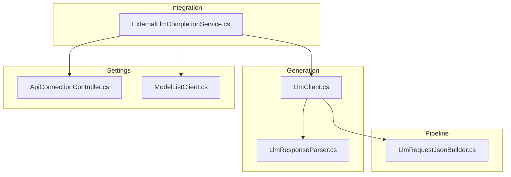
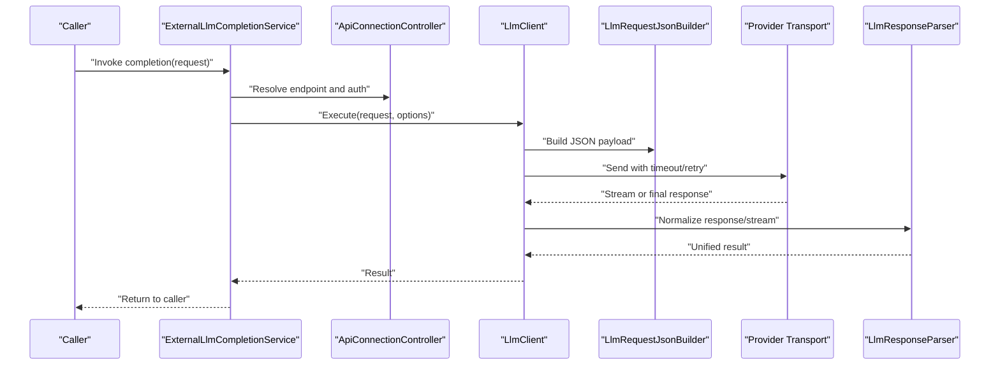
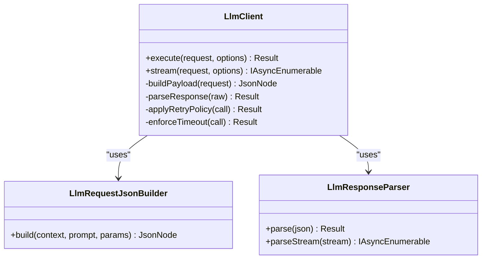
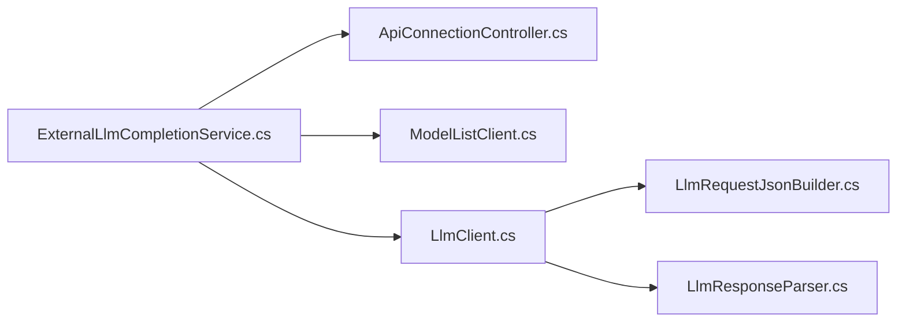

# LLM Client Architecture

- [LlmClient.cs](../../../../../Source/Generation/LlmClient.cs)
- [LlmResponseParser.cs](../../../../../Source/Generation/LlmResponseParser.cs)
- [LlmRequestJsonBuilder.cs](../../../../../Source/Pipeline/LlmRequestJsonBuilder.cs)
- [ExternalLlmCompletionService.cs](../../../../../Source/Integration/ExternalLlmCompletionService.cs)
- [ApiConnectionController.cs](../../../../../Source/Settings/ApiConnectionController.cs)
- [ModelListClient.cs](../../../../../Source/Settings/ModelListClient.cs)
## Table of Contents
1. [Introduction](#introduction)
2. [Project Structure](#project-structure)
3. [Core Components](#core-components)
4. [Architecture Overview](#architecture-overview)
5. [Detailed Component Analysis](#detailed-component-analysis)
6. [Dependency Analysis](#dependency-analysis)
7. [Performance Considerations](#performance-considerations)
8. [Troubleshooting Guide](#troubleshooting-guide)
9. [Conclusion](#conclusion)

## Introduction
This document explains the LLM client architecture used by the project to abstract different Large Language Model providers behind a unified interface. It focuses on the core LlmClient class design, connection management patterns, and request/response handling mechanisms. It also covers how the client integrates with provider-specific services, implements retry logic and timeouts, and supports streaming responses. Guidance is provided for making API calls, building custom requests, and handling errors and performance considerations such as memory management and resource cleanup.

## Project Structure
The LLM client layer spans several areas:
- Generation: Core client and response parsing
- Pipeline: Request construction utilities
- Integration: Service facade that wires configuration and transport
- Settings: Connection control and model listing helpers

**Diagram sources**
- [LlmClient.cs](../../../../../Source/Generation/LlmClient.cs)
- [LlmResponseParser.cs](../../../../../Source/Generation/LlmResponseParser.cs)
- [LlmRequestJsonBuilder.cs](../../../../../Source/Pipeline/LlmRequestJsonBuilder.cs)
- [ExternalLlmCompletionService.cs](../../../../../Source/Integration/ExternalLlmCompletionService.cs)
- [ApiConnectionController.cs](../../../../../Source/Settings/ApiConnectionController.cs)
- [ModelListClient.cs](../../../../../Source/Settings/ModelListClient.cs)

**Section sources**
- [LlmClient.cs](../../../../../Source/Generation/LlmClient.cs)
- [LlmResponseParser.cs](../../../../../Source/Generation/LlmResponseParser.cs)
- [LlmRequestJsonBuilder.cs](../../../../../Source/Pipeline/LlmRequestJsonBuilder.cs)
- [ExternalLlmCompletionService.cs](../../../../../Source/Integration/ExternalLlmCompletionService.cs)
- [ApiConnectionController.cs](../../../../../Source/Settings/ApiConnectionController.cs)
- [ModelListClient.cs](../../../../../Source/Settings/ModelListClient.cs)

## Core Components
- LlmClient: Central orchestrator for constructing requests, sending them via configured transports, handling retries/timeouts, and parsing responses. It exposes a unified API over multiple providers.
- LlmRequestJsonBuilder: Builds provider-agnostic request payloads into JSON structures consumed by the underlying transport.
- LlmResponseParser: Normalizes heterogeneous provider responses into a consistent internal representation and handles streaming token delivery where applicable.
- ExternalLlmCompletionService: High-level service that coordinates settings, connection lifecycle, and invocation flows for completion endpoints.
- ApiConnectionController: Manages connection state, credentials, endpoint selection, and shared HTTP resources.
- ModelListClient: Queries available models and capabilities to inform routing and feature gating.

Key responsibilities:
- Unified interface across providers
- Connection pooling and reuse
- Retry/backoff policies
- Timeout enforcement
- Streaming support
- Error normalization and propagation

**Section sources**
- [LlmClient.cs](../../../../../Source/Generation/LlmClient.cs)
- [LlmRequestJsonBuilder.cs](../../../../../Source/Pipeline/LlmRequestJsonBuilder.cs)
- [LlmResponseParser.cs](../../../../../Source/Generation/LlmResponseParser.cs)
- [ExternalLlmCompletionService.cs](../../../../../Source/Integration/ExternalLlmCompletionService.cs)
- [ApiConnectionController.cs](../../../../../Source/Settings/ApiConnectionController.cs)
- [ModelListClient.cs](../../../../../Source/Settings/ModelListClient.cs)

## Architecture Overview
The client follows a layered approach:
- Presentation/Integration layer (ExternalLlmCompletionService) composes configuration and invokes the core client.
- Core client (LlmClient) builds requests, manages retries/timeouts, and delegates transport to a provider-specific implementation.
- Utilities (LlmRequestJsonBuilder, LlmResponseParser) handle serialization and deserialization.
- Settings (ApiConnectionController, ModelListClient) provide runtime configuration and discovery.

**Diagram sources**
- [ExternalLlmCompletionService.cs](../../../../../Source/Integration/ExternalLlmCompletionService.cs)
- [ApiConnectionController.cs](../../../../../Source/Settings/ApiConnectionController.cs)
- [LlmClient.cs](../../../../../Source/Generation/LlmClient.cs)
- [LlmRequestJsonBuilder.cs](../../../../../Source/Pipeline/LlmRequestJsonBuilder.cs)
- [LlmResponseParser.cs](../../../../../Source/Generation/LlmResponseParser.cs)

## Detailed Component Analysis

### LlmClient
Responsibilities:
- Expose a unified API for non-streaming and streaming completions
- Compose requests using LlmRequestJsonBuilder
- Manage retry/backoff and timeout policies
- Parse responses via LlmResponseParser
- Coordinate with provider transport abstractions

Design patterns:
- Strategy for provider transport selection
- Decorator-like behavior for retries/timeouts around transport calls
- Observer/callbacks for streaming tokens

Error handling:
- Normalize provider-specific errors into a common error type
- Surface transient vs. permanent failures to callers
- Respect cancellation tokens for long-running operations

Performance:
- Reuse connections through ApiConnectionController
- Stream large outputs to reduce memory pressure
- Avoid unnecessary allocations during request building

**Section sources**
- [LlmClient.cs](../../../../../Source/Generation/LlmClient.cs)

#### Class Diagram

**Diagram sources**
- [LlmClient.cs](../../../../../Source/Generation/LlmClient.cs)
- [LlmRequestJsonBuilder.cs](../../../../../Source/Pipeline/LlmRequestJsonBuilder.cs)
- [LlmResponseParser.cs](../../../../../Source/Generation/LlmResponseParser.cs)

### LlmRequestJsonBuilder
Responsibilities:
- Convert domain request objects into provider-specific JSON payloads
- Apply default parameters and feature flags
- Sanitize inputs and truncate context when needed

Optimizations:
- Minimize string concatenation; use builders
- Cache reusable fragments when safe

**Section sources**
- [LlmRequestJsonBuilder.cs](../../../../../Source/Pipeline/LlmRequestJsonBuilder.cs)

### LlmResponseParser
Responsibilities:
- Deserialize provider responses into a unified structure
- Handle partial content, truncation markers, and metadata
- Support streaming tokenization by emitting incremental tokens

Streaming:
- Backpressure-aware enumeration
- Graceful termination on cancellation or network errors

**Section sources**
- [LlmResponseParser.cs](../../../../../Source/Generation/LlmResponseParser.cs)

### ExternalLlmCompletionService
Responsibilities:
- Orchestrate high-level completion workflows
- Resolve endpoints and authentication via ApiConnectionController
- Route to LlmClient based on selected provider/model
- Expose simple APIs for callers

Integration points:
- Reads settings from ApiConnectionController
- Optionally consults ModelListClient for capability checks

**Section sources**
- [ExternalLlmCompletionService.cs](../../../../../Source/Integration/ExternalLlmCompletionService.cs)
- [ApiConnectionController.cs](../../../../../Source/Settings/ApiConnectionController.cs)
- [ModelListClient.cs](../../../../../Source/Settings/ModelListClient.cs)

### ApiConnectionController
Responsibilities:
- Maintain connection pool and shared HTTP clients
- Provide endpoint resolution and credential injection
- Enforce global timeouts and retry policies

Lifecycle:
- Initialize once per process or per tenant
- Dispose to release sockets and buffers

**Section sources**
- [ApiConnectionController.cs](../../../../../Source/Settings/ApiConnectionController.cs)

### ModelListClient
Responsibilities:
- Query available models and features
- Cache results to avoid repeated network calls
- Inform routing decisions in ExternalLlmCompletionService

**Section sources**
- [ModelListClient.cs](../../../../../Source/Settings/ModelListClient.cs)

## Dependency Analysis
High-level dependencies:
- ExternalLlmCompletionService depends on ApiConnectionController and ModelListClient for configuration and discovery
- LlmClient depends on LlmRequestJsonBuilder and LlmResponseParser for serialization/deserialization
- All components rely on ApiConnectionController for shared transport resources

**Diagram sources**
- [ExternalLlmCompletionService.cs](../../../../../Source/Integration/ExternalLlmCompletionService.cs)
- [ApiConnectionController.cs](../../../../../Source/Settings/ApiConnectionController.cs)
- [ModelListClient.cs](../../../../../Source/Settings/ModelListClient.cs)
- [LlmClient.cs](../../../../../Source/Generation/LlmClient.cs)
- [LlmRequestJsonBuilder.cs](../../../../../Source/Pipeline/LlmRequestJsonBuilder.cs)
- [LlmResponseParser.cs](../../../../../Source/Generation/LlmResponseParser.cs)

**Section sources**
- [ExternalLlmCompletionService.cs](../../../../../Source/Integration/ExternalLlmCompletionService.cs)
- [ApiConnectionController.cs](../../../../../Source/Settings/ApiConnectionController.cs)
- [ModelListClient.cs](../../../../../Source/Settings/ModelListClient.cs)
- [LlmClient.cs](../../../../../Source/Generation/LlmClient.cs)
- [LlmRequestJsonBuilder.cs](../../../../../Source/Pipeline/LlmRequestJsonBuilder.cs)
- [LlmResponseParser.cs](../../../../../Source/Generation/LlmResponseParser.cs)

## Performance Considerations
- Connection pooling: Use ApiConnectionController to share HTTP clients and sockets across requests.
- Streaming: Prefer streaming APIs for long outputs to reduce memory usage and improve time-to-first-token.
- Timeouts: Configure per-request and global timeouts to prevent resource starvation.
- Retries: Implement exponential backoff with jitter for transient errors; limit maximum attempts.
- Memory management: Stream responses, avoid loading entire payloads into memory, and dispose disposable resources promptly.
- Serialization: Build JSON efficiently and reuse templates where possible.

[No sources needed since this section provides general guidance]

## Troubleshooting Guide
Common issues and strategies:
- Network timeouts: Increase timeouts or enable adaptive retry; verify endpoint reachability.
- Authentication failures: Validate credentials and scopes via ApiConnectionController diagnostics.
- Rate limiting: Observe provider headers and implement backoff; consider queuing or batching.
- Partial responses: Inspect parser logs for truncation markers and adjust context size.
- Memory spikes: Switch to streaming and ensure proper disposal of streams and buffers.

Operational tips:
- Enable detailed logging at the client and transport layers.
- Use ModelListClient to confirm model availability and capabilities before invoking.
- Monitor retry counts and error rates to detect upstream instability.

**Section sources**
- [ApiConnectionController.cs](../../../../../Source/Settings/ApiConnectionController.cs)
- [LlmClient.cs](../../../../../Source/Generation/LlmClient.cs)
- [LlmResponseParser.cs](../../../../../Source/Generation/LlmResponseParser.cs)

## Conclusion
The LLM client architecture provides a robust, provider-agnostic interface built around LlmClient, supported by clear separation of concerns for request building, response parsing, connection management, and orchestration. By leveraging connection pooling, streaming, retries, and timeouts, it balances reliability and performance while remaining extensible for new providers and features.
