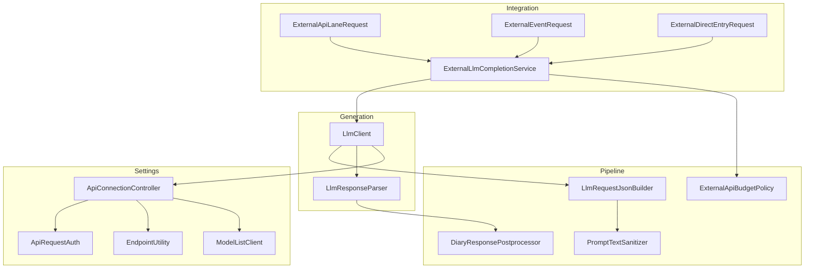
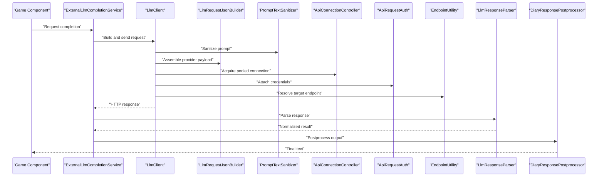
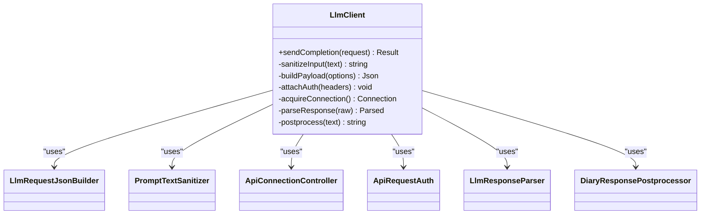
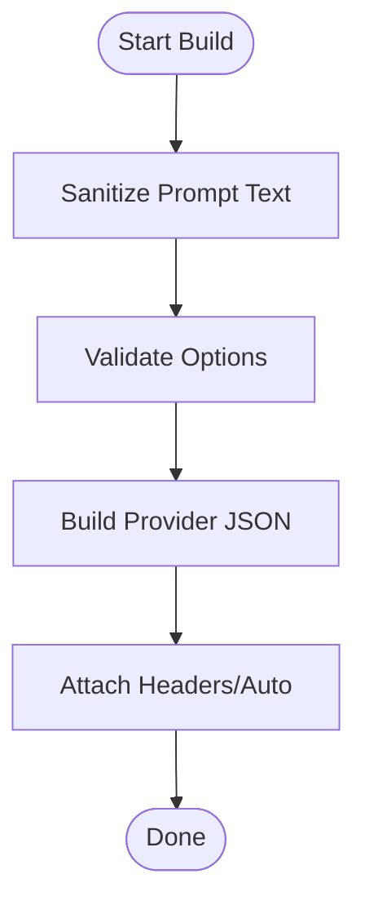
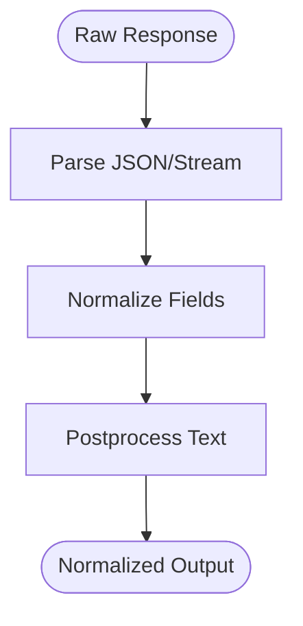
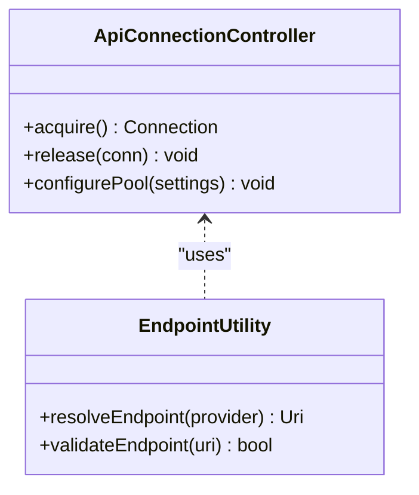
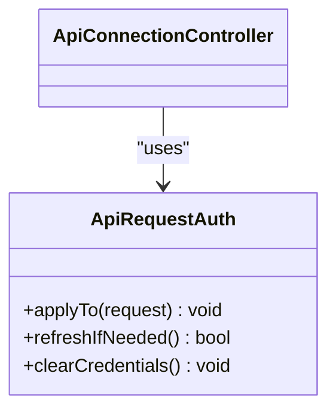
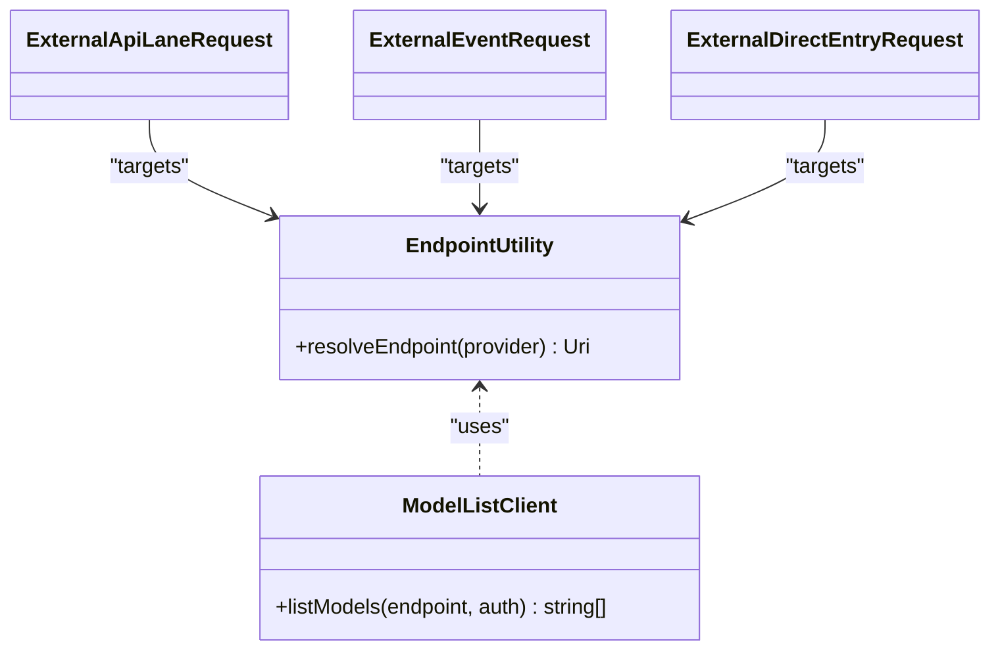
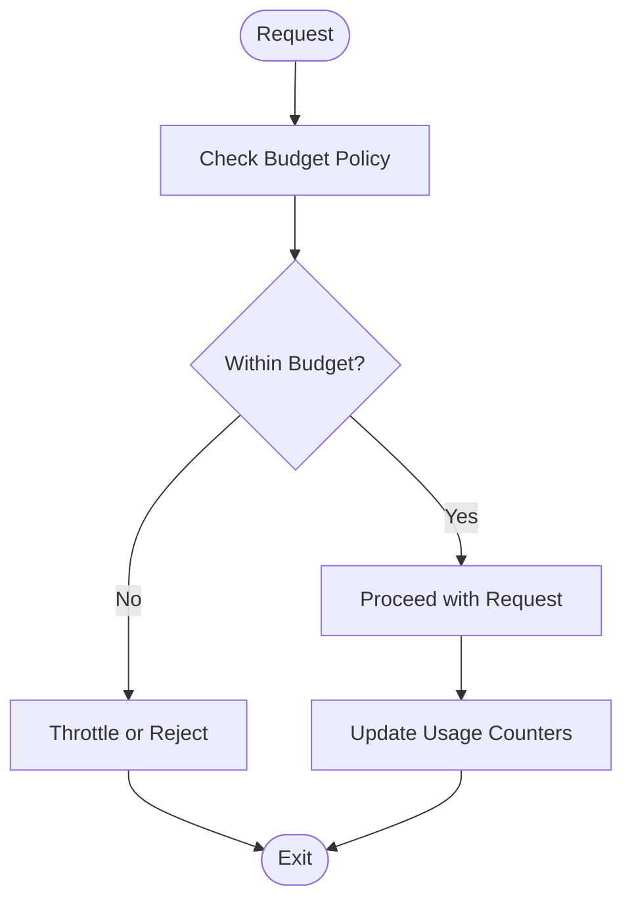
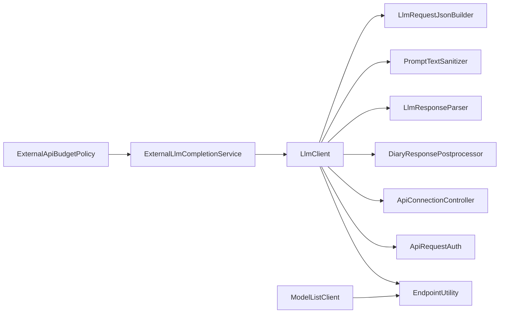

# Language Model Integration

- [LlmClient.cs](../../../../../Source/Generation/LlmClient.cs)
- [LlmResponseParser.cs](../../../../../Source/Generation/LlmResponseParser.cs)
- [ExternalLlmCompletionService.cs](../../../../../Source/Integration/ExternalLlmCompletionService.cs)
- [LlmRequestJsonBuilder.cs](../../../../../Source/Pipeline/LlmRequestJsonBuilder.cs)
- [ApiConnectionController.cs](../../../../../Source/Settings/ApiConnectionController.cs)
- [ApiRequestAuth.cs](../../../../../Source/Settings/ApiRequestAuth.cs)
- [EndpointUtility.cs](../../../../../Source/Settings/EndpointUtility.cs)
- [ModelListClient.cs](../../../../../Source/Settings/ModelListClient.cs)
- [DiaryGameComponent.ExternalApiBudget.cs](../../../../../Source/Core/DiaryGameComponent.ExternalApiBudget.cs)
- [ExternalApiLaneRequest.cs](../../../../../Source/Integration/ExternalApiLaneRequest.cs)
- [ExternalEventRequest.cs](../../../../../Source/Integration/ExternalEventRequest.cs)
- [ExternalDirectEntryRequest.cs](../../../../../Source/Integration/ExternalDirectEntryRequest.cs)
- [PromptTextSanitizer.cs](../../../../../Source/Pipeline/PromptTextSanitizer.cs)
- [DiaryResponsePostprocessor.cs](../../../../../Source/Pipeline/DiaryResponsePostprocessor.cs)
- [ExternalApiBudgetPolicy.cs](../../../../../Source/Pipeline/ExternalApiBudgetPolicy.cs)
## Table of Contents
1. [Introduction](#introduction)
2. [Project Structure](#project-structure)
3. [Core Components](#core-components)
4. [Architecture Overview](#architecture-overview)
5. [Detailed Component Analysis](#detailed-component-analysis)
6. [Dependency Analysis](#dependency-analysis)
7. [Performance Considerations](#performance-considerations)
8. [Troubleshooting Guide](#troubleshooting-guide)
9. [Conclusion](#conclusion)
10. [Appendices](#appendices)

## Introduction
This document explains how the language model integration works, focusing on how LlmClient manages communication with external AI services, including connection handling, authentication, request/response formatting, configuration for multiple providers, rate limiting, error recovery, and security considerations. It also provides guidance for adding new providers, implementing custom authentication, optimizing API calls for cost and performance, and designing fallback strategies when primary services are unavailable.

## Project Structure
The LLM integration spans several layers:
- Generation layer: client orchestration and response parsing
- Pipeline layer: request building, text sanitization, postprocessing, budgeting
- Settings layer: connection control, authentication, endpoints, model listing
- Integration layer: higher-level APIs that consume the LLM client

**Diagram sources**
- [LlmClient.cs](../../../../../Source/Generation/LlmClient.cs)
- [LlmResponseParser.cs](../../../../../Source/Generation/LlmResponseParser.cs)
- [LlmRequestJsonBuilder.cs](../../../../../Source/Pipeline/LlmRequestJsonBuilder.cs)
- [PromptTextSanitizer.cs](../../../../../Source/Pipeline/PromptTextSanitizer.cs)
- [DiaryResponsePostprocessor.cs](../../../../../Source/Pipeline/DiaryResponsePostprocessor.cs)
- [ApiConnectionController.cs](../../../../../Source/Settings/ApiConnectionController.cs)
- [ApiRequestAuth.cs](../../../../../Source/Settings/ApiRequestAuth.cs)
- [EndpointUtility.cs](../../../../../Source/Settings/EndpointUtility.cs)
- [ModelListClient.cs](../../../../../Source/Settings/ModelListClient.cs)
- [ExternalLlmCompletionService.cs](../../../../../Source/Integration/ExternalLlmCompletionService.cs)
- [ExternalApiLaneRequest.cs](../../../../../Source/Integration/ExternalApiLaneRequest.cs)
- [ExternalEventRequest.cs](../../../../../Source/Integration/ExternalEventRequest.cs)
- [ExternalDirectEntryRequest.cs](../../../../../Source/Integration/ExternalDirectEntryRequest.cs)
- [ExternalApiBudgetPolicy.cs](../../../../../Source/Pipeline/ExternalApiBudgetPolicy.cs)

**Section sources**
- [LlmClient.cs](../../../../../Source/Generation/LlmClient.cs)
- [LlmResponseParser.cs](../../../../../Source/Generation/LlmResponseParser.cs)
- [LlmRequestJsonBuilder.cs](../../../../../Source/Pipeline/LlmRequestJsonBuilder.cs)
- [PromptTextSanitizer.cs](../../../../../Source/Pipeline/PromptTextSanitizer.cs)
- [DiaryResponsePostprocessor.cs](../../../../../Source/Pipeline/DiaryResponsePostprocessor.cs)
- [ApiConnectionController.cs](../../../../../Source/Settings/ApiConnectionController.cs)
- [ApiRequestAuth.cs](../../../../../Source/Settings/ApiRequestAuth.cs)
- [EndpointUtility.cs](../../../../../Source/Settings/EndpointUtility.cs)
- [ModelListClient.cs](../../../../../Source/Settings/ModelListClient.cs)
- [ExternalLlmCompletionService.cs](../../../../../Source/Integration/ExternalLlmCompletionService.cs)
- [ExternalApiLaneRequest.cs](../../../../../Source/Integration/ExternalApiLaneRequest.cs)
- [ExternalEventRequest.cs](../../../../../Source/Integration/ExternalEventRequest.cs)
- [ExternalDirectEntryRequest.cs](../../../../../Source/Integration/ExternalDirectEntryRequest.cs)
- [ExternalApiBudgetPolicy.cs](../../../../../Source/Pipeline/ExternalApiBudgetPolicy.cs)

## Core Components
- LlmClient: Central orchestrator for outbound requests to LLM providers. Responsible for assembling HTTP requests, applying authentication, managing timeouts/retries, and delegating response parsing.
- LlmRequestJsonBuilder: Builds provider-specific JSON payloads from prompts and options.
- PromptTextSanitizer: Cleans and normalizes prompt text before sending to providers.
- LlmResponseParser: Parses provider responses into a unified format consumed by the rest of the system.
- DiaryResponsePostprocessor: Applies final transformations (e.g., formatting, truncation) to generated text.
- ApiConnectionController: Manages connection lifecycle, pooling, and endpoint selection.
- ApiRequestAuth: Encapsulates credential handling and token management.
- EndpointUtility: Resolves provider endpoints and routes requests accordingly.
- ModelListClient: Enumerates available models via provider APIs.
- ExternalLlmCompletionService: Higher-level service used by game components to request completions.
- ExternalApiBudgetPolicy: Enforces per-request or per-session budgets to control costs.

Key responsibilities:
- Connection pooling and reuse across requests
- Provider-agnostic request construction and response normalization
- Authentication injection and rotation
- Rate limiting and budget enforcement
- Error classification and retry/fallback logic

**Section sources**
- [LlmClient.cs](../../../../../Source/Generation/LlmClient.cs)
- [LlmRequestJsonBuilder.cs](../../../../../Source/Pipeline/LlmRequestJsonBuilder.cs)
- [PromptTextSanitizer.cs](../../../../../Source/Pipeline/PromptTextSanitizer.cs)
- [LlmResponseParser.cs](../../../../../Source/Generation/LlmResponseParser.cs)
- [DiaryResponsePostprocessor.cs](../../../../../Source/Pipeline/DiaryResponsePostprocessor.cs)
- [ApiConnectionController.cs](../../../../../Source/Settings/ApiConnectionController.cs)
- [ApiRequestAuth.cs](../../../../../Source/Settings/ApiRequestAuth.cs)
- [EndpointUtility.cs](../../../../../Source/Settings/EndpointUtility.cs)
- [ModelListClient.cs](../../../../../Source/Settings/ModelListClient.cs)
- [ExternalLlmCompletionService.cs](../../../../../Source/Integration/ExternalLlmCompletionService.cs)
- [ExternalApiBudgetPolicy.cs](../../../../../Source/Pipeline/ExternalApiBudgetPolicy.cs)

## Architecture Overview
End-to-end flow for a completion request:

**Diagram sources**
- [ExternalLlmCompletionService.cs](../../../../../Source/Integration/ExternalLlmCompletionService.cs)
- [LlmClient.cs](../../../../../Source/Generation/LlmClient.cs)
- [LlmRequestJsonBuilder.cs](../../../../../Source/Pipeline/LlmRequestJsonBuilder.cs)
- [PromptTextSanitizer.cs](../../../../../Source/Pipeline/PromptTextSanitizer.cs)
- [ApiConnectionController.cs](../../../../../Source/Settings/ApiConnectionController.cs)
- [ApiRequestAuth.cs](../../../../../Source/Settings/ApiRequestAuth.cs)
- [EndpointUtility.cs](../../../../../Source/Settings/EndpointUtility.cs)
- [LlmResponseParser.cs](../../../../../Source/Generation/LlmResponseParser.cs)
- [DiaryResponsePostprocessor.cs](../../../../../Source/Pipeline/DiaryResponsePostprocessor.cs)

## Detailed Component Analysis

### LlmClient
Responsibilities:
- Coordinates request lifecycle: sanitize input, build payload, attach auth, manage connections, handle retries/timeouts, parse responses, and apply postprocessing.
- Integrates with budget policy to enforce cost controls.
- Provides a stable interface for callers while abstracting provider differences.

Key behaviors:
- Request assembly delegates to LlmRequestJsonBuilder and PromptTextSanitizer.
- Connection reuse is handled through ApiConnectionController.
- Authentication is injected via ApiRequestAuth.
- Response parsing uses LlmResponseParser; final formatting uses DiaryResponsePostprocessor.

**Diagram sources**
- [LlmClient.cs](../../../../../Source/Generation/LlmClient.cs)
- [LlmRequestJsonBuilder.cs](../../../../../Source/Pipeline/LlmRequestJsonBuilder.cs)
- [PromptTextSanitizer.cs](../../../../../Source/Pipeline/PromptTextSanitizer.cs)
- [ApiConnectionController.cs](../../../../../Source/Settings/ApiConnectionController.cs)
- [ApiRequestAuth.cs](../../../../../Source/Settings/ApiRequestAuth.cs)
- [LlmResponseParser.cs](../../../../../Source/Generation/LlmResponseParser.cs)
- [DiaryResponsePostprocessor.cs](../../../../../Source/Pipeline/DiaryResponsePostprocessor.cs)

**Section sources**
- [LlmClient.cs](../../../../../Source/Generation/LlmClient.cs)

### Request Building and Formatting
- LlmRequestJsonBuilder constructs provider-specific payloads based on shared options (model, temperature, max tokens, etc.).
- PromptTextSanitizer ensures safe inputs by removing disallowed characters and enforcing length limits.

**Diagram sources**
- [LlmRequestJsonBuilder.cs](../../../../../Source/Pipeline/LlmRequestJsonBuilder.cs)
- [PromptTextSanitizer.cs](../../../../../Source/Pipeline/PromptTextSanitizer.cs)

**Section sources**
- [LlmRequestJsonBuilder.cs](../../../../../Source/Pipeline/LlmRequestJsonBuilder.cs)
- [PromptTextSanitizer.cs](../../../../../Source/Pipeline/PromptTextSanitizer.cs)

### Response Parsing and Postprocessing
- LlmResponseParser converts raw provider responses into a normalized structure.
- DiaryResponsePostprocessor applies final formatting, truncation, and safety checks.

**Diagram sources**
- [LlmResponseParser.cs](../../../../../Source/Generation/LlmResponseParser.cs)
- [DiaryResponsePostprocessor.cs](../../../../../Source/Pipeline/DiaryResponsePostprocessor.cs)

**Section sources**
- [LlmResponseParser.cs](../../../../../Source/Generation/LlmResponseParser.cs)
- [DiaryResponsePostprocessor.cs](../../../../../Source/Pipeline/DiaryResponsePostprocessor.cs)

### Connection Pooling and Endpoint Management
- ApiConnectionController manages pooled HTTP connections, reducing overhead and improving throughput.
- EndpointUtility resolves provider endpoints and supports routing based on configuration.

**Diagram sources**
- [ApiConnectionController.cs](../../../../../Source/Settings/ApiConnectionController.cs)
- [EndpointUtility.cs](../../../../../Source/Settings/EndpointUtility.cs)

**Section sources**
- [ApiConnectionController.cs](../../../../../Source/Settings/ApiConnectionController.cs)
- [EndpointUtility.cs](../../../../../Source/Settings/EndpointUtility.cs)

### Authentication Handling
- ApiRequestAuth encapsulates credential storage, header injection, and token refresh flows.
- Supports common schemes (e.g., bearer tokens) and can be extended for custom mechanisms.

**Diagram sources**
- [ApiRequestAuth.cs](../../../../../Source/Settings/ApiRequestAuth.cs)
- [ApiConnectionController.cs](../../../../../Source/Settings/ApiConnectionController.cs)

**Section sources**
- [ApiRequestAuth.cs](../../../../../Source/Settings/ApiRequestAuth.cs)
- [ApiConnectionController.cs](../../../../../Source/Settings/ApiConnectionController.cs)

### Configuration and Provider Setup
- EndpointUtility centralizes endpoint resolution for different providers.
- ModelListClient queries provider APIs to enumerate available models.
- ExternalApiLaneRequest, ExternalEventRequest, and ExternalDirectEntryRequest define structured inputs consumed by higher-level services.

**Diagram sources**
- [EndpointUtility.cs](../../../../../Source/Settings/EndpointUtility.cs)
- [ModelListClient.cs](../../../../../Source/Settings/ModelListClient.cs)
- [ExternalApiLaneRequest.cs](../../../../../Source/Integration/ExternalApiLaneRequest.cs)
- [ExternalEventRequest.cs](../../../../../Source/Integration/ExternalEventRequest.cs)
- [ExternalDirectEntryRequest.cs](../../../../../Source/Integration/ExternalDirectEntryRequest.cs)

**Section sources**
- [EndpointUtility.cs](../../../../../Source/Settings/EndpointUtility.cs)
- [ModelListClient.cs](../../../../../Source/Settings/ModelListClient.cs)
- [ExternalApiLaneRequest.cs](../../../../../Source/Integration/ExternalApiLaneRequest.cs)
- [ExternalEventRequest.cs](../../../../../Source/Integration/ExternalEventRequest.cs)
- [ExternalDirectEntryRequest.cs](../../../../../Source/Integration/ExternalDirectEntryRequest.cs)

### Budgeting and Rate Limiting
- ExternalApiBudgetPolicy enforces per-request or session-based budgets to control costs and throttle usage.
- DiaryGameComponent.ExternalApiBudget.cs integrates budget tracking at the game component level.

**Diagram sources**
- [ExternalApiBudgetPolicy.cs](../../../../../Source/Pipeline/ExternalApiBudgetPolicy.cs)
- [DiaryGameComponent.ExternalApiBudget.cs](../../../../../Source/Core/DiaryGameComponent.ExternalApiBudget.cs)

**Section sources**
- [ExternalApiBudgetPolicy.cs](../../../../../Source/Pipeline/ExternalApiBudgetPolicy.cs)
- [DiaryGameComponent.ExternalApiBudget.cs](../../../../../Source/Core/DiaryGameComponent.ExternalApiBudget.cs)

### Adding a New LLM Provider
Steps:
1. Define provider-specific endpoint(s) in EndpointUtility.
2. Extend LlmRequestJsonBuilder to support the new provider’s payload schema.
3. If needed, extend LlmResponseParser to normalize the provider’s response format.
4. Configure authentication in ApiRequestAuth if the provider requires unique headers or signing.
5. Register the provider in any discovery/model-listing logic via ModelListClient.
6. Add tests to validate request/response round-trips and error paths.

Best practices:
- Keep provider-specific code isolated behind builder/parser interfaces.
- Use consistent option mapping (model, temperature, max tokens).
- Ensure idempotency where possible and robust error classification.

[No sources needed since this section provides general guidance]

### Implementing Custom Authentication Methods
Approach:
- Implement a custom authentication strategy within ApiRequestAuth.
- Inject required headers, signatures, or tokens into outgoing requests.
- Support token refresh and caching to minimize latency.

Security tips:
- Avoid logging secrets.
- Rotate keys regularly and use short-lived tokens when available.
- Restrict scope of API keys to minimum necessary permissions.

[No sources needed since this section provides general guidance]

### Optimizing API Calls for Cost and Performance
Recommendations:
- Tune temperature and max tokens to reduce output size and cost.
- Batch related prompts when supported by the provider.
- Cache repeated or similar responses using a local cache keyed by prompt hash.
- Use smaller models for simple tasks and reserve larger models for complex reasoning.
- Apply PromptTextSanitizer to remove unnecessary context and reduce token usage.
- Monitor budgets with ExternalApiBudgetPolicy and set hard caps per session.

[No sources needed since this section provides general guidance]

### Security Considerations and Credential Management
Guidelines:
- Store credentials securely and avoid embedding them in source code.
- Use environment variables or secure configuration stores.
- Prefer least-privilege API keys and rotate frequently.
- Validate endpoints and certificates to prevent MITM attacks.
- Scrub sensitive data from logs and diagnostics.

[No sources needed since this section provides general guidance]

### Fallback Strategies When Primary Services Are Unavailable
Design patterns:
- Maintain a list of alternative providers or endpoints.
- On failure (network errors, rate limits, invalid responses), automatically retry with backoff and then switch to a fallback provider.
- Track success rates and dynamically adjust routing weights.
- Gracefully degrade by returning cached or locally generated content when all providers fail.

Implementation pointers:
- Integrate fallback selection in LlmClient or ExternalLlmCompletionService.
- Use EndpointUtility to resolve alternate endpoints.
- Log failures with minimal sensitive details for observability.

[No sources needed since this section provides general guidance]

## Dependency Analysis
High-level dependencies among core components:

**Diagram sources**
- [LlmClient.cs](../../../../../Source/Generation/LlmClient.cs)
- [LlmRequestJsonBuilder.cs](../../../../../Source/Pipeline/LlmRequestJsonBuilder.cs)
- [PromptTextSanitizer.cs](../../../../../Source/Pipeline/PromptTextSanitizer.cs)
- [LlmResponseParser.cs](../../../../../Source/Generation/LlmResponseParser.cs)
- [DiaryResponsePostprocessor.cs](../../../../../Source/Pipeline/DiaryResponsePostprocessor.cs)
- [ApiConnectionController.cs](../../../../../Source/Settings/ApiConnectionController.cs)
- [ApiRequestAuth.cs](../../../../../Source/Settings/ApiRequestAuth.cs)
- [EndpointUtility.cs](../../../../../Source/Settings/EndpointUtility.cs)
- [ExternalLlmCompletionService.cs](../../../../../Source/Integration/ExternalLlmCompletionService.cs)
- [ExternalApiBudgetPolicy.cs](../../../../../Source/Pipeline/ExternalApiBudgetPolicy.cs)
- [ModelListClient.cs](../../../../../Source/Settings/ModelListClient.cs)

**Section sources**
- [LlmClient.cs](../../../../../Source/Generation/LlmClient.cs)
- [ExternalLlmCompletionService.cs](../../../../../Source/Integration/ExternalLlmCompletionService.cs)
- [ExternalApiBudgetPolicy.cs](../../../../../Source/Pipeline/ExternalApiBudgetPolicy.cs)

## Performance Considerations
- Reuse connections via ApiConnectionController to reduce handshake overhead.
- Minimize payload size by trimming prompts and controlling output length.
- Use streaming responses when supported to reduce perceived latency.
- Implement exponential backoff and jitter for retries to avoid thundering herds.
- Monitor and cap usage with ExternalApiBudgetPolicy to prevent runaway costs.

[No sources needed since this section provides general guidance]

## Troubleshooting Guide
Common issues and resolutions:
- Authentication failures: Verify credentials in ApiRequestAuth and ensure correct header names and scopes.
- Endpoint misconfiguration: Confirm EndpointUtility mappings and network reachability.
- Rate limit errors: Adjust ExternalApiBudgetPolicy settings and implement backoff/retry.
- Malformed responses: Inspect LlmResponseParser logs and normalize fields; add defensive parsing.
- Excessive costs: Review prompt sizes and output lengths; enable stricter budget policies.

Operational tips:
- Enable detailed request/response tracing without secrets.
- Record error fingerprints and stack traces for rapid diagnosis.
- Use health checks against endpoints and model lists to detect outages early.

[No sources needed since this section provides general guidance]

## Conclusion
The LLM integration centers around LlmClient, which coordinates request building, authentication, connection pooling, parsing, and postprocessing. The design isolates provider-specific logic in builders and parsers, enabling easy extension for new providers. Robust configuration, budgeting, and fallback strategies ensure reliability and cost control. Following the security and optimization recommendations will help maintain a resilient and efficient integration.

## Appendices

### Example Requests and Responses
- ExternalApiLaneRequest: Structured request for lane-based operations.
- ExternalEventRequest: Event-driven completion request.
- ExternalDirectEntryRequest: Direct entry completion request.

Use these types to compose requests consistently across the system.

**Section sources**
- [ExternalApiLaneRequest.cs](../../../../../Source/Integration/ExternalApiLaneRequest.cs)
- [ExternalEventRequest.cs](../../../../../Source/Integration/ExternalEventRequest.cs)
- [ExternalDirectEntryRequest.cs](../../../../../Source/Integration/ExternalDirectEntryRequest.cs)
