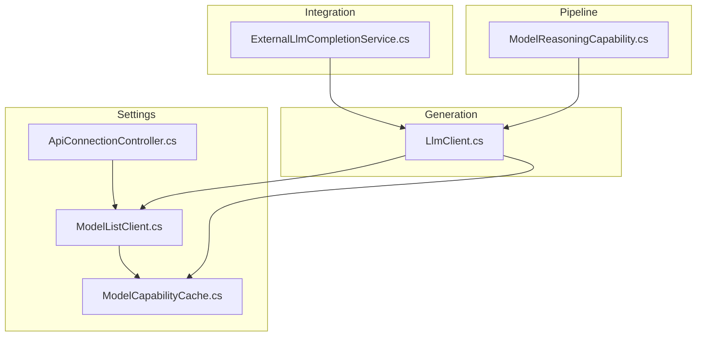
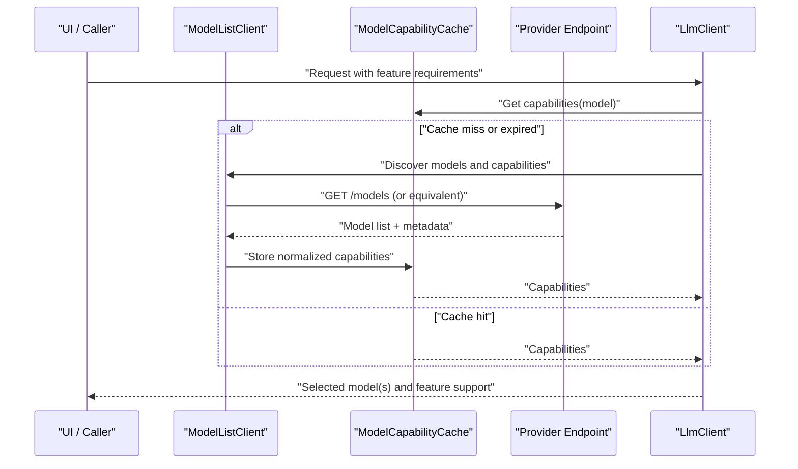
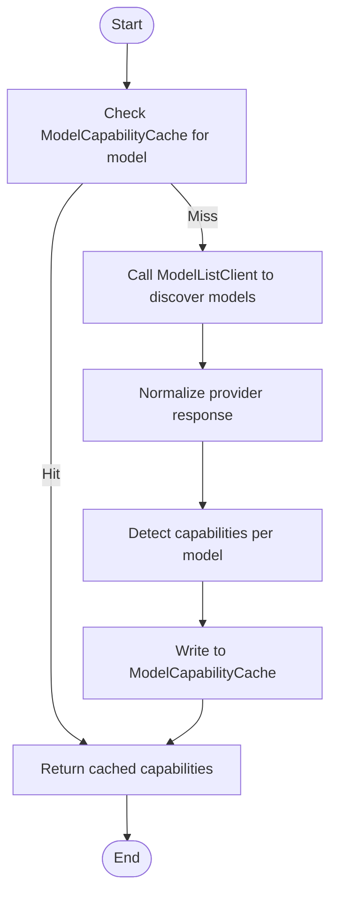
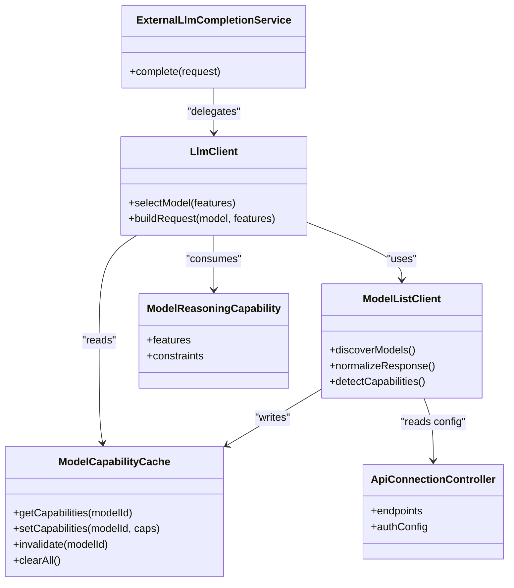

# Model Capability Management

- [ModelListClient.cs](../../../../../Source/Settings/ModelListClient.cs)
- [ModelCapabilityCache.cs](../../../../../Source/Settings/ModelCapabilityCache.cs)
- [ModelReasoningCapability.cs](../../../../../Source/Pipeline/ModelReasoningCapability.cs)
- [LlmClient.cs](../../../../../Source/Generation/LlmClient.cs)
- [ExternalLlmCompletionService.cs](../../../../../Source/Integration/ExternalLlmCompletionService.cs)
- [ApiConnectionController.cs](../../../../../Source/Settings/ApiConnectionController.cs)
## Table of Contents
1. [Introduction](#introduction)
2. [Project Structure](#project-structure)
3. [Core Components](#core-components)
4. [Architecture Overview](#architecture-overview)
5. [Detailed Component Analysis](#detailed-component-analysis)
6. [Dependency Analysis](#dependency-analysis)
7. [Performance Considerations](#performance-considerations)
8. [Troubleshooting Guide](#troubleshooting-guide)
9. [Conclusion](#conclusion)

## Introduction
This document explains how the system discovers available models from LLM providers and manages capability metadata through a dedicated cache. It focuses on:
- How ModelListClient enumerates models exposed by configured endpoints
- How ModelCapabilityCache stores, invalidates, and serves capability information
- The capability detection process and offline fallback behavior
- Caching policies, data synchronization, and performance optimizations
- Practical examples for querying capabilities, implementing custom detectors, and handling network failures

The goal is to make it easy for developers to integrate with or extend model discovery and capability management without deep knowledge of the underlying implementation.

## Project Structure
The relevant code resides under Source/Settings and Source/Pipeline:
- Settings layer: HTTP client orchestration, configuration, and caching
- Pipeline layer: Capability modeling and request building used during generation

**Diagram sources**
- [ModelListClient.cs](../../../../../Source/Settings/ModelListClient.cs)
- [ModelCapabilityCache.cs](../../../../../Source/Settings/ModelCapabilityCache.cs)
- [ApiConnectionController.cs](../../../../../Source/Settings/ApiConnectionController.cs)
- [ModelReasoningCapability.cs](../../../../../Source/Pipeline/ModelReasoningCapability.cs)
- [LlmClient.cs](../../../../../Source/Generation/LlmClient.cs)
- [ExternalLlmCompletionService.cs](../../../../../Source/Integration/ExternalLlmCompletionService.cs)

**Section sources**
- [ModelListClient.cs](../../../../../Source/Settings/ModelListClient.cs)
- [ModelCapabilityCache.cs](../../../../../Source/Settings/ModelCapabilityCache.cs)
- [ApiConnectionController.cs](../../../../../Source/Settings/ApiConnectionController.cs)
- [ModelReasoningCapability.cs](../../../../../Source/Pipeline/ModelReasoningCapability.cs)
- [LlmClient.cs](../../../../../Source/Generation/LlmClient.cs)
- [ExternalLlmCompletionService.cs](../../../../../Source/Integration/ExternalLlmCompletionService.cs)

## Core Components
- ModelListClient: Discovers available models by calling provider endpoints and normalizes results into a consistent list.
- ModelCapabilityCache: Persists and serves capability metadata (e.g., supported features per model), with TTL-based expiration and explicit invalidation.
- ModelReasoningCapability: Represents capability flags and constraints used by higher layers to decide whether a model can fulfill a given request.
- LlmClient: Orchestrates requests to LLM providers; uses ModelListClient and ModelCapabilityCache to select appropriate models and features.
- ExternalLlmCompletionService: Integration point that delegates to LlmClient for completion operations.
- ApiConnectionController: Manages connection settings and endpoint configuration consumed by ModelListClient.

Key responsibilities:
- Discovery: Fetch and normalize model lists from configured endpoints
- Capability detection: Determine supported features per model
- Caching: Store and serve capability info with TTL and invalidation hooks
- Offline resilience: Provide safe defaults when network calls fail

**Section sources**
- [ModelListClient.cs](../../../../../Source/Settings/ModelListClient.cs)
- [ModelCapabilityCache.cs](../../../../../Source/Settings/ModelCapabilityCache.cs)
- [ModelReasoningCapability.cs](../../../../../Source/Pipeline/ModelReasoningCapability.cs)
- [LlmClient.cs](../../../../../Source/Generation/LlmClient.cs)
- [ExternalLlmCompletionService.cs](../../../../../Source/Integration/ExternalLlmCompletionService.cs)
- [ApiConnectionController.cs](../../../../../Source/Settings/ApiConnectionController.cs)

## Architecture Overview
The discovery and capability flow integrates configuration, networking, caching, and runtime selection.

**Diagram sources**
- [ModelListClient.cs](../../../../../Source/Settings/ModelListClient.cs)
- [ModelCapabilityCache.cs](../../../../../Source/Settings/ModelCapabilityCache.cs)
- [LlmClient.cs](../../../../../Source/Generation/LlmClient.cs)

## Detailed Component Analysis

### ModelListClient
Purpose:
- Enumerates models from configured endpoints
- Normalizes responses into a stable internal representation
- Triggers capability detection and populates the cache

Key behaviors:
- Reads endpoint configuration from ApiConnectionController
- Performs HTTP calls to fetch model listings
- Maps provider-specific fields to a canonical schema
- Invokes capability detection routines and writes results to ModelCapabilityCache
- Handles transient errors and retries where applicable

Typical usage:
- Called by LlmClient before first use or after invalidation
- Can be invoked explicitly to refresh the model list

**Section sources**
- [ModelListClient.cs](../../../../../Source/Settings/ModelListClient.cs)
- [ApiConnectionController.cs](../../../../../Source/Settings/ApiConnectionController.cs)

### ModelCapabilityCache
Purpose:
- Stores capability metadata keyed by model identifiers
- Provides fast lookups for feature availability
- Enforces TTL-based expiration and supports explicit invalidation

Key behaviors:
- In-memory store with optional persistence across sessions
- TTL policy to avoid stale capabilities
- Batched updates to reduce write overhead
- Thread-safe access patterns for concurrent readers/writers

Invalidation strategies:
- Time-based expiration via TTL
- Explicit invalidation on configuration changes or manual refresh
- Selective invalidation for specific models or providers

Data synchronization:
- On cache miss, triggers discovery and population
- Coalesces concurrent misses to a single background refresh

**Section sources**
- [ModelCapabilityCache.cs](../../../../../Source/Settings/ModelCapabilityCache.cs)

### ModelReasoningCapability
Purpose:
- Encapsulates capability flags and constraints for a model
- Used by decision logic to determine if a model satisfies a request’s feature needs

Represented aspects:
- Supported features (e.g., reasoning, tool use, structured outputs)
- Constraints (e.g., context window size, token limits)
- Version or provider-specific nuances

Usage:
- Consumed by LlmClient and higher-level planners to pick suitable models
- Updated by ModelListClient after discovery/detection

**Section sources**
- [ModelReasoningCapability.cs](../../../../../Source/Pipeline/ModelReasoningCapability.cs)

### LlmClient and ExternalLlmCompletionService
LlmClient:
- Coordinates capability-aware model selection
- Uses ModelListClient to discover models and ModelCapabilityCache to check features
- Builds requests based on detected capabilities

ExternalLlmCompletionService:
- Exposes integration surface for external systems
- Delegates to LlmClient for actual completion operations

**Section sources**
- [LlmClient.cs](../../../../../Source/Generation/LlmClient.cs)
- [ExternalLlmCompletionService.cs](../../../../../Source/Integration/ExternalLlmCompletionService.cs)

### Capability Detection Flow

**Diagram sources**
- [ModelListClient.cs](../../../../../Source/Settings/ModelListClient.cs)
- [ModelCapabilityCache.cs](../../../../../Source/Settings/ModelCapabilityCache.cs)

## Dependency Analysis

**Diagram sources**
- [ModelListClient.cs](../../../../../Source/Settings/ModelListClient.cs)
- [ModelCapabilityCache.cs](../../../../../Source/Settings/ModelCapabilityCache.cs)
- [ModelReasoningCapability.cs](../../../../../Source/Pipeline/ModelReasoningCapability.cs)
- [LlmClient.cs](../../../../../Source/Generation/LlmClient.cs)
- [ExternalLlmCompletionService.cs](../../../../../Source/Integration/ExternalLlmCompletionService.cs)
- [ApiConnectionController.cs](../../../../../Source/Settings/ApiConnectionController.cs)

**Section sources**
- [ModelListClient.cs](../../../../../Source/Settings/ModelListClient.cs)
- [ModelCapabilityCache.cs](../../../../../Source/Settings/ModelCapabilityCache.cs)
- [ModelReasoningCapability.cs](../../../../../Source/Pipeline/ModelReasoningCapability.cs)
- [LlmClient.cs](../../../../../Source/Generation/LlmClient.cs)
- [ExternalLlmCompletionService.cs](../../../../../Source/Integration/ExternalLlmCompletionService.cs)
- [ApiConnectionController.cs](../../../../../Source/Settings/ApiConnectionController.cs)

## Performance Considerations
- Prefer cache reads over network calls; ensure TTL is tuned to balance freshness and latency
- Coalesce concurrent cache misses to trigger a single discovery operation
- Use selective invalidation to minimize churn when only a subset of models change
- Batch capability updates to reduce cache write pressure
- Avoid heavy normalization work on hot paths; precompute where possible
- Implement backoff and retry for transient network errors to prevent cascading failures

[No sources needed since this section provides general guidance]

## Troubleshooting Guide
Common issues and resolutions:
- Stale capabilities: Increase TTL or invalidate on configuration changes
- Repeated discovery loops: Ensure coalescing of concurrent misses and proper lock semantics
- Missing models after refresh: Validate endpoint connectivity and authentication settings
- Incorrect feature flags: Inspect normalization mapping and detection rules
- Offline degradation: Confirm fallback behavior returns safe defaults and logs warnings

Operational tips:
- Log cache hits/misses and TTL expirations for observability
- Add metrics around discovery latency and error rates
- Provide an explicit “refresh” action to force re-discovery when needed

**Section sources**
- [ModelCapabilityCache.cs](../../../../../Source/Settings/ModelCapabilityCache.cs)
- [ModelListClient.cs](../../../../../Source/Settings/ModelListClient.cs)
- [ApiConnectionController.cs](../../../../../Source/Settings/ApiConnectionController.cs)

## Conclusion
The model capability management system combines robust discovery, efficient caching, and clear capability modeling to enable reliable, high-performance model selection. By leveraging TTL-based caches, selective invalidation, and resilient discovery flows, the system remains responsive and accurate even under changing provider configurations or intermittent connectivity.

[No sources needed since this section summarizes without analyzing specific files]
