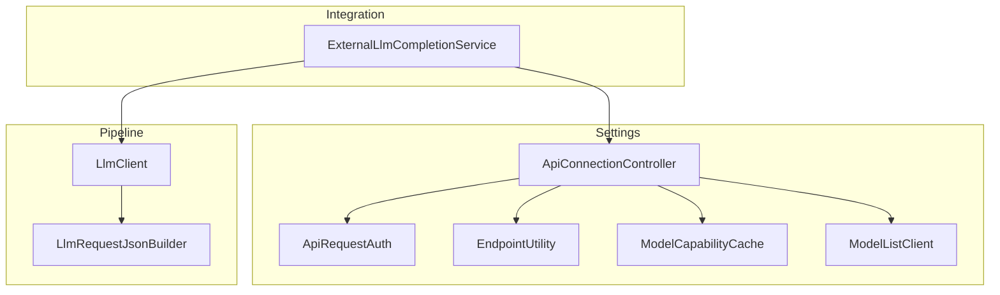
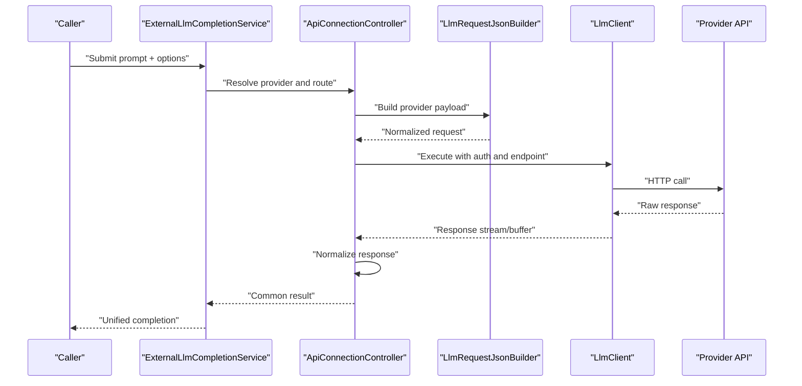
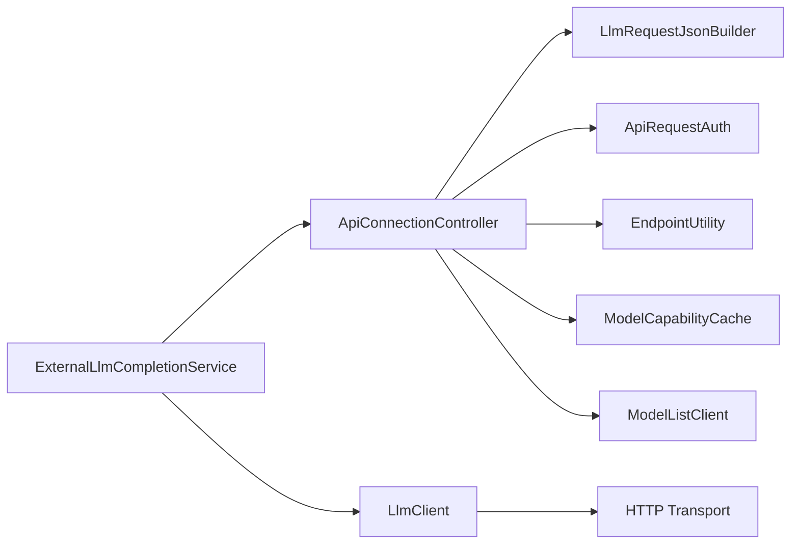
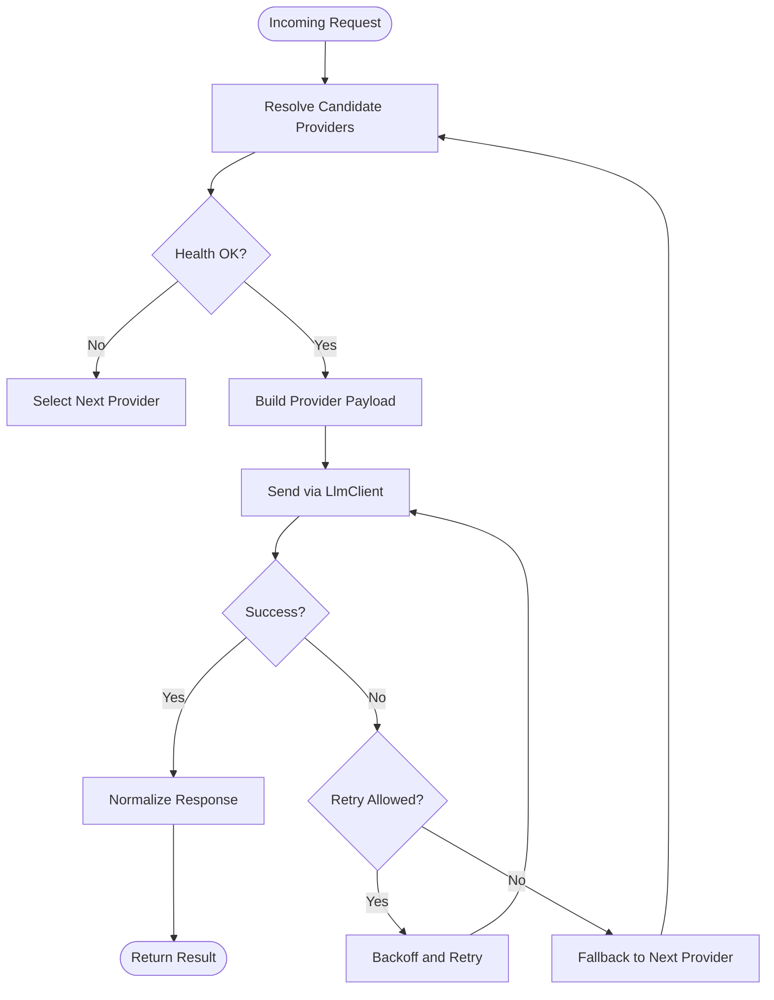

# Provider Abstraction Layer

<cite>
**Referenced Files in This Document**
- [ApiConnectionController.cs](../../../../../Source/Settings/ApiConnectionController.cs)
- [LlmClient.cs](../../../../../Source/Generation/LlmClient.cs)
- [LlmRequestJsonBuilder.cs](../../../../../Source/Pipeline/LlmRequestJsonBuilder.cs)
- [ExternalLlmCompletionService.cs](../../../../../Source/Integration/ExternalLlmCompletionService.cs)
- [ApiRequestAuth.cs](../../../../../Source/Settings/ApiRequestAuth.cs)
- [EndpointUtility.cs](../../../../../Source/Settings/EndpointUtility.cs)
- [ModelCapabilityCache.cs](../../../../../Source/Settings/ModelCapabilityCache.cs)
- [ModelListClient.cs](../../../../../Source/Settings/ModelListClient.cs)
</cite>

## Table of Contents
1. [Introduction](#introduction)
2. [Project Structure](#project-structure)
3. [Core Components](#core-components)
4. [Architecture Overview](#architecture-overview)
5. [Detailed Component Analysis](#detailed-component-analysis)
6. [Dependency Analysis](#dependency-analysis)
7. [Performance Considerations](#performance-considerations)
8. [Troubleshooting Guide](#troubleshooting-guide)
9. [Conclusion](#conclusion)
10. [Appendices](#appendices)

## Introduction
This document explains the provider abstraction layer that enables support for multiple LLM services (for example, OpenAI, Anthropic, and local models). It focuses on how providers are registered and configured through the ApiConnectionController, the interface contracts between components, authentication methods, response normalization, and strategies for selection, fallback, and load balancing. It also provides step-by-step guidance for adding new providers, implementing custom authentication schemes, and handling provider-specific features.

## Project Structure
The provider abstraction spans several modules:
- Settings and configuration: connection management, endpoints, and authentication
- Generation pipeline: request building and client orchestration
- Integration surface: external completion service used by higher layers
- Utilities: model capability discovery and endpoint helpers

**Diagram sources**
- [ApiConnectionController.cs](../../../../../Source/Settings/ApiConnectionController.cs)
- [ApiRequestAuth.cs](../../../../../Source/Settings/ApiRequestAuth.cs)
- [EndpointUtility.cs](../../../../../Source/Settings/EndpointUtility.cs)
- [ModelCapabilityCache.cs](../../../../../Source/Settings/ModelCapabilityCache.cs)
- [ModelListClient.cs](../../../../../Source/Settings/ModelListClient.cs)
- [LlmRequestJsonBuilder.cs](../../../../../Source/Pipeline/LlmRequestJsonBuilder.cs)
- [LlmClient.cs](../../../../../Source/Generation/LlmClient.cs)
- [ExternalLlmCompletionService.cs](../../../../../Source/Integration/ExternalLlmCompletionService.cs)

**Section sources**
- [ApiConnectionController.cs](../../../../../Source/Settings/ApiConnectionController.cs)
- [LlmClient.cs](../../../../../Source/Generation/LlmClient.cs)
- [LlmRequestJsonBuilder.cs](../../../../../Source/Pipeline/LlmRequestJsonBuilder.cs)
- [ExternalLlmCompletionService.cs](../../../../../Source/Integration/ExternalLlmCompletionService.cs)
- [ApiRequestAuth.cs](../../../../../Source/Settings/ApiRequestAuth.cs)
- [EndpointUtility.cs](../../../../../Source/Settings/EndpointUtility.cs)
- [ModelCapabilityCache.cs](../../../../../Source/Settings/ModelCapabilityCache.cs)
- [ModelListClient.cs](../../../../../Source/Settings/ModelListClient.cs)

## Core Components
- ApiConnectionController: Central registry and selector for LLM providers; resolves active provider, builds requests, and coordinates retries/fallbacks.
- LlmClient: Low-level HTTP transport and streaming control for a single provider instance.
- LlmRequestJsonBuilder: Normalizes domain prompts into provider-specific JSON payloads.
- ExternalLlmCompletionService: Integration facade exposing a stable API to callers while delegating to the provider layer.
- ApiRequestAuth: Encapsulates per-provider authentication details and token refresh logic.
- EndpointUtility: Resolves base URLs and path templates per provider.
- ModelCapabilityCache: Caches discovered capabilities (e.g., supported parameters) to avoid repeated probing.
- ModelListClient: Enumerates available models from a provider or catalog.

Key responsibilities:
- Registration: Providers are added via controller APIs that bind identifiers, endpoints, auth, and capabilities.
- Selection: The controller chooses a provider based on policy (model affinity, health, cost, etc.).
- Request normalization: Prompts and options are transformed into provider-specific payloads.
- Response normalization: Responses are mapped to a common shape with tokens, content, and metadata.
- Fallback and load balancing: On failure or throttling, the controller can retry with alternate providers or instances.

**Section sources**
- [ApiConnectionController.cs](../../../../../Source/Settings/ApiConnectionController.cs)
- [LlmClient.cs](../../../../../Source/Generation/LlmClient.cs)
- [LlmRequestJsonBuilder.cs](../../../../../Source/Pipeline/LlmRequestJsonBuilder.cs)
- [ExternalLlmCompletionService.cs](../../../../../Source/Integration/ExternalLlmCompletionService.cs)
- [ApiRequestAuth.cs](../../../../../Source/Settings/ApiRequestAuth.cs)
- [EndpointUtility.cs](../../../../../Source/Settings/EndpointUtility.cs)
- [ModelCapabilityCache.cs](../../../../../Source/Settings/ModelCapabilityCache.cs)
- [ModelListClient.cs](../../../../../Source/Settings/ModelListClient.cs)

## Architecture Overview
The provider abstraction isolates caller code from provider specifics. Callers use the integration facade, which delegates to the controller. The controller selects a provider, constructs a normalized request, executes it via the client, and normalizes the response.

**Diagram sources**
- [ExternalLlmCompletionService.cs](../../../../../Source/Integration/ExternalLlmCompletionService.cs)
- [ApiConnectionController.cs](../../../../../Source/Settings/ApiConnectionController.cs)
- [LlmRequestJsonBuilder.cs](../../../../../Source/Pipeline/LlmRequestJsonBuilder.cs)
- [LlmClient.cs](../../../../../Source/Generation/LlmClient.cs)

## Detailed Component Analysis

### ApiConnectionController
Responsibilities:
- Register providers with identity, endpoint template, auth scheme, and capability hints.
- Select an active provider per request using policies (model match, health, quotas).
- Compose requests via the builder and execute via the client.
- Implement fallback and retry across providers or instances.
- Cache model capabilities and list results.

Selection strategy:
- Prefer provider/model pairs matching requested model family or tags.
- Use health signals and recent error rates to deprioritize degraded providers.
- Apply cost or latency preferences when multiple viable providers exist.

Fallback and load balancing:
- On transient errors (timeouts, rate limits), retry with backoff and then switch to next provider.
- Support round-robin or weighted distribution for non-critical calls.

Configuration entry points:
- Add/update/remove providers
- Set default provider and model
- Configure per-provider auth and endpoint overrides
- Toggle feature flags for provider-specific behaviors

**Section sources**
- [ApiConnectionController.cs](../../../../../Source/Settings/ApiConnectionController.cs)

### LlmClient
Responsibilities:
- Manage HTTP lifecycle (connect, send, receive, close).
- Handle streaming responses and cancellation.
- Attach headers and credentials per provider.
- Normalize low-level network errors into typed exceptions.

Error handling:
- Distinguish network failures, timeouts, and provider errors.
- Surface retryable vs non-retryable conditions to the controller.

**Section sources**
- [LlmClient.cs](../../../../../Source/Generation/LlmClient.cs)

### LlmRequestJsonBuilder
Responsibilities:
- Translate domain prompts, system messages, and generation options into provider-specific JSON.
- Map common parameters (temperature, max tokens, stop sequences) to provider equivalents.
- Inject provider-specific fields when enabled by feature flags.

Normalization contract:
- Input: canonical prompt representation and options.
- Output: provider payload object ready for serialization.

**Section sources**
- [LlmRequestJsonBuilder.cs](../../../../../Source/Pipeline/LlmRequestJsonBuilder.cs)

### ExternalLlmCompletionService
Responsibilities:
- Expose a stable API for callers to generate text without knowing provider details.
- Route calls to the controller and return normalized results.
- Provide convenience methods for common tasks (single-turn, multi-turn, streaming).

**Section sources**
- [ExternalLlmCompletionService.cs](../../../../../Source/Integration/ExternalLlmCompletionService.cs)

### Authentication and Endpoints
- ApiRequestAuth: Holds secrets, tokens, and rotation state; supports bearer tokens, API keys, and custom header injection.
- EndpointUtility: Builds final URLs from provider base URLs and path templates; handles query parameters and versioning.

Custom auth schemes:
- Implement a new auth strategy by extending the auth abstraction and registering it with the controller.
- Ensure token refresh hooks are integrated so clients always have valid credentials.

**Section sources**
- [ApiRequestAuth.cs](../../../../../Source/Settings/ApiRequestAuth.cs)
- [EndpointUtility.cs](../../../../../Source/Settings/EndpointUtility.cs)

### Capability Discovery and Model Listing
- ModelCapabilityCache: Stores known capabilities (supported parameters, constraints) to reduce probing overhead.
- ModelListClient: Queries provider endpoints or catalogs to enumerate available models and their attributes.

Usage:
- Populate cache at startup or on demand.
- Use capabilities to guide request construction and validation.

**Section sources**
- [ModelCapabilityCache.cs](../../../../../Source/Settings/ModelCapabilityCache.cs)
- [ModelListClient.cs](../../../../../Source/Settings/ModelListClient.cs)

## Dependency Analysis
High-level dependencies:
- ExternalLlmCompletionService depends on ApiConnectionController and LlmClient.
- ApiConnectionController depends on LlmRequestJsonBuilder, ApiRequestAuth, EndpointUtility, ModelCapabilityCache, and ModelListClient.
- LlmClient is the only component directly interacting with provider HTTP endpoints.

**Diagram sources**
- [ExternalLlmCompletionService.cs](../../../../../Source/Integration/ExternalLlmCompletionService.cs)
- [ApiConnectionController.cs](../../../../../Source/Settings/ApiConnectionController.cs)
- [LlmClient.cs](../../../../../Source/Generation/LlmClient.cs)
- [LlmRequestJsonBuilder.cs](../../../../../Source/Pipeline/LlmRequestJsonBuilder.cs)
- [ApiRequestAuth.cs](../../../../../Source/Settings/ApiRequestAuth.cs)
- [EndpointUtility.cs](../../../../../Source/Settings/EndpointUtility.cs)
- [ModelCapabilityCache.cs](../../../../../Source/Settings/ModelCapabilityCache.cs)
- [ModelListClient.cs](../../../../../Source/Settings/ModelListClient.cs)

**Section sources**
- [ExternalLlmCompletionService.cs](../../../../../Source/Integration/ExternalLlmCompletionService.cs)
- [ApiConnectionController.cs](../../../../../Source/Settings/ApiConnectionController.cs)
- [LlmClient.cs](../../../../../Source/Generation/LlmClient.cs)
- [LlmRequestJsonBuilder.cs](../../../../../Source/Pipeline/LlmRequestJsonBuilder.cs)
- [ApiRequestAuth.cs](../../../../../Source/Settings/ApiRequestAuth.cs)
- [EndpointUtility.cs](../../../../../Source/Settings/EndpointUtility.cs)
- [ModelCapabilityCache.cs](../../../../../Source/Settings/ModelCapabilityCache.cs)
- [ModelListClient.cs](../../../../../Source/Settings/ModelListClient.cs)

## Performance Considerations
- Reuse connections where possible to reduce handshake overhead.
- Cache model capabilities and lists to avoid repeated discovery calls.
- Stream responses when available to minimize memory usage and time-to-first-token.
- Apply exponential backoff and jitter on retries to mitigate cascading failures.
- Prefer lightweight parameter sets for high-throughput scenarios.

[No sources needed since this section provides general guidance]

## Troubleshooting Guide
Common issues and resolutions:
- Authentication failures: Verify token validity, expiration handling, and header formats. Check ApiRequestAuth configuration and EndpointUtility URL assembly.
- Rate limiting: Inspect retry/backoff behavior and consider distributing load across multiple providers.
- Model not found: Confirm model listing and capability cache consistency; refresh caches if necessary.
- Streaming interruptions: Validate cancellation propagation and ensure proper resource cleanup in LlmClient.

Operational checks:
- Log provider selection decisions and reasons.
- Record error categories (network, auth, rate limit, schema mismatch) to aid diagnostics.
- Monitor per-provider latency and error rates to inform selection policies.

**Section sources**
- [ApiConnectionController.cs](../../../../../Source/Settings/ApiConnectionController.cs)
- [LlmClient.cs](../../../../../Source/Generation/LlmClient.cs)
- [ApiRequestAuth.cs](../../../../../Source/Settings/ApiRequestAuth.cs)
- [EndpointUtility.cs](../../../../../Source/Settings/EndpointUtility.cs)
- [ModelCapabilityCache.cs](../../../../../Source/Settings/ModelCapabilityCache.cs)
- [ModelListClient.cs](../../../../../Source/Settings/ModelListClient.cs)

## Conclusion
The provider abstraction layer cleanly separates caller concerns from provider specifics. Through ApiConnectionController, providers are registered, selected, and executed with consistent request/response contracts. Robust authentication, capability caching, and flexible selection/fallback strategies enable resilient multi-provider operation. Following the extension guides below allows safe addition of new providers and custom authentication schemes.

[No sources needed since this section summarizes without analyzing specific files]

## Appendices

### Step-by-Step: Add a New LLM Provider
1. Define provider identity and endpoint template using EndpointUtility conventions.
2. Implement or configure ApiRequestAuth for the provider’s authentication method.
3. Extend LlmRequestJsonBuilder to map canonical prompts/options to the provider’s payload format.
4. Register the provider with ApiConnectionController including model tags and capability hints.
5. Optionally integrate with ModelListClient to populate capabilities and model lists.
6. Test selection, fallback, and normalization paths via ExternalLlmCompletionService.

**Section sources**
- [ApiConnectionController.cs](../../../../../Source/Settings/ApiConnectionController.cs)
- [EndpointUtility.cs](../../../../../Source/Settings/EndpointUtility.cs)
- [ApiRequestAuth.cs](../../../../../Source/Settings/ApiRequestAuth.cs)
- [LlmRequestJsonBuilder.cs](../../../../../Source/Pipeline/LlmRequestJsonBuilder.cs)
- [ModelListClient.cs](../../../../../Source/Settings/ModelListClient.cs)
- [ExternalLlmCompletionService.cs](../../../../../Source/Integration/ExternalLlmCompletionService.cs)

### Custom Authentication Scheme
- Create a new auth implementation adhering to the auth abstraction.
- Integrate token refresh hooks to keep credentials current.
- Wire the auth into provider registration so the controller can attach headers automatically.

**Section sources**
- [ApiRequestAuth.cs](../../../../../Source/Settings/ApiRequestAuth.cs)
- [ApiConnectionController.cs](../../../../../Source/Settings/ApiConnectionController.cs)

### Handling Provider-Specific Features
- Use capability hints to gate optional parameters (e.g., tool calling, structured outputs).
- Enable feature flags in provider registration to toggle advanced behaviors.
- Validate payloads against cached capabilities before sending.

**Section sources**
- [ModelCapabilityCache.cs](../../../../../Source/Settings/ModelCapabilityCache.cs)
- [LlmRequestJsonBuilder.cs](../../../../../Source/Pipeline/LlmRequestJsonBuilder.cs)
- [ApiConnectionController.cs](../../../../../Source/Settings/ApiConnectionController.cs)

### Provider Selection, Fallback, and Load Balancing Strategies
- Selection: prefer exact model matches, then closest family, then lowest error rate.
- Fallback: retry with backoff, then switch to next provider; mark unhealthy providers temporarily.
- Load balancing: distribute non-critical requests across providers using weights or round-robin.

**Diagram sources**
- [ApiConnectionController.cs](../../../../../Source/Settings/ApiConnectionController.cs)
- [LlmClient.cs](../../../../../Source/Generation/LlmClient.cs)
