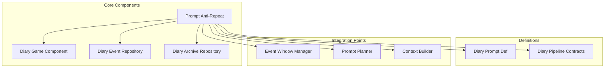
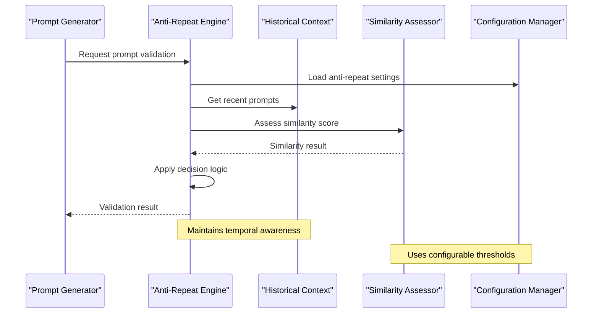
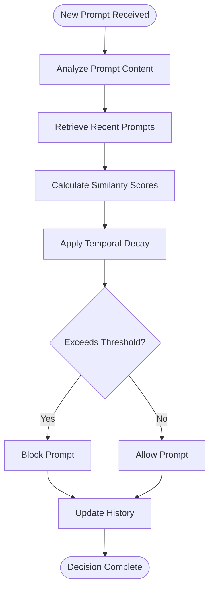
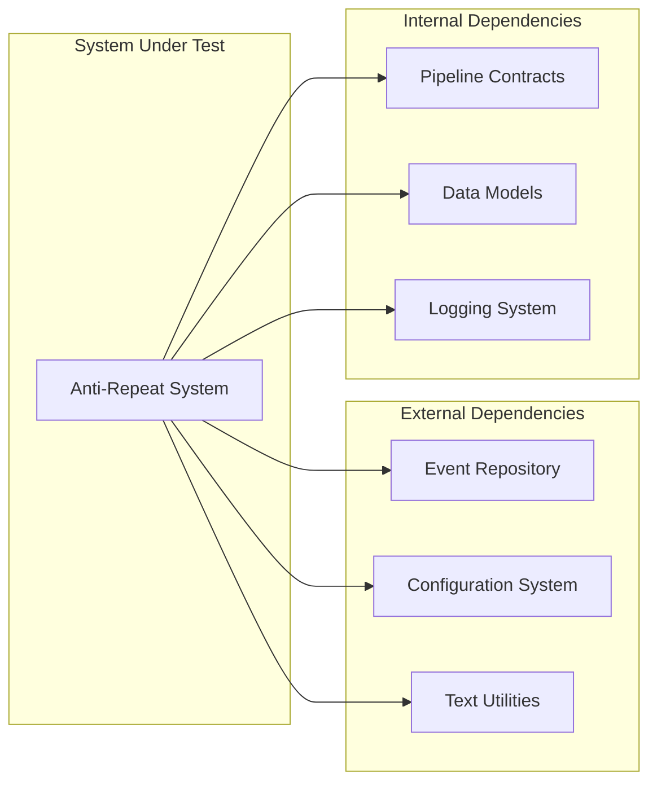

# Prompt Anti-Repetition System

## Table of Contents
1. [Introduction](#introduction)
2. [Project Structure](#project-structure)
3. [Core Components](#core-components)
4. [Architecture Overview](#architecture-overview)
5. [Detailed Component Analysis](#detailed-component-analysis)
6. [Dependency Analysis](#dependency-analysis)
7. [Performance Considerations](#performance-considerations)
8. [Troubleshooting Guide](#troubleshooting-guide)
9. [Conclusion](#conclusion)

## Introduction

The Prompt Anti-Repetition System is a sophisticated mechanism within the Pawn Diary mod that prevents duplicate or overly similar prompts from being generated repeatedly. This system ensures narrative diversity and maintains player engagement by intelligently tracking previously generated content and avoiding repetition across different time scales and contexts.

The system operates as part of the broader diary generation pipeline, working alongside other components like prompt planning, context building, and response processing to deliver unique and engaging narrative experiences for each pawn's diary entries.

## Project Structure

The Prompt Anti-Repetition System is primarily implemented within the Core module, specifically in the `DiaryGameComponent.PromptAntiRepeat.cs` file. The system integrates with various other components including:

- **Core Game Components**: Main game loop integration and lifecycle management
- **Definition System**: Prompt definitions and configuration
- **Pipeline Processing**: Integration with the broader diary generation pipeline
- **Repository Layer**: Storage and retrieval of historical prompt data
- **Event Management**: Tracking of events and their associated prompts

**Diagram sources**
- [DiaryGameComponent.PromptAntiRepeat.cs](../../../../Source/Core/DiaryGameComponent.PromptAntiRepeat.cs)
- [DiaryGameComponent.cs](../../../../Source/Core/DiaryGameComponent.cs)
- [DiaryEventRepository.cs](../../../../Source/Core/DiaryEventRepository.cs)

**Section sources**
- [DiaryGameComponent.PromptAntiRepeat.cs](../../../../Source/Core/DiaryGameComponent.PromptAntiRepeat.cs)
- [DiaryGameComponent.cs](../../../../Source/Core/DiaryGameComponent.cs)

## Core Components

The Prompt Anti-Repetition System consists of several key components that work together to prevent duplicate content generation:

### Primary Anti-Repeat Engine
The main engine responsible for analyzing previous prompts and determining if new prompts would be too similar to existing ones. This component implements sophisticated similarity detection algorithms and maintains state about recently used prompts.

### Historical Context Tracker
Maintains a rolling window of recent prompts and their metadata, allowing the system to make decisions based on temporal proximity and contextual relevance.

### Similarity Assessment Module
Evaluates potential new prompts against existing ones using multiple criteria including semantic similarity, structural patterns, and contextual overlap.

### Configuration Manager
Handles tuning parameters for anti-repetition behavior, including thresholds, time windows, and domain-specific rules.

**Section sources**
- [DiaryGameComponent.PromptAntiRepeat.cs](../../../../Source/Core/DiaryGameComponent.PromptAntiRepeat.cs)
- [DiaryPipelineContracts.cs](../../../../Source/Pipeline/DiaryPipelineContracts.cs)

## Architecture Overview

The Prompt Anti-Repetition System follows a layered architecture pattern with clear separation of concerns:

**Diagram sources**
- [DiaryGameComponent.PromptAntiRepeat.cs](../../../../Source/Core/DiaryGameComponent.PromptAntiRepeat.cs)
- [DiaryPipelineContracts.cs](../../../../Source/Pipeline/DiaryPipelineContracts.cs)

The system integrates with the broader diary generation pipeline through well-defined contracts and interfaces, ensuring loose coupling and maintainability.

## Detailed Component Analysis

### Anti-Repeat Decision Engine

The core decision engine implements a multi-criteria evaluation system that considers various factors when determining whether a prompt should be blocked due to repetition:

#### Temporal Decay Function
The system applies temporal decay to older prompts, making them less relevant for comparison as they age. This allows for natural evolution of topics while preventing immediate repetition.

#### Semantic Similarity Scoring
Uses advanced text analysis techniques to determine semantic similarity between prompts, going beyond simple string matching to understand meaning and context.

#### Domain-Specific Rules
Implements specialized rules for different types of prompts (e.g., emotional reactions vs. factual observations) to ensure appropriate anti-repetition behavior across diverse content types.

**Diagram sources**
- [DiaryGameComponent.PromptAntiRepeat.cs](../../../../Source/Core/DiaryGameComponent.PromptAntiRepeat.cs)

### Historical Context Management

The historical context system maintains a sophisticated memory of past prompts with rich metadata:

#### Rolling Window Implementation
Uses a sliding window approach to maintain only the most relevant historical data, optimizing both performance and accuracy.

#### Metadata Enrichment
Each stored prompt includes extensive metadata such as timestamp, category, emotional valence, and contextual tags for more nuanced similarity assessment.

#### Memory Compaction
Implements intelligent compaction strategies to reduce storage requirements while preserving essential information for accurate similarity calculations.

**Section sources**
- [DiaryGameComponent.PromptAntiRepeat.cs](../../../../Source/Core/DiaryGameComponent.PromptAntiRepeat.cs)
- [DiaryEventRepository.cs](../../../../Source/Core/DiaryEventRepository.cs)

### Configuration and Tuning

The system provides extensive configuration options for fine-tuning anti-repetition behavior:

#### Global Settings
- Maximum similarity threshold
- Time window duration
- Minimum gap between similar prompts
- Category-specific overrides

#### Dynamic Adjustment
Supports runtime adjustment of parameters based on gameplay conditions and user preferences.

#### Performance Controls
Includes settings to balance accuracy against computational cost, allowing optimization for different hardware configurations.

**Section sources**
- [DiaryGameComponent.PromptAntiRepeat.cs](../../../../Source/Core/DiaryGameComponent.PromptAntiRepeat.cs)

## Dependency Analysis

The Prompt Anti-Repetition System has carefully managed dependencies to ensure stability and maintainability:

**Diagram sources**
- [DiaryGameComponent.PromptAntiRepeat.cs](../../../../Source/Core/DiaryGameComponent.PromptAntiRepeat.cs)
- [DiaryPipelineContracts.cs](../../../../Source/Pipeline/DiaryPipelineContracts.cs)

### Coupling Analysis
- **Low Coupling**: Minimal direct dependencies on specific implementation details
- **High Cohesion**: Related functionality grouped logically within components
- **Interface-Based Design**: Clear contracts define interaction points

### Potential Issues
- **Circular Dependencies**: Carefully avoided through interface abstraction
- **Memory Leaks**: Mitigated through proper resource management and cleanup
- **Performance Bottlenecks**: Addressed through caching and optimization strategies

**Section sources**
- [DiaryGameComponent.PromptAntiRepeat.cs](../../../../Source/Core/DiaryGameComponent.PromptAntiRepeat.cs)
- [DiaryPipelineContracts.cs](../../../../Source/Pipeline/DiaryPipelineContracts.cs)

## Performance Considerations

The Prompt Anti-Repetition System is designed with performance as a primary concern:

### Optimization Strategies
- **Caching**: Frequently accessed similarity scores are cached to avoid redundant calculations
- **Batch Processing**: Multiple prompts can be evaluated in batches for improved efficiency
- **Lazy Loading**: Historical data is loaded on-demand rather than pre-loaded entirely
- **Asynchronous Operations**: Non-blocking operations where possible to maintain game responsiveness

### Memory Management
- **Object Pooling**: Reuses objects to reduce garbage collection pressure
- **Streaming Processing**: Large datasets are processed in chunks to minimize memory footprint
- **Automatic Cleanup**: Old data is automatically pruned based on configurable policies

### Scalability Features
- **Configurable Complexity**: Users can adjust algorithm complexity based on their needs
- **Progressive Enhancement**: Basic functionality works without heavy computation
- **Resource Monitoring**: Built-in monitoring helps identify performance issues

## Troubleshooting Guide

### Common Issues and Solutions

#### High CPU Usage
- **Symptom**: Game becomes unresponsive during diary generation
- **Solution**: Reduce similarity calculation complexity or increase time gaps between evaluations
- **Diagnostic**: Check performance logs for similarity calculation bottlenecks

#### Excessive Blocking
- **Symptom**: Too many prompts are being blocked as duplicates
- **Solution**: Adjust similarity thresholds or expand time windows
- **Diagnostic**: Review blocked prompt logs to identify patterns

#### Memory Growth
- **Symptom**: Increasing memory usage over time
- **Solution**: Verify cleanup policies are functioning correctly
- **Diagnostic**: Monitor historical data size and cleanup frequency

### Debugging Tools
- **Verbose Logging**: Enable detailed logging for anti-repetition decisions
- **Performance Profiling**: Built-in profiling hooks for identifying bottlenecks
- **State Inspection**: Tools to examine current anti-repetition state and history

### Configuration Recommendations
- **Default Settings**: Work well for most use cases
- **Performance Mode**: Reduces accuracy for better performance
- **Accuracy Mode**: Maximizes quality at potential performance cost
- **Custom Profiles**: Create tailored configurations for specific scenarios

**Section sources**
- [DiaryGameComponent.PromptAntiRepeat.cs](../../../../Source/Core/DiaryGameComponent.PromptAntiRepeat.cs)

## Conclusion

The Prompt Anti-Repetition System represents a sophisticated solution to maintaining narrative diversity in procedural content generation. Through careful architectural design, performance optimization, and comprehensive configuration options, it successfully balances the competing demands of uniqueness, relevance, and computational efficiency.

The system's modular design ensures maintainability and extensibility, while its robust error handling and debugging capabilities support long-term reliability. As the underlying technology evolves, the system's flexible architecture positions it well for future enhancements and adaptations.

Key strengths include:
- **Intelligent Similarity Detection**: Goes beyond simple pattern matching
- **Performance Optimization**: Efficient algorithms and resource management
- **Configurable Behavior**: Adaptable to different use cases and requirements
- **Robust Architecture**: Clean separation of concerns and dependency management

The Prompt Anti-Repetition System serves as a foundation for creating more engaging and varied narrative experiences in the Pawn Diary mod, contributing significantly to overall player satisfaction and immersion.
