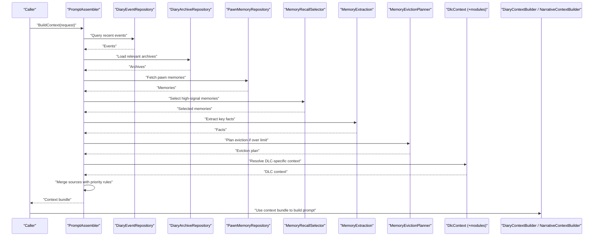
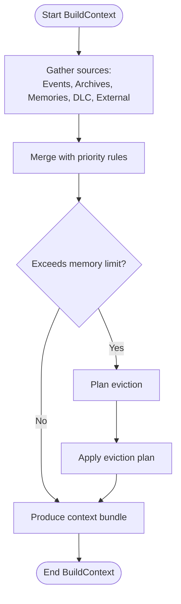
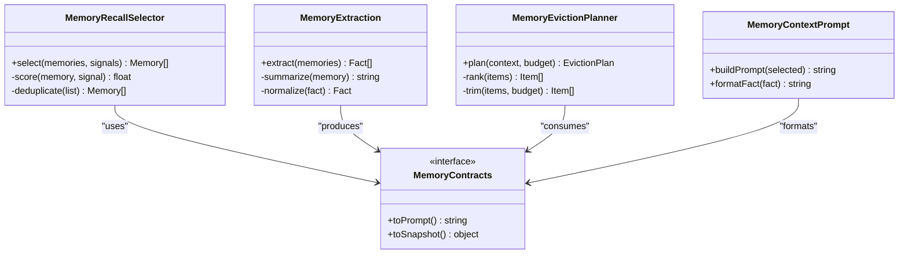
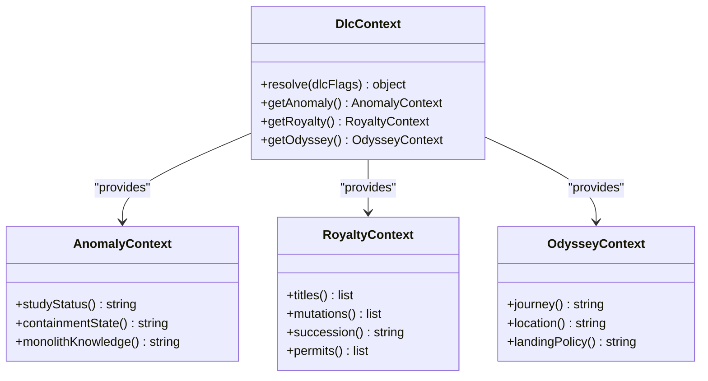
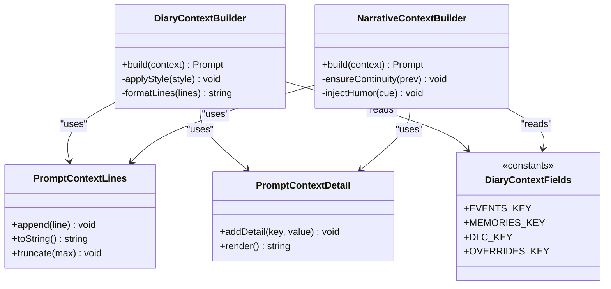
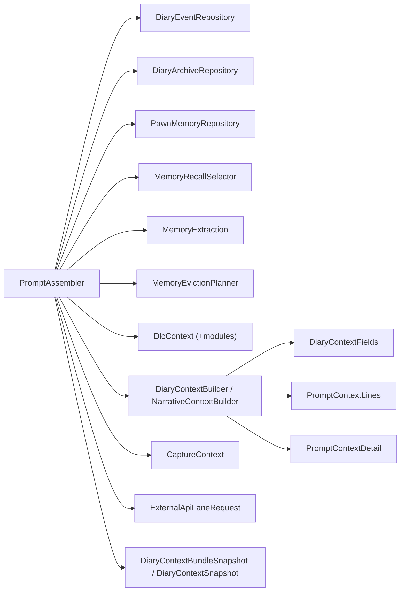

# Context Assembly Engine

<cite>
**Referenced Files in This Document**
- [PromptAssembler.cs](../../../../../Source/Generation/PromptAssembler.cs)
- [DiaryContextBuilder.cs](../../../../../Source/Generation/DiaryContextBuilder.cs)
- [NarrativeContextBuilder.cs](../../../../../Source/Generation/NarrativeContextBuilder.cs)
- [DiaryContextFields.cs](../../../../../Source/Generation/DiaryContextFields.cs)
- [PawnMemoryRepository.cs](../../../../../Source/Core/PawnMemoryRepository.cs)
- [DlcContext.cs](../../../../../Source/Generation/DlcContext.cs)
- [DlcContext.Anomaly.cs](../../../../../Source/Generation/DlcContext.Anomaly.cs)
- [DlcContext.Royalty.cs](../../../../../Source/Generation/DlcContext.Royalty.cs)
- [DlcContext.Odyssey.cs](../../../../../Source/Generation/DlcContext.Odyssey.cs)
- [CaptureContext.cs](../../../../../Source/Capture/CaptureContext.cs)
- [DiaryEventRepository.cs](../../../../../Source/Core/DiaryEventRepository.cs)
- [DiaryArchiveRepository.cs](../../../../../Source/Core/DiaryArchiveRepository.cs)
- [MemoryRecallSelector.cs](../../../../../Source/Pipeline/Memory/MemoryRecallSelector.cs)
- [MemoryExtraction.cs](../../../../../Source/Pipeline/Memory/MemoryExtraction.cs)
- [MemoryEvictionPlanner.cs](../../../../../Source/Pipeline/Memory/MemoryEvictionPlanner.cs)
- [MemoryContracts.cs](../../../../../Source/Pipeline/Memory/MemoryContracts.cs)
- [MemoryContextPrompt.cs](../../../../../Source/Pipeline/Memory/MemoryContextPrompt.cs)
- [PromptContextLines.cs](../../../../../Source/Pipeline/PromptContextLines.cs)
- [PromptContextDetail.cs](../../../../../Source/Pipeline/PromptContextDetail.cs)
- [DiaryPipelineContracts.cs](../../../../../Source/Pipeline/DiaryPipelineContracts.cs)
- [DiaryPromptCapture.cs](../../../../../Source/Pipeline/DiaryPromptCapture.cs)
- [DiaryPromptPlanner.cs](../../../../../Source/Pipeline/DiaryPromptPlanner.cs)
- [ExternalApiLaneRequest.cs](../../../../../Source/Integration/ExternalApiLaneRequest.cs)
- [DiaryContextBundleSnapshot.cs](../../../../../Source/Integration/DiaryContextBundleSnapshot.cs)
- [DiaryContextSnapshot.cs](../../../../../Source/Integration/DiaryContextSnapshot.cs)
</cite>

## Table of Contents
1. [Introduction](#introduction)
2. [Project Structure](#project-structure)
3. [Core Components](#core-components)
4. [Architecture Overview](#architecture-overview)
5. [Detailed Component Analysis](#detailed-component-analysis)
6. [Dependency Analysis](#dependency-analysis)
7. [Performance Considerations](#performance-considerations)
8. [Troubleshooting Guide](#troubleshooting-guide)
9. [Conclusion](#conclusion)
10. [Appendices](#appendices)

## Introduction
This document explains the context assembly engine that powers prompt generation for pawns. It focuses on how PromptAssembler combines multiple context sources—game state, event data, pawn memories, and DLC-specific information—into a cohesive context bundle used by downstream builders and LLM clients. The document covers the context building pipeline, priority resolution across providers, memory management strategies (recall, eviction, limits), caching mechanisms, and guidance for extending the system with new providers and custom builders.

## Project Structure
The context assembly engine spans several areas:
- Generation: orchestrates context assembly and prompt construction
- Pipeline: contracts, planning, and text formatting utilities
- Core: repositories for events and archives, and memory repository
- Capture: event capture and context snapshots
- Integration: external API requests and snapshot types

```mermaid
graph TB
subgraph "Generation"
PA["PromptAssembler"]
DCB["DiaryContextBuilder"]
NCB["NarrativeContextBuilder"]
DCF["DiaryContextFields"]
DLC["DlcContext + DLC modules"]
end
subgraph "Pipeline"
PCL["PromptContextLines"]
PCD["PromptContextDetail"]
DPR["DiaryPromptCapture"]
DPP["DiaryPromptPlanner"]
MRS["MemoryRecallSelector"]
ME["MemoryExtraction"]
MEP["MemoryEvictionPlanner"]
MC["MemoryContracts"]
MCP["MemoryContextPrompt"]
end
subgraph "Core"
PER["DiaryEventRepository"]
DAR["DiaryArchiveRepository"]
PMR["PawnMemoryRepository"]
end
subgraph "Capture"
CC["CaptureContext"]
end
subgraph "Integration"
EALR["ExternalApiLaneRequest"]
DCBS["DiaryContextBundleSnapshot"]
DCS["DiaryContextSnapshot"]
end
PA --> DCB
PA --> NCB
PA --> DLC
PA --> PCL
PA --> PCD
PA --> DPR
PA --> DPP
PA --> MRS
PA --> ME
PA --> MEP
PA --> MC
PA --> MCP
PA --> PER
PA --> DAR
PA --> PMR
PA --> CC
PA --> EALR
PA --> DCBS
PA --> DCS
```

**Diagram sources**
- [PromptAssembler.cs](../../../../../Source/Generation/PromptAssembler.cs)
- [DiaryContextBuilder.cs](../../../../../Source/Generation/DiaryContextBuilder.cs)
- [NarrativeContextBuilder.cs](../../../../../Source/Generation/NarrativeContextBuilder.cs)
- [DlcContext.cs](../../../../../Source/Generation/DlcContext.cs)
- [DlcContext.Anomaly.cs](../../../../../Source/Generation/DlcContext.Anomaly.cs)
- [DlcContext.Royalty.cs](../../../../../Source/Generation/DlcContext.Royalty.cs)
- [DlcContext.Odyssey.cs](../../../../../Source/Generation/DlcContext.Odyssey.cs)
- [DiaryContextFields.cs](../../../../../Source/Generation/DiaryContextFields.cs)
- [PromptContextLines.cs](../../../../../Source/Pipeline/PromptContextLines.cs)
- [PromptContextDetail.cs](../../../../../Source/Pipeline/PromptContextDetail.cs)
- [DiaryPromptCapture.cs](../../../../../Source/Pipeline/DiaryPromptCapture.cs)
- [DiaryPromptPlanner.cs](../../../../../Source/Pipeline/DiaryPromptPlanner.cs)
- [MemoryRecallSelector.cs](../../../../../Source/Pipeline/Memory/MemoryRecallSelector.cs)
- [MemoryExtraction.cs](../../../../../Source/Pipeline/Memory/MemoryExtraction.cs)
- MemoryEvictionPlanner.cs
- [MemoryContracts.cs](../../../../../Source/Pipeline/Memory/MemoryContracts.cs)
- [MemoryContextPrompt.cs](../../../../../Source/Pipeline/Memory/MemoryContextPrompt.cs)
- [DiaryEventRepository.cs](../../../../../Source/Core/DiaryEventRepository.cs)
- [DiaryArchiveRepository.cs](../../../../../Source/Core/DiaryArchiveRepository.cs)
- [PawnMemoryRepository.cs](../../../../../Source/Core/PawnMemoryRepository.cs)
- [CaptureContext.cs](../../../../../Source/Capture/CaptureContext.cs)
- [ExternalApiLaneRequest.cs](../../../../../Source/Integration/ExternalApiLaneRequest.cs)
- [DiaryContextBundleSnapshot.cs](../../../../../Source/Integration/DiaryContextBundleSnapshot.cs)
- [DiaryContextSnapshot.cs](../../../../../Source/Integration/DiaryContextSnapshot.cs)

**Section sources**
- [PromptAssembler.cs](../../../../../Source/Generation/PromptAssembler.cs)
- [DiaryContextBuilder.cs](../../../../../Source/Generation/DiaryContextBuilder.cs)
- [NarrativeContextBuilder.cs](../../../../../Source/Generation/NarrativeContextBuilder.cs)
- [DlcContext.cs](../../../../../Source/Generation/DlcContext.cs)
- [DlcContext.Anomaly.cs](../../../../../Source/Generation/DlcContext.Anomaly.cs)
- [DlcContext.Royalty.cs](../../../../../Source/Generation/DlcContext.Royalty.cs)
- [DlcContext.Odyssey.cs](../../../../../Source/Generation/DlcContext.Odyssey.cs)
- [DiaryContextFields.cs](../../../../../Source/Generation/DiaryContextFields.cs)
- [PromptContextLines.cs](../../../../../Source/Pipeline/PromptContextLines.cs)
- [PromptContextDetail.cs](../../../../../Source/Pipeline/PromptContextDetail.cs)
- [DiaryPromptCapture.cs](../../../../../Source/Pipeline/DiaryPromptCapture.cs)
- [DiaryPromptPlanner.cs](../../../../../Source/Pipeline/DiaryPromptPlanner.cs)
- [MemoryRecallSelector.cs](../../../../../Source/Pipeline/Memory/MemoryRecallSelector.cs)
- [MemoryExtraction.cs](../../../../../Source/Pipeline/Memory/MemoryExtraction.cs)
- [MemoryEvictionPlanner.cs](../../../../../Source/Pipeline/Memory/MemoryEvictionPlanner.cs)
- [MemoryContracts.cs](../../../../../Source/Pipeline/Memory/MemoryContracts.cs)
- [MemoryContextPrompt.cs](../../../../../Source/Pipeline/Memory/MemoryContextPrompt.cs)
- [DiaryEventRepository.cs](../../../../../Source/Core/DiaryEventRepository.cs)
- [DiaryArchiveRepository.cs](../../../../../Source/Core/DiaryArchiveRepository.cs)
- [PawnMemoryRepository.cs](../../../../../Source/Core/PawnMemoryRepository.cs)
- [CaptureContext.cs](../../../../../Source/Capture/CaptureContext.cs)
- [ExternalApiLaneRequest.cs](../../../../../Source/Integration/ExternalApiLaneRequest.cs)
- [DiaryContextBundleSnapshot.cs](../../../../../Source/Integration/DiaryContextBundleSnapshot.cs)
- [DiaryContextSnapshot.cs](../../../../../Source/Integration/DiaryContextSnapshot.cs)

## Core Components
- PromptAssembler: central coordinator that gathers context from multiple sources, applies priority rules, and produces a structured context bundle for downstream builders.
- DiaryContextBuilder and NarrativeContextBuilder: consume the assembled context to build prompts tailored to diary entries or narrative flows.
- DlcContext and DLC modules: provide domain-specific context for Anomaly, Royalty, and Odyssey expansions.
- Memory subsystem: includes recall selection, extraction, and eviction planning to manage large contexts efficiently.
- Repositories: event and archive repositories supply historical and current game state; PawnMemoryRepository provides per-pawn memory.
- Capture and integration layers: define context snapshots and external request structures used during assembly.

Key responsibilities:
- Source discovery and ordering
- Priority resolution among overlapping fields
- Caching and reuse of expensive computations
- Memory-aware retrieval and truncation
- Snapshotting for diagnostics and external APIs

**Section sources**
- [PromptAssembler.cs](../../../../../Source/Generation/PromptAssembler.cs)
- [DiaryContextBuilder.cs](../../../../../Source/Generation/DiaryContextBuilder.cs)
- [NarrativeContextBuilder.cs](../../../../../Source/Generation/NarrativeContextBuilder.cs)
- [DlcContext.cs](../../../../../Source/Generation/DlcContext.cs)
- [DlcContext.Anomaly.cs](../../../../../Source/Generation/DlcContext.Anomaly.cs)
- [DlcContext.Royalty.cs](../../../../../Source/Generation/DlcContext.Royalty.cs)
- [DlcContext.Odyssey.cs](../../../../../Source/Generation/DlcContext.Odyssey.cs)
- [MemoryRecallSelector.cs](../../../../../Source/Pipeline/Memory/MemoryRecallSelector.cs)
- [MemoryExtraction.cs](../../../../../Source/Pipeline/Memory/MemoryExtraction.cs)
- [MemoryEvictionPlanner.cs](../../../../../Source/Pipeline/Memory/MemoryEvictionPlanner.cs)
- [DiaryEventRepository.cs](../../../../../Source/Core/DiaryEventRepository.cs)
- [DiaryArchiveRepository.cs](../../../../../Source/Core/DiaryArchiveRepository.cs)
- [PawnMemoryRepository.cs](../../../../../Source/Core/PawnMemoryRepository.cs)
- [CaptureContext.cs](../../../../../Source/Capture/CaptureContext.cs)
- [ExternalApiLaneRequest.cs](../../../../../Source/Integration/ExternalApiLaneRequest.cs)
- [DiaryContextBundleSnapshot.cs](../../../../../Source/Integration/DiaryContextBundleSnapshot.cs)
- [DiaryContextSnapshot.cs](../../../../../Source/Integration/DiaryContextSnapshot.cs)

## Architecture Overview
The context assembly pipeline is orchestrated by PromptAssembler, which composes context from:
- Game state via repositories (events, archives)
- Per-pawn memory via PawnMemoryRepository
- DLC-specific context via DlcContext modules
- External lane inputs via integration requests
- Captured context snapshots for consistency

**Diagram sources**
- [PromptAssembler.cs](../../../../../Source/Generation/PromptAssembler.cs)
- [DiaryEventRepository.cs](../../../../../Source/Core/DiaryEventRepository.cs)
- [DiaryArchiveRepository.cs](../../../../../Source/Core/DiaryArchiveRepository.cs)
- [PawnMemoryRepository.cs](../../../../../Source/Core/PawnMemoryRepository.cs)
- [MemoryRecallSelector.cs](../../../../../Source/Pipeline/Memory/MemoryRecallSelector.cs)
- [MemoryExtraction.cs](../../../../../Source/Pipeline/Memory/MemoryExtraction.cs)
- [MemoryEvictionPlanner.cs](../../../../../Source/Pipeline/Memory/MemoryEvictionPlanner.cs)
- [DlcContext.cs](../../../../../Source/Generation/DlcContext.cs)
- [DlcContext.Anomaly.cs](../../../../../Source/Generation/DlcContext.Anomaly.cs)
- [DlcContext.Royalty.cs](../../../../../Source/Generation/DlcContext.Royalty.cs)
- [DlcContext.Odyssey.cs](../../../../../Source/Generation/DlcContext.Odyssey.cs)
- [DiaryContextBuilder.cs](../../../../../Source/Generation/DiaryContextBuilder.cs)
- [NarrativeContextBuilder.cs](../../../../../Source/Generation/NarrativeContextBuilder.cs)

## Detailed Component Analysis

### PromptAssembler
Responsibilities:
- Coordinates all context sources
- Applies priority resolution when multiple sources provide overlapping fields
- Enforces memory limits and triggers eviction planning
- Produces a unified context bundle consumed by builders

Priority resolution strategy:
- Explicit overrides take highest precedence (e.g., explicit field values)
- DLC-specific context follows next, scoped to active DLCs
- Event-driven context (recent events) precedes archival context
- Memory-derived facts are included after higher-priority sources
- Base defaults fill remaining gaps

Caching:
- Reuses computed snippets and summaries where possible
- Avoids redundant repository queries within a single assembly pass
- Integrates with external lane caches to prevent repeated network calls

Memory management:
- Uses MemoryRecallSelector to pick most relevant memories
- Applies MemoryExtraction to distill concise facts
- Invokes MemoryEvictionPlanner to trim or drop lower-value items when exceeding size thresholds

**Diagram sources**
- [PromptAssembler.cs](../../../../../Source/Generation/PromptAssembler.cs)
- [MemoryRecallSelector.cs](../../../../../Source/Pipeline/Memory/MemoryRecallSelector.cs)
- [MemoryExtraction.cs](../../../../../Source/Pipeline/Memory/MemoryExtraction.cs)
- [MemoryEvictionPlanner.cs](../../../../../Source/Pipeline/Memory/MemoryEvictionPlanner.cs)

**Section sources**
- [PromptAssembler.cs](../../../../../Source/Generation/PromptAssembler.cs)
- [MemoryRecallSelector.cs](../../../../../Source/Pipeline/Memory/MemoryRecallSelector.cs)
- [MemoryExtraction.cs](../../../../../Source/Pipeline/Memory/MemoryExtraction.cs)
- [MemoryEvictionPlanner.cs](../../../../../Source/Pipeline/Memory/MemoryEvictionPlanner.cs)

### Memory Subsystem
Components:
- MemoryRecallSelector: selects the most relevant memories based on signals and recency
- MemoryExtraction: extracts compact facts from selected memories
- MemoryEvictionPlanner: plans what to evict when memory budgets are exceeded
- MemoryContracts and MemoryContextPrompt: define shared interfaces and prompt shapes for memory operations

Strategies:
- Signal-based scoring for relevance
- Time decay weighting for recency
- Deduplication of similar facts
- Budget-aware truncation preserving salient details

**Diagram sources**
- [MemoryRecallSelector.cs](../../../../../Source/Pipeline/Memory/MemoryRecallSelector.cs)
- [MemoryExtraction.cs](../../../../../Source/Pipeline/Memory/MemoryExtraction.cs)
- [MemoryEvictionPlanner.cs](../../../../../Source/Pipeline/Memory/MemoryEvictionPlanner.cs)
- [MemoryContracts.cs](../../../../../Source/Pipeline/Memory/MemoryContracts.cs)
- [MemoryContextPrompt.cs](../../../../../Source/Pipeline/Memory/MemoryContextPrompt.cs)

**Section sources**
- [MemoryRecallSelector.cs](../../../../../Source/Pipeline/Memory/MemoryRecallSelector.cs)
- [MemoryExtraction.cs](../../../../../Source/Pipeline/Memory/MemoryExtraction.cs)
- [MemoryEvictionPlanner.cs](../../../../../Source/Pipeline/Memory/MemoryEvictionPlanner.cs)
- [MemoryContracts.cs](../../../../../Source/Pipeline/Memory/MemoryContracts.cs)
- [MemoryContextPrompt.cs](../../../../../Source/Pipeline/Memory/MemoryContextPrompt.cs)

### DLC Context Modules
Modules:
- DlcContext.Anomaly: anomaly study, containment breach, monolith knowledge
- DlcContext.Royalty: titles, mutations, succession, permits
- DlcContext.Odyssey: journeys, locations, landing policies

Behavior:
- Provide context only when corresponding DLC is active
- Integrate with core context via standardized fields
- Respect priority rules so DLC context does not override explicit user overrides

**Diagram sources**
- [DlcContext.cs](../../../../../Source/Generation/DlcContext.cs)
- [DlcContext.Anomaly.cs](../../../../../Source/Generation/DlcContext.Anomaly.cs)
- [DlcContext.Royalty.cs](../../../../../Source/Generation/DlcContext.Royalty.cs)
- [DlcContext.Odyssey.cs](../../../../../Source/Generation/DlcContext.Odyssey.cs)

**Section sources**
- [DlcContext.cs](../../../../../Source/Generation/DlcContext.cs)
- [DlcContext.Anomaly.cs](../../../../../Source/Generation/DlcContext.Anomaly.cs)
- [DlcContext.Royalty.cs](../../../../../Source/Generation/DlcContext.Royalty.cs)
- [DlcContext.Odyssey.cs](../../../../../Source/Generation/DlcContext.Odyssey.cs)

### Builders and Field Definitions
- DiaryContextBuilder: constructs diary-oriented prompts using assembled context
- NarrativeContextBuilder: builds narrative-focused prompts with continuity and style considerations
- DiaryContextFields: defines canonical field names and metadata for consistent merging

Builders rely on:
- PromptContextLines for line-based composition
- PromptContextDetail for rich detail sections
- CaptureContext and integration snapshots for stable references

**Diagram sources**
- [DiaryContextBuilder.cs](../../../../../Source/Generation/DiaryContextBuilder.cs)
- [NarrativeContextBuilder.cs](../../../../../Source/Generation/NarrativeContextBuilder.cs)
- [DiaryContextFields.cs](../../../../../Source/Generation/DiaryContextFields.cs)
- [PromptContextLines.cs](../../../../../Source/Pipeline/PromptContextLines.cs)
- [PromptContextDetail.cs](../../../../../Source/Pipeline/PromptContextDetail.cs)

**Section sources**
- [DiaryContextBuilder.cs](../../../../../Source/Generation/DiaryContextBuilder.cs)
- [NarrativeContextBuilder.cs](../../../../../Source/Generation/NarrativeContextBuilder.cs)
- [DiaryContextFields.cs](../../../../../Source/Generation/DiaryContextFields.cs)
- [PromptContextLines.cs](../../../../../Source/Pipeline/PromptContextLines.cs)
- [PromptContextDetail.cs](../../../../../Source/Pipeline/PromptContextDetail.cs)

### Repositories and Capture
- DiaryEventRepository: supplies recent and filtered events
- DiaryArchiveRepository: loads archived entries for deeper history
- PawnMemoryRepository: provides per-pawn memory access
- CaptureContext: captures contextual snapshots for consistency and debugging

These components feed PromptAssembler with authoritative data sources.

**Section sources**
- [DiaryEventRepository.cs](../../../../../Source/Core/DiaryEventRepository.cs)
- [DiaryArchiveRepository.cs](../../../../../Source/Core/DiaryArchiveRepository.cs)
- [PawnMemoryRepository.cs](../../../../../Source/Core/PawnMemoryRepository.cs)
- [CaptureContext.cs](../../../../../Source/Capture/CaptureContext.cs)

### Integration and External Lanes
- ExternalApiLaneRequest: models external lane inputs merged into context
- DiaryContextBundleSnapshot and DiaryContextSnapshot: represent assembled context for diagnostics and external consumers

These ensure extensibility and observability of the assembly process.

**Section sources**
- [ExternalApiLaneRequest.cs](../../../../../Source/Integration/ExternalApiLaneRequest.cs)
- [DiaryContextBundleSnapshot.cs](../../../../../Source/Integration/DiaryContextBundleSnapshot.cs)
- [DiaryContextSnapshot.cs](../../../../../Source/Integration/DiaryContextSnapshot.cs)

## Dependency Analysis
High-level dependencies:
- PromptAssembler depends on repositories, memory subsystem, DLC modules, and builders
- Builders depend on field definitions and formatting utilities
- Memory subsystem depends on contracts and prompt shaping utilities
- Integration layer depends on snapshot types for diagnostics

**Diagram sources**
- [PromptAssembler.cs](../../../../../Source/Generation/PromptAssembler.cs)
- [DiaryEventRepository.cs](../../../../../Source/Core/DiaryEventRepository.cs)
- [DiaryArchiveRepository.cs](../../../../../Source/Core/DiaryArchiveRepository.cs)
- [PawnMemoryRepository.cs](../../../../../Source/Core/PawnMemoryRepository.cs)
- [MemoryRecallSelector.cs](../../../../../Source/Pipeline/Memory/MemoryRecallSelector.cs)
- [MemoryExtraction.cs](../../../../../Source/Pipeline/Memory/MemoryExtraction.cs)
- [MemoryEvictionPlanner.cs](../../../../../Source/Pipeline/Memory/MemoryEvictionPlanner.cs)
- [DlcContext.cs](../../../../../Source/Generation/DlcContext.cs)
- [DlcContext.Anomaly.cs](../../../../../Source/Generation/DlcContext.Anomaly.cs)
- [DlcContext.Royalty.cs](../../../../../Source/Generation/DlcContext.Royalty.cs)
- [DlcContext.Odyssey.cs](../../../../../Source/Generation/DlcContext.Odyssey.cs)
- [DiaryContextBuilder.cs](../../../../../Source/Generation/DiaryContextBuilder.cs)
- [NarrativeContextBuilder.cs](../../../../../Source/Generation/NarrativeContextBuilder.cs)
- [DiaryContextFields.cs](../../../../../Source/Generation/DiaryContextFields.cs)
- [PromptContextLines.cs](../../../../../Source/Pipeline/PromptContextLines.cs)
- [PromptContextDetail.cs](../../../../../Source/Pipeline/PromptContextDetail.cs)
- [CaptureContext.cs](../../../../../Source/Capture/CaptureContext.cs)
- [ExternalApiLaneRequest.cs](../../../../../Source/Integration/ExternalApiLaneRequest.cs)
- [DiaryContextBundleSnapshot.cs](../../../../../Source/Integration/DiaryContextBundleSnapshot.cs)
- [DiaryContextSnapshot.cs](../../../../../Source/Integration/DiaryContextSnapshot.cs)

**Section sources**
- [PromptAssembler.cs](../../../../../Source/Generation/PromptAssembler.cs)
- [DiaryEventRepository.cs](../../../../../Source/Core/DiaryEventRepository.cs)
- [DiaryArchiveRepository.cs](../../../../../Source/Core/DiaryArchiveRepository.cs)
- [PawnMemoryRepository.cs](../../../../../Source/Core/PawnMemoryRepository.cs)
- [MemoryRecallSelector.cs](../../../../../Source/Pipeline/Memory/MemoryRecallSelector.cs)
- [MemoryExtraction.cs](../../../../../Source/Pipeline/Memory/MemoryExtraction.cs)
- [MemoryEvictionPlanner.cs](../../../../../Source/Pipeline/Memory/MemoryEvictionPlanner.cs)
- [DlcContext.cs](../../../../../Source/Generation/DlcContext.cs)
- [DlcContext.Anomaly.cs](../../../../../Source/Generation/DlcContext.Anomaly.cs)
- [DlcContext.Royalty.cs](../../../../../Source/Generation/DlcContext.Royalty.cs)
- [DlcContext.Odyssey.cs](../../../../../Source/Generation/DlcContext.Odyssey.cs)
- [DiaryContextBuilder.cs](../../../../../Source/Generation/DiaryContextBuilder.cs)
- [NarrativeContextBuilder.cs](../../../../../Source/Generation/NarrativeContextBuilder.cs)
- [DiaryContextFields.cs](../../../../../Source/Generation/DiaryContextFields.cs)
- [PromptContextLines.cs](../../../../../Source/Pipeline/PromptContextLines.cs)
- [PromptContextDetail.cs](../../../../../Source/Pipeline/PromptContextDetail.cs)
- [CaptureContext.cs](../../../../../Source/Capture/CaptureContext.cs)
- [ExternalApiLaneRequest.cs](../../../../../Source/Integration/ExternalApiLaneRequest.cs)
- [DiaryContextBundleSnapshot.cs](../../../../../Source/Integration/DiaryContextBundleSnapshot.cs)
- [DiaryContextSnapshot.cs](../../../../../Source/Integration/DiaryContextSnapshot.cs)

## Performance Considerations
- Prefer selective queries: use filters and time windows to reduce event and archive load
- Cache reusable snippets: avoid recomputing identical summaries across passes
- Limit memory recall scope: restrict to relevant signals and recent windows
- Use eviction planning proactively: enforce budgets before assembling final output
- Batch external lane requests: coalesce multiple calls to minimize overhead
- Avoid deep recursion in builders: prefer iterative composition and early truncation

[No sources needed since this section provides general guidance]

## Troubleshooting Guide
Common issues and remedies:
- Missing context fields: verify priority order and ensure no unintended overrides
- Excessive memory usage: tune recall selectors and eviction thresholds
- Slow assembly: profile repository calls and enable caching for repeated patterns
- Inconsistent snapshots: check CaptureContext usage and snapshot serialization
- DLC context not applied: confirm DLC flags and module availability

Operational checks:
- Inspect DiaryContextBundleSnapshot for merged results
- Validate MemoryEvictionPlanner decisions against budget constraints
- Review ExternalApiLaneRequest payloads for correctness

**Section sources**
- [DiaryContextBundleSnapshot.cs](../../../../../Source/Integration/DiaryContextBundleSnapshot.cs)
- [DiaryContextSnapshot.cs](../../../../../Source/Integration/DiaryContextSnapshot.cs)
- [MemoryEvictionPlanner.cs](../../../../../Source/Pipeline/Memory/MemoryEvictionPlanner.cs)
- [ExternalApiLaneRequest.cs](../../../../../Source/Integration/ExternalApiLaneRequest.cs)

## Conclusion
The context assembly engine centers around PromptAssembler, which integrates game state, events, memories, and DLC-specific information into a prioritized, memory-aware context bundle. By leveraging recall selection, extraction, and eviction planning, it maintains performance and relevance even under heavy workloads. Builders then transform this bundle into polished prompts. Extensibility is supported through well-defined contracts and snapshot types, enabling new providers and custom builders while preserving consistency.

[No sources needed since this section summarizes without analyzing specific files]

## Appendices

### Adding a New Context Provider
Steps:
- Define provider interface and data shape following existing contracts
- Implement provider logic to fetch and normalize data
- Register provider with PromptAssembler’s source registry
- Ensure priority rules handle overlaps with existing fields
- Add snapshot support for diagnostics

Guidance:
- Keep provider outputs concise and deduplicated
- Use caching for expensive lookups
- Respect memory budgets and eviction plans

**Section sources**
- [PromptAssembler.cs](../../../../../Source/Generation/PromptAssembler.cs)
- [MemoryContracts.cs](../../../../../Source/Pipeline/Memory/MemoryContracts.cs)
- [DiaryContextBundleSnapshot.cs](../../../../../Source/Integration/DiaryContextBundleSnapshot.cs)

### Implementing Custom Context Builders
Steps:
- Create builder class implementing prompt composition
- Use PromptContextLines and PromptContextDetail for structure
- Reference DiaryContextFields for canonical keys
- Integrate with PromptAssembler output

Guidance:
- Maintain style consistency and continuity
- Avoid heavy computation inside builders; precompute in assembly phase

**Section sources**
- [DiaryContextBuilder.cs](../../../../../Source/Generation/DiaryContextBuilder.cs)
- [NarrativeContextBuilder.cs](../../../../../Source/Generation/NarrativeContextBuilder.cs)
- [DiaryContextFields.cs](../../../../../Source/Generation/DiaryContextFields.cs)
- [PromptContextLines.cs](../../../../../Source/Pipeline/PromptContextLines.cs)
- [PromptContextDetail.cs](../../../../../Source/Pipeline/PromptContextDetail.cs)

### Optimizing Context Retrieval Performance
Recommendations:
- Scope repository queries tightly by time and relevance
- Enable caching for repeated patterns
- Use MemoryRecallSelector to limit memory set size
- Apply MemoryEvictionPlanner early to keep bundles small
- Batch external lane requests and reuse responses

**Section sources**
- [DiaryEventRepository.cs](../../../../../Source/Core/DiaryEventRepository.cs)
- [DiaryArchiveRepository.cs](../../../../../Source/Core/DiaryArchiveRepository.cs)
- [MemoryRecallSelector.cs](../../../../../Source/Pipeline/Memory/MemoryRecallSelector.cs)
- [MemoryEvictionPlanner.cs](../../../../../Source/Pipeline/Memory/MemoryEvictionPlanner.cs)
- [ExternalApiLaneRequest.cs](../../../../../Source/Integration/ExternalApiLaneRequest.cs)

### Context Caching, Memory Limits, and Garbage Collection
- Caching: cache computed snippets and external responses; invalidate on state changes
- Memory limits: enforce budgets via eviction planning; truncate low-signal content first
- Garbage collection: avoid retaining large temporary objects; release references promptly after assembly

**Section sources**
- [MemoryEvictionPlanner.cs](../../../../../Source/Pipeline/Memory/MemoryEvictionPlanner.cs)
- [PromptContextLines.cs](../../../../../Source/Pipeline/PromptContextLines.cs)
- [DiaryContextBundleSnapshot.cs](../../../../../Source/Integration/DiaryContextBundleSnapshot.cs)
