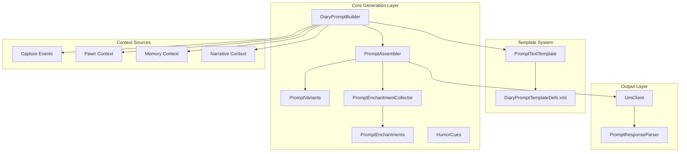
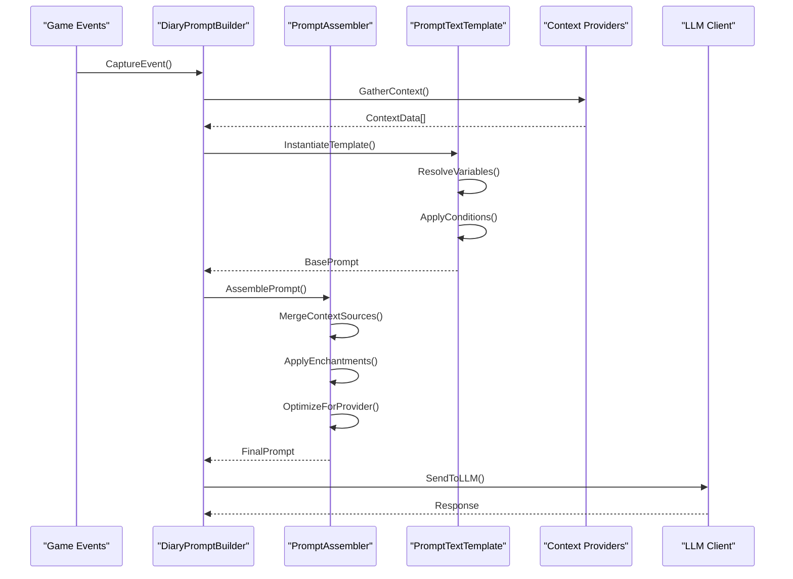
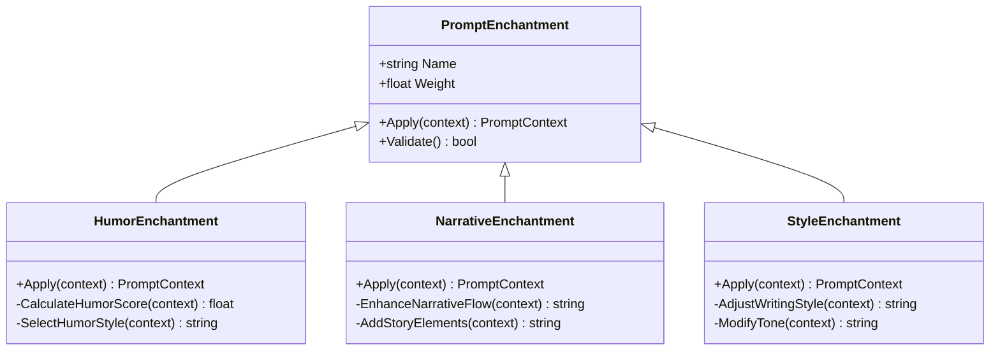
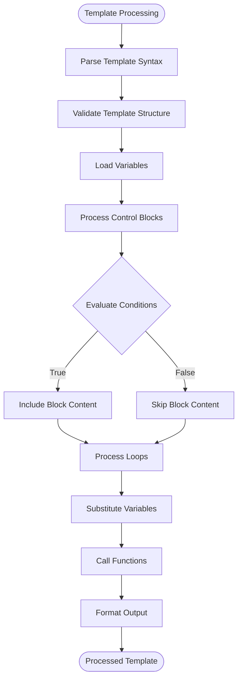
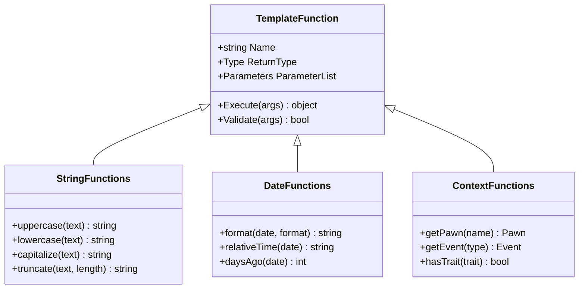
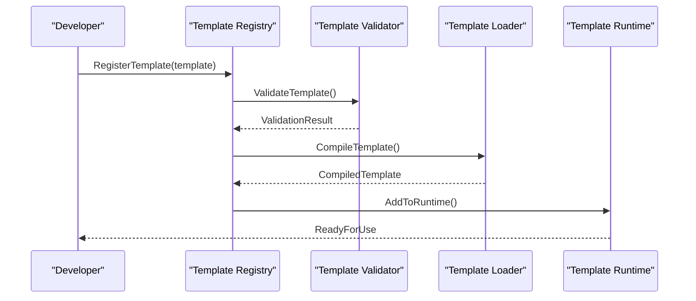

# Prompt Construction System

## Table of Contents
1. [Introduction](#introduction)
2. [Project Structure](#project-structure)
3. [Core Components](#core-components)
4. [Architecture Overview](#architecture-overview)
5. [Detailed Component Analysis](#detailed-component-analysis)
6. [Template Syntax and Variable Substitution](#template-syntax-and-variable-substitution)
7. [Conditional Logic and Context Assembly](#conditional-logic-and-context-assembly)
8. [Customization and Extension](#customization-and-extension)
9. [Performance Considerations](#performance-considerations)
10. [Troubleshooting Guide](#troubleshooting-guide)
11. [Conclusion](#conclusion)

## Introduction

The PawnDiary mod implements a sophisticated prompt construction system designed to generate contextual narrative prompts for AI language models. This system transforms captured game events into rich, personalized diary entries by combining template-based text generation with dynamic context assembly. The architecture supports multiple LLM providers, customizable humor cues, enchantment systems, and efficient memory management for large context assemblies.

## Project Structure

The prompt construction system is organized across several key directories:

**Diagram sources**
- [DiaryPromptBuilder.cs](../../../../../Source/Generation/DiaryPromptBuilder.cs)
- [PromptAssembler.cs](../../../../../Source/Generation/PromptAssembler.cs)
- [PromptTextTemplate.cs](../../../../../Source/Util/PromptTextTemplate.cs)

## Core Components

### DiaryPromptBuilder

The DiaryPromptBuilder serves as the primary orchestrator for constructing contextual prompts. It coordinates between event capture systems, template engines, and context providers to generate cohesive narrative prompts.

**Key Responsibilities:**
- Event data aggregation from multiple capture policies
- Template selection and instantiation
- Context variable resolution
- Prompt variant generation
- Humor cue integration

### PromptAssembler

The PromptAssembler manages the complex process of combining multiple context sources into unified prompts. It handles prompt variants, applies enchantments, and ensures optimal prompt structure for different LLM providers.

**Key Responsibilities:**
- Multi-source context merging
- Prompt variant management
- Enchantment application
- Provider-specific optimization
- Memory-efficient assembly

### PromptTextTemplate

The template engine provides flexible text substitution and conditional logic capabilities. It supports advanced templating features including nested conditions, loops, and dynamic content generation.

**Key Features:**
- Variable substitution syntax
- Conditional blocks
- Loop constructs
- Function calls
- Error handling

**Section sources**
- [DiaryPromptBuilder.cs](../../../../../Source/Generation/DiaryPromptBuilder.cs)
- [PromptAssembler.cs](../../../../../Source/Generation/PromptAssembler.cs)
- [PromptTextTemplate.cs](../../../../../Source/Util/PromptTextTemplate.cs)

## Architecture Overview

The prompt construction system follows a layered architecture pattern with clear separation of concerns:

**Diagram sources**
- [DiaryPromptBuilder.cs](../../../../../Source/Generation/DiaryPromptBuilder.cs)
- [PromptAssembler.cs](../../../../../Source/Generation/PromptAssembler.cs)
- [LlmClient.cs](../../../../../Source/Generation/LlmClient.cs)

## Detailed Component Analysis

### DiaryPromptBuilder Implementation

The DiaryPromptBuilder implements a builder pattern with fluent API design, allowing for flexible prompt construction through method chaining and configuration objects.

#### Key Design Patterns:
- **Builder Pattern**: Fluent interface for prompt construction
- **Strategy Pattern**: Pluggable context providers
- **Factory Pattern**: Template instantiation
- **Observer Pattern**: Event-driven context updates

#### Processing Pipeline:
1. **Event Ingestion**: Collects raw event data from capture policies
2. **Context Resolution**: Maps events to structured context objects
3. **Template Selection**: Chooses appropriate templates based on event type
4. **Variable Substitution**: Fills template placeholders with resolved values
5. **Condition Evaluation**: Applies conditional logic based on context state
6. **Variant Generation**: Creates multiple prompt variations for testing

**Section sources**
- [DiaryPromptBuilder.cs](../../../../../Source/Generation/DiaryPromptBuilder.cs)

### PromptAssembler Architecture

The PromptAssembler manages complex prompt assembly operations with support for parallel processing and memory-efficient streaming.

#### Context Source Management:
- **Priority-based Merging**: Resolves conflicts between overlapping context sources
- **Lazy Loading**: Defers expensive context loading until needed
- **Cache Integration**: Reuses computed context results
- **Version Compatibility**: Handles schema evolution across versions

#### Enchantment System:
The enchantment system allows runtime modification of prompt behavior through composable transformations:

**Diagram sources**
- [PromptEnchantments.cs](../../../../../Source/Generation/PromptEnchantments.cs)
- [HumorCues.cs](../../../../../Source/Generation/HumorCues.cs)

**Section sources**
- [PromptAssembler.cs](../../../../../Source/Generation/PromptAssembler.cs)
- [PromptEnchantments.cs](../../../../../Source/Generation/PromptEnchantments.cs)

### Template Engine Deep Dive

The PromptTextTemplate system provides a powerful templating language with support for complex logic and dynamic content generation.

#### Template Syntax Features:

| Feature | Syntax | Description |
|---------|--------|-------------|
| Variable Substitution | `{{variable_name}}` | Basic variable replacement |
| Nested Variables | `{{context.pawn.name}}` | Dot notation for object properties |
| Conditional Blocks | `...` | If/else conditional logic |
| Loop Constructs | `...` | Iteration over collections |
| Function Calls | `{{function(arg1, arg2)}}` | Built-in and custom functions |
| Default Values | `{{variable|default_value}}` | Fallback values for missing data |
| Formatting | `{{date|format_string}}` | Data formatting options |

#### Advanced Template Features:

**Diagram sources**
- [PromptTextTemplate.cs](../../../../../Source/Util/PromptTextTemplate.cs)

**Section sources**
- [PromptTextTemplate.cs](../../../../../Source/Util/PromptTextTemplate.cs)

## Template Syntax and Variable Substitution

### Core Variable Types

The template system supports various data types with automatic type conversion and formatting:

#### Primitive Types:
- **Strings**: Direct text substitution with escaping support
- **Numbers**: Numeric formatting with locale-aware decimal separators
- **Booleans**: True/false rendering with localization
- **Dates**: Date/time formatting with relative time expressions

#### Complex Objects:
- **Pawn Objects**: Access to pawn properties, traits, and relationships
- **Event Objects**: Event metadata, participants, and outcomes
- **Collection Objects**: Arrays and lists with iteration support
- **Dictionary Objects**: Key-value pair access with fallback handling

### Variable Resolution Hierarchy

The system resolves variables through a multi-layered hierarchy:

1. **Local Scope**: Variables defined within the current template block
2. **Context Scope**: Variables from the active context provider
3. **Global Scope**: System-wide variables and constants
4. **Fallback Scope**: Default values and error handling

### Custom Function Registration

Developers can register custom functions for advanced template logic:

**Diagram sources**
- [PromptTextTemplate.cs](../../../../../Source/Util/PromptTextTemplate.cs)

**Section sources**
- [PromptTextTemplate.cs](../../../../../Source/Util/PromptTextTemplate.cs)

## Conditional Logic and Context Assembly

### Condition Evaluation Engine

The conditional logic system supports complex boolean expressions with short-circuit evaluation:

#### Supported Operators:
- **Comparison**: `==`, `!=`, `<`, `>`, `<=`, `>=`
- **Logical**: `and`, `or`, `not`
- **Existence**: `exists`, `isEmpty`, `isNotNull`
- **Pattern Matching**: `matches`, `contains`, `startsWith`

#### Context Assembly Strategies:

| Strategy | Description | Use Case |
|----------|-------------|----------|
| **Merge** | Combines all context sources | Comprehensive prompts |
| **Priority** | Uses highest priority source | Fallback scenarios |
| **Filter** | Selects matching context items | Targeted information |
| **Transform** | Modifies context before assembly | Data normalization |

### Memory-Efficient Context Management

The system implements several strategies for managing large context assemblies:

#### Lazy Loading:
- Context data is loaded only when accessed
- Expensive computations are deferred until needed
- Partial context loading for preview scenarios

#### Caching Mechanisms:
- **Result Cache**: Stores computed context results
- **Template Cache**: Caches compiled template instances
- **Lookup Cache**: Maintains frequently accessed lookups
- **GC Pressure Reduction**: Minimizes temporary object creation

**Section sources**
- [PromptAssembler.cs](../../../../../Source/Generation/PromptAssembler.cs)

## Customization and Extension

### Creating Custom Prompt Templates

Developers can create new prompt templates by extending the base template system:

#### Template Definition Structure:
1. **Template Metadata**: Name, description, version compatibility
2. **Variable Bindings**: Define available variables and their types
3. **Conditional Rules**: Specify when template should be used
4. **Content Sections**: Define main content and optional sections
5. **Validation Rules**: Ensure template integrity and safety

#### Example Template Workflow:

### Extending Context Providers

New context sources can be integrated through the context provider interface:

#### Provider Interface Requirements:
- **Name Identification**: Unique provider identifier
- **Capability Declaration**: What data the provider offers
- **Loading Strategy**: How to efficiently load context data
- **Error Handling**: Graceful degradation on failures
- **Performance Metrics**: Usage statistics and timing

### Enchantment Development

Custom enchantments extend prompt behavior through composable transformations:

#### Enchantment Lifecycle:
1. **Registration**: Declare enchantment metadata and dependencies
2. **Validation**: Ensure enchantment compatibility and safety
3. **Application**: Transform prompt context at runtime
4. **Monitoring**: Track enchantment effectiveness and performance

**Section sources**
- [DiaryPromptTemplateDefs.xml](../../../../../1.6/Defs/DiaryPromptTemplateDefs.xml)
- [DiaryPromptEnchantmentDefs.xml](../../../../../1.6/Defs/DiaryPromptEnchantmentDefs.xml)

## Performance Considerations

### Large Context Assembly Optimization

The system implements several strategies for handling large context assemblies efficiently:

#### Streaming Architecture:
- **Chunked Processing**: Processes context in manageable chunks
- **Incremental Building**: Builds prompts incrementally rather than all at once
- **Memory Pooling**: Reuses memory allocations where possible
- **Background Processing**: Offloads heavy computations to background threads

#### Caching Strategies:
- **Template Compilation Cache**: Pre-compiles frequently used templates
- **Context Result Cache**: Stores computed context results with TTL
- **Lookup Table Cache**: Caches expensive database queries
- **String Interning**: Reduces string duplication overhead

### Memory Management Best Practices

#### Garbage Collection Optimization:
- **Object Pooling**: Reuses frequently created objects
- **Struct Allocation**: Uses value types for small, short-lived objects
- **Span<T> Usage**: Avoids heap allocation for string processing
- **Async/Await Patterns**: Prevents thread blocking during I/O operations

#### Monitoring and Profiling:
- **Memory Usage Tracking**: Monitors heap usage patterns
- **Allocation Hotspots**: Identifies frequent allocation sites
- **GC Pressure Metrics**: Tracks garbage collection frequency
- **Performance Counters**: Measures key performance indicators

### Provider-Specific Optimizations

Different LLM providers have varying requirements and limitations:

#### Token Limit Management:
- **Intelligent Truncation**: Preserves important context while respecting limits
- **Adaptive Chunking**: Adjusts chunk sizes based on provider constraints
- **Priority-Based Selection**: Prioritizes most relevant context information
- **Fallback Strategies**: Provides simplified prompts when full context exceeds limits

#### Rate Limit Handling:
- **Request Batching**: Groups related requests when possible
- **Retry Logic**: Implements exponential backoff for failed requests
- **Circuit Breaker**: Temporarily disables failing providers
- **Load Balancing**: Distributes requests across multiple providers

**Section sources**
- [PromptAssembler.cs](../../../../../Source/Generation/PromptAssembler.cs)
- [LlmClient.cs](../../../../../Source/Generation/LlmClient.cs)

## Troubleshooting Guide

### Common Template Issues

#### Variable Resolution Problems:
- **Missing Variables**: Check variable scope and availability
- **Type Mismatches**: Verify variable types match expected formats
- **Circular References**: Detect and break circular dependency chains
- **Null Safety**: Implement proper null checking and fallbacks

#### Performance Bottlenecks:
- **Template Compilation**: Monitor compilation times and cache effectiveness
- **Context Loading**: Profile context provider performance
- **Memory Usage**: Track heap growth and GC pressure
- **Thread Contention**: Identify synchronization bottlenecks

### Debugging Tools and Techniques

#### Logging and Diagnostics:
- **Template Execution Logs**: Track template processing steps
- **Context Resolution Traces**: Monitor variable lookup paths
- **Performance Timers**: Measure component execution times
- **Memory Snapshots**: Analyze memory usage patterns

#### Testing Framework:
- **Unit Tests**: Test individual template components
- **Integration Tests**: Validate complete prompt assembly flows
- **Performance Tests**: Benchmark under realistic loads
- **Regression Tests**: Ensure backward compatibility

### Error Recovery Strategies

#### Graceful Degradation:
- **Fallback Templates**: Provide simpler alternatives when complex templates fail
- **Partial Context**: Continue with available context when some sources fail
- **Default Values**: Supply sensible defaults for missing data
- **User Feedback**: Inform users about reduced functionality

**Section sources**
- [DiaryPromptBuilder.cs](../../../../../Source/Generation/DiaryPromptBuilder.cs)
- [PromptTextTemplate.cs](../../../../../Source/Util/PromptTextTemplate.cs)

## Conclusion

The PawnDiary prompt construction system represents a sophisticated approach to generating contextual narrative prompts for AI language models. Through its modular architecture, flexible templating system, and performance optimizations, it provides a robust foundation for creating engaging and personalized diary entries.

The system's design emphasizes extensibility, allowing developers to customize every aspect of prompt generation while maintaining high performance and reliability. The combination of template-based text generation, dynamic context assembly, and intelligent optimization makes it well-suited for the complex requirements of narrative generation in gaming contexts.

Future enhancements could include machine learning-based template optimization, real-time context adaptation, and enhanced cross-provider compatibility. The current architecture provides a solid foundation for these potential improvements while maintaining backward compatibility and performance standards.
