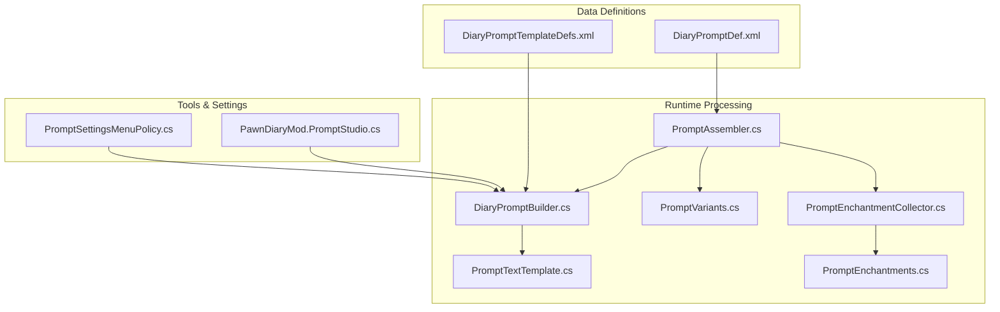
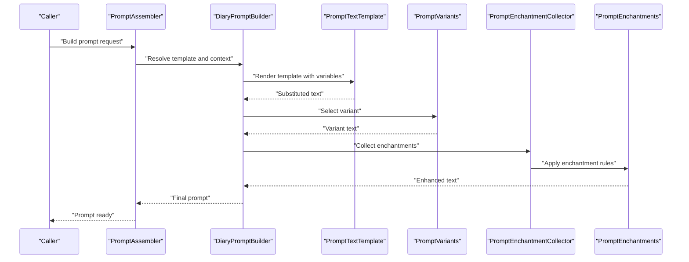
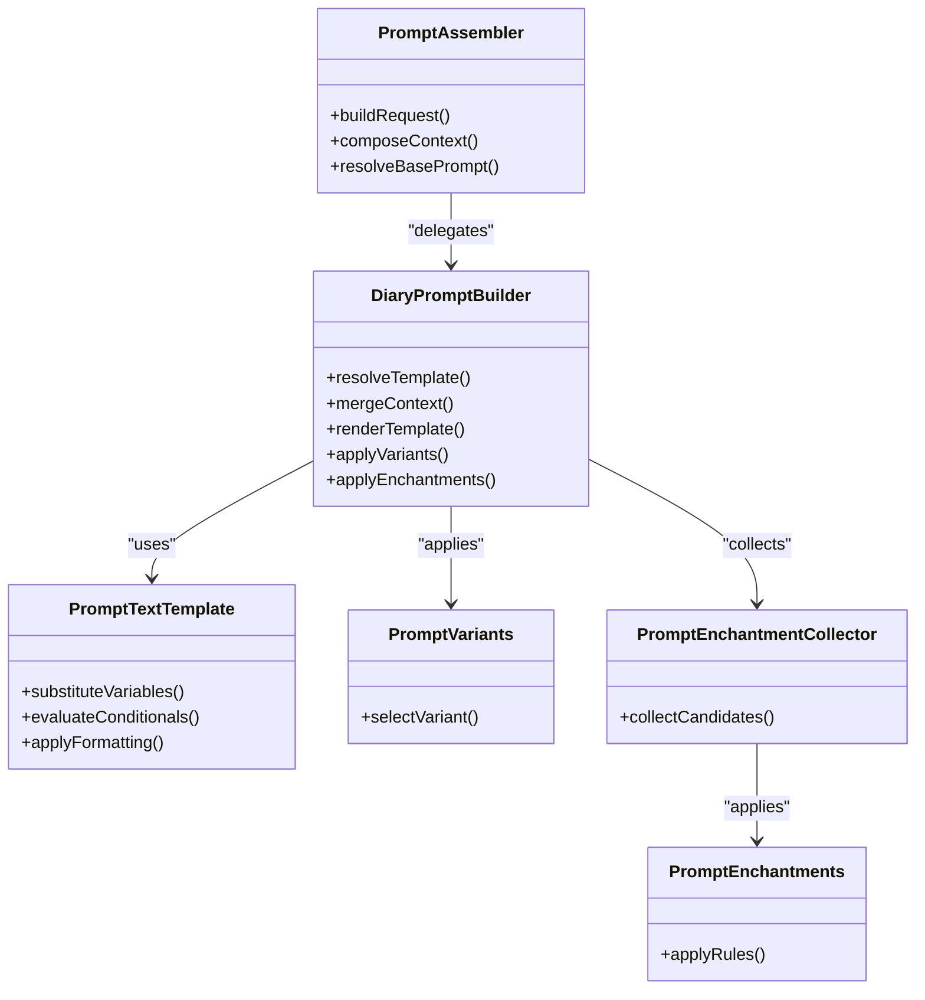
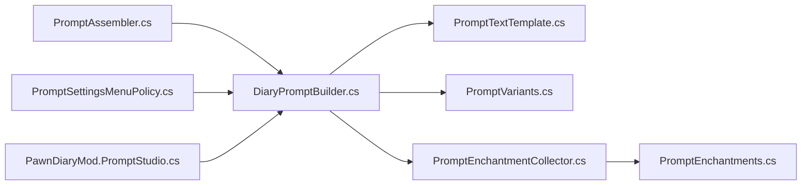

# Template Management

<cite>
**Referenced Files in This Document**
- [DiaryPromptBuilder.cs](../../../../../Source/Generation/DiaryPromptBuilder.cs)
- [PromptTextTemplate.cs](../../../../../Source/Util/PromptTextTemplate.cs)
- [DiaryPromptTemplateDefs.xml](../../../../../1.6/Defs/DiaryPromptTemplateDefs.xml)
- [DiaryPromptDef.xml](../../../../../1.6/Defs/DiaryPromptDef.xml)
- [PromptAssembler.cs](../../../../../Source/Generation/PromptAssembler.cs)
- [PromptVariants.cs](../../../../../Source/Generation/PromptVariants.cs)
- [PromptEnchantmentCollector.cs](../../../../../Source/Generation/PromptEnchantmentCollector.cs)
- [PromptEnchantments.cs](../../../../../Source/Generation/PromptEnchantments.cs)
- [PromptSettingsMenuPolicy.cs](../../../../../Source/Settings/PromptSettingsMenuPolicy.cs)
- [PawnDiaryMod.PromptStudio.cs](../../../../../Source/Settings/PawnDiaryMod.PromptStudio.cs)
- [DiaryErrorReporter.cs](../../../../../Source/Diagnostics/DiaryErrorReporter.cs)
</cite>

## Table of Contents
1. [Introduction](#introduction)
2. [Project Structure](#project-structure)
3. [Core Components](#core-components)
4. [Architecture Overview](#architecture-overview)
5. [Detailed Component Analysis](#detailed-component-analysis)
6. [Dependency Analysis](#dependency-analysis)
7. [Performance Considerations](#performance-considerations)
8. [Troubleshooting Guide](#troubleshooting-guide)
9. [Conclusion](#conclusion)
10. [Appendices](#appendices)

## Introduction
This document explains the template management system used by the Diary mod to define, load, and process prompt templates for generating diary entries. It focuses on how templates are represented as data definitions, how they are resolved and composed at runtime, and how the DiaryPromptBuilder orchestrates variable substitution, conditional logic, and formatting directives. It also covers best practices for creating custom templates, defining hierarchies and inheritance, validating templates, handling errors, debugging, optimizing performance, and managing versions across mod updates.

## Project Structure
The template system spans three main areas:
- Data definitions (XML): Template and prompt definitions that authors edit.
- Runtime processing (C#): Classes that parse, resolve, and render templates into final prompts.
- Tools and settings (UI and policies): Utilities for previewing, overriding, and testing templates.

**Diagram sources**
- [DiaryPromptTemplateDefs.xml](../../../../../1.6/Defs/DiaryPromptTemplateDefs.xml)
- [DiaryPromptDef.xml](../../../../../1.6/Defs/DiaryPromptDef.xml)
- [DiaryPromptBuilder.cs](../../../../../Source/Generation/DiaryPromptBuilder.cs)
- [PromptAssembler.cs](../../../../../Source/Generation/PromptAssembler.cs)
- [PromptVariants.cs](../../../../../Source/Generation/PromptVariants.cs)
- [PromptEnchantmentCollector.cs](../../../../../Source/Generation/PromptEnchantmentCollector.cs)
- [PromptEnchantments.cs](../../../../../Source/Generation/PromptEnchantments.cs)
- [PromptTextTemplate.cs](../../../../../Source/Util/PromptTextTemplate.cs)
- [PromptSettingsMenuPolicy.cs](../../../../../Source/Settings/PromptSettingsMenuPolicy.cs)
- [PawnDiaryMod.PromptStudio.cs](../../../../../Source/Settings/PawnDiaryMod.PromptStudio.cs)

**Section sources**
- [DiaryPromptTemplateDefs.xml](../../../../../1.6/Defs/DiaryPromptTemplateDefs.xml)
- [DiaryPromptDef.xml](../../../../../1.6/Defs/DiaryPromptDef.xml)
- [DiaryPromptBuilder.cs](../../../../../Source/Generation/DiaryPromptBuilder.cs)
- [PromptAssembler.cs](../../../../../Source/Generation/PromptAssembler.cs)
- [PromptVariants.cs](../../../../../Source/Generation/PromptVariants.cs)
- [PromptEnchantmentCollector.cs](../../../../../Source/Generation/PromptEnchantmentCollector.cs)
- [PromptEnchantments.cs](../../../../../Source/Generation/PromptEnchantments.cs)
- [PromptTextTemplate.cs](../../../../../Source/Util/PromptTextTemplate.cs)
- [PromptSettingsMenuPolicy.cs](../../../../../Source/Settings/PromptSettingsMenuPolicy.cs)
- [PawnDiaryMod.PromptStudio.cs](../../../../../Source/Settings/PawnDiaryMod.PromptStudio.cs)

## Core Components
- DiaryPromptBuilder: Central orchestrator that resolves a target template, merges context, applies variants and enchantments, and renders the final prompt text using the template engine.
- PromptTextTemplate: Lightweight template engine responsible for variable substitution, conditionals, and formatting directives within a single template string.
- PromptAssembler: Coordinates higher-level composition of prompts from multiple sources (templates, context lines, decorations).
- PromptVariants: Manages selection among alternative phrasings or structures based on context.
- PromptEnchantmentCollector and PromptEnchantments: Collect and apply stylistic or structural “enchantments” to enhance generated text.
- PromptSettingsMenuPolicy and PromptStudio: Provide UI-driven preview, override, and testing capabilities for template authors.

Key responsibilities:
- Loading and caching template definitions from XML.
- Resolving template references and inheritance chains.
- Substituting variables with contextual values.
- Evaluating conditionals and applying formatting.
- Integrating variants and enchantments into the final output.

**Section sources**
- [DiaryPromptBuilder.cs](../../../../../Source/Generation/DiaryPromptBuilder.cs)
- [PromptTextTemplate.cs](../../../../../Source/Util/PromptTextTemplate.cs)
- [PromptAssembler.cs](../../../../../Source/Generation/PromptAssembler.cs)
- [PromptVariants.cs](../../../../../Source/Generation/PromptVariants.cs)
- [PromptEnchantmentCollector.cs](../../../../../Source/Generation/PromptEnchantmentCollector.cs)
- [PromptEnchantments.cs](../../../../../Source/Generation/PromptEnchantments.cs)
- [PromptSettingsMenuPolicy.cs](../../../../../Source/Settings/PromptSettingsMenuPolicy.cs)
- [PawnDiaryMod.PromptStudio.cs](../../../../../Source/Settings/PawnDiaryMod.PromptStudio.cs)

## Architecture Overview
At a high level, the template pipeline is driven by the assembler and builder:
- The assembler selects a base prompt definition and composes a request including context and optional overrides.
- The builder resolves the appropriate template(s), merges context, evaluates conditionals, substitutes variables, and applies formatting.
- Variants and enchantments are applied to diversify and polish the output.
- The result is returned to the caller for rendering or further processing.

**Diagram sources**
- [PromptAssembler.cs](../../../../../Source/Generation/PromptAssembler.cs)
- [DiaryPromptBuilder.cs](../../../../../Source/Generation/DiaryPromptBuilder.cs)
- [PromptTextTemplate.cs](../../../../../Source/Util/PromptTextTemplate.cs)
- [PromptVariants.cs](../../../../../Source/Generation/PromptVariants.cs)
- [PromptEnchantmentCollector.cs](../../../../../Source/Generation/PromptEnchantmentCollector.cs)
- [PromptEnchantments.cs](../../../../../Source/Generation/PromptEnchantments.cs)

## Detailed Component Analysis

### Template Definition Model (XML)
Templates and prompts are defined in XML under the 1.6/Defs directory. Authors create:
- Template definitions that encapsulate reusable text blocks, variables, conditionals, and formatting.
- Prompt definitions that reference one or more templates and bind them to events or contexts.

Guidelines:
- Use unique IDs for templates and prompts.
- Organize templates by domain (e.g., arrivals, deaths, interactions).
- Keep templates small and composable; prefer referencing other templates to avoid duplication.

**Section sources**
- [DiaryPromptTemplateDefs.xml](../../../../../1.6/Defs/DiaryPromptTemplateDefs.xml)
- [DiaryPromptDef.xml](../../../../../1.6/Defs/DiaryPromptDef.xml)

### Template Engine (PromptTextTemplate)
The template engine processes individual template strings. It supports:
- Variable substitution patterns: placeholders bound to keys provided by the context.
- Conditional logic operators: include/exclude sections based on boolean expressions or presence checks.
- Formatting directives: control casing, truncation, punctuation, and list formatting.

Processing steps:
- Parse template into tokens (text, variables, conditionals, directives).
- Resolve variables against the current context map.
- Evaluate conditionals and branch accordingly.
- Apply formatting directives to segments.
- Concatenate results into final text.

Best practices:
- Prefer explicit variable names over positional indices for readability.
- Use conditionals sparingly; prefer splitting into separate templates when complexity grows.
- Avoid nested conditionals beyond two levels to keep templates maintainable.

**Section sources**
- [PromptTextTemplate.cs](../../../../../Source/Util/PromptTextTemplate.cs)

### Prompt Assembly and Orchestration (PromptAssembler and DiaryPromptBuilder)
PromptAssembler coordinates the overall build:
- Selects a base prompt definition.
- Gathers context lines and metadata.
- Delegates template resolution and rendering to the builder.

DiaryPromptBuilder handles:
- Template resolution and inheritance merging.
- Context binding and validation.
- Rendering via the template engine.
- Applying variants and enchantments.
- Returning the final prompt.

**Diagram sources**
- [PromptAssembler.cs](../../../../../Source/Generation/PromptAssembler.cs)
- [DiaryPromptBuilder.cs](../../../../../Source/Generation/DiaryPromptBuilder.cs)
- [PromptTextTemplate.cs](../../../../../Source/Util/PromptTextTemplate.cs)
- [PromptVariants.cs](../../../../../Source/Generation/PromptVariants.cs)
- [PromptEnchantmentCollector.cs](../../../../../Source/Generation/PromptEnchantmentCollector.cs)
- [PromptEnchantments.cs](../../../../../Source/Generation/PromptEnchantments.cs)

**Section sources**
- [PromptAssembler.cs](../../../../../Source/Generation/PromptAssembler.cs)
- [DiaryPromptBuilder.cs](../../../../../Source/Generation/DiaryPromptBuilder.cs)

### Template Syntax Reference
- Variable substitution:
  - Placeholders are replaced with values from the context map.
  - Missing variables can be handled with defaults or omitted gracefully.
- Conditional logic:
  - Include content only if conditions are met (e.g., flags present, values non-empty).
  - Support simple boolean expressions and presence checks.
- Formatting directives:
  - Control capitalization, pluralization, truncation, and list separators.
  - Apply consistent styling across templates.

Authoring tips:
- Keep syntax consistent across templates for easier maintenance.
- Use descriptive variable names aligned with context fields.
- Test edge cases where variables may be absent or empty.

**Section sources**
- [PromptTextTemplate.cs](../../../../../Source/Util/PromptTextTemplate.cs)

### Creating Custom Templates
Steps:
- Define a new template in the template definitions file with a unique ID.
- Compose the template using variables, conditionals, and formatting directives.
- Reference the template from a prompt definition or another template.
- Validate the template using the preview tools.

Example workflow:
- Create a template for arrival events with conditional greetings based on mood.
- Bind it to an event-specific prompt definition.
- Preview and iterate until satisfied.

**Section sources**
- [DiaryPromptTemplateDefs.xml](../../../../../1.6/Defs/DiaryPromptTemplateDefs.xml)
- [DiaryPromptDef.xml](../../../../../1.6/Defs/DiaryPromptDef.xml)
- [PawnDiaryMod.PromptStudio.cs](../../../../../Source/Settings/PawnDiaryMod.PromptStudio.cs)

### Defining Template Hierarchies and Inheritance
Approaches:
- Base templates: Common structure and shared variables.
- Derived templates: Extend base templates by adding or overriding sections.
- Composition: Combine multiple templates to assemble complex prompts.

Recommendations:
- Favor shallow hierarchies to reduce confusion.
- Use clear naming conventions for base and derived templates.
- Document expected context fields for each template layer.

**Section sources**
- [DiaryPromptTemplateDefs.xml](../../../../../1.6/Defs/DiaryPromptTemplateDefs.xml)
- [DiaryPromptBuilder.cs](../../../../../Source/Generation/DiaryPromptBuilder.cs)

### Template Validation and Error Handling
Validation strategies:
- Static checks during loading: ensure required fields exist and references resolve.
- Runtime checks during rendering: handle missing variables and failed conditionals.
- Logging and reporting: capture detailed error information for debugging.

Error handling techniques:
- Graceful fallbacks when variables are missing.
- Clear error messages indicating which template and field caused issues.
- Integration with the mod’s error reporter for centralized diagnostics.

**Section sources**
- [DiaryPromptBuilder.cs](../../../../../Source/Generation/DiaryPromptBuilder.cs)
- [DiaryErrorReporter.cs](../../../../../Source/Diagnostics/DiaryErrorReporter.cs)

### Debugging Techniques
Use built-in tools:
- Prompt studio: preview rendered prompts with live context.
- Settings menu: adjust overrides and test variations quickly.
- Logs: inspect error reports and warnings for template issues.

Debugging checklist:
- Verify variable names match context keys.
- Confirm conditionals evaluate as expected for edge cases.
- Check formatting directives for unintended truncation or casing changes.

**Section sources**
- [PawnDiaryMod.PromptStudio.cs](../../../../../Source/Settings/PawnDiaryMod.PromptStudio.cs)
- [PromptSettingsMenuPolicy.cs](../../../../../Source/Settings/PromptSettingsMenuPolicy.cs)
- [DiaryErrorReporter.cs](../../../../../Source/Diagnostics/DiaryErrorReporter.cs)

## Dependency Analysis
The template system exhibits moderate coupling:
- PromptAssembler depends on DiaryPromptBuilder for orchestration.
- DiaryPromptBuilder depends on PromptTextTemplate for rendering.
- Variants and enchantments are applied post-rendering to refine output.
- UI components depend on the builder for previews and overrides.

Potential risks:
- Circular dependencies should be avoided between template loaders and builders.
- Heavy enchantment collection can impact performance if not cached.

**Diagram sources**
- [PromptAssembler.cs](../../../../../Source/Generation/PromptAssembler.cs)
- [DiaryPromptBuilder.cs](../../../../../Source/Generation/DiaryPromptBuilder.cs)
- [PromptTextTemplate.cs](../../../../../Source/Util/PromptTextTemplate.cs)
- [PromptVariants.cs](../../../../../Source/Generation/PromptVariants.cs)
- [PromptEnchantmentCollector.cs](../../../../../Source/Generation/PromptEnchantmentCollector.cs)
- [PromptEnchantments.cs](../../../../../Source/Generation/PromptEnchantments.cs)
- [PromptSettingsMenuPolicy.cs](../../../../../Source/Settings/PromptSettingsMenuPolicy.cs)
- [PawnDiaryMod.PromptStudio.cs](../../../../../Source/Settings/PawnDiaryMod.PromptStudio.cs)

**Section sources**
- [PromptAssembler.cs](../../../../../Source/Generation/PromptAssembler.cs)
- [DiaryPromptBuilder.cs](../../../../../Source/Generation/DiaryPromptBuilder.cs)
- [PromptTextTemplate.cs](../../../../../Source/Util/PromptTextTemplate.cs)
- [PromptVariants.cs](../../../../../Source/Generation/PromptVariants.cs)
- [PromptEnchantmentCollector.cs](../../../../../Source/Generation/PromptEnchantmentCollector.cs)
- [PromptEnchantments.cs](../../../../../Source/Generation/PromptEnchantments.cs)
- [PromptSettingsMenuPolicy.cs](../../../../../Source/Settings/PromptSettingsMenuPolicy.cs)
- [PawnDiaryMod.PromptStudio.cs](../../../../../Source/Settings/PawnDiaryMod.PromptStudio.cs)

## Performance Considerations
Optimization recommendations:
- Cache resolved templates and compiled token trees to avoid repeated parsing.
- Minimize deep nesting of conditionals; split complex logic into separate templates.
- Limit enchantment application to necessary cases; consider selective activation.
- Precompute frequently used context fragments to reduce redundant work.
- Profile rendering paths during heavy generation bursts and adjust thresholds.

[No sources needed since this section provides general guidance]

## Troubleshooting Guide
Common issues and resolutions:
- Missing variables: Ensure context maps provide all required keys; use defaults in templates.
- Conditional misfires: Simplify expressions; verify boolean flags and presence checks.
- Formatting anomalies: Review directives for truncation limits and casing rules.
- Performance regressions: Identify expensive enchantments or excessive variant selections.

Diagnostic steps:
- Use the prompt studio to reproduce issues with minimal context.
- Inspect error reports for precise locations and messages.
- Temporarily disable enchantments or variants to isolate bottlenecks.

**Section sources**
- [DiaryErrorReporter.cs](../../../../../Source/Diagnostics/DiaryErrorReporter.cs)
- [PawnDiaryMod.PromptStudio.cs](../../../../../Source/Settings/PawnDiaryMod.PromptStudio.cs)
- [PromptSettingsMenuPolicy.cs](../../../../../Source/Settings/PromptSettingsMenuPolicy.cs)

## Conclusion
The template management system provides a flexible, composable approach to generating diary prompts. By leveraging well-defined XML templates, a robust template engine, and orchestration through the builder and assembler, authors can craft rich, context-aware narratives. Following the guidelines for syntax, hierarchy, validation, and performance will help maintain high-quality outputs while keeping development efficient.

[No sources needed since this section summarizes without analyzing specific files]

## Appendices

### Versioning and Compatibility Across Mod Updates
- Assign semantic version identifiers to major template sets.
- Maintain backward compatibility by supporting legacy variable names with deprecation notices.
- Use migration scripts or configuration toggles to transition users gradually.
- Document breaking changes clearly in update notes.

[No sources needed since this section provides general guidance]
