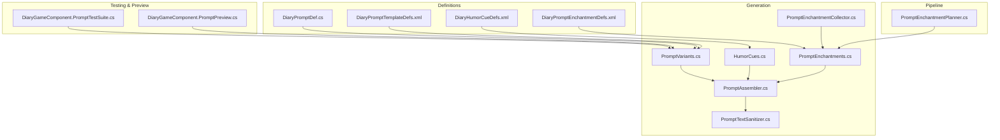
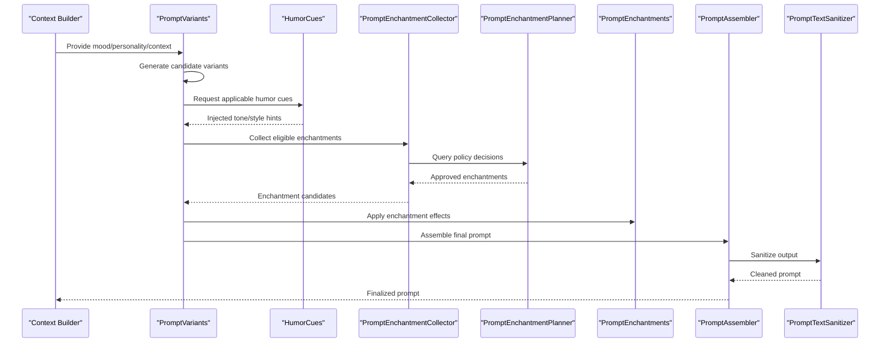
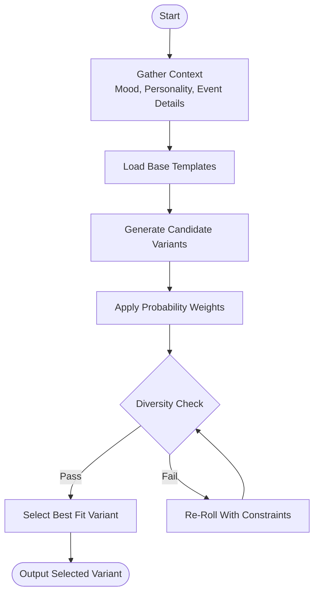
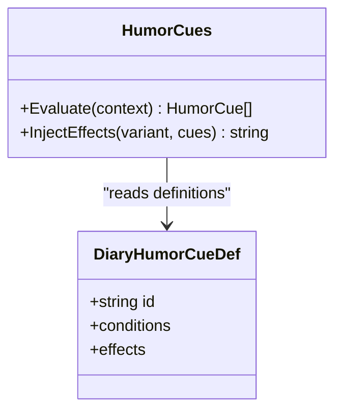
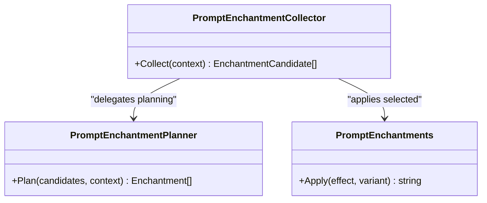
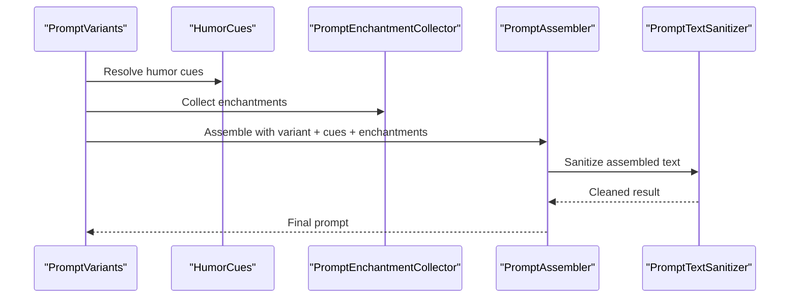
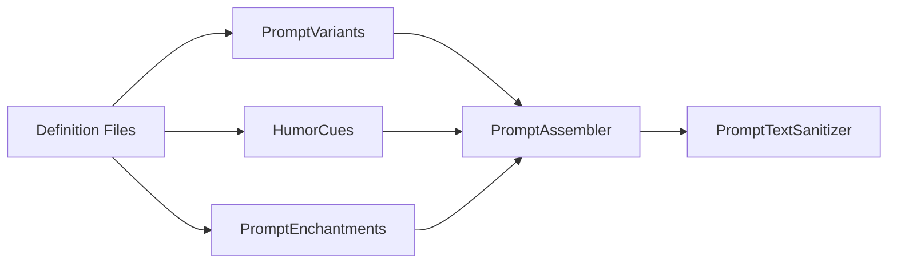

# Variant Generation System

- [PromptVariants.cs](../../../../../Source/Generation/PromptVariants.cs)
- [HumorCues.cs](../../../../../Source/Generation/HumorCues.cs)
- [DiaryHumorCueDefs.xml](../../../../../1.6/Defs/DiaryHumorCueDefs.xml)
- [DiaryPromptEnchantmentDefs.xml](../../../../../1.6/Defs/DiaryPromptEnchantmentDefs.xml)
- [PromptEnchantments.cs](../../../../../Source/Generation/PromptEnchantments.cs)
- [PromptEnchantmentCollector.cs](../../../../../Source/Generation/PromptEnchantmentCollector.cs)
- [PromptEnchantmentPlanner.cs](../../../../../Source/Pipeline/PromptEnchantmentPlanner.cs)
- [DiaryPromptDef.cs](../../../../../Source/Defs/DiaryPromptDef.cs)
- [DiaryPromptTemplateDefs.xml](../../../../../1.6/Defs/DiaryPromptTemplateDefs.xml)
- [PromptAssembler.cs](../../../../../Source/Generation/PromptAssembler.cs)
- [PromptTextSanitizer.cs](../../../../../Source/Pipeline/PromptTextSanitizer.cs)
- [PromptTestSuite.cs](../../../../../Source/Core/DiaryGameComponent.PromptTestSuite.cs)
- [PromptPreview.cs](../../../../../Source/Core/DiaryGameComponent.PromptPreview.cs)
## Table of Contents
1. [Introduction](#introduction)
2. [Project Structure](#project-structure)
3. [Core Components](#core-components)
4. [Architecture Overview](#architecture-overview)
5. [Detailed Component Analysis](#detailed-component-analysis)
6. [Dependency Analysis](#dependency-analysis)
7. [Performance Considerations](#performance-considerations)
8. [Troubleshooting Guide](#troubleshooting-guide)
9. [Conclusion](#conclusion)
10. [Appendices](#appendices)

## Introduction
This document explains the variant generation system used to create multiple prompt variations for diary entries. It focuses on how PromptVariants produces diverse prompts based on mood, personality, and contextual factors; how the humor cue system injects tone and style; how enchantment effects are configured and applied; and how selection algorithms balance randomness with narrative consistency. It also provides guidance on testing variant quality and tuning probability weights.

## Project Structure
The variant generation system spans several layers:
- Definitions (XML): Humor cues, enchantments, templates, and prompt definitions
- Core generation logic: Variants, humor, enchantments, assembler, sanitization
- Pipeline integration: Enchantment planning and context assembly
- Testing and preview utilities

**Diagram sources**
- [PromptVariants.cs](../../../../../Source/Generation/PromptVariants.cs)
- [HumorCues.cs](../../../../../Source/Generation/HumorCues.cs)
- [PromptEnchantments.cs](../../../../../Source/Generation/PromptEnchantments.cs)
- [PromptEnchantmentCollector.cs](../../../../../Source/Generation/PromptEnchantmentCollector.cs)
- [PromptEnchantmentPlanner.cs](../../../../../Source/Pipeline/PromptEnchantmentPlanner.cs)
- [DiaryPromptDef.cs](../../../../../Source/Defs/DiaryPromptDef.cs)
- [DiaryPromptTemplateDefs.xml](../../../../../1.6/Defs/DiaryPromptTemplateDefs.xml)
- [DiaryHumorCueDefs.xml](../../../../../1.6/Defs/DiaryHumorCueDefs.xml)
- [DiaryPromptEnchantmentDefs.xml](../../../../../1.6/Defs/DiaryPromptEnchantmentDefs.xml)
- [PromptAssembler.cs](../../../../../Source/Generation/PromptAssembler.cs)
- [PromptTextSanitizer.cs](../../../../../Source/Pipeline/PromptTextSanitizer.cs)
- [DiaryGameComponent.PromptTestSuite.cs](../../../../../Source/Core/DiaryGameComponent.PromptTestSuite.cs)
- [DiaryGameComponent.PromptPreview.cs](../../../../../Source/Core/DiaryGameComponent.PromptPreview.cs)

**Section sources**
- [PromptVariants.cs](../../../../../Source/Generation/PromptVariants.cs)
- [HumorCues.cs](../../../../../Source/Generation/HumorCues.cs)
- [PromptEnchantments.cs](../../../../../Source/Generation/PromptEnchantments.cs)
- [PromptEnchantmentCollector.cs](../../../../../Source/Generation/PromptEnchantmentCollector.cs)
- [PromptEnchantmentPlanner.cs](../../../../../Source/Pipeline/PromptEnchantmentPlanner.cs)
- [DiaryPromptDef.cs](../../../../../Source/Defs/DiaryPromptDef.cs)
- [DiaryPromptTemplateDefs.xml](../../../../../1.6/Defs/DiaryPromptTemplateDefs.xml)
- [DiaryHumorCueDefs.xml](../../../../../1.6/Defs/DiaryHumorCueDefs.xml)
- [DiaryPromptEnchantmentDefs.xml](../../../../../1.6/Defs/DiaryPromptEnchantmentDefs.xml)
- [PromptAssembler.cs](../../../../../Source/Generation/PromptAssembler.cs)
- [PromptTextSanitizer.cs](../../../../../Source/Pipeline/PromptTextSanitizer.cs)
- [DiaryGameComponent.PromptTestSuite.cs](../../../../../Source/Core/DiaryGameComponent.PromptTestSuite.cs)
- [DiaryGameComponent.PromptPreview.cs](../../../../../Source/Core/DiaryGameComponent.PromptPreview.cs)

## Core Components
- PromptVariants: Generates a pool of candidate prompts by combining base templates with contextual modifiers such as mood, personality, and event-specific details. It applies weighting and selection strategies to ensure variety while preserving coherence.
- HumorCues: Provides a system for injecting humor-related tone and stylistic elements into generated prompts based on defined cues and current context.
- PromptEnchantments and PromptEnchantmentCollector: Define and collect “enchantment” effects that modify phrasing, emphasis, or rhetorical devices during prompt assembly.
- PromptEnchantmentPlanner: Decides which enchantments apply at runtime based on policies and context.
- PromptAssembler: Orchestrates the final construction of a prompt from variants, humor cues, and enchantments.
- PromptTextSanitizer: Cleans and normalizes text produced by variants and enchantments to maintain consistent formatting.

Key responsibilities:
- Candidate generation and diversity control
- Tone/style injection via humor cues
- Enchantment effect application and policy-driven selection
- Final assembly and sanitization

**Section sources**
- [PromptVariants.cs](../../../../../Source/Generation/PromptVariants.cs)
- [HumorCues.cs](../../../../../Source/Generation/HumorCues.cs)
- [PromptEnchantments.cs](../../../../../Source/Generation/PromptEnchantments.cs)
- [PromptEnchantmentCollector.cs](../../../../../Source/Generation/PromptEnchantmentCollector.cs)
- [PromptEnchantmentPlanner.cs](../../../../../Source/Pipeline/PromptEnchantmentPlanner.cs)
- [PromptAssembler.cs](../../../../../Source/Generation/PromptAssembler.cs)
- [PromptTextSanitizer.cs](../../../../../Source/Pipeline/PromptTextSanitizer.cs)

## Architecture Overview
The variant generation pipeline integrates definitions, runtime context, and selection logic to produce coherent, varied prompts.

**Diagram sources**
- [PromptVariants.cs](../../../../../Source/Generation/PromptVariants.cs)
- [HumorCues.cs](../../../../../Source/Generation/HumorCues.cs)
- [PromptEnchantmentCollector.cs](../../../../../Source/Generation/PromptEnchantmentCollector.cs)
- [PromptEnchantmentPlanner.cs](../../../../../Source/Pipeline/PromptEnchantmentPlanner.cs)
- [PromptEnchantments.cs](../../../../../Source/Generation/PromptEnchantments.cs)
- [PromptAssembler.cs](../../../../../Source/Generation/PromptAssembler.cs)
- [PromptTextSanitizer.cs](../../../../../Source/Pipeline/PromptTextSanitizer.cs)

## Detailed Component Analysis

### PromptVariants: Candidate Generation and Selection
Responsibilities:
- Build a set of candidate prompts using base templates and contextual inputs (mood, personality, event specifics).
- Apply probability weighting to favor certain variants while maintaining diversity.
- Ensure narrative consistency by constraining choices based on continuity rules and prior context.

Selection algorithm highlights:
- Weighted sampling over candidate variants
- Diversity checks to avoid repetitive phrasing
- Continuity constraints to preserve character voice and story coherence

**Diagram sources**
- [PromptVariants.cs](../../../../../Source/Generation/PromptVariants.cs)
- [DiaryPromptTemplateDefs.xml](../../../../../1.6/Defs/DiaryPromptTemplateDefs.xml)
- [DiaryPromptDef.cs](../../../../../Source/Defs/DiaryPromptDef.cs)

**Section sources**
- [PromptVariants.cs](../../../../../Source/Generation/PromptVariants.cs)
- [DiaryPromptTemplateDefs.xml](../../../../../1.6/Defs/DiaryPromptTemplateDefs.xml)
- [DiaryPromptDef.cs](../../../../../Source/Defs/DiaryPromptDef.cs)

### Humor Cue System: Tone and Style Injection
Responsibilities:
- Define humor cues in XML definitions
- Evaluate applicability based on context (e.g., mood, recent events)
- Inject appropriate tone and stylistic markers into variants

Implementation notes:
- Humor cue definitions include conditions and effects
- Runtime evaluation selects cues that match current state
- Effects adjust wording, cadence, or rhetorical devices

**Diagram sources**
- [HumorCues.cs](../../../../../Source/Generation/HumorCues.cs)
- [DiaryHumorCueDefs.xml](../../../../../1.6/Defs/DiaryHumorCueDefs.xml)

**Section sources**
- [HumorCues.cs](../../../../../Source/Generation/HumorCues.cs)
- [DiaryHumorCueDefs.xml](../../../../../1.6/Defs/DiaryHumorCueDefs.xml)

### Enchantment Effects: Configuration and Application
Responsibilities:
- Define enchantment effects in XML definitions
- Collect eligible enchantments based on context and policies
- Plan and apply enchantments during prompt assembly

Key components:
- PromptEnchantments: Effect definitions and behaviors
- PromptEnchantmentCollector: Aggregates potential enchantments
- PromptEnchantmentPlanner: Policy-based selection and ordering

**Diagram sources**
- [PromptEnchantments.cs](../../../../../Source/Generation/PromptEnchantments.cs)
- [PromptEnchantmentCollector.cs](../../../../../Source/Generation/PromptEnchantmentCollector.cs)
- [PromptEnchantmentPlanner.cs](../../../../../Source/Pipeline/PromptEnchantmentPlanner.cs)
- [DiaryPromptEnchantmentDefs.xml](../../../../../1.6/Defs/DiaryPromptEnchantmentDefs.xml)

**Section sources**
- [PromptEnchantments.cs](../../../../../Source/Generation/PromptEnchantments.cs)
- [PromptEnchantmentCollector.cs](../../../../../Source/Generation/PromptEnchantmentCollector.cs)
- [PromptEnchantmentPlanner.cs](../../../../../Source/Pipeline/PromptEnchantmentPlanner.cs)
- [DiaryPromptEnchantmentDefs.xml](../../../../../1.6/Defs/DiaryPromptEnchantmentDefs.xml)

### Prompt Assembly and Sanitization
Responsibilities:
- Combine selected variant, humor cues, and enchantments into a cohesive prompt
- Sanitize text to ensure consistent formatting and safety

**Diagram sources**
- [PromptAssembler.cs](../../../../../Source/Generation/PromptAssembler.cs)
- [PromptTextSanitizer.cs](../../../../../Source/Pipeline/PromptTextSanitizer.cs)
- [PromptVariants.cs](../../../../../Source/Generation/PromptVariants.cs)
- [HumorCues.cs](../../../../../Source/Generation/HumorCues.cs)
- [PromptEnchantmentCollector.cs](../../../../../Source/Generation/PromptEnchantmentCollector.cs)

**Section sources**
- [PromptAssembler.cs](../../../../../Source/Generation/PromptAssembler.cs)
- [PromptTextSanitizer.cs](../../../../../Source/Pipeline/PromptTextSanitizer.cs)
- [PromptVariants.cs](../../../../../Source/Generation/PromptVariants.cs)
- [HumorCues.cs](../../../../../Source/Generation/HumorCues.cs)
- [PromptEnchantmentCollector.cs](../../../../../Source/Generation/PromptEnchantmentCollector.cs)

## Dependency Analysis
The variant generation system depends on definition files for extensibility and uses runtime policies to guide selection.

**Diagram sources**
- [DiaryPromptDef.cs](../../../../../Source/Defs/DiaryPromptDef.cs)
- [DiaryPromptTemplateDefs.xml](../../../../../1.6/Defs/DiaryPromptTemplateDefs.xml)
- [DiaryHumorCueDefs.xml](../../../../../1.6/Defs/DiaryHumorCueDefs.xml)
- [DiaryPromptEnchantmentDefs.xml](../../../../../1.6/Defs/DiaryPromptEnchantmentDefs.xml)
- [PromptVariants.cs](../../../../../Source/Generation/PromptVariants.cs)
- [HumorCues.cs](../../../../../Source/Generation/HumorCues.cs)
- [PromptEnchantments.cs](../../../../../Source/Generation/PromptEnchantments.cs)
- [PromptAssembler.cs](../../../../../Source/Generation/PromptAssembler.cs)
- [PromptTextSanitizer.cs](../../../../../Source/Pipeline/PromptTextSanitizer.cs)

**Section sources**
- [DiaryPromptDef.cs](../../../../../Source/Defs/DiaryPromptDef.cs)
- [DiaryPromptTemplateDefs.xml](../../../../../1.6/Defs/DiaryPromptTemplateDefs.xml)
- [DiaryHumorCueDefs.xml](../../../../../1.6/Defs/DiaryHumorCueDefs.xml)
- [DiaryPromptEnchantmentDefs.xml](../../../../../1.6/Defs/DiaryPromptEnchantmentDefs.xml)
- [PromptVariants.cs](../../../../../Source/Generation/PromptVariants.cs)
- [HumorCues.cs](../../../../../Source/Generation/HumorCues.cs)
- [PromptEnchantments.cs](../../../../../Source/Generation/PromptEnchantments.cs)
- [PromptAssembler.cs](../../../../../Source/Generation/PromptAssembler.cs)
- [PromptTextSanitizer.cs](../../../../../Source/Pipeline/PromptTextSanitizer.cs)

## Performance Considerations
- Candidate generation should be bounded to prevent excessive branching; use pruning heuristics early.
- Humor cue evaluation should cache results when context is stable across multiple generations.
- Enchantment collection and planning should avoid redundant computations by memoizing policy outcomes.
- Text sanitization should be lightweight and deterministic to minimize overhead.

[No sources needed since this section provides general guidance]

## Troubleshooting Guide
Common issues and remedies:
- Repetitive prompts: Increase diversity thresholds and review probability weights in variant selection.
- Inconsistent tone: Adjust humor cue conditions and effect priorities to better match context.
- Over-enchantment: Tune enchantment planner policies to limit cumulative effects.
- Formatting anomalies: Inspect sanitizer rules and ensure variant outputs conform to expected patterns.

Useful tools:
- Prompt test suite for automated quality checks
- Prompt preview for manual inspection and iteration

**Section sources**
- [DiaryGameComponent.PromptTestSuite.cs](../../../../../Source/Core/DiaryGameComponent.PromptTestSuite.cs)
- [DiaryGameComponent.PromptPreview.cs](../../../../../Source/Core/DiaryGameComponent.PromptPreview.cs)

## Conclusion
The variant generation system combines structured definitions with flexible runtime logic to produce varied, coherent prompts. By carefully tuning probability weights, humor cues, and enchantment policies, authors can achieve a balance between creativity and narrative consistency. Robust testing and preview tools help validate quality and iterate effectively.

[No sources needed since this section summarizes without analyzing specific files]

## Appendices

### Creating Custom Variants
- Extend base templates in template definitions to introduce new structural options.
- Add contextual modifiers in prompt definitions to influence variant selection.
- Use PromptVariants’ weighting mechanisms to bias toward desired outcomes.

**Section sources**
- [DiaryPromptTemplateDefs.xml](../../../../../1.6/Defs/DiaryPromptTemplateDefs.xml)
- [DiaryPromptDef.cs](../../../../../Source/Defs/DiaryPromptDef.cs)
- [PromptVariants.cs](../../../../../Source/Generation/PromptVariants.cs)

### Implementing Humor Rules
- Define humor cues in humor cue definitions with clear conditions and effects.
- Ensure conditions align with available context fields (mood, events, persona).
- Test cue applicability using the test suite and preview tool.

**Section sources**
- [DiaryHumorCueDefs.xml](../../../../../1.6/Defs/DiaryHumorCueDefs.xml)
- [HumorCues.cs](../../../../../Source/Generation/HumorCues.cs)
- [DiaryGameComponent.PromptTestSuite.cs](../../../../../Source/Core/DiaryGameComponent.PromptTestSuite.cs)
- [DiaryGameComponent.PromptPreview.cs](../../../../../Source/Core/DiaryGameComponent.PromptPreview.cs)

### Configuring Enchantment Effects
- Define enchantments in enchantment definitions with explicit effects and constraints.
- Use the collector to gather candidates and the planner to select optimal sets.
- Validate interactions between enchantments to avoid conflicting styles.

**Section sources**
- [DiaryPromptEnchantmentDefs.xml](../../../../../1.6/Defs/DiaryPromptEnchantmentDefs.xml)
- [PromptEnchantments.cs](../../../../../Source/Generation/PromptEnchantments.cs)
- [PromptEnchantmentCollector.cs](../../../../../Source/Generation/PromptEnchantmentCollector.cs)
- [PromptEnchantmentPlanner.cs](../../../../../Source/Pipeline/PromptEnchantmentPlanner.cs)

### Variant Selection Algorithms and Probability Weighting
- Employ weighted sampling to prioritize desirable variants while allowing exploration.
- Incorporate diversity checks to reduce repetition and enhance richness.
- Apply continuity constraints to maintain character voice and narrative flow.

**Section sources**
- [PromptVariants.cs](../../../../../Source/Generation/PromptVariants.cs)

### Ensuring Variety While Maintaining Narrative Consistency
- Balance randomness with constraints derived from context and prior entries.
- Use continuity-aware policies to filter out incompatible variants.
- Monitor output quality through tests and previews, adjusting weights and rules iteratively.

**Section sources**
- [PromptVariants.cs](../../../../../Source/Generation/PromptVariants.cs)
- [DiaryGameComponent.PromptTestSuite.cs](../../../../../Source/Core/DiaryGameComponent.PromptTestSuite.cs)
- [DiaryGameComponent.PromptPreview.cs](../../../../../Source/Core/DiaryGameComponent.PromptPreview.cs)
