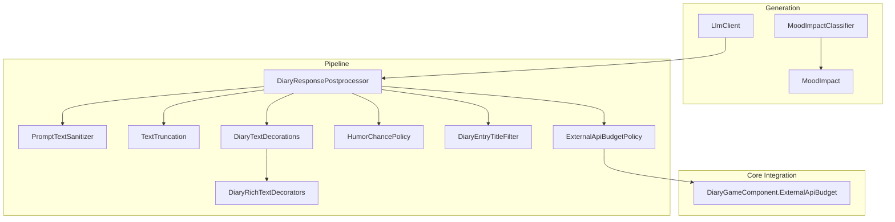
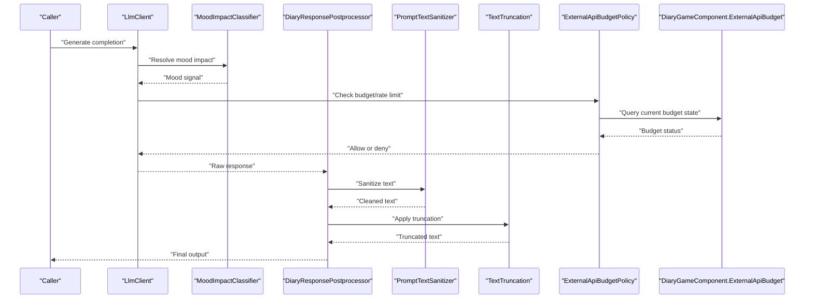
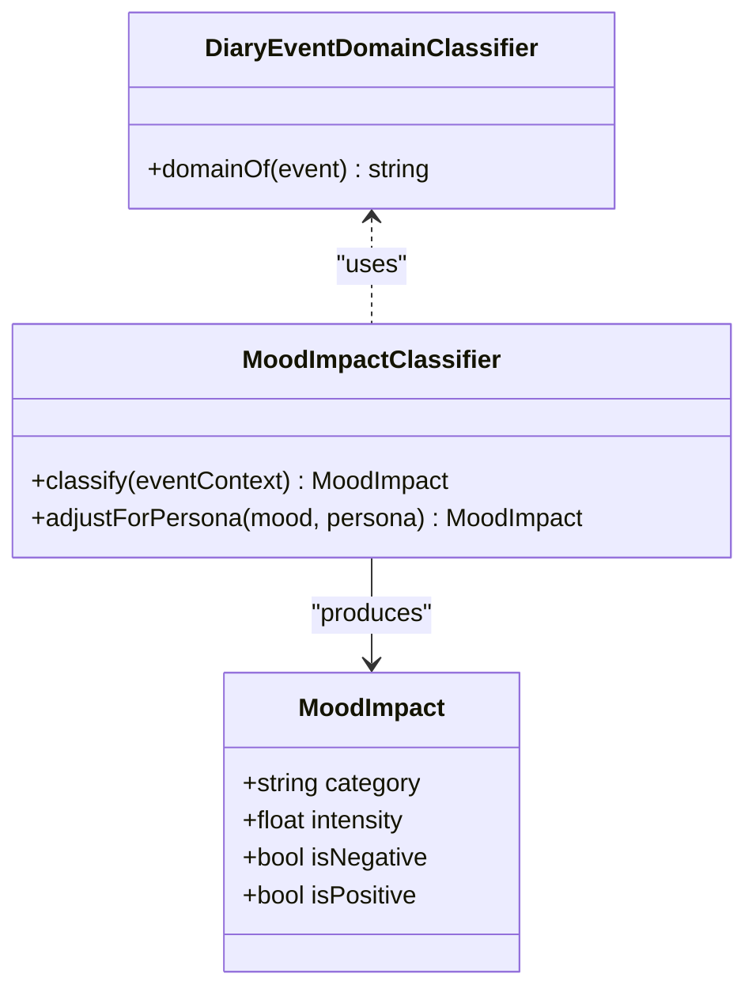
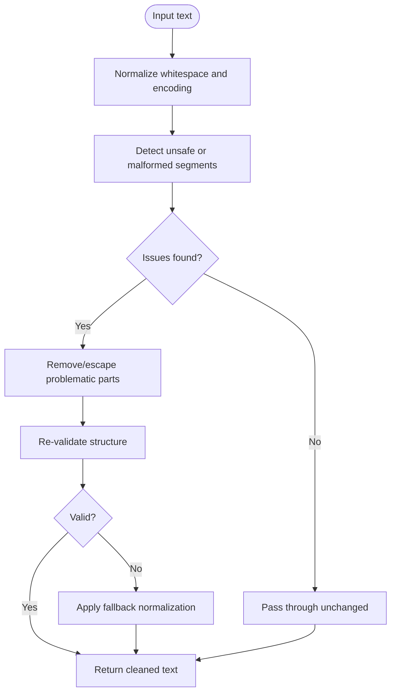
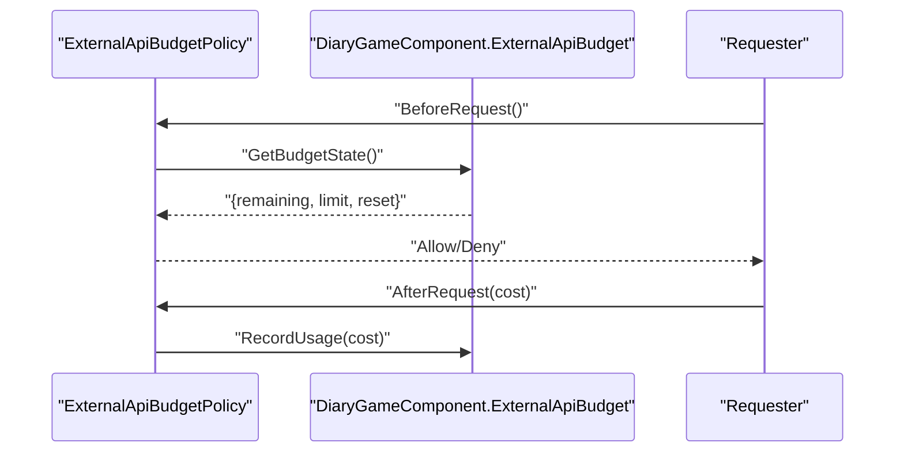
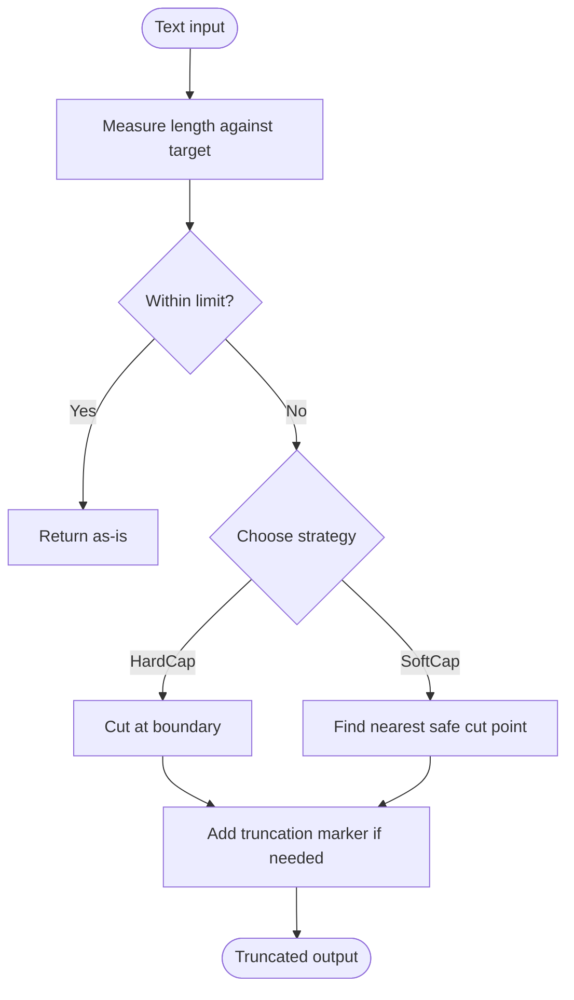
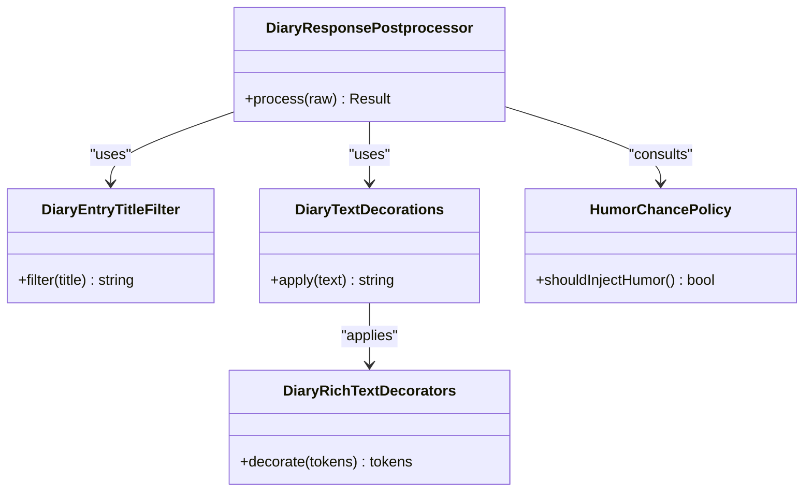
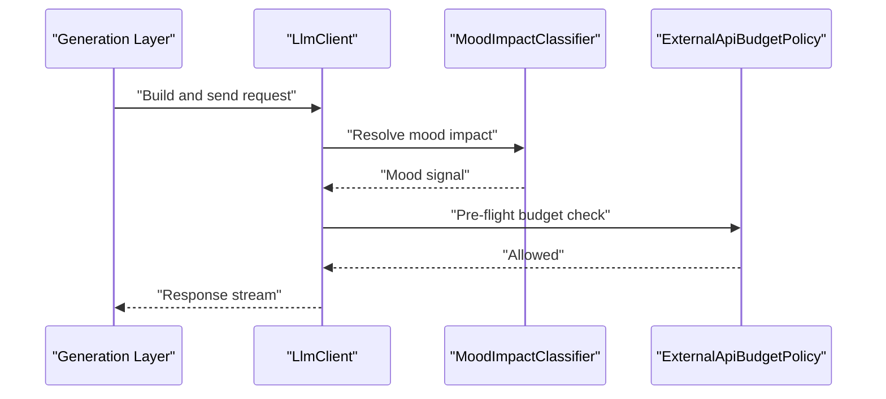
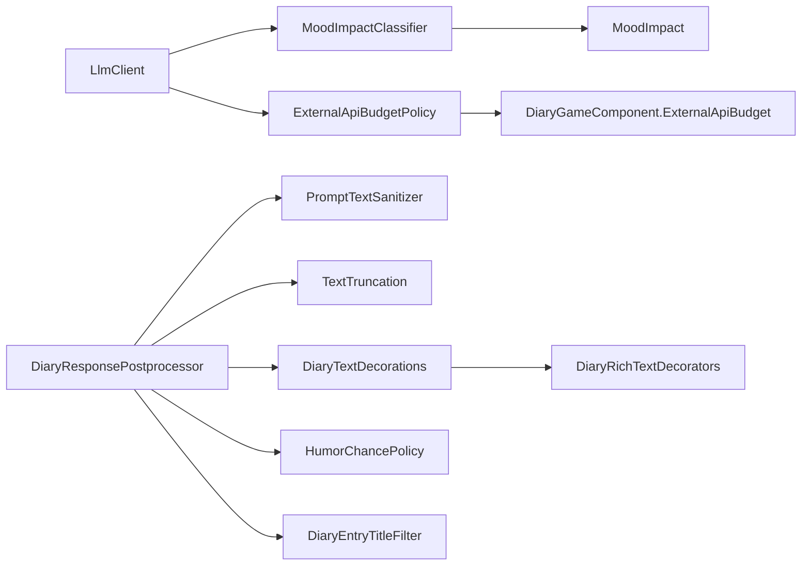

# Quality Control Mechanisms

## Table of Contents
1. [Introduction](#introduction)
2. [Project Structure](#project-structure)
3. [Core Components](#core-components)
4. [Architecture Overview](#architecture-overview)
5. [Detailed Component Analysis](#detailed-component-analysis)
6. [Dependency Analysis](#dependency-analysis)
7. [Performance Considerations](#performance-considerations)
8. [Troubleshooting Guide](#troubleshooting-guide)
9. [Conclusion](#conclusion)
10. [Appendices](#appendices)

## Introduction
This document explains the quality control mechanisms used by the AI generation engine to ensure appropriate emotional tone, safe and clean text output, controlled API usage costs, and consistent response size. It covers:
- Mood impact classification systems that influence tone and style
- Text sanitization processes that filter or adjust problematic content
- Budget policies that manage API usage costs and rate limits
- Text truncation strategies for managing response size
- Content filtering rules and quality metrics evaluation
- Examples for customizing filters, implementing new classifiers, and tuning budget constraints

## Project Structure
Quality control spans several layers:
- Generation layer: mood classification and LLM client orchestration
- Pipeline layer: sanitization, truncation, postprocessing, and policy enforcement
- Core integration: budget enforcement and cross-cutting controls

**Diagram sources**
- [MoodImpact.cs](../../../../Source/Generation/MoodImpact.cs)
- [MoodImpactClassifier.cs](../../../../Source/Generation/MoodImpactClassifier.cs)
- [LlmClient.cs](../../../../Source/Generation/LlmClient.cs)
- [PromptTextSanitizer.cs](../../../../Source/Pipeline/PromptTextSanitizer.cs)
- [TextTruncation.cs](../../../../Source/Pipeline/TextTruncation.cs)
- [DiaryResponsePostprocessor.cs](../../../../Source/Pipeline/DiaryResponsePostprocessor.cs)
- [ExternalApiBudgetPolicy.cs](../../../../Source/Pipeline/ExternalApiBudgetPolicy.cs)
- [DiaryGameComponent.ExternalApiBudget.cs](../../../../Source/Core/DiaryGameComponent.ExternalApiBudget.cs)
- [HumorChancePolicy.cs](../../../../Source/Pipeline/HumorChancePolicy.cs)
- [DiaryEntryTitleFilter.cs](../../../../Source/Pipeline/DiaryEntryTitleFilter.cs)
- [DiaryTextDecorations.cs](../../../../Source/Pipeline/DiaryTextDecorations.cs)
- [DiaryRichTextDecorators.cs](../../../../Source/Pipeline/DiaryRichTextDecorators.cs)

**Section sources**
- [MoodImpact.cs](../../../../Source/Generation/MoodImpact.cs)
- [MoodImpactClassifier.cs](../../../../Source/Generation/MoodImpactClassifier.cs)
- [PromptTextSanitizer.cs](../../../../Source/Pipeline/PromptTextSanitizer.cs)
- [ExternalApiBudgetPolicy.cs](../../../../Source/Pipeline/ExternalApiBudgetPolicy.cs)
- [DiaryGameComponent.ExternalApiBudget.cs](../../../../Source/Core/DiaryGameComponent.ExternalApiBudget.cs)
- [TextTruncation.cs](../../../../Source/Pipeline/TextTruncation.cs)
- [LlmClient.cs](../../../../Source/Generation/LlmClient.cs)
- [DiaryResponsePostprocessor.cs](../../../../Source/Pipeline/DiaryResponsePostprocessor.cs)
- [DiaryPipelineContracts.cs](../../../../Source/Pipeline/DiaryPipelineContracts.cs)
- [DiaryEventDomainClassifier.cs](../../../../Source/Pipeline/DiaryEventDomainClassifier.cs)
- [HumorChancePolicy.cs](../../../../Source/Pipeline/HumorChancePolicy.cs)
- [DiaryEntryTitleFilter.cs](../../../../Source/Pipeline/DiaryEntryTitleFilter.cs)
- [DiaryTextDecorations.cs](../../../../Source/Pipeline/DiaryTextDecorations.cs)
- [DiaryRichTextDecorators.cs](../../../../Source/Pipeline/DiaryRichTextDecorators.cs)

## Core Components
- Mood impact classification: Determines emotional tone signals from events and context to guide generation style and phrasing.
- Text sanitization: Cleans and normalizes generated text to remove unsafe or malformed content.
- Budget policy: Enforces cost and rate-limit constraints on external API calls.
- Text truncation: Ensures responses fit within size constraints without breaking formatting.
- Response postprocessing: Applies final adjustments, decorations, and filters before rendering.

Key responsibilities:
- Maintain consistency between event mood and narrative tone
- Prevent inappropriate or broken text from reaching the player
- Keep API usage within configured budgets and rate limits
- Preserve readability while enforcing length constraints

**Section sources**
- [MoodImpact.cs](../../../../Source/Generation/MoodImpact.cs)
- [MoodImpactClassifier.cs](../../../../Source/Generation/MoodImpactClassifier.cs)
- [PromptTextSanitizer.cs](../../../../Source/Pipeline/PromptTextSanitizer.cs)
- [ExternalApiBudgetPolicy.cs](../../../../Source/Pipeline/ExternalApiBudgetPolicy.cs)
- [DiaryGameComponent.ExternalApiBudget.cs](../../../../Source/Core/DiaryGameComponent.ExternalApiBudget.cs)
- [TextTruncation.cs](../../../../Source/Pipeline/TextTruncation.cs)
- [DiaryResponsePostprocessor.cs](../../../../Source/Pipeline/DiaryResponsePostprocessor.cs)

## Architecture Overview
The pipeline orchestrates generation and quality checks across multiple stages. The following sequence shows a typical flow from request to final output with quality gates.

**Diagram sources**
- [LlmClient.cs](../../../../Source/Generation/LlmClient.cs)
- [MoodImpactClassifier.cs](../../../../Source/Generation/MoodImpactClassifier.cs)
- [DiaryResponsePostprocessor.cs](../../../../Source/Pipeline/DiaryResponsePostprocessor.cs)
- [PromptTextSanitizer.cs](../../../../Source/Pipeline/PromptTextSanitizer.cs)
- [TextTruncation.cs](../../../../Source/Pipeline/TextTruncation.cs)
- [ExternalApiBudgetPolicy.cs](../../../../Source/Pipeline/ExternalApiBudgetPolicy.cs)
- [DiaryGameComponent.ExternalApiBudget.cs](../../../../Source/Core/DiaryGameComponent.ExternalApiBudget.cs)

## Detailed Component Analysis

### Mood Impact Classification System
Purpose:
- Classify the emotional impact of events and context to steer generation tone and vocabulary.
- Provide structured signals consumed by prompt builders and classifiers.

Key elements:
- Mood impact model representing discrete emotional categories and intensities
- Classifier that maps game events and context into mood signals
- Optional domain classifier to route prompts based on event type

**Diagram sources**
- [MoodImpact.cs](../../../../Source/Generation/MoodImpact.cs)
- [MoodImpactClassifier.cs](../../../../Source/Generation/MoodImpactClassifier.cs)
- [DiaryEventDomainClassifier.cs](../../../../Source/Pipeline/DiaryEventDomainClassifier.cs)

Implementation notes:
- Use domain classification to tailor mood heuristics per event type
- Combine persona traits with base mood to refine tone
- Expose clear interfaces for adding new classifiers or expanding categories

Customization examples:
- Add a new mood category by extending the model and updating the classifier mapping
- Introduce a persona-aware modifier to shift intensity based on character traits
- Register additional domain-specific rules in the domain classifier

**Section sources**
- [MoodImpact.cs](../../../../Source/Generation/MoodImpact.cs)
- [MoodImpactClassifier.cs](../../../../Source/Generation/MoodImpactClassifier.cs)
- [DiaryEventDomainClassifier.cs](../../../../Source/Pipeline/DiaryEventDomainClassifier.cs)

### Text Sanitization Process
Purpose:
- Remove or normalize problematic content such as unsafe characters, malformed markup, or disallowed patterns.
- Ensure outputs are safe and readable across UI surfaces.

Typical steps:
- Normalize whitespace and line breaks
- Strip or escape dangerous sequences
- Validate structural integrity (e.g., balanced tags if applicable)
- Apply language-appropriate transformations

**Diagram sources**
- [PromptTextSanitizer.cs](../../../../Source/Pipeline/PromptTextSanitizer.cs)

Customization examples:
- Extend detection rules for new disallowed patterns
- Implement locale-specific normalization
- Add logging hooks for auditability of sanitization actions

**Section sources**
- [PromptTextSanitizer.cs](../../../../Source/Pipeline/PromptTextSanitizer.cs)

### Budget Policies for API Usage Costs and Rate Limits
Purpose:
- Enforce per-request and aggregate budget constraints to control costs and prevent throttling.
- Coordinate with core budget component to track usage and enforce limits.

Key behaviors:
- Check remaining budget before making requests
- Respect rate limits and backoff strategies
- Record usage metrics for monitoring and reporting

**Diagram sources**
- [ExternalApiBudgetPolicy.cs](../../../../Source/Pipeline/ExternalApiBudgetPolicy.cs)
- [DiaryGameComponent.ExternalApiBudget.cs](../../../../Source/Core/DiaryGameComponent.ExternalApiBudget.cs)

Tuning examples:
- Adjust per-call cost weights for different models or endpoints
- Configure global caps and per-pawn quotas
- Enable stricter limits in development vs. production deployments

**Section sources**
- [ExternalApiBudgetPolicy.cs](../../../../Source/Pipeline/ExternalApiBudgetPolicy.cs)
- [DiaryGameComponent.ExternalApiBudget.cs](../../../../Source/Core/DiaryGameComponent.ExternalApiBudget.cs)

### Text Truncation Strategies
Purpose:
- Ensure responses fit within display or storage constraints while preserving readability and formatting.

Common strategies:
- Hard cap at character or token boundaries
- Soft cap with graceful paragraph-level cuts
- Preserve semantic units (sentences, paragraphs) when possible
- Append ellipsis or summary markers when truncated

**Diagram sources**
- [TextTruncation.cs](../../../../Source/Pipeline/TextTruncation.cs)

Tuning examples:
- Set different targets for titles vs. body text
- Configure truncation markers and fallbacks
- Integrate with rich text decorators to preserve styling

**Section sources**
- [TextTruncation.cs](../../../../Source/Pipeline/TextTruncation.cs)

### Response Postprocessing and Decorations
Purpose:
- Finalize outputs by applying decorations, title filtering, humor cues, and other stylistic adjustments.

Key components:
- Postprocessor orchestrating decoration and filtering passes
- Title filter ensuring concise and relevant entry titles
- Rich text decorators enhancing presentation without altering semantics
- Humor chance policy injecting light-hearted variations where appropriate

**Diagram sources**
- [DiaryResponsePostprocessor.cs](../../../../Source/Pipeline/DiaryResponsePostprocessor.cs)
- [DiaryEntryTitleFilter.cs](../../../../Source/Pipeline/DiaryEntryTitleFilter.cs)
- [DiaryTextDecorations.cs](../../../../Source/Pipeline/DiaryTextDecorations.cs)
- [DiaryRichTextDecorators.cs](../../../../Source/Pipeline/DiaryRichTextDecorators.cs)
- [HumorChancePolicy.cs](../../../../Source/Pipeline/HumorChancePolicy.cs)

Customization examples:
- Add new decoration passes for metadata or annotations
- Customize humor injection thresholds per persona or context
- Extend title filtering rules for domain-specific brevity

**Section sources**
- [DiaryResponsePostprocessor.cs](../../../../Source/Pipeline/DiaryResponsePostprocessor.cs)
- [DiaryEntryTitleFilter.cs](../../../../Source/Pipeline/DiaryEntryTitleFilter.cs)
- [DiaryTextDecorations.cs](../../../../Source/Pipeline/DiaryTextDecorations.cs)
- [DiaryRichTextDecorators.cs](../../../../Source/Pipeline/DiaryRichTextDecorators.cs)
- [HumorChancePolicy.cs](../../../../Source/Pipeline/HumorChancePolicy.cs)

### LLM Client Orchestration
Purpose:
- Manage communication with external language models, integrating mood signals and budget checks.

Responsibilities:
- Build requests with contextual information and mood guidance
- Enforce budget constraints before sending requests
- Handle retries and error propagation consistently

**Diagram sources**
- [LlmClient.cs](../../../../Source/Generation/LlmClient.cs)
- [MoodImpactClassifier.cs](../../../../Source/Generation/MoodImpactClassifier.cs)
- [ExternalApiBudgetPolicy.cs](../../../../Source/Pipeline/ExternalApiBudgetPolicy.cs)

**Section sources**
- [LlmClient.cs](../../../../Source/Generation/LlmClient.cs)

## Dependency Analysis
Quality control components interact through well-defined contracts and policies. The diagram below highlights key dependencies and their roles.

**Diagram sources**
- [MoodImpactClassifier.cs](../../../../Source/Generation/MoodImpactClassifier.cs)
- [MoodImpact.cs](../../../../Source/Generation/MoodImpact.cs)
- [LlmClient.cs](../../../../Source/Generation/LlmClient.cs)
- [ExternalApiBudgetPolicy.cs](../../../../Source/Pipeline/ExternalApiBudgetPolicy.cs)
- [DiaryGameComponent.ExternalApiBudget.cs](../../../../Source/Core/DiaryGameComponent.ExternalApiBudget.cs)
- [DiaryResponsePostprocessor.cs](../../../../Source/Pipeline/DiaryResponsePostprocessor.cs)
- [PromptTextSanitizer.cs](../../../../Source/Pipeline/PromptTextSanitizer.cs)
- [TextTruncation.cs](../../../../Source/Pipeline/TextTruncation.cs)
- [DiaryTextDecorations.cs](../../../../Source/Pipeline/DiaryTextDecorations.cs)
- [DiaryRichTextDecorators.cs](../../../../Source/Pipeline/DiaryRichTextDecorators.cs)
- [HumorChancePolicy.cs](../../../../Source/Pipeline/HumorChancePolicy.cs)
- [DiaryEntryTitleFilter.cs](../../../../Source/Pipeline/DiaryEntryTitleFilter.cs)

**Section sources**
- [DiaryPipelineContracts.cs](../../../../Source/Pipeline/DiaryPipelineContracts.cs)

## Performance Considerations
- Prefer efficient sanitization rules to avoid expensive regex operations on large texts
- Cache mood impact results for repeated contexts where feasible
- Use soft truncation to minimize re-processing after hard cuts
- Batch budget checks and record usage in aggregates to reduce overhead
- Limit decoration passes to necessary ones; defer heavy formatting until render time

[No sources needed since this section provides general guidance]

## Troubleshooting Guide
Common issues and resolutions:
- Over-sanitization removing valid content: Review sanitizer rules and add exceptions for known good patterns
- Frequent truncation: Adjust truncation targets and strategy selection; consider increasing soft cap thresholds
- Budget denials during peak usage: Tune per-call cost weights and global caps; implement backoff and retry logic
- Inconsistent tone: Verify mood classifier mappings and persona modifiers; add domain-specific rules

Diagnostic tips:
- Inspect postprocessing logs to identify which pass altered output
- Track budget state transitions around denied requests
- Compare raw vs. sanitized vs. truncated outputs to isolate changes

**Section sources**
- [PromptTextSanitizer.cs](../../../../Source/Pipeline/PromptTextSanitizer.cs)
- [TextTruncation.cs](../../../../Source/Pipeline/TextTruncation.cs)
- [ExternalApiBudgetPolicy.cs](../../../../Source/Pipeline/ExternalApiBudgetPolicy.cs)
- [DiaryResponsePostprocessor.cs](../../../../Source/Pipeline/DiaryResponsePostprocessor.cs)

## Conclusion
The quality control system integrates mood classification, text sanitization, budget enforcement, truncation, and postprocessing to deliver safe, coherent, and cost-effective AI-generated content. By leveraging modular components and clear extension points, teams can customize filters, introduce new classifiers, and tune budgets to match deployment needs while maintaining high-quality outputs.

[No sources needed since this section summarizes without analyzing specific files]

## Appendices

### Customizing Quality Filters
- Extend sanitizer rules to handle new disallowed patterns
- Add title filtering criteria for domain-specific brevity
- Introduce new decoration passes via the decorations registry

**Section sources**
- [PromptTextSanitizer.cs](../../../../Source/Pipeline/PromptTextSanitizer.cs)
- [DiaryEntryTitleFilter.cs](../../../../Source/Pipeline/DiaryEntryTitleFilter.cs)
- [DiaryTextDecorations.cs](../../../../Source/Pipeline/DiaryTextDecorations.cs)

### Implementing New Content Classifiers
- Define new mood categories and intensities in the mood model
- Update the classifier to map events and context to these categories
- Optionally integrate with domain classifier for specialized handling

**Section sources**
- [MoodImpact.cs](../../../../Source/Generation/MoodImpact.cs)
- [MoodImpactClassifier.cs](../../../../Source/Generation/MoodImpactClassifier.cs)
- [DiaryEventDomainClassifier.cs](../../../../Source/Pipeline/DiaryEventDomainClassifier.cs)

### Tuning Budget Constraints
- Adjust per-call cost weights for different models/endpoints
- Configure global and per-entity caps
- Enable stricter limits in non-production environments

**Section sources**
- [ExternalApiBudgetPolicy.cs](../../../../Source/Pipeline/ExternalApiBudgetPolicy.cs)
- [DiaryGameComponent.ExternalApiBudget.cs](../../../../Source/Core/DiaryGameComponent.ExternalApiBudget.cs)
