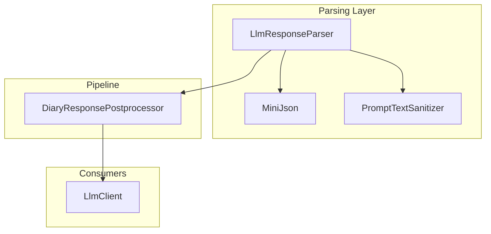
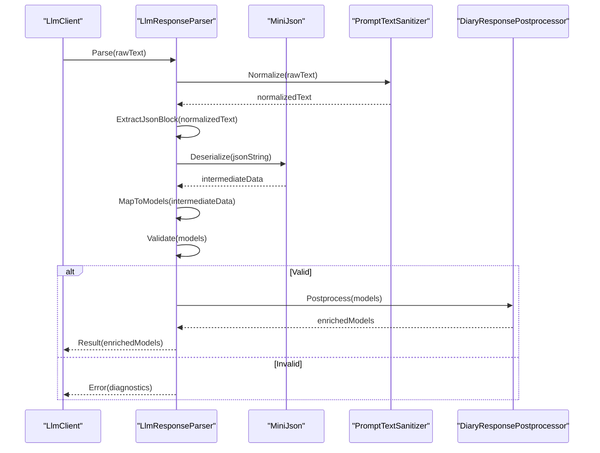
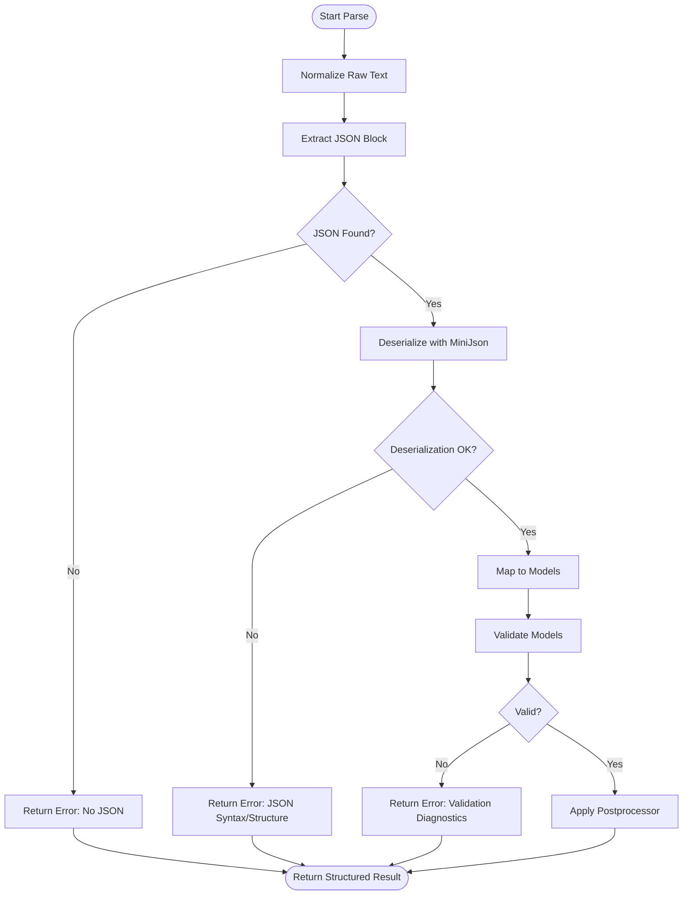
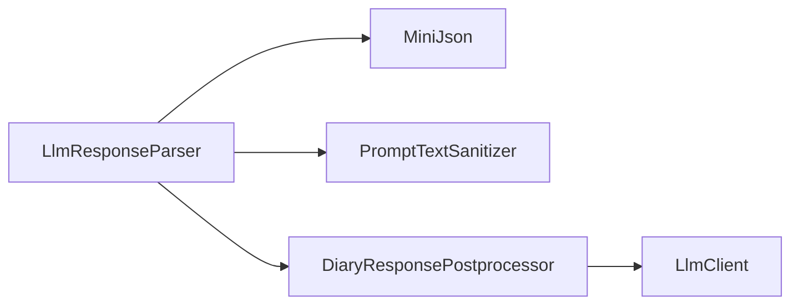

# LLM Response Parser

<cite>
**Referenced Files in This Document**
- [LlmResponseParser.cs](../../../../../Source/Generation/LlmResponseParser.cs)
- [LlmClient.cs](../../../../../Source/Generation/LlmClient.cs)
- [DiaryResponsePostprocessor.cs](../../../../../Source/Pipeline/DiaryResponsePostprocessor.cs)
- [PromptTextSanitizer.cs](../../../../../Source/Pipeline/PromptTextSanitizer.cs)
- [MiniJson.cs](../../../../../Source/Util/MiniJson.cs)
- [LlmResponseParserTests.cs](../../../../../tests/LlmResponseParserTests/Program.cs)
</cite>

## Table of Contents
1. [Introduction](#introduction)
2. [Project Structure](#project-structure)
3. [Core Components](#core-components)
4. [Architecture Overview](#architecture-overview)
5. [Detailed Component Analysis](#detailed-component-analysis)
6. [Dependency Analysis](#dependency-analysis)
7. [Performance Considerations](#performance-considerations)
8. [Troubleshooting Guide](#troubleshooting-guide)
9. [Conclusion](#conclusion)
10. [Appendices](#appendices)

## Introduction
This document explains the LLM response parser component that transforms raw AI-generated content into structured data objects. It covers JSON parsing, schema validation, error detection, and the end-to-end pipeline from raw text to validated models. It also provides guidance for customizing parsers for different response formats, implementing custom validation rules, handling malformed responses, and optimizing performance for large responses with attention to memory management.

## Project Structure
The LLM response parsing functionality is primarily implemented in a dedicated parser class and supported by utilities for JSON processing and postprocessing. The key files are:
- LlmResponseParser.cs: Core parsing logic, normalization, and validation orchestration
- MiniJson.cs: Lightweight JSON parsing utilities used by the parser
- DiaryResponsePostprocessor.cs: Post-parse transformations applied after successful parsing
- PromptTextSanitizer.cs: Pre-processing helpers that may be used before or during parsing
- LlmClient.cs: Integration point where parsed results are consumed
- LlmResponseParserTests.cs: Tests demonstrating expected behaviors and edge cases

**Diagram sources**
- [LlmResponseParser.cs](../../../../../Source/Generation/LlmResponseParser.cs)
- [MiniJson.cs](../../../../../Source/Util/MiniJson.cs)
- [PromptTextSanitizer.cs](../../../../../Source/Pipeline/PromptTextSanitizer.cs)
- [DiaryResponsePostprocessor.cs](../../../../../Source/Pipeline/DiaryResponsePostprocessor.cs)
- [LlmClient.cs](../../../../../Source/Generation/LlmClient.cs)

**Section sources**
- [LlmResponseParser.cs](../../../../../Source/Generation/LlmResponseParser.cs)
- [MiniJson.cs](../../../../../Source/Util/MiniJson.cs)
- [PromptTextSanitizer.cs](../../../../../Source/Pipeline/PromptTextSanitizer.cs)
- [DiaryResponsePostprocessor.cs](../../../../../Source/Pipeline/DiaryResponsePostprocessor.cs)
- [LlmClient.cs](../../../../../Source/Generation/LlmClient.cs)

## Core Components
- LlmResponseParser: Orchestrates the parsing pipeline, including normalization, JSON extraction, deserialization, and validation. It exposes methods to parse raw text into typed structures and to validate against schemas.
- MiniJson: Provides lightweight JSON parsing capabilities used by the parser to convert strings into intermediate representations suitable for mapping to domain models.
- DiaryResponsePostprocessor: Applies additional transformations to parsed results (e.g., formatting, enrichment) before they are returned to consumers.
- PromptTextSanitizer: Supplies sanitization utilities that can be used to clean or normalize input/output text as part of the pipeline.
- LlmClient: Consumes parsed results and integrates them into higher-level workflows.

Key responsibilities:
- Normalize raw LLM output (strip markdown fences, trim whitespace, handle encoding issues)
- Extract embedded JSON blocks when present
- Deserialize JSON into strongly-typed models
- Validate fields against constraints and business rules
- Produce detailed diagnostics on failures (position, field, reason)
- Provide hooks for custom validators and formatters

**Section sources**
- [LlmResponseParser.cs](../../../../../Source/Generation/LlmResponseParser.cs)
- [MiniJson.cs](../../../../../Source/Util/MiniJson.cs)
- [DiaryResponsePostprocessor.cs](../../../../../Source/Pipeline/DiaryResponsePostprocessor.cs)
- [PromptTextSanitizer.cs](../../../../../Source/Pipeline/PromptTextSanitizer.cs)

## Architecture Overview
The parsing pipeline proceeds through well-defined stages:
1. Input normalization: Clean raw text, remove extraneous markup, and ensure consistent encoding.
2. JSON extraction: Locate and extract JSON payloads from potentially noisy outputs.
3. Deserialization: Convert JSON into an intermediate representation using MiniJson.
4. Mapping: Map intermediate representation to domain models.
5. Validation: Apply schema and business rule checks; collect errors.
6. Postprocessing: Enrich or transform validated results via the postprocessor.
7. Output: Return structured data to consumers like LlmClient.

**Diagram sources**
- [LlmResponseParser.cs](../../../../../Source/Generation/LlmResponseParser.cs)
- [MiniJson.cs](../../../../../Source/Util/MiniJson.cs)
- [PromptTextSanitizer.cs](../../../../../Source/Pipeline/PromptTextSanitizer.cs)
- [DiaryResponsePostprocessor.cs](../../../../../Source/Pipeline/DiaryResponsePostprocessor.cs)
- [LlmClient.cs](../../../../../Source/Generation/LlmClient.cs)

## Detailed Component Analysis

### LlmResponseParser
Responsibilities:
- Orchestrate parsing stages
- Handle malformed inputs gracefully
- Provide rich diagnostics on validation failures
- Support pluggable validators and formatters

Processing flow:
- Normalize input text
- Extract JSON block if wrapped in markdown or surrounding prose
- Deserialize using MiniJson
- Map to target models
- Validate fields and relationships
- Postprocess valid results
- Return either structured result or diagnostic error

Error detection mechanisms:
- JSON syntax errors (with position hints)
- Missing required fields
- Type mismatches
- Constraint violations (ranges, patterns)
- Business rule failures

Customization points:
- Register custom validators for specific fields or models
- Provide custom JSON extraction strategies for non-standard formats
- Inject custom postprocessors for enrichment or formatting

**Diagram sources**
- [LlmResponseParser.cs](../../../../../Source/Generation/LlmResponseParser.cs)
- [MiniJson.cs](../../../../../Source/Util/MiniJson.cs)
- [DiaryResponsePostprocessor.cs](../../../../../Source/Pipeline/DiaryResponsePostprocessor.cs)

**Section sources**
- [LlmResponseParser.cs](../../../../../Source/Generation/LlmResponseParser.cs)

### MiniJson
Responsibilities:
- Provide lightweight JSON parsing without heavy dependencies
- Convert JSON strings into intermediate data structures suitable for mapping

Usage:
- Called by LlmResponseParser after extracting JSON blocks
- Returns intermediate representations that are then mapped to domain models

Considerations:
- Performance-sensitive path for large payloads
- Robustness against malformed JSON fragments

**Section sources**
- [MiniJson.cs](../../../../../Source/Util/MiniJson.cs)

### PromptTextSanitizer
Responsibilities:
- Clean and normalize text around JSON blocks
- Remove markdown fences, extra whitespace, and control characters
- Ensure consistent encoding and line endings

Usage:
- Invoked early in the parsing pipeline to prepare raw text for extraction and parsing

**Section sources**
- [PromptTextSanitizer.cs](../../../../../Source/Pipeline/PromptTextSanitizer.cs)

### DiaryResponsePostprocessor
Responsibilities:
- Apply post-parse transformations such as formatting, enrichment, or normalization
- Integrate with model-specific rules to finalize results

Usage:
- Applied only when validation succeeds
- Produces final output consumed by clients like LlmClient

**Section sources**
- [DiaryResponsePostprocessor.cs](../../../../../Source/Pipeline/DiaryResponsePostprocessor.cs)

### LlmClient
Responsibilities:
- Consume parsed results and integrate them into higher-level workflows
- Coordinate retries or fallbacks based on parsing outcomes

Integration:
- Receives either structured results or diagnostic errors from the parser
- May trigger re-parsing attempts or alternative strategies on failure

**Section sources**
- [LlmClient.cs](../../../../../Source/Generation/LlmClient.cs)

### Example Usage and Customization Patterns
- Customizing parsers for different response formats:
  - Implement a custom JSON extractor strategy to handle non-standard wrappers or multi-block outputs
  - Register format-specific validators to enforce unique constraints per provider
- Implementing custom validation rules:
  - Add field-level validators for range checks, pattern matching, and cross-field consistency
  - Use composite validators for complex business rules
- Handling malformed responses:
  - Detect and report precise error locations
  - Provide recovery strategies such as partial parsing or fallback templates
- Examples and test coverage:
  - See tests for expected behaviors and edge cases

**Section sources**
- [LlmResponseParserTests.cs](../../../../../tests/LlmResponseParserTests/Program.cs)

## Dependency Analysis
The parser depends on utilities for JSON processing and text sanitization, and it produces results consumed by higher-level components.

**Diagram sources**
- [LlmResponseParser.cs](../../../../../Source/Generation/LlmResponseParser.cs)
- [MiniJson.cs](../../../../../Source/Util/MiniJson.cs)
- [PromptTextSanitizer.cs](../../../../../Source/Pipeline/PromptTextSanitizer.cs)
- [DiaryResponsePostprocessor.cs](../../../../../Source/Pipeline/DiaryResponsePostprocessor.cs)
- [LlmClient.cs](../../../../../Source/Generation/LlmClient.cs)

**Section sources**
- [LlmResponseParser.cs](../../../../../Source/Generation/LlmResponseParser.cs)
- [MiniJson.cs](../../../../../Source/Util/MiniJson.cs)
- [PromptTextSanitizer.cs](../../../../../Source/Pipeline/PromptTextSanitizer.cs)
- [DiaryResponsePostprocessor.cs](../../../../../Source/Pipeline/DiaryResponsePostprocessor.cs)
- [LlmClient.cs](../../../../../Source/Generation/LlmClient.cs)

## Performance Considerations
- Large response processing:
  - Prefer streaming or chunked parsing where possible to reduce peak memory usage
  - Avoid unnecessary string copies; reuse buffers when feasible
  - Minimize allocations in hot paths (e.g., avoid repeated regex operations)
- Memory management:
  - Release intermediate representations promptly after mapping
  - Be cautious with large object graphs; consider lazy loading for nested structures
- Validation efficiency:
  - Short-circuit validation upon first critical error to avoid wasted work
  - Batch validations where appropriate to reduce overhead
- I/O considerations:
  - If reading from streams, ensure proper disposal and buffering strategies
- Observability:
  - Log parsing durations and sizes for monitoring and tuning

[No sources needed since this section provides general guidance]

## Troubleshooting Guide
Common issues and resolutions:
- Malformed JSON:
  - Check for missing braces, trailing commas, or invalid escapes
  - Use diagnostics to locate exact positions and correct the source or prompt
- Missing fields:
  - Verify required fields are present and correctly named
  - Adjust prompts to ensure providers include necessary keys
- Type mismatches:
  - Confirm types match expectations (strings vs numbers, arrays vs objects)
  - Update mappings or validators to coerce or reject incompatible values
- Business rule failures:
  - Review constraint definitions and adjust thresholds or patterns
  - Inspect cross-field dependencies and update validation logic accordingly
- Recovery strategies:
  - Implement retry with adjusted prompts
  - Fall back to default templates or cached results when parsing fails repeatedly

**Section sources**
- [LlmResponseParser.cs](../../../../../Source/Generation/LlmResponseParser.cs)
- [LlmResponseParserTests.cs](../../../../../tests/LlmResponseParserTests/Program.cs)

## Conclusion
The LLM response parser provides a robust, extensible pipeline for transforming raw AI outputs into validated, structured data. By combining normalization, careful JSON extraction, deserialization, validation, and postprocessing, it ensures reliability and clarity even with imperfect model outputs. Customization points allow adaptation to diverse response formats and business requirements, while performance and memory considerations help maintain responsiveness at scale.

[No sources needed since this section summarizes without analyzing specific files]

## Appendices

### Customization Checklist
- Define custom JSON extraction rules for non-standard formats
- Implement field-level and composite validators
- Add postprocessors for enrichment and formatting
- Integrate diagnostics reporting for improved debugging
- Test with representative samples and edge cases

[No sources needed since this section provides general guidance]
