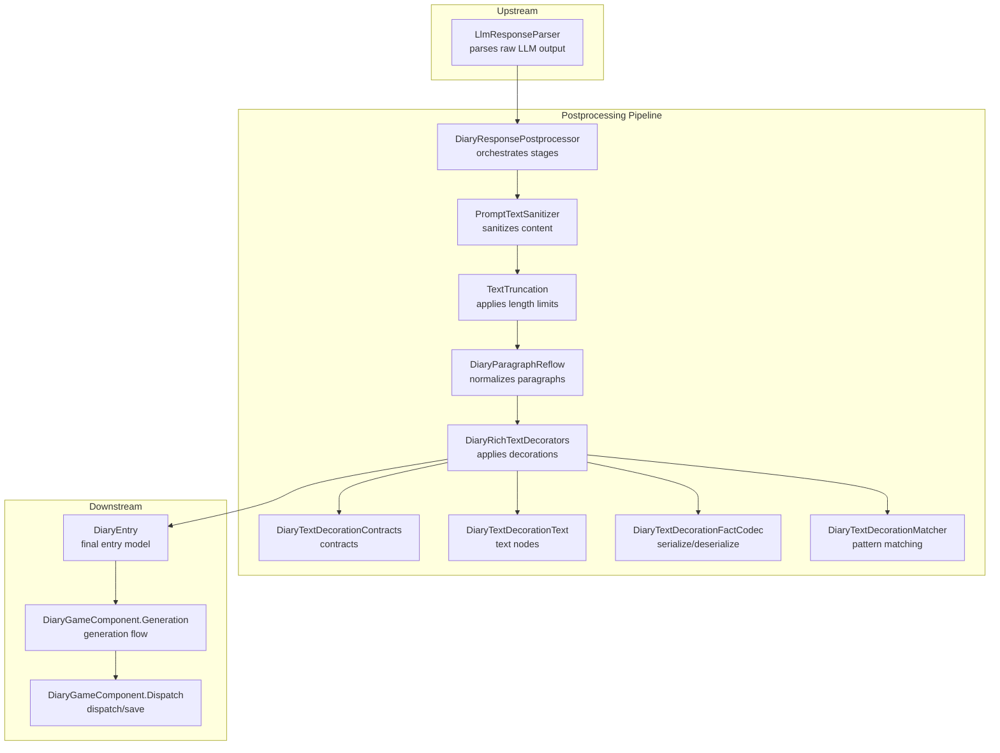
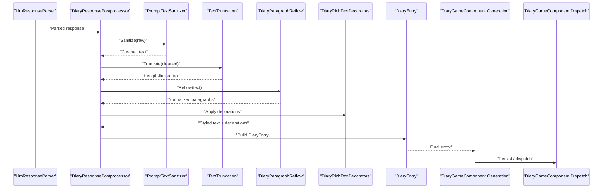
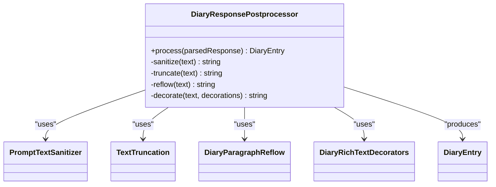
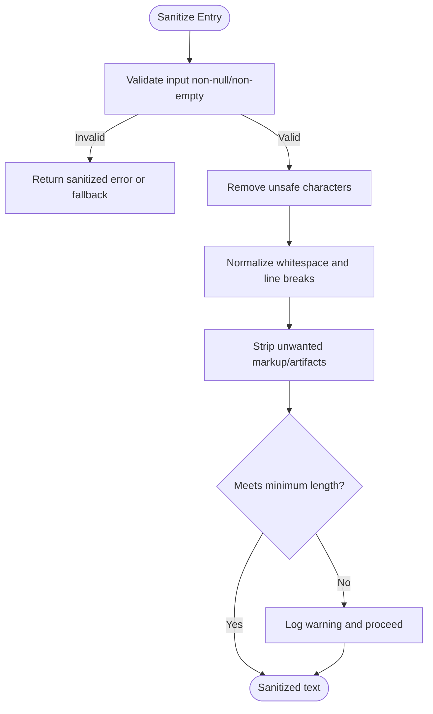
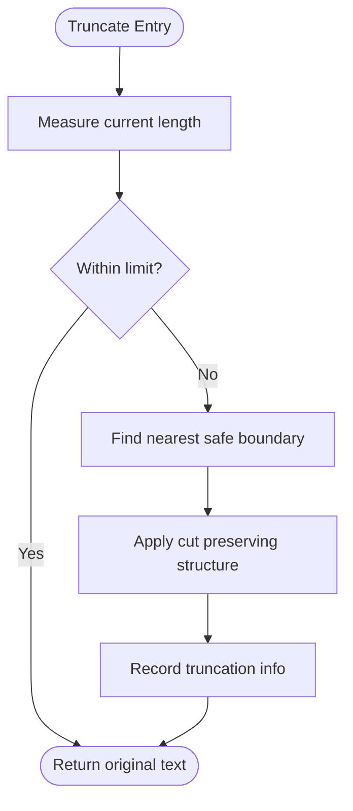
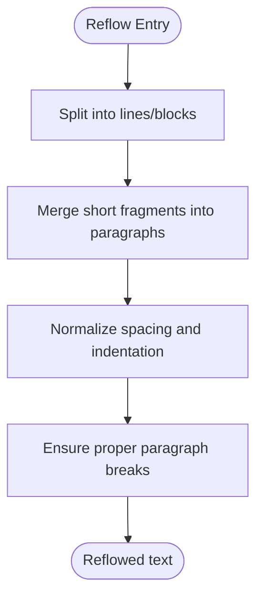
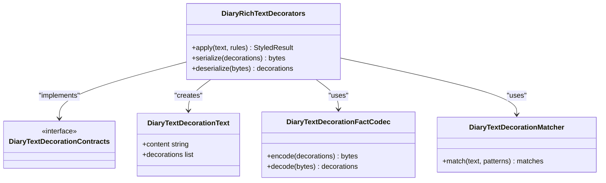
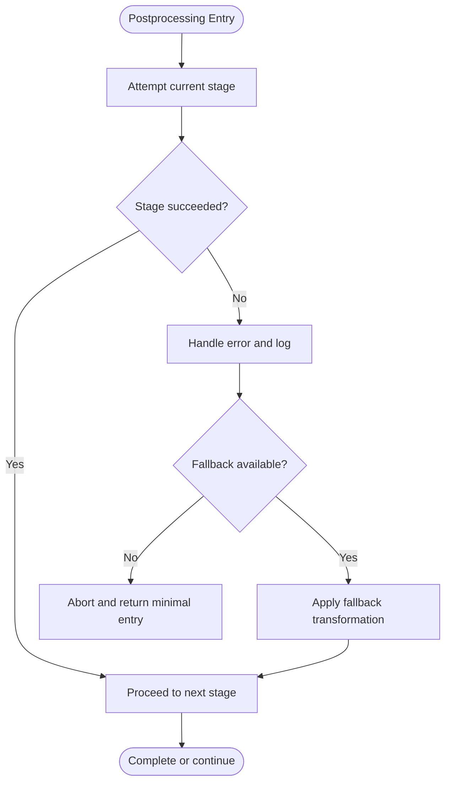
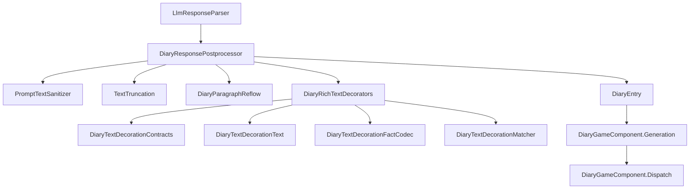

# Response Postprocessor

- [DiaryResponsePostprocessor.cs](../../../../../Source/Pipeline/DiaryResponsePostprocessor.cs)
- [PromptTextSanitizer.cs](../../../../../Source/Pipeline/PromptTextSanitizer.cs)
- [DiaryParagraphReflow.cs](../../../../../Source/Pipeline/DiaryParagraphReflow.cs)
- [DiaryRichTextDecorators.cs](../../../../../Source/Pipeline/DiaryRichTextDecorators.cs)
- [DiaryTextDecorationContracts.cs](../../../../../Source/Pipeline/DiaryTextDecorationContracts.cs)
- [DiaryTextDecorationText.cs](../../../../../Source/Pipeline/DiaryTextDecorationText.cs)
- [DiaryTextDecorationFactCodec.cs](../../../../../Source/Pipeline/DiaryTextDecorationFactCodec.cs)
- [DiaryTextDecorationMatcher.cs](../../../../../Source/Pipeline/DiaryTextDecorationMatcher.cs)
- [TextTruncation.cs](../../../../../Source/Pipeline/TextTruncation.cs)
- [LlmResponseParser.cs](../../../../../Source/Generation/LlmResponseParser.cs)
- [DiaryPipelineContracts.cs](../../../../../Source/Pipeline/DiaryPipelineContracts.cs)
- [DiaryEntry.cs](../../../../../Source/Models/DiaryEntry.cs)
- [DiaryGameComponent.Generation.cs](../../../../../Source/Core/DiaryGameComponent.Generation.cs)
- [DiaryGameComponent.Dispatch.cs](../../../../../Source/Core/DiaryGameComponent.Dispatch.cs)
## Table of Contents
1. [Introduction](#introduction)
2. [Project Structure](#project-structure)
3. [Core Components](#core-components)
4. [Architecture Overview](#architecture-overview)
5. [Detailed Component Analysis](#detailed-component-analysis)
6. [Dependency Analysis](#dependency-analysis)
7. [Performance Considerations](#performance-considerations)
8. [Troubleshooting Guide](#troubleshooting-guide)
9. [Conclusion](#conclusion)
10. [Appendices](#appendices)

## Introduction
This document explains the response postprocessing pipeline that transforms raw parsed LLM responses into final diary entries. It covers content sanitization, formatting application, and quality checks, and provides guidance for adding custom steps, implementing filters, and extending the transformation pipeline. It also addresses error handling and recovery strategies for failed transformations.

## Project Structure
The postprocessing pipeline is implemented under the Pipeline layer and integrates with generation and model components to produce polished DiaryEntry objects. Key files include:
- Orchestrator: DiaryResponsePostprocessor.cs
- Sanitization and cleanup: PromptTextSanitizer.cs, TextTruncation.cs
- Formatting and decoration: DiaryParagraphReflow.cs, DiaryRichTextDecorators.cs, text decoration contracts and utilities
- Contracts and models: DiaryPipelineContracts.cs, DiaryEntry.cs
- Integration points: LlmResponseParser.cs (upstream), DiaryGameComponent.Generation.cs and DiaryGameComponent.Dispatch.cs (downstream orchestration)

**Diagram sources**
- [DiaryResponsePostprocessor.cs](../../../../../Source/Pipeline/DiaryResponsePostprocessor.cs)
- [PromptTextSanitizer.cs](../../../../../Source/Pipeline/PromptTextSanitizer.cs)
- [TextTruncation.cs](../../../../../Source/Pipeline/TextTruncation.cs)
- [DiaryParagraphReflow.cs](../../../../../Source/Pipeline/DiaryParagraphReflow.cs)
- [DiaryRichTextDecorators.cs](../../../../../Source/Pipeline/DiaryRichTextDecorators.cs)
- [DiaryTextDecorationContracts.cs](../../../../../Source/Pipeline/DiaryTextDecorationContracts.cs)
- [DiaryTextDecorationText.cs](../../../../../Source/Pipeline/DiaryTextDecorationText.cs)
- [DiaryTextDecorationFactCodec.cs](../../../../../Source/Pipeline/DiaryTextDecorationFactCodec.cs)
- [DiaryTextDecorationMatcher.cs](../../../../../Source/Pipeline/DiaryTextDecorationMatcher.cs)
- [LlmResponseParser.cs](../../../../../Source/Generation/LlmResponseParser.cs)
- [DiaryEntry.cs](../../../../../Source/Models/DiaryEntry.cs)
- [DiaryGameComponent.Generation.cs](../../../../../Source/Core/DiaryGameComponent.Generation.cs)
- [DiaryGameComponent.Dispatch.cs](../../../../../Source/Core/DiaryGameComponent.Dispatch.cs)

**Section sources**
- [DiaryResponsePostprocessor.cs](../../../../../Source/Pipeline/DiaryResponsePostprocessor.cs)
- [DiaryPipelineContracts.cs](../../../../../Source/Pipeline/DiaryPipelineContracts.cs)
- [DiaryEntry.cs](../../../../../Source/Models/DiaryEntry.cs)

## Core Components
- DiaryResponsePostprocessor: Central orchestrator that composes and executes the postprocessing stages on a parsed response. It applies sanitization, truncation, paragraph reflow, and rich-text decoration, then produces a finalized entry.
- PromptTextSanitizer: Cleans raw text by removing unwanted artifacts, normalizing whitespace, and ensuring safe content before further processing.
- TextTruncation: Enforces maximum lengths and ensures the result fits within display or storage constraints without breaking words or structure.
- DiaryParagraphReflow: Normalizes paragraph breaks, merges short fragments, and improves readability.
- DiaryRichTextDecorators: Applies structured decorations (e.g., highlights, links, metadata) using a contract-driven system.
- Text Decoration System: Includes contracts, text node types, serialization codec, and pattern matcher to declaratively define and apply decorations.

These components work together to transform a raw parsed response into a high-quality, styled DiaryEntry ready for persistence and UI rendering.

**Section sources**
- [DiaryResponsePostprocessor.cs](../../../../../Source/Pipeline/DiaryResponsePostprocessor.cs)
- [PromptTextSanitizer.cs](../../../../../Source/Pipeline/PromptTextSanitizer.cs)
- [TextTruncation.cs](../../../../../Source/Pipeline/TextTruncation.cs)
- [DiaryParagraphReflow.cs](../../../../../Source/Pipeline/DiaryParagraphReflow.cs)
- [DiaryRichTextDecorators.cs](../../../../../Source/Pipeline/DiaryRichTextDecorators.cs)
- [DiaryTextDecorationContracts.cs](../../../../../Source/Pipeline/DiaryTextDecorationContracts.cs)
- [DiaryTextDecorationText.cs](../../../../../Source/Pipeline/DiaryTextDecorationText.cs)
- [DiaryTextDecorationFactCodec.cs](../../../../../Source/Pipeline/DiaryTextDecorationFactCodec.cs)
- [DiaryTextDecorationMatcher.cs](../../../../../Source/Pipeline/DiaryTextDecorationMatcher.cs)

## Architecture Overview
The pipeline follows a staged transformation approach:
- Input: Parsed response from LlmResponseParser
- Stages: Sanitize → Truncate → Reflow → Decorate
- Output: Finalized DiaryEntry with decorations and normalized text

**Diagram sources**
- [LlmResponseParser.cs](../../../../../Source/Generation/LlmResponseParser.cs)
- [DiaryResponsePostprocessor.cs](../../../../../Source/Pipeline/DiaryResponsePostprocessor.cs)
- [PromptTextSanitizer.cs](../../../../../Source/Pipeline/PromptTextSanitizer.cs)
- [TextTruncation.cs](../../../../../Source/Pipeline/TextTruncation.cs)
- [DiaryParagraphReflow.cs](../../../../../Source/Pipeline/DiaryParagraphReflow.cs)
- [DiaryRichTextDecorators.cs](../../../../../Source/Pipeline/DiaryRichTextDecorators.cs)
- [DiaryEntry.cs](../../../../../Source/Models/DiaryEntry.cs)
- [DiaryGameComponent.Generation.cs](../../../../../Source/Core/DiaryGameComponent.Generation.cs)
- [DiaryGameComponent.Dispatch.cs](../../../../../Source/Core/DiaryGameComponent.Dispatch.cs)

## Detailed Component Analysis

### Orchestrator: DiaryResponsePostprocessor
Responsibilities:
- Compose and execute the postprocessing stages in order
- Manage intermediate state and pass results between stages
- Construct the final DiaryEntry with decorations applied
- Coordinate error handling and fallbacks across stages

Key behaviors:
- Invokes sanitization first to ensure safe input
- Applies truncation to meet size constraints
- Reflows paragraphs for consistent formatting
- Applies rich-text decorations via the decorator system
- Produces a finalized entry for downstream consumption

**Diagram sources**
- [DiaryResponsePostprocessor.cs](../../../../../Source/Pipeline/DiaryResponsePostprocessor.cs)
- [PromptTextSanitizer.cs](../../../../../Source/Pipeline/PromptTextSanitizer.cs)
- [TextTruncation.cs](../../../../../Source/Pipeline/TextTruncation.cs)
- [DiaryParagraphReflow.cs](../../../../../Source/Pipeline/DiaryParagraphReflow.cs)
- [DiaryRichTextDecorators.cs](../../../../../Source/Pipeline/DiaryRichTextDecorators.cs)
- [DiaryEntry.cs](../../../../../Source/Models/DiaryEntry.cs)

**Section sources**
- [DiaryResponsePostprocessor.cs](../../../../../Source/Pipeline/DiaryResponsePostprocessor.cs)

### Content Sanitization: PromptTextSanitizer
Responsibilities:
- Remove unsafe or extraneous characters
- Normalize whitespace and line endings
- Strip markdown or markup artifacts not intended for final display
- Ensure encoding safety and consistency

Quality checks:
- Reject empty or null inputs
- Validate minimum length thresholds where applicable
- Log warnings for significant content loss due to sanitization

**Diagram sources**
- [PromptTextSanitizer.cs](../../../../../Source/Pipeline/PromptTextSanitizer.cs)

**Section sources**
- [PromptTextSanitizer.cs](../../../../../Source/Pipeline/PromptTextSanitizer.cs)

### Length Control: TextTruncation
Responsibilities:
- Enforce maximum character or token counts
- Preserve word boundaries and paragraph integrity
- Provide graceful degradation when content exceeds limits

Strategies:
- Prefer sentence-aware truncation over hard cuts
- Maintain decoration compatibility by avoiding mid-decoration splits
- Record truncation metadata for diagnostics

**Diagram sources**
- [TextTruncation.cs](../../../../../Source/Pipeline/TextTruncation.cs)

**Section sources**
- [TextTruncation.cs](../../../../../Source/Pipeline/TextTruncation.cs)

### Formatting: DiaryParagraphReflow
Responsibilities:
- Merge fragmented lines into coherent paragraphs
- Normalize spacing and indentation
- Ensure consistent paragraph breaks for readability

Rules:
- Avoid splitting sentences across paragraphs
- Collapse excessive blank lines
- Respect explicit paragraph markers if present

**Diagram sources**
- [DiaryParagraphReflow.cs](../../../../../Source/Pipeline/DiaryParagraphReflow.cs)

**Section sources**
- [DiaryParagraphReflow.cs](../../../../../Source/Pipeline/DiaryParagraphReflow.cs)

### Rich-Text Decoration: DiaryRichTextDecorators and Contracts
Responsibilities:
- Apply structured decorations (highlights, links, metadata) to text
- Use contracts to define decoration types and behavior
- Serialize/deserialize decorations for persistence
- Match patterns to locate decoration targets

Components:
- DiaryTextDecorationContracts: Defines decoration interfaces and data structures
- DiaryTextDecorationText: Represents text nodes with associated decorations
- DiaryTextDecorationFactCodec: Encodes/decodes decorations for storage
- DiaryTextDecorationMatcher: Finds matches based on rules/patterns

**Diagram sources**
- [DiaryRichTextDecorators.cs](../../../../../Source/Pipeline/DiaryRichTextDecorators.cs)
- [DiaryTextDecorationContracts.cs](../../../../../Source/Pipeline/DiaryTextDecorationContracts.cs)
- [DiaryTextDecorationText.cs](../../../../../Source/Pipeline/DiaryTextDecorationText.cs)
- [DiaryTextDecorationFactCodec.cs](../../../../../Source/Pipeline/DiaryTextDecorationFactCodec.cs)
- [DiaryTextDecorationMatcher.cs](../../../../../Source/Pipeline/DiaryTextDecorationMatcher.cs)

**Section sources**
- [DiaryRichTextDecorators.cs](../../../../../Source/Pipeline/DiaryRichTextDecorators.cs)
- [DiaryTextDecorationContracts.cs](../../../../../Source/Pipeline/DiaryTextDecorationContracts.cs)
- [DiaryTextDecorationText.cs](../../../../../Source/Pipeline/DiaryTextDecorationText.cs)
- [DiaryTextDecorationFactCodec.cs](../../../../../Source/Pipeline/DiaryTextDecorationFactCodec.cs)
- [DiaryTextDecorationMatcher.cs](../../../../../Source/Pipeline/DiaryTextDecorationMatcher.cs)

### Extending the Pipeline: Adding Custom Steps and Filters
To add a custom postprocessing step:
- Implement a new stage component adhering to the pipeline contracts
- Integrate it into the orchestrator’s execution chain
- Optionally register filters or matchers for targeted transformations

Guidance:
- Keep each step focused and idempotent
- Ensure compatibility with subsequent stages (especially decoration serialization)
- Add logging and metrics for observability
- Provide configuration toggles for optional steps

Example extension points:
- Custom sanitizer logic for domain-specific content removal
- Additional truncation policies for different media types
- New decoration types and matchers for advanced styling

**Section sources**
- [DiaryResponsePostprocessor.cs](../../../../../Source/Pipeline/DiaryResponsePostprocessor.cs)
- [DiaryPipelineContracts.cs](../../../../../Source/Pipeline/DiaryPipelineContracts.cs)
- [DiaryTextDecorationContracts.cs](../../../../../Source/Pipeline/DiaryTextDecorationContracts.cs)

### Error Handling and Recovery Strategies
Common failure modes:
- Empty or malformed input after parsing
- Excessive content requiring aggressive truncation
- Decoration mismatch or serialization errors
- Unexpected exceptions during formatting

Recovery strategies:
- Fallback to sanitized truncated text when decoration fails
- Graceful degradation by skipping optional stages
- Logging detailed context for diagnostics
- Returning a minimal valid DiaryEntry to preserve system stability

**Diagram sources**
- [DiaryResponsePostprocessor.cs](../../../../../Source/Pipeline/DiaryResponsePostprocessor.cs)

**Section sources**
- [DiaryResponsePostprocessor.cs](../../../../../Source/Pipeline/DiaryResponsePostprocessor.cs)

## Dependency Analysis
The postprocessing pipeline depends on upstream parsing and downstream generation/dispatch components. The following diagram shows key dependencies:

**Diagram sources**
- [LlmResponseParser.cs](../../../../../Source/Generation/LlmResponseParser.cs)
- [DiaryResponsePostprocessor.cs](../../../../../Source/Pipeline/DiaryResponsePostprocessor.cs)
- [PromptTextSanitizer.cs](../../../../../Source/Pipeline/PromptTextSanitizer.cs)
- [TextTruncation.cs](../../../../../Source/Pipeline/TextTruncation.cs)
- [DiaryParagraphReflow.cs](../../../../../Source/Pipeline/DiaryParagraphReflow.cs)
- [DiaryRichTextDecorators.cs](../../../../../Source/Pipeline/DiaryRichTextDecorators.cs)
- [DiaryTextDecorationContracts.cs](../../../../../Source/Pipeline/DiaryTextDecorationContracts.cs)
- [DiaryTextDecorationText.cs](../../../../../Source/Pipeline/DiaryTextDecorationText.cs)
- [DiaryTextDecorationFactCodec.cs](../../../../../Source/Pipeline/DiaryTextDecorationFactCodec.cs)
- [DiaryTextDecorationMatcher.cs](../../../../../Source/Pipeline/DiaryTextDecorationMatcher.cs)
- [DiaryEntry.cs](../../../../../Source/Models/DiaryEntry.cs)
- [DiaryGameComponent.Generation.cs](../../../../../Source/Core/DiaryGameComponent.Generation.cs)
- [DiaryGameComponent.Dispatch.cs](../../../../../Source/Core/DiaryGameComponent.Dispatch.cs)

**Section sources**
- [DiaryPipelineContracts.cs](../../../../../Source/Pipeline/DiaryPipelineContracts.cs)
- [DiaryEntry.cs](../../../../../Source/Models/DiaryEntry.cs)

## Performance Considerations
- Minimize allocations by reusing buffers where possible during sanitization and truncation
- Prefer streaming or incremental operations for large texts to reduce memory pressure
- Cache decoration patterns and compiled regexes to avoid repeated compilation
- Defer expensive decoration passes until necessary (e.g., only for visible entries)
- Profile truncation and reflow algorithms to ensure O(n) behavior relative to input size

[No sources needed since this section provides general guidance]

## Troubleshooting Guide
Symptoms and remedies:
- Entries appear truncated unexpectedly: Review truncation policy and boundary detection; adjust limits or refine safe-cut heuristics
- Formatting inconsistencies: Inspect paragraph reflow rules and normalization settings; verify explicit paragraph markers are preserved
- Missing decorations: Check decoration matcher patterns and serialization round-trip; validate codec compatibility
- Crashes or exceptions: Enable detailed logging around postprocessing stages; inspect error context and fallback paths

Diagnostic tips:
- Log intermediate outputs at each stage to pinpoint failures
- Validate input sizes and content characteristics before processing
- Test custom steps with edge cases (empty strings, very long texts, unusual characters)

**Section sources**
- [DiaryResponsePostprocessor.cs](../../../../../Source/Pipeline/DiaryResponsePostprocessor.cs)
- [TextTruncation.cs](../../../../../Source/Pipeline/TextTruncation.cs)
- [DiaryParagraphReflow.cs](../../../../../Source/Pipeline/DiaryParagraphReflow.cs)
- [DiaryRichTextDecorators.cs](../../../../../Source/Pipeline/DiaryRichTextDecorators.cs)

## Conclusion
The response postprocessing pipeline transforms raw parsed LLM outputs into polished, styled diary entries through a clear sequence of stages: sanitization, truncation, reflow, and decoration. Its modular design supports extensibility, allowing developers to add custom steps and filters while maintaining robust error handling and performance. By understanding the orchestrator and its components, you can confidently extend and tune the pipeline to meet evolving requirements.

[No sources needed since this section summarizes without analyzing specific files]

## Appendices

### API Surface and Contracts
- DiaryPipelineContracts defines the interfaces and data shapes used across the pipeline
- DiaryEntry represents the final model produced by the postprocessor

**Section sources**
- [DiaryPipelineContracts.cs](../../../../../Source/Pipeline/DiaryPipelineContracts.cs)
- [DiaryEntry.cs](../../../../../Source/Models/DiaryEntry.cs)

### Integration Points
- Upstream: LlmResponseParser provides parsed responses consumed by the postprocessor
- Downstream: DiaryGameComponent.Generation and DiaryGameComponent.Dispatch handle persistence and dispatch of finalized entries

**Section sources**
- [LlmResponseParser.cs](../../../../../Source/Generation/LlmResponseParser.cs)
- [DiaryGameComponent.Generation.cs](../../../../../Source/Core/DiaryGameComponent.Generation.cs)
- [DiaryGameComponent.Dispatch.cs](../../../../../Source/Core/DiaryGameComponent.Dispatch.cs)
