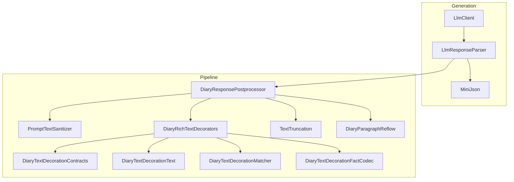
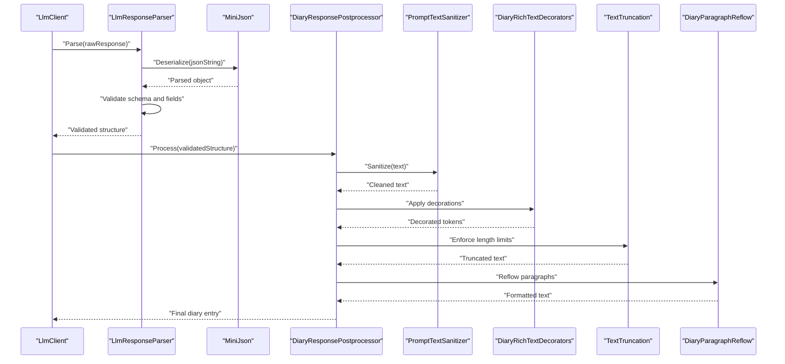
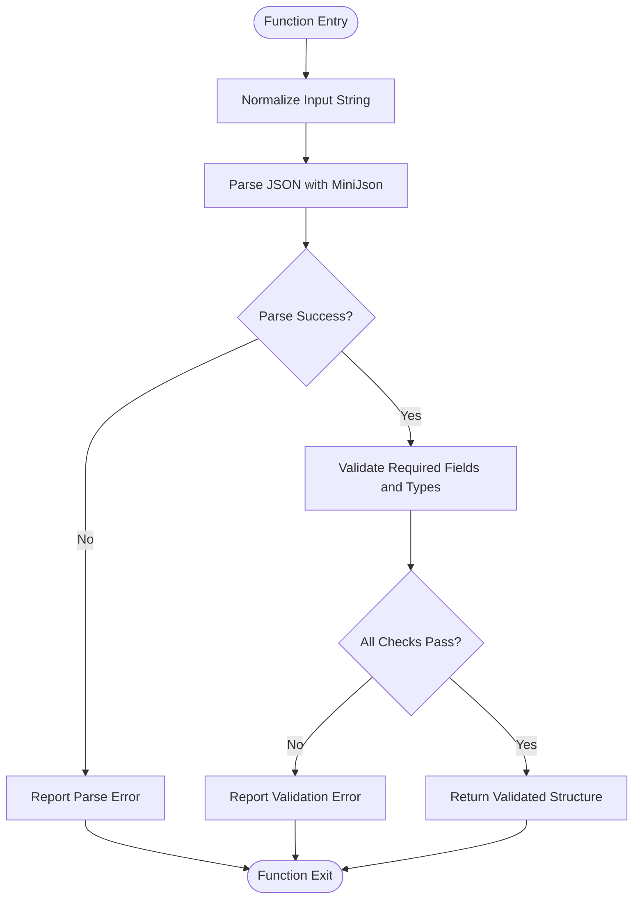
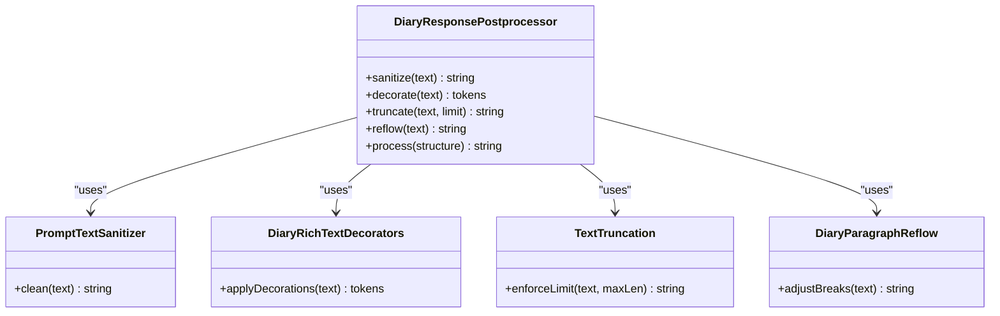
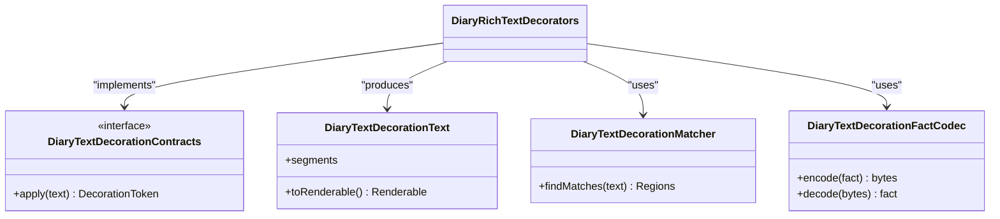
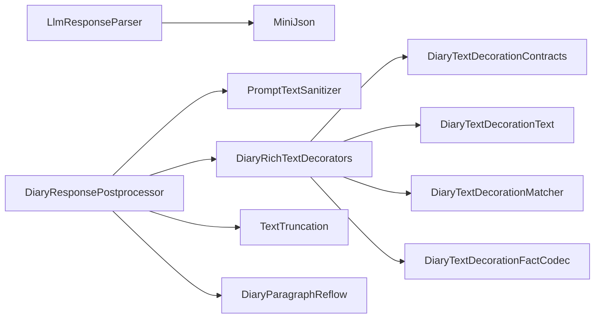

# Response Processing Pipeline

- [LlmResponseParser.cs](../../../../../Source/Generation/LlmResponseParser.cs)
- [DiaryResponsePostprocessor.cs](../../../../../Source/Pipeline/DiaryResponsePostprocessor.cs)
- [PromptTextSanitizer.cs](../../../../../Source/Pipeline/PromptTextSanitizer.cs)
- [DiaryRichTextDecorators.cs](../../../../../Source/Pipeline/DiaryRichTextDecorators.cs)
- [DiaryTextDecorationContracts.cs](../../../../../Source/Pipeline/DiaryTextDecorationContracts.cs)
- [DiaryTextDecorationText.cs](../../../../../Source/Pipeline/DiaryTextDecorationText.cs)
- [DiaryTextDecorationMatcher.cs](../../../../../Source/Pipeline/DiaryTextDecorationMatcher.cs)
- [DiaryTextDecorationFactCodec.cs](../../../../../Source/Pipeline/DiaryTextDecorationFactCodec.cs)
- [TextTruncation.cs](../../../../../Source/Pipeline/TextTruncation.cs)
- [DiaryParagraphReflow.cs](../../../../../Source/Pipeline/DiaryParagraphReflow.cs)
- [LlmClient.cs](../../../../../Source/Generation/LlmClient.cs)
- [MiniJson.cs](../../../../../Source/Util/MiniJson.cs)
## Table of Contents
1. [Introduction](#introduction)
2. [Project Structure](#project-structure)
3. [Core Components](#core-components)
4. [Architecture Overview](#architecture-overview)
5. [Detailed Component Analysis](#detailed-component-analysis)
6. [Dependency Analysis](#dependency-analysis)
7. [Performance Considerations](#performance-considerations)
8. [Troubleshooting Guide](#troubleshooting-guide)
9. [Conclusion](#conclusion)
10. [Appendices](#appendices)

## Introduction
This document explains the response processing pipeline that transforms raw AI-generated content into formatted diary entries. It focuses on how responses are validated and parsed, including JSON parsing and schema validation, followed by postprocessing stages such as text decoration application, rich text formatting, and content sanitization. The guide also covers customization points for parsers, decorations, and validation rules, along with performance optimization techniques and memory management strategies for large responses.

## Project Structure
The response processing pipeline spans two primary areas:
- Generation layer: parses and validates LLM responses
- Pipeline layer: postprocesses, decorates, sanitizes, and formats text for rendering

**Diagram sources**
- [LlmClient.cs](../../../../../Source/Generation/LlmClient.cs)
- [LlmResponseParser.cs](../../../../../Source/Generation/LlmResponseParser.cs)
- [MiniJson.cs](../../../../../Source/Util/MiniJson.cs)
- [DiaryResponsePostprocessor.cs](../../../../../Source/Pipeline/DiaryResponsePostprocessor.cs)
- [PromptTextSanitizer.cs](../../../../../Source/Pipeline/PromptTextSanitizer.cs)
- [DiaryRichTextDecorators.cs](../../../../../Source/Pipeline/DiaryRichTextDecorators.cs)
- [DiaryTextDecorationContracts.cs](../../../../../Source/Pipeline/DiaryTextDecorationContracts.cs)
- [DiaryTextDecorationText.cs](../../../../../Source/Pipeline/DiaryTextDecorationText.cs)
- [DiaryTextDecorationMatcher.cs](../../../../../Source/Pipeline/DiaryTextDecorationMatcher.cs)
- [DiaryTextDecorationFactCodec.cs](../../../../../Source/Pipeline/DiaryTextDecorationFactCodec.cs)
- [TextTruncation.cs](../../../../../Source/Pipeline/TextTruncation.cs)
- [DiaryParagraphReflow.cs](../../../../../Source/Pipeline/DiaryParagraphReflow.cs)

**Section sources**
- [LlmClient.cs](../../../../../Source/Generation/LlmClient.cs)
- [LlmResponseParser.cs](../../../../../Source/Generation/LlmResponseParser.cs)
- [MiniJson.cs](../../../../../Source/Util/MiniJson.cs)
- [DiaryResponsePostprocessor.cs](../../../../../Source/Pipeline/DiaryResponsePostprocessor.cs)
- [PromptTextSanitizer.cs](../../../../../Source/Pipeline/PromptTextSanitizer.cs)
- [DiaryRichTextDecorators.cs](../../../../../Source/Pipeline/DiaryRichTextDecorators.cs)
- [DiaryTextDecorationContracts.cs](../../../../../Source/Pipeline/DiaryTextDecorationContracts.cs)
- [DiaryTextDecorationText.cs](../../../../../Source/Pipeline/DiaryTextDecorationText.cs)
- [DiaryTextDecorationMatcher.cs](../../../../../Source/Pipeline/DiaryTextDecorationMatcher.cs)
- [DiaryTextDecorationFactCodec.cs](../../../../../Source/Pipeline/DiaryTextDecorationFactCodec.cs)
- [TextTruncation.cs](../../../../../Source/Pipeline/TextTruncation.cs)
- [DiaryParagraphReflow.cs](../../../../../Source/Pipeline/DiaryParagraphReflow.cs)

## Core Components
- LlmResponseParser: Validates and processes AI-generated content, including JSON parsing and schema validation. It extracts structured fields from model outputs and ensures required data is present before downstream processing.
- DiaryResponsePostprocessor: Orchestrates postprocessing steps to transform raw responses into final diary entry text. It applies sanitization, text decorations, truncation, and paragraph reflow.
- PromptTextSanitizer: Cleans and normalizes text content to ensure safe and consistent output.
- DiaryRichTextDecorators: Applies rich text decorations based on contracts and matchers, producing decorated tokens for rendering.
- TextTruncation and DiaryParagraphReflow: Enforce length constraints and improve readability by adjusting line breaks and paragraphs.

Key responsibilities:
- Parsing: Convert raw strings to structured objects safely
- Validation: Enforce schemas and detect errors early
- Postprocessing: Sanitize, decorate, truncate, and reflow text
- Extensibility: Provide hooks for custom parsers, decorations, and validation rules

**Section sources**
- [LlmResponseParser.cs](../../../../../Source/Generation/LlmResponseParser.cs)
- [DiaryResponsePostprocessor.cs](../../../../../Source/Pipeline/DiaryResponsePostprocessor.cs)
- [PromptTextSanitizer.cs](../../../../../Source/Pipeline/PromptTextSanitizer.cs)
- [DiaryRichTextDecorators.cs](../../../../../Source/Pipeline/DiaryRichTextDecorators.cs)
- [TextTruncation.cs](../../../../../Source/Pipeline/TextTruncation.cs)
- [DiaryParagraphReflow.cs](../../../../../Source/Pipeline/DiaryParagraphReflow.cs)

## Architecture Overview
The pipeline follows a clear sequence:
1. Raw response retrieval via LlmClient
2. JSON parsing and schema validation via LlmResponseParser
3. Postprocessing via DiaryResponsePostprocessor (sanitization, decoration, truncation, reflow)
4. Final formatted text ready for UI or storage

**Diagram sources**
- [LlmClient.cs](../../../../../Source/Generation/LlmClient.cs)
- [LlmResponseParser.cs](../../../../../Source/Generation/LlmResponseParser.cs)
- [MiniJson.cs](../../../../../Source/Util/MiniJson.cs)
- [DiaryResponsePostprocessor.cs](../../../../../Source/Pipeline/DiaryResponsePostprocessor.cs)
- [PromptTextSanitizer.cs](../../../../../Source/Pipeline/PromptTextSanitizer.cs)
- [DiaryRichTextDecorators.cs](../../../../../Source/Pipeline/DiaryRichTextDecorators.cs)
- [TextTruncation.cs](../../../../../Source/Pipeline/TextTruncation.cs)
- [DiaryParagraphReflow.cs](../../../../../Source/Pipeline/DiaryParagraphReflow.cs)

## Detailed Component Analysis

### LlmResponseParser: JSON Parsing and Schema Validation
Responsibilities:
- Deserialize raw model output into structured data using MiniJson
- Validate presence and types of required fields
- Detect malformed JSON and report actionable errors
- Normalize whitespace and control characters where appropriate

Processing logic:
- Input normalization: trim and sanitize input string
- JSON deserialization: parse into typed structures
- Schema validation: check required keys, enums, and value ranges
- Error detection: categorize failures (parse error, missing field, invalid type)
- Output: validated structure or error payload for upstream handling

Customization points:
- Extend schema checks by adding new validation rules
- Integrate additional JSON parsers if needed
- Implement custom error reporting strategies

**Diagram sources**
- [LlmResponseParser.cs](../../../../../Source/Generation/LlmResponseParser.cs)
- [MiniJson.cs](../../../../../Source/Util/MiniJson.cs)

**Section sources**
- [LlmResponseParser.cs](../../../../../Source/Generation/LlmResponseParser.cs)
- [MiniJson.cs](../../../../../Source/Util/MiniJson.cs)

### DiaryResponsePostprocessor: Postprocessing Orchestration
Responsibilities:
- Apply sanitization to raw text
- Run text decoration pipeline to produce rich tokens
- Enforce truncation limits
- Reflow paragraphs for readability
- Aggregate results into final formatted entry

Processing stages:
- Sanitize: remove unsafe characters, normalize whitespace
- Decorate: apply decorators based on contracts and matchers
- Truncate: enforce maximum lengths while preserving boundaries
- Reflow: adjust line breaks and paragraph structure

Extensibility:
- Add new sanitization rules
- Register new text decorations
- Customize truncation policies
- Modify reflow behavior

**Diagram sources**
- [DiaryResponsePostprocessor.cs](../../../../../Source/Pipeline/DiaryResponsePostprocessor.cs)
- [PromptTextSanitizer.cs](../../../../../Source/Pipeline/PromptTextSanitizer.cs)
- [DiaryRichTextDecorators.cs](../../../../../Source/Pipeline/DiaryRichTextDecorators.cs)
- [TextTruncation.cs](../../../../../Source/Pipeline/TextTruncation.cs)
- [DiaryParagraphReflow.cs](../../../../../Source/Pipeline/DiaryParagraphReflow.cs)

**Section sources**
- [DiaryResponsePostprocessor.cs](../../../../../Source/Pipeline/DiaryResponsePostprocessor.cs)
- [PromptTextSanitizer.cs](../../../../../Source/Pipeline/PromptTextSanitizer.cs)
- [DiaryRichTextDecorators.cs](../../../../../Source/Pipeline/DiaryRichTextDecorators.cs)
- [TextTruncation.cs](../../../../../Source/Pipeline/TextTruncation.cs)
- [DiaryParagraphReflow.cs](../../../../../Source/Pipeline/DiaryParagraphReflow.cs)

### Rich Text Decoration System
Components:
- Contracts: define decoration interfaces and metadata
- Text representation: models for decorated text segments
- Matcher: identifies regions to decorate based on patterns or facts
- Fact codec: serializes/deserializes decoration facts for persistence

Workflow:
- Match text regions using configured rules
- Create decoration tokens per contract
- Encode facts for later decoding
- Produce token stream for rendering

Customization:
- Implement new decoration contracts
- Add custom matchers for domain-specific patterns
- Extend fact codecs for richer decoration metadata

**Diagram sources**
- [DiaryRichTextDecorators.cs](../../../../../Source/Pipeline/DiaryRichTextDecorators.cs)
- [DiaryTextDecorationContracts.cs](../../../../../Source/Pipeline/DiaryTextDecorationContracts.cs)
- [DiaryTextDecorationText.cs](../../../../../Source/Pipeline/DiaryTextDecorationText.cs)
- [DiaryTextDecorationMatcher.cs](../../../../../Source/Pipeline/DiaryTextDecorationMatcher.cs)
- [DiaryTextDecorationFactCodec.cs](../../../../../Source/Pipeline/DiaryTextDecorationFactCodec.cs)

**Section sources**
- [DiaryRichTextDecorators.cs](../../../../../Source/Pipeline/DiaryRichTextDecorators.cs)
- [DiaryTextDecorationContracts.cs](../../../../../Source/Pipeline/DiaryTextDecorationContracts.cs)
- [DiaryTextDecorationText.cs](../../../../../Source/Pipeline/DiaryTextDecorationText.cs)
- [DiaryTextDecorationMatcher.cs](../../../../../Source/Pipeline/DiaryTextDecorationMatcher.cs)
- [DiaryTextDecorationFactCodec.cs](../../../../../Source/Pipeline/DiaryTextDecorationFactCodec.cs)

### Customization Examples
- Customizing response parsers:
  - Extend schema validation by adding new required fields and type checks
  - Integrate alternative JSON parsers if MiniJson does not meet requirements
  - Implement custom error categories for better diagnostics

- Adding new text decorations:
  - Define a new decoration contract implementing the interface
  - Implement a matcher to identify relevant text regions
  - Use the fact codec to persist decoration metadata

- Implementing custom validation rules:
  - Add domain-specific checks in the parser’s validation stage
  - Return structured errors with actionable messages
  - Log detailed context for debugging

[No sources needed since this section provides general guidance]

## Dependency Analysis
The pipeline exhibits low coupling between stages and clear separation of concerns:
- LlmResponseParser depends on MiniJson for parsing
- DiaryResponsePostprocessor orchestrates independent utilities
- Decoration system relies on contracts, matchers, and codecs

**Diagram sources**
- [LlmResponseParser.cs](../../../../../Source/Generation/LlmResponseParser.cs)
- [MiniJson.cs](../../../../../Source/Util/MiniJson.cs)
- [DiaryResponsePostprocessor.cs](../../../../../Source/Pipeline/DiaryResponsePostprocessor.cs)
- [PromptTextSanitizer.cs](../../../../../Source/Pipeline/PromptTextSanitizer.cs)
- [DiaryRichTextDecorators.cs](../../../../../Source/Pipeline/DiaryRichTextDecorators.cs)
- [DiaryTextDecorationContracts.cs](../../../../../Source/Pipeline/DiaryTextDecorationContracts.cs)
- [DiaryTextDecorationText.cs](../../../../../Source/Pipeline/DiaryTextDecorationText.cs)
- [DiaryTextDecorationMatcher.cs](../../../../../Source/Pipeline/DiaryTextDecorationMatcher.cs)
- [DiaryTextDecorationFactCodec.cs](../../../../../Source/Pipeline/DiaryTextDecorationFactCodec.cs)
- [TextTruncation.cs](../../../../../Source/Pipeline/TextTruncation.cs)
- [DiaryParagraphReflow.cs](../../../../../Source/Pipeline/DiaryParagraphReflow.cs)

**Section sources**
- [LlmResponseParser.cs](../../../../../Source/Generation/LlmResponseParser.cs)
- [MiniJson.cs](../../../../../Source/Util/MiniJson.cs)
- [DiaryResponsePostprocessor.cs](../../../../../Source/Pipeline/DiaryResponsePostprocessor.cs)
- [PromptTextSanitizer.cs](../../../../../Source/Pipeline/PromptTextSanitizer.cs)
- [DiaryRichTextDecorators.cs](../../../../../Source/Pipeline/DiaryRichTextDecorators.cs)
- [DiaryTextDecorationContracts.cs](../../../../../Source/Pipeline/DiaryTextDecorationContracts.cs)
- [DiaryTextDecorationText.cs](../../../../../Source/Pipeline/DiaryTextDecorationText.cs)
- [DiaryTextDecorationMatcher.cs](../../../../../Source/Pipeline/DiaryTextDecorationMatcher.cs)
- [DiaryTextDecorationFactCodec.cs](../../../../../Source/Pipeline/DiaryTextDecorationFactCodec.cs)
- [TextTruncation.cs](../../../../../Source/Pipeline/TextTruncation.cs)
- [DiaryParagraphReflow.cs](../../../../../Source/Pipeline/DiaryParagraphReflow.cs)

## Performance Considerations
- Minimize allocations:
  - Reuse buffers when possible during parsing and decoration
  - Avoid unnecessary string copies; prefer span-based operations where feasible
- Stream large responses:
  - Process chunks instead of loading entire payloads into memory
  - Apply truncation early to reduce downstream work
- Optimize regex and matching:
  - Cache compiled matchers and precompute frequent patterns
  - Limit scope of decoration matching to relevant segments
- Efficient serialization:
  - Prefer lightweight JSON parsing and avoid deep cloning unless necessary
- Parallelism:
  - Where safe, parallelize independent decoration passes across disjoint text segments
- Memory management:
  - Release references promptly after processing
  - Use pooling for frequently allocated objects like tokens and segments

[No sources needed since this section provides general guidance]

## Troubleshooting Guide
Common issues and resolutions:
- JSON parse errors:
  - Verify raw response integrity and encoding
  - Inspect error details returned by the parser
- Missing or invalid fields:
  - Check schema definitions and required fields
  - Ensure model prompts request well-formed outputs
- Excessive text size:
  - Adjust truncation limits and reflow settings
  - Investigate whether decorations are expanding content unexpectedly
- Decoration mismatches:
  - Review matcher rules and contract implementations
  - Validate fact codec encode/decode consistency

Debugging tips:
- Enable detailed logging at each pipeline stage
- Capture intermediate representations (parsed structure, sanitized text, decoration tokens)
- Use targeted tests for custom parsers and decorations

**Section sources**
- [LlmResponseParser.cs](../../../../../Source/Generation/LlmResponseParser.cs)
- [DiaryResponsePostprocessor.cs](../../../../../Source/Pipeline/DiaryResponsePostprocessor.cs)
- [PromptTextSanitizer.cs](../../../../../Source/Pipeline/PromptTextSanitizer.cs)
- [DiaryRichTextDecorators.cs](../../../../../Source/Pipeline/DiaryRichTextDecorators.cs)
- [TextTruncation.cs](../../../../../Source/Pipeline/TextTruncation.cs)
- [DiaryParagraphReflow.cs](../../../../../Source/Pipeline/DiaryParagraphReflow.cs)

## Conclusion
The response processing pipeline provides a robust framework for validating, sanitizing, decorating, and formatting AI-generated content into polished diary entries. Its modular design supports extensibility through custom parsers, decorations, and validation rules. By applying the performance and memory management recommendations outlined here, developers can ensure efficient handling of large responses while maintaining high-quality output.

[No sources needed since this section summarizes without analyzing specific files]

## Appendices
- Integration points:
  - LlmClient coordinates request/response lifecycle and invokes the parser
  - Upstream components consume the final formatted text for UI display or archival

**Section sources**
- [LlmClient.cs](../../../../../Source/Generation/LlmClient.cs)
- [DiaryResponsePostprocessor.cs](../../../../../Source/Pipeline/DiaryResponsePostprocessor.cs)
