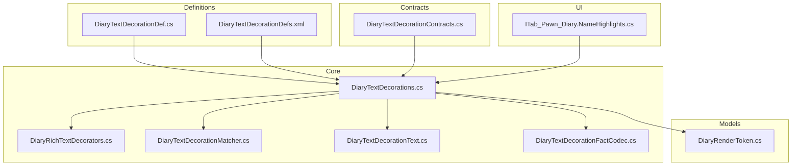
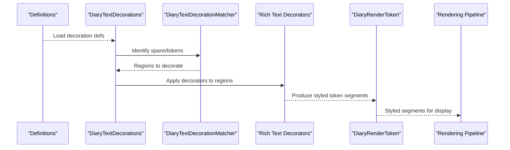
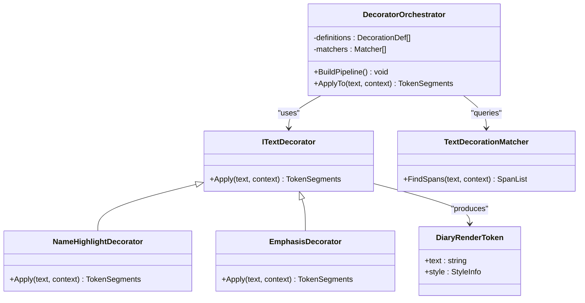
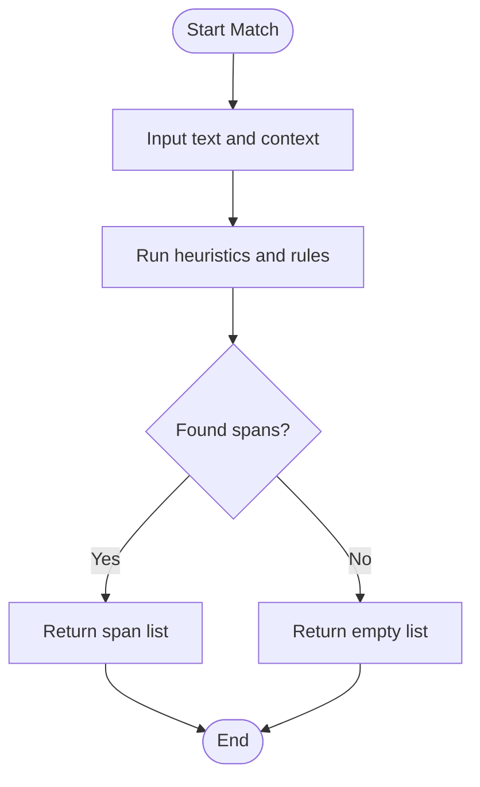
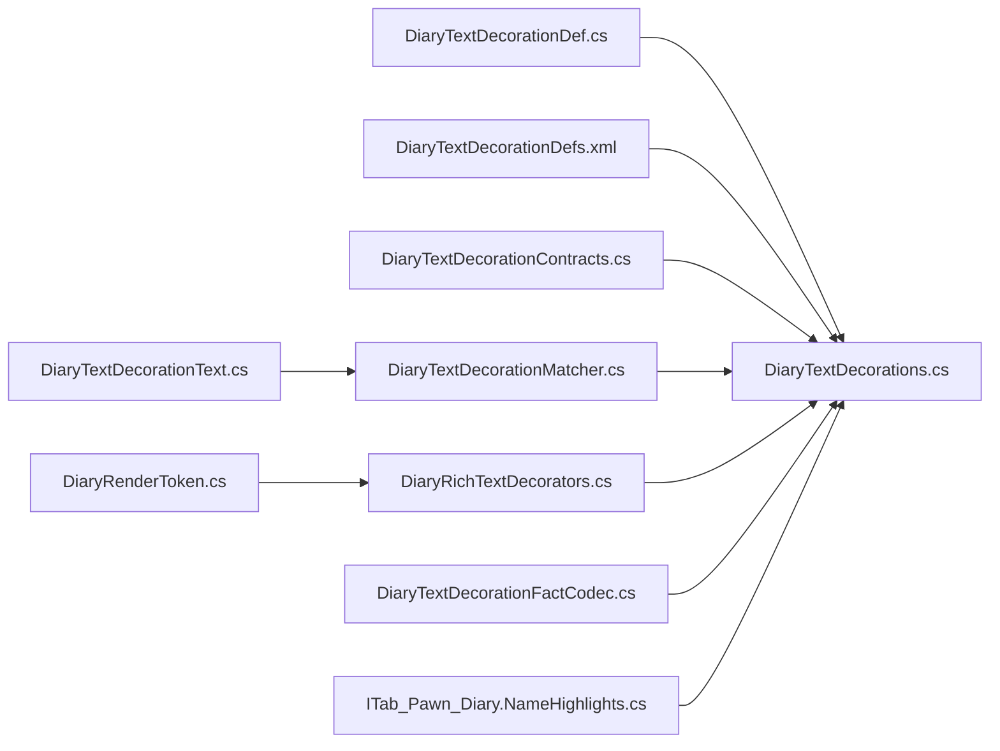

# Text Decoration System

- [DiaryTextDecorationDef.cs](../../../../../Source/Defs/DiaryTextDecorationDef.cs)
- [DiaryTextDecorationContracts.cs](../../../../../Source/Pipeline/DiaryTextDecorationContracts.cs)
- [DiaryTextDecorations.cs](../../../../../Source/Pipeline/DiaryTextDecorations.cs)
- [DiaryRichTextDecorators.cs](../../../../../Source/Pipeline/DiaryRichTextDecorators.cs)
- [DiaryNameHighlighter.cs](../../../../../Source/Pipeline/DiaryNameHighlighter.cs)
- [DiaryTextDecorationMatcher.cs](../../../../../Source/Pipeline/DiaryTextDecorationMatcher.cs)
- [DiaryTextDecorationFactCodec.cs](../../../../../Source/Pipeline/DiaryTextDecorationFactCodec.cs)
- [DiaryTextDecorationText.cs](../../../../../Source/Pipeline/DiaryTextDecorationText.cs)
- [DiaryTextDecorationDefs.xml](../../../../../1.6/Defs/DiaryTextDecorationDefs.xml)
- [ITab_Pawn_Diary.NameHighlights.cs](../../../../../Source/UI/ITab_Pawn_Diary.NameHighlights.cs)
- [DiaryRenderToken.cs](../../../../../Source/Models/DiaryRenderToken.cs)
## Table of Contents
1. [Introduction](#introduction)
2. [Project Structure](#project-structure)
3. [Core Components](#core-components)
4. [Architecture Overview](#architecture-overview)
5. [Detailed Component Analysis](#detailed-component-analysis)
6. [Dependency Analysis](#dependency-analysis)
7. [Performance Considerations](#performance-considerations)
8. [Troubleshooting Guide](#troubleshooting-guide)
9. [Conclusion](#conclusion)
10. [Appendices](#appendices)

## Introduction
This document explains the text decoration system used to apply rich text formatting to diary entries. It covers the architecture, decorator patterns, built-in decorators (such as name highlighting and emphasis markers), how decorations are applied during rendering, and guidance for creating custom decorators with conditional formatting and performance optimization. It also clarifies how decorations integrate with the overall rendering pipeline.

## Project Structure
The text decoration system spans definitions, contracts, core logic, matchers, codecs, UI integration, and model tokens:
- Definitions define decoration types and their parameters via XML and C# def classes.
- Contracts specify the interfaces that all decorators must implement.
- The core orchestrator composes and applies decorators to entry text.
- Rich text decorators provide concrete styling behaviors.
- Matchers detect regions or tokens to decorate based on context.
- Codec utilities serialize/deserialize decoration facts for persistence.
- UI components expose name highlights and related controls.
- Render tokens represent styled segments consumed by the renderer.

**Diagram sources**
- [DiaryTextDecorationDef.cs](../../../../../Source/Defs/DiaryTextDecorationDef.cs)
- [DiaryTextDecorationDefs.xml](../../../../../1.6/Defs/DiaryTextDecorationDefs.xml)
- [DiaryTextDecorationContracts.cs](../../../../../Source/Pipeline/DiaryTextDecorationContracts.cs)
- [DiaryTextDecorations.cs](../../../../../Source/Pipeline/DiaryTextDecorations.cs)
- [DiaryRichTextDecorators.cs](../../../../../Source/Pipeline/DiaryRichTextDecorators.cs)
- [DiaryTextDecorationMatcher.cs](../../../../../Source/Pipeline/DiaryTextDecorationMatcher.cs)
- [DiaryTextDecorationText.cs](../../../../../Source/Pipeline/DiaryTextDecorationText.cs)
- [DiaryTextDecorationFactCodec.cs](../../../../../Source/Pipeline/DiaryTextDecorationFactCodec.cs)
- [ITab_Pawn_Diary.NameHighlights.cs](../../../../../Source/UI/ITab_Pawn_Diary.NameHighlights.cs)
- [DiaryRenderToken.cs](../../../../../Source/Models/DiaryRenderToken.cs)

**Section sources**
- [DiaryTextDecorationDef.cs](../../../../../Source/Defs/DiaryTextDecorationDef.cs)
- [DiaryTextDecorationDefs.xml](../../../../../1.6/Defs/DiaryTextDecorationDefs.xml)
- [DiaryTextDecorationContracts.cs](../../../../../Source/Pipeline/DiaryTextDecorationContracts.cs)
- [DiaryTextDecorations.cs](../../../../../Source/Pipeline/DiaryTextDecorations.cs)
- [DiaryRichTextDecorators.cs](../../../../../Source/Pipeline/DiaryRichTextDecorators.cs)
- [DiaryTextDecorationMatcher.cs](../../../../../Source/Pipeline/DiaryTextDecorationMatcher.cs)
- [DiaryTextDecorationText.cs](../../../../../Source/Pipeline/DiaryTextDecorationText.cs)
- [DiaryTextDecorationFactCodec.cs](../../../../../Source/Pipeline/DiaryTextDecorationFactCodec.cs)
- [ITab_Pawn_Diary.NameHighlights.cs](../../../../../Source/UI/ITab_Pawn_Diary.NameHighlights.cs)
- [DiaryRenderToken.cs](../../../../../Source/Models/DiaryRenderToken.cs)

## Core Components
- Definition layer: Declares decoration types, parameters, and default behaviors.
- Contract layer: Defines the interface for decorators and the decoration pipeline.
- Orchestrator: Loads definitions, constructs decorators, and applies them in order.
- Rich text decorators: Implement specific styling rules (e.g., bold, italics, color).
- Matcher: Identifies text spans or tokens to be decorated using heuristics or context.
- Codec: Serializes and deserializes decoration facts for save/load compatibility.
- UI integration: Exposes name highlights and related configuration in the UI.
- Render tokens: Represent styled fragments consumed by the final renderer.

Key responsibilities:
- Decorator contract ensures consistent application semantics across all styles.
- Orchestrator centralizes lifecycle management and ordering of decorators.
- Matcher decouples detection from styling, enabling reusable pattern-based decoration.
- Codec guarantees stable serialization of decoration metadata.

**Section sources**
- [DiaryTextDecorationDef.cs](../../../../../Source/Defs/DiaryTextDecorationDef.cs)
- [DiaryTextDecorationContracts.cs](../../../../../Source/Pipeline/DiaryTextDecorationContracts.cs)
- [DiaryTextDecorations.cs](../../../../../Source/Pipeline/DiaryTextDecorations.cs)
- [DiaryRichTextDecorators.cs](../../../../../Source/Pipeline/DiaryRichTextDecorators.cs)
- [DiaryTextDecorationMatcher.cs](../../../../../Source/Pipeline/DiaryTextDecorationMatcher.cs)
- [DiaryTextDecorationFactCodec.cs](../../../../../Source/Pipeline/DiaryTextDecorationFactCodec.cs)
- [ITab_Pawn_Diary.NameHighlights.cs](../../../../../Source/UI/ITab_Pawn_Diary.NameHighlights.cs)
- [DiaryRenderToken.cs](../../../../../Source/Models/DiaryRenderToken.cs)

## Architecture Overview
The decoration system follows a layered approach:
- Definitions drive available decorators and their options.
- Contracts enforce uniform behavior.
- The orchestrator wires definitions to implementations and applies them to text.
- Matchers identify targets; decorators transform those targets into styled segments.
- Tokens produced by decorators feed the rendering pipeline.

**Diagram sources**
- [DiaryTextDecorationDef.cs](../../../../../Source/Defs/DiaryTextDecorationDef.cs)
- [DiaryTextDecorationDefs.xml](../../../../../1.6/Defs/DiaryTextDecorationDefs.xml)
- [DiaryTextDecorations.cs](../../../../../Source/Pipeline/DiaryTextDecorations.cs)
- [DiaryTextDecorationMatcher.cs](../../../../../Source/Pipeline/DiaryTextDecorationMatcher.cs)
- [DiaryRichTextDecorators.cs](../../../../../Source/Pipeline/DiaryRichTextDecorators.cs)
- [DiaryRenderToken.cs](../../../../../Source/Models/DiaryRenderToken.cs)

## Detailed Component Analysis

### Decorator Contracts and Orchestration
- Contracts define the method signatures and semantics for applying decorations to text spans.
- The orchestrator loads decoration definitions, instantiates corresponding decorators, and applies them in a deterministic order.
- It coordinates matcher output with decorator input to ensure correct region targeting.

**Diagram sources**
- [DiaryTextDecorationContracts.cs](../../../../../Source/Pipeline/DiaryTextDecorationContracts.cs)
- [DiaryTextDecorations.cs](../../../../../Source/Pipeline/DiaryTextDecorations.cs)
- [DiaryRichTextDecorators.cs](../../../../../Source/Pipeline/DiaryRichTextDecorators.cs)
- [DiaryTextDecorationMatcher.cs](../../../../../Source/Pipeline/DiaryTextDecorationMatcher.cs)
- [DiaryRenderToken.cs](../../../../../Source/Models/DiaryRenderToken.cs)

**Section sources**
- [DiaryTextDecorationContracts.cs](../../../../../Source/Pipeline/DiaryTextDecorationContracts.cs)
- [DiaryTextDecorations.cs](../../../../../Source/Pipeline/DiaryTextDecorations.cs)
- [DiaryRichTextDecorators.cs](../../../../../Source/Pipeline/DiaryRichTextDecorators.cs)
- [DiaryTextDecorationMatcher.cs](../../../../../Source/Pipeline/DiaryTextDecorationMatcher.cs)
- [DiaryRenderToken.cs](../../../../../Source/Models/DiaryRenderToken.cs)

### Built-in Decorators
- Name highlighting: Detects character names and applies distinct styling to make them stand out in diary entries.
- Emphasis markers: Applies visual emphasis (e.g., bold or italic) to specific phrases or tokens.
- Custom styling options: Additional decorators can be defined via definitions to support colors, fonts, or other style attributes.

These decorators consume matched spans and produce styled token segments compatible with the renderer.

**Section sources**
- [DiaryRichTextDecorators.cs](../../../../../Source/Pipeline/DiaryRichTextDecorators.cs)
- [DiaryNameHighlighter.cs](../../../../../Source/Pipeline/DiaryNameHighlighter.cs)
- [DiaryTextDecorationDefs.xml](../../../../../1.6/Defs/DiaryTextDecorationDefs.xml)

### Matching and Targeting Logic
- The matcher identifies candidate spans based on text patterns, context, or external signals (e.g., known names).
- It returns a list of spans that subsequent decorators can target.
- Decoupling matching from styling allows reuse of detection logic across multiple decorators.

**Diagram sources**
- [DiaryTextDecorationMatcher.cs](../../../../../Source/Pipeline/DiaryTextDecorationMatcher.cs)
- [DiaryTextDecorationText.cs](../../../../../Source/Pipeline/DiaryTextDecorationText.cs)

**Section sources**
- [DiaryTextDecorationMatcher.cs](../../../../../Source/Pipeline/DiaryTextDecorationMatcher.cs)
- [DiaryTextDecorationText.cs](../../../../../Source/Pipeline/DiaryTextDecorationText.cs)

### Serialization and Persistence
- The codec serializes decoration facts (metadata about applied decorations) to ensure consistency across saves and updates.
- It handles versioning and migration of decoration schemas when definitions change.

**Section sources**
- [DiaryTextDecorationFactCodec.cs](../../../../../Source/Pipeline/DiaryTextDecorationFactCodec.cs)

### UI Integration
- The UI exposes name highlight settings and related toggles for users to control decoration behavior.
- It integrates with the orchestrator to reflect current decoration state and preferences.

**Section sources**
- [ITab_Pawn_Diary.NameHighlights.cs](../../../../../Source/UI/ITab_Pawn_Diary.NameHighlights.cs)
- [DiaryTextDecorations.cs](../../../../../Source/Pipeline/DiaryTextDecorations.cs)

## Dependency Analysis
The following diagram shows key dependencies among core files:

**Diagram sources**
- [DiaryTextDecorationDef.cs](../../../../../Source/Defs/DiaryTextDecorationDef.cs)
- [DiaryTextDecorationDefs.xml](../../../../../1.6/Defs/DiaryTextDecorationDefs.xml)
- [DiaryTextDecorationContracts.cs](../../../../../Source/Pipeline/DiaryTextDecorationContracts.cs)
- [DiaryTextDecorations.cs](../../../../../Source/Pipeline/DiaryTextDecorations.cs)
- [DiaryTextDecorationMatcher.cs](../../../../../Source/Pipeline/DiaryTextDecorationMatcher.cs)
- [DiaryRichTextDecorators.cs](../../../../../Source/Pipeline/DiaryRichTextDecorators.cs)
- [DiaryTextDecorationFactCodec.cs](../../../../../Source/Pipeline/DiaryTextDecorationFactCodec.cs)
- [DiaryTextDecorationText.cs](../../../../../Source/Pipeline/DiaryTextDecorationText.cs)
- [ITab_Pawn_Diary.NameHighlights.cs](../../../../../Source/UI/ITab_Pawn_Diary.NameHighlights.cs)
- [DiaryRenderToken.cs](../../../../../Source/Models/DiaryRenderToken.cs)

**Section sources**
- [DiaryTextDecorationDef.cs](../../../../../Source/Defs/DiaryTextDecorationDef.cs)
- [DiaryTextDecorationDefs.xml](../../../../../1.6/Defs/DiaryTextDecorationDefs.xml)
- [DiaryTextDecorationContracts.cs](../../../../../Source/Pipeline/DiaryTextDecorationContracts.cs)
- [DiaryTextDecorations.cs](../../../../../Source/Pipeline/DiaryTextDecorations.cs)
- [DiaryTextDecorationMatcher.cs](../../../../../Source/Pipeline/DiaryTextDecorationMatcher.cs)
- [DiaryRichTextDecorators.cs](../../../../../Source/Pipeline/DiaryRichTextDecorators.cs)
- [DiaryTextDecorationFactCodec.cs](../../../../../Source/Pipeline/DiaryTextDecorationFactCodec.cs)
- [DiaryTextDecorationText.cs](../../../../../Source/Pipeline/DiaryTextDecorationText.cs)
- [ITab_Pawn_Diary.NameHighlights.cs](../../../../../Source/UI/ITab_Pawn_Diary.NameHighlights.cs)
- [DiaryRenderToken.cs](../../../../../Source/Models/DiaryRenderToken.cs)

## Performance Considerations
- Minimize regex overhead: Prefer precompiled patterns and cache results where possible.
- Batch operations: Group similar decorations to reduce repeated passes over text.
- Early exits: Skip expensive matching when no relevant context is present.
- Token granularity: Keep token segments reasonably sized to avoid excessive fragmentation.
- Avoid redundant work: Cache matched spans if they are reused by multiple decorators.
- Profile hot paths: Focus on matcher and decorator loops during heavy rendering scenarios.

[No sources needed since this section provides general guidance]

## Troubleshooting Guide
Common issues and remedies:
- Decorations not appearing: Verify definition loading and ensure the decorator is registered in the pipeline.
- Incorrect spans highlighted: Inspect matcher heuristics and context inputs; adjust thresholds or rules.
- Save/load inconsistencies: Check codec versioning and migration logic for schema changes.
- UI toggles ineffective: Confirm UI bindings call into the orchestrator and propagate changes to active decorators.

**Section sources**
- [DiaryTextDecorationFactCodec.cs](../../../../../Source/Pipeline/DiaryTextDecorationFactCodec.cs)
- [DiaryTextDecorationMatcher.cs](../../../../../Source/Pipeline/DiaryTextDecorationMatcher.cs)
- [DiaryTextDecorations.cs](../../../../../Source/Pipeline/DiaryTextDecorations.cs)
- [ITab_Pawn_Diary.NameHighlights.cs](../../../../../Source/UI/ITab_Pawn_Diary.NameHighlights.cs)

## Conclusion
The text decoration system provides a flexible, extensible framework for enriching diary entries with rich formatting. By separating concerns—definitions, contracts, orchestration, matching, and styling—it enables robust customization while maintaining performance and clarity. Built-in decorators like name highlighting and emphasis markers demonstrate practical usage, and the provided extension points allow modders to add new styles and conditional behaviors seamlessly.

[No sources needed since this section summarizes without analyzing specific files]

## Appendices

### Creating Custom Text Decorators
Steps to implement a custom decorator:
- Define a new decoration type in the definition layer with required parameters.
- Implement a decorator class adhering to the contract interface.
- Integrate the decorator into the orchestrator’s pipeline.
- Optionally extend the matcher to detect new patterns or contexts.
- Update UI if user-facing controls are needed.

Best practices:
- Keep decorators stateless where possible to improve caching and parallelism.
- Use clear, testable heuristics in matchers.
- Ensure codec compatibility when changing decoration schemas.

[No sources needed since this section provides general guidance]

### Conditional Formatting Based on Context
Guidance:
- Leverage context passed to decorators to decide whether to apply styling.
- Use matcher outputs to scope decorations to specific entities or events.
- Combine multiple conditions to refine formatting decisions.

[No sources needed since this section provides general guidance]

### Rendering Pipeline Integration
Decorators produce styled token segments consumed by the renderer. Ensure:
- Tokens include both text and style metadata.
- Ordering of tokens preserves original text flow.
- Styles map correctly to the renderer’s supported features.

**Section sources**
- [DiaryRenderToken.cs](../../../../../Source/Models/DiaryRenderToken.cs)
- [DiaryRichTextDecorators.cs](../../../../../Source/Pipeline/DiaryRichTextDecorators.cs)
