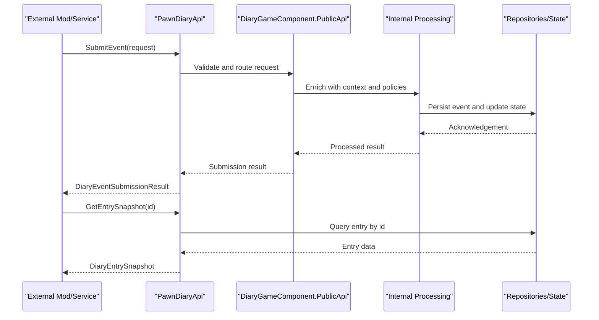

# API Reference

## Table of Contents
1. [Introduction](#introduction)
2. [Project Structure](#project-structure)
3. [Core Components](#core-components)
4. [Architecture Overview](#architecture-overview)
5. [Detailed Component Analysis](#detailed-component-analysis)
6. [Dependency Analysis](#dependency-analysis)
7. [Performance Considerations](#performance-considerations)
8. [Troubleshooting Guide](#troubleshooting-guide)
9. [Conclusion](#conclusion)
10. [Appendices](#appendices)

## Introduction
This API Reference documents the public interfaces exposed by Pawn Diary for external integration. It covers classes, methods, properties, events, data models, and contracts used by other mods or services to interact with the diary system. The goal is to provide clear type definitions, parameter descriptions, return value specifications, usage examples, cross-references, versioning considerations, deprecation policies, and migration guidance.

## Project Structure
The public API surface is primarily defined under Source/Integration and coordinated through core components in Source/Core. Key areas include:
- Public API entry points and orchestration
- External request/response types for events, direct entries, prompts, and lanes
- Snapshot-based read-only views of diary state
- Integration helpers for context providers, psychotype generators, and LLM completion
- Result and outcome types for submissions and status tracking

```mermaid
graph TB
subgraph "Public API Surface"
A["PawnDiaryApi"]
B["ExternalEventRequest"]
C["ExternalDirectEntryRequest"]
D["ExternalPromptEntryRequest"]
E["ExternalApiLaneRequest"]
end
subgraph "Snapshots (Read-Only Views)"
S1["DiaryEntrySnapshot"]
S2["DiaryEntryProseSnapshot"]
S3["DiaryEntryStatsSnapshot"]
S4["DiaryEntryStatusSnapshot"]
S5["DiaryEntryTitleSnapshot"]
S6["DiaryContextSnapshot"]
S7["DiaryContextBundleSnapshot"]
S8["DiaryApiLaneSnapshot"]
S9["DiaryApiSetupSnapshot"]
S10["DiaryHealthSummarySnapshot"]
S11["DiaryPawnSummarySnapshot"]
S12["DiaryPromptPreviewSnapshot"]
S13["DiaryPsychotypeSnapshot"]
S14["DiaryWritingStyleSnapshot"]
S15["DiaryEventFilterSnapshot"]
S16["DiaryPromptEnchantmentCandidateSnapshot"]
end
subgraph "Integration Helpers"
H1["PawnContextProviders"]
H2["ExternalPsychotypeGenerators"]
H3["ExternalLlmCompletionService"]
end
subgraph "Results and Outcomes"
R1["DiaryEventSubmissionResult"]
R2["SubmitEventOutcome"]
R3["AddApiLaneResult"]
end
A --> B
A --> C
A --> D
A --> E
A --> S1
A --> S2
A --> S3
A --> S4
A --> S5
A --> S6
A --> S7
A --> S8
A --> S9
A --> S10
A --> S11
A --> S12
A --> S13
A --> S14
A --> S15
A --> S16
A --> H1
A --> H2
A --> H3
A --> R1
A --> R2
A --> R3
```

[No sources needed since this diagram shows conceptual workflow, not actual code structure]

## Core Components
- Public API Entry Point: Provides methods to submit events, add direct entries, preview prompts, manage lanes, and query snapshots.
- Request Types: Define payloads for submitting events, adding direct entries, and requesting prompt generation.
- Snapshots: Immutable representations of diary entries, contexts, health, pawns, and UI-related metadata.
- Integration Helpers: Provide utilities for context injection, psychotype generation, and LLM completions.
- Results and Outcomes: Represent submission results, event outcomes, and lane registration results.

Key responsibilities:
- Validate and normalize incoming requests
- Route to appropriate internal pipelines
- Return structured responses and snapshots
- Expose capabilities and setup diagnostics

**Section sources**
- [PawnDiaryApi.cs](../../../../Source/Integration/PawnDiaryApi.cs)
- [DiaryGameComponent.PublicApi.cs](../../../../Source/Core/DiaryGameComponent.PublicApi.cs)

## Architecture Overview
The public API follows a request-response pattern with optional asynchronous operations and snapshot-based reads. Submissions are validated, enriched with context, and processed through internal pipelines before returning structured results. Read APIs expose snapshots that reflect current state without mutation.

**Diagram sources**
- [PawnDiaryApi.cs](../../../../Source/Integration/PawnDiaryApi.cs)
- [DiaryGameComponent.PublicApi.cs](../../../../Source/Core/DiaryGameComponent.PublicApi.cs)

## Detailed Component Analysis

### Public API Entry Point
The primary class exposing functionality to external integrations. It provides methods for:
- Submitting events
- Adding direct entries
- Generating prompt previews
- Managing API lanes
- Querying snapshots for entries, contexts, health, and pawns
- Accessing integration helpers for context providers, psychotype generators, and LLM completion

Typical responsibilities:
- Input validation and normalization
- Routing to internal components
- Returning typed results and snapshots
- Exposing capability and setup diagnostics

Usage example outline:
- Create an instance of the API
- Build a request object for the desired operation
- Call the corresponding method
- Handle the returned result or snapshot

Cross-references:
- Event submission uses request types and returns submission results
- Direct entry creation uses dedicated request types
- Prompt preview uses prompt-related snapshots
- Lane management uses lane request and result types

**Section sources**
- [PawnDiaryApi.cs](../../../../Source/Integration/PawnDiaryApi.cs)
- [DiaryGameComponent.PublicApi.cs](../../../../Source/Core/DiaryGameComponent.PublicApi.cs)

### Event Submission API
Submits game events to be captured and rendered into diary entries.

Request model:
- ExternalEventRequest
  - Purpose: Encapsulates event details for submission
  - Typical fields: event type, timestamp, pawn identifiers, contextual data, tags
  - Validation: Required fields must be present; values must conform to expected formats

Return model:
- DiaryEventSubmissionResult
  - Purpose: Indicates success/failure and includes diagnostic info
  - Fields: outcome, message, event id (if assigned), warnings

Outcome model:
- SubmitEventOutcome
  - Purpose: Enumerates possible outcomes of event processing
  - Values: Success, InvalidInput, DuplicateSuppressed, PolicyRejected, etc.

Usage example outline:
- Populate ExternalEventRequest with required fields
- Call SubmitEvent
- Inspect DiaryEventSubmissionResult for outcome and messages
- Use SubmitEventOutcome to branch logic

Cross-references:
- Related to capture policies and deduplication
- Influences entry status and stats

**Section sources**
- [ExternalEventRequest.cs](../../../../Source/Integration/ExternalEventRequest.cs)
- [DiaryEventSubmissionResult.cs](../../../../Source/Integration/DiaryEventSubmissionResult.cs)
- [SubmitEventOutcome.cs](../../../../Source/Integration/SubmitEventOutcome.cs)

### Direct Entry API
Allows external systems to add narrative entries directly to a pawn’s diary.

Request model:
- ExternalDirectEntryRequest
  - Purpose: Represents a user-authored or externally authored diary line
  - Typical fields: pawn identifier, prose text, title, tags, attribution, style hints

Return model:
- DiaryEntryHandle
  - Purpose: Identifies the created entry for subsequent operations
  - Fields: entry id, status, timestamps

Usage example outline:
- Construct ExternalDirectEntryRequest with text and target pawn
- Call AddDirectEntry
- Receive DiaryEntryHandle to track the new entry

Cross-references:
- Tied to writing style resolution and decorations
- May trigger status listeners

**Section sources**
- [ExternalDirectEntryRequest.cs](../../../../Source/Integration/ExternalDirectEntryRequest.cs)
- [DiaryEntryHandle.cs](../../../../Source/Integration/DiaryEntryHandle.cs)

### Prompt Preview API
Generates a preview of what a prompt would produce given current context.

Request model:
- ExternalPromptEntryRequest
  - Purpose: Describes parameters for generating a prompt preview
  - Typical fields: template key, context overrides, style preferences, constraints

Return model:
- DiaryPromptPreviewSnapshot
  - Purpose: Contains generated text, tokens, and metadata for preview

Usage example outline:
- Build ExternalPromptEntryRequest with template and context
- Call GeneratePromptPreview
- Inspect DiaryPromptPreviewSnapshot for output and metadata

Cross-references:
- Uses prompt enchantments and writing styles
- Integrates with context bundles

**Section sources**
- [ExternalPromptEntryRequest.cs](../../../../Source/Integration/ExternalPromptEntryRequest.cs)
- [DiaryPromptPreviewSnapshot.cs](../../../../Source/Integration/DiaryPromptPreviewSnapshot.cs)

### API Lanes Management
Manages named lanes for organizing and filtering entries and events.

Request model:
- ExternalApiLaneRequest
  - Purpose: Defines lane configuration and operations
  - Typical fields: lane name, filters, visibility flags

Return model:
- AddApiLaneResult
  - Purpose: Indicates whether lane was added or updated
  - Fields: success, lane id, conflicts, warnings

Related snapshot:
- DiaryApiLaneSnapshot
  - Purpose: Read-only view of a lane’s configuration and contents summary

Usage example outline:
- Create ExternalApiLaneRequest with lane settings
- Call AddOrUpdateLane
- Check AddApiLaneResult for success and warnings
- Query DiaryApiLaneSnapshot to inspect lane state

Cross-references:
- Interacts with event filters and entry titles
- Supports listing and querying via snapshots

**Section sources**
- [ExternalApiLaneRequest.cs](../../../../Source/Integration/ExternalApiLaneRequest.cs)
- [AddApiLaneResult.cs](../../../../Source/Integration/AddApiLaneResult.cs)
- [DiaryApiLaneSnapshot.cs](../../../../Source/Integration/DiaryApiLaneSnapshot.cs)

### Read-Only Snapshots
The API exposes numerous snapshot types for reading state without mutation. These are immutable and safe for concurrent access.

Common categories:
- Entry snapshots:
  - DiaryEntrySnapshot: Core entry metadata and links
  - DiaryEntryProseSnapshot: Rendered prose and formatting tokens
  - DiaryEntryStatsSnapshot: Counts, durations, and derived metrics
  - DiaryEntryStatusSnapshot: Current lifecycle status and transitions
  - DiaryEntryTitleSnapshot: Title and highlighting information
- Context snapshots:
  - DiaryContextSnapshot: Single context bundle for a specific domain
  - DiaryContextBundleSnapshot: Aggregated contexts across domains
- System snapshots:
  - DiaryApiSetupSnapshot: Capability and configuration overview
  - DiaryHealthSummarySnapshot: Health indicators and diagnostics
  - DiaryPawnSummarySnapshot: High-level pawn state and summaries
- Prompt and style snapshots:
  - DiaryPromptPreviewSnapshot: Generated preview content
  - DiaryPromptEnchantmentCandidateSnapshot: Candidate enchantments
  - DiaryWritingStyleSnapshot: Active writing style and overrides
- Psychotype snapshots:
  - DiaryPsychotypeSnapshot: Resolved psychotype and traits
- Filtering snapshots:
  - DiaryEventFilterSnapshot: Effective filter configuration

Usage example outline:
- Call relevant query method on the API
- Receive snapshot object
- Read properties to display or analyze state

Cross-references:
- Many snapshots depend on active lanes and filters
- Some snapshots integrate with DLC-specific features

**Section sources**
- [DiaryEntrySnapshot.cs](../../../../Source/Integration/DiaryEntrySnapshot.cs)
- [DiaryEntryProseSnapshot.cs](../../../../Source/Integration/DiaryEntryProseSnapshot.cs)
- [DiaryEntryStatsSnapshot.cs](../../../../Source/Integration/DiaryEntryStatsSnapshot.cs)
- [DiaryEntryStatusSnapshot.cs](../../../../Source/Integration/DiaryEntryStatusSnapshot.cs)
- [DiaryEntryTitleSnapshot.cs](../../../../Source/Integration/DiaryEntryTitleSnapshot.cs)
- [DiaryContextSnapshot.cs](../../../../Source/Integration/DiaryContextSnapshot.cs)
- [DiaryContextBundleSnapshot.cs](../../../../Source/Integration/DiaryContextBundleSnapshot.cs)
- [DiaryApiSetupSnapshot.cs](../../../../Source/Integration/DiaryApiSetupSnapshot.cs)
- [DiaryHealthSummarySnapshot.cs](../../../../Source/Integration/DiaryHealthSummarySnapshot.cs)
- [DiaryPawnSummarySnapshot.cs](../../../../Source/Integration/DiaryPawnSummarySnapshot.cs)
- [DiaryPromptEnchantmentCandidateSnapshot.cs](../../../../Source/Integration/DiaryPromptEnchantmentCandidateSnapshot.cs)
- [DiaryWritingStyleSnapshot.cs](../../../../Source/Integration/DiaryWritingStyleSnapshot.cs)
- [DiaryPsychotypeSnapshot.cs](../../../../Source/Integration/DiaryPsychotypeSnapshot.cs)
- [DiaryEventFilterSnapshot.cs](../../../../Source/Integration/DiaryEventFilterSnapshot.cs)

### Integration Helpers
Utilities to assist external integrations in enriching context and behavior.

- PawnContextProviders
  - Purpose: Supplies contextual data about pawns and their environment
  - Usage: Inject additional context into prompts or decisions
- ExternalPsychotypeGenerators
  - Purpose: Allows custom psychotype generation strategies
  - Usage: Register generators to influence personality traits
- ExternalLlmCompletionService
  - Purpose: Bridges to external LLM services for completions
  - Usage: Request completions with context and constraints

Usage example outline:
- Obtain helper instances from the API
- Configure providers/generators as needed
- Invoke service methods to retrieve enriched data

Cross-references:
- Used by prompt generation and context assembly
- May affect writing style and narrative continuity

**Section sources**
- [PawnContextProviders.cs](../../../../Source/Integration/PawnContextProviders.cs)
- [ExternalPsychotypeGenerators.cs](../../../../Source/Integration/ExternalPsychotypeGenerators.cs)
- [ExternalLlmCompletionService.cs](../../../../Source/Integration/ExternalLlmCompletionService.cs)

### Status and Listeners
- EntryStatusListeners
  - Purpose: Observes changes to entry statuses
  - Usage: Subscribe to notifications for real-time updates

Usage example outline:
- Register listener callbacks
- React to status transitions
- Unsubscribe when no longer needed

Cross-references:
- Tied to lifecycle policies and retention plans

**Section sources**
- [EntryStatusListeners.cs](../../../../Source/Integration/EntryStatusListeners.cs)

## Dependency Analysis
The public API depends on internal repositories, policy registries, and pipeline components. Snapshots are produced by read paths that avoid side effects. Submission flows involve validation, enrichment, and persistence.

```mermaid
classDiagram
class PawnDiaryApi {
+SubmitEvent(request) DiaryEventSubmissionResult
+AddDirectEntry(request) DiaryEntryHandle
+GeneratePromptPreview(request) DiaryPromptPreviewSnapshot
+AddOrUpdateLane(request) AddApiLaneResult
+GetEntrySnapshot(id) DiaryEntrySnapshot
+GetContextSnapshot(domain) DiaryContextSnapshot
+GetHealthSummary() DiaryHealthSummarySnapshot
+GetPawnSummary(pawnId) DiaryPawnSummarySnapshot
+GetSetupInfo() DiaryApiSetupSnapshot
}
class ExternalEventRequest
class ExternalDirectEntryRequest
class ExternalPromptEntryRequest
class ExternalApiLaneRequest
class DiaryEventSubmissionResult
class DiaryEntryHandle
class AddApiLaneResult
class DiaryPromptPreviewSnapshot
class DiaryEntrySnapshot
class DiaryEntryProseSnapshot
class DiaryEntryStatsSnapshot
class DiaryEntryStatusSnapshot
class DiaryEntryTitleSnapshot
class DiaryContextSnapshot
class DiaryContextBundleSnapshot
class DiaryApiSetupSnapshot
class DiaryHealthSummarySnapshot
class DiaryPawnSummarySnapshot
class DiaryPromptEnchantmentCandidateSnapshot
class DiaryWritingStyleSnapshot
class DiaryPsychotypeSnapshot
class DiaryEventFilterSnapshot
class PawnContextProviders
class ExternalPsychotypeGenerators
class ExternalLlmCompletionService
PawnDiaryApi --> ExternalEventRequest : "uses"
PawnDiaryApi --> ExternalDirectEntryRequest : "uses"
PawnDiaryApi --> ExternalPromptEntryRequest : "uses"
PawnDiaryApi --> ExternalApiLaneRequest : "uses"
PawnDiaryApi --> DiaryEventSubmissionResult : "returns"
PawnDiaryApi --> DiaryEntryHandle : "returns"
PawnDiaryApi --> AddApiLaneResult : "returns"
PawnDiaryApi --> DiaryPromptPreviewSnapshot : "returns"
PawnDiaryApi --> DiaryEntrySnapshot : "returns"
PawnDiaryApi --> DiaryEntryProseSnapshot : "returns"
PawnDiaryApi --> DiaryEntryStatsSnapshot : "returns"
PawnDiaryApi --> DiaryEntryStatusSnapshot : "returns"
PawnDiaryApi --> DiaryEntryTitleSnapshot : "returns"
PawnDiaryApi --> DiaryContextSnapshot : "returns"
PawnDiaryApi --> DiaryContextBundleSnapshot : "returns"
PawnDiaryApi --> DiaryApiSetupSnapshot : "returns"
PawnDiaryApi --> DiaryHealthSummarySnapshot : "returns"
PawnDiaryApi --> DiaryPawnSummarySnapshot : "returns"
PawnDiaryApi --> DiaryPromptEnchantmentCandidateSnapshot : "returns"
PawnDiaryApi --> DiaryWritingStyleSnapshot : "returns"
PawnDiaryApi --> DiaryPsychotypeSnapshot : "returns"
PawnDiaryApi --> DiaryEventFilterSnapshot : "returns"
PawnDiaryApi --> PawnContextProviders : "exposes"
PawnDiaryApi --> ExternalPsychotypeGenerators : "exposes"
PawnDiaryApi --> ExternalLlmCompletionService : "exposes"
```

**Diagram sources**
- [PawnDiaryApi.cs](../../../../Source/Integration/PawnDiaryApi.cs)
- [ExternalEventRequest.cs](../../../../Source/Integration/ExternalEventRequest.cs)
- [ExternalDirectEntryRequest.cs](../../../../Source/Integration/ExternalDirectEntryRequest.cs)
- [ExternalPromptEntryRequest.cs](../../../../Source/Integration/ExternalPromptEntryRequest.cs)
- [ExternalApiLaneRequest.cs](../../../../Source/Integration/ExternalApiLaneRequest.cs)
- [DiaryEventSubmissionResult.cs](../../../../Source/Integration/DiaryEventSubmissionResult.cs)
- [DiaryEntryHandle.cs](../../../../Source/Integration/DiaryEntryHandle.cs)
- [AddApiLaneResult.cs](../../../../Source/Integration/AddApiLaneResult.cs)
- [DiaryPromptPreviewSnapshot.cs](../../../../Source/Integration/DiaryPromptPreviewSnapshot.cs)
- [DiaryEntrySnapshot.cs](../../../../Source/Integration/DiaryEntrySnapshot.cs)
- [DiaryEntryProseSnapshot.cs](../../../../Source/Integration/DiaryEntryProseSnapshot.cs)
- [DiaryEntryStatsSnapshot.cs](../../../../Source/Integration/DiaryEntryStatsSnapshot.cs)
- [DiaryEntryStatusSnapshot.cs](../../../../Source/Integration/DiaryEntryStatusSnapshot.cs)
- [DiaryEntryTitleSnapshot.cs](../../../../Source/Integration/DiaryEntryTitleSnapshot.cs)
- [DiaryContextSnapshot.cs](../../../../Source/Integration/DiaryContextSnapshot.cs)
- [DiaryContextBundleSnapshot.cs](../../../../Source/Integration/DiaryContextBundleSnapshot.cs)
- [DiaryApiSetupSnapshot.cs](../../../../Source/Integration/DiaryApiSetupSnapshot.cs)
- [DiaryHealthSummarySnapshot.cs](../../../../Source/Integration/DiaryHealthSummarySnapshot.cs)
- [DiaryPawnSummarySnapshot.cs](../../../../Source/Integration/DiaryPawnSummarySnapshot.cs)
- [DiaryPromptEnchantmentCandidateSnapshot.cs](../../../../Source/Integration/DiaryPromptEnchantmentCandidateSnapshot.cs)
- [DiaryWritingStyleSnapshot.cs](../../../../Source/Integration/DiaryWritingStyleSnapshot.cs)
- [DiaryPsychotypeSnapshot.cs](../../../../Source/Integration/DiaryPsychotypeSnapshot.cs)
- [DiaryEventFilterSnapshot.cs](../../../../Source/Integration/DiaryEventFilterSnapshot.cs)
- [PawnContextProviders.cs](../../../../Source/Integration/PawnContextProviders.cs)
- [ExternalPsychotypeGenerators.cs](../../../../Source/Integration/ExternalPsychotypeGenerators.cs)
- [ExternalLlmCompletionService.cs](../../../../Source/Integration/ExternalLlmCompletionService.cs)

## Performance Considerations
- Prefer batch operations where available to reduce round-trips
- Use snapshots for read-heavy scenarios to avoid unnecessary recomputation
- Avoid excessive polling; subscribe to status listeners when possible
- Keep request payloads minimal and well-structured to improve validation speed
- Leverage lanes and filters to narrow result sets

[No sources needed since this section provides general guidance]

## Troubleshooting Guide
Common issues and resolutions:
- Invalid input errors: Ensure required fields are present and correctly formatted
- Duplicate suppression: Events may be deduplicated; adjust uniqueness keys if necessary
- Policy rejections: Review lane filters and capture policies affecting submissions
- Missing context: Verify context providers are configured and available
- LLM completion failures: Check service availability and credentials

Diagnostic aids:
- Use DiaryApiSetupSnapshot to verify capabilities and configuration
- Use DiaryHealthSummarySnapshot to identify degraded subsystems
- Use DiaryEventFilterSnapshot to confirm effective filters

**Section sources**
- [DiaryApiSetupSnapshot.cs](../../../../Source/Integration/DiaryApiSetupSnapshot.cs)
- [DiaryHealthSummarySnapshot.cs](../../../../Source/Integration/DiaryHealthSummarySnapshot.cs)
- [DiaryEventFilterSnapshot.cs](../../../../Source/Integration/DiaryEventFilterSnapshot.cs)

## Conclusion
The Pawn Diary public API provides a robust set of interfaces for submitting events, creating direct entries, previewing prompts, managing lanes, and reading rich snapshots of diary state. By using the documented request and response types, integrating mods can reliably interact with the diary system while respecting performance and stability best practices.

[No sources needed since this section summarizes without analyzing specific files]

## Appendices

### Versioning and Deprecation Policies
- Semantic versioning applies to the public API surface
- Breaking changes are introduced only in major versions
- Deprecated members are marked and retained for at least one minor release cycle
- Migration guides accompany breaking changes with step-by-step instructions

[No sources needed since this section provides general guidance]

### Migration Guides
- When upgrading between major versions:
  - Review changelogs for removed or renamed members
  - Update request/response field mappings
  - Re-register psychotype generators and context providers as needed
  - Validate lane configurations against new filter schemas

[No sources needed since this section provides general guidance]
