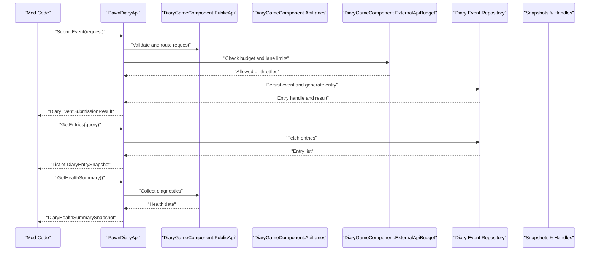
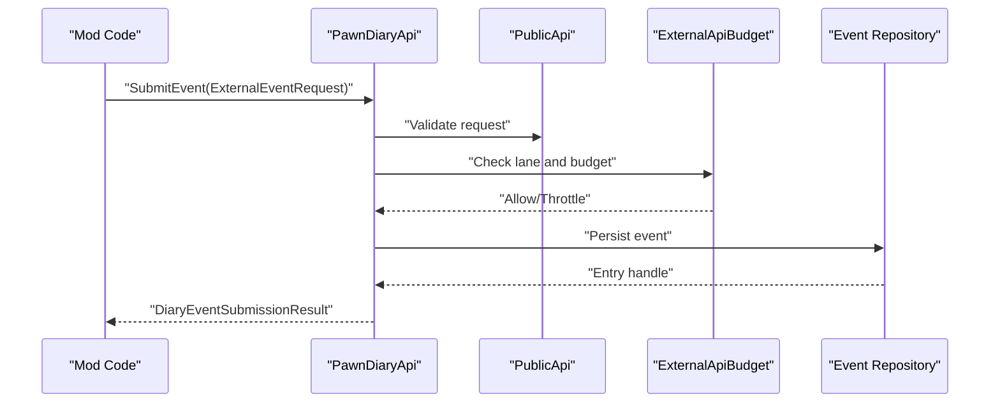
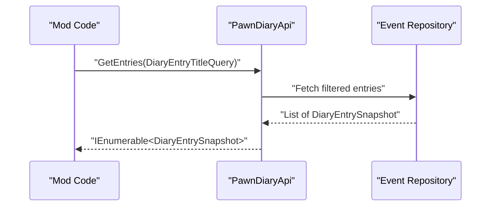
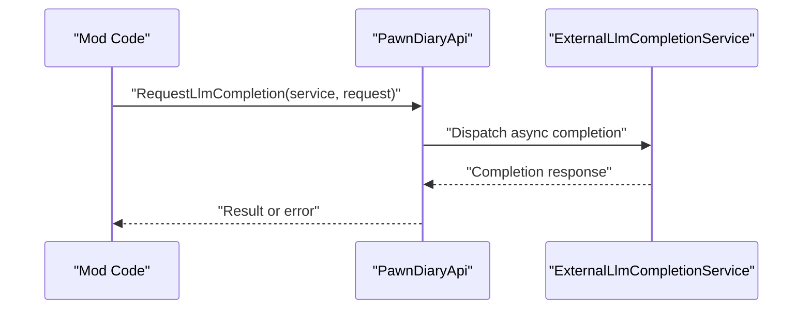
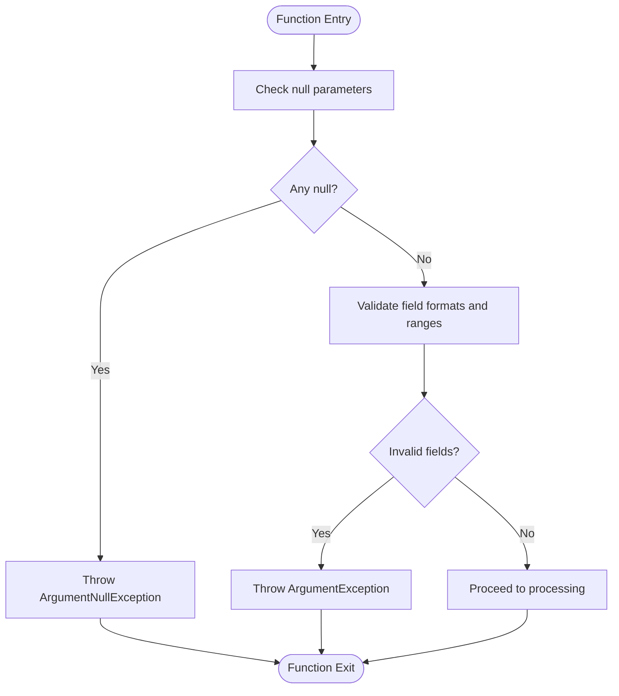

# Core Game APIs

- [PawnDiaryApi.cs](../../../../Source/Integration/PawnDiaryApi.cs)
- [ExternalEventRequest.cs](../../../../Source/Integration/ExternalEventRequest.cs)
- [ExternalDirectEntryRequest.cs](../../../../Source/Integration/ExternalDirectEntryRequest.cs)
- [ExternalPromptEntryRequest.cs](../../../../Source/Integration/ExternalPromptEntryRequest.cs)
- [DiaryEntryHandle.cs](../../../../Source/Integration/DiaryEntryHandle.cs)
- [DiaryEntrySnapshot.cs](../../../../Source/Integration/DiaryEntrySnapshot.cs)
- [DiaryEntryTitleQuery.cs](../../../../Source/Integration/DiaryEntryTitleQuery.cs)
- [DiaryEntryTitleSnapshot.cs](../../../../Source/Integration/DiaryEntryTitleSnapshot.cs)
- [DiaryEventSubmissionResult.cs](../../../../Source/Integration/DiaryEventSubmissionResult.cs)
- [SubmitEventOutcome.cs](../../../../Source/Integration/SubmitEventOutcome.cs)
- [DiaryHealthSummarySnapshot.cs](../../../../Source/Integration/DiaryHealthSummarySnapshot.cs)
- [DiaryPawnSummarySnapshot.cs](../../../../Source/Integration/DiaryPawnSummarySnapshot.cs)
- [DiaryPsychotypeSnapshot.cs](../../../../Source/Integration/DiaryPsychotypeSnapshot.cs)
- [DiaryWritingStyleSnapshot.cs](../../../../Source/Integration/DiaryWritingStyleSnapshot.cs)
- [DiaryContextBundleSnapshot.cs](../../../../Source/Integration/DiaryContextBundleSnapshot.cs)
- [DiaryContextSnapshot.cs](../../../../Source/Integration/DiaryContextSnapshot.cs)
- [DiaryPromptEnchantmentCandidateSnapshot.cs](../../../../Source/Integration/DiaryPromptEnchantmentCandidateSnapshot.cs)
- [DiaryPromptPreviewSnapshot.cs](../../../../Source/Integration/DiaryPromptPreviewSnapshot.cs)
- [ExternalLlmCompletionService.cs](../../../../Source/Integration/ExternalLlmCompletionService.cs)
- [ExternalApiLaneRequest.cs](../../../../Source/Integration/ExternalApiLaneRequest.cs)
- [AddApiLaneResult.cs](../../../../Source/Integration/AddApiLaneResult.cs)
- [CaptureCapabilities.cs](../../../../Source/Integration/CaptureCapabilities.cs)
- [DiaryApiSetupSnapshot.cs](../../../../Source/Integration/DiaryApiSetupSnapshot.cs)
- [EntryStatusListeners.cs](../../../../Source/Integration/EntryStatusListeners.cs)
- [DiaryGameComponent.PublicApi.cs](../../../../Source/Core/DiaryGameComponent.PublicApi.cs)
- [DiaryGameComponent.ApiLanes.cs](../../../../Source/Core/DiaryGameComponent.ApiLanes.cs)
- [DiaryGameComponent.ExternalApiBudget.cs](../../../../Source/Core/DiaryGameComponent.ExternalApiBudget.cs)
## Table of Contents
1. [Introduction](#introduction)
2. [Project Structure](#project-structure)
3. [Core Components](#core-components)
4. [Architecture Overview](#architecture-overview)
5. [Detailed Component Analysis](#detailed-component-analysis)
6. [Dependency Analysis](#dependency-analysis)
7. [Performance Considerations](#performance-considerations)
8. [Troubleshooting Guide](#troubleshooting-guide)
9. [Conclusion](#conclusion)
10. [Appendices](#appendices)

## Introduction
This document provides comprehensive API documentation for the core game interfaces exposed by Pawn Diary, focusing on the public methods available to mods and integrations. It covers event submission, diary entry management, and pawn interaction functions. The goal is to help modders integrate with Pawn Diary safely and efficiently, including guidance on parameter validation, return values, exception handling, thread safety, performance implications, and best practices.

## Project Structure
The public API surface is primarily defined in the Integration layer and implemented within the Core layer. Key files include:
- Public API class and request/response models
- Entry snapshots and handles for querying and managing entries
- Lanes and budgeting for external API usage
- Health and summary snapshots for diagnostics and introspection

```mermaid
graph TB
subgraph "Integration Layer"
A["PawnDiaryApi.cs"]
B["ExternalEventRequest.cs"]
C["ExternalDirectEntryRequest.cs"]
D["ExternalPromptEntryRequest.cs"]
E["DiaryEntryHandle.cs"]
F["DiaryEntrySnapshot.cs"]
G["DiaryEntryTitleQuery.cs"]
H["DiaryEntryTitleSnapshot.cs"]
I["DiaryEventSubmissionResult.cs"]
J["SubmitEventOutcome.cs"]
K["DiaryHealthSummarySnapshot.cs"]
L["DiaryPawnSummarySnapshot.cs"]
M["DiaryPsychotypeSnapshot.cs"]
N["DiaryWritingStyleSnapshot.cs"]
O["DiaryContextBundleSnapshot.cs"]
P["DiaryContextSnapshot.cs"]
Q["DiaryPromptEnchantmentCandidateSnapshot.cs"]
R["DiaryPromptPreviewSnapshot.cs"]
S["ExternalLlmCompletionService.cs"]
T["ExternalApiLaneRequest.cs"]
U["AddApiLaneResult.cs"]
V["CaptureCapabilities.cs"]
W["DiaryApiSetupSnapshot.cs"]
X["EntryStatusListeners.cs"]
end
subgraph "Core Layer"
Y["DiaryGameComponent.PublicApi.cs"]
Z["DiaryGameComponent.ApiLanes.cs"]
AA["DiaryGameComponent.ExternalApiBudget.cs"]
end
A --> Y
A --> Z
A --> AA
A --> B
A --> C
A --> D
A --> E
A --> F
A --> G
A --> H
A --> I
A --> J
A --> K
A --> L
A --> M
A --> N
A --> O
A --> P
A --> Q
A --> R
A --> S
A --> T
A --> U
A --> V
A --> W
A --> X
```

**Diagram sources**
- [PawnDiaryApi.cs](../../../../Source/Integration/PawnDiaryApi.cs)
- [DiaryGameComponent.PublicApi.cs](../../../../Source/Core/DiaryGameComponent.PublicApi.cs)
- [DiaryGameComponent.ApiLanes.cs](../../../../Source/Core/DiaryGameComponent.ApiLanes.cs)
- [DiaryGameComponent.ExternalApiBudget.cs](../../../../Source/Core/DiaryGameComponent.ExternalApiBudget.cs)

**Section sources**
- [PawnDiaryApi.cs](../../../../Source/Integration/PawnDiaryApi.cs)
- [DiaryGameComponent.PublicApi.cs](../../../../Source/Core/DiaryGameComponent.PublicApi.cs)
- [DiaryGameComponent.ApiLanes.cs](../../../../Source/Core/DiaryGameComponent.ApiLanes.cs)
- [DiaryGameComponent.ExternalApiBudget.cs](../../../../Source/Core/DiaryGameComponent.ExternalApiBudget.cs)

## Core Components
This section summarizes the primary components that expose the public API surface.

- PawnDiaryApi: The main facade providing methods for submitting events, creating direct or prompt-based entries, querying entries, and accessing diagnostic and introspection data.
- Request Models: ExternalEventRequest, ExternalDirectEntryRequest, ExternalPromptEntryRequest define payloads for submissions.
- Response Models: DiaryEventSubmissionResult, SubmitEventOutcome, various snapshot types (entry, title, health, pawn, psychotype, writing style, context, prompt preview).
- Handles and Listeners: DiaryEntryHandle for referencing created entries; EntryStatusListeners for observing status changes.
- Lanes and Budgeting: ExternalApiLaneRequest, AddApiLaneResult, CaptureCapabilities, DiaryApiSetupSnapshot for lane registration and capability discovery.
- LLM Completion: ExternalLlmCompletionService for asynchronous completion requests.

**Section sources**
- [PawnDiaryApi.cs](../../../../Source/Integration/PawnDiaryApi.cs)
- [ExternalEventRequest.cs](../../../../Source/Integration/ExternalEventRequest.cs)
- [ExternalDirectEntryRequest.cs](../../../../Source/Integration/ExternalDirectEntryRequest.cs)
- [ExternalPromptEntryRequest.cs](../../../../Source/Integration/ExternalPromptEntryRequest.cs)
- [DiaryEntryHandle.cs](../../../../Source/Integration/DiaryEntryHandle.cs)
- [DiaryEntrySnapshot.cs](../../../../Source/Integration/DiaryEntrySnapshot.cs)
- [DiaryEntryTitleQuery.cs](../../../../Source/Integration/DiaryEntryTitleQuery.cs)
- [DiaryEntryTitleSnapshot.cs](../../../../Source/Integration/DiaryEntryTitleSnapshot.cs)
- [DiaryEventSubmissionResult.cs](../../../../Source/Integration/DiaryEventSubmissionResult.cs)
- [SubmitEventOutcome.cs](../../../../Source/Integration/SubmitEventOutcome.cs)
- [DiaryHealthSummarySnapshot.cs](../../../../Source/Integration/DiaryHealthSummarySnapshot.cs)
- [DiaryPawnSummarySnapshot.cs](../../../../Source/Integration/DiaryPawnSummarySnapshot.cs)
- [DiaryPsychotypeSnapshot.cs](../../../../Source/Integration/DiaryPsychotypeSnapshot.cs)
- [DiaryWritingStyleSnapshot.cs](../../../../Source/Integration/DiaryWritingStyleSnapshot.cs)
- [DiaryContextBundleSnapshot.cs](../../../../Source/Integration/DiaryContextBundleSnapshot.cs)
- [DiaryContextSnapshot.cs](../../../../Source/Integration/DiaryContextSnapshot.cs)
- [DiaryPromptEnchantmentCandidateSnapshot.cs](../../../../Source/Integration/DiaryPromptEnchantmentCandidateSnapshot.cs)
- [DiaryPromptPreviewSnapshot.cs](../../../../Source/Integration/DiaryPromptPreviewSnapshot.cs)
- [ExternalLlmCompletionService.cs](../../../../Source/Integration/ExternalLlmCompletionService.cs)
- [ExternalApiLaneRequest.cs](../../../../Source/Integration/ExternalApiLaneRequest.cs)
- [AddApiLaneResult.cs](../../../../Source/Integration/AddApiLaneResult.cs)
- [CaptureCapabilities.cs](../../../../Source/Integration/CaptureCapabilities.cs)
- [DiaryApiSetupSnapshot.cs](../../../../Source/Integration/DiaryApiSetupSnapshot.cs)
- [EntryStatusListeners.cs](../../../../Source/Integration/EntryStatusListeners.cs)

## Architecture Overview
The public API is a facade over internal processing pipelines. Submissions are validated, routed through lanes, subject to budget controls, and then processed into diary entries. Queries return snapshots of entries and related metadata. Diagnostic endpoints provide health and setup information.

**Diagram sources**
- [PawnDiaryApi.cs](../../../../Source/Integration/PawnDiaryApi.cs)
- [DiaryGameComponent.PublicApi.cs](../../../../Source/Core/DiaryGameComponent.PublicApi.cs)
- [DiaryGameComponent.ApiLanes.cs](../../../../Source/Core/DiaryGameComponent.ApiLanes.cs)
- [DiaryGameComponent.ExternalApiBudget.cs](../../../../Source/Core/DiaryGameComponent.ExternalApiBudget.cs)

## Detailed Component Analysis

### PawnDiaryApi Class
The central facade exposes methods for:
- Event submission via structured requests
- Direct text entry creation
- Prompt-driven entry generation
- Querying entries and titles
- Accessing diagnostics and capabilities
- Managing lanes and listeners

Key responsibilities:
- Parameter validation and normalization
- Routing to appropriate lanes
- Enforcing external API budgets
- Returning typed results and snapshots
- Providing thread-safe access patterns

Method categories:
- Event Submission
  - SubmitEvent(ExternalEventRequest): Validates payload, checks lane and budget, persists event, returns DiaryEventSubmissionResult.
  - SubmitDirectEntry(ExternalDirectEntryRequest): Creates a direct diary entry without prompts, returns handle and result.
  - SubmitPromptEntry(ExternalPromptEntryRequest): Generates an entry using prompts and context, returns handle and result.
- Entry Management
  - GetEntries(DiaryEntryTitleQuery): Returns filtered list of DiaryEntrySnapshot based on query criteria.
  - GetEntryTitle(DiaryEntryTitleQuery): Returns a single DiaryEntryTitleSnapshot matching the query.
  - GetEntryHandle(id): Resolves a DiaryEntryHandle for further operations or status observation.
- Pawn Interaction and Diagnostics
  - GetHealthSummary(): Returns DiaryHealthSummarySnapshot for system health.
  - GetPawnSummary(pawnId): Returns DiaryPawnSummarySnapshot for a specific pawn’s state.
  - GetPsychotypeSnapshot(pawnId): Returns DiaryPsychotypeSnapshot describing psychotype details.
  - GetWritingStyleSnapshot(pawnId): Returns DiaryWritingStyleSnapshot for writing style configuration.
  - GetContextBundle(pawnId): Returns DiaryContextBundleSnapshot containing contextual data.
  - GetContextSnapshot(pawnId): Returns DiaryContextSnapshot for current narrative context.
  - GetPromptEnchantmentCandidates(pawnId): Returns list of DiaryPromptEnchantmentCandidateSnapshot.
  - PreviewPrompt(promptData): Returns DiaryPromptPreviewSnapshot for prompt evaluation.
- Lanes and Capabilities
  - AddApiLane(ExternalApiLaneRequest): Registers a custom lane and returns AddApiLaneResult.
  - GetCaptureCapabilities(): Returns CaptureCapabilities indicating supported features.
  - GetApiSetupSnapshot(): Returns DiaryApiSetupSnapshot describing configured lanes and settings.
- Status and Events
  - SubscribeToEntryStatus(listener): Adds a listener via EntryStatusListeners for status updates.
  - UnsubscribeFromEntryStatus(listener): Removes a previously added listener.
- LLM Completion
  - RequestLlmCompletion(service, request): Uses ExternalLlmCompletionService to perform async completion.

Parameter validation highlights:
- Null checks for required fields (e.g., pawn identifiers, request payloads).
- Range and format constraints for timestamps, IDs, and text lengths.
- Lane existence and permission checks before processing.

Return values:
- DiaryEventSubmissionResult indicates success/failure and includes entry references.
- Snapshot objects encapsulate read-only views of entries, contexts, and configurations.
- Handles allow subsequent operations like status observation.

Exception handling:
- Throws on invalid parameters or missing resources.
- May throw when lanes are misconfigured or budgets are exceeded.
- Wraps underlying errors with descriptive messages for debugging.

Thread safety:
- Methods are designed to be called from multiple threads; internal synchronization ensures consistency.
- Avoid holding long-lived references to mutable state returned by snapshots.

Best practices:
- Batch queries where possible to reduce overhead.
- Respect budget limits and back off on throttling.
- Use handles and listeners for reactive updates rather than polling.

**Section sources**
- [PawnDiaryApi.cs](../../../../Source/Integration/PawnDiaryApi.cs)
- [DiaryGameComponent.PublicApi.cs](../../../../Source/Core/DiaryGameComponent.PublicApi.cs)
- [DiaryGameComponent.ApiLanes.cs](../../../../Source/Core/DiaryGameComponent.ApiLanes.cs)
- [DiaryGameComponent.ExternalApiBudget.cs](../../../../Source/Core/DiaryGameComponent.ExternalApiBudget.cs)

### Data Models and Snapshots
These models represent inputs and outputs for the API. They are immutable views intended for safe consumption across threads.

- ExternalEventRequest: Defines event type, timestamp, pawn reference, and contextual fields.
- ExternalDirectEntryRequest: Provides raw text and attribution for direct entries.
- ExternalPromptEntryRequest: Supplies prompt templates, variables, and context for generation.
- DiaryEntryHandle: References a persisted entry for later inspection or status monitoring.
- DiaryEntrySnapshot: Read-only representation of a diary entry, including metadata and content.
- DiaryEntryTitleQuery: Filters and sorts queries for entries and titles.
- DiaryEntryTitleSnapshot: Lightweight title-level info used in listings.
- DiaryEventSubmissionResult: Outcome of submission including status and entry references.
- SubmitEventOutcome: Enumerated outcome codes for detailed reporting.
- DiaryHealthSummarySnapshot: System-wide health indicators and metrics.
- DiaryPawnSummarySnapshot: Summary of a pawn’s diary-related state.
- DiaryPsychotypeSnapshot: Psychotype resolution and traits.
- DiaryWritingStyleSnapshot: Writing style overrides and preferences.
- DiaryContextBundleSnapshot: Aggregated context bundle for a pawn.
- DiaryContextSnapshot: Current narrative context snapshot.
- DiaryPromptEnchantmentCandidateSnapshot: Candidates for prompt enchantments.
- DiaryPromptPreviewSnapshot: Preview of generated prompt output.
- ExternalLlmCompletionService: Interface for requesting LLM completions asynchronously.
- ExternalApiLaneRequest: Definition for registering custom lanes.
- AddApiLaneResult: Result of lane registration including status and warnings.
- CaptureCapabilities: Feature flags indicating supported capture behaviors.
- DiaryApiSetupSnapshot: Configuration overview for lanes and integrations.
- EntryStatusListeners: Registry for subscribing/unsubscribing to entry status changes.

Usage examples (descriptive):
- Submitting an event: Build an ExternalEventRequest with a valid pawn ID and event type, call SubmitEvent, and inspect DiaryEventSubmissionResult for success or error details.
- Creating a direct entry: Provide ExternalDirectEntryRequest with text and attribution, call SubmitDirectEntry, and use the returned handle to monitor status.
- Generating via prompts: Construct ExternalPromptEntryRequest with template and variables, call SubmitPromptEntry, and review DiaryPromptPreviewSnapshot if needed.
- Querying entries: Create a DiaryEntryTitleQuery with filters (e.g., date range, pawn), call GetEntries, and iterate over DiaryEntrySnapshot items.
- Observing status: Register a listener via SubscribeToEntryStatus and process updates; unsubscribe when done.

**Section sources**
- [ExternalEventRequest.cs](../../../../Source/Integration/ExternalEventRequest.cs)
- [ExternalDirectEntryRequest.cs](../../../../Source/Integration/ExternalDirectEntryRequest.cs)
- [ExternalPromptEntryRequest.cs](../../../../Source/Integration/ExternalPromptEntryRequest.cs)
- [DiaryEntryHandle.cs](../../../../Source/Integration/DiaryEntryHandle.cs)
- [DiaryEntrySnapshot.cs](../../../../Source/Integration/DiaryEntrySnapshot.cs)
- [DiaryEntryTitleQuery.cs](../../../../Source/Integration/DiaryEntryTitleQuery.cs)
- [DiaryEntryTitleSnapshot.cs](../../../../Source/Integration/DiaryEntryTitleSnapshot.cs)
- [DiaryEventSubmissionResult.cs](../../../../Source/Integration/DiaryEventSubmissionResult.cs)
- [SubmitEventOutcome.cs](../../../../Source/Integration/SubmitEventOutcome.cs)
- [DiaryHealthSummarySnapshot.cs](../../../../Source/Integration/DiaryHealthSummarySnapshot.cs)
- [DiaryPawnSummarySnapshot.cs](../../../../Source/Integration/DiaryPawnSummarySnapshot.cs)
- [DiaryPsychotypeSnapshot.cs](../../../../Source/Integration/DiaryPsychotypeSnapshot.cs)
- [DiaryWritingStyleSnapshot.cs](../../../../Source/Integration/DiaryWritingStyleSnapshot.cs)
- [DiaryContextBundleSnapshot.cs](../../../../Source/Integration/DiaryContextBundleSnapshot.cs)
- [DiaryContextSnapshot.cs](../../../../Source/Integration/DiaryContextSnapshot.cs)
- [DiaryPromptEnchantmentCandidateSnapshot.cs](../../../../Source/Integration/DiaryPromptEnchantmentCandidateSnapshot.cs)
- [DiaryPromptPreviewSnapshot.cs](../../../../Source/Integration/DiaryPromptPreviewSnapshot.cs)
- [ExternalLlmCompletionService.cs](../../../../Source/Integration/ExternalLlmCompletionService.cs)
- [ExternalApiLaneRequest.cs](../../../../Source/Integration/ExternalApiLaneRequest.cs)
- [AddApiLaneResult.cs](../../../../Source/Integration/AddApiLaneResult.cs)
- [CaptureCapabilities.cs](../../../../Source/Integration/CaptureCapabilities.cs)
- [DiaryApiSetupSnapshot.cs](../../../../Source/Integration/DiaryApiSetupSnapshot.cs)
- [EntryStatusListeners.cs](../../../../Source/Integration/EntryStatusListeners.cs)

### Sequence Diagrams for Common Workflows

#### Submit Event Workflow

**Diagram sources**
- [PawnDiaryApi.cs](../../../../Source/Integration/PawnDiaryApi.cs)
- [DiaryGameComponent.PublicApi.cs](../../../../Source/Core/DiaryGameComponent.PublicApi.cs)
- [DiaryGameComponent.ExternalApiBudget.cs](../../../../Source/Core/DiaryGameComponent.ExternalApiBudget.cs)

#### Query Entries Workflow

**Diagram sources**
- [PawnDiaryApi.cs](../../../../Source/Integration/PawnDiaryApi.cs)

#### LLM Completion Workflow

**Diagram sources**
- [PawnDiaryApi.cs](../../../../Source/Integration/PawnDiaryApi.cs)
- [ExternalLlmCompletionService.cs](../../../../Source/Integration/ExternalLlmCompletionService.cs)

### Flowchart for Parameter Validation

[No sources needed since this diagram shows conceptual workflow, not actual code structure]

## Dependency Analysis
The public API depends on core components for routing, budgeting, and persistence. It also composes snapshot models and services for diagnostics and LLM interactions.

```mermaid
classDiagram
class PawnDiaryApi {
+SubmitEvent(request)
+SubmitDirectEntry(request)
+SubmitPromptEntry(request)
+GetEntries(query)
+GetEntryTitle(query)
+GetEntryHandle(id)
+GetHealthSummary()
+GetPawnSummary(pawnId)
+GetPsychotypeSnapshot(pawnId)
+GetWritingStyleSnapshot(pawnId)
+GetContextBundle(pawnId)
+GetContextSnapshot(pawnId)
+GetPromptEnchantmentCandidates(pawnId)
+PreviewPrompt(data)
+AddApiLane(request)
+GetCaptureCapabilities()
+GetApiSetupSnapshot()
+SubscribeToEntryStatus(listener)
+UnsubscribeFromEntryStatus(listener)
+RequestLlmCompletion(service, request)
}
class ExternalEventRequest
class ExternalDirectEntryRequest
class ExternalPromptEntryRequest
class DiaryEntryHandle
class DiaryEntrySnapshot
class DiaryEntryTitleQuery
class DiaryEntryTitleSnapshot
class DiaryEventSubmissionResult
class SubmitEventOutcome
class DiaryHealthSummarySnapshot
class DiaryPawnSummarySnapshot
class DiaryPsychotypeSnapshot
class DiaryWritingStyleSnapshot
class DiaryContextBundleSnapshot
class DiaryContextSnapshot
class DiaryPromptEnchantmentCandidateSnapshot
class DiaryPromptPreviewSnapshot
class ExternalLlmCompletionService
class ExternalApiLaneRequest
class AddApiLaneResult
class CaptureCapabilities
class DiaryApiSetupSnapshot
class EntryStatusListeners
PawnDiaryApi --> ExternalEventRequest : "uses"
PawnDiaryApi --> ExternalDirectEntryRequest : "uses"
PawnDiaryApi --> ExternalPromptEntryRequest : "uses"
PawnDiaryApi --> DiaryEntryHandle : "returns"
PawnDiaryApi --> DiaryEntrySnapshot : "returns"
PawnDiaryApi --> DiaryEntryTitleQuery : "uses"
PawnDiaryApi --> DiaryEntryTitleSnapshot : "returns"
PawnDiaryApi --> DiaryEventSubmissionResult : "returns"
PawnDiaryApi --> SubmitEventOutcome : "uses"
PawnDiaryApi --> DiaryHealthSummarySnapshot : "returns"
PawnDiaryApi --> DiaryPawnSummarySnapshot : "returns"
PawnDiaryApi --> DiaryPsychotypeSnapshot : "returns"
PawnDiaryApi --> DiaryWritingStyleSnapshot : "returns"
PawnDiaryApi --> DiaryContextBundleSnapshot : "returns"
PawnDiaryApi --> DiaryContextSnapshot : "returns"
PawnDiaryApi --> DiaryPromptEnchantmentCandidateSnapshot : "returns"
PawnDiaryApi --> DiaryPromptPreviewSnapshot : "returns"
PawnDiaryApi --> ExternalLlmCompletionService : "delegates"
PawnDiaryApi --> ExternalApiLaneRequest : "uses"
PawnDiaryApi --> AddApiLaneResult : "returns"
PawnDiaryApi --> CaptureCapabilities : "returns"
PawnDiaryApi --> DiaryApiSetupSnapshot : "returns"
PawnDiaryApi --> EntryStatusListeners : "manages"
```

**Diagram sources**
- [PawnDiaryApi.cs](../../../../Source/Integration/PawnDiaryApi.cs)
- [ExternalEventRequest.cs](../../../../Source/Integration/ExternalEventRequest.cs)
- [ExternalDirectEntryRequest.cs](../../../../Source/Integration/ExternalDirectEntryRequest.cs)
- [ExternalPromptEntryRequest.cs](../../../../Source/Integration/ExternalPromptEntryRequest.cs)
- [DiaryEntryHandle.cs](../../../../Source/Integration/DiaryEntryHandle.cs)
- [DiaryEntrySnapshot.cs](../../../../Source/Integration/DiaryEntrySnapshot.cs)
- [DiaryEntryTitleQuery.cs](../../../../Source/Integration/DiaryEntryTitleQuery.cs)
- [DiaryEntryTitleSnapshot.cs](../../../../Source/Integration/DiaryEntryTitleSnapshot.cs)
- [DiaryEventSubmissionResult.cs](../../../../Source/Integration/DiaryEventSubmissionResult.cs)
- [SubmitEventOutcome.cs](../../../../Source/Integration/SubmitEventOutcome.cs)
- [DiaryHealthSummarySnapshot.cs](../../../../Source/Integration/DiaryHealthSummarySnapshot.cs)
- [DiaryPawnSummarySnapshot.cs](../../../../Source/Integration/DiaryPawnSummarySnapshot.cs)
- [DiaryPsychotypeSnapshot.cs](../../../../Source/Integration/DiaryPsychotypeSnapshot.cs)
- [DiaryWritingStyleSnapshot.cs](../../../../Source/Integration/DiaryWritingStyleSnapshot.cs)
- [DiaryContextBundleSnapshot.cs](../../../../Source/Integration/DiaryContextBundleSnapshot.cs)
- [DiaryContextSnapshot.cs](../../../../Source/Integration/DiaryContextSnapshot.cs)
- [DiaryPromptEnchantmentCandidateSnapshot.cs](../../../../Source/Integration/DiaryPromptEnchantmentCandidateSnapshot.cs)
- [DiaryPromptPreviewSnapshot.cs](../../../../Source/Integration/DiaryPromptPreviewSnapshot.cs)
- [ExternalLlmCompletionService.cs](../../../../Source/Integration/ExternalLlmCompletionService.cs)
- [ExternalApiLaneRequest.cs](../../../../Source/Integration/ExternalApiLaneRequest.cs)
- [AddApiLaneResult.cs](../../../../Source/Integration/AddApiLaneResult.cs)
- [CaptureCapabilities.cs](../../../../Source/Integration/CaptureCapabilities.cs)
- [DiaryApiSetupSnapshot.cs](../../../../Source/Integration/DiaryApiSetupSnapshot.cs)
- [EntryStatusListeners.cs](../../../../Source/Integration/EntryStatusListeners.cs)

**Section sources**
- [PawnDiaryApi.cs](../../../../Source/Integration/PawnDiaryApi.cs)
- [ExternalEventRequest.cs](../../../../Source/Integration/ExternalEventRequest.cs)
- [ExternalDirectEntryRequest.cs](../../../../Source/Integration/ExternalDirectEntryRequest.cs)
- [ExternalPromptEntryRequest.cs](../../../../Source/Integration/ExternalPromptEntryRequest.cs)
- [DiaryEntryHandle.cs](../../../../Source/Integration/DiaryEntryHandle.cs)
- [DiaryEntrySnapshot.cs](../../../../Source/Integration/DiaryEntrySnapshot.cs)
- [DiaryEntryTitleQuery.cs](../../../../Source/Integration/DiaryEntryTitleQuery.cs)
- [DiaryEntryTitleSnapshot.cs](../../../../Source/Integration/DiaryEntryTitleSnapshot.cs)
- [DiaryEventSubmissionResult.cs](../../../../Source/Integration/DiaryEventSubmissionResult.cs)
- [SubmitEventOutcome.cs](../../../../Source/Integration/SubmitEventOutcome.cs)
- [DiaryHealthSummarySnapshot.cs](../../../../Source/Integration/DiaryHealthSummarySnapshot.cs)
- [DiaryPawnSummarySnapshot.cs](../../../../Source/Integration/DiaryPawnSummarySnapshot.cs)
- [DiaryPsychotypeSnapshot.cs](../../../../Source/Integration/DiaryPsychotypeSnapshot.cs)
- [DiaryWritingStyleSnapshot.cs](../../../../Source/Integration/DiaryWritingStyleSnapshot.cs)
- [DiaryContextBundleSnapshot.cs](../../../../Source/Integration/DiaryContextBundleSnapshot.cs)
- [DiaryContextSnapshot.cs](../../../../Source/Integration/DiaryContextSnapshot.cs)
- [DiaryPromptEnchantmentCandidateSnapshot.cs](../../../../Source/Integration/DiaryPromptEnchantmentCandidateSnapshot.cs)
- [DiaryPromptPreviewSnapshot.cs](../../../../Source/Integration/DiaryPromptPreviewSnapshot.cs)
- [ExternalLlmCompletionService.cs](../../../../Source/Integration/ExternalLlmCompletionService.cs)
- [ExternalApiLaneRequest.cs](../../../../Source/Integration/ExternalApiLaneRequest.cs)
- [AddApiLaneResult.cs](../../../../Source/Integration/AddApiLaneResult.cs)
- [CaptureCapabilities.cs](../../../../Source/Integration/CaptureCapabilities.cs)
- [DiaryApiSetupSnapshot.cs](../../../../Source/Integration/DiaryApiSetupSnapshot.cs)
- [EntryStatusListeners.cs](../../../../Source/Integration/EntryStatusListeners.cs)

## Performance Considerations
- Prefer batched queries using DiaryEntryTitleQuery to minimize repeated calls.
- Avoid excessive polling; subscribe to EntryStatusListeners for efficient updates.
- Respect external API budget limits; implement exponential backoff on throttling.
- Reuse handles and snapshots; do not mutate them after retrieval.
- Keep prompt payloads concise to reduce generation overhead.
- Cache diagnostic snapshots sparingly; they may change frequently.

[No sources needed since this section provides general guidance]

## Troubleshooting Guide
Common issues and resolutions:
- Parameter validation failures: Ensure all required fields are non-null and within expected ranges. Review ArgumentException messages for specifics.
- Lane misconfiguration: Verify lane registration via AddApiLaneResult and inspect DiaryApiSetupSnapshot for active lanes.
- Budget exceeded: Monitor throttle responses and adjust submission frequency or lane quotas.
- Missing entries: Confirm pawn IDs and time filters in DiaryEntryTitleQuery; check repository availability via DiaryHealthSummarySnapshot.
- Listener leaks: Always unsubscribe from EntryStatusListeners when no longer needed to prevent memory growth.

**Section sources**
- [PawnDiaryApi.cs](../../../../Source/Integration/PawnDiaryApi.cs)
- [DiaryHealthSummarySnapshot.cs](../../../../Source/Integration/DiaryHealthSummarySnapshot.cs)
- [DiaryApiSetupSnapshot.cs](../../../../Source/Integration/DiaryApiSetupSnapshot.cs)
- [EntryStatusListeners.cs](../../../../Source/Integration/EntryStatusListeners.cs)

## Conclusion
Pawn Diary’s public API provides a robust, thread-safe interface for integrating external systems with the game’s diary functionality. By adhering to parameter validation rules, respecting budget constraints, and leveraging snapshots and listeners, modders can achieve reliable and performant integrations. Use the provided models and diagnostics to build resilient workflows and maintain compatibility across updates.

[No sources needed since this section summarizes without analyzing specific files]

## Appendices

### Practical Examples (Descriptive)
- Submitting an event:
  - Construct ExternalEventRequest with a valid pawn identifier and event type.
  - Call SubmitEvent and handle DiaryEventSubmissionResult for success or error details.
- Creating a direct entry:
  - Build ExternalDirectEntryRequest with text and attribution.
  - Call SubmitDirectEntry and use the returned DiaryEntryHandle to observe status.
- Generating via prompts:
  - Prepare ExternalPromptEntryRequest with template and variables.
  - Call SubmitPromptEntry and optionally preview using PreviewPrompt.
- Querying entries:
  - Define DiaryEntryTitleQuery with filters such as date range and pawn.
  - Call GetEntries and iterate over DiaryEntrySnapshot items.
- Observing status:
  - Register a listener via SubscribeToEntryStatus and process updates.
  - Unsubscribe via UnsubscribeFromEntryStatus when finished.

[No sources needed since this section doesn't analyze specific files]
