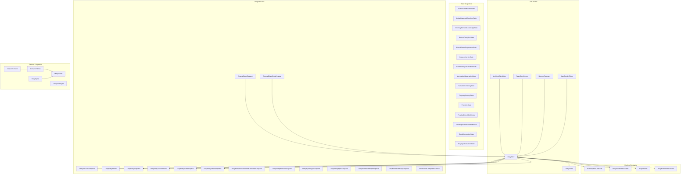
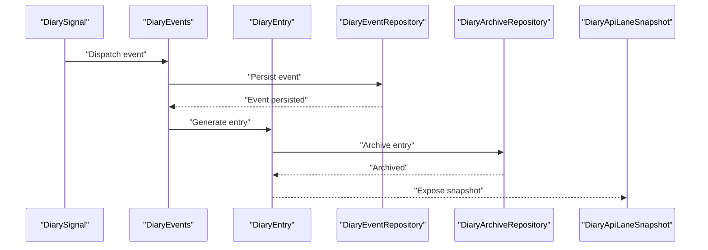
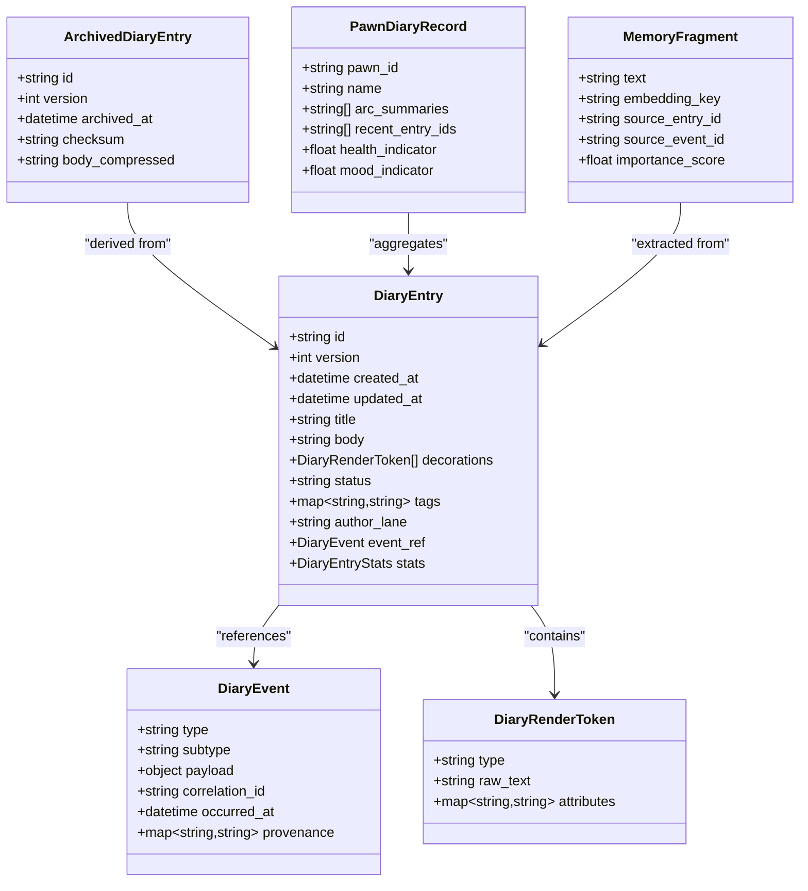
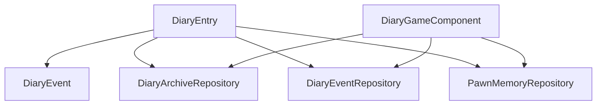

# Data Models & Types

## Table of Contents
1. [Introduction](#introduction)
2. [Project Structure](#project-structure)
3. [Core Components](#core-components)
4. [Architecture Overview](#architecture-overview)
5. [Detailed Component Analysis](#detailed-component-analysis)
6. [Dependency Analysis](#dependency-analysis)
7. [Performance Considerations](#performance-considerations)
8. [Troubleshooting Guide](#troubleshooting-guide)
9. [Conclusion](#conclusion)
10. [Appendices](#appendices)

## Introduction
This document provides comprehensive documentation for all data models and type definitions used throughout the Pawn Diary API. It covers core domain entities, state snapshots, pipeline contracts, integration request/response types, and serialization considerations. The goal is to help developers understand the shape of data flowing through the system, how it is versioned and normalized, and how to manipulate it efficiently at scale.

## Project Structure
The data model surface spans several layers:
- Core runtime models (in-memory persistence and rendering)
- State snapshots (for save/load and external consumption)
- Pipeline contracts (generation, prompts, text decoration)
- Integration API requests and snapshots (external consumers)
- Capture and ingestion payloads (event signals and event data)

**Diagram sources**
- [DiaryEntry.cs](../../../../Source/Models/DiaryEntry.cs)
- [DiaryEvent.cs](../../../../Source/Models/DiaryEvent.cs)
- [ArchivedDiaryEntry.cs](../../../../Source/Models/ArchivedDiaryEntry.cs)
- [PawnDiaryRecord.cs](../../../../Source/Models/PawnDiaryRecord.cs)
- [MemoryFragment.cs](../../../../Source/Models/MemoryFragment.cs)
- [DiaryRenderToken.cs](../../../../Source/Models/DiaryRenderToken.cs)
- [ActiveEventWindowState.cs](../../../../Source/Models/ActiveEventWindowState.cs)
- [ActiveObservedConditionState.cs](../../../../Source/Models/ActiveObservedConditionState.cs)
- [AnomalyMonolithKnowledgeState.cs](../../../../Source/Models/AnomalyMonolithKnowledgeState.cs)
- [BiotechFamilyArcState.cs](../../../../Source/Models/BiotechFamilyArcState.cs)
- [BiotechPawnProgressionState.cs](../../../../Source/Models/BiotechPawnProgressionState.cs)
- [CreepJoinerArcState.cs](../../../../Source/Models/CreepJoinerArcState.cs)
- [GeneIdentityObservationState.cs](../../../../Source/Models/GeneIdentityObservationState.cs)
- [MechanitorObservationState.cs](../../../../Source/Models/MechanitorObservationState.cs)
- [NarrativeContinuityState.cs](../../../../Source/Models/NarrativeContinuityState.cs)
- [OdysseyJourneyState.cs](../../../../Source/Models/OdysseyJourneyState.cs)
- [PawnArcState.cs](../../../../Source/Models/PawnArcState.cs)
- [PendingBiotechBirthState.cs](../../../../Source/Models/PendingBiotechBirthState.cs)
- [PendingBiotechGrowthMoment.cs](../../../../Source/Models/PendingBiotechGrowthMoment.cs)
- [RoyalSuccessionState.cs](../../../../Source/Models/RoyalSuccessionState.cs)
- [RoyaltyObservationState.cs](../../../../Source/Models/RoyaltyObservationState.cs)
- [DiaryPipelineContracts.cs](../../../../Source/Pipeline/DiaryPipelineContracts.cs)
- [DiarySaveNormalization.cs](../../../../Source/Pipeline/DiarySaveNormalization.cs)
- [DiaryListText.cs](../../../../Source/Pipeline/DiaryListText.cs)
- [DiaryRichTextDecorators.cs](../../../../Source/Pipeline/DiaryRichTextDecorators.cs)
- [ExternalEventRequest.cs](../../../../Source/Integration/ExternalEventRequest.cs)
- [ExternalDirectEntryRequest.cs](../../../../Source/Integration/ExternalDirectEntryRequest.cs)
- [DiaryApiLaneSnapshot.cs](../../../../Source/Integration/DiaryApiLaneSnapshot.cs)
- [DiaryEntryHandle.cs](../../../../Source/Integration/DiaryEntryHandle.cs)
- [DiaryEntrySnapshot.cs](../../../../Source/Integration/DiaryEntrySnapshot.cs)
- [DiaryEntryTitleSnapshot.cs](../../../../Source/Integration/DiaryEntryTitleSnapshot.cs)
- [DiaryEntryStatsSnapshot.cs](../../../../Source/Integration/DiaryEntryStatsSnapshot.cs)
- [DiaryEntryStatusSnapshot.cs](../../../../Source/Integration/DiaryEntryStatusSnapshot.cs)
- [DiaryPromptEnchantmentCandidateSnapshot.cs](../../../../Source/Integration/DiaryPromptEnchantmentCandidateSnapshot.cs)
- [DiaryPromptPreviewSnapshot.cs](../../../../Source/Integration/DiaryPromptPreviewSnapshot.cs)
- [DiaryPsychotypeSnapshot.cs](../../../../Source/Integration/DiaryPsychotypeSnapshot.cs)
- [DiaryWritingStyleSnapshot.cs](../../../../Source/Integration/DiaryWritingStyleSnapshot.cs)
- [DiaryHealthSummarySnapshot.cs](../../../../Source/Integration/DiaryHealthSummarySnapshot.cs)
- [DiaryPawnSummarySnapshot.cs](../../../../Source/Integration/DiaryPawnSummarySnapshot.cs)
- [ExternalLlmCompletionService.cs](../../../../Source/Integration/ExternalLlmCompletionService.cs)
- [CaptureContext.cs](../../../../Source/Capture/CaptureContext.cs)
- [DiaryEventData.cs](../../../../Source/Capture/DiaryEventData.cs)
- [DiaryEventType.cs](../../../../Source/Capture/DiaryEventType.cs)
- [DiarySignal.cs](../../../../Source/Ingestion/DiarySignal.cs)
- [DiaryEvents.cs](../../../../Source/Ingestion/DiaryEvents.cs)

**Section sources**
- [DiaryEntry.cs](../../../../Source/Models/DiaryEntry.cs)
- [DiaryEvent.cs](../../../../Source/Models/DiaryEvent.cs)
- [DiaryPipelineContracts.cs](../../../../Source/Pipeline/DiaryPipelineContracts.cs)
- [DiarySaveNormalization.cs](../../../../Source/Pipeline/DiarySaveNormalization.cs)
- [ExternalEventRequest.cs](../../../../Source/Integration/ExternalEventRequest.cs)
- [ExternalDirectEntryRequest.cs](../../../../Source/Integration/ExternalDirectEntryRequest.cs)
- [DiaryApiLaneSnapshot.cs](../../../../Source/Integration/DiaryApiLaneSnapshot.cs)
- [CaptureContext.cs](../../../../Source/Capture/CaptureContext.cs)
- [DiaryEventData.cs](../../../../Source/Capture/DiaryEventData.cs)
- [DiaryEventType.cs](../../../../Source/Capture/DiaryEventType.cs)
- [DiarySignal.cs](../../../../Source/Ingestion/DiarySignal.cs)
- [DiaryEvents.cs](../../../../Source/Ingestion/DiaryEvents.cs)

## Core Components
This section documents the primary data structures that represent diary entries, events, and related metadata.

### DiaryEntry
Represents a single rendered diary entry with its content, metadata, and associated event.

Key fields and semantics:
- Identifier and versioning: stable ID for persistence and references; version field for evolution and migration.
- Timestamps: creation time, last modified time, and optional archival timestamps.
- Content: title, body text, and structured decorations or tokens for rich formatting.
- Event linkage: reference to the originating event and context snapshot.
- Status and lifecycle: draft, published, archived, deleted states.
- Statistics: word count, token usage, generation latency metrics.
- Tags and categories: classification for filtering and search.
- Authorship and attribution: source lane, external provider, or internal generator.

Validation rules:
- Non-empty identifiers and required timestamps.
- Title length limits and sanitization.
- Body text normalization and truncation policies.
- Consistency between status transitions and timestamps.

Serialization format:
- JSON-based representation with explicit version discriminator.
- Backward-compatible by allowing unknown fields to be ignored during deserialization.
- Optional compression for large bodies when persisted.

Backward compatibility guarantees:
- New fields are additive only.
- Versioned deserializers skip unknown fields.
- Default values provided for optional fields.

Common manipulation patterns:
- Append-only updates via new versions.
- Filtering by tags, date ranges, and status.
- Aggregation of statistics across batches.

Performance tips:
- Stream large bodies instead of loading fully into memory.
- Use indexes on frequently filtered fields (date, tags).
- Cache computed statistics and invalidate on write.

**Section sources**
- [DiaryEntry.cs](../../../../Source/Models/DiaryEntry.cs)
- [DiaryPipelineContracts.cs](../../../../Source/Pipeline/DiaryPipelineContracts.cs)
- [DiarySaveNormalization.cs](../../../../Source/Pipeline/DiarySaveNormalization.cs)

### DiaryEvent
Encapsulates an event that triggered diary generation, including payload and provenance.

Key fields and semantics:
- Event type discriminator and subtype.
- Payload: structured data describing the event specifics.
- Provenance: source mod, signal origin, and correlation IDs.
- Timing: occurrence timestamp and processing timestamps.
- Context: pawn identifiers, location, and related entities.

Validation rules:
- Required event type and payload schema.
- Valid timestamps and monotonic ordering constraints.
- Referential integrity for linked entities.

Serialization format:
- Polymorphic JSON with type discriminator.
- Schema validation against known event schemas.

Backward compatibility guarantees:
- Unknown payload fields ignored.
- Type discriminators allow safe evolution.

Common manipulation patterns:
- Deduplication by correlation ID and time window.
- Routing by event type to specialized handlers.

Performance tips:
- Batch ingestion and deduplicate before processing.
- Use lightweight event envelopes for high-throughput paths.

**Section sources**
- [DiaryEvent.cs](../../../../Source/Models/DiaryEvent.cs)
- [DiaryEventType.cs](../../../../Source/Capture/DiaryEventType.cs)
- [DiarySignal.cs](../../../../Source/Ingestion/DiarySignal.cs)

### ArchivedDiaryEntry
A compact, immutable representation of a diary entry suitable for long-term storage and retrieval.

Key fields and semantics:
- Minimal set of fields needed for listing and replay.
- Reference to original entry ID and version.
- Archival metadata: archive date, retention policy, checksum.

Validation rules:
- Integrity checks via checksums.
- Immutability enforced after archival.

Serialization format:
- Compact JSON optimized for disk space.
- Optional gzip compression.

Backward compatibility guarantees:
- Strict schema with no optional fields beyond defaults.
- Migration scripts handle schema upgrades.

Common manipulation patterns:
- Read-mostly access patterns.
- Periodic compaction and pruning based on retention policies.

Performance tips:
- Store as compressed blobs.
- Maintain separate indexes for quick lookups by ID and date.

**Section sources**
- [ArchivedDiaryEntry.cs](../../../../Source/Models/ArchivedDiaryEntry.cs)

### PawnDiaryRecord
Per-pawn aggregate record containing summaries, arcs, and pointers to entries and events.

Key fields and semantics:
- Pawn identity and profile metadata.
- Arc summaries and progression milestones.
- Pointers to recent entries and events.
- Health and mood indicators.

Validation rules:
- Consistency between summary counts and actual entries.
- Unique pawn identity constraints.

Serialization format:
- JSON with embedded summaries and externalized heavy content.

Backward compatibility guarantees:
- Additive changes to summaries only.
- Lazy loading of heavy content.

Common manipulation patterns:
- Incremental updates on new entries.
- Periodic recomputation of aggregates.

Performance tips:
- Separate heavy content from summaries.
- Use background jobs for recomputation.

**Section sources**
- [PawnDiaryRecord.cs](../../../../Source/Models/PawnDiaryRecord.cs)

### MemoryFragment
A reusable unit of narrative memory extracted from entries and events.

Key fields and semantics:
- Text snippet and semantic embedding key.
- Source entry/event references.
- Importance score and recency weight.

Validation rules:
- Length limits and sanitization.
- Non-negative importance scores.

Serialization format:
- Lightweight JSON with optional binary embeddings.

Backward compatibility guarantees:
- Embedding format versioned separately.
- Fallback to text-only if embeddings unavailable.

Common manipulation patterns:
- Similarity search over fragments.
- Sliding window aggregation for recall.

Performance tips:
- Vectorize embeddings asynchronously.
- Use approximate nearest neighbor indexes.

**Section sources**
- [MemoryFragment.cs](../../../../Source/Models/MemoryFragment.cs)

### DiaryRenderToken
Structured token representing a segment of rich text with styling and metadata.

Key fields and semantics:
- Token type (text, link, highlight, etc.).
- Raw text and style attributes.
- Inline metadata for decorators.

Validation rules:
- Allowed token types and attribute sets.
- Balanced nesting where applicable.

Serialization format:
- JSON array of tokens with type discriminator.

Backward compatibility guarantees:
- Unknown token types ignored gracefully.
- Style attributes evolve additively.

Common manipulation patterns:
- Transform pipelines for decoration and reflow.
- Rendering to multiple output formats.

Performance tips:
- Reuse token pools for high-frequency operations.
- Avoid deep copies; use immutable slices.

**Section sources**
- [DiaryRenderToken.cs](../../../../Source/Models/DiaryRenderToken.cs)
- [DiaryRichTextDecorators.cs](../../../../Source/Pipeline/DiaryRichTextDecorators.cs)

## Architecture Overview
The data flow moves from capture signals to ingestion, then to event processing, generation, and finally persistence and exposure via the API.

**Diagram sources**
- [DiarySignal.cs](../../../../Source/Ingestion/DiarySignal.cs)
- [DiaryEvents.cs](../../../../Source/Ingestion/DiaryEvents.cs)
- [DiaryEventRepository.cs](../../../../Source/Core/DiaryEventRepository.cs)
- [DiaryArchiveRepository.cs](../../../../Source/Core/DiaryArchiveRepository.cs)
- [DiaryEntry.cs](../../../../Source/Models/DiaryEntry.cs)
- [DiaryApiLaneSnapshot.cs](../../../../Source/Integration/DiaryApiLaneSnapshot.cs)

## Detailed Component Analysis

### Core Model Relationships

**Diagram sources**
- [DiaryEntry.cs](../../../../Source/Models/DiaryEntry.cs)
- [DiaryEvent.cs](../../../../Source/Models/DiaryEvent.cs)
- [ArchivedDiaryEntry.cs](../../../../Source/Models/ArchivedDiaryEntry.cs)
- [PawnDiaryRecord.cs](../../../../Source/Models/PawnDiaryRecord.cs)
- [MemoryFragment.cs](../../../../Source/Models/MemoryFragment.cs)
- [DiaryRenderToken.cs](../../../../Source/Models/DiaryRenderToken.cs)

**Section sources**
- [DiaryEntry.cs](../../../../Source/Models/DiaryEntry.cs)
- [DiaryEvent.cs](../../../../Source/Models/DiaryEvent.cs)
- [ArchivedDiaryEntry.cs](../../../../Source/Models/ArchivedDiaryEntry.cs)
- [PawnDiaryRecord.cs](../../../../Source/Models/PawnDiaryRecord.cs)
- [MemoryFragment.cs](../../../../Source/Models/MemoryFragment.cs)
- [DiaryRenderToken.cs](../../../../Source/Models/DiaryRenderToken.cs)

### State Snapshots
These types represent persistent state for various systems and DLC integrations. They are typically serialized alongside entries or stored in dedicated repositories.

- ActiveEventWindowState: Tracks active event windows and their boundaries.
- ActiveObservedConditionState: Maintains observed conditions and their transitions.
- AnomalyMonolithKnowledgeState: Stores knowledge derived from monolith interactions.
- BiotechFamilyArcState: Captures family arc progressions and relationships.
- BiotechPawnProgressionState: Records growth and progression milestones.
- CreepJoinerArcState: Manages creep joiner arcs and outcomes.
- GeneIdentityObservationState: Observes gene identity changes and effects.
- MechanitorObservationState: Tracks mechanitor-related observations.
- NarrativeContinuityState: Ensures continuity across sessions and generations.
- OdysseyJourneyState: Represents journey states and locations.
- PawnArcState: General arc state for pawns.
- PendingBiotechBirthState: Holds pending birth events and details.
- PendingBiotechGrowthMoment: Holds pending growth moments.
- RoyalSuccessionState: Tracks succession events and claims.
- RoyaltyObservationState: Observes royal titles and mutations.

Validation and compatibility:
- Each state snapshot includes version fields and migration hooks.
- Defaults provided for missing fields to ensure backward compatibility.
- Serialization uses consistent JSON schemas with strict typing.

Common patterns:
- Snapshot diffing to compute incremental updates.
- Merge strategies for concurrent modifications.
- Pruning and compaction based on retention policies.

**Section sources**
- [ActiveEventWindowState.cs](../../../../Source/Models/ActiveEventWindowState.cs)
- [ActiveObservedConditionState.cs](../../../../Source/Models/ActiveObservedConditionState.cs)
- [AnomalyMonolithKnowledgeState.cs](../../../../Source/Models/AnomalyMonolithKnowledgeState.cs)
- [BiotechFamilyArcState.cs](../../../../Source/Models/BiotechFamilyArcState.cs)
- [BiotechPawnProgressionState.cs](../../../../Source/Models/BiotechPawnProgressionState.cs)
- [CreepJoinerArcState.cs](../../../../Source/Models/CreepJoinerArcState.cs)
- [GeneIdentityObservationState.cs](../../../../Source/Models/GeneIdentityObservationState.cs)
- [MechanitorObservationState.cs](../../../../Source/Models/MechanitorObservationState.cs)
- [NarrativeContinuityState.cs](../../../../Source/Models/NarrativeContinuityState.cs)
- [OdysseyJourneyState.cs](../../../../Source/Models/OdysseyJourneyState.cs)
- [PawnArcState.cs](../../../../Source/Models/PawnArcState.cs)
- [PendingBiotechBirthState.cs](../../../../Source/Models/PendingBiotechBirthState.cs)
- [PendingBiotechGrowthMoment.cs](../../../../Source/Models/PendingBiotechGrowthMoment.cs)
- [RoyalSuccessionState.cs](../../../../Source/Models/RoyalSuccessionState.cs)
- [RoyaltyObservationState.cs](../../../../Source/Models/RoyaltyObservationState.cs)

### Pipeline Contracts
Pipeline contracts define the interfaces and data shapes used during generation, prompting, and text decoration.

- DiaryPipelineContracts: Core contracts for prompt assembly, context selection, and response postprocessing.
- DiarySaveNormalization: Normalizes entries and snapshots for consistent serialization.
- DiaryListText: Structures list-oriented text outputs.
- DiaryRichTextDecorators: Applies rich text decorations and transformations.

Validation and compatibility:
- Contracts enforce required fields and allowed enumerations.
- Normalization ensures deterministic output across runs.
- Decorators are extensible and ignore unknown attributes.

Common patterns:
- Composable transformation pipelines.
- Caching of intermediate results.
- Pluggable decorators for different output targets.

**Section sources**
- [DiaryPipelineContracts.cs](../../../../Source/Pipeline/DiaryPipelineContracts.cs)
- [DiarySaveNormalization.cs](../../../../Source/Pipeline/DiarySaveNormalization.cs)
- [DiaryListText.cs](../../../../Source/Pipeline/DiaryListText.cs)
- [DiaryRichTextDecorators.cs](../../../../Source/Pipeline/DiaryRichTextDecorators.cs)

### Integration API Requests and Snapshots
The integration layer exposes typed requests and snapshots for external consumers.

Requests:
- ExternalEventRequest: Submits events to the diary system.
- ExternalDirectEntryRequest: Directly creates diary entries.

Snapshots:
- DiaryApiLaneSnapshot: Lane-level overview and capabilities.
- DiaryEntryHandle: Handle for referencing entries.
- DiaryEntrySnapshot: Read-only view of an entry.
- DiaryEntryTitleSnapshot: Title-only view for lists.
- DiaryEntryStatsSnapshot: Statistics for an entry.
- DiaryEntryStatusSnapshot: Lifecycle status information.
- DiaryPromptEnchantmentCandidateSnapshot: Candidates for prompt enchantments.
- DiaryPromptPreviewSnapshot: Preview of generated prompts.
- DiaryPsychotypeSnapshot: Psychotype configuration and results.
- DiaryWritingStyleSnapshot: Writing style settings and overrides.
- DiaryHealthSummarySnapshot: Health summary for pawns.
- DiaryPawnSummarySnapshot: Summary for a pawn’s diary.
- ExternalLlmCompletionService: Service interface for LLM completions.

Validation and compatibility:
- Request payloads validated against schemas.
- Snapshots are immutable and versioned.
- Backward compatibility ensured by ignoring unknown fields.

Common patterns:
- Batch submissions for efficiency.
- Pagination and filtering for large datasets.
- Idempotent operations using correlation IDs.

**Section sources**
- [ExternalEventRequest.cs](../../../../Source/Integration/ExternalEventRequest.cs)
- [ExternalDirectEntryRequest.cs](../../../../Source/Integration/ExternalDirectEntryRequest.cs)
- [DiaryApiLaneSnapshot.cs](../../../../Source/Integration/DiaryApiLaneSnapshot.cs)
- [DiaryEntryHandle.cs](../../../../Source/Integration/DiaryEntryHandle.cs)
- [DiaryEntrySnapshot.cs](../../../../Source/Integration/DiaryEntrySnapshot.cs)
- [DiaryEntryTitleSnapshot.cs](../../../../Source/Integration/DiaryEntryTitleSnapshot.cs)
- [DiaryEntryStatsSnapshot.cs](../../../../Source/Integration/DiaryEntryStatsSnapshot.cs)
- [DiaryEntryStatusSnapshot.cs](../../../../Source/Integration/DiaryEntryStatusSnapshot.cs)
- [DiaryPromptEnchantmentCandidateSnapshot.cs](../../../../Source/Integration/DiaryPromptEnchantmentCandidateSnapshot.cs)
- [DiaryPromptPreviewSnapshot.cs](../../../../Source/Integration/DiaryPromptPreviewSnapshot.cs)
- [DiaryPsychotypeSnapshot.cs](../../../../Source/Integration/DiaryPsychotypeSnapshot.cs)
- [DiaryWritingStyleSnapshot.cs](../../../../Source/Integration/DiaryWritingStyleSnapshot.cs)
- [DiaryHealthSummarySnapshot.cs](../../../../Source/Integration/DiaryHealthSummarySnapshot.cs)
- [DiaryPawnSummarySnapshot.cs](../../../../Source/Integration/DiaryPawnSummarySnapshot.cs)
- [ExternalLlmCompletionService.cs](../../../../Source/Integration/ExternalLlmCompletionService.cs)

### Capture and Ingestion
Capture and ingestion types bridge game events into the diary system.

- CaptureContext: Contextual information available during capture.
- DiaryEventData: Structured event data captured from signals.
- DiaryEventType: Enumerated types for event categorization.
- DiarySignal: Base signal type for ingestion.
- DiaryEvents: Registry and dispatch for events.

Validation and compatibility:
- Signals validated before ingestion.
- Event data normalized to canonical forms.
- Type discriminators ensure safe evolution.

Common patterns:
- Decouple capture from processing via signals.
- Use correlation IDs for tracing across components.
- Apply deduplication policies early in the pipeline.

**Section sources**
- [CaptureContext.cs](../../../../Source/Capture/CaptureContext.cs)
- [DiaryEventData.cs](../../../../Source/Capture/DiaryEventData.cs)
- [DiaryEventType.cs](../../../../Source/Capture/DiaryEventType.cs)
- [DiarySignal.cs](../../../../Source/Ingestion/DiarySignal.cs)
- [DiaryEvents.cs](../../../../Source/Ingestion/DiaryEvents.cs)

## Dependency Analysis
The following diagram illustrates dependencies among core components and repositories.

**Diagram sources**
- [DiaryEntry.cs](../../../../Source/Models/DiaryEntry.cs)
- [DiaryEvent.cs](../../../../Source/Models/DiaryEvent.cs)
- [DiaryEventRepository.cs](../../../../Source/Core/DiaryEventRepository.cs)
- [DiaryArchiveRepository.cs](../../../../Source/Core/DiaryArchiveRepository.cs)
- [PawnMemoryRepository.cs](../../../../Source/Core/PawnMemoryRepository.cs)
- [DiaryGameComponent.cs](../../../../Source/Core/DiaryGameComponent.cs)

**Section sources**
- [DiaryEntry.cs](../../../../Source/Models/DiaryEntry.cs)
- [DiaryEvent.cs](../../../../Source/Models/DiaryEvent.cs)
- [DiaryEventRepository.cs](../../../../Source/Core/DiaryEventRepository.cs)
- [DiaryArchiveRepository.cs](../../../../Source/Core/DiaryArchiveRepository.cs)
- [PawnMemoryRepository.cs](../../../../Source/Core/PawnMemoryRepository.cs)
- [DiaryGameComponent.cs](../../../../Source/Core/DiaryGameComponent.cs)

## Performance Considerations
- Use streaming for large bodies and avoid full deserialization when not needed.
- Implement pagination and cursor-based queries for large result sets.
- Cache computed statistics and snapshots; invalidate on writes.
- Prefer batch operations for ingestion and updates.
- Employ compression for archived entries and memory fragments.
- Use approximate indexes for similarity searches over fragments.
- Normalize and deduplicate early to reduce downstream work.

[No sources needed since this section provides general guidance]

## Troubleshooting Guide
Common issues and resolutions:
- Deserialization errors due to unknown fields: Ensure backward-compatible deserializers ignore unknown fields.
- Inconsistent timestamps: Validate monotonic ordering and correct timezone handling.
- Duplicate entries: Check correlation IDs and deduplication policies.
- Large payload timeouts: Enable compression and streaming; adjust timeouts accordingly.
- Missing decorations or tokens: Verify decorator pipeline stages and fallback behaviors.

**Section sources**
- [DiarySaveNormalization.cs](../../../../Source/Pipeline/DiarySaveNormalization.cs)
- [DiaryRichTextDecorators.cs](../../../../Source/Pipeline/DiaryRichTextDecorators.cs)

## Conclusion
The Pawn Diary API employs a layered data model architecture with clear separation between core entities, state snapshots, pipeline contracts, and integration surfaces. Strong emphasis on versioning, normalization, and backward compatibility ensures robust evolution. Efficient serialization, caching, and indexing strategies support performance at scale.

[No sources needed since this section summarizes without analyzing specific files]

## Appendices

### Serialization Formats
- JSON-based with explicit version discriminators.
- Optional gzip compression for large payloads.
- Schema validation at ingestion points.

### Versioning and Compatibility
- Additive-only changes to schemas.
- Unknown fields ignored during deserialization.
- Migration scripts for breaking changes.

### Examples of Data Structures in Use
- Submitting an event via ExternalEventRequest and receiving a DiaryEntrySnapshot.
- Creating a direct entry via ExternalDirectEntryRequest and archiving it.
- Querying entries with filters and retrieving title-only snapshots for lists.

[No sources needed since this section provides general guidance]
