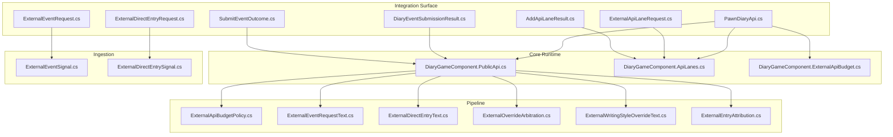
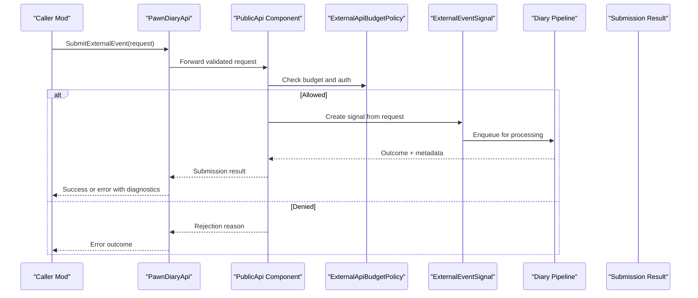
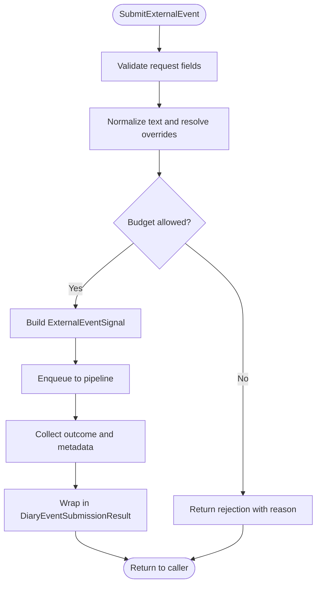
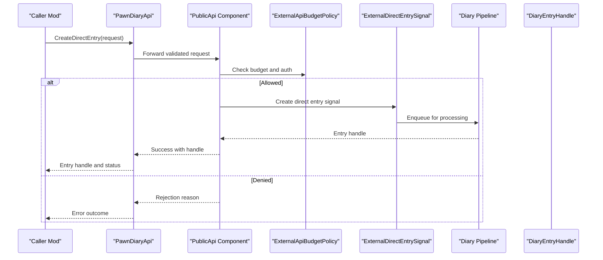
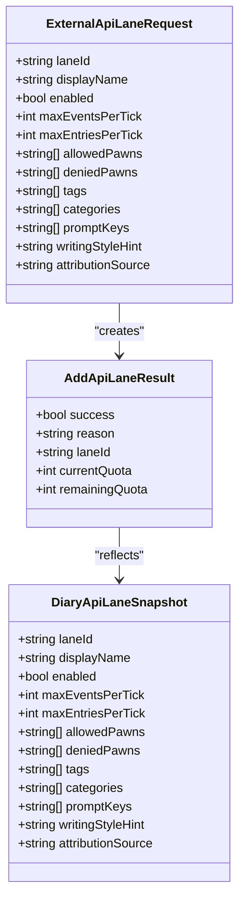
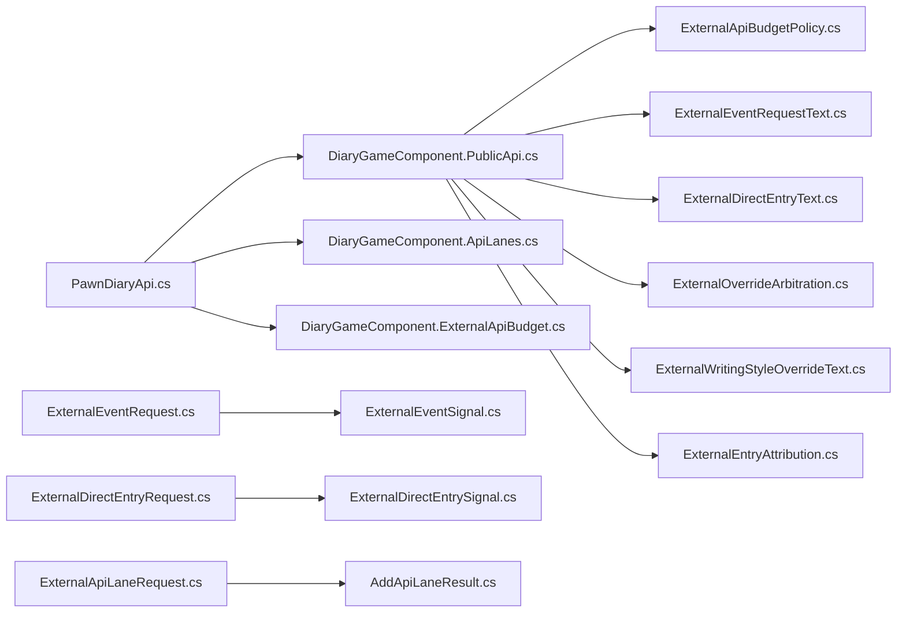

# Integration Endpoints

<cite>
**Referenced Files in This Document**
- [PawnDiaryApi.cs](../../../../Source/Integration/PawnDiaryApi.cs)
- [ExternalEventRequest.cs](../../../../Source/Integration/ExternalEventRequest.cs)
- [ExternalDirectEntryRequest.cs](../../../../Source/Integration/ExternalDirectEntryRequest.cs)
- [ExternalApiLaneRequest.cs](../../../../Source/Integration/ExternalApiLaneRequest.cs)
- [DiaryEventSubmissionResult.cs](../../../../Source/Integration/DiaryEventSubmissionResult.cs)
- [AddApiLaneResult.cs](../../../../Source/Integration/AddApiLaneResult.cs)
- [SubmitEventOutcome.cs](../../../../Source/Integration/SubmitEventOutcome.cs)
- [DiaryGameComponent.ApiLanes.cs](../../../../Source/Core/DiaryGameComponent.ApiLanes.cs)
- [DiaryGameComponent.PublicApi.cs](../../../../Source/Core/DiaryGameComponent.PublicApi.cs)
- [ExternalApiBudgetPolicy.cs](../../../../Source/Pipeline/ExternalApiBudgetPolicy.cs)
- [ExternalApiBudget.cs](../../../../Source/Core/DiaryGameComponent.ExternalApiBudget.cs)
- [ApiConnectionController.cs](../../../../Source/Settings/ApiConnectionController.cs)
- [ApiRequestAuth.cs](../../../../Source/Settings/ApiRequestAuth.cs)
- [ExternalEventSignal.cs](../../../../Source/Ingestion/Sources/ExternalEventSignal.cs)
- [ExternalDirectEntrySignal.cs](../../../../Source/Ingestion/Sources/ExternalDirectEntrySignal.cs)
- [ExternalEventSpec.cs](../../../../Source/Capture/Specs/ExternalEventSpec.cs)
- [ExternalEventRequestText.cs](../../../../Source/Pipeline/ExternalEventRequestText.cs)
- [ExternalDirectEntryText.cs](../../../../Source/Pipeline/ExternalDirectEntryText.cs)
- [ExternalOverrideArbitration.cs](../../../../Source/Pipeline/ExternalOverrideArbitration.cs)
- [ExternalWritingStyleOverrideText.cs](../../../../Source/Pipeline/ExternalWritingStyleOverrideText.cs)
- [ExternalEntryAttribution.cs](../../../../Source/Pipeline/ExternalEntryAttribution.cs)
- [CaptureCapabilities.cs](../../../../Source/Integration/CaptureCapabilities.cs)
- [DiaryApiSetupSnapshot.cs](../../../../Source/Integration/DiaryApiSetupSnapshot.cs)
- [DiaryApiLaneSnapshot.cs](../../../../Source/Integration/DiaryApiLaneSnapshot.cs)
- [DiaryContextBundleSnapshot.cs](../../../../Source/Integration/DiaryContextBundleSnapshot.cs)
- [DiaryEntryHandle.cs](../../../../Source/Integration/DiaryEntryHandle.cs)
- [DiaryEntrySnapshot.cs](../../../../Source/Integration/DiaryEntrySnapshot.cs)
- [DiaryEntryStatusSnapshot.cs](../../../../Source/Integration/DiaryEntryStatusSnapshot.cs)
- [DiaryEntryTitleQuery.cs](../../../../Source/Integration/DiaryEntryTitleQuery.cs)
- [DiaryEntryTitleSnapshot.cs](../../../../Source/Integration/DiaryEntryTitleSnapshot.cs)
- [DiaryEntryStatsSnapshot.cs](../../../../Source/Integration/DiaryEntryStatsSnapshot.cs)
- [DiaryPromptPreviewSnapshot.cs](../../../../Source/Integration/DiaryPromptPreviewSnapshot.cs)
- [DiaryHealthSummarySnapshot.cs](../../../../Source/Integration/DiaryHealthSummarySnapshot.cs)
- [DiaryPsychotypeSnapshot.cs](../../../../Source/Integration/DiaryPsychotypeSnapshot.cs)
- [DiaryWritingStyleSnapshot.cs](../../../../Source/Integration/DiaryWritingStyleSnapshot.cs)
- [ExternalPromptEntryRequest.cs](../../../../Source/Integration/ExternalPromptEntryRequest.cs)
- [ExternalLlmCompletionService.cs](../../../../Source/Integration/ExternalLlmCompletionService.cs)
- [ExternalPsychotypeGenerators.cs](../../../../Source/Integration/ExternalPsychotypeGenerators.cs)
- [ExampleAdapterGameComponent.cs](../../../../integrations/PawnDiary.ExampleAdapter/Source/ExampleAdapterGameComponent.cs)
- [PawnDiaryExampleApi.cs](../../../../integrations/PawnDiary.ExampleAdapter/Source/PawnDiaryExampleApi.cs)
</cite>

## Table of Contents
1. [Introduction](#introduction)
2. [Project Structure](#project-structure)
3. [Core Components](#core-components)
4. [Architecture Overview](#architecture-overview)
5. [Detailed Component Analysis](#detailed-component-analysis)
6. [Dependency Analysis](#dependency-analysis)
7. [Performance Considerations](#performance-considerations)
8. [Troubleshooting Guide](#troubleshooting-guide)
9. [Conclusion](#conclusion)
10. [Appendices](#appendices)

## Introduction
This document describes the external integration surface exposed by Pawn Diary for other mods to interact with the diary system. It covers:
- External event submission
- Direct entry creation
- API lane registration and discovery
- Request/response schemas, authentication, rate limiting, and error handling
- Security considerations, version compatibility, and migration strategies
- Practical examples and callback patterns

The integration is implemented as an in-process API surface rather than a network endpoint. Other mods call into Pawn Diary via strongly-typed methods and request objects defined in this repository.

## Project Structure
Key areas relevant to external integrations:
- Public API surface and request/response models
- Lane registration and identity management
- Budgeting and throttling policies
- Ingestion signals that bridge requests into the internal pipeline
- Example adapter demonstrating usage patterns

**Diagram sources**
- [PawnDiaryApi.cs](../../../../Source/Integration/PawnDiaryApi.cs)
- [ExternalEventRequest.cs](../../../../Source/Integration/ExternalEventRequest.cs)
- [ExternalDirectEntryRequest.cs](../../../../Source/Integration/ExternalDirectEntryRequest.cs)
- [ExternalApiLaneRequest.cs](../../../../Source/Integration/ExternalApiLaneRequest.cs)
- [DiaryEventSubmissionResult.cs](../../../../Source/Integration/DiaryEventSubmissionResult.cs)
- [AddApiLaneResult.cs](../../../../Source/Integration/AddApiLaneResult.cs)
- [SubmitEventOutcome.cs](../../../../Source/Integration/SubmitEventOutcome.cs)
- [DiaryGameComponent.PublicApi.cs](../../../../Source/Core/DiaryGameComponent.PublicApi.cs)
- [DiaryGameComponent.ApiLanes.cs](../../../../Source/Core/DiaryGameComponent.ApiLanes.cs)
- [DiaryGameComponent.ExternalApiBudget.cs](../../../../Source/Core/DiaryGameComponent.ExternalApiBudget.cs)
- [ExternalApiBudgetPolicy.cs](../../../../Source/Pipeline/ExternalApiBudgetPolicy.cs)
- [ExternalEventRequestText.cs](../../../../Source/Pipeline/ExternalEventRequestText.cs)
- [ExternalDirectEntryText.cs](../../../../Source/Pipeline/ExternalDirectEntryText.cs)
- [ExternalOverrideArbitration.cs](../../../../Source/Pipeline/ExternalOverrideArbitration.cs)
- [ExternalWritingStyleOverrideText.cs](../../../../Source/Pipeline/ExternalWritingStyleOverrideText.cs)
- [ExternalEntryAttribution.cs](../../../../Source/Pipeline/ExternalEntryAttribution.cs)
- [ExternalEventSignal.cs](../../../../Source/Ingestion/Sources/ExternalEventSignal.cs)
- [ExternalDirectEntrySignal.cs](../../../../Source/Ingestion/Sources/ExternalDirectEntrySignal.cs)

**Section sources**
- [PawnDiaryApi.cs](../../../../Source/Integration/PawnDiaryApi.cs)
- [DiaryGameComponent.PublicApi.cs](../../../../Source/Core/DiaryGameComponent.PublicApi.cs)
- [DiaryGameComponent.ApiLanes.cs](../../../../Source/Core/DiaryGameComponent.ApiLanes.cs)
- [DiaryGameComponent.ExternalApiBudget.cs](../../../../Source/Core/DiaryGameComponent.ExternalApiBudget.cs)

## Core Components
- Public API facade: Provides methods for submitting events, creating direct entries, registering lanes, querying context, and previewing prompts.
- Request models: Strongly-typed structures for external events, direct entries, and lane registration.
- Results and outcomes: Structured responses indicating success, failure, and diagnostic details.
- Budgeting and throttling: Policies and runtime components that enforce per-lane and global limits.
- Signals: Bridge between public API calls and the ingestion pipeline.

Typical responsibilities:
- Validate inputs and normalize text fields
- Apply override arbitration and writing style resolution
- Enforce budget constraints before processing
- Dispatch to ingestion signals for persistence and generation
- Return structured results with actionable diagnostics

**Section sources**
- [PawnDiaryApi.cs](../../../../Source/Integration/PawnDiaryApi.cs)
- [ExternalEventRequest.cs](../../../../Source/Integration/ExternalEventRequest.cs)
- [ExternalDirectEntryRequest.cs](../../../../Source/Integration/ExternalDirectEntryRequest.cs)
- [ExternalApiLaneRequest.cs](../../../../Source/Integration/ExternalApiLaneRequest.cs)
- [DiaryEventSubmissionResult.cs](../../../../Source/Integration/DiaryEventSubmissionResult.cs)
- [AddApiLaneResult.cs](../../../../Source/Integration/AddApiLaneResult.cs)
- [SubmitEventOutcome.cs](../../../../Source/Integration/SubmitEventOutcome.cs)

## Architecture Overview
The integration follows a layered approach:
- Caller (other mod) invokes the public API facade
- The facade validates and constructs request payloads
- Budget checks are applied using policy and runtime state
- Requests are translated into ingestion signals
- The core diary pipeline processes signals, applies overrides, and generates entries
- Responses are returned to the caller with structured outcomes

**Diagram sources**
- [PawnDiaryApi.cs](../../../../Source/Integration/PawnDiaryApi.cs)
- [DiaryGameComponent.PublicApi.cs](../../../../Source/Core/DiaryGameComponent.PublicApi.cs)
- [ExternalApiBudgetPolicy.cs](../../../../Source/Pipeline/ExternalApiBudgetPolicy.cs)
- [ExternalEventSignal.cs](../../../../Source/Ingestion/Sources/ExternalEventSignal.cs)

## Detailed Component Analysis

### External Event Submission
Purpose: Allow other mods to submit narrative events that will be processed into diary entries.

Key elements:
- Request model: ExternalEventRequest
- Outcome model: SubmitEventOutcome
- Result wrapper: DiaryEventSubmissionResult
- Ingestion: ExternalEventSignal
- Text normalization and override handling: ExternalEventRequestText, ExternalOverrideArbitration, ExternalWritingStyleOverrideText, ExternalEntryAttribution

Flow overview:
- Caller builds an ExternalEventRequest with required identifiers and content
- Public API validates and normalizes text fields
- Budget policy enforces per-lane and global limits
- Request is converted to an ingestion signal
- Pipeline produces an outcome and optional entry handle
- Result is returned to the caller

**Diagram sources**
- [ExternalEventRequest.cs](../../../../Source/Integration/ExternalEventRequest.cs)
- [ExternalEventSignal.cs](../../../../Source/Ingestion/Sources/ExternalEventSignal.cs)
- [ExternalEventRequestText.cs](../../../../Source/Pipeline/ExternalEventRequestText.cs)
- [ExternalOverrideArbitration.cs](../../../../Source/Pipeline/ExternalOverrideArbitration.cs)
- [ExternalWritingStyleOverrideText.cs](../../../../Source/Pipeline/ExternalWritingStyleOverrideText.cs)
- [ExternalEntryAttribution.cs](../../../../Source/Pipeline/ExternalEntryAttribution.cs)
- [DiaryEventSubmissionResult.cs](../../../../Source/Integration/DiaryEventSubmissionResult.cs)
- [SubmitEventOutcome.cs](../../../../Source/Integration/SubmitEventOutcome.cs)

Request schema highlights:
- Identifiers: target pawn, lane, and source attribution
- Content: title, body, and optional rich-text decorations
- Context: tags, categories, and prompt keys
- Overrides: writing style hints and custom metadata
- Constraints: length limits and sanitization rules enforced by pipeline

Response schema highlights:
- Status: accepted, rejected, or queued
- Diagnostics: reasons for rejection, budget status, and validation errors
- Entry handle: optional reference if entry was created
- Outcome codes: detailed classification of processing result

Authentication and authorization:
- Per-lane identity and permissions are enforced at lane registration time
- Auth tokens or connection settings may be required depending on configuration

Rate limiting and budgeting:
- Global and per-lane budgets are enforced by policy and runtime component
- Excess requests are rejected with clear reasons

Error handling:
- Validation errors return structured diagnostics
- Budget rejections include remaining quota information
- Processing failures include outcome codes and suggestions

Security considerations:
- Input sanitization and length limits prevent abuse
- Attribution prevents spoofing of source identity
- Lane-based isolation ensures only authorized callers can use specific lanes

Version compatibility:
- Request models evolve with semantic versioning; callers should check supported versions
- Backward-compatible fields are preserved when possible

Migration strategy:
- Deprecation warnings guide callers to updated fields
- Compatibility shims translate legacy formats where feasible

Examples:
- Constructing a minimal event request with required fields
- Adding optional overrides and context tags
- Handling rejection due to budget limits

Callback handling:
- Asynchronous callbacks are not used; results are returned synchronously
- For long-running operations, callers should poll status via entry handles

**Section sources**
- [ExternalEventRequest.cs](../../../../Source/Integration/ExternalEventRequest.cs)
- [ExternalEventSignal.cs](../../../../Source/Ingestion/Sources/ExternalEventSignal.cs)
- [ExternalEventRequestText.cs](../../../../Source/Pipeline/ExternalEventRequestText.cs)
- [ExternalOverrideArbitration.cs](../../../../Source/Pipeline/ExternalOverrideArbitration.cs)
- [ExternalWritingStyleOverrideText.cs](../../../../Source/Pipeline/ExternalWritingStyleOverrideText.cs)
- [ExternalEntryAttribution.cs](../../../../Source/Pipeline/ExternalEntryAttribution.cs)
- [DiaryEventSubmissionResult.cs](../../../../Source/Integration/DiaryEventSubmissionResult.cs)
- [SubmitEventOutcome.cs](../../../../Source/Integration/SubmitEventOutcome.cs)
- [ExternalApiBudgetPolicy.cs](../../../../Source/Pipeline/ExternalApiBudgetPolicy.cs)
- [DiaryGameComponent.ExternalApiBudget.cs](../../../../Source/Core/DiaryGameComponent.ExternalApiBudget.cs)

### Direct Entry Creation
Purpose: Allow other mods to create diary entries directly without going through event processing.

Key elements:
- Request model: ExternalDirectEntryRequest
- Ingestion: ExternalDirectEntrySignal
- Text normalization and attribution: ExternalDirectEntryText, ExternalEntryAttribution

Flow overview:
- Caller builds a DirectEntryRequest with title, body, and target pawn
- Public API validates and normalizes text
- Budget checks apply similarly to event submission
- Request is converted to a direct entry signal
- Pipeline creates the entry and returns a handle

**Diagram sources**
- [ExternalDirectEntryRequest.cs](../../../../Source/Integration/ExternalDirectEntryRequest.cs)
- [ExternalDirectEntrySignal.cs](../../../../Source/Ingestion/Sources/ExternalDirectEntrySignal.cs)
- [ExternalDirectEntryText.cs](../../../../Source/Pipeline/ExternalDirectEntryText.cs)
- [ExternalEntryAttribution.cs](../../../../Source/Pipeline/ExternalEntryAttribution.cs)
- [DiaryEntryHandle.cs](../../../../Source/Integration/DiaryEntryHandle.cs)
- [ExternalApiBudgetPolicy.cs](../../../../Source/Pipeline/ExternalApiBudgetPolicy.cs)

Request schema highlights:
- Target pawn identifier
- Title and body text with optional formatting
- Optional writing style overrides and attribution metadata
- Constraints: length limits and sanitization rules

Response schema highlights:
- Status: created or rejected
- Entry handle for subsequent queries
- Diagnostics for validation or budget issues

Security and safety:
- Sanitization prevents injection of unsafe content
- Attribution ensures provenance tracking
- Budget enforcement prevents spamming

Examples:
- Creating a simple note entry
- Applying writing style overrides
- Handling budget rejections

**Section sources**
- [ExternalDirectEntryRequest.cs](../../../../Source/Integration/ExternalDirectEntryRequest.cs)
- [ExternalDirectEntrySignal.cs](../../../../Source/Ingestion/Sources/ExternalDirectEntrySignal.cs)
- [ExternalDirectEntryText.cs](../../../../Source/Pipeline/ExternalDirectEntryText.cs)
- [ExternalEntryAttribution.cs](../../../../Source/Pipeline/ExternalEntryAttribution.cs)
- [DiaryEntryHandle.cs](../../../../Source/Integration/DiaryEntryHandle.cs)
- [ExternalApiBudgetPolicy.cs](../../../../Source/Pipeline/ExternalApiBudgetPolicy.cs)

### API Lane Registration
Purpose: Register named lanes that control access, quotas, and behavior for external callers.

Key elements:
- Request model: ExternalApiLaneRequest
- Result model: AddApiLaneResult
- Lane identity and selection: ApiLaneIdentity, ApiLaneSelector
- Setup snapshots and capabilities: DiaryApiSetupSnapshot, CaptureCapabilities, DiaryApiLaneSnapshot

Registration flow:
- Caller provides lane configuration including identity, permissions, and quotas
- Public API validates and registers the lane
- Result indicates success or failure with diagnostics
- Subsequent requests must specify the lane identity

**Diagram sources**
- [ExternalApiLaneRequest.cs](../../../../Source/Integration/ExternalApiLaneRequest.cs)
- [AddApiLaneResult.cs](../../../../Source/Integration/AddApiLaneResult.cs)
- [DiaryApiLaneSnapshot.cs](../../../../Source/Integration/DiaryApiLaneSnapshot.cs)

Request schema highlights:
- Lane identity and display name
- Enabled/disabled toggle
- Quotas: maximum events and entries per tick
- Access controls: allowed/denied pawns
- Filtering: tags, categories, prompt keys
- Defaults: writing style hint and attribution source

Response schema highlights:
- Success flag and reason
- Current and remaining quota
- Lane identifier for subsequent requests

Security and governance:
- Lane-based isolation ensures controlled access
- Quotas prevent resource exhaustion
- Tag and category filters constrain processing scope

Examples:
- Registering a new lane with conservative quotas
- Updating an existing lane’s permissions
- Querying lane snapshots for diagnostics

**Section sources**
- [ExternalApiLaneRequest.cs](../../../../Source/Integration/ExternalApiLaneRequest.cs)
- [AddApiLaneResult.cs](../../../../Source/Integration/AddApiLaneResult.cs)
- [DiaryApiLaneSnapshot.cs](../../../../Source/Integration/DiaryApiLaneSnapshot.cs)
- [DiaryGameComponent.ApiLanes.cs](../../../../Source/Core/DiaryGameComponent.ApiLanes.cs)

### Authentication and Connection Settings
Purpose: Configure how external callers authenticate and connect to the API.

Key elements:
- Connection controller: ApiConnectionController
- Auth model: ApiRequestAuth

Configuration aspects:
- Connection endpoints and timeouts
- Token-based or key-based authentication schemes
- Per-lane credential mapping
- Debugging and logging toggles

Best practices:
- Store credentials securely and avoid hardcoding
- Rotate tokens periodically
- Use least-privilege lanes for each caller

**Section sources**
- [ApiConnectionController.cs](../../../../Source/Settings/ApiConnectionController.cs)
- [ApiRequestAuth.cs](../../../../Source/Settings/ApiRequestAuth.cs)

### Rate Limiting and Budget Enforcement
Purpose: Protect the diary system from excessive external load.

Key elements:
- Policy: ExternalApiBudgetPolicy
- Runtime state: ExternalApiBudget

Mechanisms:
- Global budget across all lanes
- Per-lane budgets with independent counters
- Tick-based windows for fairness
- Clear rejection reasons and remaining quota reporting

Operational guidance:
- Tune quotas based on expected workload
- Monitor budget rejections and adjust accordingly
- Use backoff strategies when encountering rate limits

**Section sources**
- [ExternalApiBudgetPolicy.cs](../../../../Source/Pipeline/ExternalApiBudgetPolicy.cs)
- [DiaryGameComponent.ExternalApiBudget.cs](../../../../Source/Core/DiaryGameComponent.ExternalApiBudget.cs)

### Querying Entries and Status
Purpose: Retrieve entry handles, titles, stats, and health summaries for diagnostics and UI.

Key elements:
- Entry handle: DiaryEntryHandle
- Title query and snapshot: DiaryEntryTitleQuery, DiaryEntryTitleSnapshot
- Entry snapshot and status: DiaryEntrySnapshot, DiaryEntryStatusSnapshot
- Stats snapshot: DiaryEntryStatsSnapshot
- Health summary: DiaryHealthSummarySnapshot

Use cases:
- Polling entry status after submission
- Listing recent titles for a pawn
- Inspecting stats and rendering metadata
- Monitoring overall diary health

**Section sources**
- [DiaryEntryHandle.cs](../../../../Source/Integration/DiaryEntryHandle.cs)
- [DiaryEntryTitleQuery.cs](../../../../Source/Integration/DiaryEntryTitleQuery.cs)
- [DiaryEntryTitleSnapshot.cs](../../../../Source/Integration/DiaryEntryTitleSnapshot.cs)
- [DiaryEntrySnapshot.cs](../../../../Source/Integration/DiaryEntrySnapshot.cs)
- [DiaryEntryStatusSnapshot.cs](../../../../Source/Integration/DiaryEntryStatusSnapshot.cs)
- [DiaryEntryStatsSnapshot.cs](../../../../Source/Integration/DiaryEntryStatsSnapshot.cs)
- [DiaryHealthSummarySnapshot.cs](../../../../Source/Integration/DiaryHealthSummarySnapshot.cs)

### Prompt Preview and Writing Style
Purpose: Preview generated prompts and influence writing style for better alignment with mod expectations.

Key elements:
- Prompt preview snapshot: DiaryPromptPreviewSnapshot
- Writing style snapshot: DiaryWritingStyleSnapshot
- External prompt entry request: ExternalPromptEntryRequest

Capabilities:
- Generate prompt previews for testing
- Resolve writing styles and apply overrides
- Integrate with psychotype generators for persona consistency

**Section sources**
- [DiaryPromptPreviewSnapshot.cs](../../../../Source/Integration/DiaryPromptPreviewSnapshot.cs)
- [DiaryWritingStyleSnapshot.cs](../../../../Source/Integration/DiaryWritingStyleSnapshot.cs)
- [ExternalPromptEntryRequest.cs](../../../../Source/Integration/ExternalPromptEntryRequest.cs)

### Psychotype Generators and LLM Completion
Purpose: Extend diary behavior with external psychotype logic and language model completion services.

Key elements:
- Psychotype generators: ExternalPsychotypeGenerators
- LLM completion service: ExternalLlmCompletionService

Integration points:
- Provide custom psychotype resolution logic
- Offload text generation to external LLM providers
- Manage capability caching and model lists

**Section sources**
- [ExternalPsychotypeGenerators.cs](../../../../Source/Integration/ExternalPsychotypeGenerators.cs)
- [ExternalLlmCompletionService.cs](../../../../Source/Integration/ExternalLlmCompletionService.cs)
- [ModelCapabilityCache.cs](../../../../Source/Settings/ModelCapabilityCache.cs)
- [ModelListClient.cs](../../../../Source/Settings/ModelListClient.cs)

### Example Adapter Usage
Purpose: Demonstrate practical usage of the external API for other mods.

Key elements:
- Example adapter game component: ExampleAdapterGameComponent
- Example API wrapper: PawnDiaryExampleApi

Patterns:
- Initialize adapter and configure lanes
- Submit events and direct entries
- Handle results and errors gracefully
- Use snapshots for diagnostics and UI updates

**Section sources**
- [ExampleAdapterGameComponent.cs](../../../../integrations/PawnDiary.ExampleAdapter/Source/ExampleAdapterGameComponent.cs)
- [PawnDiaryExampleApi.cs](../../../../integrations/PawnDiary.ExampleAdapter/Source/PawnDiaryExampleApi.cs)

## Dependency Analysis
High-level dependencies among integration components:

**Diagram sources**
- [PawnDiaryApi.cs](../../../../Source/Integration/PawnDiaryApi.cs)
- [DiaryGameComponent.PublicApi.cs](../../../../Source/Core/DiaryGameComponent.PublicApi.cs)
- [DiaryGameComponent.ApiLanes.cs](../../../../Source/Core/DiaryGameComponent.ApiLanes.cs)
- [DiaryGameComponent.ExternalApiBudget.cs](../../../../Source/Core/DiaryGameComponent.ExternalApiBudget.cs)
- [ExternalApiBudgetPolicy.cs](../../../../Source/Pipeline/ExternalApiBudgetPolicy.cs)
- [ExternalEventRequestText.cs](../../../../Source/Pipeline/ExternalEventRequestText.cs)
- [ExternalDirectEntryText.cs](../../../../Source/Pipeline/ExternalDirectEntryText.cs)
- [ExternalOverrideArbitration.cs](../../../../Source/Pipeline/ExternalOverrideArbitration.cs)
- [ExternalWritingStyleOverrideText.cs](../../../../Source/Pipeline/ExternalWritingStyleOverrideText.cs)
- [ExternalEntryAttribution.cs](../../../../Source/Pipeline/ExternalEntryAttribution.cs)
- [ExternalEventRequest.cs](../../../../Source/Integration/ExternalEventRequest.cs)
- [ExternalEventSignal.cs](../../../../Source/Ingestion/Sources/ExternalEventSignal.cs)
- [ExternalDirectEntryRequest.cs](../../../../Source/Integration/ExternalDirectEntryRequest.cs)
- [ExternalDirectEntrySignal.cs](../../../../Source/Ingestion/Sources/ExternalDirectEntrySignal.cs)
- [ExternalApiLaneRequest.cs](../../../../Source/Integration/ExternalApiLaneRequest.cs)
- [AddApiLaneResult.cs](../../../../Source/Integration/AddApiLaneResult.cs)

**Section sources**
- [PawnDiaryApi.cs](../../../../Source/Integration/PawnDiaryApi.cs)
- [DiaryGameComponent.PublicApi.cs](../../../../Source/Core/DiaryGameComponent.PublicApi.cs)
- [DiaryGameComponent.ApiLanes.cs](../../../../Source/Core/DiaryGameComponent.ApiLanes.cs)
- [DiaryGameComponent.ExternalApiBudget.cs](../../../../Source/Core/DiaryGameComponent.ExternalApiBudget.cs)

## Performance Considerations
- Prefer batching events when possible to reduce per-call overhead
- Respect rate limits and implement exponential backoff
- Avoid excessively large text payloads; trim and sanitize inputs
- Cache reusable context data such as writing style hints
- Monitor budget rejections and adjust quotas accordingly

[No sources needed since this section provides general guidance]

## Troubleshooting Guide
Common issues and resolutions:
- Budget rejections: Review per-lane quotas and global limits; adjust configuration
- Validation errors: Ensure required fields are present and within length limits
- Authentication failures: Verify connection settings and token validity
- Lane conflicts: Confirm unique lane IDs and correct permissions
- Slow processing: Reduce payload size and frequency; optimize calling patterns

Diagnostic tools:
- Use snapshots to inspect lane setup and health
- Log rejection reasons and remaining quotas
- Leverage example adapter patterns for baseline behavior

**Section sources**
- [DiaryApiSetupSnapshot.cs](../../../../Source/Integration/DiaryApiSetupSnapshot.cs)
- [DiaryApiLaneSnapshot.cs](../../../../Source/Integration/DiaryApiLaneSnapshot.cs)
- [DiaryHealthSummarySnapshot.cs](../../../../Source/Integration/DiaryHealthSummarySnapshot.cs)
- [CaptureCapabilities.cs](../../../../Source/Integration/CaptureCapabilities.cs)

## Conclusion
Pawn Diary’s external integration surface enables other mods to contribute narrative events and entries safely and efficiently. By adhering to the documented request schemas, respecting rate limits, and following security best practices, integrators can build robust features that enhance player experience while maintaining system stability.

[No sources needed since this section summarizes without analyzing specific files]

## Appendices

### API Surface Summary
- Submit external events: ExternalEventRequest -> ExternalEventSignal -> DiaryEventSubmissionResult
- Create direct entries: ExternalDirectEntryRequest -> ExternalDirectEntrySignal -> DiaryEntryHandle
- Register lanes: ExternalApiLaneRequest -> AddApiLaneResult -> DiaryApiLaneSnapshot
- Query status: Entry handles and snapshots for titles, stats, and health
- Customize behavior: Prompt previews, writing styles, psychotype generators, LLM completion

**Section sources**
- [ExternalEventRequest.cs](../../../../Source/Integration/ExternalEventRequest.cs)
- [ExternalDirectEntryRequest.cs](../../../../Source/Integration/ExternalDirectEntryRequest.cs)
- [ExternalApiLaneRequest.cs](../../../../Source/Integration/ExternalApiLaneRequest.cs)
- [DiaryEventSubmissionResult.cs](../../../../Source/Integration/DiaryEventSubmissionResult.cs)
- [AddApiLaneResult.cs](../../../../Source/Integration/AddApiLaneResult.cs)
- [DiaryEntryHandle.cs](../../../../Source/Integration/DiaryEntryHandle.cs)
- [DiaryEntryTitleQuery.cs](../../../../Source/Integration/DiaryEntryTitleQuery.cs)
- [DiaryEntryTitleSnapshot.cs](../../../../Source/Integration/DiaryEntryTitleSnapshot.cs)
- [DiaryEntrySnapshot.cs](../../../../Source/Integration/DiaryEntrySnapshot.cs)
- [DiaryEntryStatusSnapshot.cs](../../../../Source/Integration/DiaryEntryStatusSnapshot.cs)
- [DiaryEntryStatsSnapshot.cs](../../../../Source/Integration/DiaryEntryStatsSnapshot.cs)
- [DiaryHealthSummarySnapshot.cs](../../../../Source/Integration/DiaryHealthSummarySnapshot.cs)
- [DiaryPromptPreviewSnapshot.cs](../../../../Source/Integration/DiaryPromptPreviewSnapshot.cs)
- [DiaryWritingStyleSnapshot.cs](../../../../Source/Integration/DiaryWritingStyleSnapshot.cs)
- [ExternalPromptEntryRequest.cs](../../../../Source/Integration/ExternalPromptEntryRequest.cs)
- [ExternalPsychotypeGenerators.cs](../../../../Source/Integration/ExternalPsychotypeGenerators.cs)
- [ExternalLlmCompletionService.cs](../../../../Source/Integration/ExternalLlmCompletionService.cs)
