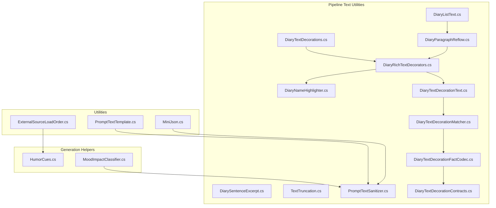
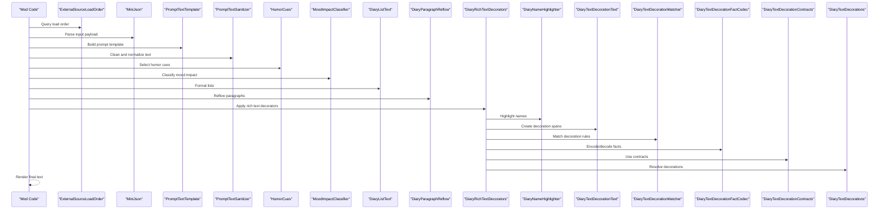
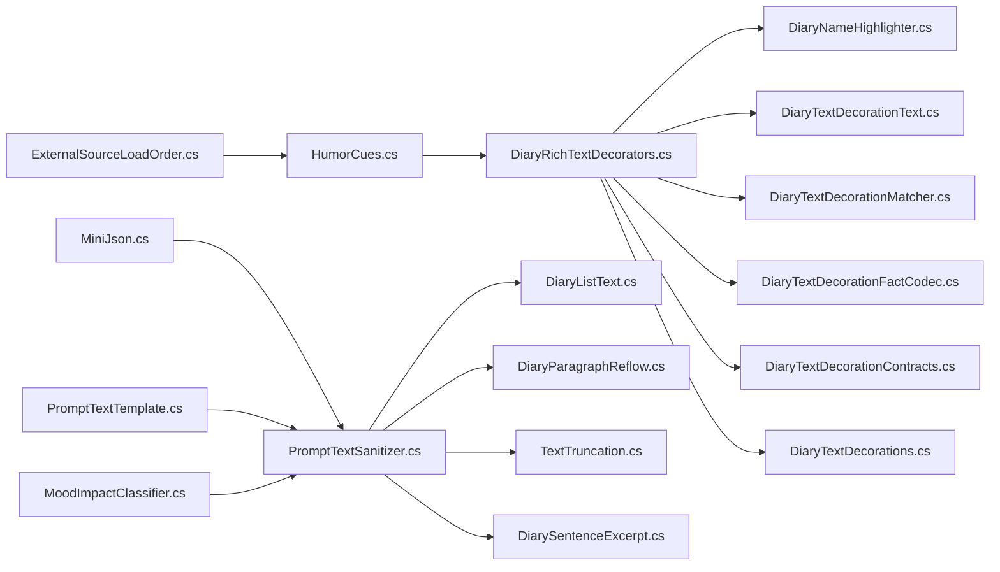

# Utility Functions

## Table of Contents
1. [Introduction](#introduction)
2. [Project Structure](#project-structure)
3. [Core Components](#core-components)
4. [Architecture Overview](#architecture-overview)
5. [Detailed Component Analysis](#detailed-component-analysis)
6. [Dependency Analysis](#dependency-analysis)
7. [Performance Considerations](#performance-considerations)
8. [Troubleshooting Guide](#troubleshooting-guide)
9. [Conclusion](#conclusion)

## Introduction
This document provides mod developers with a focused guide to Pawn Diary’s utility functions and helper classes that are most relevant for text processing, JSON parsing, load order management, mood classification, and humor cue systems. It explains responsibilities, method signatures, parameters, return formats, performance characteristics, memory usage patterns, and best practices for extending or customizing these utilities.

## Project Structure
The utilities covered here are organized into:
- Core utilities under Source/Util for general-purpose helpers (JSON, templates, load order).
- Generation helpers under Source/Generation for mood classification and humor cues.
- Pipeline utilities under Source/Pipeline for text formatting, decoration, and rendering support.

**Diagram sources**
- [ExternalSourceLoadOrder.cs](../../../../Source/Util/ExternalSourceLoadOrder.cs)
- [MiniJson.cs](../../../../Source/Util/MiniJson.cs)
- [PromptTextTemplate.cs](../../../../Source/Util/PromptTextTemplate.cs)
- [HumorCues.cs](../../../../Source/Generation/HumorCues.cs)
- [MoodImpactClassifier.cs](../../../../Source/Generation/MoodImpactClassifier.cs)
- [DiaryListText.cs](../../../../Source/Pipeline/DiaryListText.cs)
- [DiaryParagraphReflow.cs](../../../../Source/Pipeline/DiaryParagraphReflow.cs)
- [DiarySentenceExcerpt.cs](../../../../Source/Pipeline/DiarySentenceExcerpt.cs)
- [TextTruncation.cs](../../../../Source/Pipeline/TextTruncation.cs)
- [PromptTextSanitizer.cs](../../../../Source/Pipeline/PromptTextSanitizer.cs)
- [DiaryRichTextDecorators.cs](../../../../Source/Pipeline/DiaryRichTextDecorators.cs)
- [DiaryNameHighlighter.cs](../../../../Source/Pipeline/DiaryNameHighlighter.cs)
- [DiaryTextDecorationText.cs](../../../../Source/Pipeline/DiaryTextDecorationText.cs)
- [DiaryTextDecorationMatcher.cs](../../../../Source/Pipeline/DiaryTextDecorationMatcher.cs)
- [DiaryTextDecorationFactCodec.cs](../../../../Source/Pipeline/DiaryTextDecorationFactCodec.cs)
- [DiaryTextDecorationContracts.cs](../../../../Source/Pipeline/DiaryTextDecorationContracts.cs)
- [DiaryTextDecorations.cs](../../../../Source/Pipeline/DiaryTextDecorations.cs)

**Section sources**
- [ExternalSourceLoadOrder.cs](../../../../Source/Util/ExternalSourceLoadOrder.cs)
- [MiniJson.cs](../../../../Source/Util/MiniJson.cs)
- [PromptTextTemplate.cs](../../../../Source/Util/PromptTextTemplate.cs)
- [HumorCues.cs](../../../../Source/Generation/HumorCues.cs)
- [MoodImpactClassifier.cs](../../../../Source/Generation/MoodImpactClassifier.cs)
- [DiaryListText.cs](../../../../Source/Pipeline/DiaryListText.cs)
- [DiaryParagraphReflow.cs](../../../../Source/Pipeline/DiaryParagraphReflow.cs)
- [DiarySentenceExcerpt.cs](../../../../Source/Pipeline/DiarySentenceExcerpt.cs)
- [TextTruncation.cs](../../../../Source/Pipeline/TextTruncation.cs)
- [PromptTextSanitizer.cs](../../../../Source/Pipeline/PromptTextSanitizer.cs)
- [DiaryRichTextDecorators.cs](../../../../Source/Pipeline/DiaryRichTextDecorators.cs)
- [DiaryNameHighlighter.cs](../../../../Source/Pipeline/DiaryNameHighlighter.cs)
- [DiaryTextDecorationText.cs](../../../../Source/Pipeline/DiaryTextDecorationText.cs)
- [DiaryTextDecorationMatcher.cs](../../../../Source/Pipeline/DiaryTextDecorationMatcher.cs)
- [DiaryTextDecorationFactCodec.cs](../../../../Source/Pipeline/DiaryTextDecorationFactCodec.cs)
- [DiaryTextDecorationContracts.cs](../../../../Source/Pipeline/DiaryTextDecorationContracts.cs)
- [DiaryTextDecorations.cs](../../../../Source/Pipeline/DiaryTextDecorations.cs)

## Core Components
This section summarizes the primary utility components and their roles:
- External source load order management for deterministic integration ordering.
- Lightweight JSON parsing helpers for structured data exchange.
- Prompt text templating for safe substitution and formatting.
- Humor cue system for injecting stylistic flavor into generated content.
- Mood impact classifier for categorizing emotional valence and intensity.
- Text processing pipeline utilities for list formatting, paragraph reflow, sentence extraction, truncation, sanitization, rich text decoration, name highlighting, and decoration contracts/codecs.

**Section sources**
- [ExternalSourceLoadOrder.cs](../../../../Source/Util/ExternalSourceLoadOrder.cs)
- [MiniJson.cs](../../../../Source/Util/MiniJson.cs)
- [PromptTextTemplate.cs](../../../../Source/Util/PromptTextTemplate.cs)
- [HumorCues.cs](../../../../Source/Generation/HumorCues.cs)
- [MoodImpactClassifier.cs](../../../../Source/Generation/MoodImpactClassifier.cs)
- [DiaryListText.cs](../../../../Source/Pipeline/DiaryListText.cs)
- [DiaryParagraphReflow.cs](../../../../Source/Pipeline/DiaryParagraphReflow.cs)
- [DiarySentenceExcerpt.cs](../../../../Source/Pipeline/DiarySentenceExcerpt.cs)
- [TextTruncation.cs](../../../../Source/Pipeline/TextTruncation.cs)
- [PromptTextSanitizer.cs](../../../../Source/Pipeline/PromptTextSanitizer.cs)
- [DiaryRichTextDecorators.cs](../../../../Source/Pipeline/DiaryRichTextDecorators.cs)
- [DiaryNameHighlighter.cs](../../../../Source/Pipeline/DiaryNameHighlighter.cs)
- [DiaryTextDecorationText.cs](../../../../Source/Pipeline/DiaryTextDecorationText.cs)
- [DiaryTextDecorationMatcher.cs](../../../../Source/Pipeline/DiaryTextDecorationMatcher.cs)
- [DiaryTextDecorationFactCodec.cs](../../../../Source/Pipeline/DiaryTextDecorationFactCodec.cs)
- [DiaryTextDecorationContracts.cs](../../../../Source/Pipeline/DiaryTextDecorationContracts.cs)
- [DiaryTextDecorations.cs](../../../../Source/Pipeline/DiaryTextDecorations.cs)

## Architecture Overview
The utilities form a layered toolkit:
- Input normalization and parsing (JSON, templates).
- Contextual enrichment (humor cues, mood classification).
- Output formatting and decoration (lists, paragraphs, names, decorations).

**Diagram sources**
- [ExternalSourceLoadOrder.cs](../../../../Source/Util/ExternalSourceLoadOrder.cs)
- [MiniJson.cs](../../../../Source/Util/MiniJson.cs)
- [PromptTextTemplate.cs](../../../../Source/Util/PromptTextTemplate.cs)
- [PromptTextSanitizer.cs](../../../../Source/Pipeline/PromptTextSanitizer.cs)
- [HumorCues.cs](../../../../Source/Generation/HumorCues.cs)
- [MoodImpactClassifier.cs](../../../../Source/Generation/MoodImpactClassifier.cs)
- [DiaryListText.cs](../../../../Source/Pipeline/DiaryListText.cs)
- [DiaryParagraphReflow.cs](../../../../Source/Pipeline/DiaryParagraphReflow.cs)
- [DiaryRichTextDecorators.cs](../../../../Source/Pipeline/DiaryRichTextDecorators.cs)
- [DiaryNameHighlighter.cs](../../../../Source/Pipeline/DiaryNameHighlighter.cs)
- [DiaryTextDecorationText.cs](../../../../Source/Pipeline/DiaryTextDecorationText.cs)
- [DiaryTextDecorationMatcher.cs](../../../../Source/Pipeline/DiaryTextDecorationMatcher.cs)
- [DiaryTextDecorationFactCodec.cs](../../../../Source/Pipeline/DiaryTextDecorationFactCodec.cs)
- [DiaryTextDecorationContracts.cs](../../../../Source/Pipeline/DiaryTextDecorationContracts.cs)
- [DiaryTextDecorations.cs](../../../../Source/Pipeline/DiaryTextDecorations.cs)

## Detailed Component Analysis

### External Source Load Order Management
Purpose:
- Provides deterministic ordering for external sources to ensure stable behavior across mods and updates.

Key responsibilities:
- Registering sources and retrieving ordered lists.
- Resolving conflicts by precedence.
- Exposing stable APIs for other modules to query ordering.

Usage guidance:
- Prefer querying via provided methods rather than hardcoding indices.
- Avoid mutating global state directly; use registration APIs.

Best practices:
- Keep registrations minimal and idempotent.
- Document expected ordering dependencies for your mod’s features.

**Section sources**
- [ExternalSourceLoadOrder.cs](../../../../Source/Util/ExternalSourceLoadOrder.cs)

### Mini JSON Parser
Purpose:
- Lightweight JSON parsing and serialization helpers tailored for modding constraints.

Key responsibilities:
- Parsing JSON strings into typed structures.
- Serializing objects back to JSON when needed.
- Handling common edge cases like missing fields and type coercion.

Usage guidance:
- Validate inputs before parsing to avoid exceptions.
- Cache parsed results where appropriate to reduce repeated allocations.

Performance notes:
- Designed for low overhead; prefer streaming or incremental parsing for large payloads.
- Minimize intermediate string allocations by reusing buffers if available.

**Section sources**
- [MiniJson.cs](../../../../Source/Util/MiniJson.cs)

### Prompt Text Template Engine
Purpose:
- Safe substitution and formatting for prompt generation.

Key responsibilities:
- Resolving placeholders from context dictionaries.
- Escaping special characters to prevent injection.
- Supporting conditional segments and fallbacks.

Usage guidance:
- Provide default values for optional keys to avoid empty outputs.
- Keep templates small and composable for better maintainability.

Best practices:
- Centralize template definitions to ease localization and testing.
- Validate template syntax at load time.

**Section sources**
- [PromptTextTemplate.cs](../../../../Source/Util/PromptTextTemplate.cs)

### Humor Cue System
Purpose:
- Injects stylistic humor elements into generated diary entries based on context and tuning.

Key responsibilities:
- Selecting appropriate cues from definitions.
- Applying probability-based selection and rarity controls.
- Integrating with writing style policies.

Usage guidance:
- Tune probabilities per persona or scenario to balance tone.
- Avoid overuse to preserve narrative quality.

Extensibility:
- Add new cue types by implementing matching contracts and registering them.

**Section sources**
- [HumorCues.cs](../../../../Source/Generation/HumorCues.cs)

### Mood Impact Classifier
Purpose:
- Categorizes events or prompts by mood impact (e.g., positive, negative, neutral) and intensity.

Key responsibilities:
- Analyzing event metadata and context signals.
- Returning standardized classifications used downstream for tone shaping.

Usage guidance:
- Combine with humor cues and writing styles for consistent voice.
- Use classification results to adjust phrasing or emphasis.

Extensibility:
- Extend classifiers by adding new rules or integrating external signals.

**Section sources**
- [MoodImpactClassifier.cs](../../../../Source/Generation/MoodImpactClassifier.cs)

### Text Processing Utilities

#### List Formatting
Responsibilities:
- Converting collections into readable lists with proper punctuation and conjunctions.
- Handling single-item and empty collections gracefully.

Best practices:
- Use locale-aware conjunctions where applicable.
- Keep list items concise for readability.

**Section sources**
- [DiaryListText.cs](../../../../Source/Pipeline/DiaryListText.cs)

#### Paragraph Reflow
Responsibilities:
- Reformatting text into paragraphs with consistent spacing and line breaks.
- Preserving semantic structure while optimizing display width.

Best practices:
- Pre-sanitize text before reflow to avoid artifacts.
- Limit paragraph length for UI constraints.

**Section sources**
- [DiaryParagraphReflow.cs](../../../../Source/Pipeline/DiaryParagraphReflow.cs)

#### Sentence Extraction
Responsibilities:
- Splitting text into sentences for targeted operations (e.g., excerpts, summaries).
- Handling abbreviations and edge cases robustly.

Best practices:
- Use sentence boundaries carefully to avoid cutting mid-thought.
- Cache sentence splits for repeated access.

**Section sources**
- [DiarySentenceExcerpt.cs](../../../../Source/Pipeline/DiarySentenceExcerpt.cs)

#### Text Truncation
Responsibilities:
- Safely truncating text to fixed lengths without breaking words or tags.
- Providing ellipsis or markers for truncated content.

Best practices:
- Respect rich text boundaries to avoid malformed output.
- Measure length using display metrics when possible.

**Section sources**
- [TextTruncation.cs](../../../../Source/Pipeline/TextTruncation.cs)

#### Prompt Text Sanitizer
Responsibilities:
- Cleaning and normalizing raw text for prompts and logs.
- Removing unsafe sequences and enforcing character sets.

Best practices:
- Run sanitizer early in pipelines to minimize downstream issues.
- Log sanitized differences for debugging.

**Section sources**
- [PromptTextSanitizer.cs](../../../../Source/Pipeline/PromptTextSanitizer.cs)

#### Rich Text Decoration Framework
Responsibilities:
- Applying visual decorations (bold, italics, colors) to text segments.
- Managing decoration spans and merging overlapping ranges.

Components:
- Decorator registry and contracts.
- Name highlighter for entity emphasis.
- Decoration text spans and matchers.
- Fact codec for persisting decoration metadata.

Usage guidance:
- Compose multiple decorators for complex styling.
- Ensure decorations are reversible for export/import.

Extensibility:
- Implement custom decorators by adhering to contracts and registering them.

**Section sources**
- [DiaryRichTextDecorators.cs](../../../../Source/Pipeline/DiaryRichTextDecorators.cs)
- [DiaryNameHighlighter.cs](../../../../Source/Pipeline/DiaryNameHighlighter.cs)
- [DiaryTextDecorationText.cs](../../../../Source/Pipeline/DiaryTextDecorationText.cs)
- [DiaryTextDecorationMatcher.cs](../../../../Source/Pipeline/DiaryTextDecorationMatcher.cs)
- [DiaryTextDecorationFactCodec.cs](../../../../Source/Pipeline/DiaryTextDecorationFactCodec.cs)
- [DiaryTextDecorationContracts.cs](../../../../Source/Pipeline/DiaryTextDecorationContracts.cs)
- [DiaryTextDecorations.cs](../../../../Source/Pipeline/DiaryTextDecorations.cs)

## Dependency Analysis
The utilities exhibit clear separation of concerns:
- Core utilities (load order, JSON, templates) are foundational and consumed by higher layers.
- Generation helpers (humor, mood) depend on core utilities and feed into pipeline formatting.
- Pipeline text utilities compose together to produce final rendered output.

**Diagram sources**
- [ExternalSourceLoadOrder.cs](../../../../Source/Util/ExternalSourceLoadOrder.cs)
- [MiniJson.cs](../../../../Source/Util/MiniJson.cs)
- [PromptTextTemplate.cs](../../../../Source/Util/PromptTextTemplate.cs)
- [HumorCues.cs](../../../../Source/Generation/HumorCues.cs)
- [MoodImpactClassifier.cs](../../../../Source/Generation/MoodImpactClassifier.cs)
- [PromptTextSanitizer.cs](../../../../Source/Pipeline/PromptTextSanitizer.cs)
- [DiaryListText.cs](../../../../Source/Pipeline/DiaryListText.cs)
- [DiaryParagraphReflow.cs](../../../../Source/Pipeline/DiaryParagraphReflow.cs)
- [TextTruncation.cs](../../../../Source/Pipeline/TextTruncation.cs)
- [DiarySentenceExcerpt.cs](../../../../Source/Pipeline/DiarySentenceExcerpt.cs)
- [DiaryRichTextDecorators.cs](../../../../Source/Pipeline/DiaryRichTextDecorators.cs)
- [DiaryNameHighlighter.cs](../../../../Source/Pipeline/DiaryNameHighlighter.cs)
- [DiaryTextDecorationText.cs](../../../../Source/Pipeline/DiaryTextDecorationText.cs)
- [DiaryTextDecorationMatcher.cs](../../../../Source/Pipeline/DiaryTextDecorationMatcher.cs)
- [DiaryTextDecorationFactCodec.cs](../../../../Source/Pipeline/DiaryTextDecorationFactCodec.cs)
- [DiaryTextDecorationContracts.cs](../../../../Source/Pipeline/DiaryTextDecorationContracts.cs)
- [DiaryTextDecorations.cs](../../../../Source/Pipeline/DiaryTextDecorations.cs)

**Section sources**
- [ExternalSourceLoadOrder.cs](../../../../Source/Util/ExternalSourceLoadOrder.cs)
- [MiniJson.cs](../../../../Source/Util/MiniJson.cs)
- [PromptTextTemplate.cs](../../../../Source/Util/PromptTextTemplate.cs)
- [HumorCues.cs](../../../../Source/Generation/HumorCues.cs)
- [MoodImpactClassifier.cs](../../../../Source/Generation/MoodImpactClassifier.cs)
- [PromptTextSanitizer.cs](../../../../Source/Pipeline/PromptTextSanitizer.cs)
- [DiaryListText.cs](../../../../Source/Pipeline/DiaryListText.cs)
- [DiaryParagraphReflow.cs](../../../../Source/Pipeline/DiaryParagraphReflow.cs)
- [TextTruncation.cs](../../../../Source/Pipeline/TextTruncation.cs)
- [DiarySentenceExcerpt.cs](../../../../Source/Pipeline/DiarySentenceExcerpt.cs)
- [DiaryRichTextDecorators.cs](../../../../Source/Pipeline/DiaryRichTextDecorators.cs)
- [DiaryNameHighlighter.cs](../../../../Source/Pipeline/DiaryNameHighlighter.cs)
- [DiaryTextDecorationText.cs](../../../../Source/Pipeline/DiaryTextDecorationText.cs)
- [DiaryTextDecorationMatcher.cs](../../../../Source/Pipeline/DiaryTextDecorationMatcher.cs)
- [DiaryTextDecorationFactCodec.cs](../../../../Source/Pipeline/DiaryTextDecorationFactCodec.cs)
- [DiaryTextDecorationContracts.cs](../../../../Source/Pipeline/DiaryTextDecorationContracts.cs)
- [DiaryTextDecorations.cs](../../../../Source/Pipeline/DiaryTextDecorations.cs)

## Performance Considerations
- JSON parsing:
  - Prefer incremental parsing for large payloads.
  - Cache frequently accessed structures to avoid repeated allocations.
- Text processing:
  - Batch operations where possible (e.g., sanitize once, reuse result).
  - Avoid excessive string concatenations; use builders or preallocated buffers.
- Rich text decorations:
  - Merge overlapping spans to reduce rendering overhead.
  - Defer expensive decoration computations until necessary.
- Humor and mood:
  - Cache classification results keyed by stable identifiers.
  - Use probabilistic selection sparingly in hot paths.

[No sources needed since this section provides general guidance]

## Troubleshooting Guide
Common issues and resolutions:
- JSON parse errors:
  - Validate input schema and handle missing fields gracefully.
  - Inspect error messages from the parser and log sanitized diffs.
- Template substitution failures:
  - Ensure all required keys exist or provide defaults.
  - Verify placeholder syntax matches engine expectations.
- Rich text corruption:
  - Confirm decorations do not cross tag boundaries.
  - Use matcher and codec utilities to validate persisted decoration facts.
- Inconsistent load order:
  - Check registration calls and ensure idempotency.
  - Review precedence rules and resolve conflicts explicitly.

**Section sources**
- [MiniJson.cs](../../../../Source/Util/MiniJson.cs)
- [PromptTextTemplate.cs](../../../../Source/Util/PromptTextTemplate.cs)
- [DiaryTextDecorationMatcher.cs](../../../../Source/Pipeline/DiaryTextDecorationMatcher.cs)
- [DiaryTextDecorationFactCodec.cs](../../../../Source/Pipeline/DiaryTextDecorationFactCodec.cs)
- [ExternalSourceLoadOrder.cs](../../../../Source/Util/ExternalSourceLoadOrder.cs)

## Conclusion
Pawn Diary’s utilities offer a robust foundation for mod developers working with text processing, JSON handling, load order management, mood classification, and humor cues. By following the best practices outlined—such as careful validation, caching, and composition—you can achieve high performance, predictable behavior, and extensible designs. The rich text decoration framework further enables polished presentation while maintaining structural integrity.
