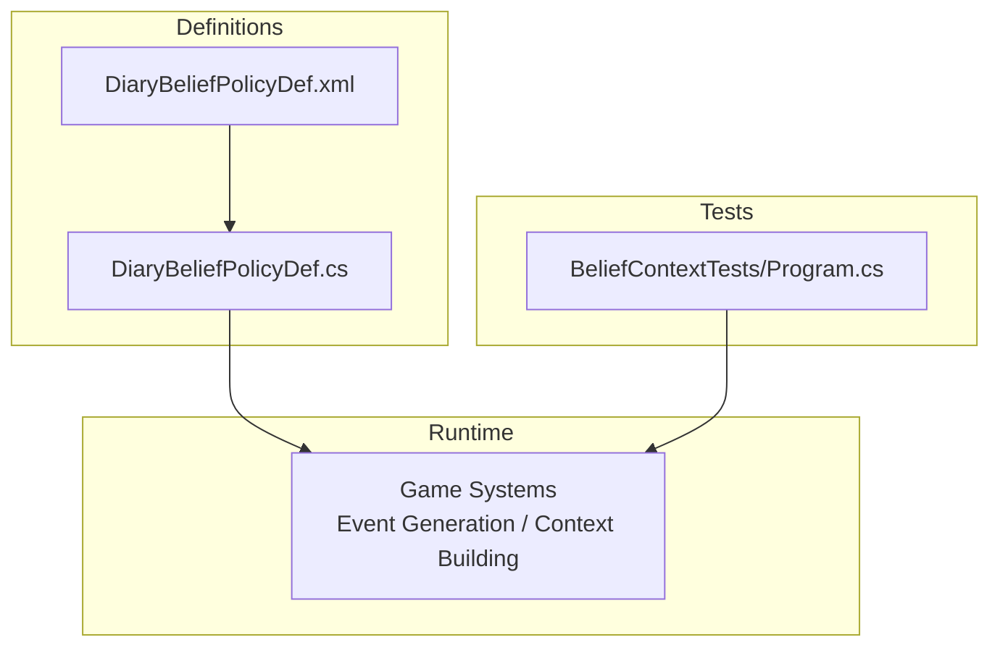
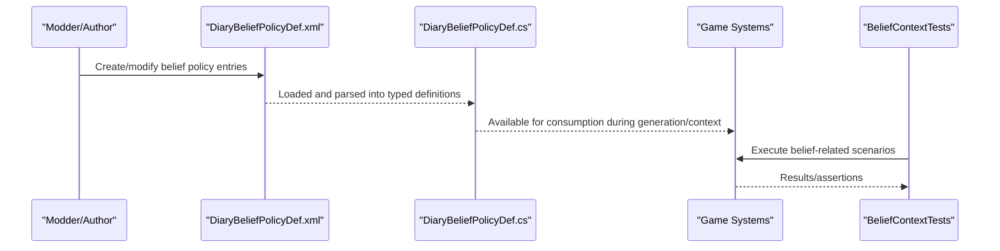
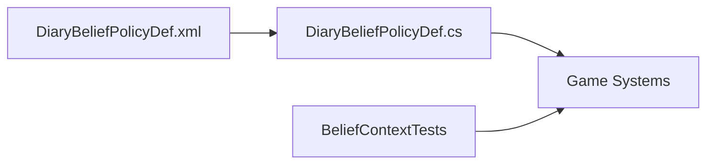

# Belief Policy Configuration

## Table of Contents
1. [Introduction](#introduction)
2. [Project Structure](#project-structure)
3. [Core Components](#core-components)
4. [Architecture Overview](#architecture-overview)
5. [Detailed Component Analysis](#detailed-component-analysis)
6. [Dependency Analysis](#dependency-analysis)
7. [Performance Considerations](#performance-considerations)
8. [Troubleshooting Guide](#troubleshooting-guide)
9. [Conclusion](#conclusion)

## Introduction
This document explains how belief-related policies are configured and consumed by the system. It focuses on the data-driven definition model, runtime resolution, and testing surface for belief behavior. The goal is to help modders and maintainers understand where belief policy configuration lives, what fields are available, and how they influence processing during event generation and context building.

## Project Structure
The belief policy configuration spans two primary areas:
- Definition schema (C#): Declares the structure and semantics of belief policy definitions.
- Data files (XML): Provides concrete instances of belief policies that can be referenced by other systems.
- Tests: Validate parsing and behavior around belief contexts.

**Diagram sources**
- [DiaryBeliefPolicyDef.cs](../../../../Source/Defs/DiaryBeliefPolicyDef.cs)
- [DiaryBeliefPolicyDef.xml](../../../../1.6/Defs/DiaryBeliefPolicyDef.xml)
- [BeliefContextTests.cs](../../../../tests/BeliefContextTests/Program.cs)

**Section sources**
- [DiaryBeliefPolicyDef.cs](../../../../Source/Defs/DiaryBeliefPolicyDef.cs)
- [DiaryBeliefPolicyDef.xml](../../../../1.6/Defs/DiaryBeliefPolicyDef.xml)
- [BeliefContextTests.cs](../../../../tests/BeliefContextTests/Program.cs)

## Core Components
- DiaryBeliefPolicyDef (C#): Defines the schema for belief policy entries. It specifies which fields are configurable and how they map into runtime behavior.
- DiaryBeliefPolicyDef.xml: Contains one or more belief policy definitions used by the game at runtime. These XML nodes reference the C# schema and provide concrete values.
- BeliefContextTests: Exercise belief-related logic to ensure definitions parse correctly and behave as expected under test conditions.

Key responsibilities:
- Provide a declarative way to configure belief-related behavior via XML.
- Expose typed accessors and validation through the C# definition class.
- Enable tests to assert correct parsing and downstream effects.

**Section sources**
- [DiaryBeliefPolicyDef.cs](../../../../Source/Defs/DiaryBeliefPolicyDef.cs)
- [DiaryBeliefPolicyDef.xml](../../../../1.6/Defs/DiaryBeliefPolicyDef.xml)
- [BeliefContextTests.cs](../../../../tests/BeliefContextTests/Program.cs)

## Architecture Overview
At a high level, belief policy configuration flows from XML data into typed definitions, which are then consumed by game systems during event generation and context building. Tests validate this pipeline.

**Diagram sources**
- [DiaryBeliefPolicyDef.cs](../../../../Source/Defs/DiaryBeliefPolicyDef.cs)
- [DiaryBeliefPolicyDef.xml](../../../../1.6/Defs/DiaryBeliefPolicyDef.xml)
- [BeliefContextTests.cs](../../../../tests/BeliefContextTests/Program.cs)

## Detailed Component Analysis

### DiaryBeliefPolicyDef (Definition Schema)
Purpose:
- Define the shape of belief policy entries.
- Provide strongly-typed access to configuration fields.
- Support validation and defaulting rules as needed.

Typical aspects covered by such a definition include:
- Identifier and metadata fields for referencing and display.
- Boolean or enumerated flags controlling behavior toggles.
- Numeric thresholds or weights influencing selection or scoring.
- References to other definitions or contextual parameters.

How it integrates:
- Other components load these definitions and use them to adjust narrative generation, memory handling, or prompt construction based on belief settings.

Best practices:
- Keep field names clear and stable to avoid breaking changes.
- Use defaults to minimize required XML boilerplate.
- Add validation to catch misconfigurations early.

**Section sources**
- [DiaryBeliefPolicyDef.cs](../../../../Source/Defs/DiaryBeliefPolicyDef.cs)

### DiaryBeliefPolicyDef.xml (Data Instances)
Purpose:
- Provide concrete belief policy configurations used at runtime.
- Allow authors to tailor belief behavior without recompiling code.

Common patterns:
- One node per belief policy entry with an ID and associated properties.
- Grouped sections for related policies or themes.
- Comments and organization to aid readability and maintenance.

Guidelines:
- Ensure IDs are unique and meaningful.
- Align XML fields exactly with the C# definition to prevent parse errors.
- Prefer small, focused policies that can be composed rather than monolithic ones.

**Section sources**
- [DiaryBeliefPolicyDef.xml](../../../../1.6/Defs/DiaryBeliefPolicyDef.xml)

### BeliefContextTests (Validation Surface)
Purpose:
- Verify that belief policies parse correctly and integrate with the rest of the system.
- Assert expected behaviors under various configurations.

What to check:
- Parsing success/failure for valid and invalid inputs.
- Default value application when fields are omitted.
- Downstream effects on event generation or context building.

Tips:
- Cover edge cases like missing references or out-of-range values.
- Include negative tests to ensure robust error handling.

**Section sources**
- [BeliefContextTests.cs](../../../../tests/BeliefContextTests/Program.cs)

## Dependency Analysis
The belief policy configuration has minimal external dependencies beyond the standard definition loading pipeline. The main relationships are:
- XML data depends on the C# definition schema for structure.
- Runtime systems depend on the C# definition for typed access.
- Tests depend on both the runtime and the definitions to validate behavior.

**Diagram sources**
- [DiaryBeliefPolicyDef.cs](../../../../Source/Defs/DiaryBeliefPolicyDef.cs)
- [DiaryBeliefPolicyDef.xml](../../../../1.6/Defs/DiaryBeliefPolicyDef.xml)
- [BeliefContextTests.cs](../../../../tests/BeliefContextTests/Program.cs)

**Section sources**
- [DiaryBeliefPolicyDef.cs](../../../../Source/Defs/DiaryBeliefPolicyDef.cs)
- [DiaryBeliefPolicyDef.xml](../../../../1.6/Defs/DiaryBeliefPolicyDef.xml)
- [BeliefContextTests.cs](../../../../tests/BeliefContextTests/Program.cs)

## Performance Considerations
- Keep belief policy definitions lean; avoid excessive nested structures or large arrays.
- Favor simple boolean flags and small numeric ranges to reduce branching complexity.
- Cache resolved policies if they are accessed frequently during tight loops.
- Avoid heavy computation inside hot paths; precompute derived values where possible.

[No sources needed since this section provides general guidance]

## Troubleshooting Guide
Common issues and resolutions:
- Parse errors: Ensure XML fields match the C# definition exactly, including names and types.
- Missing references: Verify that any referenced IDs exist and are loaded before use.
- Unexpected behavior: Check default values and precedence rules; confirm that tests cover the scenario.
- Logging and diagnostics: Use existing logging facilities to trace policy resolution and decision points.

**Section sources**
- [DiaryBeliefPolicyDef.cs](../../../../Source/Defs/DiaryBeliefPolicyDef.cs)
- [DiaryBeliefPolicyDef.xml](../../../../1.6/Defs/DiaryBeliefPolicyDef.xml)
- [BeliefContextTests.cs](../../../../tests/BeliefContextTests/Program.cs)

## Conclusion
Belief policy configuration is centered around a clear separation between typed definitions and data-driven XML instances. By adhering to the defined schema, organizing XML thoughtfully, and validating behavior through tests, you can reliably extend and tune belief-related narrative features. Keep definitions simple, well-documented, and test-covered to maintain stability and clarity over time.

[No sources needed since this section summarizes without analyzing specific files]
