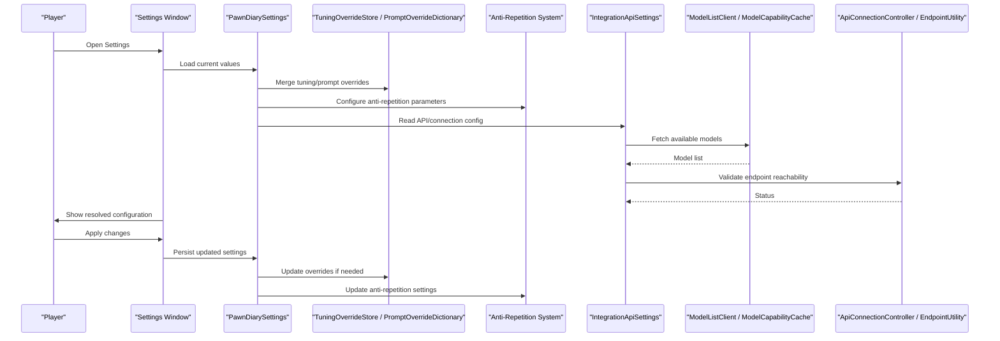
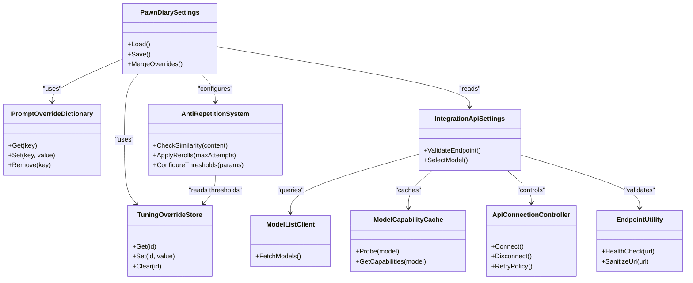

# Configuration & Customization

- [PawnDiarySettings.cs](../../../../Source/Settings/PawnDiarySettings.cs)
- [PawnDiaryMod.cs](../../../../Source/Settings/PawnDiaryMod.cs)
- [TuningOverrideStore.cs](../../../../Source/Settings/TuningOverrideStore.cs)
- [PromptOverrideDictionary.cs](../../../../Source/Settings/PromptOverrideDictionary.cs)
- [TuningOverrideMigration.cs](../../../../Source/Settings/TuningOverrideMigration.cs)
- [IntegrationApiSettings.cs](../../../../Source/Settings/IntegrationApiSettings.cs)
- [ModelListClient.cs](../../../../Source/Settings/ModelListClient.cs)
- [ModelCapabilityCache.cs](../../../../Source/Settings/ModelCapabilityCache.cs)
- [ApiConnectionController.cs](../../../../Source/Settings/ApiConnectionController.cs)
- [EndpointUtility.cs](../../../../Source/Settings/EndpointUtility.cs)
- [PawnDiaryMod.SettingsWindow.cs](../../../../Source/Settings/PawnDiaryMod.SettingsWindow.cs)
- [PawnDiaryMod.AdvancedTab.cs](../../../../Source/Settings/PawnDiaryMod.AdvancedTab.cs)
- [PawnDiaryMod.EventFilters.cs](../../../../Source/Settings/PawnDiaryMod.EventFilters.cs)
- [PawnDiaryMod.PromptStudio.cs](../../../../Source/Settings/PawnDiaryMod.PromptStudio.cs)
- [PawnDiaryMod.PersonaStudio.cs](../../../../Source/Settings/PawnDiaryMod.PersonaStudio.cs)
- [PawnDiaryMod.PsychotypeStudio.cs](../../../../Source/Settings/PawnDiaryMod.PsychotypeStudio.cs)
- [PersonaPresetStore.cs](../../../../Source/Settings/PersonaPresetStore.cs)
- [PsychotypePresetStore.cs](../../../../Source/Settings/PsychotypePresetStore.cs)
- [PromptSettingsMenuPolicy.cs](../../../../Source/Settings/PromptSettingsMenuPolicy.cs)
- [AdvancedFieldCatalog.cs](../../../../Source/Settings/AdvancedFieldCatalog.cs)
- [AdvancedRawSyntax.cs](../../../../Source/Settings/AdvancedRawSyntax.cs)
- [DiaryTuningDef.xml](../../../../1.6/Defs/DiaryTuningDef.xml)
- [DiaryUiStyleDef.xml](../../../../1.6/Defs/DiaryUiStyleDef.xml)
- [DiaryMemoryTuningDef.xml](../../../../1.6/Defs/DiaryMemoryTuningDef.xml)
- [DiaryPromptTemplateDefs.xml](../../../../1.6/Defs/DiaryPromptTemplateDefs.xml)
- [DiaryEventPromptDefs.xml](../../../../1.6/Defs/DiaryEventPromptDefs.xml)
- [DiaryTextDecorationDefs.xml](../../../../1.6/Defs/DiaryTextDecorationDefs.xml)
- [DiaryInteractionGroupDefs.xml](../../../../1.6/Defs/DiaryInteractionGroupDefs.xml)
- [DiaryObservedConditionDefs.xml](../../../../1.6/Defs/DiaryObservedConditionDefs.xml)
- [DiaryContextDetailDef.xml](../../../../1.6/Defs/DiaryContextDetailDef.xml)
- [DiaryNarrativeContinuityDefs.xml](../../../../1.6/Defs/DiaryNarrativeContinuityDefs.xml)
- [DiaryPersonaDefs.xml](../../../../1.6/Defs/DiaryPersonaDefs.xml)
- [DiaryPsychotypeDefs.xml](../../../../1.6/Defs/DiaryPsychotypeDefs.xml)
- [DiaryPsychotypeRollPolicyDefs.xml](../../../../1.6/Defs/DiaryPsychotypeRollPolicyDefs.xml)
- [DiaryPsychotypeTraitPolicyDefs.xml](../../../../1.6/Defs/DiaryPsychotypeTraitPolicyDefs.xml)
- [DiaryHediffPersonaOverrideDefs.xml](../../../../1.6/Defs/DiaryHediffPersonaOverrideDefs.xml)
- [DiarySignalPolicyDef.cs](../../../../Source/Defs/DiarySignalPolicyDef.cs)
- [DiaryTuningDef.cs](../../../../Source/Defs/DiaryTuningDef.cs)
- [DiaryUiStyleDef.cs](../../../../Source/Defs/DiaryUiStyleDef.cs)
- [DiaryMemoryTuningDef.cs](../../../../Source/Defs/DiaryMemoryTuningDef.cs)
- [DiaryPromptDef.cs](../../../../Source/Defs/DiaryPromptDef.cs)
- [DiaryTextDecorationDef.cs](../../../../Source/Defs/DiaryTextDecorationDef.cs)
- DiaryInteractionGroupDef.cs
- [DiaryObservedConditionDef.cs](../../../../Source/Defs/DiaryObservedConditionDef.cs)
- [DiaryContextDetailDef.cs](../../../../Source/Defs/DiaryContextDetailDef.cs)
- [DiaryNarrativeContinuityDef.cs](../../../../Source/Defs/DiaryNarrativeContinuityDef.cs)
- [DiaryPersonaDef.cs](../../../../Source/Defs/DiaryPersonaDef.cs)
- [DiaryPsychotypeDef.cs](../../../../Source/Defs/DiaryPsychotypeDef.cs)
- [DiaryPromptEnchantmentDefs.xml](../../../../1.6/Defs/DiaryPromptEnchantmentDefs.xml)
- [DiaryHumorCueDefs.xml](../../../../1.6/Defs/DiaryHumorCueDefs.xml)
- [DiaryAnomalyPolicyDefs.xml](../../../../1.6/Defs/DiaryAnomalyPolicyDefs.xml)
- [DiaryBiotechPolicyDefs.xml](../../../../1.6/Defs/DiaryBiotechPolicyDefs.xml)
- [DiaryOdysseyPolicyDefs.xml](../../../../1.6/Defs/DiaryOdysseyPolicyDefs.xml)
- [DiaryRoyaltyPolicyDefs.xml](../../../../1.6/Defs/DiaryRoyaltyPolicyDefs.xml)
- [DiaryEventWindowDefs.xml](../../../../1.6/Defs/DiaryEventWindowDefs.xml)
- [DiaryCompat_AlphaMemes.xml](../../../../1.6/Defs/Compat/DiaryCompat_AlphaMemes.xml)
- [DiaryCompat_VEE.xml](../../../../1.6/Defs/Compat/DiaryCompat_VEE.xml)
- [DiaryCompat_RimTalk.xml](../../../../1.6/Defs/Compat/DiaryCompat_RimTalk.xml)
- [DiaryCompat_Rimpsyche.xml](../../../../1.6/Defs/Compat/DiaryCompat_Rimpsyche.xml)
- [DiaryCompat_SpeakUp.xml](../../../../1.6/Defs/Compat/DiaryCompat_SpeakUp.xml)
- [DiaryCompat_WayBetterRomance.xml](../../../../1.6/Defs/Compat/DiaryCompat_WayBetterRomance.xml)
- [DiaryCompat_VIEMemes.xml](../../../../1.6/Defs/Compat/DiaryCompat_VIEMemes.xml)
- [DiaryCompat_VTE.xml](../../../../1.6/Defs/Compat/DiaryCompat_VTE.xml)
- [DiaryCompat_Hospitality.xml](../../../../1.6/Defs/Compat/DiaryCompat_Hospitality.xml)
- [DiaryEventWindows_Hospitality.xml](../../../../1.6/Defs/Compat/DiaryEventWindows_Hospitality.xml)
- [DiaryObservedConditions_VEE.xml](../../../../1.6/Defs/Compat/DiaryObservedConditions_VEE.xml)
- [VtePsychotypeAffinities.xml](../../../../1.6/Patches/VtePsychotypeAffinities.xml)
- [PawnDiary.xml](../../../../Languages/English/Keyed/PawnDiary.xml)
- [PawnDiary_Hospitality.xml](../../../../Languages/English/Keyed/PawnDiary_Hospitality.xml)
- [PawnDiary_VEE.xml](../../../../Languages/English/Keyed/PawnDiary_VEE.xml)
## Update Summary
**Changes Made**
- Added comprehensive documentation for the new anti-repetition system tuning options
- Updated tuning parameters section to include anti-repetition configuration
- Enhanced performance considerations with anti-repetition guidance
- Added troubleshooting information for anti-repetition issues

## Table of Contents
1. [Introduction](#introduction)
2. [Project Structure](#project-structure)
3. [Core Components](#core-components)
4. [Architecture Overview](#architecture-overview)
5. [Detailed Component Analysis](#detailed-component-analysis)
6. [Anti-Repetition System Configuration](#anti-repetition-system-configuration)
7. [Dependency Analysis](#dependency-analysis)
8. [Performance Considerations](#performance-considerations)
9. [Troubleshooting Guide](#troubleshooting-guide)
10. [Conclusion](#conclusion)
11. [Appendices](#appendices)

## Introduction
This document explains how Pawn Diary's configuration and customization system works, including the settings architecture, XML definition files, runtime management, tuning parameters, prompt overrides, writing style customizations, UI appearance options, localization support, and multi-language setup procedures. It also provides examples for common customization scenarios, performance tuning guidelines, and troubleshooting steps. The system now includes comprehensive anti-repetition controls to prevent repetitive content generation.

## Project Structure
The configuration system spans three layers:
- Definition layer (XML): Tuning, UI styles, prompts, decorations, interaction groups, observed conditions, narrative continuity, persona/psychotype definitions, and DLC/compatibility policies.
- Runtime settings layer (C#): Global mod settings, API connection settings, override stores, studio menus, and migration utilities.
- Localization layer (Language packs): Keyed strings and DefInjected entries for English and Russian.

```mermaid
graph TB
subgraph "Definitions (XML)"
D1["DiaryTuningDef.xml"]
D2["DiaryUiStyleDef.xml"]
D3["DiaryMemoryTuningDef.xml"]
D4["DiaryPromptTemplateDefs.xml"]
D5["DiaryEventPromptDefs.xml"]
D6["DiaryTextDecorationDefs.xml"]
D7["DiaryInteractionGroupDefs.xml"]
D8["DiaryObservedConditionDefs.xml"]
D9["DiaryContextDetailDef.xml"]
D10["DiaryNarrativeContinuityDefs.xml"]
D11["DiaryPersonaDefs.xml"]
D12["DiaryPsychotypeDefs.xml"]
D13["DiaryPromptEnchantmentDefs.xml"]
D14["DiaryHumorCueDefs.xml"]
D15["DLC Policies (Anomaly/Biotech/Odyssey/Royalty)"]
D16["Compat Patches"]
end
subgraph "Runtime Settings (C#)"
S1["PawnDiarySettings.cs"]
S2["TuningOverrideStore.cs"]
S3["PromptOverrideDictionary.cs"]
S4["IntegrationApiSettings.cs"]
S5["ModelListClient.cs"]
S6["ModelCapabilityCache.cs"]
S7["ApiConnectionController.cs"]
S8["EndpointUtility.cs"]
S9["PawnDiaryMod.cs"]
S10["Settings Window + Tabs"]
S11["Prompt Studio / Persona Studio / Psychotype Studio"]
S12["PromptSettingsMenuPolicy.cs"]
S13["AdvancedFieldCatalog.cs"]
S14["AdvancedRawSyntax.cs"]
S15["TuningOverrideMigration.cs"]
end
subgraph "Localization"
L1["English Keyed"]
L2["Russian Keyed"]
L3["DefInjected (EN/RU)"]
end
D1 --> S1
D2 --> S1
D3 --> S1
D4 --> S1
D5 --> S1
D6 --> S1
D7 --> S1
D8 --> S1
D9 --> S1
D10 --> S1
D11 --> S1
D12 --> S1
D13 --> S1
D14 --> S1
D15 --> S1
D16 --> S1
S1 --> S2
S1 --> S3
S1 --> S4
S1 --> S5
S1 --> S6
S1 --> S7
S1 --> S8
S1 --> S9
S1 --> S10
S1 --> S11
S1 --> S12
S1 --> S13
S1 --> S14
S1 --> S15
L1 --> S1
L2 --> S1
L3 --> S1
```



**Diagram sources**
- [DiaryTuningDef.xml](../../../../1.6/Defs/DiaryTuningDef.xml)
- [DiaryUiStyleDef.xml](../../../../1.6/Defs/DiaryUiStyleDef.xml)
- [DiaryMemoryTuningDef.xml](../../../../1.6/Defs/DiaryMemoryTuningDef.xml)
- [DiaryPromptTemplateDefs.xml](../../../../1.6/Defs/DiaryPromptTemplateDefs.xml)
- [DiaryEventPromptDefs.xml](../../../../1.6/Defs/DiaryEventPromptDefs.xml)
- [DiaryTextDecorationDefs.xml](../../../../1.6/Defs/DiaryTextDecorationDefs.xml)
- [DiaryInteractionGroupDefs.xml](../../../../1.6/Defs/DiaryInteractionGroupDefs.xml)
- [DiaryObservedConditionDefs.xml](../../../../1.6/Defs/DiaryObservedConditionDefs.xml)
- [DiaryContextDetailDef.xml](../../../../1.6/Defs/DiaryContextDetailDef.xml)
- [DiaryNarrativeContinuityDefs.xml](../../../../1.6/Defs/DiaryNarrativeContinuityDefs.xml)
- [DiaryPersonaDefs.xml](../../../../1.6/Defs/DiaryPersonaDefs.xml)
- [DiaryPsychotypeDefs.xml](../../../../1.6/Defs/DiaryPsychotypeDefs.xml)
- [DiaryPromptEnchantmentDefs.xml](../../../../1.6/Defs/DiaryPromptEnchantmentDefs.xml)
- [DiaryHumorCueDefs.xml](../../../../1.6/Defs/DiaryHumorCueDefs.xml)
- [DiaryAnomalyPolicyDefs.xml](../../../../1.6/Defs/DiaryAnomalyPolicyDefs.xml)
- [DiaryBiotechPolicyDefs.xml](../../../../1.6/Defs/DiaryBiotechPolicyDefs.xml)
- [DiaryOdysseyPolicyDefs.xml](../../../../1.6/Defs/DiaryOdysseyPolicyDefs.xml)
- [DiaryRoyaltyPolicyDefs.xml](../../../../1.6/Defs/DiaryRoyaltyPolicyDefs.xml)
- [DiaryCompat_AlphaMemes.xml](../../../../1.6/Defs/Compat/DiaryCompat_AlphaMemes.xml)
- [DiaryCompat_VEE.xml](../../../../1.6/Defs/Compat/DiaryCompat_VEE.xml)
- [DiaryCompat_RimTalk.xml](../../../../1.6/Defs/Compat/DiaryCompat_RimTalk.xml)
- [DiaryCompat_Rimpsyche.xml](../../../../1.6/Defs/Compat/DiaryCompat_Rimpsyche.xml)
- [DiaryCompat_SpeakUp.xml](../../../../1.6/Defs/Compat/DiaryCompat_SpeakUp.xml)
- [DiaryCompat_WayBetterRomance.xml](../../../../1.6/Defs/Compat/DiaryCompat_WayBetterRomance.xml)
- [DiaryCompat_VIEMemes.xml](../../../../1.6/Defs/Compat/DiaryCompat_VIEMemes.xml)
- [DiaryCompat_VTE.xml](../../../../1.6/Defs/Compat/DiaryCompat_VTE.xml)
- [DiaryCompat_Hospitality.xml](../../../../1.6/Defs/Compat/DiaryCompat_Hospitality.xml)
- [DiaryEventWindows_Hospitality.xml](../../../../1.6/Defs/Compat/DiaryEventWindows_Hospitality.xml)
- [DiaryObservedConditions_VEE.xml](../../../../1.6/Defs/Compat/DiaryObservedConditions_VEE.xml)
- [PawnDiarySettings.cs](../../../../Source/Settings/PawnDiarySettings.cs)
- [TuningOverrideStore.cs](../../../../Source/Settings/TuningOverrideStore.cs)
- [PromptOverrideDictionary.cs](../../../../Source/Settings/PromptOverrideDictionary.cs)
- [IntegrationApiSettings.cs](../../../../Source/Settings/IntegrationApiSettings.cs)
- [ModelListClient.cs](../../../../Source/Settings/ModelListClient.cs)
- [ModelCapabilityCache.cs](../../../../Source/Settings/ModelCapabilityCache.cs)
- [ApiConnectionController.cs](../../../../Source/Settings/ApiConnectionController.cs)
- [EndpointUtility.cs](../../../../Source/Settings/EndpointUtility.cs)
- [PawnDiaryMod.cs](../../../../Source/Settings/PawnDiaryMod.cs)
- [PawnDiaryMod.SettingsWindow.cs](../../../../Source/Settings/PawnDiaryMod.SettingsWindow.cs)
- [PawnDiaryMod.AdvancedTab.cs](../../../../Source/Settings/PawnDiaryMod.AdvancedTab.cs)
- [PawnDiaryMod.EventFilters.cs](../../../../Source/Settings/PawnDiaryMod.EventFilters.cs)
- [PawnDiaryMod.PromptStudio.cs](../../../../Source/Settings/PawnDiaryMod.PromptStudio.cs)
- [PawnDiaryMod.PersonaStudio.cs](../../../../Source/Settings/PawnDiaryMod.PersonaStudio.cs)
- [PawnDiaryMod.PsychotypeStudio.cs](../../../../Source/Settings/PawnDiaryMod.PsychotypeStudio.cs)
- [PromptSettingsMenuPolicy.cs](../../../../Source/Settings/PromptSettingsMenuPolicy.cs)
- [AdvancedFieldCatalog.cs](../../../../Source/Settings/AdvancedFieldCatalog.cs)
- [AdvancedRawSyntax.cs](../../../../Source/Settings/AdvancedRawSyntax.cs)
- [TuningOverrideMigration.cs](../../../../Source/Settings/TuningOverrideMigration.cs)
- [PawnDiary.xml](../../../../Languages/English/Keyed/PawnDiary.xml)
- [PawnDiary_Hospitality.xml](../../../../Languages/English/Keyed/PawnDiary_Hospitality.xml)
- [PawnDiary_VEE.xml](../../../../Languages/English/Keyed/PawnDiary_VEE.xml)

**Section sources**
- [PawnDiarySettings.cs](../../../../Source/Settings/PawnDiarySettings.cs)
- [PawnDiaryMod.cs](../../../../Source/Settings/PawnDiaryMod.cs)
- [DiaryTuningDef.xml](../../../../1.6/Defs/DiaryTuningDef.xml)
- [DiaryUiStyleDef.xml](../../../../1.6/Defs/DiaryUiStyleDef.xml)
- [DiaryMemoryTuningDef.xml](../../../../1.6/Defs/DiaryMemoryTuningDef.xml)
- [DiaryPromptTemplateDefs.xml](../../../../1.6/Defs/DiaryPromptTemplateDefs.xml)
- [DiaryEventPromptDefs.xml](../../../../1.6/Defs/DiaryEventPromptDefs.xml)
- [DiaryTextDecorationDefs.xml](../../../../1.6/Defs/DiaryTextDecorationDefs.xml)
- [DiaryInteractionGroupDefs.xml](../../../../1.6/Defs/DiaryInteractionGroupDefs.xml)
- [DiaryObservedConditionDefs.xml](../../../../1.6/Defs/DiaryObservedConditionDefs.xml)
- [DiaryContextDetailDef.xml](../../../../1.6/Defs/DiaryContextDetailDef.xml)
- [DiaryNarrativeContinuityDefs.xml](../../../../1.6/Defs/DiaryNarrativeContinuityDefs.xml)
- [DiaryPersonaDefs.xml](../../../../1.6/Defs/DiaryPersonaDefs.xml)
- [DiaryPsychotypeDefs.xml](../../../../1.6/Defs/DiaryPsychotypeDefs.xml)
- [DiaryPromptEnchantmentDefs.xml](../../../../1.6/Defs/DiaryPromptEnchantmentDefs.xml)
- [DiaryHumorCueDefs.xml](../../../../1.6/Defs/DiaryHumorCueDefs.xml)
- [DiaryAnomalyPolicyDefs.xml](../../../../1.6/Defs/DiaryAnomalyPolicyDefs.xml)
- [DiaryBiotechPolicyDefs.xml](../../../../1.6/Defs/DiaryBiotechPolicyDefs.xml)
- [DiaryOdysseyPolicyDefs.xml](../../../../1.6/Defs/DiaryOdysseyPolicyDefs.xml)
- [DiaryRoyaltyPolicyDefs.xml](../../../../1.6/Defs/DiaryRoyaltyPolicyDefs.xml)
- [DiaryCompat_AlphaMemes.xml](../../../../1.6/Defs/Compat/DiaryCompat_AlphaMemes.xml)
- [DiaryCompat_VEE.xml](../../../../1.6/Defs/Compat/DiaryCompat_VEE.xml)
- [DiaryCompat_RimTalk.xml](../../../../1.6/Defs/Compat/DiaryCompat_RimTalk.xml)
- [DiaryCompat_Rimpsyche.xml](../../../../1.6/Defs/Compat/DiaryCompat_Rimpsyche.xml)
- [DiaryCompat_SpeakUp.xml](../../../../1.6/Defs/Compat/DiaryCompat_SpeakUp.xml)
- [DiaryCompat_WayBetterRomance.xml](../../../../1.6/Defs/Compat/DiaryCompat_WayBetterRomance.xml)
- [DiaryCompat_VIEMemes.xml](../../../../1.6/Defs/Compat/DiaryCompat_VIEMemes.xml)
- [DiaryCompat_VTE.xml](../../../../1.6/Defs/Compat/DiaryCompat_VTE.xml)
- [DiaryCompat_Hospitality.xml](../../../../1.6/Defs/Compat/DiaryCompat_Hospitality.xml)
- [DiaryEventWindows_Hospitality.xml](../../../../1.6/Defs/Compat/DiaryEventWindows_Hospitality.xml)
- [DiaryObservedConditions_VEE.xml](../../../../1.6/Defs/Compat/DiaryObservedConditions_VEE.xml)
- [PawnDiary.xml](../../../../Languages/English/Keyed/PawnDiary.xml)
- [PawnDiary_Hospitality.xml](../../../../Languages/English/Keyed/PawnDiary_Hospitality.xml)
- [PawnDiary_VEE.xml](../../../../Languages/English/Keyed/PawnDiary_VEE.xml)

## Core Components
- Global settings container: Centralizes all user-facing toggles, thresholds, and UI preferences.
- Override stores: Allow runtime or per-save overrides for tuning and prompts without editing base defs.
- API integration settings: Manage external endpoints, authentication, model discovery, and capability caching.
- UI and studios: Provide in-game interfaces to adjust settings, test prompts, manage personas and psychotypes, and filter events.
- Migration utilities: Ensure compatibility across version changes for tuning overrides.
- Anti-repetition system: Prevents repetitive content generation through configurable thresholds and reroll mechanisms.

**Section sources**
- [PawnDiarySettings.cs](../../../../Source/Settings/PawnDiarySettings.cs)
- [TuningOverrideStore.cs](../../../../Source/Settings/TuningOverrideStore.cs)
- [PromptOverrideDictionary.cs](../../../../Source/Settings/PromptOverrideDictionary.cs)
- [IntegrationApiSettings.cs](../../../../Source/Settings/IntegrationApiSettings.cs)
- [ModelListClient.cs](../../../../Source/Settings/ModelListClient.cs)
- [ModelCapabilityCache.cs](../../../../Source/Settings/ModelCapabilityCache.cs)
- [ApiConnectionController.cs](../../../../Source/Settings/ApiConnectionController.cs)
- [EndpointUtility.cs](../../../../Source/Settings/EndpointUtility.cs)
- [PawnDiaryMod.SettingsWindow.cs](../../../../Source/Settings/PawnDiaryMod.SettingsWindow.cs)
- [PawnDiaryMod.AdvancedTab.cs](../../../../Source/Settings/PawnDiaryMod.AdvancedTab.cs)
- [PawnDiaryMod.EventFilters.cs](../../../../Source/Settings/PawnDiaryMod.EventFilters.cs)
- [PawnDiaryMod.PromptStudio.cs](../../../../Source/Settings/PawnDiaryMod.PromptStudio.cs)
- [PawnDiaryMod.PersonaStudio.cs](../../../../Source/Settings/PawnDiaryMod.PersonaStudio.cs)
- [PawnDiaryMod.PsychotypeStudio.cs](../../../../Source/Settings/PawnDiaryMod.PsychotypeStudio.cs)
- [PromptSettingsMenuPolicy.cs](../../../../Source/Settings/PromptSettingsMenuPolicy.cs)
- [AdvancedFieldCatalog.cs](../../../../Source/Settings/AdvancedFieldCatalog.cs)
- [AdvancedRawSyntax.cs](../../../../Source/Settings/AdvancedRawSyntax.cs)
- [TuningOverrideMigration.cs](../../../../Source/Settings/TuningOverrideMigration.cs)

## Architecture Overview
The configuration system follows a layered approach:
- Definitions define the schema and defaults.
- Runtime settings load and merge overrides.
- UI exposes controls to modify settings and preview effects.
- Localization resolves text at runtime based on active language.



**Diagram sources**
- [PawnDiarySettings.cs](../../../../Source/Settings/PawnDiarySettings.cs)
- [TuningOverrideStore.cs](../../../../Source/Settings/TuningOverrideStore.cs)
- [PromptOverrideDictionary.cs](../../../../Source/Settings/PromptOverrideDictionary.cs)
- [IntegrationApiSettings.cs](../../../../Source/Settings/IntegrationApiSettings.cs)
- [ModelListClient.cs](../../../../Source/Settings/ModelListClient.cs)
- [ModelCapabilityCache.cs](../../../../Source/Settings/ModelCapabilityCache.cs)
- [ApiConnectionController.cs](../../../../Source/Settings/ApiConnectionController.cs)
- [EndpointUtility.cs](../../../../Source/Settings/EndpointUtility.cs)
- [PawnDiaryMod.SettingsWindow.cs](../../../../Source/Settings/PawnDiaryMod.SettingsWindow.cs)

## Detailed Component Analysis

### Global Settings Container
- Purpose: Holds all mod-wide configuration, including toggles, thresholds, and UI preferences.
- Persistence: Saves and loads across game sessions; merges with overrides.
- Integration: Consumed by UI components, studios, and runtime systems.

Common categories include:
- General behavior toggles
- Performance-related limits
- Anti-repetition system controls
- UI appearance options
- API connection and model selection
- Event filtering and capture rules

**Section sources**
- [PawnDiarySettings.cs](../../../../Source/Settings/PawnDiarySettings.cs)
- [PawnDiaryMod.cs](../../../../Source/Settings/PawnDiaryMod.cs)

### Tuning Overrides System
- Purpose: Allows overriding tuning parameters defined in XML without modifying base files.
- Storage: Persistent store keyed by tuning def IDs.
- Migration: Handles schema evolution between versions.

Typical use cases:
- Adjust memory retention windows
- Tune humor chance or reflection frequency
- Modify event window durations
- Configure anti-repetition thresholds and limits

**Section sources**
- [TuningOverrideStore.cs](../../../../Source/Settings/TuningOverrideStore.cs)
- [TuningOverrideMigration.cs](../../../../Source/Settings/TuningOverrideMigration.cs)
- [DiaryTuningDef.xml](../../../../1.6/Defs/DiaryTuningDef.xml)
- [DiaryMemoryTuningDef.xml](../../../../1.6/Defs/DiaryMemoryTuningDef.xml)

### Prompt Overrides System
- Purpose: Replace or augment default prompt templates and event-specific prompts at runtime.
- Storage: Dictionary keyed by prompt template/event keys.
- UI: Integrated into Prompt Studio for testing and iteration.

Common scenarios:
- Customize tone or length of generated prose
- Inject domain-specific context into prompts
- A/B test different phrasing variants

**Section sources**
- [PromptOverrideDictionary.cs](../../../../Source/Settings/PromptOverrideDictionary.cs)
- [DiaryPromptTemplateDefs.xml](../../../../1.6/Defs/DiaryPromptTemplateDefs.xml)
- [DiaryEventPromptDefs.xml](../../../../1.6/Defs/DiaryEventPromptDefs.xml)
- [PawnDiaryMod.PromptStudio.cs](../../../../Source/Settings/PawnDiaryMod.PromptStudio.cs)
- [PromptSettingsMenuPolicy.cs](../../../../Source/Settings/PromptSettingsMenuPolicy.cs)

### API Integration Settings
- Purpose: Configure external AI endpoints, authentication, model discovery, and capability detection.
- Components:
  - Connection controller for lifecycle and retries
  - Endpoint utility for validation and health checks
  - Model list client for enumerating available models
  - Capability cache to avoid repeated probing

Operational flow:
- Discover models
- Probe capabilities
- Select target model
- Validate connectivity

**Section sources**
- [IntegrationApiSettings.cs](../../../../Source/Settings/IntegrationApiSettings.cs)
- [ApiConnectionController.cs](../../../../Source/Settings/ApiConnectionController.cs)
- [EndpointUtility.cs](../../../../Source/Settings/EndpointUtility.cs)
- [ModelListClient.cs](../../../../Source/Settings/ModelListClient.cs)
- [ModelCapabilityCache.cs](../../../../Source/Settings/ModelCapabilityCache.cs)

### UI Appearance and Interaction Controls
- Purpose: Control visual presentation and interaction behaviors in the diary tab and related screens.
- Options include:
  - Text decoration usage
  - Name highlighting
  - Paragraph reflow and formatting
  - Entry card sizing and layout
  - Year paging and visibility filters

These are driven by both global settings and UI style definitions.

**Section sources**
- [DiaryUiStyleDef.xml](../../../../1.6/Defs/DiaryUiStyleDef.xml)
- [DiaryTextDecorationDefs.xml](../../../../1.6/Defs/DiaryTextDecorationDefs.xml)
- [DiaryInteractionGroupDefs.xml](../../../../1.6/Defs/DiaryInteractionGroupDefs.xml)
- [PawnDiaryMod.SettingsWindow.cs](../../../../Source/Settings/PawnDiaryMod.SettingsWindow.cs)
- [PawnDiaryMod.AdvancedTab.cs](../../../../Source/Settings/PawnDiaryMod.AdvancedTab.cs)
- [PawnDiaryMod.EventFilters.cs](../../../../Source/Settings/PawnDiaryMod.EventFilters.cs)

### Writing Style and Persona Customization
- Purpose: Define and adjust character voice, persona traits, and psychotype influences.
- Tools:
  - Persona Studio for managing persona presets
  - Psychotype Studio for psychotype roll/trait policies
  - Preset stores for saving/loading configurations

Use cases:
- Align output with roleplay themes
- Bias generation toward specific personality dimensions
- Balance humor, formality, and verbosity

**Section sources**
- [DiaryPersonaDefs.xml](../../../../1.6/Defs/DiaryPersonaDefs.xml)
- [DiaryPsychotypeDefs.xml](../../../../1.6/Defs/DiaryPsychotypeDefs.xml)
- [DiaryPsychotypeRollPolicyDefs.xml](../../../../1.6/Defs/DiaryPsychotypeRollPolicyDefs.xml)
- [DiaryPsychotypeTraitPolicyDefs.xml](../../../../1.6/Defs/DiaryPsychotypeTraitPolicyDefs.xml)
- [PersonaPresetStore.cs](../../../../Source/Settings/PersonaPresetStore.cs)
- [PsychotypePresetStore.cs](../../../../Source/Settings/PsychotypePresetStore.cs)
- [PawnDiaryMod.PersonaStudio.cs](../../../../Source/Settings/PawnDiaryMod.PersonaStudio.cs)
- [PawnDiaryMod.PsychotypeStudio.cs](../../../../Source/Settings/PawnDiaryMod.PsychotypeStudio.cs)

### Advanced Raw Syntax and Field Catalog
- Purpose: Provide advanced users with fine-grained control over raw configuration fields and syntax.
- Features:
  - Advanced field catalog for discoverable options
  - Raw syntax editor for power users

Caution: Changes may affect stability; validate after applying.

**Section sources**
- [AdvancedFieldCatalog.cs](../../../../Source/Settings/AdvancedFieldCatalog.cs)
- [AdvancedRawSyntax.cs](../../../../Source/Settings/AdvancedRawSyntax.cs)

### DLC and Compatibility Policies
- Purpose: Extend or adapt behavior for supported DLCs and third-party mods.
- Examples:
  - Anomaly, Biotech, Odyssey, Royalty policy definitions
  - Compat patches for VEE, RimTalk, SpeakUp, WayBetterRomance, etc.
  - Observed condition extensions and event window integrations

These can influence what contexts are captured and how prompts are assembled.

**Section sources**
- [DiaryAnomalyPolicyDefs.xml](../../../../1.6/Defs/DiaryAnomalyPolicyDefs.xml)
- [DiaryBiotechPolicyDefs.xml](../../../../1.6/Defs/DiaryBiotechPolicyDefs.xml)
- [DiaryOdysseyPolicyDefs.xml](../../../../1.6/Defs/DiaryOdysseyPolicyDefs.xml)
- [DiaryRoyaltyPolicyDefs.xml](../../../../1.6/Defs/DiaryRoyaltyPolicyDefs.xml)
- [DiaryCompat_AlphaMemes.xml](../../../../1.6/Defs/Compat/DiaryCompat_AlphaMemes.xml)
- [DiaryCompat_VEE.xml](../../../../1.6/Defs/Compat/DiaryCompat_VEE.xml)
- [DiaryCompat_RimTalk.xml](../../../../1.6/Defs/Compat/DiaryCompat_RimTalk.xml)
- [DiaryCompat_Rimpsyche.xml](../../../../1.6/Defs/Compat/DiaryCompat_Rimpsyche.xml)
- [DiaryCompat_SpeakUp.xml](../../../../1.6/Defs/Compat/DiaryCompat_SpeakUp.xml)
- [DiaryCompat_WayBetterRomance.xml](../../../../1.6/Defs/Compat/DiaryCompat_WayBetterRomance.xml)
- [DiaryCompat_VIEMemes.xml](../../../../1.6/Defs/Compat/DiaryCompat_VIEMemes.xml)
- [DiaryCompat_VTE.xml](../../../../1.6/Defs/Compat/DiaryCompat_VTE.xml)
- [DiaryCompat_Hospitality.xml](../../../../1.6/Defs/Compat/DiaryCompat_Hospitality.xml)
- [DiaryEventWindows_Hospitality.xml](../../../../1.6/Defs/Compat/DiaryEventWindows_Hospitality.xml)
- [DiaryObservedConditions_VEE.xml](../../../../1.6/Defs/Compat/DiaryObservedConditions_VEE.xml)
- [VtePsychotypeAffinities.xml](../../../../1.6/Patches/VtePsychotypeAffinities.xml)

### Localization Support and Multi-Language Setup
- Language packs provide:
  - Keyed strings for UI labels and messages
  - DefInjected entries to localize definitions
- Supported languages include English and Russian.

Setup procedure:
- Enable desired language pack in mod manager
- Ensure DefInjected files are present for localized content
- Verify that Keyed files contain required keys
- Restart game to apply language changes

Troubleshooting:
- Missing keys fall back to English
- Conflicting injections should be resolved by adjusting load order

**Section sources**
- [PawnDiary.xml](../../../../Languages/English/Keyed/PawnDiary.xml)
- [PawnDiary_Hospitality.xml](../../../../Languages/English/Keyed/PawnDiary_Hospitality.xml)
- [PawnDiary_VEE.xml](../../../../Languages/English/Keyed/PawnDiary_VEE.xml)

## Anti-Repetition System Configuration

**New** The anti-repetition system prevents repetitive content generation through configurable thresholds and intelligent reroll mechanisms.

### System Overview
The anti-repetition system monitors recently generated content and applies various strategies to ensure diversity in diary entries. It operates through multiple layers of detection and prevention.

### Configuration Parameters

#### Enable Flags
- **System Enable**: Master toggle to activate/deactivate the entire anti-repetition system
- **Per-Mode Enable**: Individual toggles for different generation modes (reflection, event-based, etc.)
- **Selective Enable**: Fine-grained control over which types of repetition to prevent

#### Threshold Settings
- **Similarity Threshold**: Minimum similarity score (0.0-1.0) to consider content repetitive
- **Semantic Similarity Weight**: Importance given to semantic meaning vs. exact wording
- **Structural Similarity Weight**: Importance given to sentence structure patterns
- **Contextual Similarity Weight**: Importance given to surrounding context patterns

#### Recent Count Limits
- **Recent Entries Window**: Number of recent entries to check against for repetition
- **Time-Based Window**: Time period (in game days) to consider for recent content analysis
- **Content Type Filtering**: Which types of content to include in repetition checking
- **Priority Scoring**: Weight given to more recent entries in similarity calculations

#### Maximum Reroll Counts
- **Generation Attempts**: Maximum number of times to attempt regeneration when repetition is detected
- **Fallback Strategy**: What to do when maximum rerolls are exhausted
- **Progressive Relaxation**: How to gradually relax constraints during rerolls
- **Quality Preservation**: Mechanisms to maintain content quality during rerolls

### XML Definition Structure
Anti-repetition tuning options are exposed through XML definitions in the tuning system:

```xml
<!-- Example anti-repetition tuning definition -->
<DiaryTuningDef>
  <defName>AntiRepetitionConfig</defName>
  <label>Anti-Repetition Settings</label>
  <description>Configuration for preventing repetitive content generation</description>

  <!-- Enable flags -->
  <enableAntiRepetition>true</enableAntiRepetition>
  <enableSemanticAnalysis>true</enableSemanticAnalysis>
  <enableStructuralAnalysis>true</enableStructuralAnalysis>

  <!-- Threshold settings -->
  <similarityThreshold>0.75</similarityThreshold>
  <semanticWeight>0.6</semanticWeight>
  <structuralWeight>0.3</structuralWeight>
  <contextualWeight>0.1</contextualWeight>

  <!-- Recent count limits -->
  <recentEntriesCount>10</recentEntriesCount>
  <recentDaysWindow>30</recentDaysWindow>
  <includeReflections>true</includeReflections>
  <includeEvents>true</includeEvents>

  <!-- Maximum reroll counts -->
  <maxRerollAttempts>3</maxRerollAttempts>
  <fallbackStrategy>useOriginal</fallbackStrategy>
  <progressiveRelaxation>true</progressiveRelaxation>
  <qualityPreservation>true</qualityPreservation>
</DiaryTuningDef>
```

### Advanced Settings Interface
The anti-repetition system is accessible through the advanced settings interface:

- **Settings Window**: Primary configuration panel with categorized options
- **Advanced Tab**: Expert-level controls for fine-tuning behavior
- **Event Filters**: Integration with event filtering to control scope
- **Prompt Studio**: Testing interface for anti-repetition effectiveness

### Performance Impact Considerations
- **Computational Overhead**: Similarity calculations require additional processing time
- **Memory Usage**: Recent content storage increases memory footprint
- **Network Impact**: Minimal impact as analysis is local
- **Scalability**: System scales with entry count but remains responsive

### Troubleshooting Anti-Repetition Issues

#### Common Problems
- **Overly Aggressive Prevention**: Content being rejected too frequently
- **Insufficient Diversity**: Repetitive content still appearing
- **Performance Issues**: Generation becoming noticeably slower
- **Configuration Conflicts**: Interactions with other tuning parameters

#### Resolution Strategies
- **Adjust Thresholds**: Lower similarity threshold for stricter prevention
- **Modify Recent Window**: Reduce recent entries count for better performance
- **Tune Weights**: Adjust semantic vs structural weights based on content type
- **Limit Rerolls**: Reduce maximum reroll attempts to prevent infinite loops

**Section sources**
- [DiaryTuningDef.xml](../../../../1.6/Defs/DiaryTuningDef.xml)
- [TuningOverrideStore.cs](../../../../Source/Settings/TuningOverrideStore.cs)
- [AdvancedFieldCatalog.cs](../../../../Source/Settings/AdvancedFieldCatalog.cs)
- [PawnDiaryMod.AdvancedTab.cs](../../../../Source/Settings/PawnDiaryMod.AdvancedTab.cs)

## Dependency Analysis
Configuration components interact through clear contracts:
- Settings depend on override stores for precedence resolution.
- UI depends on settings and studios for live previews.
- API settings depend on model clients and capability caches.
- DLC/compat policies extend core behavior via additional definitions.
- Anti-repetition system integrates with generation pipeline and tuning overrides.



**Diagram sources**
- [PawnDiarySettings.cs](../../../../Source/Settings/PawnDiarySettings.cs)
- [TuningOverrideStore.cs](../../../../Source/Settings/TuningOverrideStore.cs)
- [PromptOverrideDictionary.cs](../../../../Source/Settings/PromptOverrideDictionary.cs)
- [IntegrationApiSettings.cs](../../../../Source/Settings/IntegrationApiSettings.cs)
- [ModelListClient.cs](../../../../Source/Settings/ModelListClient.cs)
- [ModelCapabilityCache.cs](../../../../Source/Settings/ModelCapabilityCache.cs)
- [ApiConnectionController.cs](../../../../Source/Settings/ApiConnectionController.cs)
- [EndpointUtility.cs](../../../../Source/Settings/EndpointUtility.cs)

**Section sources**
- [PawnDiarySettings.cs](../../../../Source/Settings/PawnDiarySettings.cs)
- [TuningOverrideStore.cs](../../../../Source/Settings/TuningOverrideStore.cs)
- [PromptOverrideDictionary.cs](../../../../Source/Settings/PromptOverrideDictionary.cs)
- [IntegrationApiSettings.cs](../../../../Source/Settings/IntegrationApiSettings.cs)
- [ModelListClient.cs](../../../../Source/Settings/ModelListClient.cs)
- [ModelCapabilityCache.cs](../../../../Source/Settings/ModelCapabilityCache.cs)
- [ApiConnectionController.cs](../../../../Source/Settings/ApiConnectionController.cs)
- [EndpointUtility.cs](../../../../Source/Settings/EndpointUtility.cs)

## Performance Considerations
- Limit event capture scope using event filters to reduce processing overhead.
- Use tuning overrides to adjust memory retention and reflection frequency for lower-end systems.
- Prefer cached model capabilities to avoid repeated network probes.
- Disable unnecessary text decorations or name highlighting if rendering becomes slow.
- Keep prompt templates concise to minimize token usage and latency.
- **Anti-repetition optimization**:
  - Adjust recent entries window size based on system capabilities
  - Use appropriate similarity thresholds to balance accuracy vs performance
  - Limit maximum reroll attempts to prevent excessive computation
  - Consider disabling semantic analysis for simpler content types

## Troubleshooting Guide
Common issues and resolutions:
- API connectivity failures:
  - Validate endpoint URL and credentials
  - Check firewall/proxy settings
  - Review retry policies and timeouts
- Missing or incorrect prompt overrides:
  - Verify key names match template/event identifiers
  - Use Prompt Studio to test and preview changes
- Inconsistent tuning behavior:
  - Confirm override IDs exist and are not deprecated
  - Run migration tool to update legacy overrides
- Localization gaps:
  - Ensure DefInjected files are loaded
  - Add missing keys to Keyed files for your language
- **Anti-repetition issues**:
  - Content being rejected too aggressively: Lower similarity threshold
  - Repetitive content still appearing: Increase recent entries window or adjust weights
  - Performance degradation: Reduce reroll attempts or disable certain analysis types
  - Configuration conflicts: Check interactions with other tuning parameters

**Section sources**
- [ApiConnectionController.cs](../../../../Source/Settings/ApiConnectionController.cs)
- [EndpointUtility.cs](../../../../Source/Settings/EndpointUtility.cs)
- [PromptOverrideDictionary.cs](../../../../Source/Settings/PromptOverrideDictionary.cs)
- [TuningOverrideMigration.cs](../../../../Source/Settings/TuningOverrideMigration.cs)
- [PawnDiary.xml](../../../../Languages/English/Keyed/PawnDiary.xml)

## Conclusion
Pawn Diary's configuration system is modular and extensible, combining XML-based definitions with robust runtime overrides and an in-game UI. Users can tailor behavior, prompts, writing style, and appearance while leveraging localization and DLC/compatibility features. The new anti-repetition system provides comprehensive controls to prevent repetitive content generation through configurable thresholds, recent content analysis, and intelligent reroll mechanisms. For best results, start with defaults, use overrides judiciously, and validate changes with the built-in studios and tests.

## Appendices

### Common Customization Scenarios
- Reduce generation frequency during busy periods:
  - Adjust tuning overrides for reflection and event window durations.
- Personalize character voice:
  - Edit persona presets and psychotype policies in their respective studios.
- Localize UI labels:
  - Add or edit Keyed entries for your language pack.
- Integrate external AI providers:
  - Configure API settings, select a model, and verify endpoint health.
- **Prevent repetitive content**:
  - Configure anti-repetition thresholds and recent content windows
  - Adjust similarity weights based on content type preferences
  - Set appropriate reroll limits to balance diversity vs performance

**Section sources**
- [TuningOverrideStore.cs](../../../../Source/Settings/TuningOverrideStore.cs)
- [PersonaPresetStore.cs](../../../../Source/Settings/PersonaPresetStore.cs)
- [PsychotypePresetStore.cs](../../../../Source/Settings/PsychotypePresetStore.cs)
- [IntegrationApiSettings.cs](../../../../Source/Settings/IntegrationApiSettings.cs)
- [PawnDiary.xml](../../../../Languages/English/Keyed/PawnDiary.xml)
