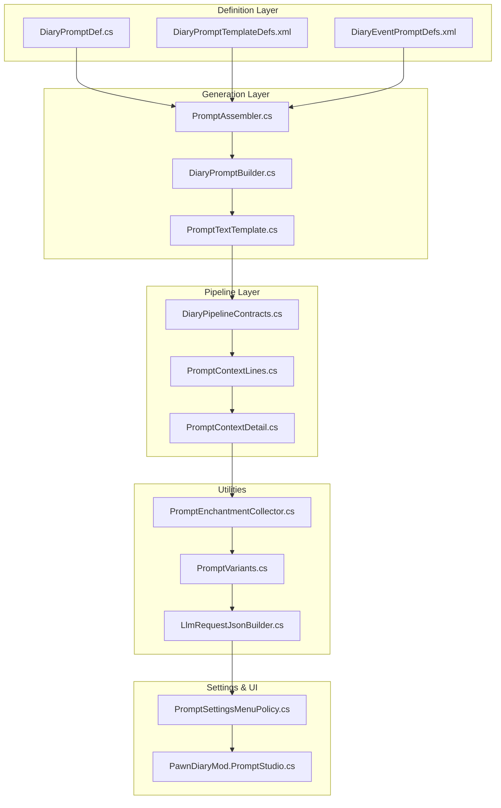
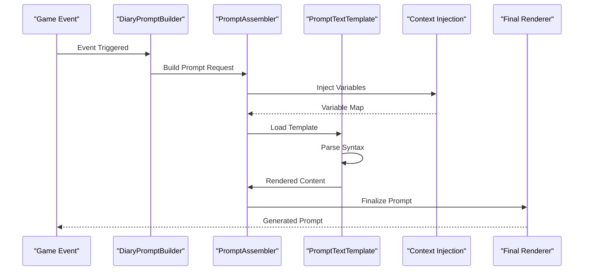
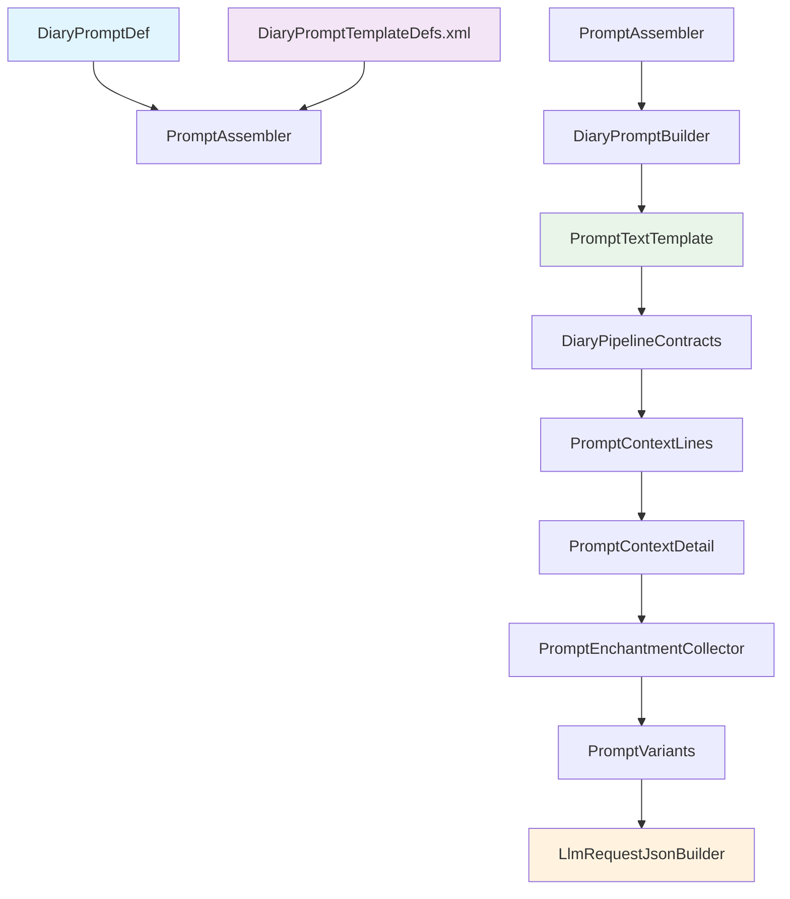

# Prompt & Template Customization

- [DiaryPromptDef.cs](../../../../Source/Defs/DiaryPromptDef.cs)
- [DiaryPromptTemplateDefs.xml](../../../../1.6/Defs/DiaryPromptTemplateDefs.xml)
- [PromptAssembler.cs](../../../../Source/Generation/PromptAssembler.cs)
- [DiaryPromptBuilder.cs](../../../../Source/Generation/DiaryPromptBuilder.cs)
- [PromptTextTemplate.cs](../../../../Source/Util/PromptTextTemplate.cs)
- [DiaryEventPromptDefs.xml](../../../../1.6/Defs/DiaryEventPromptDefs.xml)
- [PromptEnchantmentCollector.cs](../../../../Source/Generation/PromptEnchantmentCollector.cs)
- [PromptVariants.cs](../../../../Source/Generation/PromptVariants.cs)
- [DiaryPipelineContracts.cs](../../../../Source/Pipeline/DiaryPipelineContracts.cs)
- [PromptContextLines.cs](../../../../Source/Pipeline/PromptContextLines.cs)
- [PromptContextDetail.cs](../../../../Source/Pipeline/PromptContextDetail.cs)
- [LlmRequestJsonBuilder.cs](../../../../Source/Pipeline/LlmRequestJsonBuilder.cs)
- [PromptSettingsMenuPolicy.cs](../../../../Source/Settings/PromptSettingsMenuPolicy.cs)
- [PawnDiaryMod.PromptStudio.cs](../../../../Source/Settings/PawnDiaryMod.PromptStudio.cs)
## Table of Contents
1. [Introduction](#introduction)
2. [Project Structure](#project-structure)
3. [Core Components](#core-components)
4. [Architecture Overview](#architecture-overview)
5. [Detailed Component Analysis](#detailed-component-analysis)
6. [Dependency Analysis](#dependency-analysis)
7. [Performance Considerations](#performance-considerations)
8. [Troubleshooting Guide](#troubleshooting-guide)
9. [Conclusion](#conclusion)
10. [Appendices](#appendices)

## Introduction

Pawn Diary is a sophisticated mod for RimWorld that provides advanced AI-driven narrative generation through customizable prompts and templates. The system allows modders and players to create dynamic, context-aware diary entries by defining prompt templates, managing variable substitution, and implementing complex conditional logic. This documentation explains the complete prompt building pipeline, template syntax, and customization mechanisms available in Pawn Diary.

The prompt system is designed around several key principles:
- **Template-based architecture**: Prompts are defined as reusable templates with variable placeholders
- **Context injection**: Rich game state information is automatically injected into prompts
- **Conditional rendering**: Templates support branching logic based on game conditions
- **Version compatibility**: Templates can be versioned and migrated across updates
- **Extensible pipeline**: The system supports custom processing stages and enchantments

## Project Structure

The Pawn Diary prompt system is organized into several key directories and components:

**Diagram sources**
- [DiaryPromptDef.cs:1-50](../../../../Source/Defs/DiaryPromptDef.cs#L1-L50)
- [DiaryPromptTemplateDefs.xml:1-100](../../../../1.6/Defs/DiaryPromptTemplateDefs.xml#L1-L100)
- [PromptAssembler.cs:1-100](../../../../Source/Generation/PromptAssembler.cs#L1-L100)

**Section sources**
- [DiaryPromptDef.cs:1-200](../../../../Source/Defs/DiaryPromptDef.cs#L1-L200)
- [DiaryPromptTemplateDefs.xml:1-500](../../../../1.6/Defs/DiaryPromptTemplateDefs.xml#L1-L500)

## Core Components

### Prompt Definition System

The core prompt definition system consists of several interconnected components that work together to build and render prompts:

#### DiaryPromptDef Class
The `DiaryPromptDef` class serves as the primary data structure for defining prompts. It contains metadata about prompt types, associated events, and rendering configurations.

#### Prompt Template Definitions
XML-based template definitions allow for declarative prompt configuration. These templates define the structure and content of generated prompts using a specialized syntax.

#### Prompt Assembler
The `PromptAssembler` orchestrates the entire prompt building process, coordinating between different components and managing the lifecycle of prompt construction.

**Section sources**
- [DiaryPromptDef.cs:1-150](../../../../Source/Defs/DiaryPromptDef.cs#L1-L150)
- [DiaryPromptTemplateDefs.xml:1-200](../../../../1.6/Defs/DiaryPromptTemplateDefs.xml#L1-L200)
- [PromptAssembler.cs:1-100](../../../../Source/Generation/PromptAssembler.cs#L1-L100)

## Architecture Overview

The prompt building pipeline follows a multi-stage architecture that transforms raw game events into polished, context-aware prompts:

**Diagram sources**
- [DiaryPromptBuilder.cs:1-100](../../../../Source/Generation/DiaryPromptBuilder.cs#L1-L100)
- [PromptAssembler.cs:1-150](../../../../Source/Generation/PromptAssembler.cs#L1-L150)
- [PromptTextTemplate.cs:1-100](../../../../Source/Util/PromptTextTemplate.cs#L1-L100)

## Detailed Component Analysis

### Prompt Building Pipeline

The prompt building pipeline consists of several distinct stages, each responsible for specific aspects of prompt generation:

#### Stage 1: Event Detection and Selection
The system monitors game events and determines which prompts should be triggered based on event types, pawn states, and contextual conditions.

#### Stage 2: Context Resolution
Game state information is collected and transformed into a structured context object containing variables, relationships, and computed values.

#### Stage 3: Template Loading and Parsing
Templates are loaded from XML definitions and parsed into executable structures that can be rendered with the current context.

#### Stage 4: Variable Substitution
Placeholders in templates are replaced with actual values from the context, supporting nested objects and conditional expressions.

#### Stage 5: Conditional Rendering
Templates support if/else logic, loops, and other control structures that determine which parts of the template are rendered.

#### Stage 6: Post-processing and Formatting
Final adjustments are made to the generated text, including formatting, localization, and enrichment with additional metadata.

**Section sources**
- [DiaryPromptBuilder.cs:1-200](../../../../Source/Generation/DiaryPromptBuilder.cs#L1-L200)
- [PromptAssembler.cs:1-200](../../../../Source/Generation/PromptAssembler.cs#L1-L200)

### Template Syntax and Variable Substitution

The template system uses a flexible syntax that supports various types of variables and expressions:

#### Basic Variable Syntax
Variables are referenced using placeholder syntax within templates. The system supports simple scalar values, nested object properties, and collection iteration.

#### Conditional Logic
Templates support conditional rendering using if/else statements, allowing for dynamic content based on game state or user preferences.

#### Loop Constructs
Collection iteration enables templates to generate repetitive content based on arrays or lists of related entities.

#### Function Calls
Built-in functions provide access to utility operations such as date formatting, string manipulation, and mathematical calculations.

**Section sources**
- [PromptTextTemplate.cs:1-150](../../../../Source/Util/PromptTextTemplate.cs#L1-L150)
- [PromptVariants.cs:1-100](../../../../Source/Generation/PromptVariants.cs#L1-L100)

### Context Injection Mechanisms

The context injection system provides rich game state information to templates through several mechanisms:

#### Automatic Context Providers
Built-in providers automatically inject common game state information such as pawn details, location data, and recent events.

#### Custom Context Providers
Modders can implement custom context providers to expose their own game state to the template system.

#### Context Filtering and Transformation
Context data can be filtered, transformed, and enriched before being made available to templates.

**Section sources**
- [PromptContextLines.cs:1-100](../../../../Source/Pipeline/PromptContextLines.cs#L1-L100)
- [PromptContextDetail.cs:1-100](../../../../Source/Pipeline/PromptContextDetail.cs#L1-L100)

### Prompt Enchantments and Variants

The system supports prompt enhancements through enchantments and variants:

#### Enchantment System
Prompts can be enhanced with additional effects such as styling, formatting, or behavioral modifications through the enchantment system.

#### Variant Generation
Multiple variants of the same prompt can be generated based on different contexts or random selection criteria.

**Section sources**
- [PromptEnchantmentCollector.cs:1-100](../../../../Source/Generation/PromptEnchantmentCollector.cs#L1-L100)
- [PromptVariants.cs:1-150](../../../../Source/Generation/PromptVariants.cs#L1-L150)

## Dependency Analysis

The prompt system has well-defined dependencies between components:

**Diagram sources**
- [DiaryPromptDef.cs:1-50](../../../../Source/Defs/DiaryPromptDef.cs#L1-L50)
- [DiaryPromptTemplateDefs.xml:1-50](../../../../1.6/Defs/DiaryPromptTemplateDefs.xml#L1-L50)
- [PromptAssembler.cs:1-50](../../../../Source/Generation/PromptAssembler.cs#L1-L50)

**Section sources**
- [DiaryPipelineContracts.cs:1-100](../../../../Source/Pipeline/DiaryPipelineContracts.cs#L1-L100)
- [LlmRequestJsonBuilder.cs:1-100](../../../../Source/Pipeline/LlmRequestJsonBuilder.cs#L1-L100)

## Performance Considerations

The prompt system implements several performance optimizations:

### Caching Strategies
- Template compilation caching to avoid repeated parsing
- Context resolution caching for frequently accessed data
- Prompt variant pre-generation for common scenarios

### Memory Management
- Lazy loading of large template files
- Efficient context object pooling
- Garbage collection optimization for high-frequency operations

### Processing Optimization
- Parallel template rendering where possible
- Incremental context updates instead of full rebuilds
- Batch processing for multiple prompt generation

## Troubleshooting Guide

### Common Issues and Solutions

#### Template Parsing Errors
When templates fail to parse, check for:
- Invalid placeholder syntax
- Missing required variables
- Incorrect conditional logic structure

#### Context Injection Failures
If variables are not appearing in templates:
- Verify context provider registration
- Check variable name spelling and case sensitivity
- Ensure context data is available at render time

#### Performance Problems
For slow prompt generation:
- Monitor cache hit rates
- Profile context resolution bottlenecks
- Review template complexity and nesting depth

### Debugging Tools

The system includes comprehensive debugging capabilities:

#### Prompt Studio
A dedicated interface for testing and developing prompts with live preview and error reporting.

#### Logging and Tracing
Detailed logs capture the entire prompt building process for analysis and troubleshooting.

#### Performance Profiling
Built-in profiling tools help identify bottlenecks in prompt generation.

**Section sources**
- [PromptSettingsMenuPolicy.cs:1-100](../../../../Source/Settings/PromptSettingsMenuPolicy.cs#L1-L100)
- [PawnDiaryMod.PromptStudio.cs:1-100](../../../../Source/Settings/PawnDiaryMod.PromptStudio.cs#L1-L100)

## Conclusion

Pawn Diary's prompt and template system provides a powerful and flexible framework for creating dynamic, context-aware narrative content. The modular architecture supports extensive customization while maintaining performance and reliability. By understanding the prompt building pipeline, template syntax, and context injection mechanisms, developers can create sophisticated prompt systems that enhance the storytelling experience in RimWorld.

The system's emphasis on versioning, compatibility, and extensibility ensures that custom prompts remain functional across updates while supporting advanced use cases through its plugin architecture. With the debugging tools and performance optimizations available, developers can efficiently create and maintain high-quality prompt content.

## Appendices

### Quick Start Guide

1. **Create a new prompt template** using the XML definition format
2. **Define variables** using the placeholder syntax
3. **Add conditional logic** for dynamic content
4. **Test with the Prompt Studio** interface
5. **Deploy and monitor** performance metrics

### Best Practices

- Keep templates modular and reusable
- Use descriptive variable names
- Implement proper error handling in templates
- Cache frequently used context data
- Test templates across different game states

### Migration Guide

When updating Pawn Diary versions:
- Review template compatibility notes
- Update deprecated syntax elements
- Test prompts in development environment
- Monitor performance after updates
