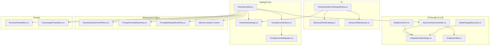
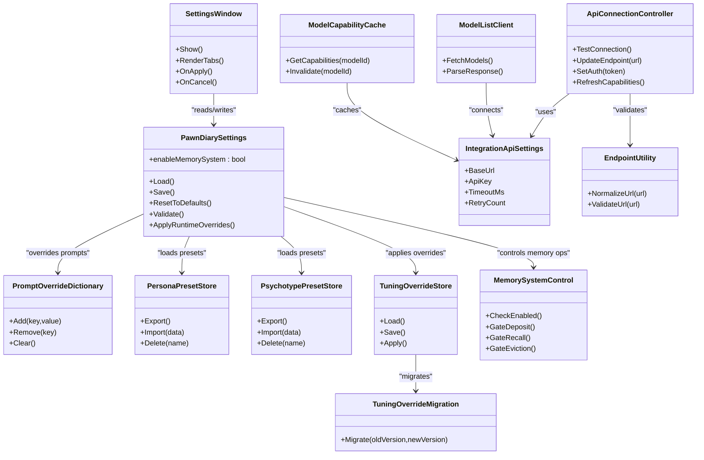
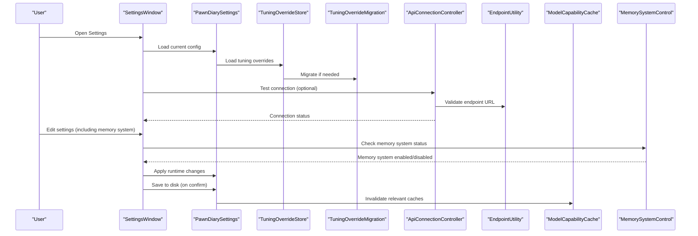
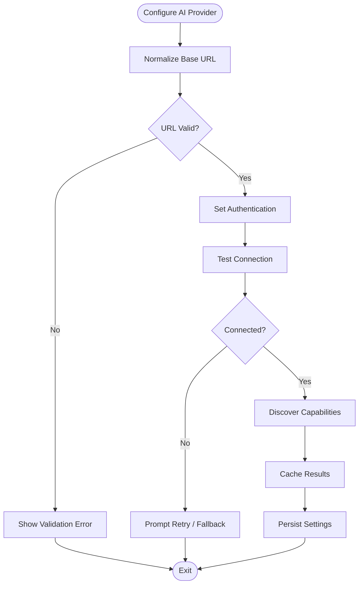
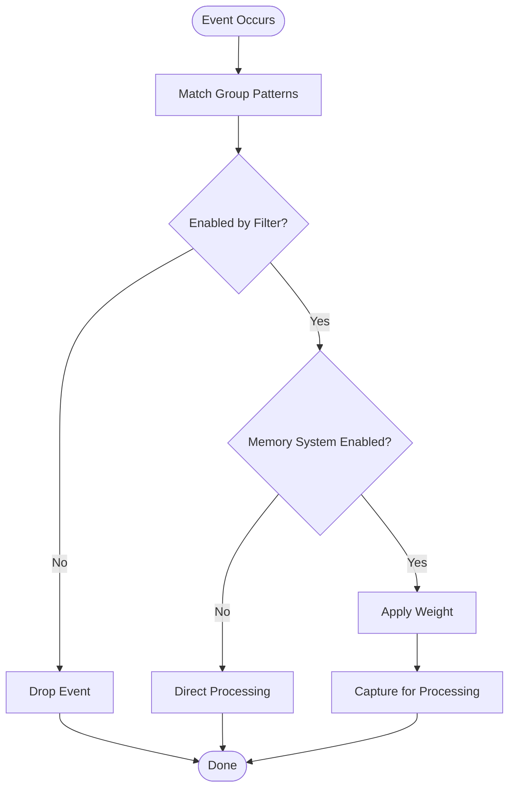
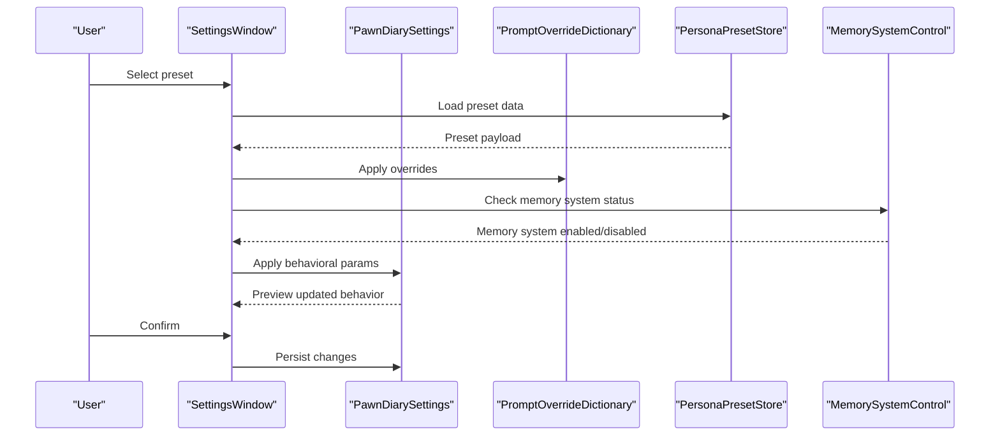
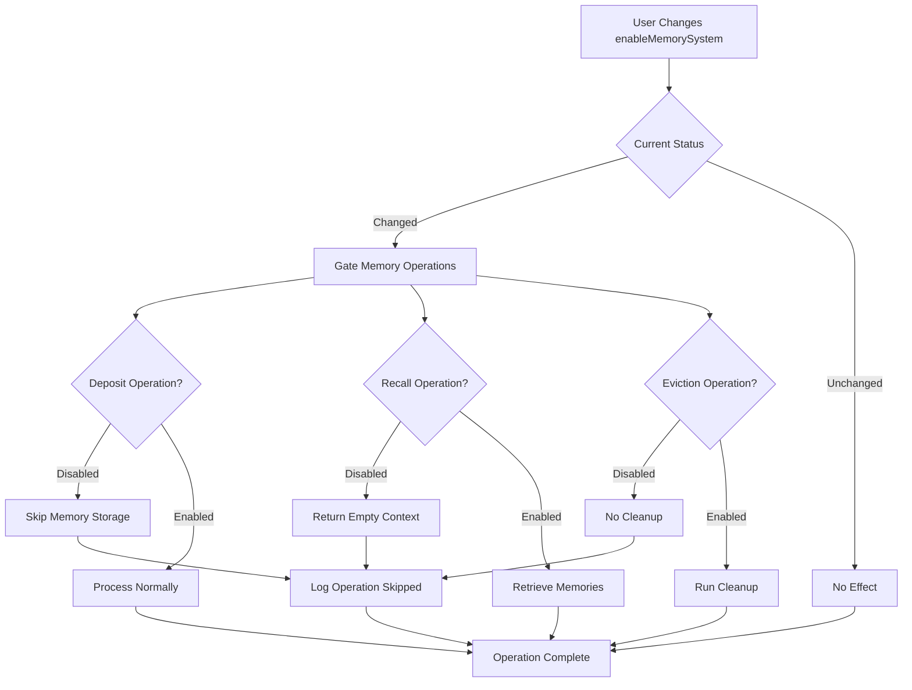
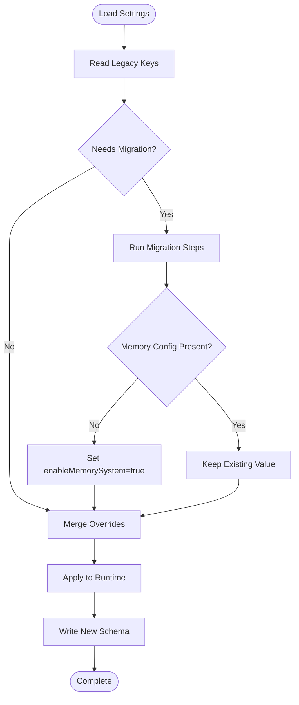
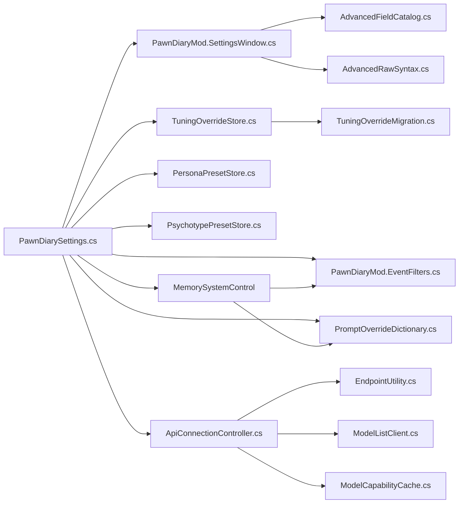

# Settings Management System

<cite>
**Referenced Files in This Document**
- [PawnDiaryMod.cs](../../../../Source/Settings/PawnDiaryMod.cs)
- [PawnDiarySettings.cs](../../../../Source/Settings/PawnDiarySettings.cs)
- [PawnDiaryMod.SettingsWindow.cs](../../../../Source/Settings/PawnDiaryMod.SettingsWindow.cs)
- [PawnDiaryMod.EventFilters.cs](../../../../Source/Settings/PawnDiaryMod.EventFilters.cs)
- [PawnDiaryMod.ApiLanes.cs](../../../../Source/Settings/PawnDiaryMod.ApiLanes.cs)
- [TuningOverrideStore.cs](../../../../Source/Settings/TuningOverrideStore.cs)
- [TuningOverrideMigration.cs](../../../../Source/Settings/TuningOverrideMigration.cs)
- [ApiConnectionController.cs](../../../../Source/Settings/ApiConnectionController.cs)
- [IntegrationApiSettings.cs](../../../../Source/Settings/IntegrationApiSettings.cs)
- [ModelListClient.cs](../../../../Source/Settings/ModelListClient.cs)
- [PromptOverrideDictionary.cs](../../../../Source/Settings/PromptOverrideDictionary.cs)
- [PersonaPresetStore.cs](../../../../Source/Settings/PersonaPresetStore.cs)
- [PsychotypePresetStore.cs](../../../../Source/Settings/PsychotypePresetStore.cs)
- [AdvancedFieldCatalog.cs](../../../../Source/Settings/AdvancedFieldCatalog.cs)
- [AdvancedRawSyntax.cs](../../../../Source/Settings/AdvancedRawSyntax.cs)
- [EndpointUtility.cs](../../../../Source/Settings/EndpointUtility.cs)
- [ModelCapabilityCache.cs](../../../../Source/Settings/ModelCapabilityCache.cs)
- [PromptSettingsMenuPolicy.cs](../../../../Source/Settings/PromptSettingsMenuPolicy.cs)
</cite>

## Update Summary
**Changes Made**
- Added new Memory System Configuration section documenting the enableMemorySystem setting
- Updated Core Components section to include memory system control
- Enhanced Behavioral Parameters section with memory system gating information
- Added troubleshooting guidance for memory system configuration issues
- Updated architecture diagrams to reflect memory system control flow

## Table of Contents
1. [Introduction](#introduction)
2. [Project Structure](#project-structure)
3. [Core Components](#core-components)
4. [Architecture Overview](#architecture-overview)
5. [Detailed Component Analysis](#detailed-component-analysis)
6. [Dependency Analysis](#dependency-analysis)
7. [Performance Considerations](#performance-considerations)
8. [Troubleshooting Guide](#troubleshooting-guide)
9. [Conclusion](#conclusion)
10. [Appendices](#appendices)

## Introduction
This document explains the Pawn Diary settings management system, focusing on architecture, configuration persistence, and runtime modification capabilities. It covers all major settings categories: AI provider configuration, performance tuning options, event filtering rules, behavioral parameters, and memory system controls. It also includes examples of common configuration scenarios, validation rules, default values, migration between versions, backup procedures, and troubleshooting guidance.

## Project Structure
The settings subsystem is implemented under Source/Settings and integrates with UI, API lanes, and external integrations. Key responsibilities include:
- Central settings model and persistence
- UI for editing settings across tabs
- Event filter definitions and runtime toggles
- API lane configuration and connection control
- Tuning overrides and migrations
- Advanced/raw syntax support for power users
- Memory system control and operational gating

**Diagram sources**
- [PawnDiarySettings.cs](../../../../Source/Settings/PawnDiarySettings.cs)
- [PawnDiaryMod.cs](../../../../Source/Settings/PawnDiaryMod.cs)
- [PawnDiaryMod.SettingsWindow.cs](../../../../Source/Settings/PawnDiaryMod.SettingsWindow.cs)
- [PawnDiaryMod.EventFilters.cs](../../../../Source/Settings/PawnDiaryMod.EventFilters.cs)
- [PawnDiaryMod.ApiLanes.cs](../../../../Source/Settings/PawnDiaryMod.ApiLanes.cs)
- [TuningOverrideStore.cs](../../../../Source/Settings/TuningOverrideStore.cs)
- [TuningOverrideMigration.cs](../../../../Source/Settings/TuningOverrideMigration.cs)
- [ApiConnectionController.cs](../../../../Source/Settings/ApiConnectionController.cs)
- [IntegrationApiSettings.cs](../../../../Source/Settings/IntegrationApiSettings.cs)
- [ModelListClient.cs](../../../../Source/Settings/ModelListClient.cs)
- [ModelCapabilityCache.cs](../../../../Source/Settings/ModelCapabilityCache.cs)
- [EndpointUtility.cs](../../../../Source/Settings/EndpointUtility.cs)
- [PromptOverrideDictionary.cs](../../../../Source/Settings/PromptOverrideDictionary.cs)
- [PromptSettingsMenuPolicy.cs](../../../../Source/Settings/PromptSettingsMenuPolicy.cs)
- [PersonaPresetStore.cs](../../../../Source/Settings/PersonaPresetStore.cs)
- [PsychotypePresetStore.cs](../../../../Source/Settings/PsychotypePresetStore.cs)
- [AdvancedFieldCatalog.cs](../../../../Source/Settings/AdvancedFieldCatalog.cs)
- [AdvancedRawSyntax.cs](../../../../Source/Settings/AdvancedRawSyntax.cs)

**Section sources**
- [PawnDiaryMod.cs](../../../../Source/Settings/PawnDiaryMod.cs)
- [PawnDiarySettings.cs](../../../../Source/Settings/PawnDiarySettings.cs)
- [PawnDiaryMod.SettingsWindow.cs](../../../../Source/Settings/PawnDiaryMod.SettingsWindow.cs)
- [PawnDiaryMod.EventFilters.cs](../../../../Source/Settings/PawnDiaryMod.EventFilters.cs)
- [PawnDiaryMod.ApiLanes.cs](../../../../Source/Settings/PawnDiaryMod.ApiLanes.cs)
- [TuningOverrideStore.cs](../../../../Source/Settings/TuningOverrideStore.cs)
- [TuningOverrideMigration.cs](../../../../Source/Settings/TuningOverrideMigration.cs)
- [ApiConnectionController.cs](../../../../Source/Settings/ApiConnectionController.cs)
- [IntegrationApiSettings.cs](../../../../Source/Settings/IntegrationApiSettings.cs)
- [ModelListClient.cs](../../../../Source/Settings/ModelListClient.cs)
- [ModelCapabilityCache.cs](../../../../Source/Settings/ModelCapabilityCache.cs)
- [EndpointUtility.cs](../../../../Source/Settings/EndpointUtility.cs)
- [PromptOverrideDictionary.cs](../../../../Source/Settings/PromptOverrideDictionary.cs)
- [PromptSettingsMenuPolicy.cs](../../../../Source/Settings/PromptSettingsMenuPolicy.cs)
- [PersonaPresetStore.cs](../../../../Source/Settings/PersonaPresetStore.cs)
- [PsychotypePresetStore.cs](../../../../Source/Settings/PsychotypePresetStore.cs)
- [AdvancedFieldCatalog.cs](../../../../Source/Settings/AdvancedFieldCatalog.cs)
- [AdvancedRawSyntax.cs](../../../../Source/Settings/AdvancedRawSyntax.cs)

## Core Components
- Central settings model and persistence: The main settings object encapsulates all user-configurable options and provides load/save semantics. It is the single source of truth for runtime behavior.
- Settings UI: A dedicated window organizes settings into logical sections (tabs), binds to the central model, and validates inputs before applying changes.
- Event filters: Declarative rules that enable/disable or tune event capture and processing at runtime.
- API lanes and connection controller: Configuration for external AI providers, including endpoints, authentication, and capability discovery.
- Tuning overrides and migration: Mechanisms to override defaults per-run or persistently, with versioned migration logic to keep configurations compatible.
- Advanced/raw syntax: Optional raw JSON-like editing for expert users, backed by a catalog of available fields and validation helpers.
- Preset stores: Stores for persona and psychotype presets used by behavioral parameters.
- **Memory system control**: New configuration option that gates core memory operations including deposit, recall, and eviction processes.

Key responsibilities and interactions are illustrated below.

**Diagram sources**
- [PawnDiarySettings.cs](../../../../Source/Settings/PawnDiarySettings.cs)
- [PawnDiaryMod.SettingsWindow.cs](../../../../Source/Settings/PawnDiaryMod.SettingsWindow.cs)
- [ApiConnectionController.cs](../../../../Source/Settings/ApiConnectionController.cs)
- [IntegrationApiSettings.cs](../../../../Source/Settings/IntegrationApiSettings.cs)
- [ModelListClient.cs](../../../../Source/Settings/ModelListClient.cs)
- [ModelCapabilityCache.cs](../../../../Source/Settings/ModelCapabilityCache.cs)
- [EndpointUtility.cs](../../../../Source/Settings/EndpointUtility.cs)
- [PromptOverrideDictionary.cs](../../../../Source/Settings/PromptOverrideDictionary.cs)
- [PersonaPresetStore.cs](../../../../Source/Settings/PersonaPresetStore.cs)
- [PsychotypePresetStore.cs](../../../../Source/Settings/PsychotypePresetStore.cs)
- [TuningOverrideStore.cs](../../../../Source/Settings/TuningOverrideStore.cs)
- [TuningOverrideMigration.cs](../../../../Source/Settings/TuningOverrideMigration.cs)

**Section sources**
- [PawnDiarySettings.cs](../../../../Source/Settings/PawnDiarySettings.cs)
- [PawnDiaryMod.SettingsWindow.cs](../../../../Source/Settings/PawnDiaryMod.SettingsWindow.cs)
- [ApiConnectionController.cs](../../../../Source/Settings/ApiConnectionController.cs)
- [IntegrationApiSettings.cs](../../../../Source/Settings/IntegrationApiSettings.cs)
- [ModelListClient.cs](../../../../Source/Settings/ModelListClient.cs)
- [ModelCapabilityCache.cs](../../../../Source/Settings/ModelCapabilityCache.cs)
- [EndpointUtility.cs](../../../../Source/Settings/EndpointUtility.cs)
- [PromptOverrideDictionary.cs](../../../../Source/Settings/PromptOverrideDictionary.cs)
- [PersonaPresetStore.cs](../../../../Source/Settings/PersonaPresetStore.cs)
- [PsychotypePresetStore.cs](../../../../Source/Settings/PsychotypePresetStore.cs)
- [TuningOverrideStore.cs](../../../../Source/Settings/TuningOverrideStore.cs)
- [TuningOverrideMigration.cs](../../../../Source/Settings/TuningOverrideMigration.cs)

## Architecture Overview
The settings architecture follows a layered approach:
- Persistence layer: Central settings object handles loading/saving and applies tuning overrides.
- Validation layer: Ensures integrity of URLs, timeouts, and other constraints before applying.
- Runtime layer: Applies changes immediately where safe (e.g., filters, prompt overrides).
- UI layer: Presents grouped controls and live previews; defers persistent save until confirmed.
- External integration layer: Manages connections to AI providers, capability discovery, and caching.
- **Memory system control layer**: Provides operational gating for memory-related functions based on configuration.

**Diagram sources**
- [PawnDiaryMod.SettingsWindow.cs](../../../../Source/Settings/PawnDiaryMod.SettingsWindow.cs)
- [PawnDiarySettings.cs](../../../../Source/Settings/PawnDiarySettings.cs)
- [TuningOverrideStore.cs](../../../../Source/Settings/TuningOverrideStore.cs)
- [TuningOverrideMigration.cs](../../../../Source/Settings/TuningOverrideMigration.cs)
- [ApiConnectionController.cs](../../../../Source/Settings/ApiConnectionController.cs)
- [EndpointUtility.cs](../../../../Source/Settings/EndpointUtility.cs)
- [ModelCapabilityCache.cs](../../../../Source/Settings/ModelCapabilityCache.cs)

## Detailed Component Analysis

### Central Settings Model and Persistence
- Responsibilities:
  - Provide a unified view of all settings.
  - Persist settings to disk and reload on game start.
  - Apply tuning overrides and reset to defaults when requested.
  - Validate critical fields and report errors through the UI.
  - **Manage memory system configuration and operational gating**.
- Runtime modification:
  - Immediate application for non-persistent toggles (e.g., debug flags).
  - Deferred persistence until user confirms changes.
  - **Immediate effect on memory system operations when changed**.
- Defaults:
  - Safe defaults ensure stable operation out-of-the-box.
  - **Memory system enabled by default for backward compatibility**.

Common operations:
- Load: Reads persisted data and merges tuning overrides.
- Save: Serializes current state to storage.
- Reset: Restores built-in defaults and clears overrides.
- Validate: Checks ranges, formats, and cross-field dependencies.

**Updated** Added memory system configuration management with enableMemorySystem boolean flag that controls access to core memory operations.

**Section sources**
- [PawnDiarySettings.cs](../../../../Source/Settings/PawnDiarySettings.cs)
- [TuningOverrideStore.cs](../../../../Source/Settings/TuningOverrideStore.cs)

### Settings UI and Tabs
- Organizes settings into logical sections:
  - General, AI Providers, Performance, Event Filters, Behavioral, Advanced, **Memory System**.
- Provides:
  - Live preview for some options.
  - Inline validation feedback.
  - Import/export for presets and advanced raw syntax.
  - **Memory system toggle with clear indication of impact on functionality**.
- Workflow:
  - Changes are staged until Apply is pressed.
  - On Apply, runtime updates occur first, then persistence.
  - **Memory system changes take immediate effect on related operations**.

**Updated** Added dedicated memory system configuration section with clear user interface for enabling/disabling memory operations.

**Section sources**
- [PawnDiaryMod.SettingsWindow.cs](../../../../Source/Settings/PawnDiaryMod.SettingsWindow.cs)
- [AdvancedFieldCatalog.cs](../../../../Source/Settings/AdvancedFieldCatalog.cs)
- [AdvancedRawSyntax.cs](../../../../Source/Settings/AdvancedRawSyntax.cs)

### AI Provider Configuration
- Endpoints and authentication:
  - Base URL normalization and validation.
  - API key/token handling and optional headers.
- Capability discovery:
  - Fetches supported models and features.
  - Caps results in memory to reduce network overhead.
- Connection testing:
  - Validates reachability and credentials before saving.

**Diagram sources**
- [ApiConnectionController.cs](../../../../Source/Settings/ApiConnectionController.cs)
- [IntegrationApiSettings.cs](../../../../Source/Settings/IntegrationApiSettings.cs)
- [EndpointUtility.cs](../../../../Source/Settings/EndpointUtility.cs)
- [ModelListClient.cs](../../../../Source/Settings/ModelListClient.cs)
- [ModelCapabilityCache.cs](../../../../Source/Settings/ModelCapabilityCache.cs)

**Section sources**
- [ApiConnectionController.cs](../../../../Source/Settings/ApiConnectionController.cs)
- [IntegrationApiSettings.cs](../../../../Source/Settings/IntegrationApiSettings.cs)
- [EndpointUtility.cs](../../../../Source/Settings/EndpointUtility.cs)
- [ModelListClient.cs](../../../../Source/Settings/ModelListClient.cs)
- [ModelCapabilityCache.cs](../../../../Source/Settings/ModelCapabilityCache.cs)

### Performance Tuning Options
- Typical knobs:
  - Request timeouts and retry counts.
  - Concurrency limits for parallel generation.
  - Memory retention thresholds and pruning policies.
  - Prompt size caps and truncation strategies.
  - **Memory system operational limits when enabled**.
- Effects:
  - Higher concurrency may improve throughput but increase resource usage.
  - Larger timeouts help with slow providers but can stall UI.
  - Aggressive pruning reduces memory footprint at the cost of context richness.
  - **Disabling memory system eliminates memory-related performance overhead**.

Validation and safety:
- Enforce minimum/maximum bounds.
- Warn when values risk instability.
- **Provide warnings when disabling memory system affects expected functionality**.

**Updated** Added consideration for memory system performance implications and operational warnings.

**Section sources**
- [PawnDiarySettings.cs](../../../../Source/Settings/PawnDiarySettings.cs)
- [PawnDiaryMod.SettingsWindow.cs](../../../../Source/Settings/PawnDiaryMod.SettingsWindow.cs)

### Event Filtering Rules
- Purpose:
  - Control which events are captured and how they influence diary entries.
- Categories:
  - Enable/disable event types.
  - Weight adjustments for salience.
  - Group-based inclusion/exclusion patterns.
- Runtime behavior:
  - Filters apply immediately without restart.
  - Changes are persisted on confirmation.
  - **Memory system disabled events bypass memory operations entirely**.

**Diagram sources**
- [PawnDiaryMod.EventFilters.cs](../../../../Source/Settings/PawnDiaryMod.EventFilters.cs)

**Updated** Added memory system check in event processing flow to show how disabled memory system affects event handling.

**Section sources**
- [PawnDiaryMod.EventFilters.cs](../../../../Source/Settings/PawnDiaryMod.EventFilters.cs)

### Behavioral Parameters and Prompt Overrides
- Behavioral parameters:
  - Persona and psychotype presets influence tone, style, and focus.
- Prompt overrides:
  - Fine-grained replacement of specific prompt templates or keys.
- Preset management:
  - Export/import profiles for sharing and rollback.
- **Memory system integration**:
  - When disabled, behavioral parameters still apply but memory-dependent features are unavailable.
  - Backward compatibility ensures existing configurations work regardless of memory system status.

**Diagram sources**
- [PawnDiaryMod.SettingsWindow.cs](../../../../Source/Settings/PawnDiaryMod.SettingsWindow.cs)
- [PawnDiarySettings.cs](../../../../Source/Settings/PawnDiarySettings.cs)
- [PromptOverrideDictionary.cs](../../../../Source/Settings/PromptOverrideDictionary.cs)
- [PersonaPresetStore.cs](../../../../Source/Settings/PersonaPresetStore.cs)
- [PsychotypePresetStore.cs](../../../../Source/Settings/PsychotypePresetStore.cs)

**Updated** Added memory system status check in behavioral parameter workflow to show integration points.

**Section sources**
- [PromptOverrideDictionary.cs](../../../../Source/Settings/PromptOverrideDictionary.cs)
- [PersonaPresetStore.cs](../../../../Source/Settings/PersonaPresetStore.cs)
- [PsychotypePresetStore.cs](../../../../Source/Settings/PsychotypePresetStore.cs)
- [PawnDiaryMod.SettingsWindow.cs](../../../../Source/Settings/PawnDiaryMod.SettingsWindow.cs)
- [PawnDiarySettings.cs](../../../../Source/Settings/PawnDiarySettings.cs)

### Memory System Configuration
- **New Feature**: Comprehensive control over memory system operations through the `enableMemorySystem` configuration option.
- **Configuration Details**:
  - Default value: `true` (memory system enabled by default)
  - Type: Boolean flag
  - Scope: Global setting affecting all memory operations
- **Operational Impact**:
  - **Deposit Operations**: When disabled, prevents new memories from being stored
  - **Recall Operations**: When disabled, prevents retrieval of existing memories
  - **Eviction Operations**: When disabled, prevents automatic memory cleanup and pruning
- **Backward Compatibility**:
  - Existing configurations automatically migrate to use default `true` value
  - No breaking changes for existing users
  - Graceful degradation when memory system is disabled
- **Use Cases**:
  - Performance optimization for resource-constrained environments
  - Debugging scenarios where memory operations need to be isolated
  - Testing environments requiring deterministic behavior
  - Users who prefer simpler gameplay without memory mechanics

**Diagram sources**
- [PawnDiarySettings.cs](../../../../Source/Settings/PawnDiarySettings.cs)

**Section sources**
- [PawnDiarySettings.cs](../../../../Source/Settings/PawnDiarySettings.cs)

### Advanced Raw Syntax and Field Catalog
- Advanced field catalog:
  - Enumerates available fields for raw editing.
  - Provides descriptions and constraints.
  - **Includes memory system configuration fields**.
- Raw syntax editor:
  - Allows direct JSON-like edits.
  - Validates against the catalog and rejects invalid structures.
  - **Validates memory system boolean values**.

Use cases:
- Bulk edits via copy/paste.
- Sharing exact configurations.
- **Advanced memory system tuning for expert users**.

**Updated** Added memory system configuration fields to advanced editing capabilities.

**Section sources**
- [AdvancedFieldCatalog.cs](../../../../Source/Settings/AdvancedFieldCatalog.cs)
- [AdvancedRawSyntax.cs](../../../../Source/Settings/AdvancedRawSyntax.cs)

### Tuning Overrides and Migration
- Tuning overrides:
  - Store per-version or per-run overrides that merge with base settings.
  - **Support memory system configuration overrides**.
- Migration:
  - Automatically transforms legacy keys to new schema.
  - Logs warnings for deprecated fields.
  - **Ensures memory system defaults are applied to existing configurations**.

**Diagram sources**
- [TuningOverrideStore.cs](../../../../Source/Settings/TuningOverrideStore.cs)
- [TuningOverrideMigration.cs](../../../../Source/Settings/TuningOverrideMigration.cs)

**Updated** Added memory system configuration handling in migration process to ensure backward compatibility.

**Section sources**
- [TuningOverrideStore.cs](../../../../Source/Settings/TuningOverrideStore.cs)
- [TuningOverrideMigration.cs](../../../../Source/Settings/TuningOverrideMigration.cs)

## Dependency Analysis
The following diagram shows primary dependencies among settings components, including the new memory system control.

**Diagram sources**
- [PawnDiarySettings.cs](../../../../Source/Settings/PawnDiarySettings.cs)
- [PawnDiaryMod.SettingsWindow.cs](../../../../Source/Settings/PawnDiaryMod.SettingsWindow.cs)
- [TuningOverrideStore.cs](../../../../Source/Settings/TuningOverrideStore.cs)
- [TuningOverrideMigration.cs](../../../../Source/Settings/TuningOverrideMigration.cs)
- [PawnDiaryMod.EventFilters.cs](../../../../Source/Settings/PawnDiaryMod.EventFilters.cs)
- [PromptOverrideDictionary.cs](../../../../Source/Settings/PromptOverrideDictionary.cs)
- [PersonaPresetStore.cs](../../../../Source/Settings/PersonaPresetStore.cs)
- [PsychotypePresetStore.cs](../../../../Source/Settings/PsychotypePresetStore.cs)
- [ApiConnectionController.cs](../../../../Source/Settings/ApiConnectionController.cs)
- [EndpointUtility.cs](../../../../Source/Settings/EndpointUtility.cs)
- [ModelListClient.cs](../../../../Source/Settings/ModelListClient.cs)
- [ModelCapabilityCache.cs](../../../../Source/Settings/ModelCapabilityCache.cs)
- [AdvancedFieldCatalog.cs](../../../../Source/Settings/AdvancedFieldCatalog.cs)
- [AdvancedRawSyntax.cs](../../../../Source/Settings/AdvancedRawSyntax.cs)

**Section sources**
- [PawnDiarySettings.cs](../../../../Source/Settings/PawnDiarySettings.cs)
- [PawnDiaryMod.SettingsWindow.cs](../../../../Source/Settings/PawnDiaryMod.SettingsWindow.cs)
- [TuningOverrideStore.cs](../../../../Source/Settings/TuningOverrideStore.cs)
- [TuningOverrideMigration.cs](../../../../Source/Settings/TuningOverrideMigration.cs)
- [PawnDiaryMod.EventFilters.cs](../../../../Source/Settings/PawnDiaryMod.EventFilters.cs)
- [PromptOverrideDictionary.cs](../../../../Source/Settings/PromptOverrideDictionary.cs)
- [PersonaPresetStore.cs](../../../../Source/Settings/PsychotypePresetStore.cs)
- [ApiConnectionController.cs](../../../../Source/Settings/ApiConnectionController.cs)
- [EndpointUtility.cs](../../../../Source/Settings/EndpointUtility.cs)
- [ModelListClient.cs](../../../../Source/Settings/ModelListClient.cs)
- [ModelCapabilityCache.cs](../../../../Source/Settings/ModelCapabilityCache.cs)
- [AdvancedFieldCatalog.cs](../../../../Source/Settings/AdvancedFieldCatalog.cs)
- [AdvancedRawSyntax.cs](../../../../Source/Settings/AdvancedRawSyntax.cs)

## Performance Considerations
- Prefer conservative defaults for timeouts and retries to avoid blocking the game loop.
- Use capability caching to minimize repeated network calls.
- Limit concurrent requests based on host resources and provider rate limits.
- Prune large contexts aggressively when memory pressure is detected.
- Avoid frequent disk writes; batch saves when possible.
- **Memory system considerations**:
  - Disabling memory system eliminates memory-related overhead but reduces narrative depth.
  - Memory operations can be expensive; consider disabling in performance-critical scenarios.
  - When enabled, monitor memory usage patterns to optimize retention policies.

**Updated** Added specific performance considerations for memory system configuration.

## Troubleshooting Guide
Common issues and resolutions:
- Invalid endpoint URL:
  - Ensure protocol and path are correct; use the built-in validator.
- Authentication failures:
  - Verify API key format and permissions; test connection from the UI.
- Stale capabilities:
  - Invalidate cache after changing provider or model selection.
- Conflicting overrides:
  - Check tuning overrides for duplicate keys; clear and reapply.
- Migration warnings:
  - Review logs for deprecated keys; update to new schema using the migration tool.
- Preset import errors:
  - Validate JSON structure against the advanced field catalog.
- **Memory system issues**:
  - **Missing memories**: Check if `enableMemorySystem` is set to `false`; verify memory operations are not being blocked by other filters.
  - **Performance problems**: Consider disabling memory system temporarily to isolate performance issues.
  - **Unexpected behavior**: Ensure memory system is enabled for full functionality; review event filters that might prevent memory capture.
  - **Configuration conflicts**: Check for conflicting settings that might interfere with memory operations.

Operational tips:
- Use the "Test Connection" feature before saving.
- Export presets regularly for backup and portability.
- Keep a baseline configuration to revert quickly.
- **Monitor memory system status in logs to diagnose operational issues**.

**Updated** Added comprehensive memory system troubleshooting guidance and diagnostic tips.

**Section sources**
- [ApiConnectionController.cs](../../../../Source/Settings/ApiConnectionController.cs)
- [EndpointUtility.cs](../../../../Source/Settings/EndpointUtility.cs)
- [ModelCapabilityCache.cs](../../../../Source/Settings/ModelCapabilityCache.cs)
- [TuningOverrideStore.cs](../../../../Source/Settings/TuningOverrideStore.cs)
- [TuningOverrideMigration.cs](../../../../Source/Settings/TuningOverrideMigration.cs)
- [AdvancedFieldCatalog.cs](../../../../Source/Settings/AdvancedFieldCatalog.cs)
- [AdvancedRawSyntax.cs](../../../../Source/Settings/AdvancedRawSyntax.cs)

## Conclusion
The Pawn Diary settings system provides a robust, layered architecture for managing AI provider configuration, performance tuning, event filtering, behavioral parameters, and memory system controls. With strong validation, migration support, and a flexible UI, it balances ease of use with advanced customization. The new memory system configuration option allows users to fine-tune memory operations while maintaining backward compatibility. Following the recommended practices and troubleshooting steps ensures reliable operation across versions and environments.

**Updated** Enhanced conclusion to reflect the addition of memory system configuration capabilities.

## Appendices

### Common Configuration Scenarios
- Quickstart with a public API:
  - Set base URL, add API key, test connection, select a model, and save.
- High-throughput setup:
  - Increase concurrency and timeouts moderately; monitor memory usage.
- Strict event capture:
  - Disable low-signal events, adjust weights for high-value events.
- Persona-driven writing:
  - Choose a persona preset and optionally refine with prompt overrides.
- **Memory system optimization**:
  - **Disable memory system for maximum performance**: Set `enableMemorySystem=false` to eliminate memory overhead.
  - **Enable full functionality**: Keep `enableMemorySystem=true` (default) for complete narrative depth and memory features.
  - **Debug memory issues**: Temporarily disable memory system to isolate performance problems.

**Updated** Added memory system optimization scenarios.

### Backup and Restore Procedures
- Export persona and psychotype presets for sharing and recovery.
- Back up the full settings file location managed by the mod.
- Use the advanced raw syntax editor to validate backups before restoring.
- **Memory system configuration backup**:
  - Include `enableMemorySystem` setting in your configuration backups.
  - Note that disabling memory system affects long-term narrative continuity.

**Updated** Added memory system configuration backup considerations.

### Memory System Configuration Reference
- **Setting Name**: `enableMemorySystem`
- **Type**: Boolean
- **Default**: `true`
- **Scope**: Global
- **Effects**:
  - Controls deposit operations (storing new memories)
  - Controls recall operations (retrieving existing memories)
  - Controls eviction operations (automatic memory cleanup)
- **Backward Compatibility**: Automatically set to `true` for existing configurations
- **Use Cases**:
  - Performance optimization in resource-constrained environments
  - Debugging and testing scenarios
  - Simplified gameplay preferences

**New Section** Added comprehensive reference for the new memory system configuration option.
