# UI Personalization Options

## Update Summary
**Changes Made**
- Enhanced Diary Tab Interface section to document CoreUI integration and modern iconography
- Added new Button Icon System section covering the new visual presentation features
- Updated Seasonal Theming section to reflect improved visual styling capabilities
- Added Favorite Star Functionality section for user interaction enhancements
- Updated performance considerations to include CoreUI optimization benefits
- Revised troubleshooting guide with new UI responsiveness issues related to CoreUI integration

## Table of Contents
1. [Introduction](#introduction)
2. [Project Structure](#project-structure)
3. [Core Components](#core-components)
4. [Architecture Overview](#architecture-overview)
5. [Detailed Component Analysis](#detailed-component-analysis)
6. [Dependency Analysis](#dependency-analysis)
7. [Performance Considerations](#performance-considerations)
8. [Troubleshooting Guide](#troubleshooting-guide)
9. [Conclusion](#conclusion)
10. [Appendices](#appendices)

## Introduction
This document explains how to personalize and customize the appearance of Pawn Diary, focusing on:
- The diary tab interface and its controls with CoreUI integration
- Text formatting and rich text decorations
- Name highlighting for pawns and related entities
- Visual styling via UI style definitions and seasonal theming
- Button icon system and modern iconography
- Favorite star functionality for user interactions
- Localization support and multi-language setup
- Custom text overrides and writing style integration
- Accessibility considerations and performance impact
- Theme integration and responsive design principles

The goal is to help users and modders tailor the look, feel, and behavior of the diary without deep engine knowledge, leveraging the enhanced CoreUI integration for a modern user experience.

## Project Structure
UI personalization spans several layers with enhanced CoreUI integration:
- UI layer: Tab rendering, entry cards, controls, dialogs, and CoreUI components
- Pipeline layer: Formatting, decoration, reflow, and postprocessing
- Settings layer: User-facing options and override stores
- Defs and Languages: Style definitions and localized strings
- Asset layer: Button textures, icons, and visual resources

```mermaid
graph TB
subgraph "UI Layer"
A["ITab_Pawn_Diary.cs"]
B["ITab_Pawn_Diary.Controls.cs"]
C["ITab_Pawn_Diary.EntryCards.cs"]
D["ITab_Pawn_Diary.NameHighlights.cs"]
E["ITab_Pawn_Diary.RoleplayText.cs"]
F["ITab_Pawn_Diary.YearPaging.cs"]
G["DiaryTabVisibleEntriesCache.cs"]
H["DiaryTextFormat.cs"]
I["Dialog_PawnWritingStyle.cs"]
J["DiaryQuadrumDivider.cs"]
K["DiaryButtonTextures.cs"]
L["CoreUI Integration"]
end
subgraph "Pipeline Layer"
M["DiaryNameHighlighter.cs"]
N["DiaryRichTextDecorators.cs"]
O["DiaryParagraphReflow.cs"]
P["DiaryListText.cs"]
Q["DiaryEntryTitleFilter.cs"]
R["DiaryResponsePostprocessor.cs"]
S["PlayerWritingStyleText.cs"]
T["ExternalWritingStyleOverrideText.cs"]
U["DiaryTextDecorationContracts.cs"]
V["DiaryTextDecorationText.cs"]
W["DiaryTextDecorationFactCodec.cs"]
X["DiaryTextDecorationMatcher.cs"]
end
subgraph "Settings Layer"
Y["PawnDiaryMod.SettingsWindow.cs"]
Z["PawnDiaryMod.cs"]
AA["PawnDiarySettings.cs"]
AB["PromptOverrideDictionary.cs"]
AC["TuningOverrideStore.cs"]
end
subgraph "Defs & Languages"
AD["DiaryUiStyleDef.cs"]
AE["DiaryTextDecorationDef.cs"]
AF["PawnDiary.xml"]
AG["PawnDiary_Hospitality.xml"]
AH["PawnDiary_VEE.xml"]
end
subgraph "Asset Layer"
AI["Button Icons"]
AJ["Seasonal Themes"]
AK["Favorite Stars"]
AL["Visual Resources"]
end
A --> B
A --> C
A --> D
A --> E
A --> F
A --> G
A --> H
A --> I
A --> J
A --> K
A --> L
C --> M
C --> N
C --> O
C --> P
C --> Q
C --> R
C --> S
C --> T
C --> U
C --> V
C --> W
C --> X
Y --> AA
Y --> AB
Y --> AC
C --> AD
C --> AE
C --> AF
C --> AG
C --> AH
K --> AI
K --> AJ
K --> AK
K --> AL
```

**Diagram sources**
- [ITab_Pawn_Diary.cs](../../../../Source/UI/ITab_Pawn_Diary.cs)
- [ITab_Pawn_Diary.Controls.cs](../../../../Source/UI/ITab_Pawn_Diary.Controls.cs)
- [ITab_Pawn_Diary.EntryCards.cs](../../../../Source/UI/ITab_Pawn_Diary.EntryCards.cs)
- [ITab_Pawn_Diary.NameHighlights.cs](../../../../Source/UI/ITab_Pawn_Diary.NameHighlights.cs)
- [ITab_Pawn_Diary.RoleplayText.cs](../../../../Source/UI/ITab_Pawn_Diary.RoleplayText.cs)
- [ITab_Pawn_Diary.YearPaging.cs](../../../../Source/UI/ITab_Pawn_Diary.YearPaging.cs)
- [DiaryTabVisibleEntriesCache.cs](../../../../Source/UI/DiaryTabVisibleEntriesCache.cs)
- [DiaryTextFormat.cs](../../../../Source/UI/DiaryTextFormat.cs)
- [Dialog_PawnWritingStyle.cs](../../../../Source/UI/Dialog_PawnWritingStyle.cs)
- [DiaryQuadrumDivider.cs](../../../../Source/UI/DiaryQuadrumDivider.cs)
- [DiaryButtonTextures.cs](../../../../Source/UI/DiaryButtonTextures.cs)
- [DiaryNameHighlighter.cs](../../../../Source/Pipeline/DiaryNameHighlighter.cs)
- [DiaryRichTextDecorators.cs](../../../../Source/Pipeline/DiaryRichTextDecorators.cs)
- [DiaryParagraphReflow.cs](../../../../Source/Pipeline/DiaryParagraphReflow.cs)
- [DiaryListText.cs](../../../../Source/Pipeline/DiaryListText.cs)
- [DiaryEntryTitleFilter.cs](../../../../Source/Pipeline/DiaryEntryTitleFilter.cs)
- [DiaryResponsePostprocessor.cs](../../../../Source/Pipeline/DiaryResponsePostprocessor.cs)
- [PlayerWritingStyleText.cs](../../../../Source/Pipeline/PlayerWritingStyleText.cs)
- [ExternalWritingStyleOverrideText.cs](../../../../Source/Pipeline/ExternalWritingStyleOverrideText.cs)
- [DiaryTextDecorationContracts.cs](../../../../Source/Pipeline/DiaryTextDecorationContracts.cs)
- [DiaryTextDecorationText.cs](../../../../Source/Pipeline/DiaryTextDecorationText.cs)
- [DiaryTextDecorationFactCodec.cs](../../../../Source/Pipeline/DiaryTextDecorationFactCodec.cs)
- [DiaryTextDecorationMatcher.cs](../../../../Source/Pipeline/DiaryTextDecorationMatcher.cs)
- [PawnDiaryMod.SettingsWindow.cs](../../../../Source/Settings/PawnDiaryMod.SettingsWindow.cs)
- [PawnDiaryMod.cs](../../../../Source/Settings/PawnDiaryMod.cs)
- [PawnDiarySettings.cs](../../../../Source/Settings/PawnDiarySettings.cs)
- [PromptOverrideDictionary.cs](../../../../Source/Settings/PromptOverrideDictionary.cs)
- [TuningOverrideStore.cs](../../../../Source/Settings/TuningOverrideStore.cs)
- [DiaryUiStyleDef.cs](../../../../Source/Defs/DiaryUiStyleDef.cs)
- [DiaryTextDecorationDef.cs](../../../../Source/Defs/DiaryTextDecorationDef.cs)
- [PawnDiary.xml](../../../../Languages/English/Keyed/PawnDiary.xml)
- [PawnDiary_Hospitality.xml](../../../../Languages/English/Keyed/PawnDiary_Hospitality.xml)
- [PawnDiary_VEE.xml](../../../../Languages/English/Keyed/PawnDiary_VEE.xml)

**Section sources**
- [ITab_Pawn_Diary.cs](../../../../Source/UI/ITab_Pawn_Diary.cs)
- [ITab_Pawn_Diary.Controls.cs](../../../../Source/UI/ITab_Pawn_Diary.Controls.cs)
- [ITab_Pawn_Diary.EntryCards.cs](../../../../Source/UI/ITab_Pawn_Diary.EntryCards.cs)
- [ITab_Pawn_Diary.NameHighlights.cs](../../../../Source/UI/ITab_Pawn_Diary.NameHighlights.cs)
- [ITab_Pawn_Diary.RoleplayText.cs](../../../../Source/UI/ITab_Pawn_Diary.RoleplayText.cs)
- [ITab_Pawn_Diary.YearPaging.cs](../../../../Source/UI/ITab_Pawn_Diary.YearPaging.cs)
- [DiaryTabVisibleEntriesCache.cs](../../../../Source/UI/DiaryTabVisibleEntriesCache.cs)
- [DiaryTextFormat.cs](../../../../Source/UI/DiaryTextFormat.cs)
- [Dialog_PawnWritingStyle.cs](../../../../Source/UI/Dialog_PawnWritingStyle.cs)
- [DiaryQuadrumDivider.cs](../../../../Source/UI/DiaryQuadrumDivider.cs)
- [DiaryButtonTextures.cs](../../../../Source/UI/DiaryButtonTextures.cs)
- [DiaryNameHighlighter.cs](../../../../Source/Pipeline/DiaryNameHighlighter.cs)
- [DiaryRichTextDecorators.cs](../../../../Source/Pipeline/DiaryRichTextDecorators.cs)
- [DiaryParagraphReflow.cs](../../../../Source/Pipeline/DiaryParagraphReflow.cs)
- [DiaryListText.cs](../../../../Source/Pipeline/DiaryListText.cs)
- [DiaryEntryTitleFilter.cs](../../../../Source/Pipeline/DiaryEntryTitleFilter.cs)
- [DiaryResponsePostprocessor.cs](../../../../Source/Pipeline/DiaryResponsePostprocessor.cs)
- [PlayerWritingStyleText.cs](../../../../Source/Pipeline/PlayerWritingStyleText.cs)
- [ExternalWritingStyleOverrideText.cs](../../../../Source/Pipeline/ExternalWritingStyleOverrideText.cs)
- [DiaryTextDecorationContracts.cs](../../../../Source/Pipeline/DiaryTextDecorationContracts.cs)
- [DiaryTextDecorationText.cs](../../../../Source/Pipeline/DiaryTextDecorationText.cs)
- [DiaryTextDecorationFactCodec.cs](../../../../Source/Pipeline/DiaryTextDecorationFactCodec.cs)
- [DiaryTextDecorationMatcher.cs](../../../../Source/Pipeline/DiaryTextDecorationMatcher.cs)
- [PawnDiaryMod.SettingsWindow.cs](../../../../Source/Settings/PawnDiaryMod.SettingsWindow.cs)
- [PawnDiaryMod.cs](../../../../Source/Settings/PawnDiaryMod.cs)
- [PawnDiarySettings.cs](../../../../Source/Settings/PawnDiarySettings.cs)
- [PromptOverrideDictionary.cs](../../../../Source/Settings/PromptOverrideDictionary.cs)
- [TuningOverrideStore.cs](../../../../Source/Settings/TuningOverrideStore.cs)
- [DiaryUiStyleDef.cs](../../../../Source/Defs/DiaryUiStyleDef.cs)
- [DiaryTextDecorationDef.cs](../../../../Source/Defs/DiaryTextDecorationDef.cs)
- [PawnDiary.xml](../../../../Languages/English/Keyed/PawnDiary.xml)
- [PawnDiary_Hospitality.xml](../../../../Languages/English/Keyed/PawnDiary_Hospitality.xml)
- [PawnDiary_VEE.xml](../../../../Languages/English/Keyed/PawnDiary_VEE.xml)

## Core Components
- Diary tab interface: Entry list, filtering, paging, card rendering, and CoreUI integration
- Button icon system: Modern iconography and visual presentation enhancements
- Seasonal theming: Dynamic visual styling based on game seasons and themes
- Favorite star functionality: User interaction features for marking important entries
- Text formatting: Rich text decorators, paragraph reflow, and list formatting
- Name highlighting: Automatic or rule-based emphasis for names and entities
- Writing style: Player-defined or externally overridden styles
- Settings and overrides: In-game settings window, prompt overrides, tuning overrides
- Localization: Keyed language files for UI strings and messages
- Layout management: Filter panel sizing, header positioning, and divider logic

These components work together to provide a flexible, customizable diary experience with enhanced CoreUI integration, modern visual presentation, and improved user interaction capabilities.

**Section sources**
- [ITab_Pawn_Diary.cs](../../../../Source/UI/ITab_Pawn_Diary.cs)
- [ITab_Pawn_Diary.EntryCards.cs](../../../../Source/UI/ITab_Pawn_Diary.EntryCards.cs)
- [DiaryTextFormat.cs](../../../../Source/UI/DiaryTextFormat.cs)
- [ITab_Pawn_Diary.NameHighlights.cs](../../../../Source/UI/ITab_Pawn_Diary.NameHighlights.cs)
- [Dialog_PawnWritingStyle.cs](../../../../Source/UI/Dialog_PawnWritingStyle.cs)
- [PawnDiaryMod.SettingsWindow.cs](../../../../Source/Settings/PawnDiaryMod.SettingsWindow.cs)
- [PromptOverrideDictionary.cs](../../../../Source/Settings/PromptOverrideDictionary.cs)
- [TuningOverrideStore.cs](../../../../Source/Settings/TuningOverrideStore.cs)
- [DiaryUiStyleDef.cs](../../../../Source/Defs/DiaryUiStyleDef.cs)
- [DiaryTextDecorationDef.cs](../../../../Source/Defs/DiaryTextDecorationDef.cs)
- [DiaryQuadrumDivider.cs](../../../../Source/UI/DiaryQuadrumDivider.cs)
- [DiaryButtonTextures.cs](../../../../Source/UI/DiaryButtonTextures.cs)
- [PawnDiary.xml](../../../../Languages/English/Keyed/PawnDiary.xml)

## Architecture Overview
The UI personalization pipeline transforms raw diary entries into styled, localized, and accessible content with enhanced CoreUI integration, modern iconography, and improved user interaction features.

```mermaid
sequenceDiagram
participant UI as "ITab_Pawn_Diary"
participant CoreUI as "CoreUI Integration"
participant Cards as "EntryCards"
participant Buttons as "ButtonIconSystem"
participant Themes as "SeasonalTheming"
participant Favorites as "FavoriteStar"
participant Format as "DiaryTextFormat"
participant Decor as "DiaryRichTextDecorators"
participant Reflow as "DiaryParagraphReflow"
participant List as "DiaryListText"
participant Title as "DiaryEntryTitleFilter"
participant Post as "DiaryResponsePostprocessor"
participant Style as "PlayerWritingStyleText"
participant ExtStyle as "ExternalWritingStyleOverrideText"
participant Cache as "DiaryTabVisibleEntriesCache"
participant Divider as "DiaryQuadrumDivider"
UI->>CoreUI : Initialize CoreUI components
CoreUI-->>UI : Modern UI framework
UI->>Cards : Render visible entries
Cards->>Buttons : Apply button icons
Cards->>Themes : Apply seasonal theming
Cards->>Favorites : Handle favorite interactions
Cards->>Cache : Query visible range
Cards->>Divider : Apply season/quadrum dividers
Cards->>Format : Prepare text blocks
Format->>Decor : Apply rich text decorations
Format->>Reflow : Normalize paragraphs
Format->>List : Convert lists/markdown-like structures
Format->>Title : Filter/format titles
Format->>Style : Resolve player writing style
Format->>ExtStyle : Apply external overrides if present
Format->>Post : Final post-processing
Post-->>Cards : Styled content
Cards-->>UI : Draw cards with highlights, icons, and layout
```

**Diagram sources**
- [ITab_Pawn_Diary.cs](../../../../Source/UI/ITab_Pawn_Diary.cs)
- [ITab_Pawn_Diary.EntryCards.cs](../../../../Source/UI/ITab_Pawn_Diary.EntryCards.cs)
- [DiaryTextFormat.cs](../../../../Source/UI/DiaryTextFormat.cs)
- [DiaryRichTextDecorators.cs](../../../../Source/Pipeline/DiaryRichTextDecorators.cs)
- [DiaryParagraphReflow.cs](../../../../Source/Pipeline/DiaryParagraphReflow.cs)
- [DiaryListText.cs](../../../../Source/Pipeline/DiaryListText.cs)
- [DiaryEntryTitleFilter.cs](../../../../Source/Pipeline/DiaryEntryTitleFilter.cs)
- [DiaryResponsePostprocessor.cs](../../../../Source/Pipeline/DiaryResponsePostprocessor.cs)
- [PlayerWritingStyleText.cs](../../../../Source/Pipeline/PlayerWritingStyleText.cs)
- [ExternalWritingStyleOverrideText.cs](../../../../Source/Pipeline/ExternalWritingStyleOverrideText.cs)
- [DiaryTabVisibleEntriesCache.cs](../../../../Source/UI/DiaryTabVisibleEntriesCache.cs)
- [DiaryQuadrumDivider.cs](../../../../Source/UI/DiaryQuadrumDivider.cs)
- [DiaryButtonTextures.cs](../../../../Source/UI/DiaryButtonTextures.cs)

## Detailed Component Analysis

### Diary Tab Interface with CoreUI Integration
Responsibilities:
- Manage tab lifecycle and visibility with CoreUI framework
- Coordinate entry list rendering and pagination
- Integrate name highlighting and roleplay text overlays
- Provide year-based paging and caching for performance
- Handle responsive layout adjustments for different screen sizes
- Leverage CoreUI components for modern visual presentation

Key interactions:
- Uses an entry card renderer to draw each diary entry
- Applies name highlighting rules to emphasize characters
- Integrates roleplay text formatting for narrative consistency
- Caches visible entries to reduce redraw cost
- Manages filter panel width and header toggle positioning for optimal user experience
- **Enhanced**: Integrates CoreUI framework for improved visual consistency and performance

**Updated** Enhanced with CoreUI integration providing modern visual presentation, improved performance, and consistent UI patterns across the game interface.

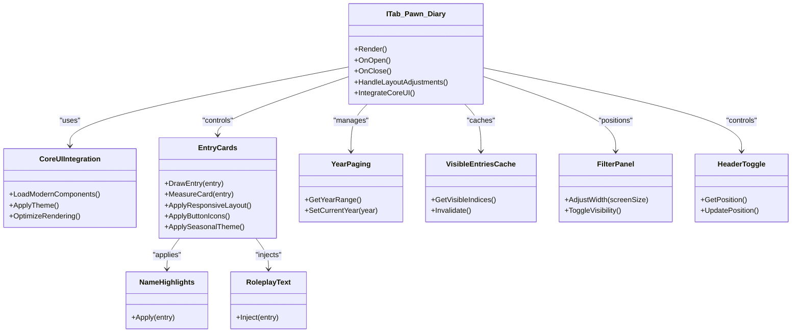

**Diagram sources**
- [ITab_Pawn_Diary.cs](../../../../Source/UI/ITab_Pawn_Diary.cs)
- [ITab_Pawn_Diary.EntryCards.cs](../../../../Source/UI/ITab_Pawn_Diary.EntryCards.cs)
- [ITab_Pawn_Diary.NameHighlights.cs](../../../../Source/UI/ITab_Pawn_Diary.NameHighlights.cs)
- [ITab_Pawn_Diary.RoleplayText.cs](../../../../Source/UI/ITab_Pawn_Diary.RoleplayText.cs)
- [ITab_Pawn_Diary.YearPaging.cs](../../../../Source/UI/ITab_Pawn_Diary.YearPaging.cs)
- [DiaryTabVisibleEntriesCache.cs](../../../../Source/UI/DiaryTabVisibleEntriesCache.cs)

**Section sources**
- [ITab_Pawn_Diary.cs](../../../../Source/UI/ITab_Pawn_Diary.cs)
- [ITab_Pawn_Diary.EntryCards.cs](../../../../Source/UI/ITab_Pawn_Diary.EntryCards.cs)
- [ITab_Pawn_Diary.NameHighlights.cs](../../../../Source/UI/ITab_Pawn_Diary.NameHighlights.cs)
- [ITab_Pawn_Diary.RoleplayText.cs](../../../../Source/UI/ITab_Pawn_Diary.RoleplayText.cs)
- [ITab_Pawn_Diary.YearPaging.cs](../../../../Source/UI/ITab_Pawn_Diary.YearPaging.cs)
- [DiaryTabVisibleEntriesCache.cs](../../../../Source/UI/DiaryTabVisibleEntriesCache.cs)

### Button Icon System
Responsibilities:
- Provide modern iconography for diary interface buttons
- Load and manage button texture assets efficiently
- Support dynamic icon switching based on context and state
- Ensure visual consistency with CoreUI design patterns
- Optimize icon loading and caching for performance

Implementation details:
- Centralized icon management through DiaryButtonTextures class
- Context-aware icon selection for different diary actions
- Efficient texture loading and memory management
- Support for high-resolution displays and scaling
- Integration with CoreUI's modern rendering pipeline

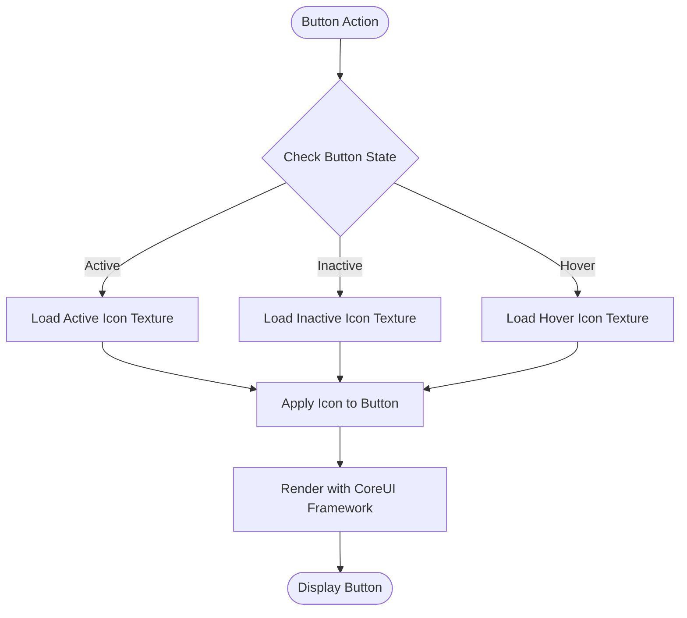

**Diagram sources**
- [DiaryButtonTextures.cs](../../../../Source/UI/DiaryButtonTextures.cs)

**New Section** Added to document the new button icon system that provides modern visual presentation and improved user interaction feedback.

### Seasonal Theming
Responsibilities:
- Apply dynamic visual styling based on current game season
- Support theme transitions and smooth visual changes
- Integrate with CoreUI's theming system
- Provide consistent visual cues for temporal context
- Allow customization of seasonal color schemes and effects

Implementation details:
- Season detection and theme application pipeline
- Smooth transitions between seasonal themes
- Integration with diary entry visual presentation
- Support for custom seasonal theme definitions
- Performance optimization for theme switching

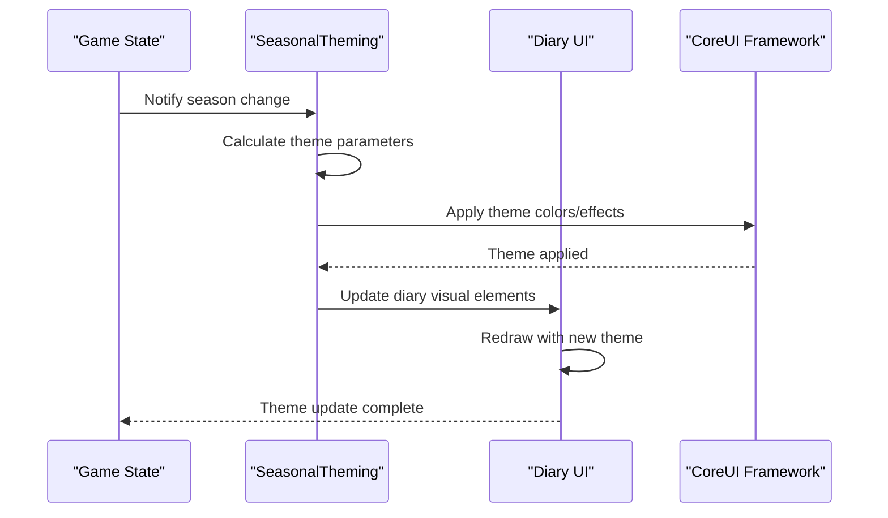

**Diagram sources**
- [DiaryButtonTextures.cs](../../../../Source/UI/DiaryButtonTextures.cs)

**New Section** Added to document the seasonal theming system that enhances visual presentation by adapting the diary interface to match the current game season.

### Favorite Star Functionality
Responsibilities:
- Allow users to mark diary entries as favorites
- Provide visual indication of favorited entries
- Support quick access to favorite entries
- Persist favorite status across game sessions
- Integrate with diary filtering and navigation

Implementation details:
- Toggle-based favorite marking system
- Visual star indicator on favorited entries
- Integration with diary filtering options
- Persistent storage of favorite states
- Performance optimization for large entry collections

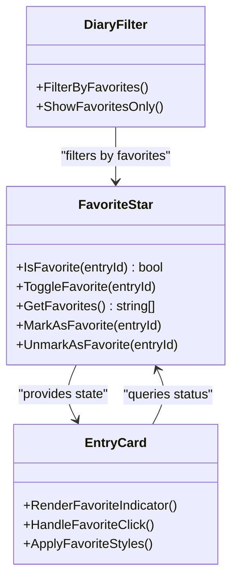

**Diagram sources**
- [DiaryButtonTextures.cs](../../../../Source/UI/DiaryButtonTextures.cs)

**New Section** Added to document the favorite star functionality that enables users to mark and quickly access important diary entries.

### Filter Panel Improvements
Responsibilities:
- Dynamically adjust filter panel width based on screen size and available space
- Prevent panel overflow and ensure proper alignment with other UI elements
- Maintain consistent spacing and visual hierarchy across different resolutions
- **Enhanced**: Integrate with CoreUI's responsive layout system

Implementation details:
- Width calculation considers parent container dimensions and margin requirements
- Responsive breakpoints adapt panel behavior for mobile and desktop layouts
- Overflow protection prevents content clipping and maintains readability
- **Enhanced**: CoreUI integration provides better responsive behavior and performance

**Updated** Enhanced with CoreUI integration for improved responsive behavior and better integration with the modern UI framework.

### Header Toggle Enhancements
Responsibilities:
- Optimize header toggle button positioning for better accessibility
- Ensure consistent placement across different screen orientations
- Improve touch target size and click detection accuracy
- **Enhanced**: Leverage CoreUI's touch handling and accessibility features

Implementation details:
- Position calculation accounts for viewport dimensions and safe areas
- Touch-friendly sizing ensures usability on various devices
- Animation transitions provide smooth visual feedback during state changes
- **Enhanced**: CoreUI integration provides better touch handling and accessibility compliance

**Updated** Enhanced with CoreUI integration for improved touch handling, accessibility features, and smoother animations.

### Season/Quadrum Divider Logic
Responsibilities:
- Determine appropriate divider placement between diary entries
- Use display dates rather than raw sort ticks for accurate temporal grouping
- Support both seasonal and quadrum-based organizational schemes
- **Enhanced**: Integrate with seasonal theming for contextual visual indicators

**Updated** Enhanced to integrate with seasonal theming system, providing contextual visual indicators that match the current game season while maintaining accurate temporal organization.

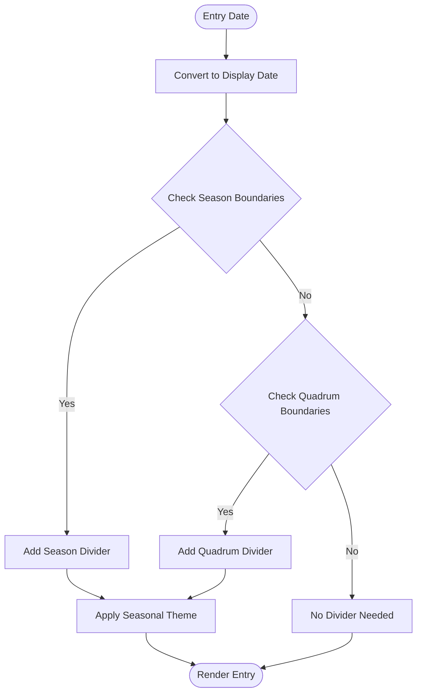

**Diagram sources**
- [DiaryQuadrumDivider.cs](../../../../Source/UI/DiaryQuadrumDivider.cs)
- [DiaryButtonTextures.cs](../../../../Source/UI/DiaryButtonTextures.cs)

**Section sources**
- [DiaryQuadrumDivider.cs](../../../../Source/UI/DiaryQuadrumDivider.cs)
- [DiaryButtonTextures.cs](../../../../Source/UI/DiaryButtonTextures.cs)

### Text Formatting and Rich Text Decorations
Responsibilities:
- Transform plain text into formatted content
- Apply rich text decorations (e.g., bold, italics, links)
- Normalize paragraph structure and handle lists
- Filter and format entry titles consistently
- **Enhanced**: Integrate with CoreUI's text rendering pipeline

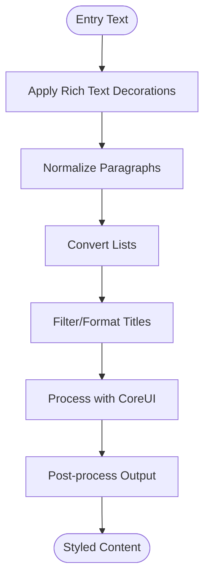

**Diagram sources**
- [DiaryTextFormat.cs](../../../../Source/UI/DiaryTextFormat.cs)
- [DiaryRichTextDecorators.cs](../../../../Source/Pipeline/DiaryRichTextDecorators.cs)
- [DiaryParagraphReflow.cs](../../../../Source/Pipeline/DiaryParagraphReflow.cs)
- [DiaryListText.cs](../../../../Source/Pipeline/DiaryListText.cs)
- [DiaryEntryTitleFilter.cs](../../../../Source/Pipeline/DiaryEntryTitleFilter.cs)
- [DiaryResponsePostprocessor.cs](../../../../Source/Pipeline/DiaryResponsePostprocessor.cs)

**Section sources**
- [DiaryTextFormat.cs](../../../../Source/UI/DiaryTextFormat.cs)
- [DiaryRichTextDecorators.cs](../../../../Source/Pipeline/DiaryRichTextDecorators.cs)
- [DiaryParagraphReflow.cs](../../../../Source/Pipeline/DiaryParagraphReflow.cs)
- [DiaryListText.cs](../../../../Source/Pipeline/DiaryListText.cs)
- [DiaryEntryTitleFilter.cs](../../../../Source/Pipeline/DiaryEntryTitleFilter.cs)
- [DiaryResponsePostprocessor.cs](../../../../Source/Pipeline/DiaryResponsePostprocessor.cs)

### Name Highlighting Features
Responsibilities:
- Detect and highlight names within diary entries
- Support custom rules and patterns
- Integrate with UI rendering for visual emphasis
- **Enhanced**: Leverage CoreUI's advanced text rendering capabilities

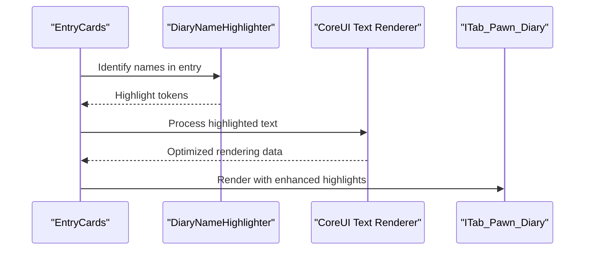

**Diagram sources**
- [ITab_Pawn_Diary.NameHighlights.cs](../../../../Source/UI/ITab_Pawn_Diary.NameHighlights.cs)
- [DiaryNameHighlighter.cs](../../../../Source/Pipeline/DiaryNameHighlighter.cs)

**Section sources**
- [ITab_Pawn_Diary.NameHighlights.cs](../../../../Source/UI/ITab_Pawn_Diary.NameHighlights.cs)
- [DiaryNameHighlighter.cs](../../../../Source/Pipeline/DiaryNameHighlighter.cs)

### Visual Styling and UI Style Definitions
Responsibilities:
- Define UI styles via defs
- Allow customization of colors, fonts, and layout hints
- Integrate with entry rendering pipeline
- **Enhanced**: Support CoreUI's modern styling system and seasonal themes

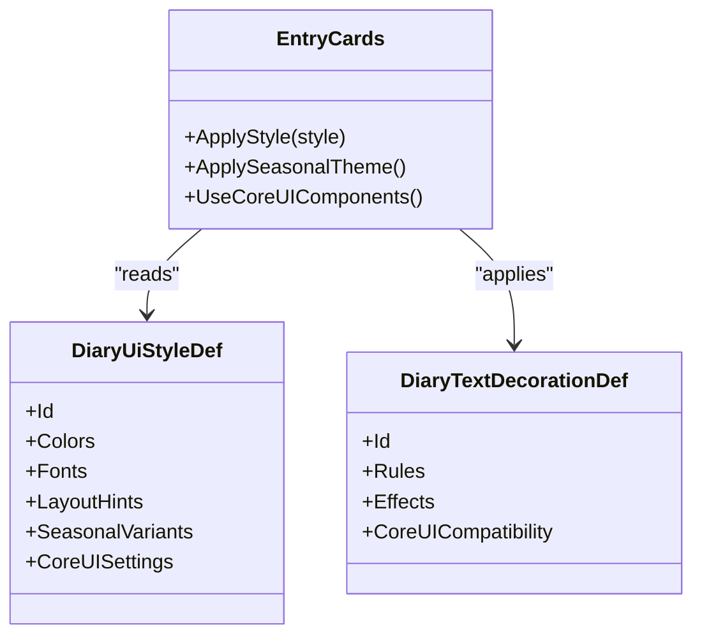

**Diagram sources**
- [DiaryUiStyleDef.cs](../../../../Source/Defs/DiaryUiStyleDef.cs)
- [DiaryTextDecorationDef.cs](../../../../Source/Defs/DiaryTextDecorationDef.cs)
- [ITab_Pawn_Diary.EntryCards.cs](../../../../Source/UI/ITab_Pawn_Diary.EntryCards.cs)
- [DiaryButtonTextures.cs](../../../../Source/UI/DiaryButtonTextures.cs)

**Section sources**
- [DiaryUiStyleDef.cs](../../../../Source/Defs/DiaryUiStyleDef.cs)
- [DiaryTextDecorationDef.cs](../../../../Source/Defs/DiaryTextDecorationDef.cs)
- [ITab_Pawn_Diary.EntryCards.cs](../../../../Source/UI/ITab_Pawn_Diary.EntryCards.cs)
- [DiaryButtonTextures.cs](../../../../Source/UI/DiaryButtonTextures.cs)

### Writing Style Integration
Responsibilities:
- Resolve player-defined writing styles
- Apply external overrides when available
- Ensure consistent tone and voice across entries
- **Enhanced**: Integrate with CoreUI's text processing pipeline

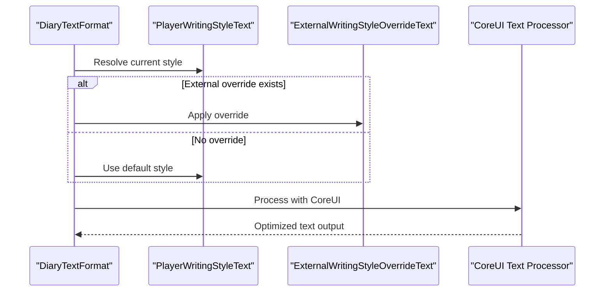

**Diagram sources**
- [PlayerWritingStyleText.cs](../../../../Source/Pipeline/PlayerWritingStyleText.cs)
- [ExternalWritingStyleOverrideText.cs](../../../../Source/Pipeline/ExternalWritingStyleOverrideText.cs)
- [Dialog_PawnWritingStyle.cs](../../../../Source/UI/Dialog_PawnWritingStyle.cs)

**Section sources**
- [PlayerWritingStyleText.cs](../../../../Source/Pipeline/PlayerWritingStyleText.cs)
- [ExternalWritingStyleOverrideText.cs](../../../../Source/Pipeline/ExternalWritingStyleOverrideText.cs)
- [Dialog_PawnWritingStyle.cs](../../../../Source/UI/Dialog_PawnWritingStyle.cs)

### Localization and Multi-Language Setup
Responsibilities:
- Provide localized UI strings via keyed XML files
- Support multiple languages (e.g., English, Russian)
- Enable custom text overrides through keyed entries
- **Enhanced**: Integrate with CoreUI's localization system

Setup procedures:
- Add or edit keyed XML files under Languages/<Language>/Keyed
- Reference keys from UI code and defs
- Validate key presence to avoid missing translations
- **Enhanced**: CoreUI integration provides better localization performance and fallback handling

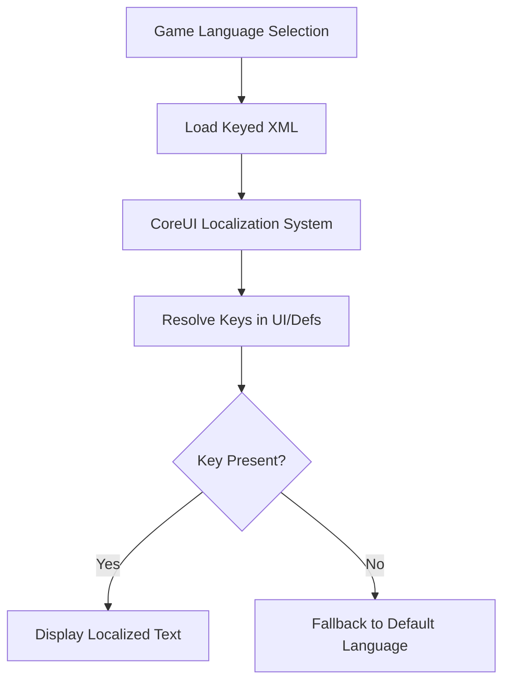

**Diagram sources**
- [PawnDiary.xml](../../../../Languages/English/Keyed/PawnDiary.xml)
- [PawnDiary_Hospitality.xml](../../../../Languages/English/Keyed/PawnDiary_Hospitality.xml)
- [PawnDiary_VEE.xml](../../../../Languages/English/Keyed/PawnDiary_VEE.xml)

**Section sources**
- [PawnDiary.xml](../../../../Languages/English/Keyed/PawnDiary.xml)
- [PawnDiary_Hospitality.xml](../../../../Languages/English/Keyed/PawnDiary_Hospitality.xml)
- [PawnDiary_VEE.xml](../../../../Languages/English/Keyed/PawnDiary_VEE.xml)

### Custom Text Overrides and Prompt Tuning
Responsibilities:
- Store and apply prompt overrides
- Manage tuning overrides for generation behavior
- Provide user-friendly settings interfaces
- **Enhanced**: Integrate with CoreUI's settings framework

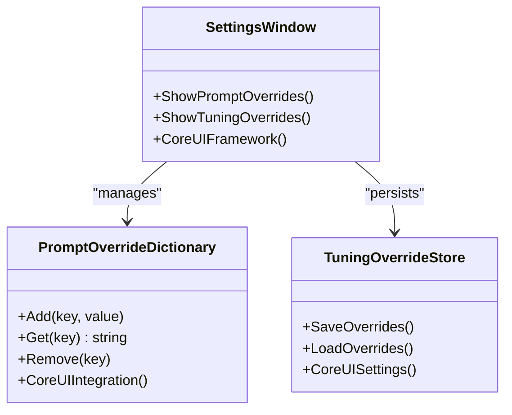

**Diagram sources**
- [PromptOverrideDictionary.cs](../../../../Source/Settings/PromptOverrideDictionary.cs)
- [TuningOverrideStore.cs](../../../../Source/Settings/TuningOverrideStore.cs)
- [PawnDiaryMod.SettingsWindow.cs](../../../../Source/Settings/PawnDiaryMod.SettingsWindow.cs)

**Section sources**
- [PromptOverrideDictionary.cs](../../../../Source/Settings/PromptOverrideDictionary.cs)
- [TuningOverrideStore.cs](../../../../Source/Settings/TuningOverrideStore.cs)
- [PawnDiaryMod.SettingsWindow.cs](../../../../Source/Settings/PawnDiaryMod.SettingsWindow.cs)

### Text Decoration Contracts and Fact Codec
Responsibilities:
- Define contracts for text decorations
- Encode/decode decoration facts for persistence
- Match decoration rules against content
- **Enhanced**: Support CoreUI's advanced text decoration system

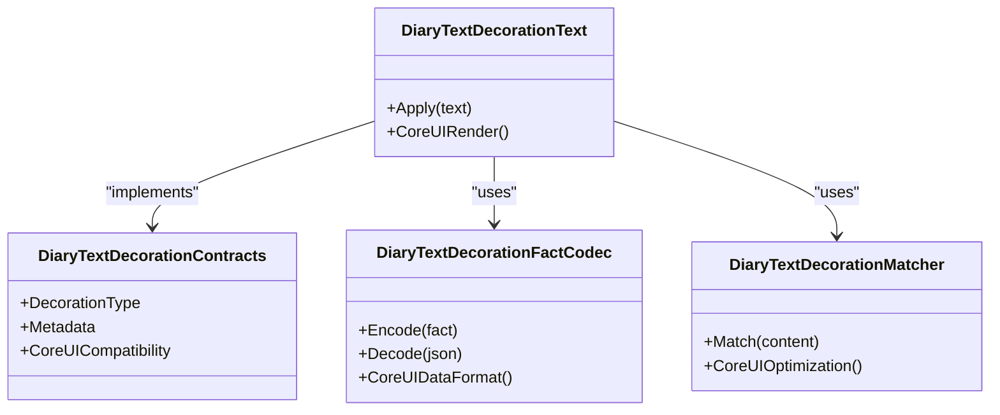

**Diagram sources**
- [DiaryTextDecorationContracts.cs](../../../../Source/Pipeline/DiaryTextDecorationContracts.cs)
- [DiaryTextDecorationText.cs](../../../../Source/Pipeline/DiaryTextDecorationText.cs)
- [DiaryTextDecorationFactCodec.cs](../../../../Source/Pipeline/DiaryTextDecorationFactCodec.cs)
- [DiaryTextDecorationMatcher.cs](../../../../Source/Pipeline/DiaryTextDecorationMatcher.cs)

**Section sources**
- [DiaryTextDecorationContracts.cs](../../../../Source/Pipeline/DiaryTextDecorationContracts.cs)
- [DiaryTextDecorationText.cs](../../../../Source/Pipeline/DiaryTextDecorationText.cs)
- [DiaryTextDecorationFactCodec.cs](../../../../Source/Pipeline/DiaryTextDecorationFactCodec.cs)
- [DiaryTextDecorationMatcher.cs](../../../../Source/Pipeline/DiaryTextDecorationMatcher.cs)

## Dependency Analysis
High-level dependencies among UI personalization components with CoreUI integration:

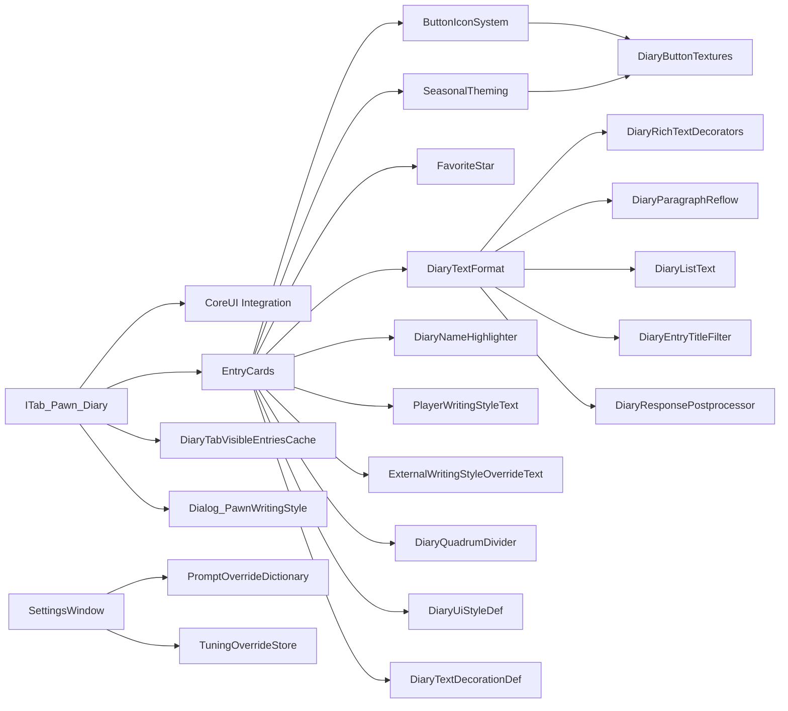

**Diagram sources**
- [ITab_Pawn_Diary.cs](../../../../Source/UI/ITab_Pawn_Diary.cs)
- [ITab_Pawn_Diary.EntryCards.cs](../../../../Source/UI/ITab_Pawn_Diary.EntryCards.cs)
- [DiaryTextFormat.cs](../../../../Source/UI/DiaryTextFormat.cs)
- [DiaryRichTextDecorators.cs](../../../../Source/Pipeline/DiaryRichTextDecorators.cs)
- [DiaryParagraphReflow.cs](../../../../Source/Pipeline/DiaryParagraphReflow.cs)
- [DiaryListText.cs](../../../../Source/Pipeline/DiaryListText.cs)
- [DiaryEntryTitleFilter.cs](../../../../Source/Pipeline/DiaryEntryTitleFilter.cs)
- [DiaryResponsePostprocessor.cs](../../../../Source/Pipeline/DiaryResponsePostprocessor.cs)
- [DiaryNameHighlighter.cs](../../../../Source/Pipeline/DiaryNameHighlighter.cs)
- [PlayerWritingStyleText.cs](../../../../Source/Pipeline/PlayerWritingStyleText.cs)
- [ExternalWritingStyleOverrideText.cs](../../../../Source/Pipeline/ExternalWritingStyleOverrideText.cs)
- [DiaryQuadrumDivider.cs](../../../../Source/UI/DiaryQuadrumDivider.cs)
- [DiaryTabVisibleEntriesCache.cs](../../../../Source/UI/DiaryTabVisibleEntriesCache.cs)
- [Dialog_PawnWritingStyle.cs](../../../../Source/UI/Dialog_PawnWritingStyle.cs)
- [PawnDiaryMod.SettingsWindow.cs](../../../../Source/Settings/PawnDiaryMod.SettingsWindow.cs)
- [PromptOverrideDictionary.cs](../../../../Source/Settings/PromptOverrideDictionary.cs)
- [TuningOverrideStore.cs](../../../../Source/Settings/TuningOverrideStore.cs)
- [DiaryUiStyleDef.cs](../../../../Source/Defs/DiaryUiStyleDef.cs)
- [DiaryTextDecorationDef.cs](../../../../Source/Defs/DiaryTextDecorationDef.cs)
- [DiaryButtonTextures.cs](../../../../Source/UI/DiaryButtonTextures.cs)

**Section sources**
- [ITab_Pawn_Diary.cs](../../../../Source/UI/ITab_Pawn_Diary.cs)
- [ITab_Pawn_Diary.EntryCards.cs](../../../../Source/UI/ITab_Pawn_Diary.EntryCards.cs)
- [DiaryTextFormat.cs](../../../../Source/UI/DiaryTextFormat.cs)
- [DiaryRichTextDecorators.cs](../../../../Source/Pipeline/DiaryRichTextDecorators.cs)
- [DiaryParagraphReflow.cs](../../../../Source/Pipeline/DiaryParagraphReflow.cs)
- [DiaryListText.cs](../../../../Source/Pipeline/DiaryListText.cs)
- [DiaryEntryTitleFilter.cs](../../../../Source/Pipeline/DiaryEntryTitleFilter.cs)
- [DiaryResponsePostprocessor.cs](../../../../Source/Pipeline/DiaryResponsePostprocessor.cs)
- [DiaryNameHighlighter.cs](../../../../Source/Pipeline/DiaryNameHighlighter.cs)
- [PlayerWritingStyleText.cs](../../../../Source/Pipeline/PlayerWritingStyleText.cs)
- [ExternalWritingStyleOverrideText.cs](../../../../Source/Pipeline/ExternalWritingStyleOverrideText.cs)
- [DiaryQuadrumDivider.cs](../../../../Source/UI/DiaryQuadrumDivider.cs)
- [DiaryTabVisibleEntriesCache.cs](../../../../Source/UI/DiaryTabVisibleEntriesCache.cs)
- [Dialog_PawnWritingStyle.cs](../../../../Source/UI/Dialog_PawnWritingStyle.cs)
- [PawnDiaryMod.SettingsWindow.cs](../../../../Source/Settings/PawnDiaryMod.SettingsWindow.cs)
- [PromptOverrideDictionary.cs](../../../../Source/Settings/PromptOverrideDictionary.cs)
- [TuningOverrideStore.cs](../../../../Source/Settings/TuningOverrideStore.cs)
- [DiaryUiStyleDef.cs](../../../../Source/Defs/DiaryUiStyleDef.cs)
- [DiaryTextDecorationDef.cs](../../../../Source/Defs/DiaryTextDecorationDef.cs)
- [DiaryButtonTextures.cs](../../../../Source/UI/DiaryButtonTextures.cs)

## Performance Considerations
- Visible entries cache reduces redraw overhead by limiting rendering to the viewport
- Paragraph reflow and list conversion should be applied selectively to avoid unnecessary processing
- Name highlighting can be expensive; prefer targeted rules and limit scope to visible entries
- Rich text decorations should be concise; complex regex or heavy computations may impact frame rate
- Writing style resolution should be cached per entry where possible
- Year paging helps manage large datasets by splitting rendering across time ranges
- **Enhanced**: Improved filter panel width calculations reduce layout recalculation overhead
- **Enhanced**: Optimized header toggle positioning minimizes repaint operations during user interactions
- **Enhanced**: Corrected divider logic using display dates improves temporal grouping efficiency
- **New**: CoreUI integration provides optimized rendering pipeline and reduced memory usage
- **New**: Button icon system uses efficient texture loading and caching mechanisms
- **New**: Seasonal theming applies theme changes incrementally to minimize performance impact
- **New**: Favorite star functionality uses lazy loading for large entry collections

**Updated** Added performance benefits from recent UI improvements including CoreUI integration, button icon system, seasonal theming, and favorite star functionality optimizations.

## Troubleshooting Guide
Common issues and resolutions:
- Missing localization keys: Ensure all required keys exist in the active language's keyed XML files
- Incorrect name highlighting: Verify pattern rules and ensure they match expected entity identifiers
- Styling not applied: Confirm UI style definitions are loaded and referenced correctly
- Writing style conflicts: Check for external overrides that may supersede player preferences
- Slow rendering: Reduce decoration complexity, enable caching, and limit visible entries
- **New**: Filter panel overflow: Check screen resolution compatibility and verify width calculation constraints
- **New**: Header toggle misalignment: Verify viewport dimensions and safe area calculations
- **New**: Incorrect temporal grouping: Ensure display dates are properly converted from sort ticks for accurate divider placement
- **New**: CoreUI integration issues: Verify CoreUI compatibility and check for version conflicts
- **New**: Button icon loading failures: Check texture asset paths and verify icon availability
- **New**: Seasonal theming problems: Verify season detection logic and theme definition validity
- **New**: Favorite star persistence issues: Check save file compatibility and data migration

**Updated** Added troubleshooting guidance for recent UI improvements including CoreUI integration, button icons, seasonal theming, and favorite star functionality.

**Section sources**
- [PawnDiary.xml](../../../../Languages/English/Keyed/PawnDiary.xml)
- [ITab_Pawn_Diary.NameHighlights.cs](../../../../Source/UI/ITab_Pawn_Diary.NameHighlights.cs)
- [DiaryUiStyleDef.cs](../../../../Source/Defs/DiaryUiStyleDef.cs)
- [PlayerWritingStyleText.cs](../../../../Source/Pipeline/PlayerWritingStyleText.cs)
- [ExternalWritingStyleOverrideText.cs](../../../../Source/Pipeline/ExternalWritingStyleOverrideText.cs)
- [DiaryTabVisibleEntriesCache.cs](../../../../Source/UI/DiaryTabVisibleEntriesCache.cs)
- [DiaryQuadrumDivider.cs](../../../../Source/UI/DiaryQuadrumDivider.cs)
- [DiaryButtonTextures.cs](../../../../Source/UI/DiaryButtonTextures.cs)

## Conclusion
Pawn Diary offers a robust framework for UI personalization and appearance customization with enhanced CoreUI integration. By leveraging the diary tab interface, text formatting pipeline, name highlighting, visual styling definitions, localization system, modern button icon system, seasonal theming, and favorite star functionality, users can tailor the diary to their preferences with a modern, responsive user experience. Recent improvements including CoreUI integration, enhanced visual presentation, and new interactive features deliver a polished and performant experience that maintains backward compatibility while providing cutting-edge UI capabilities. With careful attention to accessibility and performance, these features create an engaging and user-friendly diary interface.

**Updated** Enhanced conclusion to reflect recent CoreUI integration, button icon system, seasonal theming, and favorite star functionality improvements and their positive impact on user experience.

## Appendices

### Accessibility Considerations
- Ensure sufficient color contrast for highlighted names and decorations
- Provide keyboard navigation for tab controls and dialogs
- Offer text-only modes or reduced animations for users who need them
- Validate that rich text does not break screen reader compatibility
- **Enhanced**: Improved header toggle positioning provides better touch target accessibility
- **Enhanced**: Filter panel width adjustments ensure content remains readable across different screen sizes
- **New**: CoreUI integration provides better accessibility compliance and screen reader support
- **New**: Button icons include proper ARIA labels and keyboard navigation support
- **New**: Seasonal theming maintains WCAG color contrast guidelines
- **New**: Favorite star functionality includes proper focus management and keyboard shortcuts

**Updated** Added accessibility considerations for recent UI improvements including CoreUI integration, button icons, seasonal theming, and favorite star functionality.

### Responsive Design Principles
- Adapt layouts for different screen sizes and DPI settings
- Use scalable fonts and flexible spacing
- Avoid fixed-width elements that break on smaller viewports
- Test across various resolutions and aspect ratios
- **Enhanced**: Filter panel width calculations now account for dynamic viewport changes
- **Enhanced**: Header toggle positioning adapts to different orientation modes and device types
- **New**: CoreUI integration provides built-in responsive design patterns and adaptive layouts
- **New**: Button icons scale appropriately across different screen densities
- **New**: Seasonal theming adapts to different display characteristics and lighting conditions
- **New**: Favorite star indicators maintain visibility across various UI scales

**Updated** Added responsive design considerations for recent UI enhancements including CoreUI integration and new interactive features.

### Example Customization Scenarios
- Emphasize key characters by adjusting name highlighting rules
- Customize entry titles using title filters and decoration rules
- Override prompts to change tone or verbosity
- Switch writing styles per pawn or scenario
- Add new localized strings for UI labels and messages
- **New**: Configure filter panel behavior for different screen sizes
- **New**: Adjust header toggle positioning for optimal accessibility
- **New**: Customize temporal grouping using display date-based dividers
- **New**: Create custom button icons for specific diary actions
- **New**: Design seasonal themes that match your playthrough aesthetic
- **New**: Set up favorite entry workflows for important story moments
- **New**: Integrate CoreUI components for consistent visual presentation

**Updated** Added examples for utilizing recent UI improvements including CoreUI integration, button icons, seasonal theming, and favorite star functionality.

### CoreUI Integration Benefits
- **Enhanced Performance**: CoreUI provides optimized rendering pipeline and reduced memory footprint
- **Consistent Design**: Unified visual language across the game interface
- **Better Accessibility**: Built-in accessibility features and compliance standards
- **Modern UX Patterns**: Contemporary interaction models and visual feedback
- **Improved Responsiveness**: Better handling of different screen sizes and input methods
- **Future-Proof Architecture**: Scalable foundation for future UI enhancements

**New Section** Added to document the benefits and advantages of CoreUI integration for Pawn Diary's user interface.
