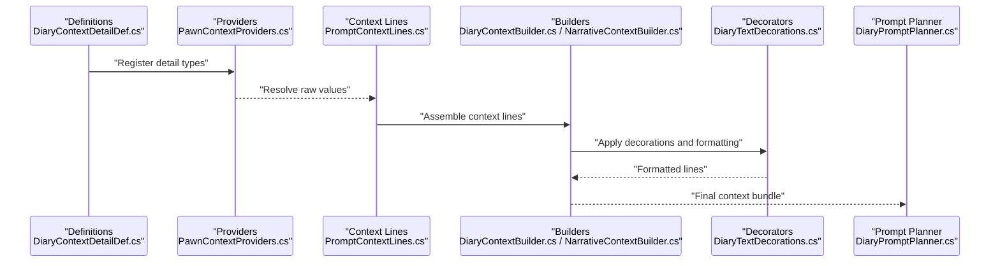

# Context Details

- [DiaryContextDetailDef.cs](../../../../../Source/Defs/DiaryContextDetailDef.cs)
- [PromptContextDetail.cs](../../../../../Source/Pipeline/PromptContextDetail.cs)
- [PromptContextLines.cs](../../../../../Source/Pipeline/PromptContextLines.cs)
- [DiaryContextBuilder.cs](../../../../../Source/Generation/DiaryContextBuilder.cs)
- [NarrativeContextBuilder.cs](../../../../../Source/Generation/NarrativeContextBuilder.cs)
- [PawnContextProviders.cs](../../../../../Source/Integration/PawnContextProviders.cs)
- [DiaryContextBundleSnapshot.cs](../../../../../Source/Integration/DiaryContextBundleSnapshot.cs)
- [DiaryContextSnapshot.cs](../../../../../Source/Integration/DiaryContextSnapshot.cs)
- [DiaryTextDecorationContracts.cs](../../../../../Source/Pipeline/DiaryTextDecorationContracts.cs)
- [DiaryTextDecorations.cs](../../../../../Source/Pipeline/DiaryTextDecorations.cs)
- [DiaryNameHighlighter.cs](../../../../../Source/Pipeline/DiaryNameHighlighter.cs)
- [DiaryRichTextDecorators.cs](../../../../../Source/Pipeline/DiaryRichTextDecorators.cs)
- [DiaryEventDomainClassifier.cs](../../../../../Source/Pipeline/DiaryEventDomainClassifier.cs)
- [DiaryListText.cs](../../../../../Source/Pipeline/DiaryListText.cs)
- [DiaryParagraphReflow.cs](../../../../../Source/Pipeline/DiaryParagraphReflow.cs)
- [DiaryTextSanitizer.cs](../../../../../Source/Pipeline/PromptTextSanitizer.cs)
- [DiaryDirectSpeechParser.cs](../../../../../Source/Pipeline/DiaryDirectSpeechParser.cs)
- [ExternalOverrideArbitration.cs](../../../../../Source/Pipeline/ExternalOverrideArbitration.cs)
- [DiaryEntryTitleFilter.cs](../../../../../Source/Pipeline/DiaryEntryTitleFilter.cs)
- [DiaryRetentionPlan.cs](../../../../../Source/Pipeline/DiaryRetentionPlan.cs)
- [DiaryArchiveFallback.cs](../../../../../Source/Pipeline/DiaryArchiveFallback.cs)
- [DiarySaveNormalization.cs](../../../../../Source/Pipeline/DiarySaveNormalization.cs)
- [DiaryPipelineContracts.cs](../../../../../Source/Pipeline/DiaryPipelineContracts.cs)
- [DiaryResponsePostprocessor.cs](../../../../../Source/Pipeline/DiaryResponsePostprocessor.cs)
- [DiarySentenceExcerpt.cs](../../../../../Source/Pipeline/DiarySentenceExcerpt.cs)
- [DiaryTextDecorationFactCodec.cs](../../../../../Source/Pipeline/DiaryTextDecorationFactCodec.cs)
- [DiaryTextDecorationMatcher.cs](../../../../../Source/Pipeline/DiaryTextDecorationMatcher.cs)
- [DiaryTextDecorationText.cs](../../../../../Source/Pipeline/DiaryTextDecorationText.cs)
- [DiaryPromptCapture.cs](../../../../../Source/Pipeline/DiaryPromptCapture.cs)
- [DiaryPromptPlanner.cs](../../../../../Source/Pipeline/DiaryPromptPlanner.cs)
- [DiaryLifeBoundaryPolicy.cs](../../../../../Source/Pipeline/DiaryLifeBoundaryPolicy.cs)
- [DiaryEventPromptKeys.cs](../../../../../Source/Pipeline/DiaryEventPromptKeys.cs)
- [DiaryGenerationStatus.cs](../../../../../Source/Pipeline/DiaryGenerationStatus.cs)
- [DiaryEntryStatsAccumulator.cs](../../../../../Source/Pipeline/DiaryEntryStatsAccumulator.cs)
- [DiaryRetentionPolicy.cs](../../../../../Source/Pipeline/DiaryRetentionPlan.cs)
- [DiaryArchiveEligibility.cs](../../../../../Source/Pipeline/DiaryArchiveEligibility.cs)
- [DiaryArchiveCompactionPlanner.cs](../../../../../Source/Pipeline/DiaryArchiveCompactionPlanner.cs)
- [DiaryListText.cs](../../../../../Source/Pipeline/DiaryListText.cs)
- [DiaryParagraphReflow.cs](../../../../../Source/Pipeline/DiaryParagraphReflow.cs)
- [DiaryTextDecorations.cs](../../../../../Source/Pipeline/DiaryTextDecorations.cs)
- [DiaryNameHighlighter.cs](../../../../../Source/Pipeline/DiaryNameHighlighter.cs)
- [DiaryRichTextDecorators.cs](../../../../../Source/Pipeline/DiaryRichTextDecorators.cs)
- [DiaryTextDecorationContracts.cs](../../../../../Source/Pipeline/DiaryTextDecorationContracts.cs)
- [DiaryTextDecorationFactCodec.cs](../../../../../Source/Pipeline/DiaryTextDecorationFactCodec.cs)
- [DiaryTextDecorationMatcher.cs](../../../../../Source/Pipeline/DiaryTextDecorationMatcher.cs)
- [DiaryTextDecorationText.cs](../../../../../Source/Pipeline/DiaryTextDecorationText.cs)
- [DiaryDirectSpeechParser.cs](../../../../../Source/Pipeline/DiaryDirectSpeechParser.cs)
- [DiaryEntryTitleFilter.cs](../../../../../Source/Pipeline/DiaryEntryTitleFilter.cs)
- [DiaryRetentionPlan.cs](../../../../../Source/Pipeline/DiaryRetentionPlan.cs)
- [DiaryArchiveFallback.cs](../../../../../Source/Pipeline/DiaryArchiveFallback.cs)
- [DiarySaveNormalization.cs](../../../../../Source/Pipeline/DiarySaveNormalization.cs)
- [DiaryPipelineContracts.cs](../../../../../Source/Pipeline/DiaryPipelineContracts.cs)
- [DiaryResponsePostprocessor.cs](../../../../../Source/Pipeline/DiaryResponsePostprocessor.cs)
- [DiarySentenceExcerpt.cs](../../../../../Source/Pipeline/DiarySentenceExcerpt.cs)
- [DiaryPromptCapture.cs](../../../../../Source/Pipeline/DiaryPromptCapture.cs)
- [DiaryPromptPlanner.cs](../../../../../Source/Pipeline/DiaryPromptPlanner.cs)
- [DiaryLifeBoundaryPolicy.cs](../../../../../Source/Pipeline/DiaryLifeBoundaryPolicy.cs)
- [DiaryEventPromptKeys.cs](../../../../../Source/Pipeline/DiaryEventPromptKeys.cs)
- [DiaryGenerationStatus.cs](../../../../../Source/Pipeline/DiaryGenerationStatus.cs)
- [DiaryEntryStatsAccumulator.cs](../../../../../Source/Pipeline/DiaryEntryStatsAccumulator.cs)
## Table of Contents
1. [Introduction](#introduction)
2. [Project Structure](#project-structure)
3. [Core Components](#core-components)
4. [Architecture Overview](#architecture-overview)
5. [Detailed Component Analysis](#detailed-component-analysis)
6. [Dependency Analysis](#dependency-analysis)
7. [Performance Considerations](#performance-considerations)
8. [Troubleshooting Guide](#troubleshooting-guide)
9. [Conclusion](#conclusion)
10. [Appendices](#appendices)

## Introduction
This document explains the context detail system that enriches diary entries with relevant game state information. It covers:
- What context details are and how they integrate into prompt assembly
- Built-in context detail types, data sources, formatting options, and inclusion criteria
- How to create custom context details and inject them conditionally
- Examples for location context, relationship context, and event-specific details
- Performance impact, memory usage optimization, and debugging strategies

The goal is to help modders and integrators add meaningful, efficient context to generated prompts without harming performance or stability.

## Project Structure
The context detail system spans definitions, pipeline processing, generation, integration snapshots, and UI/formatting utilities. Key areas include:
- Definitions: Declares context detail types and their metadata
- Pipeline: Builds, formats, filters, and decorates context lines
- Generation: Assembles context into prompts and narratives
- Integration: Exposes snapshots and providers for external systems
- Formatting: Applies decorations, name highlighting, and rich text

```mermaid
graph TB
subgraph "Definitions"
D1["DiaryContextDetailDef.cs"]
end
subgraph "Pipeline"
P1["PromptContextDetail.cs"]
P2["PromptContextLines.cs"]
P3["DiaryTextDecorations.cs"]
P4["DiaryNameHighlighter.cs"]
P5["DiaryRichTextDecorators.cs"]
P6["DiaryTextDecorationContracts.cs"]
P7["DiaryTextDecorationFactCodec.cs"]
P8["DiaryTextDecorationMatcher.cs"]
P9["DiaryTextDecorationText.cs"]
P10["DiaryListText.cs"]
P11["DiaryParagraphReflow.cs"]
P12["DiaryDirectSpeechParser.cs"]
P13["DiaryEntryTitleFilter.cs"]
P14["DiaryRetentionPlan.cs"]
P15["DiaryArchiveFallback.cs"]
P16["DiarySaveNormalization.cs"]
P17["DiaryPipelineContracts.cs"]
P18["DiaryResponsePostprocessor.cs"]
P19["DiarySentenceExcerpt.cs"]
P20["DiaryPromptCapture.cs"]
P21["DiaryPromptPlanner.cs"]
P22["DiaryLifeBoundaryPolicy.cs"]
P23["DiaryEventPromptKeys.cs"]
P24["DiaryGenerationStatus.cs"]
P25["DiaryEntryStatsAccumulator.cs"]
end
subgraph "Generation"
G1["DiaryContextBuilder.cs"]
G2["NarrativeContextBuilder.cs"]
end
subgraph "Integration"
I1["PawnContextProviders.cs"]
I2["DiaryContextBundleSnapshot.cs"]
I3["DiaryContextSnapshot.cs"]
end
D1 --> P1
P1 --> P2
P2 --> G1
P2 --> G2
P3 --> P2
P4 --> P2
P5 --> P2
P6 --> P3
P7 --> P3
P8 --> P3
P9 --> P3
P10 --> P2
P11 --> P2
P12 --> P2
P13 --> P2
P14 --> P2
P15 --> P2
P16 --> P2
P17 --> P2
P18 --> P2
P19 --> P2
P20 --> P2
P21 --> P2
P22 --> P2
P23 --> P2
P24 --> P2
P25 --> P2
I1 --> P2
I2 --> P2
I3 --> P2
```

**Diagram sources**
- [DiaryContextDetailDef.cs](../../../../../Source/Defs/DiaryContextDetailDef.cs)
- [PromptContextDetail.cs](../../../../../Source/Pipeline/PromptContextDetail.cs)
- [PromptContextLines.cs](../../../../../Source/Pipeline/PromptContextLines.cs)
- [DiaryContextBuilder.cs](../../../../../Source/Generation/DiaryContextBuilder.cs)
- [NarrativeContextBuilder.cs](../../../../../Source/Generation/NarrativeContextBuilder.cs)
- [PawnContextProviders.cs](../../../../../Source/Integration/PawnContextProviders.cs)
- [DiaryContextBundleSnapshot.cs](../../../../../Source/Integration/DiaryContextBundleSnapshot.cs)
- [DiaryContextSnapshot.cs](../../../../../Source/Integration/DiaryContextSnapshot.cs)
- [DiaryTextDecorations.cs](../../../../../Source/Pipeline/DiaryTextDecorations.cs)
- [DiaryNameHighlighter.cs](../../../../../Source/Pipeline/DiaryNameHighlighter.cs)
- [DiaryRichTextDecorators.cs](../../../../../Source/Pipeline/DiaryRichTextDecorators.cs)
- [DiaryTextDecorationContracts.cs](../../../../../Source/Pipeline/DiaryTextDecorationContracts.cs)
- [DiaryTextDecorationFactCodec.cs](../../../../../Source/Pipeline/DiaryTextDecorationFactCodec.cs)
- [DiaryTextDecorationMatcher.cs](../../../../../Source/Pipeline/DiaryTextDecorationMatcher.cs)
- [DiaryTextDecorationText.cs](../../../../../Source/Pipeline/DiaryTextDecorationText.cs)
- [DiaryListText.cs](../../../../../Source/Pipeline/DiaryListText.cs)
- [DiaryParagraphReflow.cs](../../../../../Source/Pipeline/DiaryParagraphReflow.cs)
- [DiaryDirectSpeechParser.cs](../../../../../Source/Pipeline/DiaryDirectSpeechParser.cs)
- [DiaryEntryTitleFilter.cs](../../../../../Source/Pipeline/DiaryEntryTitleFilter.cs)
- [DiaryRetentionPlan.cs](../../../../../Source/Pipeline/DiaryRetentionPlan.cs)
- [DiaryArchiveFallback.cs](../../../../../Source/Pipeline/DiaryArchiveFallback.cs)
- [DiarySaveNormalization.cs](../../../../../Source/Pipeline/DiarySaveNormalization.cs)
- [DiaryPipelineContracts.cs](../../../../../Source/Pipeline/DiaryPipelineContracts.cs)
- [DiaryResponsePostprocessor.cs](../../../../../Source/Pipeline/DiaryResponsePostprocessor.cs)
- [DiarySentenceExcerpt.cs](../../../../../Source/Pipeline/DiarySentenceExcerpt.cs)
- [DiaryPromptCapture.cs](../../../../../Source/Pipeline/DiaryPromptCapture.cs)
- [DiaryPromptPlanner.cs](../../../../../Source/Pipeline/DiaryPromptPlanner.cs)
- [DiaryLifeBoundaryPolicy.cs](../../../../../Source/Pipeline/DiaryLifeBoundaryPolicy.cs)
- [DiaryEventPromptKeys.cs](../../../../../Source/Pipeline/DiaryEventPromptKeys.cs)
- [DiaryGenerationStatus.cs](../../../../../Source/Pipeline/DiaryGenerationStatus.cs)
- [DiaryEntryStatsAccumulator.cs](../../../../../Source/Pipeline/DiaryEntryStatsAccumulator.cs)

**Section sources**
- [DiaryContextDetailDef.cs](../../../../../Source/Defs/DiaryContextDetailDef.cs)
- [PromptContextDetail.cs](../../../../../Source/Pipeline/PromptContextDetail.cs)
- [PromptContextLines.cs](../../../../../Source/Pipeline/PromptContextLines.cs)
- [DiaryContextBuilder.cs](../../../../../Source/Generation/DiaryContextBuilder.cs)
- [NarrativeContextBuilder.cs](../../../../../Source/Generation/NarrativeContextBuilder.cs)
- [PawnContextProviders.cs](../../../../../Source/Integration/PawnContextProviders.cs)
- [DiaryContextBundleSnapshot.cs](../../../../../Source/Integration/DiaryContextBundleSnapshot.cs)
- [DiaryContextSnapshot.cs](../../../../../Source/Integration/DiaryContextSnapshot.cs)
- [DiaryTextDecorations.cs](../../../../../Source/Pipeline/DiaryTextDecorations.cs)
- [DiaryNameHighlighter.cs](../../../../../Source/Pipeline/DiaryNameHighlighter.cs)
- [DiaryRichTextDecorators.cs](../../../../../Source/Pipeline/DiaryRichTextDecorators.cs)
- [DiaryTextDecorationContracts.cs](../../../../../Source/Pipeline/DiaryTextDecorationContracts.cs)
- [DiaryTextDecorationFactCodec.cs](../../../../../Source/Pipeline/DiaryTextDecorationFactCodec.cs)
- [DiaryTextDecorationMatcher.cs](../../../../../Source/Pipeline/DiaryTextDecorationMatcher.cs)
- [DiaryTextDecorationText.cs](../../../../../Source/Pipeline/DiaryTextDecorationText.cs)
- [DiaryListText.cs](../../../../../Source/Pipeline/DiaryListText.cs)
- [DiaryParagraphReflow.cs](../../../../../Source/Pipeline/DiaryParagraphReflow.cs)
- [DiaryDirectSpeechParser.cs](../../../../../Source/Pipeline/DiaryDirectSpeechParser.cs)
- [DiaryEntryTitleFilter.cs](../../../../../Source/Pipeline/DiaryEntryTitleFilter.cs)
- [DiaryRetentionPlan.cs](../../../../../Source/Pipeline/DiaryRetentionPlan.cs)
- [DiaryArchiveFallback.cs](../../../../../Source/Pipeline/DiaryArchiveFallback.cs)
- [DiarySaveNormalization.cs](../../../../../Source/Pipeline/DiarySaveNormalization.cs)
- [DiaryPipelineContracts.cs](../../../../../Source/Pipeline/DiaryPipelineContracts.cs)
- [DiaryResponsePostprocessor.cs](../../../../../Source/Pipeline/DiaryResponsePostprocessor.cs)
- [DiarySentenceExcerpt.cs](../../../../../Source/Pipeline/DiarySentenceExcerpt.cs)
- [DiaryPromptCapture.cs](../../../../../Source/Pipeline/DiaryPromptCapture.cs)
- [DiaryPromptPlanner.cs](../../../../../Source/Pipeline/DiaryPromptPlanner.cs)
- [DiaryLifeBoundaryPolicy.cs](../../../../../Source/Pipeline/DiaryLifeBoundaryPolicy.cs)
- [DiaryEventPromptKeys.cs](../../../../../Source/Pipeline/DiaryEventPromptKeys.cs)
- [DiaryGenerationStatus.cs](../../../../../Source/Pipeline/DiaryGenerationStatus.cs)
- [DiaryEntryStatsAccumulator.cs](../../../../../Source/Pipeline/DiaryEntryStatsAccumulator.cs)

## Core Components
- Context detail definition: Declares a named detail type, its source, and behavior flags (e.g., whether it should be included by default).
- Context detail runtime model: Holds resolved values, formatting hints, and metadata used during prompt assembly.
- Context line builder: Aggregates multiple context details into ordered, formatted lines.
- Builders: Assemble context into prompts and narrative contexts using the collected lines.
- Providers and snapshots: Supply context from pawns and expose bundles/snapshots for inspection and external use.
- Text decoration pipeline: Applies decorations, name highlighting, and rich text to context lines.

Key responsibilities:
- Resolve data sources efficiently
- Format output consistently
- Filter and limit context size
- Integrate with prompt planning and capture

**Section sources**
- [DiaryContextDetailDef.cs](../../../../../Source/Defs/DiaryContextDetailDef.cs)
- [PromptContextDetail.cs](../../../../../Source/Pipeline/PromptContextDetail.cs)
- [PromptContextLines.cs](../../../../../Source/Pipeline/PromptContextLines.cs)
- [DiaryContextBuilder.cs](../../../../../Source/Generation/DiaryContextBuilder.cs)
- [NarrativeContextBuilder.cs](../../../../../Source/Generation/NarrativeContextBuilder.cs)
- [PawnContextProviders.cs](../../../../../Source/Integration/PawnContextProviders.cs)
- [DiaryContextBundleSnapshot.cs](../../../../../Source/Integration/DiaryContextBundleSnapshot.cs)
- [DiaryContextSnapshot.cs](../../../../../Source/Integration/DiaryContextSnapshot.cs)
- [DiaryTextDecorations.cs](../../../../../Source/Pipeline/DiaryTextDecorations.cs)
- [DiaryNameHighlighter.cs](../../../../../Source/Pipeline/DiaryNameHighlighter.cs)
- [DiaryRichTextDecorators.cs](../../../../../Source/Pipeline/DiaryRichTextDecorators.cs)
- [DiaryTextDecorationContracts.cs](../../../../../Source/Pipeline/DiaryTextDecorationContracts.cs)
- [DiaryTextDecorationFactCodec.cs](../../../../../Source/Pipeline/DiaryTextDecorationFactCodec.cs)
- [DiaryTextDecorationMatcher.cs](../../../../../Source/Pipeline/DiaryTextDecorationMatcher.cs)
- [DiaryTextDecorationText.cs](../../../../../Source/Pipeline/DiaryTextDecorationText.cs)

## Architecture Overview
The context detail system integrates into the prompt pipeline as follows:
- Definitions define available detail types
- Providers resolve data sources
- The context builder aggregates and formats lines
- Decorators apply styling and normalization
- The final context is consumed by prompt builders and planners

**Diagram sources**
- [DiaryContextDetailDef.cs](../../../../../Source/Defs/DiaryContextDetailDef.cs)
- [PawnContextProviders.cs](../../../../../Source/Integration/PawnContextProviders.cs)
- [PromptContextLines.cs](../../../../../Source/Pipeline/PromptContextLines.cs)
- [DiaryContextBuilder.cs](../../../../../Source/Generation/DiaryContextBuilder.cs)
- [NarrativeContextBuilder.cs](../../../../../Source/Generation/NarrativeContextBuilder.cs)
- [DiaryTextDecorations.cs](../../../../../Source/Pipeline/DiaryTextDecorations.cs)
- [DiaryPromptPlanner.cs](../../../../../Source/Pipeline/DiaryPromptPlanner.cs)

## Detailed Component Analysis

### Context Detail Definition Model
Purpose:
- Declare a context detail’s identity, source, and defaults
- Provide metadata for inclusion/exclusion and ordering

Key aspects:
- Unique identifier for the detail type
- Source reference to provider or resolver
- Default inclusion flag and priority/ordering hints
- Optional constraints for conditional inclusion

Implementation references:
- Definition schema and fields
- Registration and lookup mechanisms

**Section sources**
- [DiaryContextDetailDef.cs](../../../../../Source/Defs/DiaryContextDetailDef.cs)

### Runtime Context Detail Model
Purpose:
- Hold resolved values and formatting metadata at runtime
- Support per-detail formatting options and flags

Key aspects:
- Resolved value representation
- Formatting hints (e.g., short vs. long form)
- Flags for inclusion and visibility
- Metadata for debugging and profiling

Implementation references:
- Data structure for a single detail instance
- Methods to format and render

**Section sources**
- [PromptContextDetail.cs](../../../../../Source/Pipeline/PromptContextDetail.cs)

### Context Line Assembly
Purpose:
- Aggregate multiple context details into ordered lines
- Apply filtering, deduplication, and truncation

Key aspects:
- Ordering strategy based on priorities
- Inclusion criteria evaluation
- Size limits and truncation policies
- Merging overlapping details

Implementation references:
- Aggregation logic
- Filtering and trimming

**Section sources**
- [PromptContextLines.cs](../../../../../Source/Pipeline/PromptContextLines.cs)

### Builders: Diary and Narrative Context
Purpose:
- Convert context lines into structured context bundles
- Feed builders into prompt generation and narrative flows

Key aspects:
- Building context bundles for prompts
- Building narrative context for story coherence
- Integrating with prompt planning and capture

Implementation references:
- Diary context builder
- Narrative context builder

**Section sources**
- [DiaryContextBuilder.cs](../../../../../Source/Generation/DiaryContextBuilder.cs)
- [NarrativeContextBuilder.cs](../../../../../Source/Generation/NarrativeContextBuilder.cs)

### Providers and Snapshots
Purpose:
- Supply context data from pawns and other sources
- Expose snapshots for inspection and external APIs

Key aspects:
- Provider interface and implementations
- Snapshot structures for bundles and individual contexts
- Integration points for external systems

Implementation references:
- Pawn context providers
- Bundle and context snapshots

**Section sources**
- [PawnContextProviders.cs](../../../../../Source/Integration/PawnContextProviders.cs)
- [DiaryContextBundleSnapshot.cs](../../../../../Source/Integration/DiaryContextBundleSnapshot.cs)
- [DiaryContextSnapshot.cs](../../../../../Source/Integration/DiaryContextSnapshot.cs)

### Text Decoration Pipeline
Purpose:
- Apply consistent formatting, name highlighting, and rich text
- Normalize and sanitize content before rendering

Key aspects:
- Decoration contracts and factories
- Name highlighter for entities
- Rich text decorators for emphasis and structure
- Fact codec and matcher for structured decorations
- List and paragraph reflow for readability
- Direct speech parsing for dialogue context
- Title filtering and retention controls
- Save normalization and response postprocessing
- Sentence excerpt extraction for concise context

Implementation references:
- Contracts, decorations, matchers, codecs
- Highlighting and rich text
- Reflow and parsing utilities
- Filters and normalization

**Section sources**
- [DiaryTextDecorationContracts.cs](../../../../../Source/Pipeline/DiaryTextDecorationContracts.cs)
- [DiaryTextDecorations.cs](../../../../../Source/Pipeline/DiaryTextDecorations.cs)
- [DiaryNameHighlighter.cs](../../../../../Source/Pipeline/DiaryNameHighlighter.cs)
- [DiaryRichTextDecorators.cs](../../../../../Source/Pipeline/DiaryRichTextDecorators.cs)
- [DiaryTextDecorationFactCodec.cs](../../../../../Source/Pipeline/DiaryTextDecorationFactCodec.cs)
- [DiaryTextDecorationMatcher.cs](../../../../../Source/Pipeline/DiaryTextDecorationMatcher.cs)
- [DiaryTextDecorationText.cs](../../../../../Source/Pipeline/DiaryTextDecorationText.cs)
- [DiaryListText.cs](../../../../../Source/Pipeline/DiaryListText.cs)
- [DiaryParagraphReflow.cs](../../../../../Source/Pipeline/DiaryParagraphReflow.cs)
- [DiaryDirectSpeechParser.cs](../../../../../Source/Pipeline/DiaryDirectSpeechParser.cs)
- [DiaryEntryTitleFilter.cs](../../../../../Source/Pipeline/DiaryEntryTitleFilter.cs)
- [DiaryRetentionPlan.cs](../../../../../Source/Pipeline/DiaryRetentionPlan.cs)
- [DiaryArchiveFallback.cs](../../../../../Source/Pipeline/DiaryArchiveFallback.cs)
- [DiarySaveNormalization.cs](../../../../../Source/Pipeline/DiarySaveNormalization.cs)
- [DiaryPipelineContracts.cs](../../../../../Source/Pipeline/DiaryPipelineContracts.cs)
- [DiaryResponsePostprocessor.cs](../../../../../Source/Pipeline/DiaryResponsePostprocessor.cs)
- [DiarySentenceExcerpt.cs](../../../../../Source/Pipeline/DiarySentenceExcerpt.cs)

### Event-Specific Context Injection
Purpose:
- Inject details tailored to specific event domains
- Use domain classification to select relevant context

Key aspects:
- Domain classifier for events
- Event prompt keys mapping
- Conditional injection based on event type

Implementation references:
- Domain classifier
- Event prompt keys

**Section sources**
- [DiaryEventDomainClassifier.cs](../../../../../Source/Pipeline/DiaryEventDomainClassifier.cs)
- [DiaryEventPromptKeys.cs](../../../../../Source/Pipeline/DiaryEventPromptKeys.cs)

### Prompt Capture and Planning Integration
Purpose:
- Capture context details into prompts
- Plan which details to include based on constraints

Key aspects:
- Prompt capture mechanism
- Planning policies for selection and ordering
- Life boundary policy for scope control
- Generation status tracking and stats accumulation

Implementation references:
- Prompt capture
- Prompt planner
- Life boundary policy
- Generation status and stats

**Section sources**
- [DiaryPromptCapture.cs](../../../../../Source/Pipeline/DiaryPromptCapture.cs)
- [DiaryPromptPlanner.cs](../../../../../Source/Pipeline/DiaryPromptPlanner.cs)
- [DiaryLifeBoundaryPolicy.cs](../../../../../Source/Pipeline/DiaryLifeBoundaryPolicy.cs)
- [DiaryGenerationStatus.cs](../../../../../Source/Pipeline/DiaryGenerationStatus.cs)
- [DiaryEntryStatsAccumulator.cs](../../../../../Source/Pipeline/DiaryEntryStatsAccumulator.cs)

## Dependency Analysis
The context detail system has clear separation between definitions, providers, assembly, decoration, and consumption. Dependencies flow from definitions to providers, then through assembly and decoration into builders and planners.

**Diagram sources**
- [DiaryContextDetailDef.cs](../../../../../Source/Defs/DiaryContextDetailDef.cs)
- [PawnContextProviders.cs](../../../../../Source/Integration/PawnContextProviders.cs)
- [PromptContextLines.cs](../../../../../Source/Pipeline/PromptContextLines.cs)
- [DiaryContextBuilder.cs](../../../../../Source/Generation/DiaryContextBuilder.cs)
- [NarrativeContextBuilder.cs](../../../../../Source/Generation/NarrativeContextBuilder.cs)
- [DiaryTextDecorations.cs](../../../../../Source/Pipeline/DiaryTextDecorations.cs)
- [DiaryPromptPlanner.cs](../../../../../Source/Pipeline/DiaryPromptPlanner.cs)

**Section sources**
- [DiaryContextDetailDef.cs](../../../../../Source/Defs/DiaryContextDetailDef.cs)
- [PawnContextProviders.cs](../../../../../Source/Integration/PawnContextProviders.cs)
- [PromptContextLines.cs](../../../../../Source/Pipeline/PromptContextLines.cs)
- [DiaryContextBuilder.cs](../../../../../Source/Generation/DiaryContextBuilder.cs)
- [NarrativeContextBuilder.cs](../../../../../Source/Generation/NarrativeContextBuilder.cs)
- [DiaryTextDecorations.cs](../../../../../Source/Pipeline/DiaryTextDecorations.cs)
- [DiaryPromptPlanner.cs](../../../../../Source/Pipeline/DiaryPromptPlanner.cs)

## Performance Considerations
- Limit context size: Use truncation and sentence excerpt extraction to keep context compact.
- Prefer lightweight resolvers: Avoid heavy computations in providers; cache results where safe.
- Defer expensive formatting: Apply decorations only when needed.
- Batch operations: Group context resolution to reduce repeated lookups.
- Monitor stats: Use generation status and stats accumulators to track overhead.
- Retention and archive fallback: Control how much historical context is retained and fall back gracefully.

[No sources needed since this section provides general guidance]

## Troubleshooting Guide
Common issues and diagnostics:
- Missing context details: Verify definitions and provider registrations; check inclusion flags.
- Unexpected formatting: Inspect decoration pipeline and name highlighting rules.
- Overly large context: Adjust truncation, list reflow, and retention plans.
- Slow assembly: Profile provider resolution and consider caching or batching.
- External overrides conflicts: Review override arbitration and prompt capture interactions.

Debugging steps:
- Inspect snapshots: Use bundle and context snapshots to validate assembled context.
- Check generation status and stats: Identify bottlenecks and excessive detail counts.
- Validate decorations: Ensure fact codecs and matchers are configured correctly.
- Review direct speech parsing: Confirm dialogue context is parsed and included as expected.

**Section sources**
- [DiaryContextBundleSnapshot.cs](../../../../../Source/Integration/DiaryContextBundleSnapshot.cs)
- [DiaryContextSnapshot.cs](../../../../../Source/Integration/DiaryContextSnapshot.cs)
- [DiaryGenerationStatus.cs](../../../../../Source/Pipeline/DiaryGenerationStatus.cs)
- [DiaryEntryStatsAccumulator.cs](../../../../../Source/Pipeline/DiaryEntryStatsAccumulator.cs)
- [DiaryTextDecorationFactCodec.cs](../../../../../Source/Pipeline/DiaryTextDecorationFactCodec.cs)
- [DiaryTextDecorationMatcher.cs](../../../../../Source/Pipeline/DiaryTextDecorationMatcher.cs)
- [DiaryDirectSpeechParser.cs](../../../../../Source/Pipeline/DiaryDirectSpeechParser.cs)
- [ExternalOverrideArbitration.cs](../../../../../Source/Pipeline/ExternalOverrideArbitration.cs)

## Conclusion
The context detail system provides a flexible, efficient way to enrich diary entries with relevant game state. By defining detail types, resolving data via providers, assembling and decorating lines, and integrating with prompt planning, modders can add meaningful context while maintaining performance. Use snapshots and stats to debug and optimize, and leverage built-in decorations and formatting tools for consistent output.

[No sources needed since this section summarizes without analyzing specific files]

## Appendices

### Built-in Context Detail Types
- Location context: Includes current location, nearby landmarks, and travel history.
- Relationship context: Captures relationships, affinities, and recent interactions.
- Event-specific details: Adds domain-relevant facts such as raids, rituals, or biotech milestones.

Implementation references:
- Definition schema for detail types
- Providers for location and relationship data
- Event domain classifier and prompt keys

**Section sources**
- [DiaryContextDetailDef.cs](../../../../../Source/Defs/DiaryContextDetailDef.cs)
- [PawnContextProviders.cs](../../../../../Source/Integration/PawnContextProviders.cs)
- [DiaryEventDomainClassifier.cs](../../../../../Source/Pipeline/DiaryEventDomainClassifier.cs)
- [DiaryEventPromptKeys.cs](../../../../../Source/Pipeline/DiaryEventPromptKeys.cs)

### Custom Detail Creation
Steps:
- Define a new context detail type with unique ID and source reference
- Implement a provider to resolve values efficiently
- Register the detail and ensure inclusion flags are set appropriately
- Test with snapshots and generation status

Implementation references:
- Definition and registration
- Provider interface and examples
- Snapshot validation

**Section sources**
- [DiaryContextDetailDef.cs](../../../../../Source/Defs/DiaryContextDetailDef.cs)
- [PawnContextProviders.cs](../../../../../Source/Integration/PawnContextProviders.cs)
- [DiaryContextBundleSnapshot.cs](../../../../../Source/Integration/DiaryContextBundleSnapshot.cs)

### Conditional Context Injection
Strategies:
- Use inclusion criteria based on event domain, pawn state, or time windows
- Apply life boundary policy to scope context relevance
- Leverage prompt capture and planning to filter details dynamically

Implementation references:
- Inclusion flags and ordering
- Life boundary policy
- Prompt capture and planning

**Section sources**
- [DiaryContextDetailDef.cs](../../../../../Source/Defs/DiaryContextDetailDef.cs)
- [DiaryLifeBoundaryPolicy.cs](../../../../../Source/Pipeline/DiaryLifeBoundaryPolicy.cs)
- [DiaryPromptCapture.cs](../../../../../Source/Pipeline/DiaryPromptCapture.cs)
- [DiaryPromptPlanner.cs](../../../../../Source/Pipeline/DiaryPromptPlanner.cs)

### Examples

#### Adding Location Context
- Define a location detail type referencing a provider that resolves current location and nearby points of interest
- Include it in the context lines with appropriate priority
- Apply name highlighting for locations and landmarks

Implementation references:
- Definition and provider
- Context lines aggregation
- Name highlighting

**Section sources**
- [DiaryContextDetailDef.cs](../../../../../Source/Defs/DiaryContextDetailDef.cs)
- [PawnContextProviders.cs](../../../../../Source/Integration/PawnContextProviders.cs)
- [PromptContextLines.cs](../../../../../Source/Pipeline/PromptContextLines.cs)
- [DiaryNameHighlighter.cs](../../../../../Source/Pipeline/DiaryNameHighlighter.cs)

#### Adding Relationship Context
- Create a relationship detail type that captures affinities and recent interactions
- Use list text and paragraph reflow to present relationships clearly
- Apply decorations for emphasis and structure

Implementation references:
- Definition and provider
- List and paragraph reflow
- Decorations

**Section sources**
- [DiaryContextDetailDef.cs](../../../../../Source/Defs/DiaryContextDetailDef.cs)
- [PawnContextProviders.cs](../../../../../Source/Integration/PawnContextProviders.cs)
- [DiaryListText.cs](../../../../../Source/Pipeline/DiaryListText.cs)
- [DiaryParagraphReflow.cs](../../../../../Source/Pipeline/DiaryParagraphReflow.cs)
- [DiaryTextDecorations.cs](../../../../../Source/Pipeline/DiaryTextDecorations.cs)

#### Adding Event-Specific Details
- Use the event domain classifier to select relevant details for the current event
- Map event prompt keys to detail IDs for targeted injection
- Apply retention and archive fallback to manage historical context

Implementation references:
- Domain classifier and prompt keys
- Retention plan and archive fallback

**Section sources**
- [DiaryEventDomainClassifier.cs](../../../../../Source/Pipeline/DiaryEventDomainClassifier.cs)
- [DiaryEventPromptKeys.cs](../../../../../Source/Pipeline/DiaryEventPromptKeys.cs)
- [DiaryRetentionPlan.cs](../../../../../Source/Pipeline/DiaryRetentionPlan.cs)
- [DiaryArchiveFallback.cs](../../../../../Source/Pipeline/DiaryArchiveFallback.cs)
