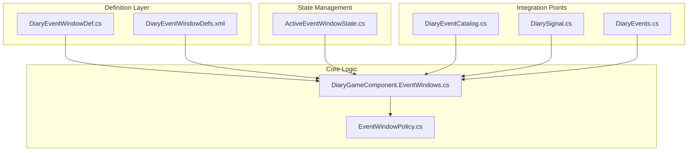
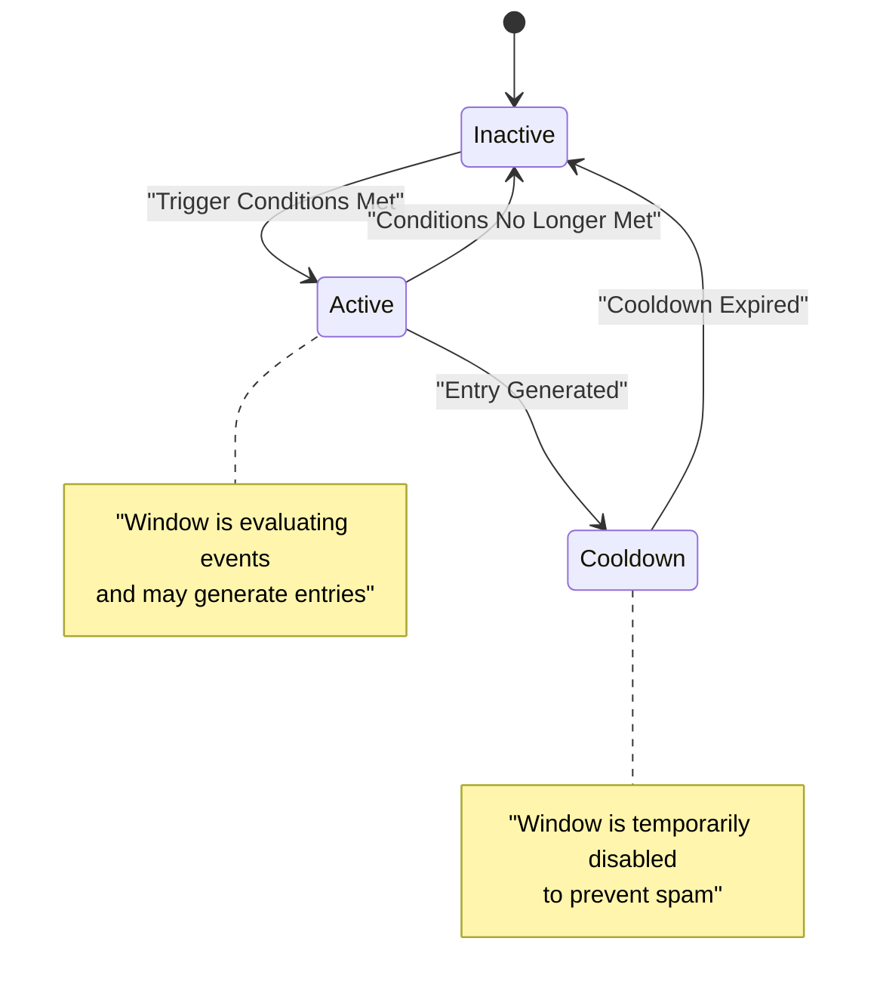
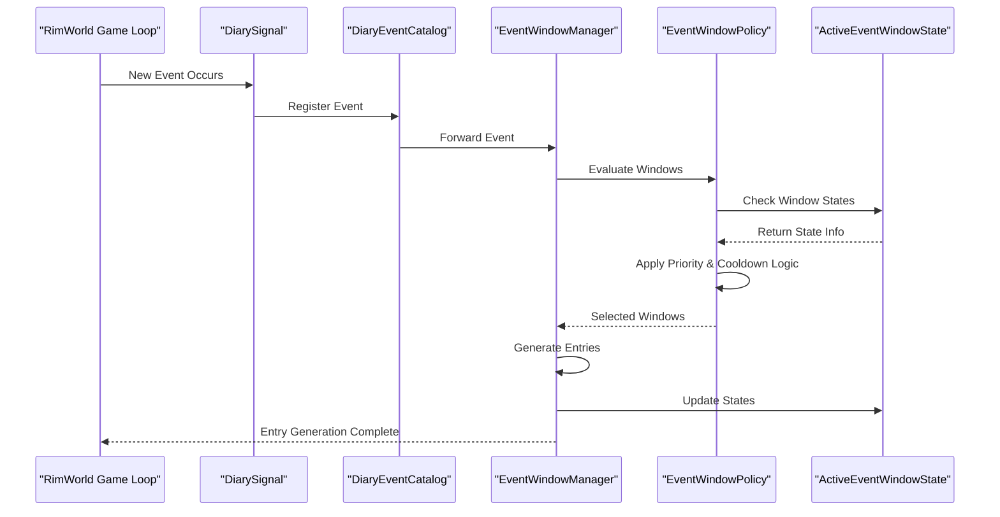
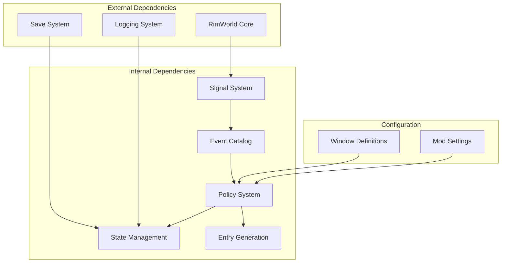

# Event Windows

## Table of Contents
1. [Introduction](#introduction)
2. [Project Structure](#project-structure)
3. [Core Components](#core-components)
4. [Architecture Overview](#architecture-overview)
5. [Detailed Component Analysis](#detailed-component-analysis)
6. [Dependency Analysis](#dependency-analysis)
7. [Performance Considerations](#performance-considerations)
8. [Troubleshooting Guide](#troubleshooting-guide)
9. [Conclusion](#conclusion)

## Introduction

The Event Window system is a sophisticated scheduling mechanism that controls when and how diary entries are generated within the Pawn Diary mod. This system acts as a gatekeeper between incoming game events and diary entry creation, implementing intelligent filtering, cooldown management, and priority-based selection to ensure meaningful and non-repetitive narrative content.

The event window system addresses several critical challenges in procedural narrative generation:
- **Event Throttling**: Prevents overwhelming players with too many diary entries from high-frequency events
- **Contextual Relevance**: Ensures diary entries are generated at appropriate times and contexts
- **Priority Management**: Handles competing events by selecting the most narratively significant ones
- **Cooldown Enforcement**: Implements recovery periods to avoid repetitive or spammy content
- **Conditional Activation**: Supports complex logic for determining when windows should be active

## Project Structure

The event window system is distributed across multiple architectural layers, following a clean separation of concerns:

**Diagram sources**
- [DiaryEventWindowDef.cs](../../../../../Source/Defs/DiaryEventWindowDef.cs)
- [DiaryEventWindowDefs.xml](../../../../../1.6/Defs/DiaryEventWindowDefs.xml)
- [ActiveEventWindowState.cs](../../../../../Source/Models/ActiveEventWindowState.cs)
- [DiaryGameComponent.EventWindows.cs](../../../../../Source/Core/DiaryGameComponent.EventWindows.cs)
- [EventWindowPolicy.cs](../../../../../Source/Pipeline/EventWindowPolicy.cs)
- [DiaryEventCatalog.cs](../../../../../Source/Capture/Catalog/DiaryEventCatalog.cs)
- [DiarySignal.cs](../../../../../Source/Ingestion/DiarySignal.cs)
- [DiaryEvents.cs](../../../../../Source/Ingestion/DiaryEvents.cs)

**Section sources**
- [DiaryGameComponent.EventWindows.cs](../../../../../Source/Core/DiaryGameComponent.EventWindows.cs)
- [DiaryEventWindowDef.cs](../../../../../Source/Defs/DiaryEventWindowDef.cs)
- [EventWindowPolicy.cs](../../../../../Source/Pipeline/EventWindowPolicy.cs)
- [ActiveEventWindowState.cs](../../../../../Source/Models/ActiveEventWindowState.cs)

## Core Components

### Event Window Definition System

The foundation of the event window system lies in its definition architecture, which allows for flexible configuration through both code and data-driven approaches.

#### Key Definition Types

| Component | Purpose | Configuration Method |
|-----------|---------|---------------------|
| `DiaryEventWindowDef` | Base class for all window definitions | Code-based inheritance |
| `DiaryEventWindowDefs.xml` | Data-driven window configurations | XML definition files |
| `ActiveEventWindowState` | Runtime state tracking | Automatic lifecycle management |

#### Window Definition Properties

The system supports various properties for configuring window behavior:

- **Time-based constraints**: Specific time periods when windows are active
- **Event type filters**: Which types of events can trigger the window
- **Cooldown periods**: Minimum time between consecutive activations
- **Priority levels**: Relative importance compared to other windows
- **Conditional logic**: Complex boolean expressions for activation criteria
- **Scope limitations**: Whether windows apply to specific pawns or global scope

**Section sources**
- [DiaryEventWindowDef.cs](../../../../../Source/Defs/DiaryEventWindowDef.cs)
- [DiaryEventWindowDefs.xml](../../../../../1.6/Defs/DiaryEventWindowDefs.xml)
- [ActiveEventWindowState.cs](../../../../../Source/Models/ActiveEventWindowState.cs)

### State Management Architecture

The event window system maintains comprehensive state information to track window lifecycles, cooldowns, and activation history.

#### State Tracking Mechanisms

**Diagram sources**
- [ActiveEventWindowState.cs](../../../../../Source/Models/ActiveEventWindowState.cs)

#### State Persistence

The system implements robust state persistence to maintain window behavior across save/load cycles:

- **Serialized state**: All window states are saved with game saves
- **Migration support**: State format evolution handled gracefully
- **Recovery mechanisms**: Corrupted states are reset safely
- **Validation**: State integrity checked during load operations

**Section sources**
- [ActiveEventWindowState.cs](../../../../../Source/Models/ActiveEventWindowState.cs)

## Architecture Overview

The event window system follows a layered architecture pattern with clear separation between definition, evaluation, and execution phases.

**Diagram sources**
- [DiaryGameComponent.EventWindows.cs](../../../../../Source/Core/DiaryGameComponent.EventWindows.cs)
- [EventWindowPolicy.cs](../../../../../Source/Pipeline/EventWindowPolicy.cs)
- [DiaryEventCatalog.cs](../../../../../Source/Capture/Catalog/DiaryEventCatalog.cs)
- [DiarySignal.cs](../../../../../Source/Ingestion/DiarySignal.cs)

### Event Processing Pipeline

The event processing pipeline implements a sophisticated filtering and selection mechanism:

1. **Event Reception**: Events are captured through the signal system
2. **Window Matching**: Events are matched against configured window definitions
3. **Priority Resolution**: Multiple matching windows compete for activation
4. **Cooldown Validation**: Previously activated windows check cooldown status
5. **Conditional Evaluation**: Complex conditions determine final activation
6. **Entry Generation**: Selected windows generate diary entries
7. **State Updates**: Window states are updated for future evaluations

**Section sources**
- [DiaryGameComponent.EventWindows.cs](../../../../../Source/Core/DiaryGameComponent.EventWindows.cs)
- [EventWindowPolicy.cs](../../../../../Source/Pipeline/EventWindowPolicy.cs)

## Detailed Component Analysis

### Built-in Window Types

The system provides several built-in window types designed to handle common narrative scenarios:

#### Time-Based Windows

Time-based windows activate during specific periods, enabling contextual diary entries:

- **Daily Reflection Windows**: Triggered at day boundaries for reflective content
- **Seasonal Windows**: Activate during specific seasons or weather conditions
- **Age-Based Windows**: Respond to pawn aging milestones
- **Time-of-Day Windows**: Context-sensitive entries based on game time

#### Event-Driven Windows

Event-driven windows respond to specific game events:

- **Death Windows**: Handle character death and memorialization
- **Birth Windows**: Manage new pawn arrivals and family formation
- **Relationship Windows**: Track relationship changes and milestones
- **Achievement Windows**: Celebrate significant accomplishments

#### Composite Window Logic

Advanced windows combine multiple conditions using logical operators:

- **AND Logic**: Multiple conditions must be true simultaneously
- **OR Logic**: Any condition being true activates the window
- **NOT Logic**: Negation of conditions for exclusion logic
- **Weighted Scoring**: Complex scoring systems for priority resolution

**Section sources**
- [DiaryEventWindowDef.cs](../../../../../Source/Defs/DiaryEventWindowDef.cs)
- [DiaryEventWindowDefs.xml](../../../../../1.6/Defs/DiaryEventWindowDefs.xml)

### Custom Window Creation

Developers can create custom window types by extending the base window definition class:

#### Creating Custom Window Definitions

Custom windows inherit from the base definition class and override key methods:

- **Condition Evaluation**: Implement custom logic for determining when windows should activate
- **Context Building**: Provide specialized context data for entry generation
- **Priority Calculation**: Define custom priority scoring algorithms
- **Cooldown Management**: Implement specialized cooldown behaviors

#### Window Registration Process

Custom windows must be properly registered with the system:

1. **Definition Creation**: Create the window definition class
2. **XML Configuration**: Add XML definition for runtime instantiation
3. **Registration**: Ensure proper registration during mod initialization
4. **Testing**: Validate behavior through unit tests and integration testing

**Section sources**
- [DiaryEventWindowDef.cs](../../../../../Source/Defs/DiaryEventWindowDef.cs)

### Conditional Activation Rules

The conditional activation system supports sophisticated boolean logic for window control:

#### Condition Types

| Condition Type | Description | Example Use Case |
|---------------|-------------|------------------|
| **Pawn Conditions** | Pawn-specific state checks | Health, mood, traits |
| **Colony Conditions** | Colony-wide state checks | Population, resources |
| **Temporal Conditions** | Time-based checks | Season, time of day |
| **Event Conditions** | Recent event history checks | Death frequency, birth rate |
| **Relationship Conditions** | Social relationship checks | Marriage, friendship |
| **Location Conditions** | Geographic checks | Biome, building proximity |

#### Logical Operators

The system supports standard logical operators for combining conditions:

- **Conjunction (AND)**: All conditions must be satisfied
- **Disjunction (OR)**: At least one condition must be satisfied
- **Negation (NOT)**: Inverts the result of a condition
- **Weighted Combinations**: Conditions with different importance weights

**Section sources**
- [EventWindowPolicy.cs](../../../../../Source/Pipeline/EventWindowPolicy.cs)

## Dependency Analysis

The event window system has well-defined dependencies and integration points throughout the mod architecture:

**Diagram sources**
- [DiaryGameComponent.EventWindows.cs](../../../../../Source/Core/DiaryGameComponent.EventWindows.cs)
- [EventWindowPolicy.cs](../../../../../Source/Pipeline/EventWindowPolicy.cs)

### Integration Points

#### Signal System Integration

The event window system integrates deeply with the mod's signal infrastructure:

- **Event Subscription**: Windows subscribe to relevant game signals
- **Event Filtering**: Signals are filtered before reaching window evaluators
- **Batch Processing**: High-frequency signals are batched for efficiency
- **Error Isolation**: Signal processing errors don't crash the window system

#### State Persistence Integration

State management integrates with RimWorld's save system:

- **Serialization**: Window states serialize to save files
- **Version Migration**: State formats evolve without breaking saves
- **Validation**: Loaded states are validated for integrity
- **Recovery**: Corrupted states are automatically recovered

**Section sources**
- [DiaryGameComponent.EventWindows.cs](../../../../../Source/Core/DiaryGameComponent.EventWindows.cs)
- [ActiveEventWindowState.cs](../../../../../Source/Models/ActiveEventWindowState.cs)

## Performance Considerations

The event window system is designed with performance as a primary concern, especially given the potential for high-frequency events in RimWorld gameplay.

### Optimization Strategies

#### Event Batching

High-frequency events are batched to reduce processing overhead:

- **Time-based Batching**: Events within short time windows are grouped
- **Type-based Batching**: Similar event types are processed together
- **Priority-based Batching**: High-priority events are processed separately
- **Resource-aware Batching**: Processing adapts to available CPU resources

#### State Caching

Window state calculations are cached to avoid redundant computations:

- **Condition Result Caching**: Boolean condition results are cached
- **Priority Score Caching**: Window priority scores are memoized
- **Cooldown Timer Caching**: Remaining cooldown times are tracked efficiently
- **Context Cache**: Frequently accessed context data is cached

#### Lazy Evaluation

Complex condition evaluations use lazy evaluation patterns:

- **Short-circuit Evaluation**: Logical expressions evaluate left-to-right
- **Early Termination**: Evaluations stop when outcome is determined
- **Deferred Computation**: Expensive calculations are deferred until needed
- **Incremental Updates**: State updates are incremental rather than full recalculation

### Memory Management

The system implements careful memory management to prevent leaks and excessive allocation:

- **Object Pooling**: Frequently created objects are pooled
- **Weak References**: Long-lived references use weak references where possible
- **Garbage Collection Awareness**: Allocation patterns minimize GC pressure
- **Memory Pressure Handling**: System adapts behavior under memory pressure

**Section sources**
- [DiaryGameComponent.EventWindows.cs](../../../../../Source/Core/DiaryGameComponent.EventWindows.cs)
- [EventWindowPolicy.cs](../../../../../Source/Pipeline/EventWindowPolicy.cs)

## Troubleshooting Guide

### Common Issues and Solutions

#### Window Not Activating

**Symptoms**: Expected diary entries are not being generated despite triggering events.

**Diagnostic Steps**:
1. Check window definition syntax and configuration
2. Verify condition logic evaluates as expected
3. Inspect cooldown timers and activation history
4. Review priority settings relative to other windows

**Common Causes**:
- Incorrect condition syntax or logic errors
- Overly restrictive cooldown periods
- Low priority causing windows to lose out to higher-priority alternatives
- Missing required context data for condition evaluation

#### Excessive Diary Entries

**Symptoms**: Too many diary entries are being generated, overwhelming the player.

**Diagnostic Steps**:
1. Review cooldown settings for affected windows
2. Check priority conflicts between multiple windows
3. Analyze event frequency and batching effectiveness
4. Inspect condition specificity and selectivity

**Common Causes**:
- Insufficient cooldown periods
- Overlapping window definitions with similar triggers
- Missing condition specificity leading to false positives
- Inadequate priority differentiation

#### Performance Issues

**Symptoms**: Game lag or stuttering during event processing.

**Diagnostic Steps**:
1. Monitor CPU usage during event-heavy periods
2. Check for excessive object allocations
3. Review condition evaluation complexity
4. Analyze state update frequency and scope

**Common Causes**:
- Complex condition logic with expensive operations
- Large numbers of active windows with frequent evaluations
- Inefficient state update algorithms
- Memory pressure from excessive caching

### Debugging Tools and Techniques

#### Logging and Diagnostics

The system provides comprehensive logging for debugging window behavior:

- **Activation Logs**: Detailed records of window activation attempts
- **Condition Evaluation Logs**: Step-by-step condition evaluation traces
- **Performance Metrics**: Timing and resource usage statistics
- **State Change Logs**: Complete audit trail of state modifications

#### Development Utilities

Several development utilities assist in window system debugging:

- **Window Inspector**: Interactive tool for examining window states
- **Condition Tester**: Standalone tool for testing condition logic
- **Performance Profiler**: Detailed performance analysis tools
- **Simulation Mode**: Controlled environment for testing window behavior

**Section sources**
- [DiaryGameComponent.EventWindows.cs](../../../../../Source/Core/DiaryGameComponent.EventWindows.cs)

## Conclusion

The Event Window system represents a sophisticated and extensible framework for controlling diary entry generation in the Pawn Diary mod. Through its layered architecture, comprehensive state management, and performance optimizations, it successfully balances narrative richness with gameplay practicality.

Key strengths of the system include:

- **Flexibility**: Extensive customization options through both code and data-driven approaches
- **Performance**: Careful optimization for high-frequency event scenarios
- **Reliability**: Robust error handling and state recovery mechanisms
- **Extensibility**: Clean extension points for custom window types and logic

For developers working with the event window system, the recommended approach is to start with existing window definitions as templates, leverage the provided debugging tools for validation, and follow the established patterns for custom implementations. The system's design encourages modular, testable components that can be developed and maintained independently while contributing to cohesive overall behavior.

Future enhancements could focus on improved visualization tools for window behavior, more sophisticated machine learning-based prioritization, and deeper integration with external narrative analysis systems.
