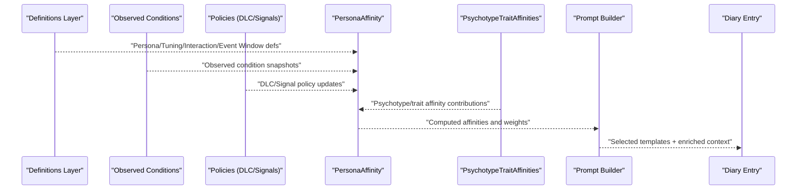
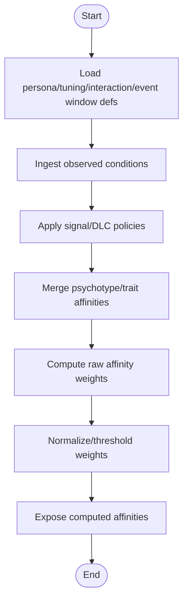
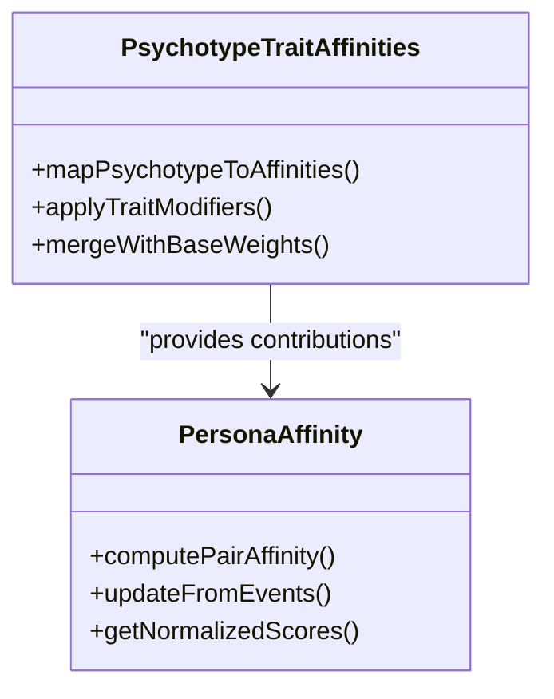
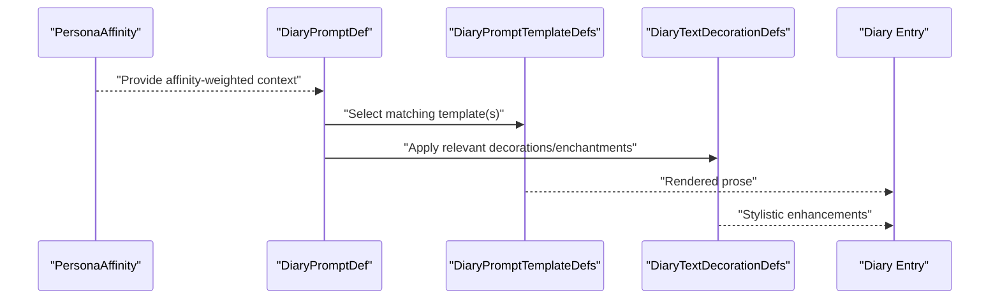
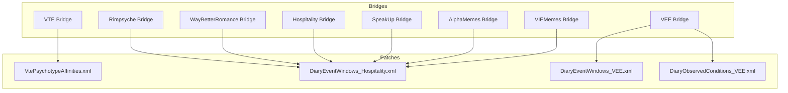
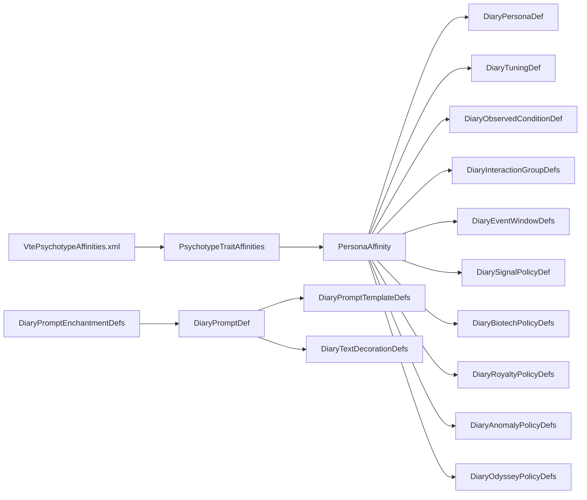

# Affinity & Relationship System

- [PersonaAffinity.cs](../../../../../../Source/Generation/PersonaAffinity.cs)
- [PsychotypeTraitAffinities.cs](../../../../../../Source/Pipeline/PsychotypeTraitAffinities.cs)
- [DiaryPromptDef.cs](../../../../../../Source/Defs/DiaryPromptDef.cs)
- [DiaryPersonaDef.cs](../../../../../../Source/Defs/DiaryPersonaDef.cs)
- [DiaryContextDetailDef.cs](../../../../../../Source/Defs/DiaryContextDetailDef.cs)
- [DiaryTuningDef.cs](../../../../../../Source/Defs/DiaryTuningDef.cs)
- [DiaryMemoryTuningDef.cs](../../../../../../Source/Defs/DiaryMemoryTuningDef.cs)
- [DiaryObservedConditionDef.cs](../../../../../../Source/Defs/DiaryObservedConditionDef.cs)
- [DiaryInteractionGroupDefs.cs](../../../../../../Source/Defs/InteractionGroups.cs)
- DiaryEventWindowDefs.cs
- DiaryNarrativeContinuityDefs.cs
- [DiarySignalPolicyDef.cs](../../../../../../Source/Defs/DiarySignalPolicyDef.cs)
- DiaryBiotechPolicyDefs.cs
- DiaryRoyaltyPolicyDefs.cs
- DiaryAnomalyPolicyDefs.cs
- DiaryOdysseyPolicyDefs.cs
- DiaryPromptTemplateDefs.cs
- DiaryPromptEnchantmentDefs.cs
- DiaryTextDecorationDefs.cs
- [DiaryUiStyleDef.cs](../../../../../../Source/Defs/DiaryUiStyleDef.cs)
- [VtePsychotypeAffinities.xml](../../../../../../1.6/Patches/VtePsychotypeAffinities.xml)
- DiaryCompat_DiaryCompat_Rimpsyche.xml
- DiaryCompat_DiaryCompat_VEE.xml
- DiaryCompat_DiaryCompat_WayBetterRomance.xml
- DiaryCompat_DiaryCompat_Hospitality.xml
- DiaryCompat_DiaryCompat_SpeakUp.xml
- DiaryCompat_DiaryCompat_AlphaMemes.xml
- DiaryCompat_DiaryCompat_VIEMemes.xml
- DiaryCompat_DiaryCompat_VTE.xml
- DiaryEventWindows_Hospitality.xml
- DiaryEventWindows_VEE.xml
- DiaryObservedConditions_VEE.xml
## Table of Contents
1. [Introduction](#introduction)
2. [Project Structure](#project-structure)
3. [Core Components](#core-components)
4. [Architecture Overview](#architecture-overview)
5. [Detailed Component Analysis](#detailed-component-analysis)
6. [Dependency Analysis](#dependency-analysis)
7. [Performance Considerations](#performance-considerations)
8. [Troubleshooting Guide](#troubleshooting-guide)
9. [Conclusion](#conclusion)
10. [Appendices](#appendices)

## Introduction
This document explains the affinity and relationship system used by personas to model character relationships, emotional connections, and social dynamics. It covers how affinities are defined, how weights are calculated, how relationships progress over time, and how they influence diary entry generation. It also documents integration points with psychotype systems, trait affinities, and external personality bridges, and provides practical guidance for building complex relationship networks, resolving conflicts, and optimizing content generation.

## Project Structure
The affinity and relationship system spans several layers:
- Definitions (XML): persona definitions, prompt templates, tuning, observed conditions, event windows, and compatibility patches.
- Core logic (C#): affinity computation, psychotype/trait affinity mapping, and context assembly for prompts.
- Integration (XML/C#): compatibility patches and bridge components that connect to external systems.

```mermaid
graph TB
subgraph "Definitions"
D1["DiaryPersonaDef"]
D2["DiaryPromptDef"]
D3["DiaryTuningDef"]
D4["DiaryMemoryTuningDef"]
D5["DiaryObservedConditionDef"]
D6["DiaryInteractionGroupDefs"]
D7["DiaryEventWindowDefs"]
D8["DiaryNarrativeContinuityDefs"]
D9["DiarySignalPolicyDef"]
D10["DiaryBiotechPolicyDefs"]
D11["DiaryRoyaltyPolicyDefs"]
D12["DiaryAnomalyPolicyDefs"]
D13["DiaryOdysseyPolicyDefs"]
D14["DiaryPromptTemplateDefs"]
D15["DiaryPromptEnchantmentDefs"]
D16["DiaryTextDecorationDefs"]
D17["DiaryUiStyleDef"]
end
subgraph "Core Logic"
C1["PersonaAffinity"]
C2["PsychotypeTraitAffinities"]
end
subgraph "Compatibility Patches"
P1["VtePsychotypeAffinities.xml"]
P2["DiaryCompat_*"]
P3["DiaryEventWindows_*"]
P4["DiaryObservedConditions_*"]
end
D1 --> C1
D2 --> C1
D3 --> C1
D4 --> C1
D5 --> C1
D6 --> C1
D7 --> C1
D8 --> C1
D9 --> C1
D10 --> C1
D11 --> C1
D12 --> C1
D13 --> C1
D14 --> C1
D15 --> C1
D16 --> C1
D17 --> C1
C2 --> C1
P1 --> C2
P2 --> C1
P3 --> C1
P4 --> C1
```

**Diagram sources**
- [PersonaAffinity.cs](../../../../../../Source/Generation/PersonaAffinity.cs)
- [PsychotypeTraitAffinities.cs](../../../../../../Source/Pipeline/PsychotypeTraitAffinities.cs)
- [DiaryPersonaDef.cs](../../../../../../Source/Defs/DiaryPersonaDef.cs)
- [DiaryPromptDef.cs](../../../../../../Source/Defs/DiaryPromptDef.cs)
- [DiaryTuningDef.cs](../../../../../../Source/Defs/DiaryTuningDef.cs)
- [DiaryMemoryTuningDef.cs](../../../../../../Source/Defs/DiaryMemoryTuningDef.cs)
- [DiaryObservedConditionDef.cs](../../../../../../Source/Defs/DiaryObservedConditionDef.cs)
- [DiaryInteractionGroupDefs.cs](../../../../../../Source/Defs/InteractionGroups.cs)
- DiaryEventWindowDefs.cs
- DiaryNarrativeContinuityDefs.cs
- [DiarySignalPolicyDef.cs](../../../../../../Source/Defs/DiarySignalPolicyDef.cs)
- DiaryBiotechPolicyDefs.cs
- DiaryRoyaltyPolicyDefs.cs
- DiaryAnomalyPolicyDefs.cs
- DiaryOdysseyPolicyDefs.cs
- DiaryPromptTemplateDefs.cs
- DiaryPromptEnchantmentDefs.cs
- DiaryTextDecorationDefs.cs
- [DiaryUiStyleDef.cs](../../../../../../Source/Defs/DiaryUiStyleDef.cs)
- [VtePsychotypeAffinities.xml](../../../../../../1.6/Patches/VtePsychotypeAffinities.xml)
- DiaryCompat_DiaryCompat_Rimpsyche.xml
- DiaryCompat_DiaryCompat_VEE.xml
- DiaryCompat_DiaryCompat_WayBetterRomance.xml
- DiaryCompat_DiaryCompat_Hospitality.xml
- DiaryCompat_DiaryCompat_SpeakUp.xml
- DiaryCompat_DiaryCompat_AlphaMemes.xml
- DiaryCompat_DiaryCompat_VIEMemes.xml
- DiaryCompat_DiaryCompat_VTE.xml
- DiaryEventWindows_Hospitality.xml
- DiaryEventWindows_VEE.xml
- DiaryObservedConditions_VEE.xml

**Section sources**
- [PersonaAffinity.cs](../../../../../../Source/Generation/PersonaAffinity.cs)
- [PsychotypeTraitAffinities.cs](../../../../../../Source/Pipeline/PsychotypeTraitAffinities.cs)
- [DiaryPersonaDef.cs](../../../../../../Source/Defs/DiaryPersonaDef.cs)
- [DiaryPromptDef.cs](../../../../../../Source/Defs/DiaryPromptDef.cs)
- [DiaryTuningDef.cs](../../../../../../Source/Defs/DiaryTuningDef.cs)
- [DiaryMemoryTuningDef.cs](../../../../../../Source/Defs/DiaryMemoryTuningDef.cs)
- [DiaryObservedConditionDef.cs](../../../../../../Source/Defs/DiaryObservedConditionDef.cs)
- [DiaryInteractionGroupDefs.cs](../../../../../../Source/Defs/InteractionGroups.cs)
- DiaryEventWindowDefs.cs
- DiaryNarrativeContinuityDefs.cs
- [DiarySignalPolicyDef.cs](../../../../../../Source/Defs/DiarySignalPolicyDef.cs)
- DiaryBiotechPolicyDefs.cs
- DiaryRoyaltyPolicyDefs.cs
- DiaryAnomalyPolicyDefs.cs
- DiaryOdysseyPolicyDefs.cs
- DiaryPromptTemplateDefs.cs
- DiaryPromptEnchantmentDefs.cs
- DiaryTextDecorationDefs.cs
- [DiaryUiStyleDef.cs](../../../../../../Source/Defs/DiaryUiStyleDef.cs)
- [VtePsychotypeAffinities.xml](../../../../../../1.6/Patches/VtePsychotypeAffinities.xml)
- DiaryCompat_DiaryCompat_Rimpsyche.xml
- DiaryCompat_DiaryCompat_VEE.xml
- DiaryCompat_DiaryCompat_WayBetterRomance.xml
- DiaryCompat_DiaryCompat_Hospitality.xml
- DiaryCompat_DiaryCompat_SpeakUp.xml
- DiaryCompat_DiaryCompat_AlphaMemes.xml
- DiaryCompat_DiaryCompat_VIEMemes.xml
- DiaryCompat_DiaryCompat_VTE.xml
- DiaryEventWindows_Hospitality.xml
- DiaryEventWindows_VEE.xml
- DiaryObservedConditions_VEE.xml

## Core Components
- PersonaAffinity: Central runtime component responsible for computing and managing affinities between pawns/personas. It aggregates inputs from definitions, observed conditions, interactions, and policies to produce weighted relationship scores.
- PsychotypeTraitAffinities: Bridges psychotypes and traits into affinity contributions, enabling personality-driven relationship shaping.
- Definition layer: XML-based definitions for personas, prompts, tuning, memory tuning, observed conditions, interaction groups, event windows, narrative continuity, signals, DLC-specific policies, prompt templates/enchantments, text decorations, and UI style. These define the vocabulary and rules that drive affinity behavior and its impact on diary entries.

Key responsibilities:
- Define and store affinity types and base weights.
- Compute dynamic adjustments based on events, observations, and policy overrides.
- Provide normalized or thresholded outputs used by prompt builders to select templates and enrich context.
- Integrate with psychotype/trait systems and external bridges via compatibility patches.

**Section sources**
- [PersonaAffinity.cs](../../../../../../Source/Generation/PersonaAffinity.cs)
- [PsychotypeTraitAffinities.cs](../../../../../../Source/Pipeline/PsychotypeTraitAffinities.cs)
- [DiaryPersonaDef.cs](../../../../../../Source/Defs/DiaryPersonaDef.cs)
- [DiaryPromptDef.cs](../../../../../../Source/Defs/DiaryPromptDef.cs)
- [DiaryTuningDef.cs](../../../../../../Source/Defs/DiaryTuningDef.cs)
- [DiaryMemoryTuningDef.cs](../../../../../../Source/Defs/DiaryMemoryTuningDef.cs)
- [DiaryObservedConditionDef.cs](../../../../../../Source/Defs/DiaryObservedConditionDef.cs)
- [DiaryInteractionGroupDefs.cs](../../../../../../Source/Defs/InteractionGroups.cs)
- DiaryEventWindowDefs.cs
- DiaryNarrativeContinuityDefs.cs
- [DiarySignalPolicyDef.cs](../../../../../../Source/Defs/DiarySignalPolicyDef.cs)
- DiaryBiotechPolicyDefs.cs
- DiaryRoyaltyPolicyDefs.cs
- DiaryAnomalyPolicyDefs.cs
- DiaryOdysseyPolicyDefs.cs
- DiaryPromptTemplateDefs.cs
- DiaryPromptEnchantmentDefs.cs
- DiaryTextDecorationDefs.cs
- [DiaryUiStyleDef.cs](../../../../../../Source/Defs/DiaryUiStyleDef.cs)

## Architecture Overview
The affinity system sits at the intersection of definitions, runtime computation, and prompt generation. It consumes:
- Static configuration from persona and tuning definitions.
- Dynamic signals from observed conditions, interactions, and DLC policies.
- Personality mappings from psychotype/trait affinities and compatibility patches.

It produces:
- Weighted relationship scores per pair or group.
- Contextual cues for prompt selection and template variation.
- Narrative continuity markers that influence future entries.

**Diagram sources**
- [PersonaAffinity.cs](../../../../../../Source/Generation/PersonaAffinity.cs)
- [PsychotypeTraitAffinities.cs](../../../../../../Source/Pipeline/PsychotypeTraitAffinities.cs)
- [DiaryPersonaDef.cs](../../../../../../Source/Defs/DiaryPersonaDef.cs)
- [DiaryTuningDef.cs](../../../../../../Source/Defs/DiaryTuningDef.cs)
- [DiaryObservedConditionDef.cs](../../../../../../Source/Defs/DiaryObservedConditionDef.cs)
- [DiaryInteractionGroupDefs.cs](../../../../../../Source/Defs/InteractionGroups.cs)
- DiaryEventWindowDefs.cs
- [DiarySignalPolicyDef.cs](../../../../../../Source/Defs/DiarySignalPolicyDef.cs)
- DiaryBiotechPolicyDefs.cs
- DiaryRoyaltyPolicyDefs.cs
- DiaryAnomalyPolicyDefs.cs
- DiaryOdysseyPolicyDefs.cs
- DiaryPromptTemplateDefs.cs

## Detailed Component Analysis

### PersonaAffinity: Computation and Management
Responsibilities:
- Maintain per-pair or per-group affinity state.
- Apply base weights from definitions and adjust for recent events and ongoing conditions.
- Normalize or threshold values for downstream use in prompt selection.
- Expose APIs for query and update during gameplay loops.

**Diagram sources**
- [PersonaAffinity.cs](../../../../../../Source/Generation/PersonaAffinity.cs)
- [DiaryPersonaDef.cs](../../../../../../Source/Defs/DiaryPersonaDef.cs)
- [DiaryTuningDef.cs](../../../../../../Source/Defs/DiaryTuningDef.cs)
- [DiaryObservedConditionDef.cs](../../../../../../Source/Defs/DiaryObservedConditionDef.cs)
- [DiaryInteractionGroupDefs.cs](../../../../../../Source/Defs/InteractionGroups.cs)
- DiaryEventWindowDefs.cs
- [DiarySignalPolicyDef.cs](../../../../../../Source/Defs/DiarySignalPolicyDef.cs)
- DiaryBiotechPolicyDefs.cs
- DiaryRoyaltyPolicyDefs.cs
- DiaryAnomalyPolicyDefs.cs
- DiaryOdysseyPolicyDefs.cs

**Section sources**
- [PersonaAffinity.cs](../../../../../../Source/Generation/PersonaAffinity.cs)
- [DiaryPersonaDef.cs](../../../../../../Source/Defs/DiaryPersonaDef.cs)
- [DiaryTuningDef.cs](../../../../../../Source/Defs/DiaryTuningDef.cs)
- [DiaryObservedConditionDef.cs](../../../../../../Source/Defs/DiaryObservedConditionDef.cs)
- [DiaryInteractionGroupDefs.cs](../../../../../../Source/Defs/InteractionGroups.cs)
- DiaryEventWindowDefs.cs
- [DiarySignalPolicyDef.cs](../../../../../../Source/Defs/DiarySignalPolicyDef.cs)
- DiaryBiotechPolicyDefs.cs
- DiaryRoyaltyPolicyDefs.cs
- DiaryAnomalyPolicyDefs.cs
- DiaryOdysseyPolicyDefs.cs

### PsychotypeTraitAffinities: Personality-to-Affinity Mapping
Responsibilities:
- Map psychotype categories and trait profiles to affinity modifiers.
- Allow compatibility patches to extend or override mappings.
- Provide consistent contribution vectors to PersonaAffinity.

**Diagram sources**
- [PsychotypeTraitAffinities.cs](../../../../../../Source/Pipeline/PsychotypeTraitAffinities.cs)
- [PersonaAffinity.cs](../../../../../../Source/Generation/PersonaAffinity.cs)
- [VtePsychotypeAffinities.xml](../../../../../../1.6/Patches/VtePsychotypeAffinities.xml)

**Section sources**
- [PsychotypeTraitAffinities.cs](../../../../../../Source/Pipeline/PsychotypeTraitAffinities.cs)
- [VtePsychotypeAffinities.xml](../../../../../../1.6/Patches/VtePsychotypeAffinities.xml)

### Prompt Generation Impact
Affinity scores influence:
- Template selection within prompt definitions.
- Context detail injection for richer narrative.
- Enchantment and decoration application for stylistic variance.

**Diagram sources**
- [PersonaAffinity.cs](../../../../../../Source/Generation/PersonaAffinity.cs)
- [DiaryPromptDef.cs](../../../../../../Source/Defs/DiaryPromptDef.cs)
- DiaryPromptTemplateDefs.cs
- DiaryTextDecorationDefs.cs

**Section sources**
- [DiaryPromptDef.cs](../../../../../../Source/Defs/DiaryPromptDef.cs)
- DiaryPromptTemplateDefs.cs
- DiaryTextDecorationDefs.cs
- DiaryPromptEnchantmentDefs.cs

### Compatibility and External Bridges
Compatibility patches and bridges integrate external personality models and mod systems:
- VTE psychotype affinities patch.
- Compat modules for Rimpsyche, VEE, WayBetterRomance, Hospitality, SpeakUp, AlphaMemes, VIEMemes, and VTE.
- Event window and observed condition extensions for specific mods.

**Diagram sources**
- [VtePsychotypeAffinities.xml](../../../../../../1.6/Patches/VtePsychotypeAffinities.xml)
- DiaryCompat_DiaryCompat_Rimpsyche.xml
- DiaryCompat_DiaryCompat_VEE.xml
- DiaryCompat_DiaryCompat_WayBetterRomance.xml
- DiaryCompat_DiaryCompat_Hospitality.xml
- DiaryCompat_DiaryCompat_SpeakUp.xml
- DiaryCompat_DiaryCompat_AlphaMemes.xml
- DiaryCompat_DiaryCompat_VIEMemes.xml
- DiaryCompat_DiaryCompat_VTE.xml
- DiaryEventWindows_Hospitality.xml
- DiaryEventWindows_VEE.xml
- DiaryObservedConditions_VEE.xml

**Section sources**
- [VtePsychotypeAffinities.xml](../../../../../../1.6/Patches/VtePsychotypeAffinities.xml)
- DiaryCompat_DiaryCompat_Rimpsyche.xml
- DiaryCompat_DiaryCompat_VEE.xml
- DiaryCompat_DiaryCompat_WayBetterRomance.xml
- DiaryCompat_DiaryCompat_Hospitality.xml
- DiaryCompat_DiaryCompat_SpeakUp.xml
- DiaryCompat_DiaryCompat_AlphaMemes.xml
- DiaryCompat_DiaryCompat_VIEMemes.xml
- DiaryCompat_DiaryCompat_VTE.xml
- DiaryEventWindows_Hospitality.xml
- DiaryEventWindows_VEE.xml
- DiaryObservedConditions_VEE.xml

## Dependency Analysis
The affinity system depends on multiple definition layers and is influenced by compatibility patches. The following diagram highlights key dependencies:

**Diagram sources**
- [PersonaAffinity.cs](../../../../../../Source/Generation/PersonaAffinity.cs)
- [PsychotypeTraitAffinities.cs](../../../../../../Source/Pipeline/PsychotypeTraitAffinities.cs)
- [DiaryPersonaDef.cs](../../../../../../Source/Defs/DiaryPersonaDef.cs)
- [DiaryTuningDef.cs](../../../../../../Source/Defs/DiaryTuningDef.cs)
- [DiaryObservedConditionDef.cs](../../../../../../Source/Defs/DiaryObservedConditionDef.cs)
- [DiaryInteractionGroupDefs.cs](../../../../../../Source/Defs/InteractionGroups.cs)
- DiaryEventWindowDefs.cs
- [DiarySignalPolicyDef.cs](../../../../../../Source/Defs/DiarySignalPolicyDef.cs)
- DiaryBiotechPolicyDefs.cs
- DiaryRoyaltyPolicyDefs.cs
- DiaryAnomalyPolicyDefs.cs
- DiaryOdysseyPolicyDefs.cs
- [DiaryPromptDef.cs](../../../../../../Source/Defs/DiaryPromptDef.cs)
- DiaryPromptTemplateDefs.cs
- DiaryTextDecorationDefs.cs
- DiaryPromptEnchantmentDefs.cs
- [VtePsychotypeAffinities.xml](../../../../../../1.6/Patches/VtePsychotypeAffinities.xml)

**Section sources**
- [PersonaAffinity.cs](../../../../../../Source/Generation/PersonaAffinity.cs)
- [PsychotypeTraitAffinities.cs](../../../../../../Source/Pipeline/PsychotypeTraitAffinities.cs)
- [DiaryPersonaDef.cs](../../../../../../Source/Defs/DiaryPersonaDef.cs)
- [DiaryTuningDef.cs](../../../../../../Source/Defs/DiaryTuningDef.cs)
- [DiaryObservedConditionDef.cs](../../../../../../Source/Defs/DiaryObservedConditionDef.cs)
- [DiaryInteractionGroupDefs.cs](../../../../../../Source/Defs/InteractionGroups.cs)
- DiaryEventWindowDefs.cs
- [DiarySignalPolicyDef.cs](../../../../../../Source/Defs/DiarySignalPolicyDef.cs)
- DiaryBiotechPolicyDefs.cs
- DiaryRoyaltyPolicyDefs.cs
- DiaryAnomalyPolicyDefs.cs
- DiaryOdysseyPolicyDefs.cs
- [DiaryPromptDef.cs](../../../../../../Source/Defs/DiaryPromptDef.cs)
- DiaryPromptTemplateDefs.cs
- DiaryTextDecorationDefs.cs
- DiaryPromptEnchantmentDefs.cs
- [VtePsychotypeAffinities.xml](../../../../../../1.6/Patches/VtePsychotypeAffinities.xml)

## Performance Considerations
- Batch updates: Group affinity recalculations around major events to reduce churn.
- Cache normalization results: Avoid recomputing thresholds when underlying inputs have not changed.
- Scope queries: Limit affinity lookups to active pairs/groups relevant to current prompts.
- Defer heavy computations: Use lazy evaluation for rare or expensive operations.
- Monitor definition load times: Keep persona and tuning definitions concise and modular.

[No sources needed since this section provides general guidance]

## Troubleshooting Guide
Common issues and resolutions:
- Conflicting affinity sources: Ensure compatibility patches do not override intended defaults; review VTE psychotype affinities and other compat modules.
- Unexpected diary content: Verify prompt templates and enchantments align with desired affinity thresholds; check text decorations for unintended styling.
- Missing observed conditions: Confirm observed condition definitions and event windows are present and correctly patched for installed mods.
- Bridge integration gaps: Validate bridge modules are loaded and their IDs match expected configurations.

**Section sources**
- [VtePsychotypeAffinities.xml](../../../../../../1.6/Patches/VtePsychotypeAffinities.xml)
- DiaryCompat_DiaryCompat_Rimpsyche.xml
- DiaryCompat_DiaryCompat_VEE.xml
- DiaryCompat_DiaryCompat_WayBetterRomance.xml
- DiaryCompat_DiaryCompat_Hospitality.xml
- DiaryCompat_DiaryCompat_SpeakUp.xml
- DiaryCompat_DiaryCompat_AlphaMemes.xml
- DiaryCompat_DiaryCompat_VIEMemes.xml
- DiaryCompat_DiaryCompat_VTE.xml
- DiaryEventWindows_Hospitality.xml
- DiaryEventWindows_VEE.xml
- DiaryObservedConditions_VEE.xml

## Conclusion
The affinity and relationship system integrates static definitions, dynamic observations, and personality mappings to produce nuanced, relationship-aware diary entries. By carefully configuring persona definitions, tuning parameters, observed conditions, and compatibility patches, creators can craft rich social dynamics. Effective management involves balancing base weights, event-driven adjustments, and psychotype/trait influences while ensuring performance and coherence across mod integrations.

[No sources needed since this section summarizes without analyzing specific files]

## Appendices

### Practical Examples

- Setting up a complex relationship network:
  - Define persona pairs and baseline affinities in persona definitions.
  - Add interaction groups to cluster related behaviors.
  - Use event windows to scope when certain affinities should be considered.
  - Inject observed conditions to reflect ongoing states (e.g., tension, camaraderie).
  - Apply DLC policies to incorporate biotech, royalty, anomaly, or odyssey contexts.

- Managing affinity conflicts:
  - Establish precedence rules via tuning definitions.
  - Use compatibility patches to reconcile overlapping contributions.
  - Normalize scores to prevent extreme swings.

- Optimizing relationship-based content generation:
  - Cache normalized scores and recompute only on changes.
  - Select prompt templates based on clear thresholds.
  - Limit decoration/enchantment application to high-signal cases.

[No sources needed since this section provides general guidance]
