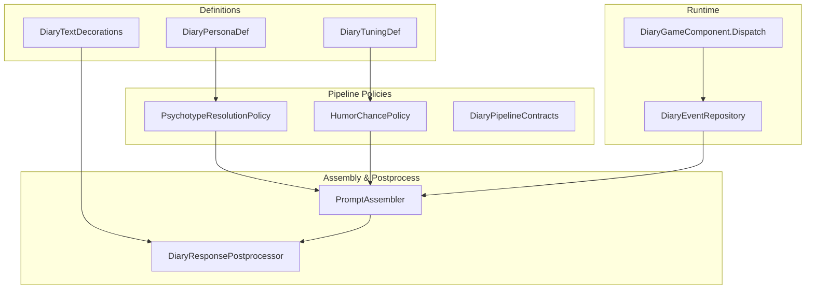
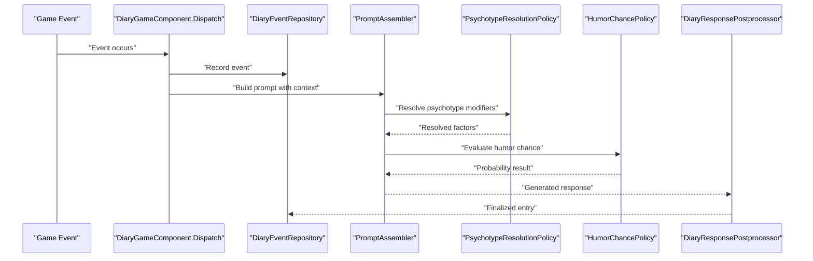
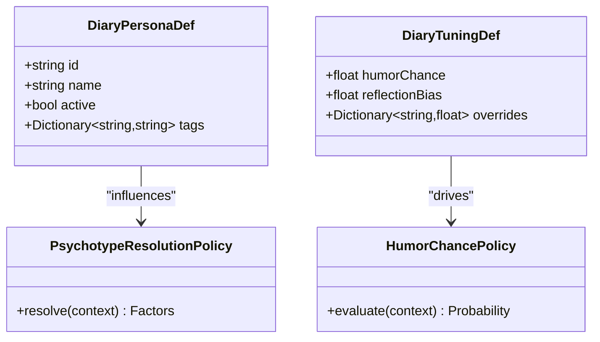
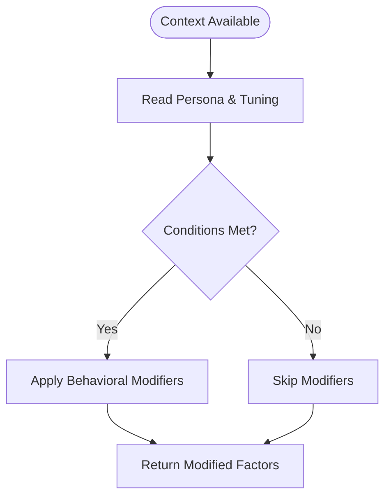
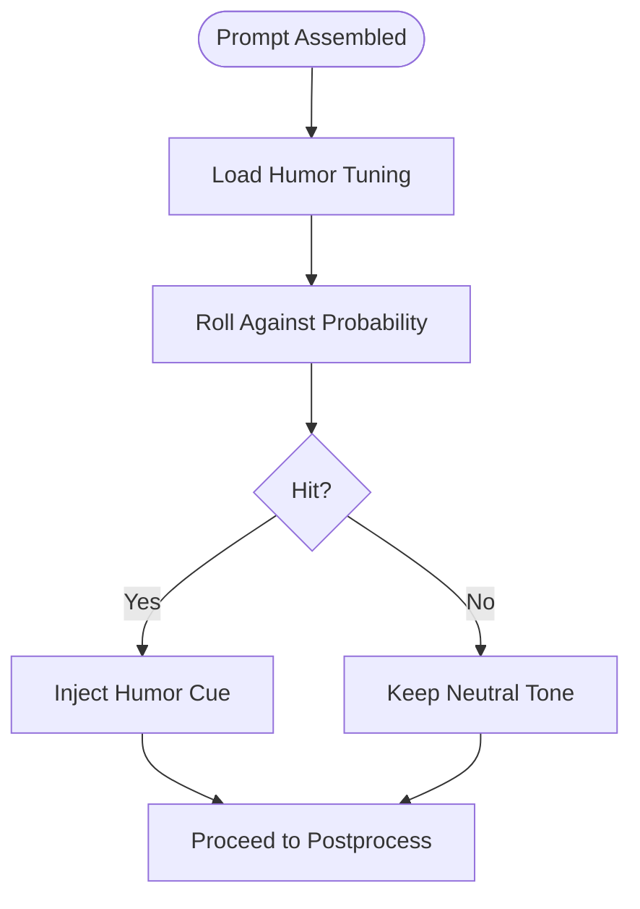
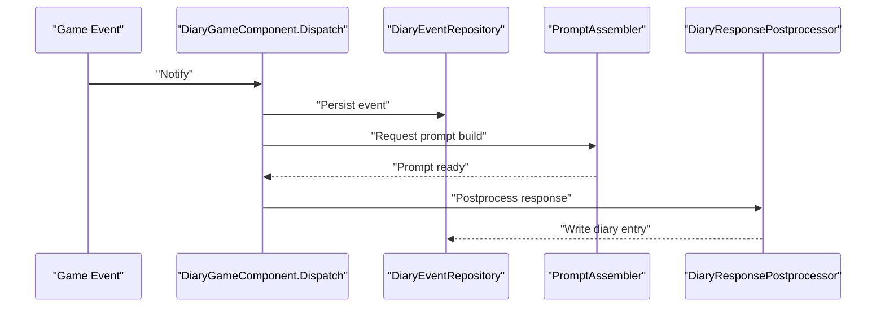
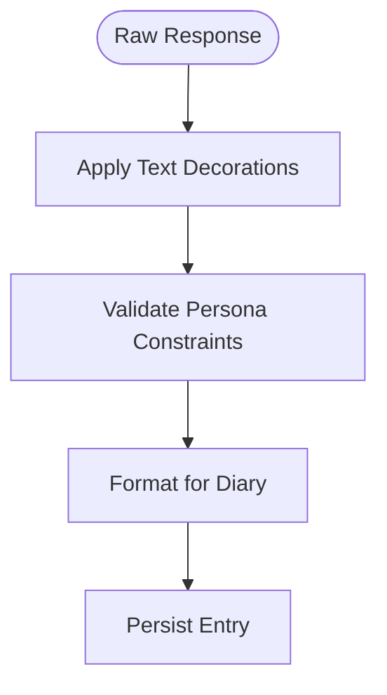
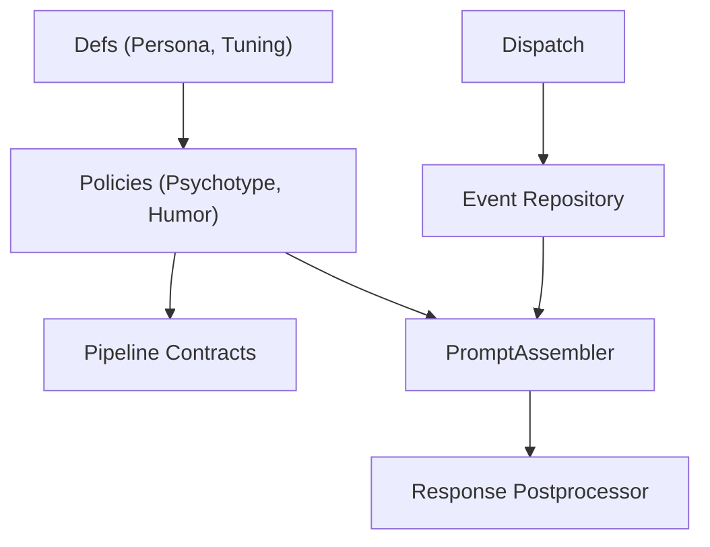

# Behavioral Patterns & Modifiers

## Table of Contents
1. [Introduction](#introduction)
2. [Project Structure](#project-structure)
3. [Core Components](#core-components)
4. [Architecture Overview](#architecture-overview)
5. [Detailed Component Analysis](#detailed-component-analysis)
6. [Dependency Analysis](#dependency-analysis)
7. [Performance Considerations](#performance-considerations)
8. [Troubleshooting Guide](#troubleshooting-guide)
9. [Conclusion](#conclusion)
10. [Appendices](#appendices)

## Introduction
This document explains how behavioral patterns and modifiers control persona actions and responses within the diary system. It covers:
- How behavioral rules are implemented using definitions, policies, and pipeline stages
- Conditional logic, probability weights, and context-dependent behaviors
- The interaction between behavioral patterns and event processing
- How behaviors influence diary entry creation and narrative flow
- Examples for creating custom behavioral rules
- Debugging behavior issues
- Performance optimization techniques for complex behavioral systems

## Project Structure
Behavioral patterns and modifiers are primarily defined via data-driven definitions and enforced through pipeline policies that participate in prompt assembly and response post-processing. Key areas include:
- Definitions for personas, tuning, and text decorations
- Pipeline policies for psychotype resolution, humor chance, and other behavioral modifiers
- Prompt assembly and response postprocessing that apply these modifiers to entries
- Event dispatch and repository integration that trigger behavioral evaluation

**Diagram sources**
- [DiaryPersonaDef.cs](../../../../../../Source/Defs/DiaryPersonaDef.cs)
- [DiaryTuningDef.cs](../../../../../../Source/Defs/DiaryTuningDef.cs)
- [PsychotypeResolutionPolicy.cs](../../../../../../Source/Pipeline/PsychotypeResolutionPolicy.cs)
- [HumorChancePolicy.cs](../../../../../../Source/Pipeline/HumorChancePolicy.cs)
- [PromptAssembler.cs](../../../../../../Source/Generation/PromptAssembler.cs)
- [DiaryResponsePostprocessor.cs](../../../../../../Source/Pipeline/DiaryResponsePostprocessor.cs)
- [DiaryTextDecorations.cs](../../../../../../Source/Pipeline/DiaryTextDecorations.cs)
- [DiaryGameComponent.Dispatch.cs](../../../../../../Source/Core/DiaryGameComponent.Dispatch.cs)
- [DiaryEventRepository.cs](../../../../../../Source/Core/DiaryEventRepository.cs)

**Section sources**
- [DiaryPersonaDef.cs](../../../../../../Source/Defs/DiaryPersonaDef.cs)
- [DiaryTuningDef.cs](../../../../../../Source/Defs/DiaryTuningDef.cs)
- [PsychotypeResolutionPolicy.cs](../../../../../../Source/Pipeline/PsychotypeResolutionPolicy.cs)
- [HumorChancePolicy.cs](../../../../../../Source/Pipeline/HumorChancePolicy.cs)
- [PromptAssembler.cs](../../../../../../Source/Generation/PromptAssembler.cs)
- [DiaryResponsePostprocessor.cs](../../../../../../Source/Pipeline/DiaryResponsePostprocessor.cs)
- [DiaryTextDecorations.cs](../../../../../../Source/Pipeline/DiaryTextDecorations.cs)
- [DiaryGameComponent.Dispatch.cs](../../../../../../Source/Core/DiaryGameComponent.Dispatch.cs)
- [DiaryEventRepository.cs](../../../../../../Source/Core/DiaryEventRepository.cs)

## Core Components
- Persona definition: Provides identity and baseline traits that influence tone, style, and constraints.
- Tuning definition: Supplies global or domain-specific behavioral parameters (e.g., humor frequency).
- Psychotype resolution policy: Selects or adjusts personality-related factors based on context and definitions.
- Humor chance policy: Applies probabilistic modifiers to inject humor cues into generated content.
- Prompt assembler: Builds prompts by combining persona, tuning, and contextual signals; applies behavioral modifiers.
- Response postprocessor: Finalizes output with decorations and behavioral adjustments before entry creation.
- Event dispatch and repository: Trigger behavioral evaluation when events occur and persist resulting entries.

**Section sources**
- [DiaryPersonaDef.cs](../../../../../../Source/Defs/DiaryPersonaDef.cs)
- [DiaryTuningDef.cs](../../../../../../Source/Defs/DiaryTuningDef.cs)
- [PsychotypeResolutionPolicy.cs](../../../../../../Source/Pipeline/PsychotypeResolutionPolicy.cs)
- [HumorChancePolicy.cs](../../../../../../Source/Pipeline/HumorChancePolicy.cs)
- [PromptAssembler.cs](../../../../../../Source/Generation/PromptAssembler.cs)
- [DiaryResponsePostprocessor.cs](../../../../../../Source/Pipeline/DiaryResponsePostprocessor.cs)
- [DiaryEventRepository.cs](../../../../../../Source/Core/DiaryEventRepository.cs)

## Architecture Overview
The behavioral system is a layered pipeline:
- Data layer: Personas and tuning define behavioral baselines.
- Policy layer: Policies evaluate conditions and compute probabilities.
- Assembly layer: Prompts are assembled with behavioral modifiers applied.
- Postprocessing layer: Responses are decorated and finalized.
- Runtime layer: Events drive the pipeline and persistence.

**Diagram sources**
- [DiaryGameComponent.Dispatch.cs](../../../../../../Source/Core/DiaryGameComponent.Dispatch.cs)
- [DiaryEventRepository.cs](../../../../../../Source/Core/DiaryEventRepository.cs)
- [PromptAssembler.cs](../../../../../../Source/Generation/PromptAssembler.cs)
- [PsychotypeResolutionPolicy.cs](../../../../../../Source/Pipeline/PsychotypeResolutionPolicy.cs)
- [HumorChancePolicy.cs](../../../../../../Source/Pipeline/HumorChancePolicy.cs)
- [DiaryResponsePostprocessor.cs](../../../../../../Source/Pipeline/DiaryResponsePostprocessor.cs)

## Detailed Component Analysis

### Persona Definition and Behavior Baseline
Personas encapsulate identity and stylistic preferences that guide tone, vocabulary, and narrative framing. They interact with tuning and policies to shape final outputs.

**Diagram sources**
- [DiaryPersonaDef.cs](../../../../../../Source/Defs/DiaryPersonaDef.cs)
- [DiaryTuningDef.cs](../../../../../../Source/Defs/DiaryTuningDef.cs)
- [PsychotypeResolutionPolicy.cs](../../../../../../Source/Pipeline/PsychotypeResolutionPolicy.cs)
- [HumorChancePolicy.cs](../../../../../../Source/Pipeline/HumorChancePolicy.cs)

**Section sources**
- [DiaryPersonaDef.cs](../../../../../../Source/Defs/DiaryPersonaDef.cs)
- [DiaryTuningDef.cs](../../../../../../Source/Defs/DiaryTuningDef.cs)
- [PsychotypeResolutionPolicy.cs](../../../../../../Source/Pipeline/PsychotypeResolutionPolicy.cs)
- [HumorChancePolicy.cs](../../../../../../Source/Pipeline/HumorChancePolicy.cs)

### Conditional Logic and Context-Dependent Behaviors
Conditional behaviors are implemented via policies that read context and definitions to decide whether to apply modifiers. For example, psychotype resolution selects relevant personality factors based on current game state and persona tags.

**Diagram sources**
- [PsychotypeResolutionPolicy.cs](../../../../../../Source/Pipeline/PsychotypeResolutionPolicy.cs)
- [DiaryPipelineContracts.cs](../../../../../../Source/Pipeline/DiaryPipelineContracts.cs)

**Section sources**
- [PsychotypeResolutionPolicy.cs](../../../../../../Source/Pipeline/PsychotypeResolutionPolicy.cs)
- [DiaryPipelineContracts.cs](../../../../../../Source/Pipeline/DiaryPipelineContracts.cs)

### Probability Weights and Humor Chance
Humor chance policy uses tuning-defined probabilities to determine whether humorous elements should be injected into the response. This introduces controlled randomness while respecting persona and tuning constraints.

**Diagram sources**
- [HumorChancePolicy.cs](../../../../../../Source/Pipeline/HumorChancePolicy.cs)
- [DiaryTuningDef.cs](../../../../../../Source/Defs/DiaryTuningDef.cs)

**Section sources**
- [HumorChancePolicy.cs](../../../../../../Source/Pipeline/HumorChancePolicy.cs)
- [DiaryTuningDef.cs](../../../../../../Source/Defs/DiaryTuningDef.cs)

### Interaction Between Behavioral Patterns and Event Processing
Events trigger the pipeline that evaluates behavioral patterns and produces diary entries. The dispatcher records events and coordinates prompt assembly, ensuring behaviors are considered at each stage.

**Diagram sources**
- [DiaryGameComponent.Dispatch.cs](../../../../../../Source/Core/DiaryGameComponent.Dispatch.cs)
- [DiaryEventRepository.cs](../../../../../../Source/Core/DiaryEventRepository.cs)
- [PromptAssembler.cs](../../../../../../Source/Generation/PromptAssembler.cs)
- [DiaryResponsePostprocessor.cs](../../../../../../Source/Pipeline/DiaryResponsePostprocessor.cs)

**Section sources**
- [DiaryGameComponent.Dispatch.cs](../../../../../../Source/Core/DiaryGameComponent.Dispatch.cs)
- [DiaryEventRepository.cs](../../../../../../Source/Core/DiaryEventRepository.cs)
- [PromptAssembler.cs](../../../../../../Source/Generation/PromptAssembler.cs)
- [DiaryResponsePostprocessor.cs](../../../../../../Source/Pipeline/DiaryResponsePostprocessor.cs)

### Influence on Diary Entry Creation and Narrative Flow
After behavioral modifiers are applied, the postprocessor finalizes the response, applying text decorations and ensuring consistency with persona and tuning. This step shapes the narrative voice and formatting of diary entries.

**Diagram sources**
- [DiaryResponsePostprocessor.cs](../../../../../../Source/Pipeline/DiaryResponsePostprocessor.cs)
- [DiaryTextDecorations.cs](../../../../../../Source/Pipeline/DiaryTextDecorations.cs)

**Section sources**
- [DiaryResponsePostprocessor.cs](../../../../../../Source/Pipeline/DiaryResponsePostprocessor.cs)
- [DiaryTextDecorations.cs](../../../../../../Source/Pipeline/DiaryTextDecorations.cs)

### Creating Custom Behavioral Rules
To create custom behavioral rules:
- Define new tuning parameters or persona tags to express desired behaviors.
- Implement a policy that reads context and definitions to compute conditional effects or probabilities.
- Integrate the policy into prompt assembly so it influences generated content.
- Use postprocessing to finalize any decorative or stylistic changes.

Key files to reference:
- [DiaryTuningDef.cs](../../../../../../Source/Defs/DiaryTuningDef.cs)
- [DiaryPersonaDef.cs](../../../../../../Source/Defs/DiaryPersonaDef.cs)
- [PsychotypeResolutionPolicy.cs](../../../../../../Source/Pipeline/PsychotypeResolutionPolicy.cs)
- [HumorChancePolicy.cs](../../../../../../Source/Pipeline/HumorChancePolicy.cs)
- [PromptAssembler.cs](../../../../../../Source/Generation/PromptAssembler.cs)
- [DiaryResponsePostprocessor.cs](../../../../../../Source/Pipeline/DiaryResponsePostprocessor.cs)

**Section sources**
- [DiaryTuningDef.cs](../../../../../../Source/Defs/DiaryTuningDef.cs)
- [DiaryPersonaDef.cs](../../../../../../Source/Defs/DiaryPersonaDef.cs)
- [PsychotypeResolutionPolicy.cs](../../../../../../Source/Pipeline/PsychotypeResolutionPolicy.cs)
- [HumorChancePolicy.cs](../../../../../../Source/Pipeline/HumorChancePolicy.cs)
- [PromptAssembler.cs](../../../../../../Source/Generation/PromptAssembler.cs)
- [DiaryResponsePostprocessor.cs](../../../../../../Source/Pipeline/DiaryResponsePostprocessor.cs)

### Debugging Behavior Issues
Use development tools to inspect behavioral decisions and outcomes:
- Inspect psychotype resolution results and humor chance evaluations.
- Verify prompt assembly inputs and postprocessing transformations.
- Check event dispatch logs and repository entries for correlation.

Relevant utilities:
- [PawnDiaryDebugActions.cs](../../../../../../Source/Dev/PawnDiaryDebugActions.cs)
- [DiaryEntryStatsAccumulator.cs](../../../../../../Source/Pipeline/DiaryEntryStatsAccumulator.cs)

**Section sources**
- [PawnDiaryDebugActions.cs](../../../../../../Source/Dev/PawnDiaryDebugActions.cs)
- [DiaryEntryStatsAccumulator.cs](../../../../../../Source/Pipeline/DiaryEntryStatsAccumulator.cs)

## Dependency Analysis
Behavioral components depend on definitions and contracts, and they integrate with runtime dispatch and repository layers.

**Diagram sources**
- [DiaryPersonaDef.cs](../../../../../../Source/Defs/DiaryPersonaDef.cs)
- [DiaryTuningDef.cs](../../../../../../Source/Defs/DiaryTuningDef.cs)
- [PsychotypeResolutionPolicy.cs](../../../../../../Source/Pipeline/PsychotypeResolutionPolicy.cs)
- [HumorChancePolicy.cs](../../../../../../Source/Pipeline/HumorChancePolicy.cs)
- [DiaryPipelineContracts.cs](../../../../../../Source/Pipeline/DiaryPipelineContracts.cs)
- [PromptAssembler.cs](../../../../../../Source/Generation/PromptAssembler.cs)
- [DiaryResponsePostprocessor.cs](../../../../../../Source/Pipeline/DiaryResponsePostprocessor.cs)
- [DiaryGameComponent.Dispatch.cs](../../../../../../Source/Core/DiaryGameComponent.Dispatch.cs)
- [DiaryEventRepository.cs](../../../../../../Source/Core/DiaryEventRepository.cs)

**Section sources**
- [DiaryPersonaDef.cs](../../../../../../Source/Defs/DiaryPersonaDef.cs)
- [DiaryTuningDef.cs](../../../../../../Source/Defs/DiaryTuningDef.cs)
- [PsychotypeResolutionPolicy.cs](../../../../../../Source/Pipeline/PsychotypeResolutionPolicy.cs)
- [HumorChancePolicy.cs](../../../../../../Source/Pipeline/HumorChancePolicy.cs)
- [DiaryPipelineContracts.cs](../../../../../../Source/Pipeline/DiaryPipelineContracts.cs)
- [PromptAssembler.cs](../../../../../../Source/Generation/PromptAssembler.cs)
- [DiaryResponsePostprocessor.cs](../../../../../../Source/Pipeline/DiaryResponsePostprocessor.cs)
- [DiaryGameComponent.Dispatch.cs](../../../../../../Source/Core/DiaryGameComponent.Dispatch.cs)
- [DiaryEventRepository.cs](../../../../../../Source/Core/DiaryEventRepository.cs)

## Performance Considerations
- Cache frequently accessed tuning and persona lookups to reduce repeated reads.
- Limit heavy computations in policies; prefer lightweight condition checks and precomputed values where possible.
- Batch event processing to avoid excessive prompt assemblies during high-frequency events.
- Use stats accumulation to monitor behavioral impact without blocking generation.

[No sources needed since this section provides general guidance]

## Troubleshooting Guide
Common issues and resolutions:
- Unexpected tone or humor: Verify tuning values and humor chance policy configuration.
- Missing behavioral modifiers: Confirm psychotype resolution policy receives correct context and persona tags.
- Inconsistent diary entries: Inspect postprocessing decorations and validation steps.
- Slow performance: Profile policy execution and consider caching strategies.

Useful references:
- [PawnDiaryDebugActions.cs](../../../../../../Source/Dev/PawnDiaryDebugActions.cs)
- [DiaryEntryStatsAccumulator.cs](../../../../../../Source/Pipeline/DiaryEntryStatsAccumulator.cs)

**Section sources**
- [PawnDiaryDebugActions.cs](../../../../../../Source/Dev/PawnDiaryDebugActions.cs)
- [DiaryEntryStatsAccumulator.cs](../../../../../../Source/Pipeline/DiaryEntryStatsAccumulator.cs)

## Conclusion
Behavioral patterns and modifiers in the diary system are implemented through a combination of definitions, policies, and pipeline stages. By leveraging persona and tuning data, conditional logic, and probability weights, the system produces consistent and context-aware narrative flows. Developers can extend behaviors by adding policies and integrating them into prompt assembly and postprocessing, while using debugging and stats tools to validate and optimize performance.

[No sources needed since this section summarizes without analyzing specific files]

## Appendices
- Example paths for further exploration:
  - Persona and tuning definitions: [DiaryPersonaDef.cs](../../../../../../Source/Defs/DiaryPersonaDef.cs), [DiaryTuningDef.cs](../../../../../../Source/Defs/DiaryTuningDef.cs)
  - Behavioral policies: [PsychotypeResolutionPolicy.cs](../../../../../../Source/Pipeline/PsychotypeResolutionPolicy.cs), [HumorChancePolicy.cs](../../../../../../Source/Pipeline/HumorChancePolicy.cs)
  - Prompt assembly and postprocessing: [PromptAssembler.cs](../../../../../../Source/Generation/PromptAssembler.cs), [DiaryResponsePostprocessor.cs](../../../../../../Source/Pipeline/DiaryResponsePostprocessor.cs)
  - Event dispatch and repository: [DiaryGameComponent.Dispatch.cs](../../../../../../Source/Core/DiaryGameComponent.Dispatch.cs), [DiaryEventRepository.cs](../../../../../../Source/Core/DiaryEventRepository.cs)

[No sources needed since this section lists references without analyzing specific files]
