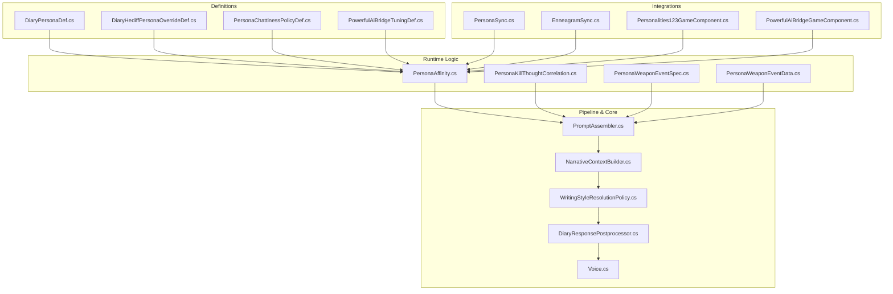
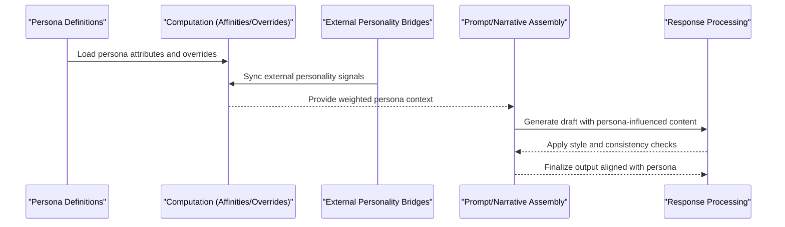
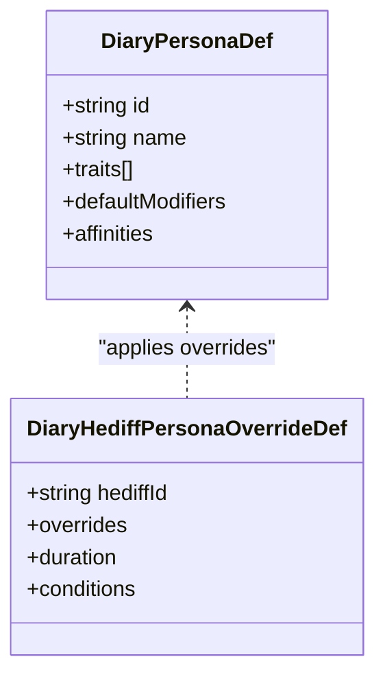
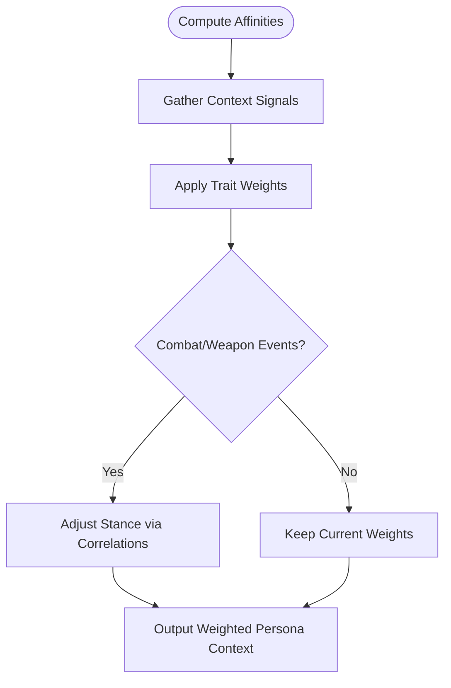
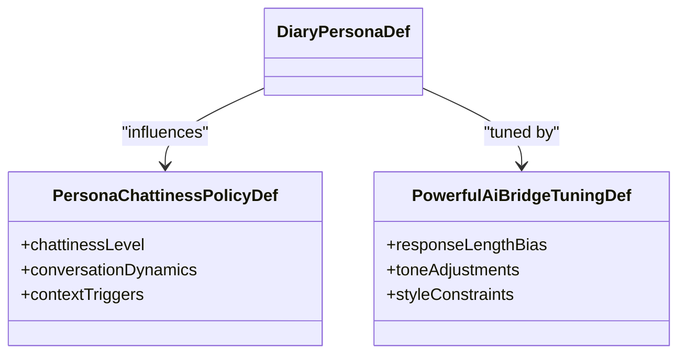
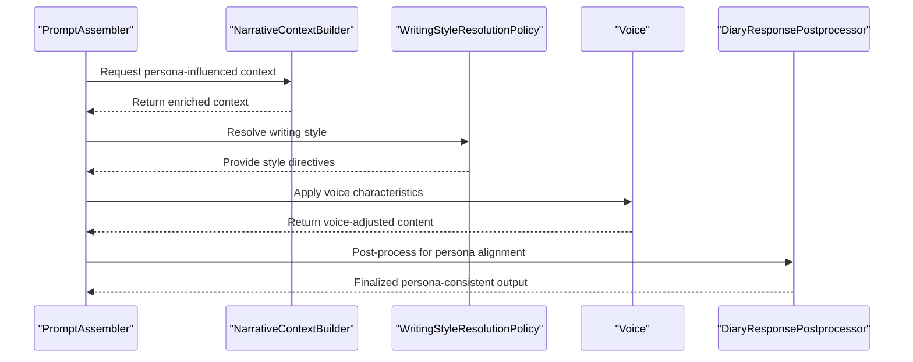
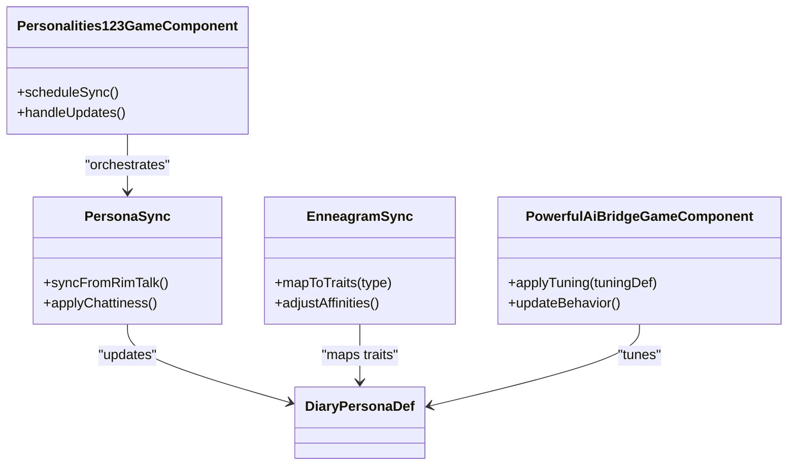
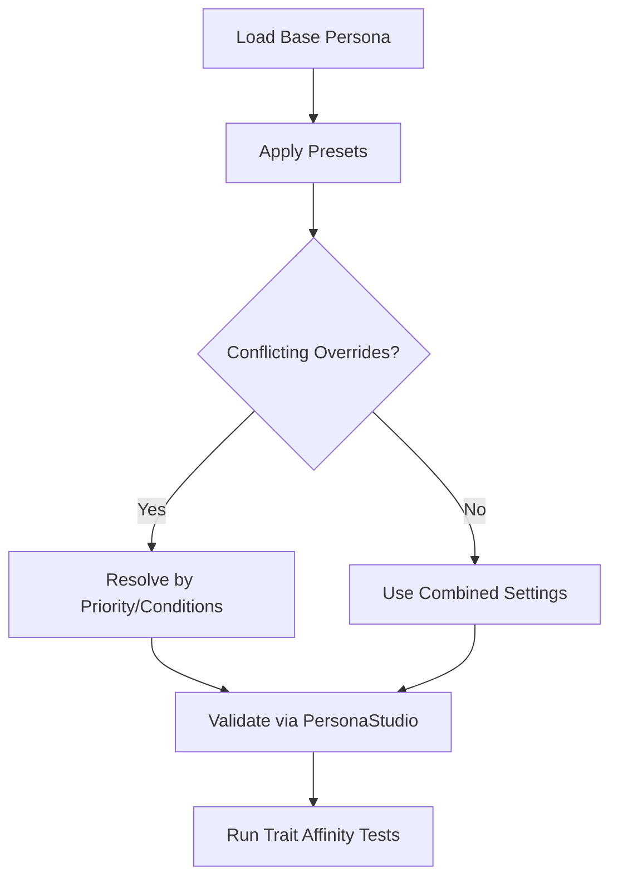
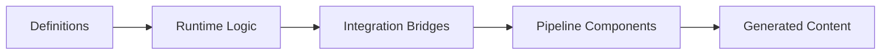

# Persona Configurations

## Table of Contents
1. [Introduction](#introduction)
2. [Project Structure](#project-structure)
3. [Core Components](#core-components)
4. [Architecture Overview](#architecture-overview)
5. [Detailed Component Analysis](#detailed-component-analysis)
6. [Dependency Analysis](#dependency-analysis)
7. [Performance Considerations](#performance-considerations)
8. [Troubleshooting Guide](#troubleshooting-guide)
9. [Conclusion](#conclusion)
10. [Appendices](#appendices)

## Introduction
This document explains the persona definition system that controls character voice and personality traits. It covers persona attributes, affinity weights, trait combinations, behavioral modifiers, and how personas influence prompt generation, response style, and narrative continuity. It also provides guidance for creating custom personas, balancing personality traits, integrating with external personality systems, handling inheritance and conflict resolution, and testing methodologies.

## Project Structure
The persona system is implemented across definitions, runtime logic, integration bridges, and pipeline components:
- Definitions define persona types, overrides, and tuning parameters.
- Runtime logic computes affinities, correlates events, and applies overrides.
- Integration bridges synchronize personas with external personality systems.
- Pipeline components use persona context to shape prompts and responses.

**Diagram sources**
- [DiaryPersonaDef.cs](../../../../../../Source/Defs/DiaryPersonaDef.cs)
- [DiaryHediffPersonaOverrideDef.cs](../../../../../../Source/Defs/DiaryHediffPersonaOverrideDef.cs)
- [PersonaChattinessPolicyDef.cs](../../../../../../integrations/PawnDiary.RimTalkBridge/Source/PersonaChattinessPolicyDef.cs)
- [PowerfulAiBridgeTuningDef.cs](../../../../../../integrations/PawnDiary.PowerfulAiBridge/Source/PowerfulAiBridgeTuningDef.cs)
- [PersonaAffinity.cs](../../../../../../Source/Generation/PersonaAffinity.cs)
- [PersonaKillThoughtCorrelation.cs](../../../../../../Source/Generation/PersonaKillThoughtCorrelation.cs)
- [PersonaWeaponEventSpec.cs](../../../../../../Source/Capture/Specs/PersonaWeaponEventSpec.cs)
- [PersonaWeaponEventData.cs](../../../../../../Source/Capture/Events/PersonaWeaponEventData.cs)
- [PersonaSync.cs](../../../../../../integrations/PawnDiary.RimTalkBridge/Source/PersonaSync.cs)
- [EnneagramSync.cs](../../../../../../integrations/PawnDiary.PersonalitiesBridge/Source/EnneagramSync.cs)
- [Personalities123GameComponent.cs](../../../../../../integrations/PawnDiary.PersonalitiesBridge/Source/Personalities123GameComponent.cs)
- [PowerfulAiBridgeGameComponent.cs](../../../../../../integrations/PawnDiary.PowerfulAiBridge/Source/PowerfulAiBridgeGameComponent.cs)
- [PromptAssembler.cs](../../../../../../Source/Generation/PromptAssembler.cs)
- [NarrativeContextBuilder.cs](../../../../../../Source/Generation/NarrativeContextBuilder.cs)
- [WritingStyleResolutionPolicy.cs](../../../../../../Source/Pipeline/WritingStyleResolutionPolicy.cs)
- [DiaryResponsePostprocessor.cs](../../../../../../Source/Pipeline/DiaryResponsePostprocessor.cs)
- [Voice.cs](../../../../../../Source/Core/DiaryGameComponent.Voice.cs)

**Section sources**
- [DiaryPersonaDef.cs](../../../../../../Source/Defs/DiaryPersonaDef.cs)
- [DiaryHediffPersonaOverrideDef.cs](../../../../../../Source/Defs/DiaryHediffPersonaOverrideDef.cs)
- [PersonaAffinity.cs](../../../../../../Source/Generation/PersonaAffinity.cs)
- [PersonaKillThoughtCorrelation.cs](../../../../../../Source/Generation/PersonaKillThoughtCorrelation.cs)
- [PersonaWeaponEventSpec.cs](../../../../../../Source/Capture/Specs/PersonaWeaponEventSpec.cs)
- [PersonaWeaponEventData.cs](../../../../../../Source/Capture/Events/PersonaWeaponEventData.cs)
- [PersonaChattinessPolicyDef.cs](../../../../../../integrations/PawnDiary.RimTalkBridge/Source/PersonaChattinessPolicyDef.cs)
- [PersonaSync.cs](../../../../../../integrations/PawnDiary.RimTalkBridge/Source/PersonaSync.cs)
- [EnneagramSync.cs](../../../../../../integrations/PawnDiary.PersonalitiesBridge/Source/EnneagramSync.cs)
- [Personalities123GameComponent.cs](../../../../../../integrations/PawnDiary.PersonalitiesBridge/Source/Personalities123GameComponent.cs)
- [PowerfulAiBridgeTuningDef.cs](../../../../../../integrations/PawnDiary.PowerfulAiBridge/Source/PowerfulAiBridgeTuningDef.cs)
- [PowerfulAiBridgeGameComponent.cs](../../../../../../integrations/PawnDiary.PowerfulAiBridge/Source/PowerfulAiBridgeGameComponent.cs)
- [PromptAssembler.cs](../../../../../../Source/Generation/PromptAssembler.cs)
- [NarrativeContextBuilder.cs](../../../../../../Source/Generation/NarrativeContextBuilder.cs)
- [WritingStyleResolutionPolicy.cs](../../../../../../Source/Pipeline/WritingStyleResolutionPolicy.cs)
- [DiaryResponsePostprocessor.cs](../../../../../../Source/Pipeline/DiaryResponsePostprocessor.cs)
- [Voice.cs](../../../../../../Source/Core/DiaryGameComponent.Voice.cs)

## Core Components
- DiaryPersonaDef: Defines persona identity, core attributes, and default behaviors.
- DiaryHediffPersonaOverrideDef: Applies temporary or conditional persona overrides based on hediffs (conditions).
- PersonaAffinity: Computes affinity weights between persona traits and contextual signals.
- PersonaKillThoughtCorrelation: Correlates kill-related thoughts with persona adjustments.
- PersonaWeaponEventSpec/PersonaWeaponEventData: Captures weapon-related events to influence persona behavior.
- Integration Bridges:
  - PersonaSync and PersonaChattinessPolicyDef: Synchronize with RimTalk-based chattiness and conversation dynamics.
  - EnneagramSync and Personalities123GameComponent: Sync with external personality models (e.g., Enneagram).
  - PowerfulAiBridgeTuningDef and PowerfulAiBridgeGameComponent: Tune persona behavior via external AI bridge settings.
- Pipeline Integration:
  - PromptAssembler and NarrativeContextBuilder: Use persona context to assemble prompts and narrative context.
  - WritingStyleResolutionPolicy and Voice: Resolve writing style and voice characteristics influenced by persona.
  - DiaryResponsePostprocessor: Post-processes generated text to align with persona constraints.

**Section sources**
- [DiaryPersonaDef.cs](../../../../../../Source/Defs/DiaryPersonaDef.cs)
- [DiaryHediffPersonaOverrideDef.cs](../../../../../../Source/Defs/DiaryHediffPersonaOverrideDef.cs)
- [PersonaAffinity.cs](../../../../../../Source/Generation/PersonaAffinity.cs)
- [PersonaKillThoughtCorrelation.cs](../../../../../../Source/Generation/PersonaKillThoughtCorrelation.cs)
- [PersonaWeaponEventSpec.cs](../../../../../../Source/Capture/Specs/PersonaWeaponEventSpec.cs)
- [PersonaWeaponEventData.cs](../../../../../../Source/Capture/Events/PersonaWeaponEventData.cs)
- [PersonaChattinessPolicyDef.cs](../../../../../../integrations/PawnDiary.RimTalkBridge/Source/PersonaChattinessPolicyDef.cs)
- [PersonaSync.cs](../../../../../../integrations/PawnDiary.RimTalkBridge/Source/PersonaSync.cs)
- [EnneagramSync.cs](../../../../../../integrations/PawnDiary.PersonalitiesBridge/Source/EnneagramSync.cs)
- [Personalities123GameComponent.cs](../../../../../../integrations/PawnDiary.PersonalitiesBridge/Source/Personalities123GameComponent.cs)
- [PowerfulAiBridgeTuningDef.cs](../../../../../../integrations/PawnDiary.PowerfulAiBridge/Source/PowerfulAiBridgeTuningDef.cs)
- [PowerfulAiBridgeGameComponent.cs](../../../../../../integrations/PawnDiary.PowerfulAiBridge/Source/PowerfulAiBridgeGameComponent.cs)
- [PromptAssembler.cs](../../../../../../Source/Generation/PromptAssembler.cs)
- [NarrativeContextBuilder.cs](../../../../../../Source/Generation/NarrativeContextBuilder.cs)
- [WritingStyleResolutionPolicy.cs](../../../../../../Source/Pipeline/WritingStyleResolutionPolicy.cs)
- [Voice.cs](../../../../../../Source/Core/DiaryGameComponent.Voice.cs)
- [DiaryResponsePostprocessor.cs](../../../../../../Source/Pipeline/DiaryResponsePostprocessor.cs)

## Architecture Overview
The persona system integrates at multiple layers:
- Definition Layer: Personas and overrides are defined as data structures.
- Computation Layer: Affinities and correlations adjust persona state dynamically.
- Integration Layer: External personality systems feed into persona computation.
- Generation Layer: Prompts and narrative context incorporate persona influences.
- Response Layer: Writing style and post-processing ensure consistent voice and tone.

**Diagram sources**
- [DiaryPersonaDef.cs](../../../../../../Source/Defs/DiaryPersonaDef.cs)
- [DiaryHediffPersonaOverrideDef.cs](../../../../../../Source/Defs/DiaryHediffPersonaOverrideDef.cs)
- [PersonaAffinity.cs](../../../../../../Source/Generation/PersonaAffinity.cs)
- [PersonaSync.cs](../../../../../../integrations/PawnDiary.RimTalkBridge/Source/PersonaSync.cs)
- [EnneagramSync.cs](../../../../../../integrations/PawnDiary.PersonalitiesBridge/Source/EnneagramSync.cs)
- [PromptAssembler.cs](../../../../../../Source/Generation/PromptAssembler.cs)
- [NarrativeContextBuilder.cs](../../../../../../Source/Generation/NarrativeContextBuilder.cs)
- [WritingStyleResolutionPolicy.cs](../../../../../../Source/Pipeline/WritingStyleResolutionPolicy.cs)
- [DiaryResponsePostprocessor.cs](../../../../../../Source/Pipeline/DiaryResponsePostprocessor.cs)

## Detailed Component Analysis

### Persona Definition Model
- Attributes include identity markers, baseline traits, and default behavioral modifiers.
- Overrides allow hediff-driven changes to persona behavior temporarily.
- Trait combinations can be expressed through affinity weights and policy definitions.

**Diagram sources**
- [DiaryPersonaDef.cs](../../../../../../Source/Defs/DiaryPersonaDef.cs)
- [DiaryHediffPersonaOverrideDef.cs](../../../../../../Source/Defs/DiaryHediffPersonaOverrideDef.cs)

**Section sources**
- [DiaryPersonaDef.cs](../../../../../../Source/Defs/DiaryPersonaDef.cs)
- [DiaryHediffPersonaOverrideDef.cs](../../../../../../Source/Defs/DiaryHediffPersonaOverrideDef.cs)

### Affinity Weights and Trait Combinations
- PersonaAffinity computes dynamic weights based on contextual signals and trait interactions.
- Kill thought correlation adjusts persona stance after combat events.
- Weapon event specs capture specific actions that influence persona behavior.

**Diagram sources**
- [PersonaAffinity.cs](../../../../../../Source/Generation/PersonaAffinity.cs)
- [PersonaKillThoughtCorrelation.cs](../../../../../../Source/Generation/PersonaKillThoughtCorrelation.cs)
- [PersonaWeaponEventSpec.cs](../../../../../../Source/Capture/Specs/PersonaWeaponEventSpec.cs)
- [PersonaWeaponEventData.cs](../../../../../../Source/Capture/Events/PersonaWeaponEventData.cs)

**Section sources**
- [PersonaAffinity.cs](../../../../../../Source/Generation/PersonaAffinity.cs)
- [PersonaKillThoughtCorrelation.cs](../../../../../../Source/Generation/PersonaKillThoughtCorrelation.cs)
- [PersonaWeaponEventSpec.cs](../../../../../../Source/Capture/Specs/PersonaWeaponEventSpec.cs)
- [PersonaWeaponEventData.cs](../../../../../../Source/Capture/Events/PersonaWeaponEventData.cs)

### Behavioral Modifiers and Overrides
- Hediff-based overrides modify persona behavior conditionally.
- Chattiness policies from RimTalk bridge modulate conversational verbosity.
- External tuning via PowerfulAiBridge affects persona responsiveness and style.

**Diagram sources**
- [PersonaChattinessPolicyDef.cs](../../../../../../integrations/PawnDiary.RimTalkBridge/Source/PersonaChattinessPolicyDef.cs)
- [PowerfulAiBridgeTuningDef.cs](../../../../../../integrations/PawnDiary.PowerfulAiBridge/Source/PowerfulAiBridgeTuningDef.cs)

**Section sources**
- [PersonaChattinessPolicyDef.cs](../../../../../../integrations/PawnDiary.RimTalkBridge/Source/PersonaChattinessPolicyDef.cs)
- [PowerfulAiBridgeTuningDef.cs](../../../../../../integrations/PawnDiary.PowerfulAiBridge/Source/PowerfulAiBridgeTuningDef.cs)

### Influence on Prompt Generation and Response Style
- PromptAssembler uses persona context to build prompts tailored to character voice.
- NarrativeContextBuilder incorporates persona-driven narrative cues.
- WritingStyleResolutionPolicy resolves stylistic elements based on persona traits.
- Voice component ensures consistent vocal characteristics.
- DiaryResponsePostprocessor enforces persona-aligned formatting and tone.

**Diagram sources**
- [PromptAssembler.cs](../../../../../../Source/Generation/PromptAssembler.cs)
- [NarrativeContextBuilder.cs](../../../../../../Source/Generation/NarrativeContextBuilder.cs)
- [WritingStyleResolutionPolicy.cs](../../../../../../Source/Pipeline/WritingStyleResolutionPolicy.cs)
- [Voice.cs](../../../../../../Source/Core/DiaryGameComponent.Voice.cs)
- [DiaryResponsePostprocessor.cs](../../../../../../Source/Pipeline/DiaryResponsePostprocessor.cs)

**Section sources**
- [PromptAssembler.cs](../../../../../../Source/Generation/PromptAssembler.cs)
- [NarrativeContextBuilder.cs](../../../../../../Source/Generation/NarrativeContextBuilder.cs)
- [WritingStyleResolutionPolicy.cs](../../../../../../Source/Pipeline/WritingStyleResolutionPolicy.cs)
- [Voice.cs](../../../../../../Source/Core/DiaryGameComponent.Voice.cs)
- [DiaryResponsePostprocessor.cs](../../../../../../Source/Pipeline/DiaryResponsePostprocessor.cs)

### Integrating with External Personality Systems
- PersonaSync synchronizes RimTalk-based personality signals into persona computation.
- EnneagramSync maps Enneagram types to persona traits and affinities.
- Personalities123GameComponent orchestrates periodic sync operations.
- PowerfulAiBridgeGameComponent applies external AI bridge tuning to persona behavior.

**Diagram sources**
- [PersonaSync.cs](../../../../../../integrations/PawnDiary.RimTalkBridge/Source/PersonaSync.cs)
- [EnneagramSync.cs](../../../../../../integrations/PawnDiary.PersonalitiesBridge/Source/EnneagramSync.cs)
- [Personalities123GameComponent.cs](../../../../../../integrations/PawnDiary.PersonalitiesBridge/Source/Personalities123GameComponent.cs)
- [PowerfulAiBridgeGameComponent.cs](../../../../../../integrations/PawnDiary.PowerfulAiBridge/Source/PowerfulAiBridgeGameComponent.cs)

**Section sources**
- [PersonaSync.cs](../../../../../../integrations/PawnDiary.RimTalkBridge/Source/PersonaSync.cs)
- [EnneagramSync.cs](../../../../../../integrations/PawnDiary.PersonalitiesBridge/Source/EnneagramSync.cs)
- [Personalities123GameComponent.cs](../../../../../../integrations/PawnDiary.PersonalitiesBridge/Source/Personalities123GameComponent.cs)
- [PowerfulAiBridgeGameComponent.cs](../../../../../../integrations/PawnDiary.PowerfulAiBridge/Source/PowerfulAiBridgeGameComponent.cs)

### Inheritance, Conflict Resolution, and Testing
- Inheritance: Base persona attributes can be extended via presets and override definitions.
- Conflict Resolution: When multiple overrides apply, priority is determined by specificity and temporal conditions.
- Testing Methodologies:
  - PersonaPresetStore manages testable persona configurations.
  - PersonaStudio provides UI tools for validating persona setups.
  - PsychotypeTraitAffinities supports testing trait interactions and affinities.

**Diagram sources**
- [PersonaPresetStore.cs](../../../../../../Source/Settings/PersonaPresetStore.cs)
- [PawnDiaryMod.PersonaStudio.cs](../../../../../../Source/Settings/PawnDiaryMod.PersonaStudio.cs)
- [PsychotypeTraitAffinities.cs](../../../../../../Source/Pipeline/PsychotypeTraitAffinities.cs)

**Section sources**
- [PersonaPresetStore.cs](../../../../../../Source/Settings/PersonaPresetStore.cs)
- [PawnDiaryMod.PersonaStudio.cs](../../../../../../Source/Settings/PawnDiaryMod.PersonaStudio.cs)
- [PsychotypeTraitAffinities.cs](../../../../../../Source/Pipeline/PsychotypeTraitAffinities.cs)

## Dependency Analysis
The persona system depends on definitions, runtime computations, integrations, and pipeline components. The following diagram highlights key dependencies:

**Diagram sources**
- [DiaryPersonaDef.cs](../../../../../../Source/Defs/DiaryPersonaDef.cs)
- [PersonaAffinity.cs](../../../../../../Source/Generation/PersonaAffinity.cs)
- [PersonaSync.cs](../../../../../../integrations/PawnDiary.RimTalkBridge/Source/PersonaSync.cs)
- [PromptAssembler.cs](../../../../../../Source/Generation/PromptAssembler.cs)

**Section sources**
- [DiaryPersonaDef.cs](../../../../../../Source/Defs/DiaryPersonaDef.cs)
- [PersonaAffinity.cs](../../../../../../Source/Generation/PersonaAffinity.cs)
- [PersonaSync.cs](../../../../../../integrations/PawnDiary.RimTalkBridge/Source/PersonaSync.cs)
- [PromptAssembler.cs](../../../../../../Source/Generation/PromptAssembler.cs)

## Performance Considerations
- Minimize redundant computations by caching persona affinities where appropriate.
- Defer heavy integration sync operations to off-peak times.
- Use targeted overrides to reduce global persona recalculations.
- Profile prompt assembly under varied persona configurations to identify bottlenecks.

[No sources needed since this section provides general guidance]

## Troubleshooting Guide
Common issues and resolutions:
- Conflicting Overrides: Verify override priorities and temporal conditions; use PersonaStudio to inspect active overrides.
- External Sync Failures: Check bridge components (PersonaSync, EnneagramSync) for connectivity and mapping errors.
- Style Drift: Review WritingStyleResolutionPolicy and DiaryResponsePostprocessor settings to ensure persona alignment.
- Trait Imbalance: Use PsychotypeTraitAffinities tests to validate trait interactions and adjust weights accordingly.

**Section sources**
- [PersonaPresetStore.cs](../../../../../../Source/Settings/PersonaPresetStore.cs)
- [PersonaSync.cs](../../../../../../integrations/PawnDiary.RimTalkBridge/Source/PersonaSync.cs)
- [EnneagramSync.cs](../../../../../../integrations/PawnDiary.PersonalitiesBridge/Source/EnneagramSync.cs)
- [WritingStyleResolutionPolicy.cs](../../../../../../Source/Pipeline/WritingStyleResolutionPolicy.cs)
- [DiaryResponsePostprocessor.cs](../../../../../../Source/Pipeline/DiaryResponsePostprocessor.cs)
- [PsychotypeTraitAffinities.cs](../../../../../../Source/Pipeline/PsychotypeTraitAffinities.cs)

## Conclusion
The persona definition system provides a flexible framework for controlling character voice and personality traits through well-defined attributes, dynamic affinities, and robust integration points. By leveraging overrides, external bridges, and pipeline components, creators can craft nuanced personas that consistently influence prompt generation, response style, and narrative continuity. Proper testing and troubleshooting ensure reliable behavior across diverse scenarios.

[No sources needed since this section summarizes without analyzing specific files]

## Appendices
- Creating Custom Personas:
  - Define base attributes in persona definitions.
  - Add hediff-based overrides for conditional behavior.
  - Integrate external personality systems via sync components.
- Balancing Personality Traits:
  - Adjust affinity weights using trait interaction tests.
  - Validate with PersonaStudio and preset stores.
- Integration Best Practices:
  - Ensure clear mapping between external personality models and persona traits.
  - Monitor sync performance and resolve conflicts proactively.

[No sources needed since this section provides general guidance]
