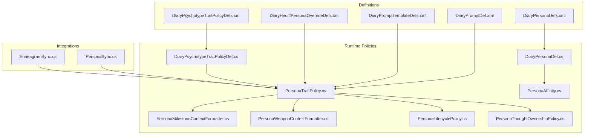
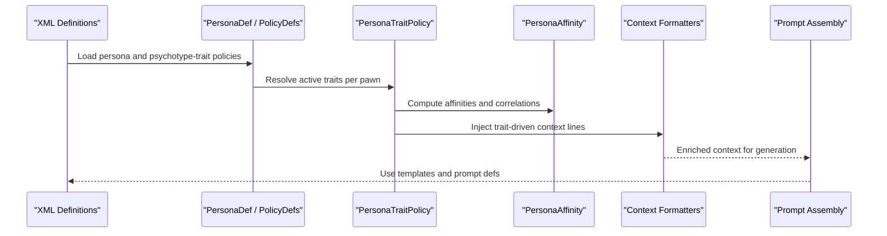
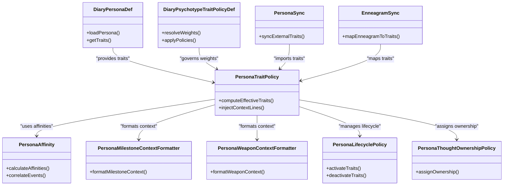

# Persona Traits & Attributes

- [DiaryPersonaDefs.xml](../../../../../../1.6/Defs/DiaryPersonaDefs.xml)
- [DiaryPsychotypeTraitPolicyDefs.xml](../../../../../../1.6/Defs/DiaryPsychotypeTraitPolicyDefs.xml)
- [DiaryPromptDef.xml](../../../../../../1.6/Defs/DiaryPromptDef.xml)
- [DiaryPromptTemplateDefs.xml](../../../../../../1.6/Defs/DiaryPromptTemplateDefs.xml)
- [DiaryHediffPersonaOverrideDefs.xml](../../../../../../1.6/Defs/DiaryHediffPersonaOverrideDefs.xml)
- [DiaryPersonaDef.cs](../../../../../../Source/Defs/DiaryPersonaDef.cs)
- [DiaryPsychotypeTraitPolicyDef.cs](../../../../../../Source/Defs/DiaryPsychotypeTraitPolicyDef.cs)
- [DiaryPromptDef.cs](../../../../../../Source/Defs/DiaryPromptDef.cs)
- [PersonaTraitPolicy.cs](../../../../../../Source/Pipeline/Royalty/PersonaTraitPolicy.cs)
- [PersonaAffinity.cs](../../../../../../Source/Generation/PersonaAffinity.cs)
- [PersonaKillThoughtCorrelation.cs](../../../../../../Source/Generation/PersonaKillThoughtCorrelation.cs)
- [PersonaWeaponContextFormatter.cs](../../../../../../Source/Pipeline/Royalty/PersonaWeaponContextFormatter.cs)
- [PersonaMilestoneContextFormatter.cs](../../../../../../Source/Pipeline/Royalty/PersonaMilestoneContextFormatter.cs)
- [PersonaLifecyclePolicy.cs](../../../../../../Source/Pipeline/Royalty/PersonaLifecyclePolicy.cs)
- [PersonaThoughtOwnershipPolicy.cs](../../../../../../Source/Pipeline/Royalty/PersonaThoughtOwnershipPolicy.cs)
- [PersonaSync.cs](../../../../../../integrations/PawnDiary.RimTalkBridge/Source/PersonaSync.cs)
- [EnneagramSync.cs](../../../../../../integrations/PawnDiary.PersonalitiesBridge/Source/EnneagramSync.cs)
- [PawnDiaryMod.PersonaStudio.cs](../../../../../../Source/Settings/PawnDiaryMod.PersonaStudio.cs)
- [PromptTestSuite.cs](../../../../../../Source/Core/DiaryGameComponent.PromptTestSuite.cs)
## Table of Contents
1. [Introduction](#introduction)
2. [Project Structure](#project-structure)
3. [Core Components](#core-components)
4. [Architecture Overview](#architecture-overview)
5. [Detailed Component Analysis](#detailed-component-analysis)
6. [Dependency Analysis](#dependency-analysis)
7. [Performance Considerations](#performance-considerations)
8. [Troubleshooting Guide](#troubleshooting-guide)
9. [Conclusion](#conclusion)
10. [Appendices](#appendices)

## Introduction
This document explains the persona traits and attributes system used to shape character voice, decision-making, and narrative responses. It covers how personality traits are defined via XML definitions, how trait weights and behavioral modifiers influence prompt generation, and how traits interact with observed conditions, hediffs, and external bridges. It also provides guidance on balancing strategies, inheritance and override mechanisms, common trait combinations, and testing approaches for personality validation.

## Project Structure
The persona traits system spans data definitions (XML), runtime policies (C#), and integration points (bridges). Key areas include:
- Definition layer: XML files that define personas, psychotype-trait policies, prompts, templates, and hediff-based overrides.
- Runtime layer: C# classes that load definitions, compute affinities, apply trait policies, and format context for prompt assembly.
- Integration layer: Bridges that synchronize traits from other mods or systems into the diary pipeline.

**Diagram sources**
- [DiaryPersonaDefs.xml](../../../../../../1.6/Defs/DiaryPersonaDefs.xml)
- [DiaryPsychotypeTraitPolicyDefs.xml](../../../../../../1.6/Defs/DiaryPsychotypeTraitPolicyDefs.xml)
- [DiaryPromptDef.xml](../../../../../../1.6/Defs/DiaryPromptDef.xml)
- [DiaryPromptTemplateDefs.xml](../../../../../../1.6/Defs/DiaryPromptTemplateDefs.xml)
- [DiaryHediffPersonaOverrideDefs.xml](../../../../../../1.6/Defs/DiaryHediffPersonaOverrideDefs.xml)
- [DiaryPersonaDef.cs](../../../../../../Source/Defs/DiaryPersonaDef.cs)
- [DiaryPsychotypeTraitPolicyDef.cs](../../../../../../Source/Defs/DiaryPsychotypeTraitPolicyDef.cs)
- [PersonaTraitPolicy.cs](../../../../../../Source/Pipeline/Royalty/PersonaTraitPolicy.cs)
- [PersonaAffinity.cs](../../../../../../Source/Generation/PersonaAffinity.cs)
- [PersonaMilestoneContextFormatter.cs](../../../../../../Source/Pipeline/Royalty/PersonaMilestoneContextFormatter.cs)
- [PersonaWeaponContextFormatter.cs](../../../../../../Source/Pipeline/Royalty/PersonaWeaponContextFormatter.cs)
- [PersonaLifecyclePolicy.cs](../../../../../../Source/Pipeline/Royalty/PersonaLifecyclePolicy.cs)
- [PersonaThoughtOwnershipPolicy.cs](../../../../../../Source/Pipeline/Royalty/PersonaThoughtOwnershipPolicy.cs)
- [PersonaSync.cs](../../../../../../integrations/PawnDiary.RimTalkBridge/Source/PersonaSync.cs)
- [EnneagramSync.cs](../../../../../../integrations/PawnDiary.PersonalitiesBridge/Source/EnneagramSync.cs)

**Section sources**
- [DiaryPersonaDefs.xml](../../../../../../1.6/Defs/DiaryPersonaDefs.xml)
- [DiaryPsychotypeTraitPolicyDefs.xml](../../../../../../1.6/Defs/DiaryPsychotypeTraitPolicyDefs.xml)
- [DiaryPromptDef.xml](../../../../../../1.6/Defs/DiaryPromptDef.xml)
- [DiaryPromptTemplateDefs.xml](../../../../../../1.6/Defs/DiaryPromptTemplateDefs.xml)
- [DiaryHediffPersonaOverrideDefs.xml](../../../../../../1.6/Defs/DiaryHediffPersonaOverrideDefs.xml)
- [DiaryPersonaDef.cs](../../../../../../Source/Defs/DiaryPersonaDef.cs)
- [DiaryPsychotypeTraitPolicyDef.cs](../../../../../../Source/Defs/DiaryPsychotypeTraitPolicyDef.cs)
- [PersonaTraitPolicy.cs](../../../../../../Source/Pipeline/Royalty/PersonaTraitPolicy.cs)
- [PersonaAffinity.cs](../../../../../../Source/Generation/PersonaAffinity.cs)
- [PersonaMilestoneContextFormatter.cs](../../../../../../Source/Pipeline/Royalty/PersonaMilestoneContextFormatter.cs)
- [PersonaWeaponContextFormatter.cs](../../../../../../Source/Pipeline/Royalty/PersonaWeaponContextFormatter.cs)
- [PersonaLifecyclePolicy.cs](../../../../../../Source/Pipeline/Royalty/PersonaLifecyclePolicy.cs)
- [PersonaThoughtOwnershipPolicy.cs](../../../../../../Source/Pipeline/Royalty/PersonaThoughtOwnershipPolicy.cs)
- [PersonaSync.cs](../../../../../../integrations/PawnDiary.RimTalkBridge/Source/PersonaSync.cs)
- [EnneagramSync.cs](../../../../../../integrations/PawnDiary.PersonalitiesBridge/Source/EnneagramSync.cs)

## Core Components
- Persona definition model: Loads persona metadata and links to traits and behaviors.
- Psychotype-trait policy: Governs how traits are selected, weighted, and applied based on psychotype and mod settings.
- Trait policy: Applies trait effects to context building, influencing prompt content and tone.
- Affinity and correlation utilities: Compute trait affinities and link traits to specific events (e.g., kills, weapons).
- Context formatters: Inject trait-driven details into milestone and weapon-related contexts.
- Lifecycle and ownership policies: Manage when traits become active and whose thoughts they affect.
- Hediff overrides: Allow temporary trait modifications via in-game conditions.
- Bridge synchronization: Import traits from external systems (e.g., RimTalk, Personalities).

**Section sources**
- [DiaryPersonaDef.cs](../../../../../../Source/Defs/DiaryPersonaDef.cs)
- [DiaryPsychotypeTraitPolicyDef.cs](../../../../../../Source/Defs/DiaryPsychotypeTraitPolicyDef.cs)
- [PersonaTraitPolicy.cs](../../../../../../Source/Pipeline/Royalty/PersonaTraitPolicy.cs)
- [PersonaAffinity.cs](../../../../../../Source/Generation/PersonaAffinity.cs)
- [PersonaKillThoughtCorrelation.cs](../../../../../../Source/Generation/PersonaKillThoughtCorrelation.cs)
- [PersonaMilestoneContextFormatter.cs](../../../../../../Source/Pipeline/Royalty/PersonaMilestoneContextFormatter.cs)
- [PersonaWeaponContextFormatter.cs](../../../../../../Source/Pipeline/Royalty/PersonaWeaponContextFormatter.cs)
- [PersonaLifecyclePolicy.cs](../../../../../../Source/Pipeline/Royalty/PersonaLifecyclePolicy.cs)
- [PersonaThoughtOwnershipPolicy.cs](../../../../../../Source/Pipeline/Royalty/PersonaThoughtOwnershipPolicy.cs)
- [DiaryHediffPersonaOverrideDefs.xml](../../../../../../1.6/Defs/DiaryHediffPersonaOverrideDefs.xml)
- [PersonaSync.cs](../../../../../../integrations/PawnDiary.RimTalkBridge/Source/PersonaSync.cs)
- [EnneagramSync.cs](../../../../../../integrations/PawnDiary.PersonalitiesBridge/Source/EnneagramSync.cs)

## Architecture Overview
The persona traits system integrates into the diary pipeline by shaping context before prompt assembly. Traits influence:
- Voice and tone through contextual cues and decorations.
- Decision-making by biasing event relevance and memory selection.
- Narrative responses by injecting trait-specific phrasing and emphasis.

**Diagram sources**
- [DiaryPersonaDefs.xml](../../../../../../1.6/Defs/DiaryPersonaDefs.xml)
- [DiaryPsychotypeTraitPolicyDefs.xml](../../../../../../1.6/Defs/DiaryPsychotypeTraitPolicyDefs.xml)
- [DiaryPromptDef.xml](../../../../../../1.6/Defs/DiaryPromptDef.xml)
- [DiaryPromptTemplateDefs.xml](../../../../../../1.6/Defs/DiaryPromptTemplateDefs.xml)
- [DiaryPersonaDef.cs](../../../../../../Source/Defs/DiaryPersonaDef.cs)
- [DiaryPsychotypeTraitPolicyDef.cs](../../../../../../Source/Defs/DiaryPsychotypeTraitPolicyDef.cs)
- [PersonaTraitPolicy.cs](../../../../../../Source/Pipeline/Royalty/PersonaTraitPolicy.cs)
- [PersonaAffinity.cs](../../../../../../Source/Generation/PersonaAffinity.cs)
- [PersonaMilestoneContextFormatter.cs](../../../../../../Source/Pipeline/Royalty/PersonaMilestoneContextFormatter.cs)
- [PersonaWeaponContextFormatter.cs](../../../../../../Source/Pipeline/Royalty/PersonaWeaponContextFormatter.cs)

## Detailed Component Analysis

### Trait Definitions and Weights
Traits are declared in XML definitions and referenced by persona and psychotype-trait policies. Typical elements include:
- Trait identifiers and categories.
- Base weights controlling likelihood of activation.
- Behavioral modifiers affecting tone, verbosity, or thematic focus.
- Interaction patterns specifying which events or contexts amplify a trait.

These definitions feed into the runtime policy engine, which resolves effective weights per pawn based on current state and mod integrations.

**Section sources**
- [DiaryPersonaDefs.xml](../../../../../../1.6/Defs/DiaryPersonaDefs.xml)
- [DiaryPsychotypeTraitPolicyDefs.xml](../../../../../../1.6/Defs/DiaryPsychotypeTraitPolicyDefs.xml)
- [DiaryPersonaDef.cs](../../../../../../Source/Defs/DiaryPersonaDef.cs)
- [DiaryPsychotypeTraitPolicyDef.cs](../../../../../../Source/Defs/DiaryPsychotypeTraitPolicyDef.cs)

### Behavioral Modifiers and Interaction Patterns
Behavioral modifiers adjust how traits influence context construction:
- Tone modifiers alter word choice and sentence structure hints.
- Verbosity modifiers control detail density.
- Interaction patterns tie traits to specific events (e.g., raids, social interactions, milestones).

Interaction patterns are evaluated during context formation, allowing traits to emphasize relevant memories and observations.

**Section sources**
- [PersonaTraitPolicy.cs](../../../../../../Source/Pipeline/Royalty/PersonaTraitPolicy.cs)
- [PersonaAffinity.cs](../../../../../../Source/Generation/PersonaAffinity.cs)
- [PersonaMilestoneContextFormatter.cs](../../../../../../Source/Pipeline/Royalty/PersonaMilestoneContextFormatter.cs)
- [PersonaWeaponContextFormatter.cs](../../../../../../Source/Pipeline/Royalty/PersonaWeaponContextFormatter.cs)

### Relationship Between Traits and Prompt Generation
Traits enrich the prompt context prior to template rendering:
- They inject trait-specific cues into narrative context lines.
- They influence memory recall and event window eligibility.
- They can modify writing style preferences and humor chances.

Templates and prompt definitions then use this enriched context to generate coherent, persona-consistent prose.

**Section sources**
- [DiaryPromptDef.xml](../../../../../../1.6/Defs/DiaryPromptDef.xml)
- [DiaryPromptTemplateDefs.xml](../../../../../../1.6/Defs/DiaryPromptTemplateDefs.xml)
- [PersonaTraitPolicy.cs](../../../../../../Source/Pipeline/Royalty/PersonaTraitPolicy.cs)
- [PersonaAffinity.cs](../../../../../../Source/Generation/PersonaAffinity.cs)

### Trait Inheritance and Override Mechanisms
Inheritance and overrides allow layered customization:
- Base traits provide foundational behavior.
- Derived traits extend or refine base behavior.
- Hediff-based overrides temporarily replace or suppress traits under certain conditions.

Overrides are resolved at runtime, ensuring temporary states (e.g., injuries, mental states) can shift persona expression without permanent changes.

**Section sources**
- [DiaryHediffPersonaOverrideDefs.xml](../../../../../../1.6/Defs/DiaryHediffPersonaOverrideDefs.xml)
- [PersonaTraitPolicy.cs](../../../../../../Source/Pipeline/Royalty/PersonaTraitPolicy.cs)
- [PersonaLifecyclePolicy.cs](../../../../../../Source/Pipeline/Royalty/PersonaLifecyclePolicy.cs)

### Testing Approaches for Personality Validation
Validation includes:
- Unit tests for affinity calculations and correlation logic.
- Fixture-based tests for prompt generation across trait combinations.
- Studio tools for previewing persona outputs and adjusting weights.

Automated suites exercise trait resolution and context enrichment to ensure consistency.

**Section sources**
- [PersonaAffinity.cs](../../../../../../Source/Generation/PersonaAffinity.cs)
- [PersonaKillThoughtCorrelation.cs](../../../../../../Source/Generation/PersonaKillThoughtCorrelation.cs)
- [PromptTestSuite.cs](../../../../../../Source/Core/DiaryGameComponent.PromptTestSuite.cs)
- [PawnDiaryMod.PersonaStudio.cs](../../../../../../Source/Settings/PawnDiaryMod.PersonaStudio.cs)

### Common Trait Combinations and Balancing Strategies
Balancing strategies:
- Start with broad categories (e.g., aggression, empathy, curiosity) and assign moderate base weights.
- Use interaction patterns to specialize traits for specific events rather than inflating base weights.
- Apply hediff overrides for situational shifts (e.g., pain reduces empathy temporarily).
- Monitor prompt variance; if too erratic, reduce weight dispersion and clarify interaction triggers.

Common combinations:
- High empathy + low aggression: supportive dialogue, conflict avoidance.
- High curiosity + high verbosity: detailed reflections, exploratory questions.
- Low empathy + high aggression: terse, confrontational responses.

[No sources needed since this section provides general guidance]

### Troubleshooting Trait Conflicts
Symptoms:
- Contradictory tones within a single entry.
- Overly verbose or overly terse responses.
- Traits not activating despite expected conditions.

Resolution steps:
- Inspect effective weights and interaction pattern matches.
- Check for overlapping overrides from multiple sources (hediffs, bridges).
- Narrow interaction scopes to avoid accidental amplification.
- Use studio previews to isolate problematic traits.

**Section sources**
- [PersonaTraitPolicy.cs](../../../../../../Source/Pipeline/Royalty/PersonaTraitPolicy.cs)
- [PersonaLifecyclePolicy.cs](../../../../../../Source/Pipeline/Royalty/PersonaLifecyclePolicy.cs)
- [PersonaSync.cs](../../../../../../integrations/PawnDiary.RimTalkBridge/Source/PersonaSync.cs)
- [EnneagramSync.cs](../../../../../../integrations/PawnDiary.PersonalitiesBridge/Source/EnneagramSync.cs)

## Dependency Analysis
The following diagram shows key dependencies among persona components:

**Diagram sources**
- [DiaryPersonaDef.cs](../../../../../../Source/Defs/DiaryPersonaDef.cs)
- [DiaryPsychotypeTraitPolicyDef.cs](../../../../../../Source/Defs/DiaryPsychotypeTraitPolicyDef.cs)
- [PersonaTraitPolicy.cs](../../../../../../Source/Pipeline/Royalty/PersonaTraitPolicy.cs)
- [PersonaAffinity.cs](../../../../../../Source/Generation/PersonaAffinity.cs)
- [PersonaMilestoneContextFormatter.cs](../../../../../../Source/Pipeline/Royalty/PersonaMilestoneContextFormatter.cs)
- [PersonaWeaponContextFormatter.cs](../../../../../../Source/Pipeline/Royalty/PersonaWeaponContextFormatter.cs)
- [PersonaLifecyclePolicy.cs](../../../../../../Source/Pipeline/Royalty/PersonaLifecyclePolicy.cs)
- [PersonaThoughtOwnershipPolicy.cs](../../../../../../Source/Pipeline/Royalty/PersonaThoughtOwnershipPolicy.cs)
- [PersonaSync.cs](../../../../../../integrations/PawnDiary.RimTalkBridge/Source/PersonaSync.cs)
- [EnneagramSync.cs](../../../../../../integrations/PawnDiary.PersonalitiesBridge/Source/EnneagramSync.cs)

**Section sources**
- [DiaryPersonaDef.cs](../../../../../../Source/Defs/DiaryPersonaDef.cs)
- [DiaryPsychotypeTraitPolicyDef.cs](../../../../../../Source/Defs/DiaryPsychotypeTraitPolicyDef.cs)
- [PersonaTraitPolicy.cs](../../../../../../Source/Pipeline/Royalty/PersonaTraitPolicy.cs)
- [PersonaAffinity.cs](../../../../../../Source/Generation/PersonaAffinity.cs)
- [PersonaMilestoneContextFormatter.cs](../../../../../../Source/Pipeline/Royalty/PersonaMilestoneContextFormatter.cs)
- [PersonaWeaponContextFormatter.cs](../../../../../../Source/Pipeline/Royalty/PersonaWeaponContextFormatter.cs)
- [PersonaLifecyclePolicy.cs](../../../../../../Source/Pipeline/Royalty/PersonaLifecyclePolicy.cs)
- [PersonaThoughtOwnershipPolicy.cs](../../../../../../Source/Pipeline/Royalty/PersonaThoughtOwnershipPolicy.cs)
- [PersonaSync.cs](../../../../../../integrations/PawnDiary.RimTalkBridge/Source/PersonaSync.cs)
- [EnneagramSync.cs](../../../../../../integrations/PawnDiary.PersonalitiesBridge/Source/EnneagramSync.cs)

## Performance Considerations
- Keep trait interaction scopes narrow to avoid excessive evaluation overhead.
- Cache affinity computations where possible to reduce repeated work.
- Limit heavy context injections to high-signal events to maintain responsiveness.
- Use hediff overrides sparingly; frequent toggling can increase churn in trait resolution.

[No sources needed since this section provides general guidance]

## Troubleshooting Guide
- Validate trait activation by inspecting effective weights and interaction matches.
- Confirm no conflicting overrides from multiple bridges or hediffs.
- Use persona studio previews to isolate issues and adjust weights incrementally.
- Review prompt templates to ensure they consume trait context correctly.

**Section sources**
- [PersonaTraitPolicy.cs](../../../../../../Source/Pipeline/Royalty/PersonaTraitPolicy.cs)
- [PersonaLifecyclePolicy.cs](../../../../../../Source/Pipeline/Royalty/PersonaLifecyclePolicy.cs)
- [PersonaSync.cs](../../../../../../integrations/PawnDiary.RimTalkBridge/Source/PersonaSync.cs)
- [EnneagramSync.cs](../../../../../../integrations/PawnDiary.PersonalitiesBridge/Source/EnneagramSync.cs)
- [DiaryPromptDef.xml](../../../../../../1.6/Defs/DiaryPromptDef.xml)
- [DiaryPromptTemplateDefs.xml](../../../../../../1.6/Defs/DiaryPromptTemplateDefs.xml)

## Conclusion
The persona traits system blends declarative XML definitions with robust runtime policies to produce consistent, nuanced character voices. By carefully defining trait weights, behavioral modifiers, and interaction patterns—and by leveraging overrides and bridge synchronizations—you can craft rich personalities that adapt to in-game events while remaining balanced and testable.

[No sources needed since this section summarizes without analyzing specific files]

## Appendices
- Example trait combination matrix:
  - Empathy vs Aggression: influences conflict tone and negotiation outcomes.
  - Curiosity vs Conservatism: affects exploration prompts and risk framing.
  - Verbosity vs Conciseness: controls detail density and pacing.
- Recommended testing workflow:
  - Define baseline traits and weights.
  - Run fixture tests across event types.
  - Adjust interaction patterns to target specific scenarios.
  - Validate with persona studio previews and automated suites.

[No sources needed since this section provides general guidance]
