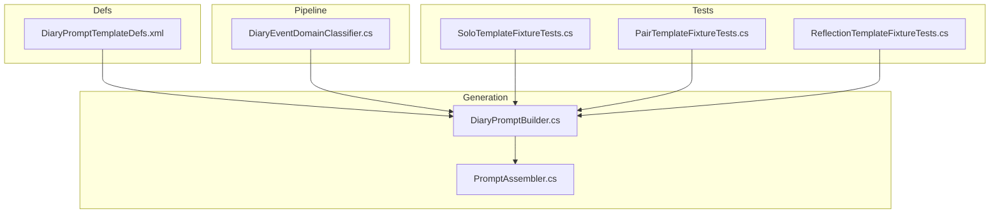
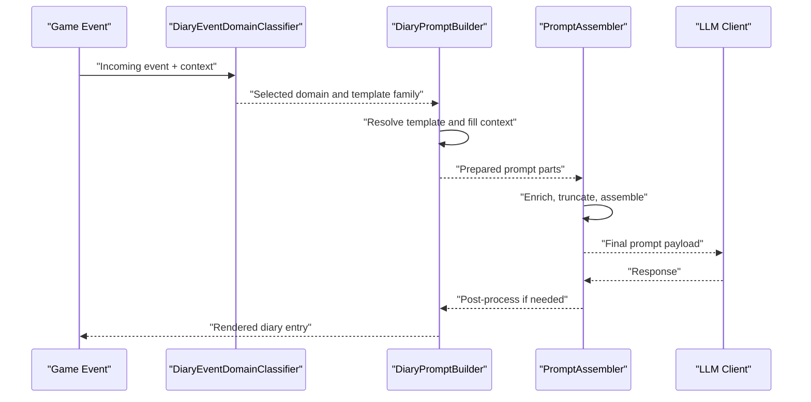
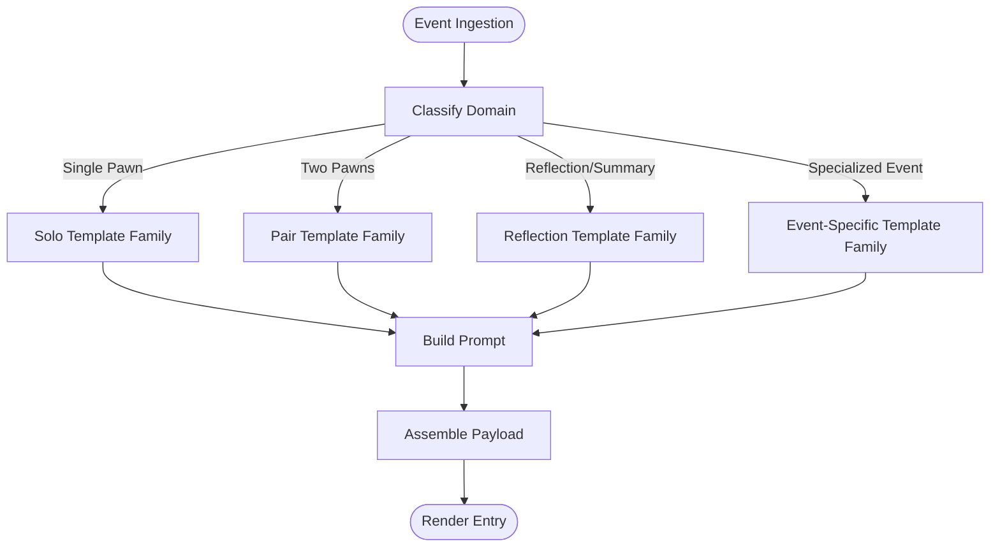
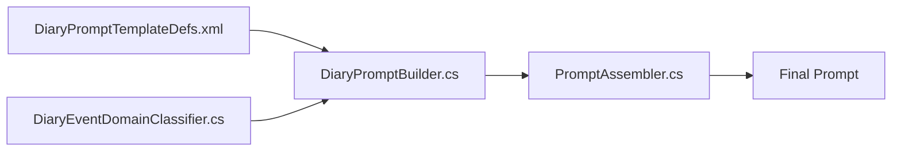

# Built-in Template Types

- [DiaryPromptTemplateDefs.xml](../../../../../../1.6/Defs/DiaryPromptTemplateDefs.xml)
- [DiaryPromptDef.cs](../../../../../../Source/Defs/DiaryPromptDef.cs)
- [DiaryPromptBuilder.cs](../../../../../../Source/Generation/DiaryPromptBuilder.cs)
- [PromptAssembler.cs](../../../../../../Source/Generation/PromptAssembler.cs)
- [DiaryEventDomainClassifier.cs](../../../../../../Source/Pipeline/DiaryEventDomainClassifier.cs)
- SoloTemplateFixtureTests.cs
- PairTemplateFixtureTests.cs
- ReflectionTemplateFixtureTests.cs
## Table of Contents
1. [Introduction](#introduction)
2. [Project Structure](#project-structure)
3. [Core Components](#core-components)
4. [Architecture Overview](#architecture-overview)
5. [Detailed Component Analysis](#detailed-component-analysis)
6. [Dependency Analysis](#dependency-analysis)
7. [Performance Considerations](#performance-considerations)
8. [Troubleshooting Guide](#troubleshooting-guide)
9. [Conclusion](#conclusion)

## Introduction
This document explains the built-in template types used by the system to generate diary entries and prompts. It covers:
- Solo templates (single-pawn context)
- Pair templates (two-pawn interactions)
- Reflection templates (introspective or retrospective narration)
- Event-specific templates (domain-scoped, event-driven)

You will learn what each template type is for, how it is structured, when it is automatically selected, how context availability differs across them, and how they shape output format. Guidance is provided for choosing the right template type and customizing existing ones using repository definitions and code hooks.

## Project Structure
Templates are primarily defined via XML defs and resolved at runtime through C# builders and assemblers. The key locations are:
- Defs: XML definitions for prompt templates and related tuning
- Generation: Builders and assemblers that construct prompts from context and templates
- Pipeline: Domain classification and selection logic that determines which template family applies
- Tests: Fixture tests demonstrating behavior of solo, pair, and reflection templates

**Diagram sources**
- [DiaryPromptTemplateDefs.xml](../../../../../../1.6/Defs/DiaryPromptTemplateDefs.xml)
- [DiaryPromptBuilder.cs](../../../../../../Source/Generation/DiaryPromptBuilder.cs)
- [PromptAssembler.cs](../../../../../../Source/Generation/PromptAssembler.cs)
- [DiaryEventDomainClassifier.cs](../../../../../../Source/Pipeline/DiaryEventDomainClassifier.cs)
- SoloTemplateFixtureTests.cs
- PairTemplateFixtureTests.cs
- ReflectionTemplateFixtureTests.cs

**Section sources**
- [DiaryPromptTemplateDefs.xml](../../../../../../1.6/Defs/DiaryPromptTemplateDefs.xml)
- [DiaryPromptBuilder.cs](../../../../../../Source/Generation/DiaryPromptBuilder.cs)
- [PromptAssembler.cs](../../../../../../Source/Generation/PromptAssembler.cs)
- [DiaryEventDomainClassifier.cs](../../../../../../Source/Pipeline/DiaryEventDomainClassifier.cs)
- SoloTemplateFixtureTests.cs
- PairTemplateFixtureTests.cs
- ReflectionTemplateFixtureTests.cs

## Core Components
- DiaryPromptTemplateDefs.xml: Central registry of built-in template families and their variants. Each entry typically includes a template id, scope (solo/pair/reflection/event), optional constraints, and references to text fragments or formatting rules.
- DiaryPromptBuilder.cs: Builds a prompt from a selected template and the current capture context. It resolves variables, applies decorations, and prepares content for assembly.
- PromptAssembler.cs: Finalizes the prompt into an LLM-ready request, handling enrichment, truncation, and payload construction.
- DiaryEventDomainClassifier.cs: Determines the domain and context shape for an incoming event, guiding which template family is eligible.

These components collaborate so that:
- An event arrives with a typed context
- The classifier selects a domain and candidate template family
- The builder instantiates a concrete template and fills it with context
- The assembler produces the final prompt payload

**Section sources**
- [DiaryPromptTemplateDefs.xml](../../../../../../1.6/Defs/DiaryPromptTemplateDefs.xml)
- [DiaryPromptBuilder.cs](../../../../../../Source/Generation/DiaryPromptBuilder.cs)
- [PromptAssembler.cs](../../../../../../Source/Generation/PromptAssembler.cs)
- [DiaryEventDomainClassifier.cs](../../../../../../Source/Pipeline/DiaryEventDomainClassifier.cs)

## Architecture Overview
The template selection and rendering pipeline follows a clear flow:

**Diagram sources**
- [DiaryEventDomainClassifier.cs](../../../../../../Source/Pipeline/DiaryEventDomainClassifier.cs)
- [DiaryPromptBuilder.cs](../../../../../../Source/Generation/DiaryPromptBuilder.cs)
- [PromptAssembler.cs](../../../../../../Source/Generation/PromptAssembler.cs)

## Detailed Component Analysis

### Solo Templates
Purpose:
- Generate first-person or third-person narrative focused on a single pawn’s experience, thoughts, or actions.

Structure:
- Defined in the template defs with a solo scope.
- Expects a single-pawn context bundle (e.g., subject pawn, recent events, mood, traits).
- Output is typically a concise paragraph or short entry suitable for a diary card.

Automatic selection:
- Selected when the event domain indicates a single-agent focus and no second pawn is required.
- The classifier routes such events to the solo template family.

Context availability:
- Single-pawn fields are guaranteed; multi-pawn fields may be absent or null.
- Commonly available: subject identity, recent activities, emotional state, relevant tags.

Output format:
- Plain prose with optional decorations applied by decorators.
- Designed for readability and brevity.

When to choose:
- Use for personal milestones, reflections, work sessions, or any event centered on one pawn.

Customization:
- Add or override solo templates via defs.
- Adjust context providers to enrich solo context.
- Use writing style overrides to tailor tone.

**Section sources**
- [DiaryPromptTemplateDefs.xml](../../../../../../1.6/Defs/DiaryPromptTemplateDefs.xml)
- [DiaryPromptBuilder.cs](../../../../../../Source/Generation/DiaryPromptBuilder.cs)
- [DiaryEventDomainClassifier.cs](../../../../../../Source/Pipeline/DiaryEventDomainClassifier.cs)
- SoloTemplateFixtureTests.cs

### Pair Templates
Purpose:
- Render narratives involving two pawns, such as conversations, conflicts, collaborations, or romantic moments.

Structure:
- Defined in the template defs with a pair scope.
- Requires a two-pawn context bundle (participants, relationship, interaction details).
- Output often includes dialogue snippets or joint action summaries.

Automatic selection:
- Selected when the event domain identifies a dyadic interaction and both participants are present.
- The classifier prefers pair templates over solo when appropriate.

Context availability:
- Two-pawn fields are guaranteed; additional social context (affinity, history) may be included.
- Single-pawn fields may also be present for each participant.

Output format:
- Prose with embedded dialogue or summarized exchanges.
- May include speaker attribution and brief stage directions.

When to choose:
- Use for social interactions, arguments, romance, teamwork, or any event where two pawns are central.

Customization:
- Provide pair-specific templates and context formatters.
- Enrich social context via integration points.
- Apply voice or style overrides per pair scenario.

**Section sources**
- [DiaryPromptTemplateDefs.xml](../../../../../../1.6/Defs/DiaryPromptTemplateDefs.xml)
- [DiaryPromptBuilder.cs](../../../../../../Source/Generation/DiaryPromptBuilder.cs)
- [DiaryEventDomainClassifier.cs](../../../../../../Source/Pipeline/DiaryEventDomainClassifier.cs)
- PairTemplateFixtureTests.cs

### Reflection Templates
Purpose:
- Produce introspective or retrospective narration, often triggered by day summaries, arc reflections, or milestone reviews.

Structure:
- Defined in the template defs with a reflection scope.
- Uses a reflective context bundle (recent memories, trends, notable events, persona cues).
- Output emphasizes synthesis, insight, and narrative continuity.

Automatic selection:
- Selected when the event domain signals reflection or summary generation.
- The classifier routes these to reflection templates even if other candidates exist.

Context availability:
- Reflective fields dominate (memory highlights, trend indicators, persona alignment).
- Single-pawn or pair data may be included but framed reflectively.

Output format:
- Cohesive paragraphs that synthesize multiple inputs into a coherent narrative.
- Often more literary or analytical than transactional logs.

When to choose:
- Use for periodic summaries, character growth arcs, or events requiring deeper narrative framing.

Customization:
- Supply reflection-specific templates and memory selectors.
- Tune recall policies to influence what gets highlighted.
- Adjust humor and style settings for reflective tone.

**Section sources**
- [DiaryPromptTemplateDefs.xml](../../../../../../1.6/Defs/DiaryPromptTemplateDefs.xml)
- [DiaryPromptBuilder.cs](../../../../../../Source/Generation/DiaryPromptBuilder.cs)
- [DiaryEventDomainClassifier.cs](../../../../../../Source/Pipeline/DiaryEventDomainClassifier.cs)
- ReflectionTemplateFixtureTests.cs

### Event-Specific Templates
Purpose:
- Handle specialized domains such as arrivals, raids, rituals, quests, or DLC-specific events.

Structure:
- Defined in the template defs with event-scoped identifiers.
- Context bundles are tailored to the event type (e.g., raid composition, ritual participants, quest objectives).
- Output formats vary by domain but remain consistent with prose-based diary entries.

Automatic selection:
- Selected when the event domain matches a specific event type.
- The classifier prioritizes event-specific templates over generic families.

Context availability:
- Event-tailored fields are guaranteed; general fields may also be present.
- Some events bring rich metadata (locations, items, factions).

Output format:
- Domain-appropriate prose, possibly including lists or structured highlights.
- Maintains readability while accommodating domain specifics.

When to choose:
- Use for complex or unique events that require specialized framing and detail.

Customization:
- Add event-specific templates and context formatters.
- Extend classifiers to recognize new event types.
- Integrate mod-provided context providers.

**Section sources**
- [DiaryPromptTemplateDefs.xml](../../../../../../1.6/Defs/DiaryPromptTemplateDefs.xml)
- [DiaryPromptBuilder.cs](../../../../../../Source/Generation/DiaryPromptBuilder.cs)
- [DiaryEventDomainClassifier.cs](../../../../../../Source/Pipeline/DiaryEventDomainClassifier.cs)

### Conceptual Overview
The following conceptual diagram shows how different template families fit into the overall system without mapping to specific files:

[No sources needed since this diagram shows conceptual workflow, not actual code structure]

## Dependency Analysis
Template resolution depends on:
- Definitions in the template defs file
- Classifier decisions based on event domain
- Builders assembling context into templates
- Assemblers preparing payloads for downstream processing

**Diagram sources**
- [DiaryPromptTemplateDefs.xml](../../../../../../1.6/Defs/DiaryPromptTemplateDefs.xml)
- [DiaryPromptBuilder.cs](../../../../../../Source/Generation/DiaryPromptBuilder.cs)
- [PromptAssembler.cs](../../../../../../Source/Generation/PromptAssembler.cs)
- [DiaryEventDomainClassifier.cs](../../../../../../Source/Pipeline/DiaryEventDomainClassifier.cs)

**Section sources**
- [DiaryPromptTemplateDefs.xml](../../../../../../1.6/Defs/DiaryPromptTemplateDefs.xml)
- [DiaryPromptBuilder.cs](../../../../../../Source/Generation/DiaryPromptBuilder.cs)
- [PromptAssembler.cs](../../../../../../Source/Generation/PromptAssembler.cs)
- [DiaryEventDomainClassifier.cs](../../../../../../Source/Pipeline/DiaryEventDomainClassifier.cs)

## Performance Considerations
- Prefer minimal context expansion for high-frequency events to reduce build time.
- Cache frequently reused context fragments where possible.
- Use event-specific templates sparingly; rely on classifier routing to avoid unnecessary branching.
- Keep reflection templates concise to limit token usage during summaries.

## Troubleshooting Guide
Common issues and remedies:
- Wrong template selected: Verify classifier domain mapping and ensure event types are correctly classified.
- Missing context fields: Check context providers for the chosen template family and confirm required fields are populated.
- Unexpected output format: Inspect template definitions and decorators; adjust style overrides if needed.
- Reflection quality: Tune memory recall and narrative continuity policies to improve synthesis.

**Section sources**
- [DiaryPromptTemplateDefs.xml](../../../../../../1.6/Defs/DiaryPromptTemplateDefs.xml)
- [DiaryPromptBuilder.cs](../../../../../../Source/Generation/DiaryPromptBuilder.cs)
- [PromptAssembler.cs](../../../../../../Source/Generation/PromptAssembler.cs)
- [DiaryEventDomainClassifier.cs](../../../../../../Source/Pipeline/DiaryEventDomainClassifier.cs)

## Conclusion
The system provides four primary built-in template families—solo, pair, reflection, and event-specific—each optimized for distinct contexts and outputs. Selection is driven by domain classification, while builders and assemblers handle instantiation and payload preparation. Choose the template family that best matches your event’s actors and intent, and customize via defs, context providers, and style overrides to achieve desired narrative quality and performance.
