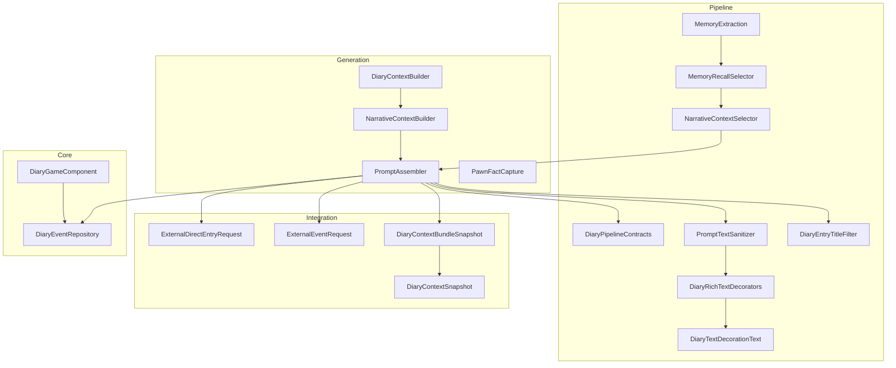
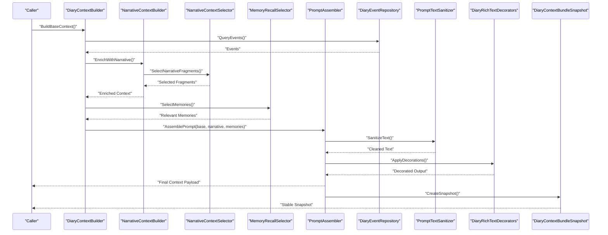
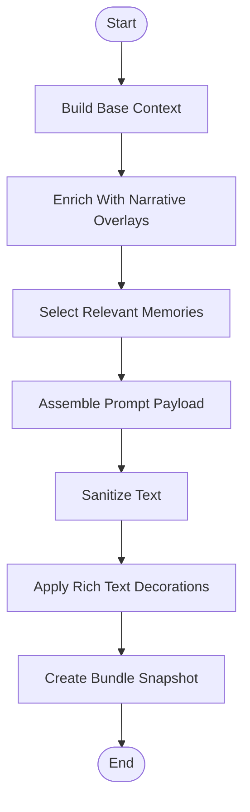
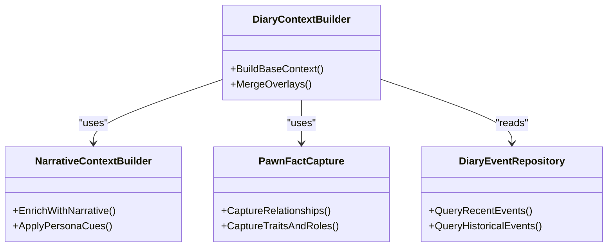
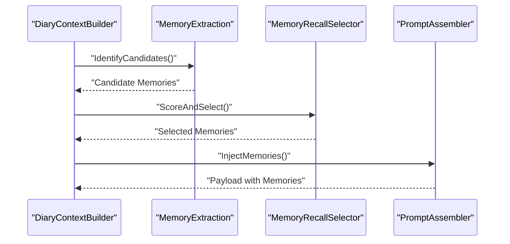
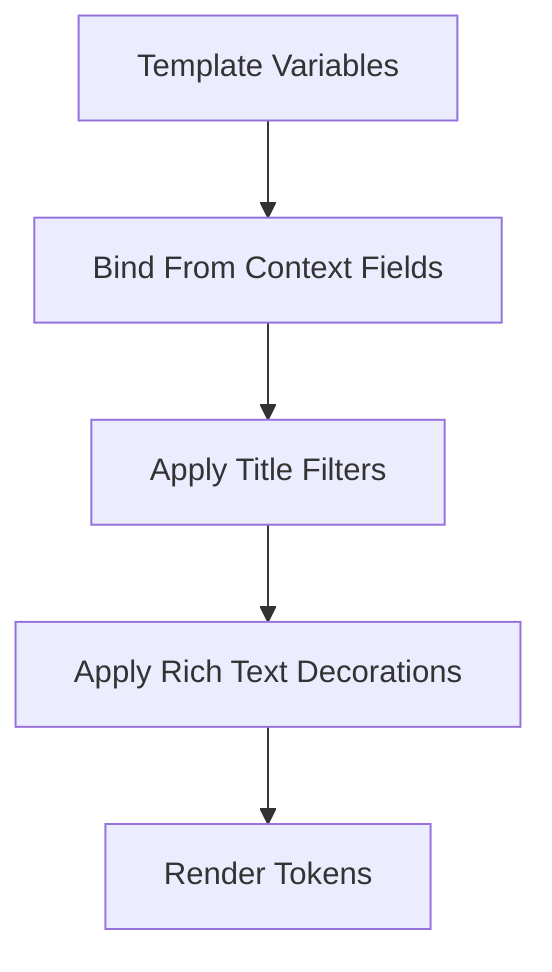
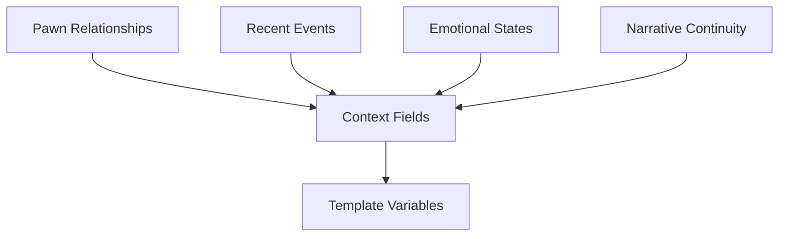
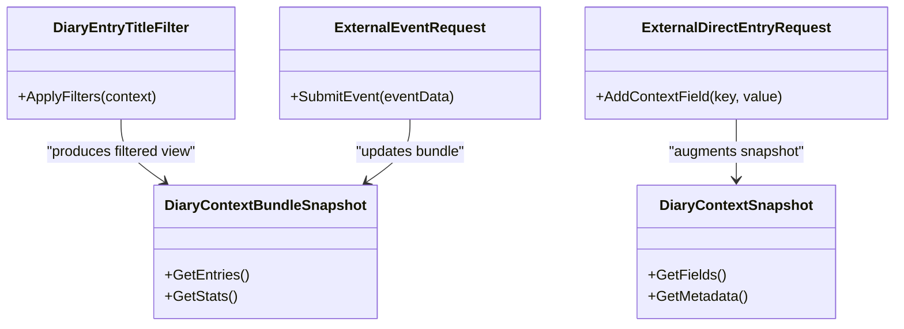
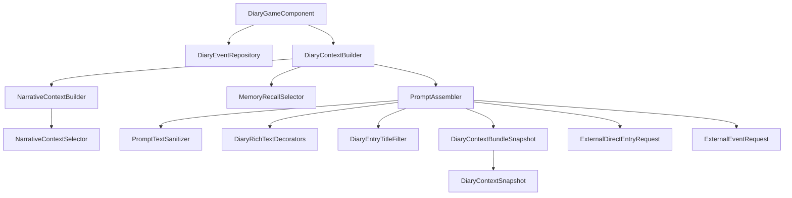

# Context Injection & Data Binding

- [DiaryContextBuilder.cs](../../../../../../Source/Generation/DiaryContextBuilder.cs)
- [NarrativeContextBuilder.cs](../../../../../../Source/Generation/NarrativeContextBuilder.cs)
- [PromptAssembler.cs](../../../../../../Source/Generation/PromptAssembler.cs)
- [PromptTextSanitizer.cs](../../../../../../Source/Pipeline/PromptTextSanitizer.cs)
- [MemoryExtraction.cs](../../../../../../Source/Pipeline/Memory/MemoryExtraction.cs)
- [MemoryRecallSelector.cs](../../../../../../Source/Pipeline/Memory/MemoryRecallSelector.cs)
- [NarrativeContextSelector.cs](../../../../../../Source/Pipeline/Narrative/NarrativeContextSelector.cs)
- [DiaryPipelineContracts.cs](../../../../../../Source/Pipeline/DiaryPipelineContracts.cs)
- [PawnFactCapture.cs](../../../../../../Source/Generation/PawnFactCapture.cs)
- [DiaryEventRepository.cs](../../../../../../Source/Core/DiaryEventRepository.cs)
- [DiaryGameComponent.cs](../../../../../../Source/Core/DiaryGameComponent.cs)
- [DiaryEntryTitleFilter.cs](../../../../../../Source/Pipeline/DiaryEntryTitleFilter.cs)
- [DiaryRichTextDecorators.cs](../../../../../../Source/Pipeline/DiaryRichTextDecorators.cs)
- [DiaryTextDecorationText.cs](../../../../../../Source/Pipeline/DiaryTextDecorationText.cs)
- [ExternalDirectEntryRequest.cs](../../../../../../Source/Integration/ExternalDirectEntryRequest.cs)
- [ExternalEventRequest.cs](../../../../../../Source/Integration/ExternalEventRequest.cs)
- [DiaryContextBundleSnapshot.cs](../../../../../../Source/Integration/DiaryContextBundleSnapshot.cs)
- [DiaryContextSnapshot.cs](../../../../../../Source/Integration/DiaryContextSnapshot.cs)
- [DiaryPromptEnchantmentCollector.cs](../../../../../../Source/Generation/PromptEnchantmentCollector.cs)
- [PromptEnchantments.cs](../../../../../../Source/Generation/PromptEnchantments.cs)
## Table of Contents
1. [Introduction](#introduction)
2. [Project Structure](#project-structure)
3. [Core Components](#core-components)
4. [Architecture Overview](#architecture-overview)
5. [Detailed Component Analysis](#detailed-component-analysis)
6. [Dependency Analysis](#dependency-analysis)
7. [Performance Considerations](#performance-considerations)
8. [Troubleshooting Guide](#troubleshooting-guide)
9. [Conclusion](#conclusion)
10. [Appendices](#appendices)

## Introduction
This document explains how contextual data is injected into templates and bound to template variables within the system. It covers the context building pipeline, data enrichment processes, memory integration patterns, and access to rich contextual information such as pawn relationships, recent events, emotional states, and narrative continuity. It also provides examples of advanced context queries, filtering mechanisms, and performance optimization techniques for large context datasets.

## Project Structure
The context injection and binding logic spans several layers:
- Generation layer builds structured context from game state and repositories.
- Pipeline layer selects, enriches, and formats context for prompts and templates.
- Integration layer exposes snapshots and requests for external consumers.
- Core layer persists and retrieves events and diary entries.

**Diagram sources**
- [DiaryContextBuilder.cs](../../../../../../Source/Generation/DiaryContextBuilder.cs)
- [NarrativeContextBuilder.cs](../../../../../../Source/Generation/NarrativeContextBuilder.cs)
- [PromptAssembler.cs](../../../../../../Source/Generation/PromptAssembler.cs)
- [DiaryPipelineContracts.cs](../../../../../../Source/Pipeline/DiaryPipelineContracts.cs)
- [MemoryExtraction.cs](../../../../../../Source/Pipeline/Memory/MemoryExtraction.cs)
- [MemoryRecallSelector.cs](../../../../../../Source/Pipeline/Memory/MemoryRecallSelector.cs)
- [NarrativeContextSelector.cs](../../../../../../Source/Pipeline/Narrative/NarrativeContextSelector.cs)
- [PromptTextSanitizer.cs](../../../../../../Source/Pipeline/PromptTextSanitizer.cs)
- [DiaryEntryTitleFilter.cs](../../../../../../Source/Pipeline/DiaryEntryTitleFilter.cs)
- [DiaryRichTextDecorators.cs](../../../../../../Source/Pipeline/DiaryRichTextDecorators.cs)
- [DiaryTextDecorationText.cs](../../../../../../Source/Pipeline/DiaryTextDecorationText.cs)
- [ExternalDirectEntryRequest.cs](../../../../../../Source/Integration/ExternalDirectEntryRequest.cs)
- [ExternalEventRequest.cs](../../../../../../Source/Integration/ExternalEventRequest.cs)
- [DiaryContextBundleSnapshot.cs](../../../../../../Source/Integration/DiaryContextBundleSnapshot.cs)
- [DiaryContextSnapshot.cs](../../../../../../Source/Integration/DiaryContextSnapshot.cs)
- [DiaryEventRepository.cs](../../../../../../Source/Core/DiaryEventRepository.cs)
- [DiaryGameComponent.cs](../../../../../../Source/Core/DiaryGameComponent.cs)

**Section sources**
- [DiaryContextBuilder.cs](../../../../../../Source/Generation/DiaryContextBuilder.cs)
- [NarrativeContextBuilder.cs](../../../../../../Source/Generation/NarrativeContextBuilder.cs)
- [PromptAssembler.cs](../../../../../../Source/Generation/PromptAssembler.cs)
- [DiaryPipelineContracts.cs](../../../../../../Source/Pipeline/DiaryPipelineContracts.cs)
- [MemoryExtraction.cs](../../../../../../Source/Pipeline/Memory/MemoryExtraction.cs)
- [MemoryRecallSelector.cs](../../../../../../Source/Pipeline/Memory/MemoryRecallSelector.cs)
- [NarrativeContextSelector.cs](../../../../../../Source/Pipeline/Narrative/NarrativeContextSelector.cs)
- [PromptTextSanitizer.cs](../../../../../../Source/Pipeline/PromptTextSanitizer.cs)
- [DiaryEntryTitleFilter.cs](../../../../../../Source/Pipeline/DiaryEntryTitleFilter.cs)
- [DiaryRichTextDecorators.cs](../../../../../../Source/Pipeline/DiaryRichTextDecorators.cs)
- [DiaryTextDecorationText.cs](../../../../../../Source/Pipeline/DiaryTextDecorationText.cs)
- [ExternalDirectEntryRequest.cs](../../../../../../Source/Integration/ExternalDirectEntryRequest.cs)
- [ExternalEventRequest.cs](../../../../../../Source/Integration/ExternalEventRequest.cs)
- [DiaryContextBundleSnapshot.cs](../../../../../../Source/Integration/DiaryContextBundleSnapshot.cs)
- [DiaryContextSnapshot.cs](../../../../../../Source/Integration/DiaryContextSnapshot.cs)
- [DiaryEventRepository.cs](../../../../../../Source/Core/DiaryEventRepository.cs)
- [DiaryGameComponent.cs](../../../../../../Source/Core/DiaryGameComponent.cs)

## Core Components
- DiaryContextBuilder: Orchestrates initial context assembly from core game state and repositories.
- NarrativeContextBuilder: Enriches context with narrative continuity, persona, and DLC-specific signals.
- PromptAssembler: Composes final prompt payload by merging base context, memories, and narrative overlays.
- MemoryExtraction and MemoryRecallSelector: Extract and select relevant memories for inclusion.
- NarrativeContextSelector: Chooses narrative fragments based on current scene and continuity rules.
- PromptTextSanitizer: Cleans and normalizes text before decoration and rendering.
- DiaryEntryTitleFilter: Applies filters to title generation and display.
- DiaryRichTextDecorators and DiaryTextDecorationText: Apply decorations and renderable text tokens.
- ExternalDirectEntryRequest and ExternalEventRequest: Define request contracts for injecting external context.
- DiaryContextBundleSnapshot and DiaryContextSnapshot: Provide stable snapshots for inspection and debugging.
- PawnFactCapture: Captures structured facts about pawns (relationships, traits, roles).
- DiaryEventRepository and DiaryGameComponent: Persist and retrieve events and coordinate lifecycle.

**Section sources**
- [DiaryContextBuilder.cs](../../../../../../Source/Generation/DiaryContextBuilder.cs)
- [NarrativeContextBuilder.cs](../../../../../../Source/Generation/NarrativeContextBuilder.cs)
- [PromptAssembler.cs](../../../../../../Source/Generation/PromptAssembler.cs)
- [MemoryExtraction.cs](../../../../../../Source/Pipeline/Memory/MemoryExtraction.cs)
- [MemoryRecallSelector.cs](../../../../../../Source/Pipeline/Memory/MemoryRecallSelector.cs)
- [NarrativeContextSelector.cs](../../../../../../Source/Pipeline/Narrative/NarrativeContextSelector.cs)
- [PromptTextSanitizer.cs](../../../../../../Source/Pipeline/PromptTextSanitizer.cs)
- [DiaryEntryTitleFilter.cs](../../../../../../Source/Pipeline/DiaryEntryTitleFilter.cs)
- [DiaryRichTextDecorators.cs](../../../../../../Source/Pipeline/DiaryRichTextDecorators.cs)
- [DiaryTextDecorationText.cs](../../../../../../Source/Pipeline/DiaryTextDecorationText.cs)
- [ExternalDirectEntryRequest.cs](../../../../../../Source/Integration/ExternalDirectEntryRequest.cs)
- [ExternalEventRequest.cs](../../../../../../Source/Integration/ExternalEventRequest.cs)
- [DiaryContextBundleSnapshot.cs](../../../../../../Source/Integration/DiaryContextBundleSnapshot.cs)
- [DiaryContextSnapshot.cs](../../../../../../Source/Integration/DiaryContextSnapshot.cs)
- [PawnFactCapture.cs](../../../../../../Source/Generation/PawnFactCapture.cs)
- [DiaryEventRepository.cs](../../../../../../Source/Core/DiaryEventRepository.cs)
- [DiaryGameComponent.cs](../../../../../../Source/Core/DiaryGameComponent.cs)

## Architecture Overview
The context injection pipeline follows a staged approach:
- Build base context from game state and repositories.
- Enrich with narrative continuity and DLC-specific overlays.
- Select and extract relevant memories.
- Assemble prompt payload and apply sanitization and decorations.
- Produce snapshots and integrate with external entry/event requests.

**Diagram sources**
- [DiaryContextBuilder.cs](../../../../../../Source/Generation/DiaryContextBuilder.cs)
- [NarrativeContextBuilder.cs](../../../../../../Source/Generation/NarrativeContextBuilder.cs)
- [NarrativeContextSelector.cs](../../../../../../Source/Pipeline/Narrative/NarrativeContextSelector.cs)
- [MemoryRecallSelector.cs](../../../../../../Source/Pipeline/Memory/MemoryRecallSelector.cs)
- [PromptAssembler.cs](../../../../../../Source/Generation/PromptAssembler.cs)
- [DiaryEventRepository.cs](../../../../../../Source/Core/DiaryEventRepository.cs)
- [PromptTextSanitizer.cs](../../../../../../Source/Pipeline/PromptTextSanitizer.cs)
- [DiaryRichTextDecorators.cs](../../../../../../Source/Pipeline/DiaryRichTextDecorators.cs)
- [DiaryContextBundleSnapshot.cs](../../../../../../Source/Integration/DiaryContextBundleSnapshot.cs)

## Detailed Component Analysis

### Context Building Pipeline
The pipeline constructs a layered context:
- Base context includes pawn identity, colony state, and event history.
- Narrative overlay adds continuity markers, persona cues, and DLC-specific context.
- Memory selection pulls salient past events aligned with current scene.
- Assembly merges these layers into a prompt-ready structure.

**Diagram sources**
- [DiaryContextBuilder.cs](../../../../../../Source/Generation/DiaryContextBuilder.cs)
- [NarrativeContextBuilder.cs](../../../../../../Source/Generation/NarrativeContextBuilder.cs)
- [NarrativeContextSelector.cs](../../../../../../Source/Pipeline/Narrative/NarrativeContextSelector.cs)
- [MemoryRecallSelector.cs](../../../../../../Source/Pipeline/Memory/MemoryRecallSelector.cs)
- [PromptAssembler.cs](../../../../../../Source/Generation/PromptAssembler.cs)
- [PromptTextSanitizer.cs](../../../../../../Source/Pipeline/PromptTextSanitizer.cs)
- [DiaryRichTextDecorators.cs](../../../../../../Source/Pipeline/DiaryRichTextDecorators.cs)
- [DiaryContextBundleSnapshot.cs](../../../../../../Source/Integration/DiaryContextBundleSnapshot.cs)

**Section sources**
- [DiaryContextBuilder.cs](../../../../../../Source/Generation/DiaryContextBuilder.cs)
- [NarrativeContextBuilder.cs](../../../../../../Source/Generation/NarrativeContextBuilder.cs)
- [NarrativeContextSelector.cs](../../../../../../Source/Pipeline/Narrative/NarrativeContextSelector.cs)
- [MemoryRecallSelector.cs](../../../../../../Source/Pipeline/Memory/MemoryRecallSelector.cs)
- [PromptAssembler.cs](../../../../../../Source/Generation/PromptAssembler.cs)
- [PromptTextSanitizer.cs](../../../../../../Source/Pipeline/PromptTextSanitizer.cs)
- [DiaryRichTextDecorators.cs](../../../../../../Source/Pipeline/DiaryRichTextDecorators.cs)
- [DiaryContextBundleSnapshot.cs](../../../../../../Source/Integration/DiaryContextBundleSnapshot.cs)

### Data Enrichment Processes
- Narrative enrichment integrates continuity markers and persona-driven cues.
- DLC overlays add domain-specific context (e.g., anomalies, royalty, odyssey).
- Fact capture extracts structured pawn attributes and relationships.
- Event repository supplies recent events and historical context.

**Diagram sources**
- [DiaryContextBuilder.cs](../../../../../../Source/Generation/DiaryContextBuilder.cs)
- [NarrativeContextBuilder.cs](../../../../../../Source/Generation/NarrativeContextBuilder.cs)
- [PawnFactCapture.cs](../../../../../../Source/Generation/PawnFactCapture.cs)
- [DiaryEventRepository.cs](../../../../../../Source/Core/DiaryEventRepository.cs)

**Section sources**
- [DiaryContextBuilder.cs](../../../../../../Source/Generation/DiaryContextBuilder.cs)
- [NarrativeContextBuilder.cs](../../../../../../Source/Generation/NarrativeContextBuilder.cs)
- [PawnFactCapture.cs](../../../../../../Source/Generation/PawnFactCapture.cs)
- [DiaryEventRepository.cs](../../../../../../Source/Core/DiaryEventRepository.cs)

### Memory Integration Patterns
- Memory extraction identifies candidate memories from event streams.
- Recall selector applies relevance scoring and constraints (time window, topic alignment).
- Selected memories are merged into the prompt payload with metadata.

**Diagram sources**
- [MemoryExtraction.cs](../../../../../../Source/Pipeline/Memory/MemoryExtraction.cs)
- [MemoryRecallSelector.cs](../../../../../../Source/Pipeline/Memory/MemoryRecallSelector.cs)
- [PromptAssembler.cs](../../../../../../Source/Generation/PromptAssembler.cs)
- [DiaryContextBuilder.cs](../../../../../../Source/Generation/DiaryContextBuilder.cs)

**Section sources**
- [MemoryExtraction.cs](../../../../../../Source/Pipeline/Memory/MemoryExtraction.cs)
- [MemoryRecallSelector.cs](../../../../../../Source/Pipeline/Memory/MemoryRecallSelector.cs)
- [PromptAssembler.cs](../../../../../../Source/Generation/PromptAssembler.cs)
- [DiaryContextBuilder.cs](../../../../../../Source/Generation/DiaryContextBuilder.cs)

### Template Variable Binding
- Prompt assembler binds contextual fields to template variables using contract definitions.
- Title filter influences variable values for titles and summaries.
- Rich text decorators transform variables into decorated tokens for rendering.

**Diagram sources**
- [PromptAssembler.cs](../../../../../../Source/Generation/PromptAssembler.cs)
- [DiaryEntryTitleFilter.cs](../../../../../../Source/Pipeline/DiaryEntryTitleFilter.cs)
- [DiaryRichTextDecorators.cs](../../../../../../Source/Pipeline/DiaryRichTextDecorators.cs)
- [DiaryTextDecorationText.cs](../../../../../../Source/Pipeline/DiaryTextDecorationText.cs)
- [DiaryPipelineContracts.cs](../../../../../../Source/Pipeline/DiaryPipelineContracts.cs)

**Section sources**
- [PromptAssembler.cs](../../../../../../Source/Generation/PromptAssembler.cs)
- [DiaryEntryTitleFilter.cs](../../../../../../Source/Pipeline/DiaryEntryTitleFilter.cs)
- [DiaryRichTextDecorators.cs](../../../../../../Source/Pipeline/DiaryRichTextDecorators.cs)
- [DiaryTextDecorationText.cs](../../../../../../Source/Pipeline/DiaryTextDecorationText.cs)
- [DiaryPipelineContracts.cs](../../../../../../Source/Pipeline/DiaryPipelineContracts.cs)

### Accessing Rich Contextual Information
- Pawn relationships: captured via fact capture and included in base context.
- Recent events: retrieved from event repository and filtered by time/topic.
- Emotional states: derived from thought and mood events; enriched by narrative builder.
- Narrative continuity: maintained through narrative overlays and selectors.

[No sources needed since this diagram shows conceptual workflow, not actual code structure]

**Section sources**
- [PawnFactCapture.cs](../../../../../../Source/Generation/PawnFactCapture.cs)
- [DiaryEventRepository.cs](../../../../../../Source/Core/DiaryEventRepository.cs)
- [NarrativeContextBuilder.cs](../../../../../../Source/Generation/NarrativeContextBuilder.cs)
- [NarrativeContextSelector.cs](../../../../../../Source/Pipeline/Narrative/NarrativeContextSelector.cs)

### Advanced Context Queries and Filtering
- Use entry title filters to constrain context scope for titles and summaries.
- Leverage snapshot types to inspect bundle contents and individual contexts.
- Employ external request contracts to inject additional context from outside sources.

**Diagram sources**
- [DiaryEntryTitleFilter.cs](../../../../../../Source/Pipeline/DiaryEntryTitleFilter.cs)
- [DiaryContextBundleSnapshot.cs](../../../../../../Source/Integration/DiaryContextBundleSnapshot.cs)
- [DiaryContextSnapshot.cs](../../../../../../Source/Integration/DiaryContextSnapshot.cs)
- [ExternalDirectEntryRequest.cs](../../../../../../Source/Integration/ExternalDirectEntryRequest.cs)
- [ExternalEventRequest.cs](../../../../../../Source/Integration/ExternalEventRequest.cs)

**Section sources**
- [DiaryEntryTitleFilter.cs](../../../../../../Source/Pipeline/DiaryEntryTitleFilter.cs)
- [DiaryContextBundleSnapshot.cs](../../../../../../Source/Integration/DiaryContextBundleSnapshot.cs)
- [DiaryContextSnapshot.cs](../../../../../../Source/Integration/DiaryContextSnapshot.cs)
- [ExternalDirectEntryRequest.cs](../../../../../../Source/Integration/ExternalDirectEntryRequest.cs)
- [ExternalEventRequest.cs](../../../../../../Source/Integration/ExternalEventRequest.cs)

### Performance Optimization Techniques
- Limit memory recall windows and relevance thresholds to reduce payload size.
- Defer heavy decorations until necessary rendering stages.
- Cache frequently accessed context snapshots where appropriate.
- Batch external event submissions to minimize overhead.

[No sources needed since this section provides general guidance]

## Dependency Analysis
The following diagram highlights key dependencies between components involved in context injection and binding.

**Diagram sources**
- [DiaryGameComponent.cs](../../../../../../Source/Core/DiaryGameComponent.cs)
- [DiaryEventRepository.cs](../../../../../../Source/Core/DiaryEventRepository.cs)
- [DiaryContextBuilder.cs](../../../../../../Source/Generation/DiaryContextBuilder.cs)
- [NarrativeContextBuilder.cs](../../../../../../Source/Generation/NarrativeContextBuilder.cs)
- [NarrativeContextSelector.cs](../../../../../../Source/Pipeline/Narrative/NarrativeContextSelector.cs)
- [MemoryRecallSelector.cs](../../../../../../Source/Pipeline/Memory/MemoryRecallSelector.cs)
- [PromptAssembler.cs](../../../../../../Source/Generation/PromptAssembler.cs)
- [PromptTextSanitizer.cs](../../../../../../Source/Pipeline/PromptTextSanitizer.cs)
- [DiaryRichTextDecorators.cs](../../../../../../Source/Pipeline/DiaryRichTextDecorators.cs)
- [DiaryEntryTitleFilter.cs](../../../../../../Source/Pipeline/DiaryEntryTitleFilter.cs)
- [DiaryContextBundleSnapshot.cs](../../../../../../Source/Integration/DiaryContextBundleSnapshot.cs)
- [DiaryContextSnapshot.cs](../../../../../../Source/Integration/DiaryContextSnapshot.cs)
- [ExternalDirectEntryRequest.cs](../../../../../../Source/Integration/ExternalDirectEntryRequest.cs)
- [ExternalEventRequest.cs](../../../../../../Source/Integration/ExternalEventRequest.cs)

**Section sources**
- [DiaryGameComponent.cs](../../../../../../Source/Core/DiaryGameComponent.cs)
- [DiaryEventRepository.cs](../../../../../../Source/Core/DiaryEventRepository.cs)
- [DiaryContextBuilder.cs](../../../../../../Source/Generation/DiaryContextBuilder.cs)
- [NarrativeContextBuilder.cs](../../../../../../Source/Generation/NarrativeContextBuilder.cs)
- [NarrativeContextSelector.cs](../../../../../../Source/Pipeline/Narrative/NarrativeContextSelector.cs)
- [MemoryRecallSelector.cs](../../../../../../Source/Pipeline/Memory/MemoryRecallSelector.cs)
- [PromptAssembler.cs](../../../../../../Source/Generation/PromptAssembler.cs)
- [PromptTextSanitizer.cs](../../../../../../Source/Pipeline/PromptTextSanitizer.cs)
- [DiaryRichTextDecorators.cs](../../../../../../Source/Pipeline/DiaryRichTextDecorators.cs)
- [DiaryEntryTitleFilter.cs](../../../../../../Source/Pipeline/DiaryEntryTitleFilter.cs)
- [DiaryContextBundleSnapshot.cs](../../../../../../Source/Integration/DiaryContextBundleSnapshot.cs)
- [DiaryContextSnapshot.cs](../../../../../../Source/Integration/DiaryContextSnapshot.cs)
- [ExternalDirectEntryRequest.cs](../../../../../../Source/Integration/ExternalDirectEntryRequest.cs)
- [ExternalEventRequest.cs](../../../../../../Source/Integration/ExternalEventRequest.cs)

## Performance Considerations
- Prefer scoped queries to event repositories to avoid scanning entire histories.
- Use selective memory recall strategies that align with current narrative focus.
- Minimize decoration passes by gating them behind rendering needs.
- Aggregate external context updates to reduce repeated injections.

[No sources needed since this section provides general guidance]

## Troubleshooting Guide
- Inspect snapshots to validate context composition and field bindings.
- Review sanitizer outputs to ensure text normalization did not remove critical tokens.
- Check decorator application logs to confirm decorations were applied as expected.
- Validate external request payloads to ensure correct field names and values.

**Section sources**
- [DiaryContextBundleSnapshot.cs](../../../../../../Source/Integration/DiaryContextBundleSnapshot.cs)
- [DiaryContextSnapshot.cs](../../../../../../Source/Integration/DiaryContextSnapshot.cs)
- [PromptTextSanitizer.cs](../../../../../../Source/Pipeline/PromptTextSanitizer.cs)
- [DiaryRichTextDecorators.cs](../../../../../../Source/Pipeline/DiaryRichTextDecorators.cs)
- [ExternalDirectEntryRequest.cs](../../../../../../Source/Integration/ExternalDirectEntryRequest.cs)
- [ExternalEventRequest.cs](../../../../../../Source/Integration/ExternalEventRequest.cs)

## Conclusion
The system’s context injection pipeline composes base game state, narrative overlays, and selected memories into a prompt-ready payload. Template variables are bound through contract-defined fields, sanitized, decorated, and exposed via stable snapshots. By leveraging relationship facts, recent events, emotional states, and continuity markers, the pipeline delivers rich, coherent context suitable for advanced querying and filtering while maintaining performance through selective recall and deferred decoration.

## Appendices

### Example: Advanced Context Query Patterns
- Filter context by title keywords and date ranges using entry title filters.
- Augment context with external fields via direct entry requests.
- Submit external events to update bundles and refresh snapshots.

**Section sources**
- [DiaryEntryTitleFilter.cs](../../../../../../Source/Pipeline/DiaryEntryTitleFilter.cs)
- [ExternalDirectEntryRequest.cs](../../../../../../Source/Integration/ExternalDirectEntryRequest.cs)
- [ExternalEventRequest.cs](../../../../../../Source/Integration/ExternalEventRequest.cs)

### Example: Prompt Enchantment Integration
- Collect enchantment candidates and apply them during assembly to enhance narrative flavor.

**Section sources**
- [PromptEnchantmentCollector.cs](../../../../../../Source/Generation/PromptEnchantmentCollector.cs)
- [PromptEnchantments.cs](../../../../../../Source/Generation/PromptEnchantments.cs)
