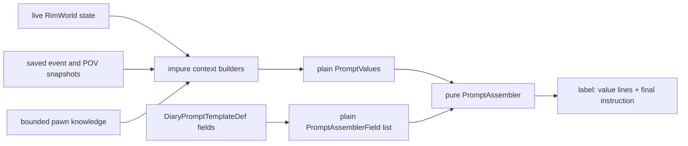

# Context Injection & Data Binding

Pawn Diary prompt templates use an explicit field map, not a general template-expression language.
Every field has a model-facing `label`, a stable `source` token, an optional `contextKey`, and an
`enabled` flag.

## Data flow

```mermaid
flowchart LR
    Game["live RimWorld state"] --> Builder["impure context builders"]
    Saved["saved event and POV snapshots"] --> Builder
    Knowledge["bounded pawn knowledge"] --> Builder
    Builder --> Values["plain PromptValues"]
    XML["DiaryPromptTemplateDef fields"] --> Fields["plain PromptAssemblerField list"]
    Values --> Assembler["pure PromptAssembler"]
    Fields --> Assembler
    Assembler --> Prompt["label: value lines + final instruction"]
```

The game-facing adapters collect names, event facts, setting, belief/DLC context, narrative
continuity, and bounded knowledge. They resolve those facts to strings before entering the pure
renderer. This prevents live `Pawn`, `Def`, settings, and persistence objects from leaking into
template assembly.

## Stable source tokens

`PromptAssembler` maps each field's `source` to a member of `PromptValues`. Current tokens include
event/POV facts, pawn summary, writing style, event policy, setting, tone, relationship, narrative
context, memory context, identity, event-time mood, belief context, continuity lines, weapon,
death/arrival fields, entry text, and `GameContext`.

`GameContext` is the only keyed lookup. Its `contextKey` selects one exact value from the saved
`"; key=value"` string. Multi-value facts must not contain `"; "`; callers use the repository's
comma-joining helper instead.

The stable source token is named `MemoryContext` for prompt-contract compatibility. Current
persistent recall comes from the bounded knowledge system (`PawnKnowledgeState` and the knowledge
selectors), not the removed `PawnMemoryRepository`/`MemoryFragment` implementation.

## Rendering rules

- Disabled fields are skipped.
- Empty values and the exact sentinels `none`, `n/a`, and `unknown` are omitted.
- A blank label falls back to the source token.
- An optional culture annotation is appended only after a real value is resolved; it cannot make an
  empty field appear.
- The final instruction is appended as its own paragraph after the structured fields.
- The writing-style block is appended to the system prompt only when the selected template allows it.

There are no XML loops, arbitrary conditionals, reflection-based property paths, or string helper
functions. Adding a new source requires an explicit DTO field and resolver mapping in code, plus
focused pure tests.

## XML reference

- [DiaryPromptTemplateDef](../Generated%20Def%20Reference/DiaryPromptTemplateDef.md)
- [DiaryContextDetailDef](../Generated%20Def%20Reference/DiaryContextDetailDef.md)
- [DiaryContextReactionDef](../Generated%20Def%20Reference/DiaryContextReactionDef.md)
- [DiaryCultureTopicDef](../Generated%20Def%20Reference/DiaryCultureTopicDef.md)
- [DiaryKnowledgeTuningDef](../Generated%20Def%20Reference/DiaryKnowledgeTuningDef.md)

## Implementation

- [PromptAssembler.cs](../../../../../../Source/Generation/PromptAssembler.cs)
- [DiaryContextFields.cs](../../../../../../Source/Generation/DiaryContextFields.cs)
- [DiaryContextBuilder.cs](../../../../../../Source/Generation/DiaryContextBuilder.cs)
- [PromptArchitectureDefs.cs](../../../../../../Source/Defs/PromptArchitectureDefs.cs)
- [PawnKnowledgeState.cs](../../../../../../Source/Models/PawnKnowledgeState.cs)
- [ImportantMemorySelector.cs](../../../../../../Source/Pipeline/Knowledge/ImportantMemorySelector.cs)

[Back to Prompt Templates](Prompt%20Templates.md) ·
[Generated Def Reference](../Generated%20Def%20Reference/Generated%20Def%20Reference.md)
