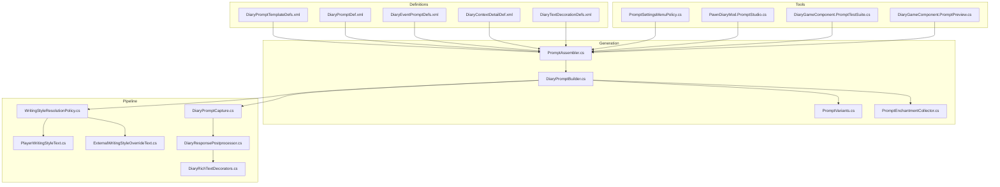
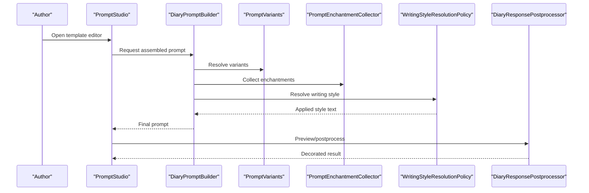
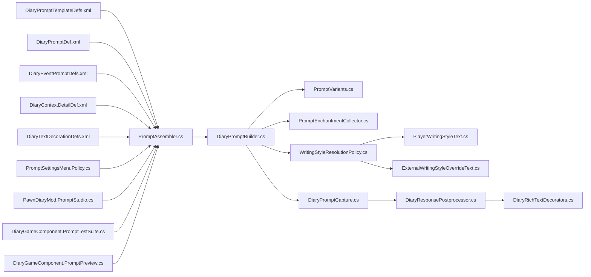

# Creating Custom Templates

<cite>
**Referenced Files in This Document**
- [DiaryPromptTemplateDefs.xml](../../../../../../1.6/Defs/DiaryPromptTemplateDefs.xml)
- [DiaryPromptDef.xml](../../../../../../1.6/Defs/DiaryPromptDef.xml)
- [DiaryEventPromptDefs.xml](../../../../../../1.6/Defs/DiaryEventPromptDefs.xml)
- [DiaryContextDetailDef.xml](../../../../../../1.6/Defs/DiaryContextDetailDef.xml)
- [DiaryTextDecorationDefs.xml](../../../../../../1.6/Defs/DiaryTextDecorationDefs.xml)
- [PromptAssembler.cs](../../../../../../Source/Generation/PromptAssembler.cs)
- [DiaryPromptBuilder.cs](../../../../../../Source/Generation/DiaryPromptBuilder.cs)
- [PromptVariants.cs](../../../../../../Source/Generation/PromptVariants.cs)
- [PromptEnchantmentCollector.cs](../../../../../../Source/Generation/PromptEnchantmentCollector.cs)
- [WritingStyleResolutionPolicy.cs](../../../../../../Source/Pipeline/WritingStyleResolutionPolicy.cs)
- [PlayerWritingStyleText.cs](../../../../../../Source/Pipeline/PlayerWritingStyleText.cs)
- [ExternalWritingStyleOverrideText.cs](../../../../../../Source/Pipeline/ExternalWritingStyleOverrideText.cs)
- [DiaryPromptCapture.cs](../../../../../../Source/Pipeline/DiaryPromptCapture.cs)
- [DiaryResponsePostprocessor.cs](../../../../../../Source/Pipeline/DiaryResponsePostprocessor.cs)
- [DiaryRichTextDecorators.cs](../../../../../../Source/Pipeline/DiaryRichTextDecorators.cs)
- [PromptSettingsMenuPolicy.cs](../../../../../../Source/Settings/PromptSettingsMenuPolicy.cs)
- [PawnDiaryMod.PromptStudio.cs](../../../../../../Source/Settings/PawnDiaryMod.PromptStudio.cs)
- [DiaryGameComponent.PromptTestSuite.cs](../../../../../../Source/Core/DiaryGameComponent.PromptTestSuite.cs)
- [DiaryGameComponent.PromptPreview.cs](../../../../../../Source/Core/DiaryGameComponent.PromptPreview.cs)
- [PromptArchitectureDefs.cs](../../../../../../Source/Defs/PromptArchitectureDefs.cs)
</cite>

## Table of Contents
1. [Introduction](#introduction)
2. [Project Structure](#project-structure)
3. [Core Components](#core-components)
4. [Architecture Overview](#architecture-overview)
5. [Detailed Component Analysis](#detailed-component-analysis)
6. [Dependency Analysis](#dependency-analysis)
7. [Performance Considerations](#performance-considerations)
8. [Troubleshooting Guide](#troubleshooting-guide)
9. [Conclusion](#conclusion)
10. [Appendices](#appendices)

## Introduction
This guide explains how to create custom prompt templates for the Diary system. It covers the XML definition structure, required and optional fields, template inheritance and override mechanisms, and provides complete examples for unique event types, specialized writing styles, and persona-specific behaviors. It also includes testing strategies, performance considerations, and compatibility notes across RimWorld versions.

## Project Structure
Custom prompt templates are defined primarily through XML definitions under the versioned Defs folder and processed by C# components that assemble prompts at runtime. The key areas are:
- Definitions: XML files defining prompt templates, prompts, context details, and text decorations.
- Generation pipeline: C# classes that load definitions, resolve variants, apply enchantments, and build final prompts.
- Pipeline policies: Writing style resolution and post-processing.
- Tools: Settings UI and test suites for previewing and validating templates.

**Diagram sources**
- [DiaryPromptTemplateDefs.xml](../../../../../../1.6/Defs/DiaryPromptTemplateDefs.xml)
- [DiaryPromptDef.xml](../../../../../../1.6/Defs/DiaryPromptDef.xml)
- [DiaryEventPromptDefs.xml](../../../../../../1.6/Defs/DiaryEventPromptDefs.xml)
- [DiaryContextDetailDef.xml](../../../../../../1.6/Defs/DiaryContextDetailDef.xml)
- [DiaryTextDecorationDefs.xml](../../../../../../1.6/Defs/DiaryTextDecorationDefs.xml)
- [PromptAssembler.cs](../../../../../../Source/Generation/PromptAssembler.cs)
- [DiaryPromptBuilder.cs](../../../../../../Source/Generation/DiaryPromptBuilder.cs)
- [PromptVariants.cs](../../../../../../Source/Generation/PromptVariants.cs)
- [PromptEnchantmentCollector.cs](../../../../../../Source/Generation/PromptEnchantmentCollector.cs)
- [WritingStyleResolutionPolicy.cs](../../../../../../Source/Pipeline/WritingStyleResolutionPolicy.cs)
- [PlayerWritingStyleText.cs](../../../../../../Source/Pipeline/PlayerWritingStyleText.cs)
- [ExternalWritingStyleOverrideText.cs](../../../../../../Source/Pipeline/ExternalWritingStyleOverrideText.cs)
- [DiaryPromptCapture.cs](../../../../../../Source/Pipeline/DiaryPromptCapture.cs)
- [DiaryResponsePostprocessor.cs](../../../../../../Source/Pipeline/DiaryResponsePostprocessor.cs)
- [DiaryRichTextDecorators.cs](../../../../../../Source/Pipeline/DiaryRichTextDecorators.cs)
- [PromptSettingsMenuPolicy.cs](../../../../../../Source/Settings/PromptSettingsMenuPolicy.cs)
- [PawnDiaryMod.PromptStudio.cs](../../../../../../Source/Settings/PawnDiaryMod.PromptStudio.cs)
- [DiaryGameComponent.PromptTestSuite.cs](../../../../../../Source/Core/DiaryGameComponent.PromptTestSuite.cs)
- [DiaryGameComponent.PromptPreview.cs](../../../../../../Source/Core/DiaryGameComponent.PromptPreview.cs)

**Section sources**
- [PromptArchitectureDefs.cs](../../../../../../Source/Defs/PromptArchitectureDefs.cs)

## Core Components
- Prompt template definitions (XML): Define reusable prompt structures, placeholders, and configuration options.
- Prompt definitions (XML): Bind events or contexts to specific templates and parameters.
- Context detail definitions (XML): Provide structured data used by templates during rendering.
- Text decoration definitions (XML): Control rich text formatting applied to generated content.
- Assembler and builder (C#): Load definitions, resolve inheritance, apply variants/enchantments, and produce final prompts.
- Writing style resolution (C#): Select and apply player or external writing styles to influence tone and phrasing.
- Postprocessing (C#): Capture, sanitize, decorate, and finalize output.
- Tools (C#): Menus and utilities for authoring, previewing, and testing templates.

**Section sources**
- [DiaryPromptTemplateDefs.xml](../../../../../../1.6/Defs/DiaryPromptTemplateDefs.xml)
- [DiaryPromptDef.xml](../../../../../../1.6/Defs/DiaryPromptDef.xml)
- [DiaryContextDetailDef.xml](../../../../../../1.6/Defs/DiaryContextDetailDef.xml)
- [DiaryTextDecorationDefs.xml](../../../../../../1.6/Defs/DiaryTextDecorationDefs.xml)
- [PromptAssembler.cs](../../../../../../Source/Generation/PromptAssembler.cs)
- [DiaryPromptBuilder.cs](../../../../../../Source/Generation/DiaryPromptBuilder.cs)
- [PromptVariants.cs](../../../../../../Source/Generation/PromptVariants.cs)
- [PromptEnchantmentCollector.cs](../../../../../../Source/Generation/PromptEnchantmentCollector.cs)
- [WritingStyleResolutionPolicy.cs](../../../../../../Source/Pipeline/WritingStyleResolutionPolicy.cs)
- [PlayerWritingStyleText.cs](../../../../../../Source/Pipeline/PlayerWritingStyleText.cs)
- [ExternalWritingStyleOverrideText.cs](../../../../../../Source/Pipeline/ExternalWritingStyleOverrideText.cs)
- [DiaryPromptCapture.cs](../../../../../../Source/Pipeline/DiaryPromptCapture.cs)
- [DiaryResponsePostprocessor.cs](../../../../../../Source/Pipeline/DiaryResponsePostprocessor.cs)
- [DiaryRichTextDecorators.cs](../../../../../../Source/Pipeline/DiaryRichTextDecorators.cs)
- [PromptSettingsMenuPolicy.cs](../../../../../../Source/Settings/PromptSettingsMenuPolicy.cs)
- [PawnDiaryMod.PromptStudio.cs](../../../../../../Source/Settings/PawnDiaryMod.PromptStudio.cs)

## Architecture Overview
The template system loads XML definitions into memory, resolves inheritance and overrides, applies contextual data and writing styles, and produces a final prompt string ready for generation.

**Diagram sources**
- [DiaryPromptBuilder.cs](../../../../../../Source/Generation/DiaryPromptBuilder.cs)
- [PromptVariants.cs](../../../../../../Source/Generation/PromptVariants.cs)
- [PromptEnchantmentCollector.cs](../../../../../../Source/Generation/PromptEnchantmentCollector.cs)
- [WritingStyleResolutionPolicy.cs](../../../../../../Source/Pipeline/WritingStyleResolutionPolicy.cs)
- [DiaryResponsePostprocessor.cs](../../../../../../Source/Pipeline/DiaryResponsePostprocessor.cs)
- [PawnDiaryMod.PromptStudio.cs](../../../../../../Source/Settings/PawnDiaryMod.PromptStudio.cs)

## Detailed Component Analysis

### XML Definition Structure
- Template definitions: Define reusable prompt skeletons with placeholders and configuration options.
- Prompt definitions: Map events or contexts to templates and provide runtime values for placeholders.
- Context detail definitions: Provide typed fields consumed by templates.
- Text decoration definitions: Specify rich text tokens and formatting rules.

Key responsibilities:
- Template definitions declare base structures and inheritable sections.
- Prompt definitions select a template and bind variables from game state.
- Context details supply structured inputs for dynamic content.
- Text decorations control visual presentation.

**Section sources**
- [DiaryPromptTemplateDefs.xml](../../../../../../1.6/Defs/DiaryPromptTemplateDefs.xml)
- [DiaryPromptDef.xml](../../../../../../1.6/Defs/DiaryPromptDef.xml)
- [DiaryContextDetailDef.xml](../../../../../../1.6/Defs/DiaryContextDetailDef.xml)
- [DiaryTextDecorationDefs.xml](../../../../../../1.6/Defs/DiaryTextDecorationDefs.xml)

### Required Fields and Optional Configuration
- Required fields typically include identifiers linking prompts to templates and essential placeholders for dynamic content.
- Optional configuration may include variant selectors, enchantment toggles, writing style hints, and decoration flags.

Guidelines:
- Ensure all required placeholders are provided by context or prompt bindings.
- Use optional fields to refine tone, length, and emphasis without breaking core logic.
- Validate placeholder names against template expectations to avoid runtime errors.

**Section sources**
- [DiaryPromptTemplateDefs.xml](../../../../../../1.6/Defs/DiaryPromptTemplateDefs.xml)
- [DiaryPromptDef.xml](../../../../../../1.6/Defs/DiaryPromptDef.xml)

### Template Inheritance and Overrides
Inheritance allows a template to extend a base template, overriding sections or adding new placeholders. Overrides can be applied at:
- Definition level: A child template redefines inherited blocks.
- Runtime level: Prompt definitions choose a variant or inject overrides via enchantments.

Best practices:
- Keep base templates generic; specialize via inheritance.
- Use clear naming conventions for overridden sections.
- Test inheritance chains thoroughly to ensure no missing placeholders.

**Section sources**
- [DiaryPromptTemplateDefs.xml](../../../../../../1.6/Defs/DiaryPromptTemplateDefs.xml)
- [PromptVariants.cs](../../../../../../Source/Generation/PromptVariants.cs)
- [PromptEnchantmentCollector.cs](../../../../../../Source/Generation/PromptEnchantmentCollector.cs)

### Complete Examples

#### Unique Event Type Template
Use a dedicated template for a novel event type:
- Create a template definition tailored to the event’s context fields.
- Bind a prompt definition to the event source, supplying required placeholders.
- Optionally add text decorations for emphasis on event-specific terms.

Steps:
1. Define a new template with placeholders for event-specific data.
2. Add a prompt definition mapping the event to the template.
3. Provide context details if needed for richer content.
4. Apply text decorations to highlight important elements.

**Section sources**
- [DiaryPromptTemplateDefs.xml](../../../../../../1.6/Defs/DiaryPromptTemplateDefs.xml)
- [DiaryPromptDef.xml](../../../../../../1.6/Defs/DiaryPromptDef.xml)
- [DiaryContextDetailDef.xml](../../../../../../1.6/Defs/DiaryContextDetailDef.xml)
- [DiaryTextDecorationDefs.xml](../../../../../../1.6/Defs/DiaryTextDecorationDefs.xml)

#### Specialized Writing Style Template
To enforce a distinct writing style:
- Reference a writing style in the prompt or template configuration.
- Use the writing style resolution policy to apply consistent tone and vocabulary.
- Combine with enchantments to emphasize stylistic markers.

Steps:
1. Choose or define a writing style suitable for the scenario.
2. Configure the prompt to use the selected style.
3. Validate output consistency across multiple runs.

**Section sources**
- [WritingStyleResolutionPolicy.cs](../../../../../../Source/Pipeline/WritingStyleResolutionPolicy.cs)
- [PlayerWritingStyleText.cs](../../../../../../Source/Pipeline/PlayerWritingStyleText.cs)
- [ExternalWritingStyleOverrideText.cs](../../../../../../Source/Pipeline/ExternalWritingStyleOverrideText.cs)

#### Persona-Specific Behavior Template
For persona-driven behavior:
- Include persona-related placeholders in the template.
- Bind persona attributes via context details or prompt parameters.
- Use enchantments to adjust humor cues or personality traits.

Steps:
1. Extend the template with persona placeholders.
2. Supply persona data through context or prompt binding.
3. Apply relevant enchantments to reflect persona nuances.

**Section sources**
- [DiaryPromptTemplateDefs.xml](../../../../../../1.6/Defs/DiaryPromptTemplateDefs.xml)
- [DiaryContextDetailDef.xml](../../../../../../1.6/Defs/DiaryContextDetailDef.xml)
- [PromptEnchantmentCollector.cs](../../../../../../Source/Generation/PromptEnchantmentCollector.cs)

### Template Testing Strategies
- Use the Prompt Studio to author and preview templates interactively.
- Run the Prompt Test Suite to validate templates against sample contexts.
- Leverage the Prompt Preview component to simulate generation and inspect outputs.

Recommended workflow:
1. Author in Prompt Studio.
2. Preview with realistic contexts.
3. Execute test suite cases covering edge conditions.
4. Iterate based on results and logs.

**Section sources**
- [PawnDiaryMod.PromptStudio.cs](../../../../../../Source/Settings/PawnDiaryMod.PromptStudio.cs)
- [DiaryGameComponent.PromptTestSuite.cs](../../../../../../Source/Core/DiaryGameComponent.PromptTestSuite.cs)
- [DiaryGameComponent.PromptPreview.cs](../../../../../../Source/Core/DiaryGameComponent.PromptPreview.cs)

### Performance Considerations
- Minimize heavy computations in templates; rely on precomputed context where possible.
- Avoid excessive enchantments or decorations that increase processing time.
- Cache resolved writing styles and common decorations when appropriate.
- Profile template assembly using the test suite to identify bottlenecks.

[No sources needed since this section provides general guidance]

### Compatibility Requirements Across Versions
- Place definitions under the correct versioned folder (for example, 1.6).
- Verify that placeholders and context fields align with the target RimWorld version’s API surface.
- Use conditional loading or patches if supporting multiple versions.

**Section sources**
- [PromptArchitectureDefs.cs](../../../../../../Source/Defs/PromptArchitectureDefs.cs)

## Dependency Analysis
The following diagram shows how definitions feed into the generation pipeline and how tools interact with the assembler and builder.

**Diagram sources**
- [DiaryPromptTemplateDefs.xml](../../../../../../1.6/Defs/DiaryPromptTemplateDefs.xml)
- [DiaryPromptDef.xml](../../../../../../1.6/Defs/DiaryPromptDef.xml)
- [DiaryEventPromptDefs.xml](../../../../../../1.6/Defs/DiaryEventPromptDefs.xml)
- [DiaryContextDetailDef.xml](../../../../../../1.6/Defs/DiaryContextDetailDef.xml)
- [DiaryTextDecorationDefs.xml](../../../../../../1.6/Defs/DiaryTextDecorationDefs.xml)
- [PromptAssembler.cs](../../../../../../Source/Generation/PromptAssembler.cs)
- [DiaryPromptBuilder.cs](../../../../../../Source/Generation/DiaryPromptBuilder.cs)
- [PromptVariants.cs](../../../../../../Source/Generation/PromptVariants.cs)
- [PromptEnchantmentCollector.cs](../../../../../../Source/Generation/PromptEnchantmentCollector.cs)
- [WritingStyleResolutionPolicy.cs](../../../../../../Source/Pipeline/WritingStyleResolutionPolicy.cs)
- [PlayerWritingStyleText.cs](../../../../../../Source/Pipeline/PlayerWritingStyleText.cs)
- [ExternalWritingStyleOverrideText.cs](../../../../../../Source/Pipeline/ExternalWritingStyleOverrideText.cs)
- [DiaryPromptCapture.cs](../../../../../../Source/Pipeline/DiaryPromptCapture.cs)
- [DiaryResponsePostprocessor.cs](../../../../../../Source/Pipeline/DiaryResponsePostprocessor.cs)
- [DiaryRichTextDecorators.cs](../../../../../../Source/Pipeline/DiaryRichTextDecorators.cs)
- [PromptSettingsMenuPolicy.cs](../../../../../../Source/Settings/PromptSettingsMenuPolicy.cs)
- [PawnDiaryMod.PromptStudio.cs](../../../../../../Source/Settings/PawnDiaryMod.PromptStudio.cs)
- [DiaryGameComponent.PromptTestSuite.cs](../../../../../../Source/Core/DiaryGameComponent.PromptTestSuite.cs)
- [DiaryGameComponent.PromptPreview.cs](../../../../../../Source/Core/DiaryGameComponent.PromptPreview.cs)

**Section sources**
- [PromptAssembler.cs](../../../../../../Source/Generation/PromptAssembler.cs)
- [DiaryPromptBuilder.cs](../../../../../../Source/Generation/DiaryPromptBuilder.cs)

## Performance Considerations
- Prefer lightweight templates and defer complex logic to context providers.
- Limit the number of enchantments and decorations per prompt.
- Reuse common sections via inheritance to reduce duplication and parsing overhead.
- Monitor memory usage when assembling large batches of prompts.

[No sources needed since this section provides general guidance]

## Troubleshooting Guide
Common issues and resolutions:
- Missing placeholders: Ensure all required placeholders are bound in prompt definitions.
- Inheritance conflicts: Check that overridden sections do not remove required fields.
- Writing style mismatches: Confirm the selected style is available and compatible with the current version.
- Decoration errors: Validate text decoration definitions and their references.

Debugging steps:
- Use Prompt Studio to isolate problematic templates.
- Run targeted tests in the Prompt Test Suite.
- Inspect previews to verify context binding and decoration application.

**Section sources**
- [DiaryPromptTemplateDefs.xml](../../../../../../1.6/Defs/DiaryPromptTemplateDefs.xml)
- [DiaryPromptDef.xml](../../../../../../1.6/Defs/DiaryPromptDef.xml)
- [DiaryTextDecorationDefs.xml](../../../../../../1.6/Defs/DiaryTextDecorationDefs.xml)
- [PawnDiaryMod.PromptStudio.cs](../../../../../../Source/Settings/PawnDiaryMod.PromptStudio.cs)
- [DiaryGameComponent.PromptTestSuite.cs](../../../../../../Source/Core/DiaryGameComponent.PromptTestSuite.cs)

## Conclusion
By structuring templates with clear inheritance, providing robust context details, and leveraging writing styles and enchantments thoughtfully, you can create expressive and maintainable prompts. Use the built-in tools to author, preview, and test your templates, and follow the performance and compatibility guidelines to ensure smooth operation across RimWorld versions.

[No sources needed since this section summarizes without analyzing specific files]

## Appendices

### Step-by-Step Creation Checklist
- Define a new template with necessary placeholders.
- Bind a prompt definition to the template and supply context.
- Add text decorations for emphasis and readability.
- Apply writing styles and enchantments as needed.
- Test with the Prompt Studio and Prompt Test Suite.
- Validate across target RimWorld versions.

[No sources needed since this section provides general guidance]
