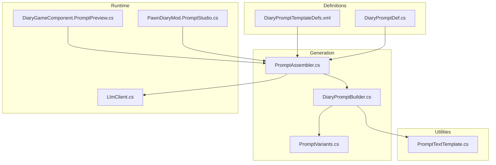
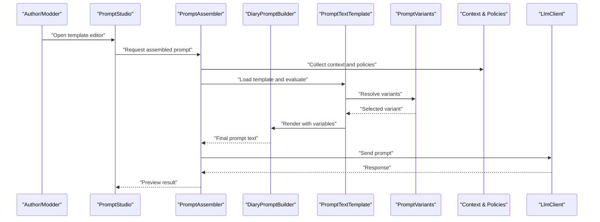
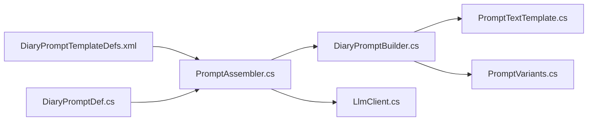

# Prompt Templates

- [PromptTextTemplate.cs](../../../../../../Source/Util/PromptTextTemplate.cs)
- [DiaryPromptDef.cs](../../../../../../Source/Defs/DiaryPromptDef.cs)
- [DiaryPromptTemplateDefs.xml](../../../../../../1.6/Defs/DiaryPromptTemplateDefs.xml)
- [PromptAssembler.cs](../../../../../../Source/Generation/PromptAssembler.cs)
- [DiaryPromptBuilder.cs](../../../../../../Source/Generation/DiaryPromptBuilder.cs)
- [PromptVariants.cs](../../../../../../Source/Generation/PromptVariants.cs)
- [LlmClient.cs](../../../../../../Source/Generation/LlmClient.cs)
- [DiaryGameComponent.PromptPreview.cs](../../../../../../Source/Core/DiaryGameComponent.PromptPreview.cs)
- [PawnDiaryMod.PromptStudio.cs](../../../../../../Source/Settings/PawnDiaryMod.PromptStudio.cs)
## Table of Contents
1. [Introduction](#introduction)
2. [Project Structure](#project-structure)
3. [Core Components](#core-components)
4. [Architecture Overview](#architecture-overview)
5. [Detailed Component Analysis](#detailed-component-analysis)
6. [Dependency Analysis](#dependency-analysis)
7. [Performance Considerations](#performance-considerations)
8. [Troubleshooting Guide](#troubleshooting-guide)
9. [Conclusion](#conclusion)
10. [Appendices](#appendices)

## Introduction
This document explains the prompt template system used to generate AI prompts for diary entries and related content. It covers template syntax, variable substitution, conditional logic, context injection patterns, built-in template types, custom template creation, inheritance mechanisms, debugging techniques, performance optimization, and compatibility considerations across different language models. The goal is to help authors and modders create high-quality prompts that are robust, maintainable, and model-friendly.

## Project Structure
The prompt template system spans definitions (XML), runtime builders/assemblers, utilities for templating, and UI tools for previewing and testing. Key areas include:
- Definitions: XML-based prompt templates and prompt definitions
- Generation pipeline: Builders and assemblers that construct final prompts
- Utilities: Template parsing and text processing helpers
- UI and settings: Preview studio and test suites for authoring and validation

**Diagram sources**
- [DiaryPromptTemplateDefs.xml](../../../../../../1.6/Defs/DiaryPromptTemplateDefs.xml)
- [DiaryPromptDef.cs](../../../../../../Source/Defs/DiaryPromptDef.cs)
- [PromptAssembler.cs](../../../../../../Source/Generation/PromptAssembler.cs)
- [DiaryPromptBuilder.cs](../../../../../../Source/Generation/DiaryPromptBuilder.cs)
- [PromptTextTemplate.cs](../../../../../../Source/Util/PromptTextTemplate.cs)
- [PromptVariants.cs](../../../../../../Source/Generation/PromptVariants.cs)
- [LlmClient.cs](../../../../../../Source/Generation/LlmClient.cs)
- [DiaryGameComponent.PromptPreview.cs](../../../../../../Source/Core/DiaryGameComponent.PromptPreview.cs)
- [PawnDiaryMod.PromptStudio.cs](../../../../../../Source/Settings/PawnDiaryMod.PromptStudio.cs)

**Section sources**
- [DiaryPromptTemplateDefs.xml](../../../../../../1.6/Defs/DiaryPromptTemplateDefs.xml)
- [DiaryPromptDef.cs](../../../../../../Source/Defs/DiaryPromptDef.cs)
- [PromptAssembler.cs](../../../../../../Source/Generation/PromptAssembler.cs)
- [DiaryPromptBuilder.cs](../../../../../../Source/Generation/DiaryPromptBuilder.cs)
- [PromptTextTemplate.cs](../../../../../../Source/Util/PromptTextTemplate.cs)
- [PromptVariants.cs](../../../../../../Source/Generation/PromptVariants.cs)
- [LlmClient.cs](../../../../../../Source/Generation/LlmClient.cs)
- [DiaryGameComponent.PromptPreview.cs](../../../../../../Source/Core/DiaryGameComponent.PromptPreview.cs)
- [PawnDiaryMod.PromptStudio.cs](../../../../../../Source/Settings/PawnDiaryMod.PromptStudio.cs)

## Core Components
- PromptTextTemplate: Provides core templating capabilities including variable substitution and basic formatting.
- DiaryPromptDef: Defines prompt metadata and links to a template or inline content.
- PromptAssembler: Orchestrates building prompts by combining context, templates, variants, and policies.
- DiaryPromptBuilder: Applies writing style, persona, and contextual details into the final prompt text.
- PromptVariants: Manages variant selection and randomization within templates.
- LlmClient: Sends constructed prompts to external language models and handles responses.
- PromptPreview and PromptStudio: Authoring and debugging tools for templates and prompts.

Key responsibilities:
- Template syntax and evaluation
- Context injection from game state
- Conditional rendering based on flags and values
- Variant selection and randomness
- Model-specific adjustments and compatibility

**Section sources**
- [PromptTextTemplate.cs](../../../../../../Source/Util/PromptTextTemplate.cs)
- [DiaryPromptDef.cs](../../../../../../Source/Defs/DiaryPromptDef.cs)
- [PromptAssembler.cs](../../../../../../Source/Generation/PromptAssembler.cs)
- [DiaryPromptBuilder.cs](../../../../../../Source/Generation/DiaryPromptBuilder.cs)
- [PromptVariants.cs](../../../../../../Source/Generation/PromptVariants.cs)
- [LlmClient.cs](../../../../../../Source/Generation/LlmClient.cs)

## Architecture Overview
The template system follows a layered architecture:
- Definition layer: XML templates and prompt definitions describe structure and content.
- Assembly layer: Assembler selects templates, merges context, and applies policies.
- Builder layer: Builder resolves variables, evaluates conditionals, and formats output.
- Runtime layer: Client sends prompts to models; preview/studio tools assist authors.

**Diagram sources**
- [PromptAssembler.cs](../../../../../../Source/Generation/PromptAssembler.cs)
- [DiaryPromptBuilder.cs](../../../../../../Source/Generation/DiaryPromptBuilder.cs)
- [PromptTextTemplate.cs](../../../../../../Source/Util/PromptTextTemplate.cs)
- [PromptVariants.cs](../../../../../../Source/Generation/PromptVariants.cs)
- [LlmClient.cs](../../../../../../Source/Generation/LlmClient.cs)
- [PawnDiaryMod.PromptStudio.cs](../../../../../../Source/Settings/PawnDiaryMod.PromptStudio.cs)

## Detailed Component Analysis

### Template Syntax and Variable Substitution
- Variables: Use placeholders for dynamic values such as names, events, and states. Placeholders are resolved at render time using context data.
- Formatting: Built-in formatters can adjust casing, truncation, and localization where applicable.
- Escaping: Special characters may require escaping to prevent unintended interpretation by the template engine.
- Best practices: Keep placeholders descriptive and consistent; prefer short, stable keys for reuse.

Practical guidance:
- Prefer explicit keys over positional arguments for clarity.
- Provide default values for optional variables to avoid empty sections.
- Validate placeholder presence during preview to catch missing context early.

**Section sources**
- [PromptTextTemplate.cs](../../../../../../Source/Util/PromptTextTemplate.cs)
- [DiaryPromptBuilder.cs](../../../../../../Source/Generation/DiaryPromptBuilder.cs)

### Conditional Logic and Branching
- Conditionals: Render blocks only when certain conditions are met (e.g., event type, mood, DLC availability).
- Negation and combinations: Support logical negation and multiple conditions for fine-grained control.
- Fallbacks: Provide alternative content when conditions fail to ensure robust prompts.

Implementation tips:
- Group related conditionals to improve readability.
- Avoid deep nesting; flatten logic where possible.
- Test both true and false branches during authoring.

**Section sources**
- [PromptAssembler.cs](../../../../../../Source/Generation/PromptAssembler.cs)
- [DiaryPromptBuilder.cs](../../../../../../Source/Generation/DiaryPromptBuilder.cs)

### Context Injection Patterns
- Event context: Inject event-specific fields like participants, location, outcome, and timestamps.
- Persona and writing style: Apply persona traits and stylistic directives to shape tone and voice.
- Narrative continuity: Include recent memories or narrative references to maintain coherence.
- Policy-driven injection: Use policies to add or suppress context based on tuning rules.

Patterns:
- Explicit injection: Pass known fields directly into the template.
- Scoped injection: Limit context scope to relevant sections to reduce noise.
- Lazy evaluation: Defer expensive context resolution until needed.

**Section sources**
- [PromptAssembler.cs](../../../../../../Source/Generation/PromptAssembler.cs)
- [DiaryPromptBuilder.cs](../../../../../../Source/Generation/DiaryPromptBuilder.cs)

### Built-in Template Types
Common template categories:
- Solo reflection: Single-character introspective entries.
- Pair interaction: Two-character dialogues or shared reflections.
- Observation: Third-person observations of events or behaviors.
- External integration: Prompts tailored for external APIs or bridges.

Selection criteria:
- Event type mapping determines which template family applies.
- Persona and writing style influence variant selection.
- Policy overrides can force specific template types for consistency.

**Section sources**
- [DiaryPromptTemplateDefs.xml](../../../../../../1.6/Defs/DiaryPromptTemplateDefs.xml)
- [DiaryPromptDef.cs](../../../../../../Source/Defs/DiaryPromptDef.cs)
- [PromptAssembler.cs](../../../../../../Source/Generation/PromptAssembler.cs)

### Custom Template Creation and Inheritance
Creating custom templates:
- Define new template entries in XML with unique identifiers and content.
- Link templates to prompt definitions via reference or inheritance.
- Use variants to provide multiple phrasings or structures for the same semantic intent.

Inheritance mechanisms:
- Base templates define common structure and shared variables.
- Derived templates extend or override sections while preserving base behavior.
- Composition allows mixing reusable fragments across templates.

Guidelines:
- Favor composition over deep inheritance hierarchies.
- Keep base templates minimal and focused on shared concerns.
- Document derived templates’ expectations and required context.

**Section sources**
- [DiaryPromptTemplateDefs.xml](../../../../../../1.6/Defs/DiaryPromptTemplateDefs.xml)
- [DiaryPromptDef.cs](../../../../../../Source/Defs/DiaryPromptDef.cs)

### Variants and Randomization
- Variants: Multiple versions of a section or entire template to diversify outputs.
- Weights: Assign probabilities to variants for controlled randomness.
- Determinism: Seed-based selection for reproducibility during testing.

Usage:
- Rotate between synonyms and rephrasing to avoid repetition.
- Use variants to adapt to subtle context differences without branching complexity.

**Section sources**
- [PromptVariants.cs](../../../../../../Source/Generation/PromptVariants.cs)

### Integration with Language Models
- Model capability detection: Adjust prompt length, structure, and instructions based on model features.
- Compatibility shims: Normalize tokens and formatting to suit different providers.
- Response parsing: Ensure prompts elicit structured responses when needed.

Best practices:
- Keep prompts concise and directive.
- Avoid overly complex conditionals that vary per model.
- Test across target models to validate stability.

**Section sources**
- [LlmClient.cs](../../../../../../Source/Generation/LlmClient.cs)
- [PromptAssembler.cs](../../../../../../Source/Generation/PromptAssembler.cs)

## Dependency Analysis
The template system’s dependencies emphasize separation of concerns:
- Definitions depend on no runtime code.
- Assembler depends on definitions, builder, and context/policies.
- Builder depends on template utility and variants.
- Client depends on assembler output and configuration.

**Diagram sources**
- [DiaryPromptTemplateDefs.xml](../../../../../../1.6/Defs/DiaryPromptTemplateDefs.xml)
- [DiaryPromptDef.cs](../../../../../../Source/Defs/DiaryPromptDef.cs)
- [PromptAssembler.cs](../../../../../../Source/Generation/PromptAssembler.cs)
- [DiaryPromptBuilder.cs](../../../../../../Source/Generation/DiaryPromptBuilder.cs)
- [PromptTextTemplate.cs](../../../../../../Source/Util/PromptTextTemplate.cs)
- [PromptVariants.cs](../../../../../../Source/Generation/PromptVariants.cs)
- [LlmClient.cs](../../../../../../Source/Generation/LlmClient.cs)

**Section sources**
- [PromptAssembler.cs](../../../../../../Source/Generation/PromptAssembler.cs)
- [DiaryPromptBuilder.cs](../../../../../../Source/Generation/DiaryPromptBuilder.cs)
- [PromptTextTemplate.cs](../../../../../../Source/Util/PromptTextTemplate.cs)
- [PromptVariants.cs](../../../../../../Source/Generation/PromptVariants.cs)
- [LlmClient.cs](../../../../../../Source/Generation/LlmClient.cs)

## Performance Considerations
- Minimize heavy context resolution: Resolve only necessary fields and defer expensive computations.
- Cache evaluated templates: Reuse rendered fragments when identical contexts occur frequently.
- Limit variant explosion: Control the number of variants and weights to keep selection fast.
- Streamline conditionals: Flatten nested logic to reduce evaluation overhead.
- Batch operations: Where possible, assemble multiple prompts together to amortize costs.

[No sources needed since this section provides general guidance]

## Troubleshooting Guide
Common issues and resolutions:
- Missing variables: Use preview tools to detect unresolved placeholders before deployment.
- Empty sections due to conditionals: Verify condition truthiness and provide fallback content.
- Inconsistent outputs: Check variant weights and determinism settings; stabilize seeds for tests.
- Model incompatibilities: Normalize prompt structure and avoid unsupported constructs.

Debugging techniques:
- Use the Prompt Studio to inspect intermediate results and context snapshots.
- Enable detailed logs around template evaluation and variant selection.
- Create small, isolated test cases for complex templates.

**Section sources**
- [DiaryGameComponent.PromptPreview.cs](../../../../../../Source/Core/DiaryGameComponent.PromptPreview.cs)
- [PawnDiaryMod.PromptStudio.cs](../../../../../../Source/Settings/PawnDiaryMod.PromptStudio.cs)

## Conclusion
The prompt template system provides a flexible, extensible framework for generating high-quality AI prompts. By leveraging clear syntax, robust context injection, conditional logic, and variant management, authors can craft prompts that are expressive yet efficient. Following best practices for performance and compatibility ensures reliable operation across diverse language models.

[No sources needed since this section summarizes without analyzing specific files]

## Appendices

### Practical Examples

- Event-type templates:
  - Death: Focus on legacy, relationships, and emotional impact; include key participants and circumstances.
  - Arrival: Highlight first impressions, setting, and immediate goals.
  - Raid: Emphasize tension, outcomes, and lessons learned.

- Writing-style templates:
  - Reflective: Encourage introspection and personal growth.
  - Observational: Maintain neutral tone with precise details.
  - Dramatic: Increase intensity and vivid imagery.

- Persona-behavior templates:
  - Stoic: Restrained emotion, pragmatic insights.
  - Charismatic: Engaging voice, social awareness.
  - Scholarly: Analytical framing, references to knowledge.

These examples should be implemented using defined template families and variants, with context injection tailored to each scenario.

[No sources needed since this section provides conceptual guidance]
