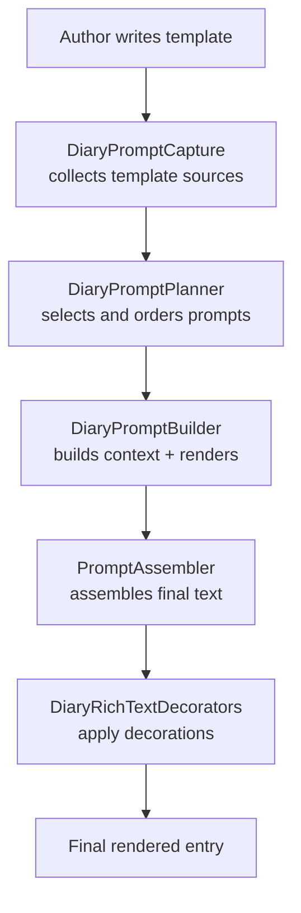
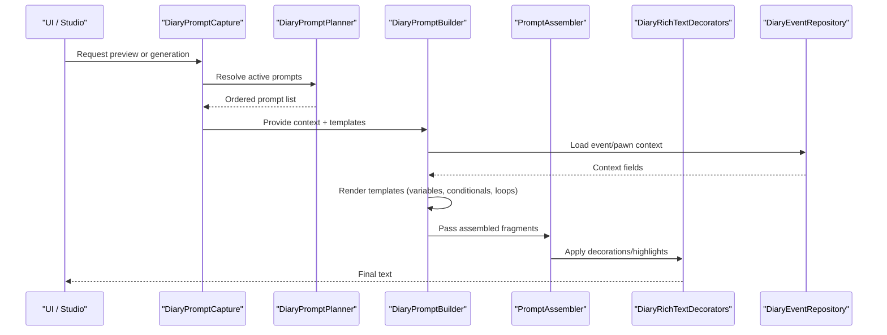
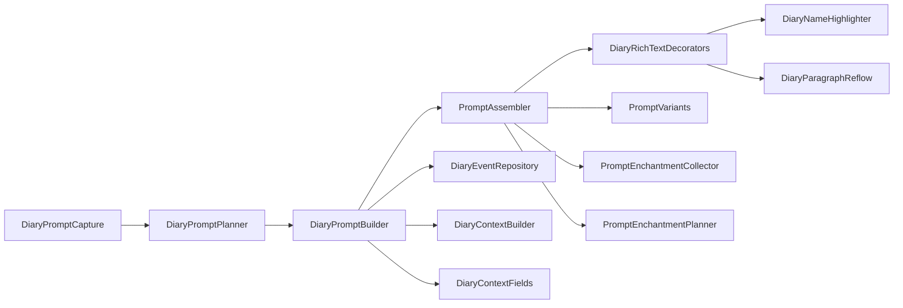

# Template Syntax & Variables

<cite>
**Referenced Files in This Document**
- [PromptTextTemplate.cs](../../../../../../Source/Util/PromptTextTemplate.cs)
- [DiaryPromptBuilder.cs](../../../../../../Source/Generation/DiaryPromptBuilder.cs)
- [DiaryContextBuilder.cs](../../../../../../Source/Generation/DiaryContextBuilder.cs)
- [DiaryContextFields.cs](../../../../../../Source/Generation/DiaryContextFields.cs)
- [PromptAssembler.cs](../../../../../../Source/Generation/PromptAssembler.cs)
- [DiaryPromptCapture.cs](../../../../../../Source/Pipeline/DiaryPromptCapture.cs)
- [DiaryPromptPlanner.cs](../../../../../../Source/Pipeline/DiaryPromptPlanner.cs)
- [DiaryRichTextDecorators.cs](../../../../../../Source/Pipeline/DiaryRichTextDecorators.cs)
- [DiaryNameHighlighter.cs](../../../../../../Source/Pipeline/DiaryNameHighlighter.cs)
- [DiaryParagraphReflow.cs](../../../../../../Source/Pipeline/DiaryParagraphReflow.cs)
- [PromptVariants.cs](../../../../../../Source/Generation/PromptVariants.cs)
- [PromptEnchantments.cs](../../../../../../Source/Generation/PromptEnchantments.cs)
- [PromptEnchantmentCollector.cs](../../../../../../Source/Generation/PromptEnchantmentCollector.cs)
- [PromptEnchantmentPlanner.cs](../../../../../../Source/Pipeline/PromptEnchantmentPlanner.cs)
- [DiaryEventRepository.cs](../../../../../../Source/Core/DiaryEventRepository.cs)
- [DiaryGameComponent.PromptPreview.cs](../../../../../../Source/Core/DiaryGameComponent.PromptPreview.cs)
- [PawnDiaryMod.PromptStudio.cs](../../../../../../Source/Settings/PawnDiaryMod.PromptStudio.cs)
</cite>

## Table of Contents
1. [Introduction](#introduction)
2. [Project Structure](#project-structure)
3. [Core Components](#core-components)
4. [Architecture Overview](#architecture-overview)
5. [Detailed Component Analysis](#detailed-component-analysis)
6. [Dependency Analysis](#dependency-analysis)
7. [Performance Considerations](#performance-considerations)
8. [Troubleshooting Guide](#troubleshooting-guide)
9. [Conclusion](#conclusion)
10. [Appendices](#appendices)

## Introduction
This document explains the prompt template syntax and variable substitution system used to generate narrative entries. It covers:
- Template variables, context properties, and formatting options
- Conditional logic patterns and loop constructs
- String manipulation functions
- Built-in helpers for date formatting, name resolution, mood calculations, and relationship tracking
- Practical examples for accessing game state data, pawn attributes, and event-specific information
- Debugging techniques and common syntax errors

The goal is to help modders and authors author robust templates that render consistently across events and DLCs.

## Project Structure
At a high level, templates are authored as text with placeholders and directives. The engine parses these templates, resolves variables from a runtime context, applies formatting and decorations, and produces final prose.

**Diagram sources**
- [DiaryPromptCapture.cs](../../../../../../Source/Pipeline/DiaryPromptCapture.cs)
- [DiaryPromptPlanner.cs](../../../../../../Source/Pipeline/DiaryPromptPlanner.cs)
- [DiaryPromptBuilder.cs](../../../../../../Source/Generation/DiaryPromptBuilder.cs)
- [PromptAssembler.cs](../../../../../../Source/Generation/PromptAssembler.cs)
- [DiaryRichTextDecorators.cs](../../../../../../Source/Pipeline/DiaryRichTextDecorators.cs)

**Section sources**
- [DiaryPromptCapture.cs](../../../../../../Source/Pipeline/DiaryPromptCapture.cs)
- [DiaryPromptPlanner.cs](../../../../../../Source/Pipeline/DiaryPromptPlanner.cs)
- [DiaryPromptBuilder.cs](../../../../../../Source/Generation/DiaryPromptBuilder.cs)
- [PromptAssembler.cs](../../../../../../Source/Generation/PromptAssembler.cs)
- [DiaryRichTextDecorators.cs](../../../../../../Source/Pipeline/DiaryRichTextDecorators.cs)

## Core Components
- Template parsing and rendering:
  - Template parser and renderer implementation
  - Variable resolution against a structured context
  - Formatting and decoration pipeline
- Context construction:
  - Event-specific fields and global context
  - Pawn-centric properties and relationships
- Enchantments and variants:
  - Optional modifiers and stylistic variations applied during assembly

Key files:
- Template engine and utilities
- Prompt builder and assembler
- Context builders and field definitions
- Decoration and highlighting systems
- Enchantment collection and planning

**Section sources**
- [PromptTextTemplate.cs](../../../../../../Source/Util/PromptTextTemplate.cs)
- [DiaryPromptBuilder.cs](../../../../../../Source/Generation/DiaryPromptBuilder.cs)
- [DiaryContextBuilder.cs](../../../../../../Source/Generation/DiaryContextBuilder.cs)
- [DiaryContextFields.cs](../../../../../../Source/Generation/DiaryContextFields.cs)
- [PromptAssembler.cs](../../../../../../Source/Generation/PromptAssembler.cs)
- [DiaryRichTextDecorators.cs](../../../../../../Source/Pipeline/DiaryRichTextDecorators.cs)
- [DiaryNameHighlighter.cs](../../../../../../Source/Pipeline/DiaryNameHighlighter.cs)
- [PromptVariants.cs](../../../../../../Source/Generation/PromptVariants.cs)
- [PromptEnchantments.cs](../../../../../../Source/Generation/PromptEnchantments.cs)
- [PromptEnchantmentCollector.cs](../../../../../../Source/Generation/PromptEnchantmentCollector.cs)
- [PromptEnchantmentPlanner.cs](../../../../../../Source/Pipeline/PromptEnchantmentPlanner.cs)

## Architecture Overview
The template system composes multiple stages: capture, planning, building, assembling, decorating, and output.

**Diagram sources**
- [DiaryPromptCapture.cs](../../../../../../Source/Pipeline/DiaryPromptCapture.cs)
- [DiaryPromptPlanner.cs](../../../../../../Source/Pipeline/DiaryPromptPlanner.cs)
- [DiaryPromptBuilder.cs](../../../../../../Source/Generation/DiaryPromptBuilder.cs)
- [PromptAssembler.cs](../../../../../../Source/Generation/PromptAssembler.cs)
- [DiaryRichTextDecorators.cs](../../../../../../Source/Pipeline/DiaryRichTextDecorators.cs)
- [DiaryEventRepository.cs](../../../../../../Source/Core/DiaryEventRepository.cs)

## Detailed Component Analysis

### Template Engine and Variable Substitution
- Template parsing and rendering:
  - Supports placeholder substitution for variables
  - Provides conditional blocks and iteration over collections
  - Offers string manipulation helpers and built-in functions
- Rendering pipeline:
  - Resolves variables from context
  - Applies formatting rules and decorations
  - Produces final text suitable for display

Practical usage patterns:
- Accessing event data via context keys
- Referencing pawns by identifiers or roles
- Using helper functions for dates, names, moods, and relationships

**Section sources**
- [PromptTextTemplate.cs](../../../../../../Source/Util/PromptTextTemplate.cs)
- [DiaryPromptBuilder.cs](../../../../../../Source/Generation/DiaryPromptBuilder.cs)

### Context Construction and Fields
- Context builder:
  - Aggregates global and event-scoped data
  - Exposes typed fields for pawns, events, and meta-information
- Field catalog:
  - Defines available context properties and their semantics
  - Documents naming conventions and availability per event type

Common categories:
- Global context (game time, world state)
- Event context (event type, participants, outcomes)
- Pawn context (attributes, traits, hediffs, relations)
- Relationship context (affinity, history, recent interactions)

**Section sources**
- [DiaryContextBuilder.cs](../../../../../../Source/Generation/DiaryContextBuilder.cs)
- [DiaryContextFields.cs](../../../../../../Source/Generation/DiaryContextFields.cs)

### Prompt Assembly and Variants
- Assembler:
  - Combines multiple fragments into a cohesive narrative
  - Applies writing style and tone adjustments
- Variants and enchantments:
  - Selects appropriate variant based on context
  - Collects and plans enchantments to enrich phrasing

**Section sources**
- [PromptAssembler.cs](../../../../../../Source/Generation/PromptAssembler.cs)
- [PromptVariants.cs](../../../../../../Source/Generation/PromptVariants.cs)
- [PromptEnchantments.cs](../../../../../../Source/Generation/PromptEnchantments.cs)
- [PromptEnchantmentCollector.cs](../../../../../../Source/Generation/PromptEnchantmentCollector.cs)
- [PromptEnchantmentPlanner.cs](../../../../../../Source/Pipeline/PromptEnchantmentPlanner.cs)

### Rich Text Decorations and Name Highlighting
- Decorators:
  - Apply visual decorations (e.g., emphasis, links)
  - Integrate with rendering pipeline
- Name highlighter:
  - Detects and highlights character names
  - Ensures consistent presentation across entries

**Section sources**
- [DiaryRichTextDecorators.cs](../../../../../../Source/Pipeline/DiaryRichTextDecorators.cs)
- [DiaryNameHighlighter.cs](../../../../../../Source/Pipeline/DiaryNameHighlighter.cs)

### Paragraph Reflow and Formatting
- Reflow:
  - Normalizes whitespace and line breaks
  - Ensures readable paragraphs across devices

**Section sources**
- [DiaryParagraphReflow.cs](../../../../../../Source/Pipeline/DiaryParagraphReflow.cs)

## Dependency Analysis
The following diagram shows how core components depend on each other during template rendering.

**Diagram sources**
- [DiaryPromptCapture.cs](../../../../../../Source/Pipeline/DiaryPromptCapture.cs)
- [DiaryPromptPlanner.cs](../../../../../../Source/Pipeline/DiaryPromptPlanner.cs)
- [DiaryPromptBuilder.cs](../../../../../../Source/Generation/DiaryPromptBuilder.cs)
- [PromptAssembler.cs](../../../../../../Source/Generation/PromptAssembler.cs)
- [DiaryRichTextDecorators.cs](../../../../../../Source/Pipeline/DiaryRichTextDecorators.cs)
- [DiaryEventRepository.cs](../../../../../../Source/Core/DiaryEventRepository.cs)
- [DiaryContextBuilder.cs](../../../../../../Source/Generation/DiaryContextBuilder.cs)
- [DiaryContextFields.cs](../../../../../../Source/Generation/DiaryContextFields.cs)
- [PromptVariants.cs](../../../../../../Source/Generation/PromptVariants.cs)
- [PromptEnchantmentCollector.cs](../../../../../../Source/Generation/PromptEnchantmentCollector.cs)
- [PromptEnchantmentPlanner.cs](../../../../../../Source/Pipeline/PromptEnchantmentPlanner.cs)
- [DiaryNameHighlighter.cs](../../../../../../Source/Pipeline/DiaryNameHighlighter.cs)
- [DiaryParagraphReflow.cs](../../../../../../Source/Pipeline/DiaryParagraphReflow.cs)

**Section sources**
- [DiaryPromptCapture.cs](../../../../../../Source/Pipeline/DiaryPromptCapture.cs)
- [DiaryPromptPlanner.cs](../../../../../../Source/Pipeline/DiaryPromptPlanner.cs)
- [DiaryPromptBuilder.cs](../../../../../../Source/Generation/DiaryPromptBuilder.cs)
- [PromptAssembler.cs](../../../../../../Source/Generation/PromptAssembler.cs)
- [DiaryRichTextDecorators.cs](../../../../../../Source/Pipeline/DiaryRichTextDecorators.cs)
- [DiaryEventRepository.cs](../../../../../../Source/Core/DiaryEventRepository.cs)
- [DiaryContextBuilder.cs](../../../../../../Source/Generation/DiaryContextBuilder.cs)
- [DiaryContextFields.cs](../../../../../../Source/Generation/DiaryContextFields.cs)
- [PromptVariants.cs](../../../../../../Source/Generation/PromptVariants.cs)
- [PromptEnchantmentCollector.cs](../../../../../../Source/Generation/PromptEnchantmentCollector.cs)
- [PromptEnchantmentPlanner.cs](../../../../../../Source/Pipeline/PromptEnchantmentPlanner.cs)
- [DiaryNameHighlighter.cs](../../../../../../Source/Pipeline/DiaryNameHighlighter.cs)
- [DiaryParagraphReflow.cs](../../../../../../Source/Pipeline/DiaryParagraphReflow.cs)

## Performance Considerations
- Minimize heavy computations inside templates; prefer precomputed context fields
- Use targeted context queries to avoid unnecessary lookups
- Leverage caching where possible (e.g., repeated name resolutions)
- Keep templates concise to reduce rendering overhead
- Avoid excessive nested conditionals and deep loops

[No sources needed since this section provides general guidance]

## Troubleshooting Guide
Common issues and debugging techniques:
- Verify variable names match context field definitions
- Check conditional expressions for correct operators and types
- Ensure loop variables are scoped properly and collections are non-null
- Inspect intermediate outputs using preview tools
- Validate decorations do not interfere with text flow

Debugging aids:
- Preview tooling for live template evaluation
- Studio interface for iterative testing
- Repository access for inspecting event and pawn context

**Section sources**
- [DiaryGameComponent.PromptPreview.cs](../../../../../../Source/Core/DiaryGameComponent.PromptPreview.cs)
- [PawnDiaryMod.PromptStudio.cs](../../../../../../Source/Settings/PawnDiaryMod.PromptStudio.cs)
- [DiaryEventRepository.cs](../../../../../../Source/Core/DiaryEventRepository.cs)

## Conclusion
The template system provides a flexible and powerful way to generate narrative content. By understanding the variable substitution model, context structure, and decoration pipeline, authors can craft rich, contextualized entries. Use the preview and studio tools to iterate quickly and validate behavior across events and DLCs.

[No sources needed since this section summarizes without analyzing specific files]

## Appendices

### Practical Examples and Patterns
- Accessing game state data:
  - Reference global context fields for time, location, and colony status
- Reading pawn attributes:
  - Use pawn-scoped fields for traits, hediffs, and skills
- Event-specific information:
  - Bind to event-type fields for participants, outcomes, and timestamps
- Conditional logic patterns:
  - Branch based on boolean flags, enums, or thresholds
- Loop constructs:
  - Iterate over lists such as participants, memories, or recent events
- String manipulation:
  - Trim, capitalize, truncate, and format strings
- Date formatting:
  - Format timestamps into localized or styled representations
- Name resolution:
  - Resolve friendly names, titles, and pronouns
- Mood calculations:
  - Derive emotional tone from thoughts, events, and relationships
- Relationship tracking:
  - Summarize affinity, history, and recent interactions

[No sources needed since this section provides general guidance]
