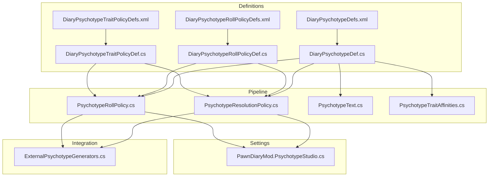
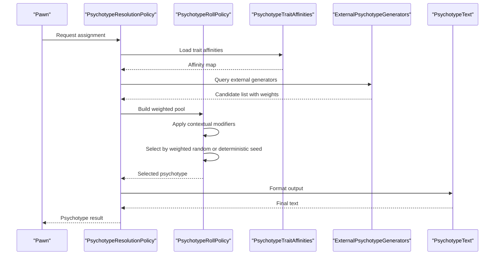
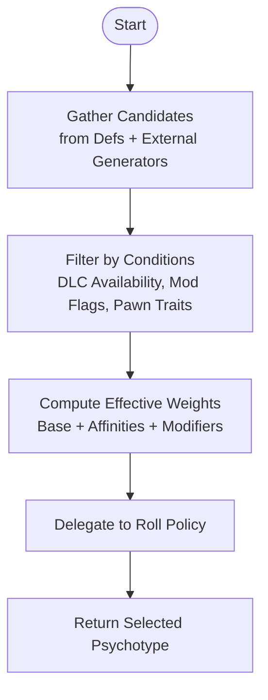
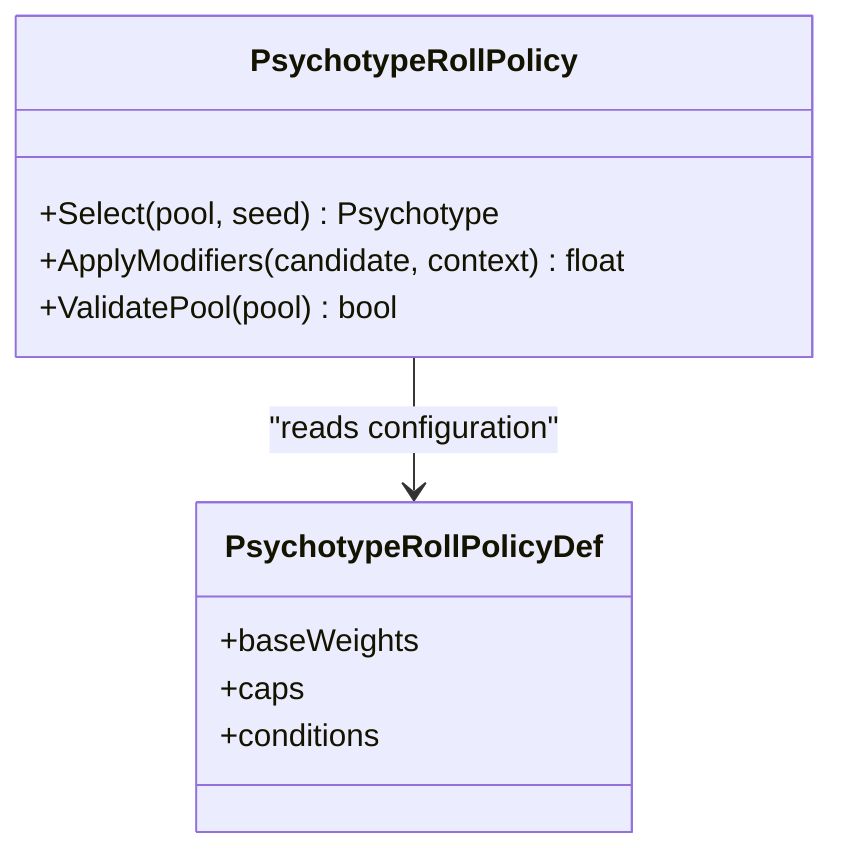
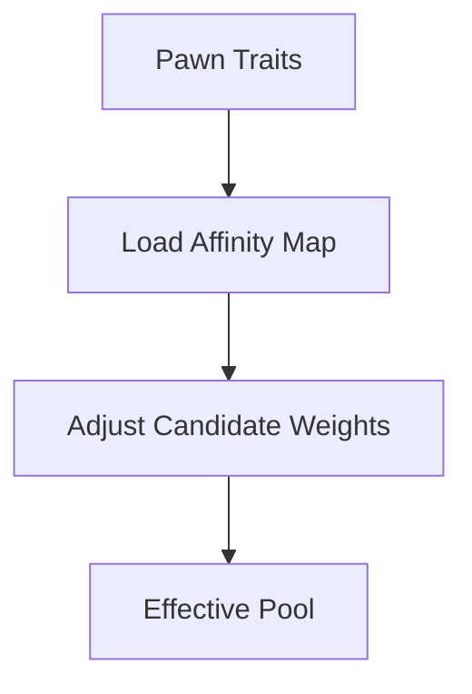
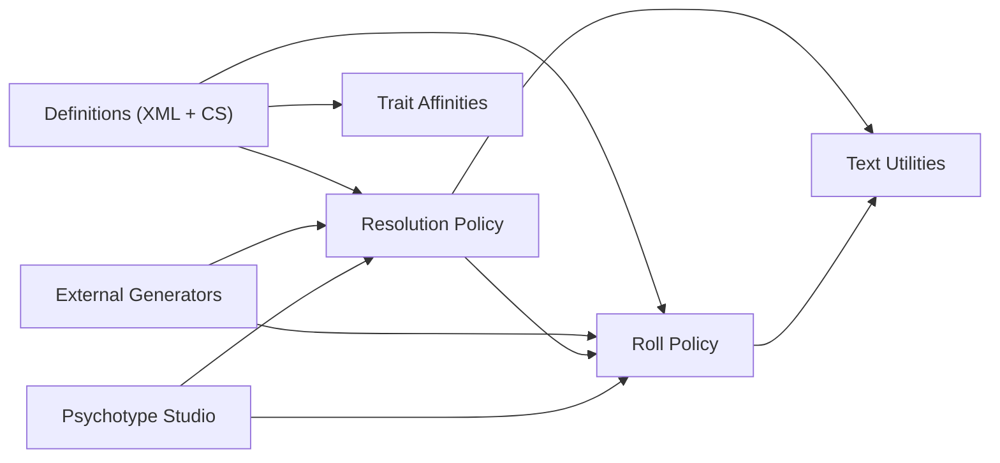

# Psychotype Assignment & Resolution

<cite>
**Referenced Files in This Document**
- [DiaryPsychotypeDefs.xml](../../../../../../1.6/Defs/DiaryPsychotypeDefs.xml)
- [DiaryPsychotypeRollPolicyDefs.xml](../../../../../../1.6/Defs/DiaryPsychotypeRollPolicyDefs.xml)
- [DiaryPsychotypeTraitPolicyDefs.xml](../../../../../../1.6/Defs/DiaryPsychotypeTraitPolicyDefs.xml)
- [DiaryPsychotypeDef.cs](../../../../../../Source/Defs/DiaryPsychotypeDef.cs)
- [DiaryPsychotypeRollPolicyDef.cs](../../../../../../Source/Defs/DiaryPsychotypeRollPolicyDef.cs)
- [DiaryPsychotypeTraitPolicyDef.cs](../../../../../../Source/Defs/DiaryPsychotypeTraitPolicyDef.cs)
- [PsychotypeResolutionPolicy.cs](../../../../../../Source/Pipeline/PsychotypeResolutionPolicy.cs)
- [PsychotypeRollPolicy.cs](../../../../../../Source/Pipeline/PsychotypeRollPolicy.cs)
- [PsychotypeText.cs](../../../../../../Source/Pipeline/PsychotypeText.cs)
- [PsychotypeTraitAffinities.cs](../../../../../../Source/Pipeline/PsychotypeTraitAffinities.cs)
- [ExternalPsychotypeGenerators.cs](../../../../../../Source/Integration/ExternalPsychotypeGenerators.cs)
- [PawnDiaryMod.PsychotypeStudio.cs](../../../../../../Source/Settings/PawnDiaryMod.PsychotypeStudio.cs)
</cite>

## Table of Contents
1. [Introduction](#introduction)
2. [Project Structure](#project-structure)
3. [Core Components](#core-components)
4. [Architecture Overview](#architecture-overview)
5. [Detailed Component Analysis](#detailed-component-analysis)
6. [Dependency Analysis](#dependency-analysis)
7. [Performance Considerations](#performance-considerations)
8. [Troubleshooting Guide](#troubleshooting-guide)
9. [Conclusion](#conclusion)
10. [Appendices](#appendices)

## Introduction
This document explains how psychotypes are assigned and resolved for pawns, focusing on:
- Random selection and weighted probability calculations
- Contextual factors influencing assignment (traits, DLC availability, mod interactions)
- Roll policies, override mechanisms, and conditional rules
- Customization, deterministic selection, and debugging strategies
- Performance considerations, caching, and migration paths for existing pawns

The system is designed to be extensible via definitions and external generators while providing robust defaults and policy-based control.

## Project Structure
Psychotype-related functionality spans definition files, pipeline policies, integration points, and UI tools:
- Definitions define psychotypes, roll policies, and trait affinities
- Pipeline policies implement resolution and rolling logic
- Integration exposes hooks for external generators and overrides
- Settings provide a studio for tuning and experimentation

**Diagram sources**
- [DiaryPsychotypeDef.cs](../../../../../../Source/Defs/DiaryPsychotypeDef.cs)
- [DiaryPsychotypeRollPolicyDef.cs](../../../../../../Source/Defs/DiaryPsychotypeRollPolicyDef.cs)
- [DiaryPsychotypeTraitPolicyDef.cs](../../../../../../Source/Defs/DiaryPsychotypeTraitPolicyDef.cs)
- [DiaryPsychotypeDefs.xml](../../../../../../1.6/Defs/DiaryPsychotypeDefs.xml)
- [DiaryPsychotypeRollPolicyDefs.xml](../../../../../../1.6/Defs/DiaryPsychotypeRollPolicyDefs.xml)
- [DiaryPsychotypeTraitPolicyDefs.xml](../../../../../../1.6/Defs/DiaryPsychotypeTraitPolicyDefs.xml)
- [PsychotypeResolutionPolicy.cs](../../../../../../Source/Pipeline/PsychotypeResolutionPolicy.cs)
- [PsychotypeRollPolicy.cs](../../../../../../Source/Pipeline/PsychotypeRollPolicy.cs)
- [PsychotypeText.cs](../../../../../../Source/Pipeline/PsychotypeText.cs)
- [PsychotypeTraitAffinities.cs](../../../../../../Source/Pipeline/PsychotypeTraitAffinities.cs)
- [ExternalPsychotypeGenerators.cs](../../../../../../Source/Integration/ExternalPsychotypeGenerators.cs)
- [PawnDiaryMod.PsychotypeStudio.cs](../../../../../../Source/Settings/PawnDiaryMod.PsychotypeStudio.cs)

**Section sources**
- [DiaryPsychotypeDefs.xml](../../../../../../1.6/Defs/DiaryPsychotypeDefs.xml)
- [DiaryPsychotypeRollPolicyDefs.xml](../../../../../../1.6/Defs/DiaryPsychotypeRollPolicyDefs.xml)
- [DiaryPsychotypeTraitPolicyDefs.xml](../../../../../../1.6/Defs/DiaryPsychotypeTraitPolicyDefs.xml)
- [DiaryPsychotypeDef.cs](../../../../../../Source/Defs/DiaryPsychotypeDef.cs)
- [DiaryPsychotypeRollPolicyDef.cs](../../../../../../Source/Defs/DiaryPsychotypeRollPolicyDef.cs)
- [DiaryPsychotypeTraitPolicyDef.cs](../../../../../../Source/Defs/DiaryPsychotypeTraitPolicyDef.cs)
- [PsychotypeResolutionPolicy.cs](../../../../../../Source/Pipeline/PsychotypeResolutionPolicy.cs)
- [PsychotypeRollPolicy.cs](../../../../../../Source/Pipeline/PsychotypeRollPolicy.cs)
- [PsychotypeText.cs](../../../../../../Source/Pipeline/PsychotypeText.cs)
- [PsychotypeTraitAffinities.cs](../../../../../../Source/Pipeline/PsychotypeTraitAffinities.cs)
- [ExternalPsychotypeGenerators.cs](../../../../../../Source/Integration/ExternalPsychotypeGenerators.cs)
- [PawnDiaryMod.PsychotypeStudio.cs](../../../../../../Source/Settings/PawnDiaryMod.PsychotypeStudio.cs)

## Core Components
- Psychotype definitions: describe available psychotypes and their metadata
- Roll policy definitions: specify how candidates are selected and weighted
- Trait affinity definitions: encode relationships between traits and psychotypes
- Resolution policy: orchestrates candidate filtering, weighting, and final selection
- Roll policy: implements the random selection with weights and contextual modifiers
- Text utilities: format psychotype names and descriptions consistently
- External generators: allow mods to contribute or override psychotype assignments
- Studio: provides an interactive interface to tune and test assignment behavior

Key responsibilities:
- Candidate generation based on pawn characteristics and context
- Weight computation using base weights, trait affinities, and contextual modifiers
- Deterministic seeding support for reproducible outcomes
- Override arbitration when multiple sources propose assignments
- Caching and performance optimizations for frequent evaluations

**Section sources**
- [DiaryPsychotypeDef.cs](../../../../../../Source/Defs/DiaryPsychotypeDef.cs)
- [DiaryPsychotypeRollPolicyDef.cs](../../../../../../Source/Defs/DiaryPsychotypeRollPolicyDef.cs)
- [DiaryPsychotypeTraitPolicyDef.cs](../../../../../../Source/Defs/DiaryPsychotypeTraitPolicyDef.cs)
- [PsychotypeResolutionPolicy.cs](../../../../../../Source/Pipeline/PsychotypeResolutionPolicy.cs)
- [PsychotypeRollPolicy.cs](../../../../../../Source/Pipeline/PsychotypeRollPolicy.cs)
- [PsychotypeText.cs](../../../../../../Source/Pipeline/PsychotypeText.cs)
- [PsychotypeTraitAffinities.cs](../../../../../../Source/Pipeline/PsychotypeTraitAffinities.cs)
- [ExternalPsychotypeGenerators.cs](../../../../../../Source/Integration/ExternalPsychotypeGenerators.cs)
- [PawnDiaryMod.PsychotypeStudio.cs](../../../../../../Source/Settings/PawnDiaryMod.PsychotypeStudio.cs)

## Architecture Overview
The assignment pipeline integrates definitions, policies, and integrations to produce a final psychotype per pawn.

**Diagram sources**
- [PsychotypeResolutionPolicy.cs](../../../../../../Source/Pipeline/PsychotypeResolutionPolicy.cs)
- [PsychotypeRollPolicy.cs](../../../../../../Source/Pipeline/PsychotypeRollPolicy.cs)
- [PsychotypeTraitAffinities.cs](../../../../../../Source/Pipeline/PsychotypeTraitAffinities.cs)
- [ExternalPsychotypeGenerators.cs](../../../../../../Source/Integration/ExternalPsychotypeGenerators.cs)
- [PsychotypeText.cs](../../../../../../Source/Pipeline/PsychotypeText.cs)

## Detailed Component Analysis

### Definitions Layer
- PsychotypeDef: Represents a single psychotype with identifiers, display data, and optional constraints
- RollPolicyDef: Encapsulates selection strategy parameters such as base weights, caps, and conditions
- TraitPolicyDef: Defines trait-to-psychotype affinities and influence multipliers

These definitions are loaded from XML and consumed by the pipeline to construct runtime models.

**Section sources**
- [DiaryPsychotypeDef.cs](../../../../../../Source/Defs/DiaryPsychotypeDef.cs)
- [DiaryPsychotypeRollPolicyDef.cs](../../../../../../Source/Defs/DiaryPsychotypeRollPolicyDef.cs)
- [DiaryPsychotypeTraitPolicyDef.cs](../../../../../../Source/Defs/DiaryPsychotypeTraitPolicyDef.cs)
- [DiaryPsychotypeDefs.xml](../../../../../../1.6/Defs/DiaryPsychotypeDefs.xml)
- [DiaryPsychotypeRollPolicyDefs.xml](../../../../../../1.6/Defs/DiaryPsychotypeRollPolicyDefs.xml)
- [DiaryPsychotypeTraitPolicyDefs.xml](../../../../../../1.6/Defs/DiaryPsychotypeTraitPolicyDefs.xml)

### Resolution Policy
Responsibilities:
- Gather candidates from definitions and external generators
- Filter candidates based on pawn characteristics and context
- Compute effective weights combining base weights and affinities
- Delegate final selection to the roll policy
- Handle overrides and arbitration across sources

**Diagram sources**
- [PsychotypeResolutionPolicy.cs](../../../../../../Source/Pipeline/PsychotypeResolutionPolicy.cs)
- [ExternalPsychotypeGenerators.cs](../../../../../../Source/Integration/ExternalPsychotypeGenerators.cs)
- [PsychotypeTraitAffinities.cs](../../../../../../Source/Pipeline/PsychotypeTraitAffinities.cs)

**Section sources**
- [PsychotypeResolutionPolicy.cs](../../../../../../Source/Pipeline/PsychotypeResolutionPolicy.cs)
- [ExternalPsychotypeGenerators.cs](../../../../../../Source/Integration/ExternalPsychotypeGenerators.cs)
- [PsychotypeTraitAffinities.cs](../../../../../../Source/Pipeline/PsychotypeTraitAffinities.cs)

### Roll Policy
Responsibilities:
- Implement weighted random selection
- Support deterministic seeding for reproducibility
- Apply contextual modifiers (e.g., DLC presence, mod flags, pawn state)
- Enforce caps and exclusions defined by roll policy definitions

**Diagram sources**
- [PsychotypeRollPolicy.cs](../../../../../../Source/Pipeline/PsychotypeRollPolicy.cs)
- [DiaryPsychotypeRollPolicyDef.cs](../../../../../../Source/Defs/DiaryPsychotypeRollPolicyDef.cs)

**Section sources**
- [PsychotypeRollPolicy.cs](../../../../../../Source/Pipeline/PsychotypeRollPolicy.cs)
- [DiaryPsychotypeRollPolicyDef.cs](../../../../../../Source/Defs/DiaryPsychotypeRollPolicyDef.cs)

### Trait Affinities
Responsibilities:
- Provide trait-to-psychotype influence mappings
- Allow positive or negative adjustments to candidate weights
- Support conditional affinities based on context

**Diagram sources**
- [PsychotypeTraitAffinities.cs](../../../../../../Source/Pipeline/PsychotypeTraitAffinities.cs)
- [DiaryPsychotypeTraitPolicyDef.cs](../../../../../../Source/Defs/DiaryPsychotypeTraitPolicyDef.cs)

**Section sources**
- [PsychotypeTraitAffinities.cs](../../../../../../Source/Pipeline/PsychotypeTraitAffinities.cs)
- [DiaryPsychotypeTraitPolicyDef.cs](../../../../../../Source/Defs/DiaryPsychotypeTraitPolicyDef.cs)

### Text Utilities
Responsibilities:
- Normalize psychotype names and descriptions
- Ensure consistent formatting across outputs and UI

**Section sources**
- [PsychotypeText.cs](../../../../../../Source/Pipeline/PsychotypeText.cs)

### External Generators
Responsibilities:
- Allow other mods to propose psychotype candidates or overrides
- Integrate with the resolution pipeline through a common interface
- Respect priority and arbitration rules

**Section sources**
- [ExternalPsychotypeGenerators.cs](../../../../../../Source/Integration/ExternalPsychotypeGenerators.cs)

### Settings and Studio
Responsibilities:
- Provide a user interface to adjust roll policies, affinities, and overrides
- Enable testing and iteration without code changes
- Expose toggles for deterministic mode and debug logging

**Section sources**
- [PawnDiaryMod.PsychotypeStudio.cs](../../../../../../Source/Settings/PawnDiaryMod.PsychotypeStudio.cs)

## Dependency Analysis
High-level dependencies among core components:

**Diagram sources**
- [DiaryPsychotypeDef.cs](../../../../../../Source/Defs/DiaryPsychotypeDef.cs)
- [DiaryPsychotypeRollPolicyDef.cs](../../../../../../Source/Defs/DiaryPsychotypeRollPolicyDef.cs)
- [DiaryPsychotypeTraitPolicyDef.cs](../../../../../../Source/Defs/DiaryPsychotypeTraitPolicyDef.cs)
- [PsychotypeResolutionPolicy.cs](../../../../../../Source/Pipeline/PsychotypeResolutionPolicy.cs)
- [PsychotypeRollPolicy.cs](../../../../../../Source/Pipeline/PsychotypeRollPolicy.cs)
- [PsychotypeTraitAffinities.cs](../../../../../../Source/Pipeline/PsychotypeTraitAffinities.cs)
- [ExternalPsychotypeGenerators.cs](../../../../../../Source/Integration/ExternalPsychotypeGenerators.cs)
- [PsychotypeText.cs](../../../../../../Source/Pipeline/PsychotypeText.cs)
- [PawnDiaryMod.PsychotypeStudio.cs](../../../../../../Source/Settings/PawnDiaryMod.PsychotypeStudio.cs)

**Section sources**
- [DiaryPsychotypeDef.cs](../../../../../../Source/Defs/DiaryPsychotypeDef.cs)
- [DiaryPsychotypeRollPolicyDef.cs](../../../../../../Source/Defs/DiaryPsychotypeRollPolicyDef.cs)
- [DiaryPsychotypeTraitPolicyDef.cs](../../../../../../Source/Defs/DiaryPsychotypeTraitPolicyDef.cs)
- [PsychotypeResolutionPolicy.cs](../../../../../../Source/Pipeline/PsychotypeResolutionPolicy.cs)
- [PsychotypeRollPolicy.cs](../../../../../../Source/Pipeline/PsychotypeRollPolicy.cs)
- [PsychotypeTraitAffinities.cs](../../../../../../Source/Pipeline/PsychotypeTraitAffinities.cs)
- [ExternalPsychotypeGenerators.cs](../../../../../../Source/Integration/ExternalPsychotypeGenerators.cs)
- [PsychotypeText.cs](../../../../../../Source/Pipeline/PsychotypeText.cs)
- [PawnDiaryMod.PsychotypeStudio.cs](../../../../../../Source/Settings/PawnDiaryMod.PsychotypeStudio.cs)

## Performance Considerations
- Cache affinity maps and candidate pools where appropriate to avoid recomputation
- Use deterministic seeds during batch operations to reduce randomness overhead
- Limit heavy computations in hot paths; defer to background or lazy evaluation if possible
- Prefer lightweight filters early in the pipeline to reduce candidate set size
- Avoid repeated string formatting; cache normalized text for frequently used psychotypes

[No sources needed since this section provides general guidance]

## Troubleshooting Guide
Common issues and remedies:
- No candidates selected: verify definitions and external generator contributions; check DLC/mod flags
- Unexpected results: enable deterministic mode and compare runs; inspect effective weights and affinities
- Conflicts between mods: review override priorities and arbitration rules in the resolution policy
- UI inconsistencies: ensure text normalization is applied consistently

Practical steps:
- Use the Psychotype Studio to simulate assignments and visualize weights
- Validate XML definitions for syntax and required fields
- Inspect logs for candidate lists, weight adjustments, and selection decisions

**Section sources**
- [PawnDiaryMod.PsychotypeStudio.cs](../../../../../../Source/Settings/PawnDiaryMod.PsychotypeStudio.cs)
- [PsychotypeResolutionPolicy.cs](../../../../../../Source/Pipeline/PsychotypeResolutionPolicy.cs)
- [PsychotypeRollPolicy.cs](../../../../../../Source/Pipeline/PsychotypeRollPolicy.cs)

## Conclusion
The psychotype assignment system combines well-defined data structures with flexible policies to deliver robust, customizable outcomes. By leveraging trait affinities, external generators, and configurable roll policies, it supports both randomized and deterministic selection while remaining performant and extensible. The included studio and clear separation of concerns make it straightforward to tune behavior and diagnose issues.

[No sources needed since this section summarizes without analyzing specific files]

## Appendices

### Customizing Assignment Algorithms
- Adjust base weights in roll policy definitions to bias selection toward desired psychotypes
- Add or modify trait affinities to reflect new gameplay mechanics
- Implement external generators to integrate with other mods’ personality systems
- Use the studio to experiment with settings and validate outcomes before deployment

**Section sources**
- [DiaryPsychotypeRollPolicyDef.cs](../../../../../../Source/Defs/DiaryPsychotypeRollPolicyDef.cs)
- [DiaryPsychotypeTraitPolicyDef.cs](../../../../../../Source/Defs/DiaryPsychotypeTraitPolicyDef.cs)
- [ExternalPsychotypeGenerators.cs](../../../../../../Source/Integration/ExternalPsychotypeGenerators.cs)
- [PawnDiaryMod.PsychotypeStudio.cs](../../../../../../Source/Settings/PawnDiaryMod.PsychotypeStudio.cs)

### Implementing Deterministic Selection
- Configure deterministic mode in the studio or via settings
- Supply a stable seed derived from pawn identity or game state
- Verify consistency across multiple runs to ensure reproducibility

**Section sources**
- [PsychotypeRollPolicy.cs](../../../../../../Source/Pipeline/PsychotypeRollPolicy.cs)
- [PawnDiaryMod.PsychotypeStudio.cs](../../../../../../Source/Settings/PawnDiaryMod.PsychotypeStudio.cs)

### Debugging Assignment Outcomes
- Log candidate pools, effective weights, and final selections
- Compare runs with different seeds to isolate randomness effects
- Inspect external generator contributions and override decisions

**Section sources**
- [PsychotypeResolutionPolicy.cs](../../../../../../Source/Pipeline/PsychotypeResolutionPolicy.cs)
- [PsychotypeRollPolicy.cs](../../../../../../Source/Pipeline/PsychotypeRollPolicy.cs)
- [ExternalPsychotypeGenerators.cs](../../../../../../Source/Integration/ExternalPsychotypeGenerators.cs)

### Migration Paths for Existing Pawns
- Provide a migration routine that re-evaluates psychotypes using current definitions and policies
- Preserve player intent by honoring explicit overrides unless explicitly reset
- Offer a one-time conversion tool accessible via the studio or dev commands

**Section sources**
- [PsychotypeResolutionPolicy.cs](../../../../../../Source/Pipeline/PsychotypeResolutionPolicy.cs)
- [PawnDiaryMod.PsychotypeStudio.cs](../../../../../../Source/Settings/PawnDiaryMod.PsychotypeStudio.cs)
