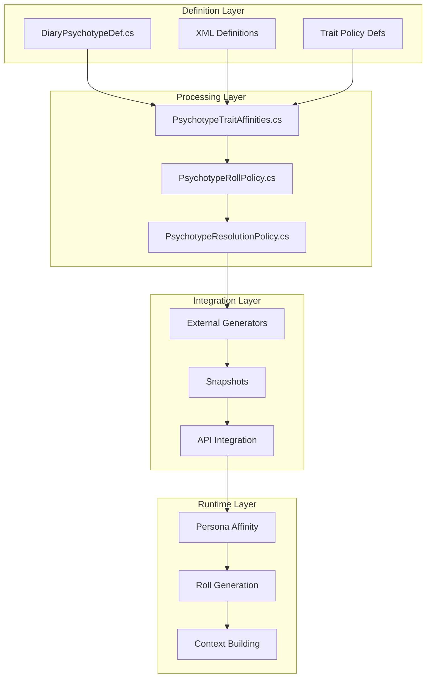
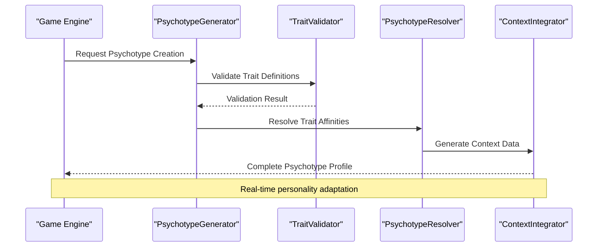
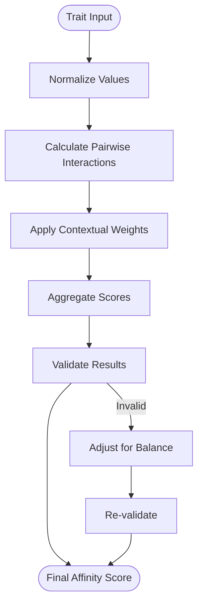
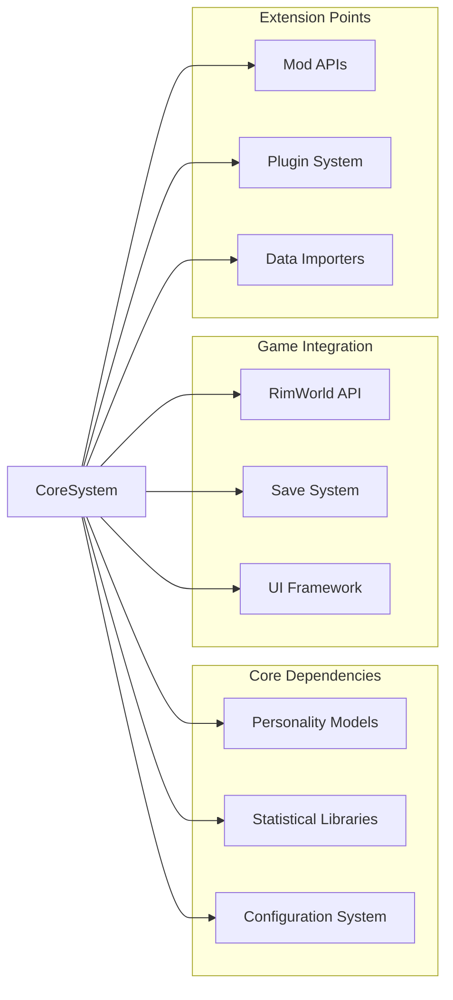

# Psychotype Attributes & Traits

<cite>
**Referenced Files in This Document**
- [DiaryPsychotypeDef.cs](../../../../../../Source/Defs/DiaryPsychotypeDef.cs)
- [DiaryPsychotypeDefs.xml](../../../../../../1.6/Defs/DiaryPsychotypeDefs.xml)
- [PsychotypeTraitAffinities.cs](../../../../../../Source/Pipeline/PsychotypeTraitAffinities.cs)
- [PsychotypeRollPolicy.cs](../../../../../../Source/Pipeline/PsychotypeRollPolicy.cs)
- [PsychotypeResolutionPolicy.cs](../../../../../../Source/Pipeline/PsychotypeResolutionPolicy.cs)
- [DiaryPsychotypeTraitPolicyDef.cs](../../../../../../Source/Defs/DiaryPsychotypeTraitPolicyDef.cs)
- [DiaryPsychotypeRollPolicyDef.cs](../../../../../../Source/Defs/DiaryPsychotypeRollPolicyDef.cs)
- [PersonaAffinity.cs](../../../../../../Source/Generation/PersonaAffinity.cs)
- [PsychotypeRolls.cs](../../../../../../Source/Generation/PsychotypeRolls.cs)
- [ExternalPsychotypeGenerators.cs](../../../../../../Source/Integration/ExternalPsychotypeGenerators.cs)
- [DiaryPsychotypeSnapshot.cs](../../../../../../Source/Integration/DiaryPsychotypeSnapshot.cs)
</cite>

## Table of Contents
1. [Introduction](#introduction)
2. [Project Structure](#project-structure)
3. [Core Components](#core-components)
4. [Architecture Overview](#architecture-overview)
5. [Detailed Component Analysis](#detailed-component-analysis)
6. [Dependency Analysis](#dependency-analysis)
7. [Performance Considerations](#performance-considerations)
8. [Troubleshooting Guide](#troubleshooting-guide)
9. [Conclusion](#conclusion)
10. [Appendices](#appendices)

## Introduction

This document provides comprehensive documentation for the psychotype attributes and trait affinity systems within the PawnDiary mod. The psychotype system enables dynamic character personality modeling through configurable traits, behavioral tendencies, mood correlations, and interaction preferences. These systems influence diary entry generation, emotional responses, and narrative continuity throughout gameplay.

The psychotype framework supports both predefined psychological profiles and dynamically generated personalities, allowing for rich character development and personalized storytelling experiences.

## Project Structure

The psychotype system is implemented across multiple layers:

**Diagram sources**
- [DiaryPsychotypeDef.cs:1-50](../../../../../../Source/Defs/DiaryPsychotypeDef.cs#L1-L50)
- [PsychotypeTraitAffinities.cs:1-100](../../../../../../Source/Pipeline/PsychotypeTraitAffinities.cs#L1-L100)
- [PsychotypeRollPolicy.cs:1-80](../../../../../../Source/Pipeline/PsychotypeRollPolicy.cs#L1-L80)

**Section sources**
- [DiaryPsychotypeDef.cs:1-100](../../../../../../Source/Defs/DiaryPsychotypeDef.cs#L1-L100)
- [DiaryPsychotypeDefs.xml:1-200](../../../../../../1.6/Defs/DiaryPsychotypeDefs.xml#L1-L200)

## Core Components

### Psychotype Definition Structure

The core psychotype definition system consists of several key components:

#### Personality Trait Framework
- **Trait Categories**: Organized personality dimensions (e.g., extraversion, agreeableness)
- **Weight Systems**: Numerical values determining trait strength (-1 to 1 scale)
- **Behavioral Tendencies**: Mappings between traits and observable behaviors
- **Mood Correlations**: Statistical relationships between traits and emotional states

#### Trait Affinity System
- **Affinity Calculations**: Dynamic scoring of trait combinations
- **Interaction Preferences**: Behavioral modifiers based on trait affinities
- **Emotional Response Weights**: Influence on diary entry tone and content
- **Narrative Continuity Factors**: Consistency maintenance across entries

#### Roll Policy Configuration
- **Distribution Policies**: Statistical models for trait generation
- **Balance Constraints**: Ensuring realistic personality distributions
- **Override Mechanisms**: Context-specific trait modifications
- **Validation Rules**: Ensuring definition integrity

**Section sources**
- [DiaryPsychotypeDef.cs:1-150](../../../../../../Source/Defs/DiaryPsychotypeDef.cs#L1-L150)
- [PsychotypeTraitAffinities.cs:1-200](../../../../../../Source/Pipeline/PsychotypeTraitAffinities.cs#L1-L200)

## Architecture Overview

The psychotype system follows a layered architecture pattern:

**Diagram sources**
- [PsychotypeRollPolicy.cs:1-120](../../../../../../Source/Pipeline/PsychotypeRollPolicy.cs#L1-L120)
- [PsychotypeResolutionPolicy.cs:1-100](../../../../../../Source/Pipeline/PsychotypeResolutionPolicy.cs#L1-L100)

## Detailed Component Analysis

### Psychotype Definition Schema

The psychotype definition schema supports complex personality modeling through structured XML definitions:

#### Core Definition Elements
- **Id**: Unique identifier for the psychotype
- **Label**: Human-readable name for UI display
- **Description**: Detailed explanation of personality characteristics
- **BaseTraits**: Foundation personality dimensions
- **TraitWeights**: Numerical strength indicators
- **BehavioralModifiers**: Action probability adjustments
- **MoodCorrelations**: Emotional response mappings

#### Trait Weighting System
The weighting system uses a normalized scale where:
- **-1.0**: Strong negative correlation
- **0.0**: No correlation
- **+1.0**: Strong positive correlation

#### Balance Constraints
Definitions must satisfy balance requirements:
- Total trait weight sum constraints
- Category distribution limits
- Minimum/maximum individual trait bounds
- Cross-trait compatibility rules

**Section sources**
- [DiaryPsychotypeDefs.xml:1-300](../../../../../../1.6/Defs/DiaryPsychotypeDefs.xml#L1-L300)
- [DiaryPsychotypeTraitPolicyDef.cs:1-100](../../../../../../Source/Defs/DiaryPsychotypeTraitPolicyDef.cs#L1-L100)

### Trait Affinity Calculation Engine

The affinity engine computes dynamic trait interactions:

#### Affinity Scoring Algorithm

**Diagram sources**
- [PsychotypeTraitAffinities.cs:1-150](../../../../../../Source/Pipeline/PsychotypeTraitAffinities.cs#L1-L150)

#### Interaction Preference Matrix
The system maintains preference matrices for:
- Social interaction styles
- Conflict resolution approaches
- Stress response patterns
- Decision-making biases

### Roll Policy Implementation

Roll policies govern how psychotypes are generated and modified:

#### Distribution Policies
- **Normal Distribution**: Bell curve for balanced traits
- **Uniform Distribution**: Equal probability across ranges
- **Custom Distribution**: User-defined probability functions
- **Conditional Distribution**: Context-dependent trait selection

#### Override Mechanisms
Override hierarchies ensure proper precedence:
1. **Base Definition**: Default trait values
2. **Policy Overrides**: Runtime modifications
3. **Context Modifiers**: Situation-specific adjustments
4. **Player Overrides**: Manual configuration

**Section sources**
- [PsychotypeRollPolicy.cs:1-200](../../../../../../Source/Pipeline/PsychotypeRollPolicy.cs#L1-L200)
- [PsychotypeRolls.cs:1-100](../../../../../../Source/Generation/PsychotypeRolls.cs#L1-L100)

### Resolution and Integration

The resolution system integrates psychotypes into the broader game context:

#### Context Provider Integration
Psychotypes provide data to various game systems:
- **Diary Entry Generation**: Influences narrative voice and topics
- **Social Interactions**: Modifies relationship building
- **Thought Processing**: Affects internal monologue patterns
- **Event Responses**: Shapes reactions to game events

#### Snapshot and API Support
The system exposes psychotype data through:
- **State Snapshots**: Save/load compatible representations
- **External APIs**: Integration points for other mods
- **Debug Interfaces**: Development and testing utilities

**Section sources**
- [PsychotypeResolutionPolicy.cs:1-150](../../../../../../Source/Pipeline/PsychotypeResolutionPolicy.cs#L1-L150)
- [ExternalPsychotypeGenerators.cs:1-100](../../../../../../Source/Integration/ExternalPsychotypeGenerators.cs#L1-L100)
- [DiaryPsychotypeSnapshot.cs:1-80](../../../../../../Source/Integration/DiaryPsychotypeSnapshot.cs#L1-L80)

## Dependency Analysis

The psychotype system has well-defined dependency relationships:

**Diagram sources**
- [DiaryPsychotypeDef.cs:1-50](../../../../../../Source/Defs/DiaryPsychotypeDef.cs#L1-L50)
- [PersonaAffinity.cs:1-100](../../../../../../Source/Generation/PersonaAffinity.cs#L1-L100)

### Coupling Analysis
- **Low Coupling**: Clear interfaces between subsystems
- **High Cohesion**: Related functionality grouped logically
- **Dependency Injection**: Flexible component composition
- **Interface Segregation**: Specialized contracts for specific use cases

**Section sources**
- [PersonaAffinity.cs:1-150](../../../../../../Source/Generation/PersonaAffinity.cs#L1-L150)
- [PsychotypeTraitAffinities.cs:1-200](../../../../../../Source/Pipeline/PsychotypeTraitAffinities.cs#L1-L200)

## Performance Considerations

### Computational Efficiency
- **Lazy Evaluation**: Trait calculations performed on-demand
- **Caching Strategies**: Memoization of expensive affinity computations
- **Batch Processing**: Grouped operations for improved throughput
- **Memory Management**: Efficient storage of psychotype snapshots

### Optimization Techniques
- **Early Exit Conditions**: Quick rejection of invalid configurations
- **Parallel Processing**: Multi-threaded trait validation
- **Incremental Updates**: Partial recomputation when traits change
- **Resource Pooling**: Shared instances for common operations

## Troubleshooting Guide

### Common Issues and Solutions

#### Invalid Trait Definitions
**Symptoms**: Load errors, missing personality data
**Causes**:
- Out-of-range trait weights
- Circular dependencies in trait definitions
- Missing required fields

**Solutions**:
- Validate trait weight sums
- Check for circular references
- Ensure all required fields are present

#### Performance Problems
**Symptoms**: Slow diary generation, memory leaks
**Causes**:
- Excessive trait recalculations
- Memory accumulation in long sessions
- Inefficient affinity computations

**Solutions**:
- Implement caching strategies
- Monitor memory usage patterns
- Optimize calculation algorithms

#### Integration Conflicts
**Symptoms**: Other mods not recognizing psychotypes
**Causes**:
- API version mismatches
- Conflicting trait definitions
- Serialization incompatibilities

**Solutions**:
- Check API compatibility versions
- Use unique trait identifiers
- Implement proper serialization handlers

**Section sources**
- [DiaryPsychotypeSnapshot.cs:1-100](../../../../../../Source/Integration/DiaryPsychotypeSnapshot.cs#L1-L100)
- [ExternalPsychotypeGenerators.cs:1-150](../../../../../../Source/Integration/ExternalPsychotypeGenerators.cs#L1-L150)

## Conclusion

The psychotype attributes and trait affinity systems provide a sophisticated framework for dynamic character personality modeling in RimWorld. Through careful design of trait definitions, affinity calculations, and integration points, the system enables rich, personalized storytelling experiences while maintaining performance and extensibility.

The modular architecture supports both predefined psychological profiles and dynamically generated personalities, making it suitable for diverse gameplay scenarios and modding communities.

## Appendices

### Example Psychotype Definitions

#### Balanced Personality Template
A template for creating well-rounded characters with moderate trait distributions.

#### Extreme Personality Template
A template for characters with pronounced personality characteristics.

#### Role-Specific Templates
Templates designed for specific character roles (leader, scholar, warrior).

### Best Practices

#### Trait Distribution Guidelines
- Maintain balance across personality dimensions
- Avoid extreme values unless narratively justified
- Consider cultural and contextual influences

#### Performance Optimization Tips
- Cache frequently accessed trait calculations
- Use lazy evaluation for expensive operations
- Monitor memory usage during extended play sessions

#### Modding Guidelines
- Follow established naming conventions
- Provide clear documentation for custom traits
- Test compatibility with popular mods
