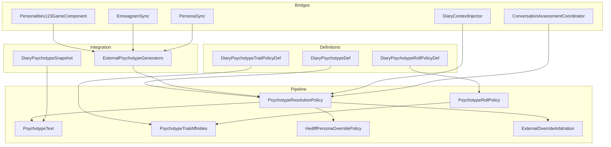
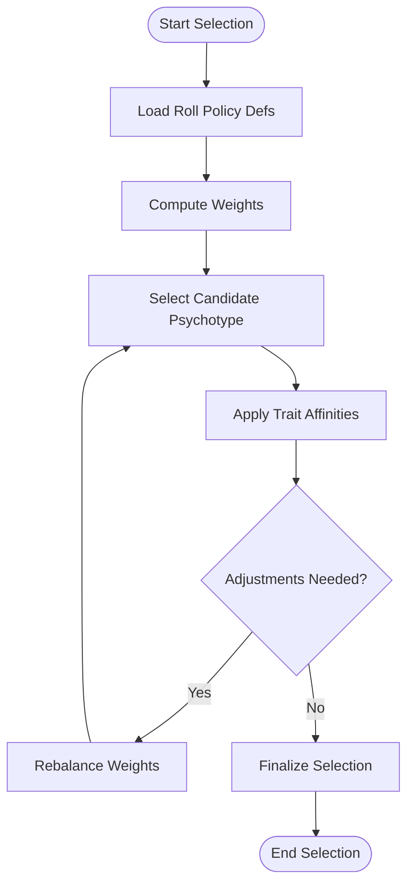
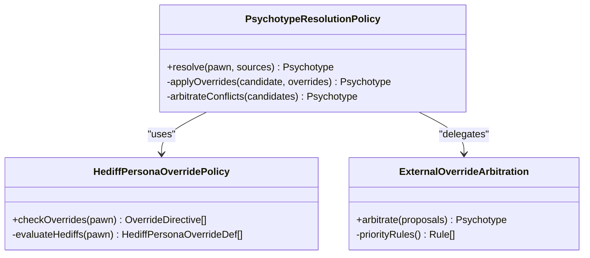
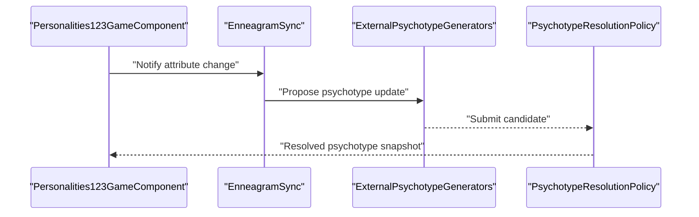
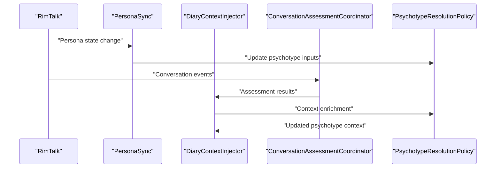
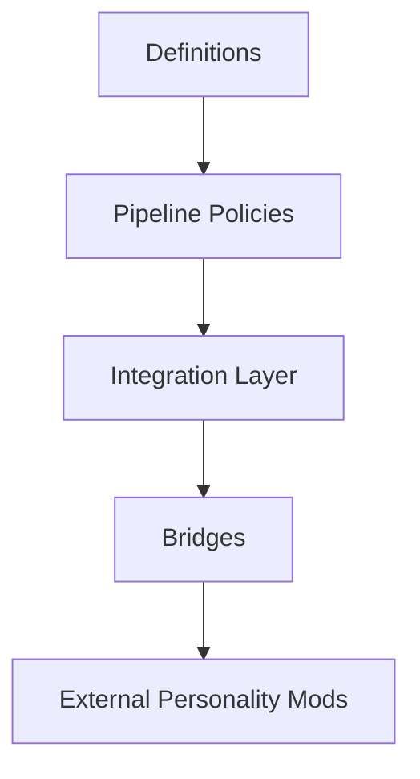

# Psychotype Integration & Overrides

## Table of Contents
1. [Introduction](#introduction)
2. [Project Structure](#project-structure)
3. [Core Components](#core-components)
4. [Architecture Overview](#architecture-overview)
5. [Detailed Component Analysis](#detailed-component-analysis)
6. [Dependency Analysis](#dependency-analysis)
7. [Performance Considerations](#performance-considerations)
8. [Troubleshooting Guide](#troubleshooting-guide)
9. [Conclusion](#conclusion)
10. [Appendices](#appendices)

## Introduction
This document explains how psychotypes are defined, resolved, and overridden within the system, and how they integrate with external personality mods and psychological frameworks (e.g., Enneagram, Big Five). It covers:
- How psychotypes interact with traits and persona systems
- Integration points for third-party personality systems
- Synchronization protocols between external models and internal representations
- Conflict resolution strategies when multiple sources propose different psychotypes or overrides
- Examples of bridging personality mods to the diary system
- Guidance on maintaining consistency across different psychological models
- Compatibility matrices, version management considerations, and troubleshooting steps

## Project Structure
The psychotype subsystem spans definitions, pipeline policies, integration APIs, and mod bridges:
- Definitions define psychotype types, roll policies, and trait affinities
- Pipeline policies resolve and render psychotypes, including override arbitration
- Integration layer exposes snapshots and generators for external systems
- Bridges connect specific personality mods (e.g., Personalities 1.2.3, RimTalk) to the core



**Diagram sources**
- [DiaryPsychotypeDef.cs](../../../../../../Source/Defs/DiaryPsychotypeDef.cs)
- [DiaryPsychotypeRollPolicyDef.cs](../../../../../../Source/Defs/DiaryPsychotypeRollPolicyDef.cs)
- [DiaryPsychotypeTraitPolicyDef.cs](../../../../../../Source/Defs/DiaryPsychotypeTraitPolicyDef.cs)
- [PsychotypeResolutionPolicy.cs](../../../../../../Source/Pipeline/PsychotypeResolutionPolicy.cs)
- [PsychotypeRollPolicy.cs](../../../../../../Source/Pipeline/PsychotypeRollPolicy.cs)
- [PsychotypeText.cs](../../../../../../Source/Pipeline/PsychotypeText.cs)
- [PsychotypeTraitAffinities.cs](../../../../../../Source/Pipeline/PsychotypeTraitAffinities.cs)
- [HediffPersonaOverridePolicy.cs](../../../../../../Source/Pipeline/HediffPersonaOverridePolicy.cs)
- [ExternalOverrideArbitration.cs](../../../../../../Source/Pipeline/ExternalOverrideArbitration.cs)
- [ExternalPsychotypeGenerators.cs](../../../../../../Source/Integration/ExternalPsychotypeGenerators.cs)
- [DiaryPsychotypeSnapshot.cs](../../../../../../Source/Integration/DiaryPsychotypeSnapshot.cs)
- [Personalities123GameComponent.cs](../../../../../../integrations/PawnDiary.PersonalitiesBridge/Source/Personalities123GameComponent.cs)
- [EnneagramSync.cs](../../../../../../integrations/PawnDiary.PersonalitiesBridge/Source/EnneagramSync.cs)
- [PersonaSync.cs](../../../../../../integrations/PawnDiary.RimTalkBridge/Source/PersonaSync.cs)
- [DiaryContextInjector.cs](../../../../../../integrations/PawnDiary.RimTalkBridge/Source/DiaryContextInjector.cs)
- [ConversationAssessmentCoordinator.cs](../../../../../../integrations/PawnDiary.RimTalkBridge/Source/ConversationAssessmentCoordinator.cs)

**Section sources**
- [DiaryPsychotypeDef.cs](../../../../../../Source/Defs/DiaryPsychotypeDef.cs)
- [DiaryPsychotypeRollPolicyDef.cs](../../../../../../Source/Defs/DiaryPsychotypeRollPolicyDef.cs)
- [DiaryPsychotypeTraitPolicyDef.cs](../../../../../../Source/Defs/DiaryPsychotypeTraitPolicyDef.cs)
- [PsychotypeResolutionPolicy.cs](../../../../../../Source/Pipeline/PsychotypeResolutionPolicy.cs)
- [PsychotypeRollPolicy.cs](../../../../../../Source/Pipeline/PsychotypeRollPolicy.cs)
- [PsychotypeText.cs](../../../../../../Source/Pipeline/PsychotypeText.cs)
- [PsychotypeTraitAffinities.cs](../../../../../../Source/Pipeline/PsychotypeTraitAffinities.cs)
- [HediffPersonaOverridePolicy.cs](../../../../../../Source/Pipeline/HediffPersonaOverridePolicy.cs)
- [ExternalOverrideArbitration.cs](../../../../../../Source/Pipeline/ExternalOverrideArbitration.cs)
- [ExternalPsychotypeGenerators.cs](../../../../../../Source/Integration/ExternalPsychotypeGenerators.cs)
- [DiaryPsychotypeSnapshot.cs](../../../../../../Source/Integration/DiaryPsychotypeSnapshot.cs)
- [Personalities123GameComponent.cs](../../../../../../integrations/PawnDiary.PersonalitiesBridge/Source/Personalities123GameComponent.cs)
- [EnneagramSync.cs](../../../../../../integrations/PawnDiary.PersonalitiesBridge/Source/EnneagramSync.cs)
- [PersonaSync.cs](../../../../../../integrations/PawnDiary.RimTalkBridge/Source/PersonaSync.cs)
- [DiaryContextInjector.cs](../../../../../../integrations/PawnDiary.RimTalkBridge/Source/DiaryContextInjector.cs)
- [ConversationAssessmentCoordinator.cs](../../../../../../integrations/PawnDiary.RimTalkBridge/Source/ConversationAssessmentCoordinator.cs)

## Core Components
- Psychotype definition model: Defines psychotype identity, metadata, and associated behavior hooks.
- Roll policy definitions: Configure probabilistic selection and weighting of psychotypes at generation time.
- Trait affinity mapping: Links psychotypes to trait effects and behavioral tendencies.
- Resolution policy: Orchestrates source priority, override application, and final psychotype selection.
- Text rendering: Produces display strings and contextual details for psychotypes.
- Override mechanisms: Hediff-based persona overrides and external arbitration rules.
- External generators: API surface for mods to supply psychotype candidates and updates.
- Snapshots: Stable data contracts for external consumers to observe current psychotype state.

Key responsibilities:
- Centralized resolution ensures a single authoritative psychotype per pawn
- Extensible sources allow multiple personality systems to contribute
- Deterministic conflict resolution prevents ambiguity
- Snapshotting supports UI and diagnostics without live coupling

**Section sources**
- [DiaryPsychotypeDef.cs](../../../../../../Source/Defs/DiaryPsychotypeDef.cs)
- [DiaryPsychotypeRollPolicyDef.cs](../../../../../../Source/Defs/DiaryPsychotypeRollPolicyDef.cs)
- [DiaryPsychotypeTraitPolicyDef.cs](../../../../../../Source/Defs/DiaryPsychotypeTraitPolicyDef.cs)
- [PsychotypeResolutionPolicy.cs](../../../../../../Source/Pipeline/PsychotypeResolutionPolicy.cs)
- [PsychotypeText.cs](../../../../../../Source/Pipeline/PsychotypeText.cs)
- [PsychotypeTraitAffinities.cs](../../../../../../Source/Pipeline/PsychotypeTraitAffinities.cs)
- [HediffPersonaOverridePolicy.cs](../../../../../../Source/Pipeline/HediffPersonaOverridePolicy.cs)
- [ExternalOverrideArbitration.cs](../../../../../../Source/Pipeline/ExternalOverrideArbitration.cs)
- [ExternalPsychotypeGenerators.cs](../../../../../../Source/Integration/ExternalPsychotypeGenerators.cs)
- [DiaryPsychotypeSnapshot.cs](../../../../../../Source/Integration/DiaryPsychotypeSnapshot.cs)

## Architecture Overview
The psychotype architecture separates concerns into definitions, pipeline processing, integration contracts, and bridge implementations. The resolution policy is the central coordinator that applies roll policies, trait affinities, hediff overrides, and external arbitration to produce a final psychotype.

```mermaid
sequenceDiagram
participant Mod as "Personality Mod"
participant Gen as "ExternalPsychotypeGenerators"
participant Res as "PsychotypeResolutionPolicy"
participant Roll as "PsychotypeRollPolicy"
participant Aff as "PsychotypeTraitAffinities"
participant Over as "HediffPersonaOverridePolicy"
participant Arb as "ExternalOverrideArbitration"
participant Txt as "PsychotypeText"
Mod->>Gen : "Register psychotype candidates"
Gen-->>Res : "Provide candidate list"
Res->>Roll : "Compute weighted selection"
Roll-->>Res : "Selected psychotype(s)"
Res->>Aff : "Apply trait affinities"
Aff-->>Res : "Adjusted affinities"
Res->>Over : "Check hediff persona overrides"
Over-->>Res : "Override directives"
Res->>Arb : "Resolve conflicts among sources"
Arb-->>Res : "Final decision"
Res->>Txt : "Render text and details"
Txt-->>Res : "Formatted output"
Res-->>Mod : "Resolved psychotype snapshot"
```

**Diagram sources**
- [ExternalPsychotypeGenerators.cs](../../../../../../Source/Integration/ExternalPsychotypeGenerators.cs)
- [PsychotypeResolutionPolicy.cs](../../../../../../Source/Pipeline/PsychotypeResolutionPolicy.cs)
- [PsychotypeRollPolicy.cs](../../../../../../Source/Pipeline/PsychotypeRollPolicy.cs)
- [PsychotypeTraitAffinities.cs](../../../../../../Source/Pipeline/PsychotypeTraitAffinities.cs)
- [HediffPersonaOverridePolicy.cs](../../../../../../Source/Pipeline/HediffPersonaOverridePolicy.cs)
- [ExternalOverrideArbitration.cs](../../../../../../Source/Pipeline/ExternalOverrideArbitration.cs)
- [PsychotypeText.cs](../../../../../../Source/Pipeline/PsychotypeText.cs)

## Detailed Component Analysis

### Psychotype Definition Model
- Purpose: Define psychotype identity, labels, and metadata consumed by the pipeline and UI.
- Typical fields: identifier, display name, description, tags, and optional hooks for integration.
- Usage: Referenced by roll policies and text rendering; used by snapshots for stable representation.

Implementation patterns:
- Immutable configuration via defs
- Clear separation between identity and runtime behavior
- Extensibility through tags and metadata

**Section sources**
- [DiaryPsychotypeDef.cs](../../../../../../Source/Defs/DiaryPsychotypeDef.cs)

### Roll Policies and Trait Affinities
- Roll policy definitions configure probabilities and conditions for selecting psychotypes during generation.
- Trait affinities map psychotypes to trait effects, influencing narrative tone and behavior.

Processing logic:
- Weighted selection based on roll policy parameters
- Post-selection adjustments via trait affinities
- Deterministic seeding where applicable for reproducibility



**Diagram sources**
- [DiaryPsychotypeRollPolicyDef.cs](../../../../../../Source/Defs/DiaryPsychotypeRollPolicyDef.cs)
- [PsychotypeRollPolicy.cs](../../../../../../Source/Pipeline/PsychotypeRollPolicy.cs)
- [PsychotypeTraitAffinities.cs](../../../../../../Source/Pipeline/PsychotypeTraitAffinities.cs)

**Section sources**
- [DiaryPsychotypeRollPolicyDef.cs](../../../../../../Source/Defs/DiaryPsychotypeRollPolicyDef.cs)
- [PsychotypeRollPolicy.cs](../../../../../../Source/Pipeline/PsychotypeRollPolicy.cs)
- [PsychotypeTraitAffinities.cs](../../../../../../Source/Pipeline/PsychotypeTraitAffinities.cs)

### Resolution Policy and Override Arbitration
- Resolution policy coordinates all sources: base definitions, roll outcomes, hediff persona overrides, and external arbitration.
- External override arbitration resolves conflicts when multiple sources propose different psychotypes.

Conflict resolution strategy:
- Priority tiers: explicit overrides > hediff persona overrides > external generator proposals > default roll results
- Deterministic tie-breaking using identifiers and timestamps
- Logging and diagnostics for auditability



**Diagram sources**
- [PsychotypeResolutionPolicy.cs](../../../../../../Source/Pipeline/PsychotypeResolutionPolicy.cs)
- [HediffPersonaOverridePolicy.cs](../../../../../../Source/Pipeline/HediffPersonaOverridePolicy.cs)
- [ExternalOverrideArbitration.cs](../../../../../../Source/Pipeline/ExternalOverrideArbitration.cs)

**Section sources**
- [PsychotypeResolutionPolicy.cs](../../../../../../Source/Pipeline/PsychotypeResolutionPolicy.cs)
- [HediffPersonaOverridePolicy.cs](../../../../../../Source/Pipeline/HediffPersonaOverridePolicy.cs)
- [ExternalOverrideArbitration.cs](../../../../../../Source/Pipeline/ExternalOverrideArbitration.cs)

### Text Rendering and Display
- Psychotype text component produces human-readable descriptions and contextual details.
- Integrates with localization and formatting pipelines.

Responsibilities:
- Generate consistent titles and summaries
- Inject dynamic context (traits, events, personas)
- Support style overrides from writing style policies

**Section sources**
- [PsychotypeText.cs](../../../../../../Source/Pipeline/PsychotypeText.cs)

### Integration Layer: Generators and Snapshots
- ExternalPsychotypeGenerators expose an API for mods to register psychotype candidates and update them over time.
- DiaryPsychotypeSnapshot provides a stable contract for observing current psychotype state without tight coupling.

Usage patterns:
- Mods register generators during initialization
- Periodic updates push changes to the resolution pipeline
- Consumers read snapshots for UI and diagnostics

**Section sources**
- [ExternalPsychotypeGenerators.cs](../../../../../../Source/Integration/ExternalPsychotypeGenerators.cs)
- [DiaryPsychotypeSnapshot.cs](../../../../../../Source/Integration/DiaryPsychotypeSnapshot.cs)

### Bridge: Personalities 1.2.3 and Enneagram Sync
- Personalities123GameComponent integrates the Personalities mod with the diary system.
- EnneagramSync synchronizes Enneagram-related personality attributes to internal representations.

Synchronization protocol:
- Event-driven updates when personality attributes change
- Mapping tables align external IDs to internal psychotype identifiers
- Conflict handling respects priority tiers



**Diagram sources**
- [Personalities123GameComponent.cs](../../../../../../integrations/PawnDiary.PersonalitiesBridge/Source/Personalities123GameComponent.cs)
- [EnneagramSync.cs](../../../../../../integrations/PawnDiary.PersonalitiesBridge/Source/EnneagramSync.cs)
- [ExternalPsychotypeGenerators.cs](../../../../../../Source/Integration/ExternalPsychotypeGenerators.cs)
- [PsychotypeResolutionPolicy.cs](../../../../../../Source/Pipeline/PsychotypeResolutionPolicy.cs)

**Section sources**
- [Personalities123GameComponent.cs](../../../../../../integrations/PawnDiary.PersonalitiesBridge/Source/Personalities123GameComponent.cs)
- [EnneagramSync.cs](../../../../../../integrations/PawnDiary.PersonalitiesBridge/Source/EnneagramSync.cs)

### Bridge: RimTalk Persona Sync and Context Injection
- PersonaSync synchronizes persona states from RimTalk to the diary system.
- DiaryContextInjector enriches diary entries with conversation assessments and persona context.
- ConversationAssessmentCoordinator tracks and evaluates conversational dynamics.

Integration flow:
- RimTalk emits persona updates
- PersonaSync maps updates to internal psychotype fields
- Context injector augments prompts and entries with persona-aware content



**Diagram sources**
- [PersonaSync.cs](../../../../../../integrations/PawnDiary.RimTalkBridge/Source/PersonaSync.cs)
- [DiaryContextInjector.cs](../../../../../../integrations/PawnDiary.RimTalkBridge/Source/DiaryContextInjector.cs)
- [ConversationAssessmentCoordinator.cs](../../../../../../integrations/PawnDiary.RimTalkBridge/Source/ConversationAssessmentCoordinator.cs)
- [PsychotypeResolutionPolicy.cs](../../../../../../Source/Pipeline/PsychotypeResolutionPolicy.cs)

**Section sources**
- [PersonaSync.cs](../../../../../../integrations/PawnDiary.RimTalkBridge/Source/PersonaSync.cs)
- [DiaryContextInjector.cs](../../../../../../integrations/PawnDiary.RimTalkBridge/Source/DiaryContextInjector.cs)
- [ConversationAssessmentCoordinator.cs](../../../../../../integrations/PawnDiary.RimTalkBridge/Source/ConversationAssessmentCoordinator.cs)

### Compatibility Patches and Affinities
- VTE psychotype affinities patch adjusts trait mappings for compatibility.
- Rimpsyche compatibility def aligns external psychological model identifiers with internal ones.

Purpose:
- Ensure consistent behavior across mods
- Provide fallback mappings when direct integration is unavailable

**Section sources**
- [VtePsychotypeAffinities.xml](../../../../../../1.6/Patches/VtePsychotypeAffinities.xml)
- [DiaryCompat_Rimpsyche.xml](../../../../../../1.6/Defs/Compat/DiaryCompat_Rimpsyche.xml)

## Dependency Analysis
The psychotype subsystem exhibits clear separation of concerns:
- Definitions depend only on core model contracts
- Pipeline policies depend on definitions and each other in a directed acyclic manner
- Integration layer depends on pipeline outputs and exposes stable snapshots
- Bridges depend on integration layer and external mod APIs



**Diagram sources**
- [DiaryPsychotypeDef.cs](../../../../../../Source/Defs/DiaryPsychotypeDef.cs)
- [PsychotypeResolutionPolicy.cs](../../../../../../Source/Pipeline/PsychotypeResolutionPolicy.cs)
- [ExternalPsychotypeGenerators.cs](../../../../../../Source/Integration/ExternalPsychotypeGenerators.cs)
- [Personalities123GameComponent.cs](../../../../../../integrations/PawnDiary.PersonalitiesBridge/Source/Personalities123GameComponent.cs)
- [PersonaSync.cs](../../../../../../integrations/PawnDiary.RimTalkBridge/Source/PersonaSync.cs)

**Section sources**
- [DiaryPsychotypeDef.cs](../../../../../../Source/Defs/DiaryPsychotypeDef.cs)
- [PsychotypeResolutionPolicy.cs](../../../../../../Source/Pipeline/PsychotypeResolutionPolicy.cs)
- [ExternalPsychotypeGenerators.cs](../../../../../../Source/Integration/ExternalPsychotypeGenerators.cs)
- [Personalities123GameComponent.cs](../../../../../../integrations/PawnDiary.PersonalitiesBridge/Source/Personalities123GameComponent.cs)
- [PersonaSync.cs](../../../../../../integrations/PawnDiary.RimTalkBridge/Source/PersonaSync.cs)

## Performance Considerations
- Minimize redundant computations in resolution by caching intermediate results
- Use efficient mapping structures for trait affinities and ID translations
- Batch updates from external generators to reduce churn
- Prefer snapshot reads over live queries for UI responsiveness

[No sources needed since this section provides general guidance]

## Troubleshooting Guide
Common issues and resolutions:
- Conflicting psychotype proposals: Verify priority tiers and ensure explicit overrides are correctly applied
- Missing trait affinities: Check compatibility patches and mapping tables for missing entries
- Stale snapshots: Confirm periodic updates are triggered and generators are registered
- Localization inconsistencies: Validate text rendering paths and style overrides

Diagnostic aids:
- Use snapshots to inspect current psychotype state
- Review override arbitration logs for conflict resolution decisions
- Validate bridge synchronization events for timely updates

**Section sources**
- [ExternalOverrideArbitration.cs](../../../../../../Source/Pipeline/ExternalOverrideArbitration.cs)
- [DiaryPsychotypeSnapshot.cs](../../../../../../Source/Integration/DiaryPsychotypeSnapshot.cs)
- [HediffPersonaOverridePolicy.cs](../../../../../../Source/Pipeline/HediffPersonaOverridePolicy.cs)

## Conclusion
The psychotype subsystem provides a robust, extensible framework for integrating diverse personality models into the diary system. Through well-defined resolution policies, override arbitration, and stable integration contracts, it ensures consistency and compatibility across multiple psychological frameworks and mods. Bridges for Personalities 1.2.3 and RimTalk demonstrate practical integration patterns, while compatibility patches and affinity mappings maintain coherence across ecosystems.

[No sources needed since this section summarizes without analyzing specific files]

## Appendices

### Compatibility Matrix and Version Management
- Maintain mapping tables between external mod IDs and internal psychotype identifiers
- Track version constraints for bridges and compatibility patches
- Use semantic versioning for definitions and policies to manage breaking changes
- Provide migration scripts for schema evolution in trait affinities and roll policies

[No sources needed since this section provides general guidance]

### Best Practices for Custom Psychotype Sources
- Register generators early in mod initialization
- Implement deterministic tie-breaking for conflicts
- Emit snapshots on every state change
- Keep trait affinities aligned with narrative goals
- Test across load orders and mod combinations

[No sources needed since this section provides general guidance]
