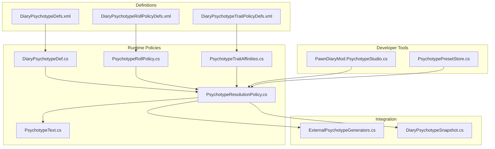
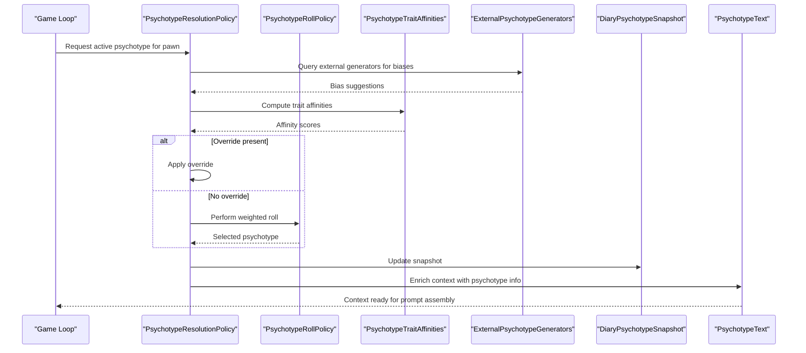
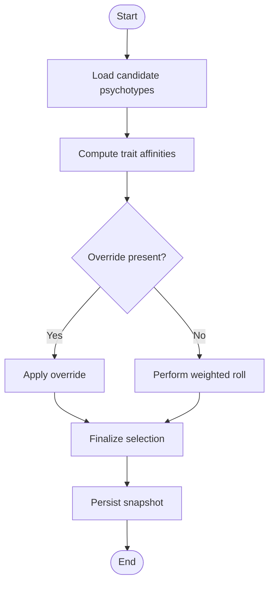
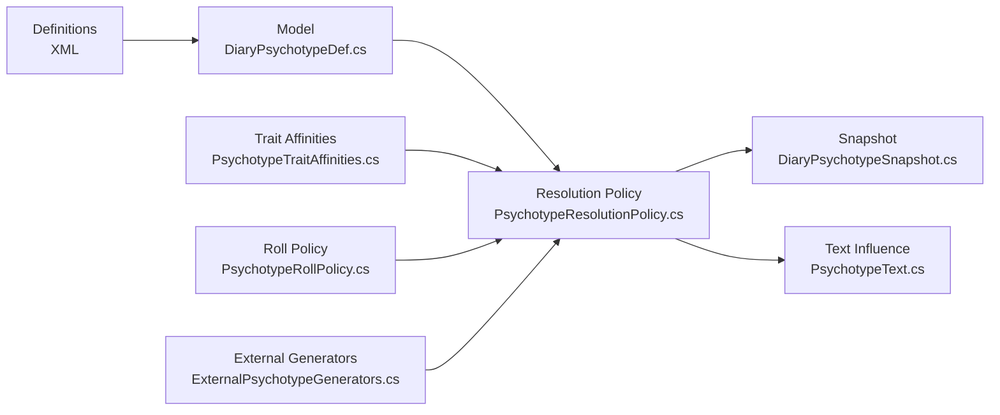

# Psychotype System

- [DiaryPsychotypeDefs.xml](../../../../../../1.6/Defs/DiaryPsychotypeDefs.xml)
- [DiaryPsychotypeRollPolicyDefs.xml](../../../../../../1.6/Defs/DiaryPsychotypeRollPolicyDefs.xml)
- [DiaryPsychotypeTraitPolicyDefs.xml](../../../../../../1.6/Defs/DiaryPsychotypeTraitPolicyDefs.xml)
- [VtePsychotypeAffinities.xml](../../../../../../1.6/Patches/VtePsychotypeAffinities.xml)
- [DiaryPsychotypeDef.cs](../../../../../../Source/Defs/DiaryPsychotypeDef.cs)
- [PsychotypeResolutionPolicy.cs](../../../../../../Source/Pipeline/PsychotypeResolutionPolicy.cs)
- [PsychotypeRollPolicy.cs](../../../../../../Source/Pipeline/PsychotypeRollPolicy.cs)
- [PsychotypeText.cs](../../../../../../Source/Pipeline/PsychotypeText.cs)
- [PsychotypeTraitAffinities.cs](../../../../../../Source/Pipeline/PsychotypeTraitAffinities.cs)
- [ExternalPsychotypeGenerators.cs](../../../../../../Source/Integration/ExternalPsychotypeGenerators.cs)
- [DiaryPsychotypeSnapshot.cs](../../../../../../Source/Integration/DiaryPsychotypeSnapshot.cs)
- [PawnDiaryMod.PsychotypeStudio.cs](../../../../../../Source/Settings/PawnDiaryMod.PsychotypeStudio.cs)
- [PsychotypePresetStore.cs](../../../../../../Source/Settings/PsychotypePresetStore.cs)
## Table of Contents
1. [Introduction](#introduction)
2. [Project Structure](#project-structure)
3. [Core Components](#core-components)
4. [Architecture Overview](#architecture-overview)
5. [Detailed Component Analysis](#detailed-component-analysis)
6. [Dependency Analysis](#dependency-analysis)
7. [Performance Considerations](#performance-considerations)
8. [Troubleshooting Guide](#troubleshooting-guide)
9. [Conclusion](#conclusion)
10. [Appendices](#appendices)

## Introduction
This document explains the psychotype system used for pawn psychological profiling and diary entry generation. It covers psychotype attributes, trait affinities, mood correlations, behavioral tendencies, assignment algorithms, override mechanisms, dynamic adjustments, persistence, migration strategies, debugging, and integration with personality mods. The goal is to help modders and advanced users create custom psychotypes, balance profiles, and integrate smoothly with other systems.

## Project Structure
The psychotype system spans definitions (XML), runtime policies (C#), integration snapshots, and developer tooling:
- Definitions define psychotype types, roll policies, and trait policy mappings.
- Runtime policies resolve psychotypes at runtime, apply overrides, and compute text influences.
- Integration exposes snapshots and external generators for compatibility.
- Developer tools provide a studio and presets for balancing and testing.

**Diagram sources**
- [DiaryPsychotypeDefs.xml](../../../../../../1.6/Defs/DiaryPsychotypeDefs.xml)
- [DiaryPsychotypeRollPolicyDefs.xml](../../../../../../1.6/Defs/DiaryPsychotypeRollPolicyDefs.xml)
- [DiaryPsychotypeTraitPolicyDefs.xml](../../../../../../1.6/Defs/DiaryPsychotypeTraitPolicyDefs.xml)
- [DiaryPsychotypeDef.cs](../../../../../../Source/Defs/DiaryPsychotypeDef.cs)
- [PsychotypeResolutionPolicy.cs](../../../../../../Source/Pipeline/PsychotypeResolutionPolicy.cs)
- [PsychotypeRollPolicy.cs](../../../../../../Source/Pipeline/PsychotypeRollPolicy.cs)
- [PsychotypeText.cs](../../../../../../Source/Pipeline/PsychotypeText.cs)
- [PsychotypeTraitAffinities.cs](../../../../../../Source/Pipeline/PsychotypeTraitAffinities.cs)
- [ExternalPsychotypeGenerators.cs](../../../../../../Source/Integration/ExternalPsychotypeGenerators.cs)
- [DiaryPsychotypeSnapshot.cs](../../../../../../Source/Integration/DiaryPsychotypeSnapshot.cs)
- [PawnDiaryMod.PsychotypeStudio.cs](../../../../../../Source/Settings/PawnDiaryMod.PsychotypeStudio.cs)
- [PsychotypePresetStore.cs](../../../../../../Source/Settings/PsychotypePresetStore.cs)

**Section sources**
- [DiaryPsychotypeDefs.xml](../../../../../../1.6/Defs/DiaryPsychotypeDefs.xml)
- [DiaryPsychotypeRollPolicyDefs.xml](../../../../../../1.6/Defs/DiaryPsychotypeRollPolicyDefs.xml)
- [DiaryPsychotypeTraitPolicyDefs.xml](../../../../../../1.6/Defs/DiaryPsychotypeTraitPolicyDefs.xml)
- [DiaryPsychotypeDef.cs](../../../../../../Source/Defs/DiaryPsychotypeDef.cs)
- [PsychotypeResolutionPolicy.cs](../../../../../../Source/Pipeline/PsychotypeResolutionPolicy.cs)
- [PsychotypeRollPolicy.cs](../../../../../../Source/Pipeline/PsychotypeRollPolicy.cs)
- [PsychotypeText.cs](../../../../../../Source/Pipeline/PsychotypeText.cs)
- [PsychotypeTraitAffinities.cs](../../../../../../Source/Pipeline/PsychotypeTraitAffinities.cs)
- [ExternalPsychotypeGenerators.cs](../../../../../../Source/Integration/ExternalPsychotypeGenerators.cs)
- [DiaryPsychotypeSnapshot.cs](../../../../../../Source/Integration/DiaryPsychotypeSnapshot.cs)
- [PawnDiaryMod.PsychotypeStudio.cs](../../../../../../Source/Settings/PawnDiaryMod.PsychotypeStudio.cs)
- [PsychotypePresetStore.cs](../../../../../../Source/Settings/PsychotypePresetStore.cs)

## Core Components
- Psychotype definition model: Represents a psychotype’s identity, metadata, and configuration fields consumed by resolution and text generation.
- Resolution policy: Orchestrates selection, override application, and finalization of a pawn’s active psychotype.
- Roll policy: Implements probabilistic or weighted selection when no explicit override exists.
- Trait affinities: Encodes how traits influence psychotype affinity scores and selection probabilities.
- Text influence: Adjusts prompt context and phrasing based on the resolved psychotype.
- External generators: Allow other mods to supply or bias psychotype choices.
- Snapshot: Provides a serializable view of the current psychotype state for UI and diagnostics.
- Studio and presets: Provide authoring and balancing workflows for designers.

Key responsibilities:
- Define and load psychotype data from XML.
- Compute affinities and select a psychotype per pawn.
- Apply overrides and ensure consistency across sessions.
- Influence narrative text generation via context enrichment.

**Section sources**
- [DiaryPsychotypeDef.cs](../../../../../../Source/Defs/DiaryPsychotypeDef.cs)
- [PsychotypeResolutionPolicy.cs](../../../../../../Source/Pipeline/PsychotypeResolutionPolicy.cs)
- [PsychotypeRollPolicy.cs](../../../../../../Source/Pipeline/PsychotypeRollPolicy.cs)
- [PsychotypeTraitAffinities.cs](../../../../../../Source/Pipeline/PsychotypeTraitAffinities.cs)
- [PsychotypeText.cs](../../../../../../Source/Pipeline/PsychotypeText.cs)
- [ExternalPsychotypeGenerators.cs](../../../../../../Source/Integration/ExternalPsychotypeGenerators.cs)
- [DiaryPsychotypeSnapshot.cs](../../../../../../Source/Integration/DiaryPsychotypeSnapshot.cs)
- [PawnDiaryMod.PsychotypeStudio.cs](../../../../../../Source/Settings/PawnDiaryMod.PsychotypeStudio.cs)
- [PsychotypePresetStore.cs](../../../../../../Source/Settings/PsychotypePresetStore.cs)

## Architecture Overview
The psychotype pipeline integrates with event-driven diary generation. At key moments (e.g., new entries, periodic updates), the system resolves the pawn’s psychotype using definitions, roll policies, trait affinities, and any overrides. The resolved psychotype then enriches context for prompt assembly and text decoration.

**Diagram sources**
- [PsychotypeResolutionPolicy.cs](../../../../../../Source/Pipeline/PsychotypeResolutionPolicy.cs)
- [PsychotypeRollPolicy.cs](../../../../../../Source/Pipeline/PsychotypeRollPolicy.cs)
- [PsychotypeTraitAffinities.cs](../../../../../../Source/Pipeline/PsychotypeTraitAffinities.cs)
- [ExternalPsychotypeGenerators.cs](../../../../../../Source/Integration/ExternalPsychotypeGenerators.cs)
- [DiaryPsychotypeSnapshot.cs](../../../../../../Source/Integration/DiaryPsychotypeSnapshot.cs)
- [PsychotypeText.cs](../../../../../../Source/Pipeline/PsychotypeText.cs)

## Detailed Component Analysis

### Psychotype Definition Model
- Purpose: Holds the canonical schema for a psychotype, including identifiers, display names, and configuration fields used by policies and text generation.
- Typical fields include:
  - Unique identifier
  - Display name and description
  - Weights or flags influencing selection
  - References to trait affinities or modifiers
  - Flags controlling behavior such as exclusivity or muting certain prompts
- Loading: Parsed from XML definitions into runtime objects.

Best practices:
- Keep identifiers stable for save compatibility.
- Use descriptive names and clear descriptions for authoring clarity.
- Avoid overly complex interdependencies between psychotypes.

**Section sources**
- [DiaryPsychotypeDef.cs](../../../../../../Source/Defs/DiaryPsychotypeDef.cs)
- [DiaryPsychotypeDefs.xml](../../../../../../1.6/Defs/DiaryPsychotypeDefs.xml)

### Psychotype Assignment Algorithm
- Inputs:
  - Pawn traits and relevant game state
  - Existing overrides
  - External generator suggestions
  - Roll policy weights
- Process:
  1. Gather candidate psychotypes from definitions.
  2. Compute trait affinities to score candidates.
  3. Apply external generator biases if provided.
  4. If an override exists for the pawn, use it directly.
  5. Otherwise, perform a weighted roll to select a psychotype.
  6. Finalize and persist the result.
- Outputs:
  - Active psychotype for the pawn
  - Updated snapshot for inspection and debugging

**Diagram sources**
- [PsychotypeResolutionPolicy.cs](../../../../../../Source/Pipeline/PsychotypeResolutionPolicy.cs)
- [PsychotypeRollPolicy.cs](../../../../../../Source/Pipeline/PsychotypeRollPolicy.cs)
- [PsychotypeTraitAffinities.cs](../../../../../../Source/Pipeline/PsychotypeTraitAffinities.cs)
- [ExternalPsychotypeGenerators.cs](../../../../../../Source/Integration/ExternalPsychotypeGenerators.cs)
- [DiaryPsychotypeSnapshot.cs](../../../../../../Source/Integration/DiaryPsychotypeSnapshot.cs)

**Section sources**
- [PsychotypeResolutionPolicy.cs](../../../../../../Source/Pipeline/PsychotypeResolutionPolicy.cs)
- [PsychotypeRollPolicy.cs](../../../../../../Source/Pipeline/PsychotypeRollPolicy.cs)
- [PsychotypeTraitAffinities.cs](../../../../../../Source/Pipeline/PsychotypeTraitAffinities.cs)
- [ExternalPsychotypeGenerators.cs](../../../../../../Source/Integration/ExternalPsychotypeGenerators.cs)
- [DiaryPsychotypeSnapshot.cs](../../../../../../Source/Integration/DiaryPsychotypeSnapshot.cs)

### Trait Affinities and Mood Correlations
- Trait affinities quantify how specific traits increase or decrease a psychotype’s likelihood.
- Affinities can be additive or multiplicative depending on policy configuration.
- Mood correlations are typically modeled through thought-based signals that adjust affinities temporarily or permanently.
- Example integrations:
  - Trait-to-psychotype mapping via trait policy definitions.
  - Patch-based affinities for third-party trait packs.

Balancing tips:
- Ensure trait effects are bounded to avoid deterministic outcomes.
- Use soft caps or diminishing returns to maintain diversity.
- Validate interactions between multiple trait sets.

**Section sources**
- [PsychotypeTraitAffinities.cs](../../../../../../Source/Pipeline/PsychotypeTraitAffinities.cs)
- [DiaryPsychotypeTraitPolicyDefs.xml](../../../../../../1.6/Defs/DiaryPsychotypeTraitPolicyDefs.xml)
- [VtePsychotypeAffinities.xml](../../../../../../1.6/Patches/VtePsychotypeAffinities.xml)

### Behavioral Tendencies and Text Influence
- The resolved psychotype influences:
  - Prompt context enrichment
  - Text decorations and stylistic cues
  - Event window eligibility and content emphasis
- Implementation:
  - A dedicated component injects psychotype-derived context into the prompt pipeline.
  - Decorators may alter formatting or tone based on psychotype flags.

Guidelines:
- Keep text changes subtle to preserve readability.
- Avoid overfitting to niche psychotypes; ensure general coherence.

**Section sources**
- [PsychotypeText.cs](../../../../../../Source/Pipeline/PsychotypeText.cs)

### Overrides and Dynamic Adjustment Rules
- Overrides allow explicit assignment of a psychotype to a pawn, bypassing default selection.
- Sources of overrides:
  - In-game settings or studio actions
  - External mod APIs
  - Hediff-based persona overrides (if applicable)
- Dynamic adjustment rules:
  - Re-evaluation triggers on significant events (e.g., major life changes).
  - Temporary boosts or dampeners based on recent experiences.
  - Cooldowns or stability checks to prevent rapid oscillation.

Implementation notes:
- Overrides should be persisted alongside the pawn record.
- Reconciliation logic ensures consistency after saves and patches.

**Section sources**
- [PsychotypeResolutionPolicy.cs](../../../../../../Source/Pipeline/PsychotypeResolutionPolicy.cs)
- [DiaryPsychotypeSnapshot.cs](../../../../../../Source/Integration/DiaryPsychotypeSnapshot.cs)

### Persistence and Migration Strategies
- Persistence:
  - Active psychotype stored in the pawn’s diary record or associated state.
  - Snapshot provides a serializable representation for UI and diagnostics.
- Migration:
  - When definitions change (e.g., added fields), migration logic must handle older saves gracefully.
  - Default fallbacks and normalization steps ensure compatibility.

Recommendations:
- Version your psychotype definitions and track schema changes.
- Provide backward-compatible defaults for unknown fields.
- Test migrations across save versions.

**Section sources**
- [DiaryPsychotypeSnapshot.cs](../../../../../../Source/Integration/DiaryPsychotypeSnapshot.cs)
- [PsychotypeResolutionPolicy.cs](../../../../../../Source/Pipeline/PsychotypeResolutionPolicy.cs)

### Creating Custom Psychotypes
Steps:
1. Add a new psychotype definition in the XML file.
2. Configure trait affinities and roll weights as needed.
3. Optionally add patch-based affinities for third-party traits.
4. Validate via the Psychotype Studio and preset store.
5. Integrate with external generators if you want mod-specific behaviors.

Checklist:
- Unique identifier and clear display name
- Balanced affinities and weights
- Consistent behavior with existing psychotypes
- Documentation for mod authors and players

**Section sources**
- [DiaryPsychotypeDefs.xml](../../../../../../1.6/Defs/DiaryPsychotypeDefs.xml)
- [DiaryPsychotypeTraitPolicyDefs.xml](../../../../../../1.6/Defs/DiaryPsychotypeTraitPolicyDefs.xml)
- [VtePsychotypeAffinities.xml](../../../../../../1.6/Patches/VtePsychotypeAffinities.xml)
- [PawnDiaryMod.PsychotypeStudio.cs](../../../../../../Source/Settings/PawnDiaryMod.PsychotypeStudio.cs)
- [PsychotypePresetStore.cs](../../../../../../Source/Settings/PsychotypePresetStore.cs)

### Balancing Psychological Profiles
- Goals:
  - Maintain diversity among pawns
  - Prevent dominant psychotypes from overshadowing others
  - Ensure trait effects are meaningful but not deterministic
- Techniques:
  - Normalize affinity scores before rolling
  - Apply caps or penalties for extreme combinations
  - Use external generators to introduce situational biases
- Validation:
  - Run simulations with varied trait distributions
  - Inspect snapshots to confirm expected distributions

**Section sources**
- [PsychotypeRollPolicy.cs](../../../../../../Source/Pipeline/PsychotypeRollPolicy.cs)
- [PsychotypeTraitAffinities.cs](../../../../../../Source/Pipeline/PsychotypeTraitAffinities.cs)
- [ExternalPsychotypeGenerators.cs](../../../../../../Source/Integration/ExternalPsychotypeGenerators.cs)

### Integrating with Personality Mods
- External generators allow other mods to propose or bias psychotype selections.
- Bridges can synchronize personality frameworks with psychotype states.
- Snapshot API enables reading and displaying psychotype information in external UIs.

Integration patterns:
- Register generators during mod initialization
- Respect override precedence and cooldowns
- Provide fallbacks when external data is unavailable

**Section sources**
- [ExternalPsychotypeGenerators.cs](../../../../../../Source/Integration/ExternalPsychotypeGenerators.cs)
- [DiaryPsychotypeSnapshot.cs](../../../../../../Source/Integration/DiaryPsychotypeSnapshot.cs)

## Dependency Analysis
The psychotype system has clear separation between definitions, runtime policies, and integration points. Coupling is minimized by using well-defined interfaces and snapshots.

**Diagram sources**
- [DiaryPsychotypeDef.cs](../../../../../../Source/Defs/DiaryPsychotypeDef.cs)
- [PsychotypeResolutionPolicy.cs](../../../../../../Source/Pipeline/PsychotypeResolutionPolicy.cs)
- [PsychotypeTraitAffinities.cs](../../../../../../Source/Pipeline/PsychotypeTraitAffinities.cs)
- [PsychotypeRollPolicy.cs](../../../../../../Source/Pipeline/PsychotypeRollPolicy.cs)
- [ExternalPsychotypeGenerators.cs](../../../../../../Source/Integration/ExternalPsychotypeGenerators.cs)
- [DiaryPsychotypeSnapshot.cs](../../../../../../Source/Integration/DiaryPsychotypeSnapshot.cs)
- [PsychotypeText.cs](../../../../../../Source/Pipeline/PsychotypeText.cs)

**Section sources**
- [DiaryPsychotypeDef.cs](../../../../../../Source/Defs/DiaryPsychotypeDef.cs)
- [PsychotypeResolutionPolicy.cs](../../../../../../Source/Pipeline/PsychotypeResolutionPolicy.cs)
- [PsychotypeTraitAffinities.cs](../../../../../../Source/Pipeline/PsychotypeTraitAffinities.cs)
- [PsychotypeRollPolicy.cs](../../../../../../Source/Pipeline/PsychotypeRollPolicy.cs)
- [ExternalPsychotypeGenerators.cs](../../../../../../Source/Integration/ExternalPsychotypeGenerators.cs)
- [DiaryPsychotypeSnapshot.cs](../../../../../../Source/Integration/DiaryPsychotypeSnapshot.cs)
- [PsychotypeText.cs](../../../../../../Source/Pipeline/PsychotypeText.cs)

## Performance Considerations
- Cache trait affinities where possible to avoid recomputation on every evaluation.
- Limit re-evaluation frequency; use event-driven triggers rather than polling.
- Keep external generator calls lightweight and asynchronous if feasible.
- Prefer normalized scoring to reduce numerical instability.

[No sources needed since this section provides general guidance]

## Troubleshooting Guide
Common issues and resolutions:
- Psychotype not changing as expected:
  - Verify overrides and check snapshot for current state.
  - Confirm trait affinities and roll weights are configured correctly.
- Conflicts with personality mods:
  - Ensure external generators register properly and respect precedence.
  - Use snapshots to inspect synchronization status.
- Save migration problems:
  - Check for missing fields in newer definitions and ensure defaults are applied.
  - Validate normalization routines during load.

Debugging steps:
- Use the Psychotype Studio to simulate assignments and observe outcomes.
- Inspect snapshots before and after events to trace changes.
- Review logs for errors in external generators or affinity computations.

**Section sources**
- [PawnDiaryMod.PsychotypeStudio.cs](../../../../../../Source/Settings/PawnDiaryMod.PsychotypeStudio.cs)
- [DiaryPsychotypeSnapshot.cs](../../../../../../Source/Integration/DiaryPsychotypeSnapshot.cs)
- [PsychotypeResolutionPolicy.cs](../../../../../../Source/Pipeline/PsychotypeResolutionPolicy.cs)

## Conclusion
The psychotype system provides a flexible framework for modeling pawn psychology and influencing diary narratives. By combining definitions, trait affinities, roll policies, and external generators, it supports rich customization while maintaining performance and compatibility. Proper balancing, persistence, and migration strategies ensure long-term stability and mod interoperability.

[No sources needed since this section summarizes without analyzing specific files]

## Appendices

### Quick Reference: Key Files
- Definitions:
  - [DiaryPsychotypeDefs.xml](../../../../../../1.6/Defs/DiaryPsychotypeDefs.xml)
  - [DiaryPsychotypeRollPolicyDefs.xml](../../../../../../1.6/Defs/DiaryPsychotypeRollPolicyDefs.xml)
  - [DiaryPsychotypeTraitPolicyDefs.xml](../../../../../../1.6/Defs/DiaryPsychotypeTraitPolicyDefs.xml)
  - [VtePsychotypeAffinities.xml](../../../../../../1.6/Patches/VtePsychotypeAffinities.xml)
- Runtime:
  - [DiaryPsychotypeDef.cs](../../../../../../Source/Defs/DiaryPsychotypeDef.cs)
  - [PsychotypeResolutionPolicy.cs](../../../../../../Source/Pipeline/PsychotypeResolutionPolicy.cs)
  - [PsychotypeRollPolicy.cs](../../../../../../Source/Pipeline/PsychotypeRollPolicy.cs)
  - [PsychotypeTraitAffinities.cs](../../../../../../Source/Pipeline/PsychotypeTraitAffinities.cs)
  - [PsychotypeText.cs](../../../../../../Source/Pipeline/PsychotypeText.cs)
- Integration:
  - [ExternalPsychotypeGenerators.cs](../../../../../../Source/Integration/ExternalPsychotypeGenerators.cs)
  - [DiaryPsychotypeSnapshot.cs](../../../../../../Source/Integration/DiaryPsychotypeSnapshot.cs)
- Developer Tools:
  - [PawnDiaryMod.PsychotypeStudio.cs](../../../../../../Source/Settings/PawnDiaryMod.PsychotypeStudio.cs)
  - [PsychotypePresetStore.cs](../../../../../../Source/Settings/PsychotypePresetStore.cs)
