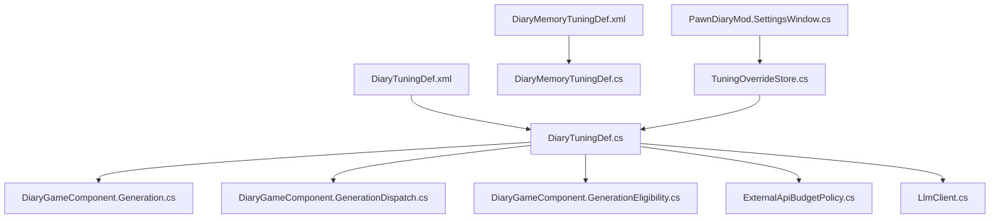
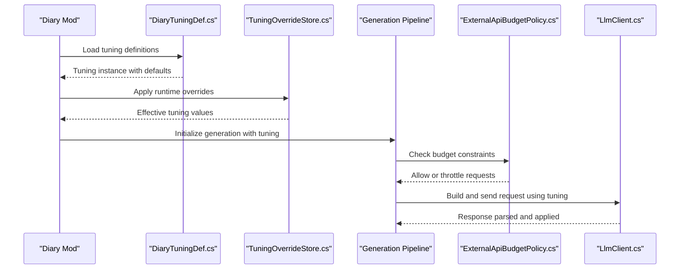
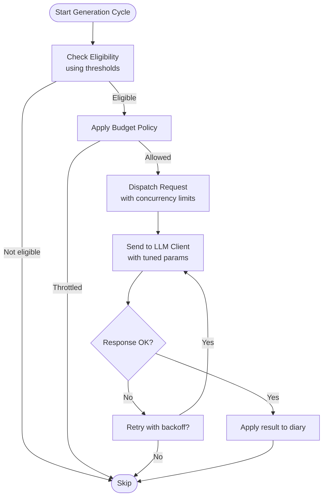
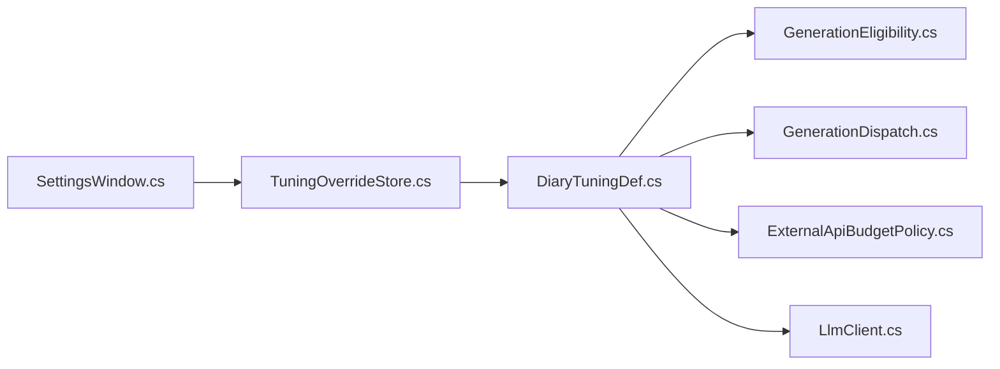

# Tuning Definitions

- [DiaryTuningDef.xml](../../../../../1.6/Defs/DiaryTuningDef.xml)
- [DiaryTuningDef.cs](../../../../../Source/Defs/DiaryTuningDef.cs)
- [DiaryMemoryTuningDef.xml](../../../../../1.6/Defs/DiaryMemoryTuningDef.xml)
- [DiaryMemoryTuningDef.cs](../../../../../Source/Defs/DiaryMemoryTuningDef.cs)
- [PawnDiaryMod.SettingsWindow.cs](../../../../../Source/Settings/PawnDiaryMod.SettingsWindow.cs)
- [TuningOverrideStore.cs](../../../../../Source/Settings/TuningOverrideStore.cs)
- [TuningOverrideMigration.cs](../../../../../Source/Settings/TuningOverrideMigration.cs)
- [DiaryGameComponent.Generation.cs](../../../../../Source/Core/DiaryGameComponent.Generation.cs)
- [DiaryGameComponent.GenerationDispatch.cs](../../../../../Source/Core/DiaryGameComponent.GenerationDispatch.cs)
- [DiaryGameComponent.GenerationEligibility.cs](../../../../../Source/Core/DiaryGameComponent.GenerationEligibility.cs)
- [ExternalApiBudgetPolicy.cs](../../../../../Source/Pipeline/ExternalApiBudgetPolicy.cs)
- [LlmClient.cs](../../../../../Source/Generation/LlmClient.cs)
## Table of Contents
1. [Introduction](#introduction)
2. [Project Structure](#project-structure)
3. [Core Components](#core-components)
4. [Architecture Overview](#architecture-overview)
5. [Detailed Component Analysis](#detailed-component-analysis)
6. [Dependency Analysis](#dependency-analysis)
7. [Performance Considerations](#performance-considerations)
8. [Troubleshooting Guide](#troubleshooting-guide)
9. [Conclusion](#conclusion)
10. [Appendices](#appendices)

## Introduction
This document explains the tuning system for the Diary mod, focusing on the DiaryTuningDef XML schema and its C# implementation. It covers AI generation settings, performance thresholds, memory limits, and behavioral modifiers. You will find numeric ranges, default values, validation constraints, and practical tuning scenarios to adjust response quality, control generation frequency, and optimize for different hardware configurations. The goal is to help you understand how tuning values affect system performance and user experience.

## Project Structure
The tuning system is defined by XML definitions and implemented in C#. Key files include:
- XML definition for global tuning parameters
- C# class that loads and exposes tuning values
- Memory tuning definition and loader
- Settings UI and override store for runtime adjustments
- Generation pipeline components that consume tuning values

**Diagram sources**
- [DiaryTuningDef.xml](../../../../../1.6/Defs/DiaryTuningDef.xml)
- [DiaryTuningDef.cs](../../../../../Source/Defs/DiaryTuningDef.cs)
- [DiaryMemoryTuningDef.xml](../../../../../1.6/Defs/DiaryMemoryTuningDef.xml)
- [DiaryMemoryTuningDef.cs](../../../../../Source/Defs/DiaryMemoryTuningDef.cs)
- [DiaryGameComponent.Generation.cs](../../../../../Source/Core/DiaryGameComponent.Generation.cs)
- [DiaryGameComponent.GenerationDispatch.cs](../../../../../Source/Core/DiaryGameComponent.GenerationDispatch.cs)
- [DiaryGameComponent.GenerationEligibility.cs](../../../../../Source/Core/DiaryGameComponent.GenerationEligibility.cs)
- [ExternalApiBudgetPolicy.cs](../../../../../Source/Pipeline/ExternalApiBudgetPolicy.cs)
- [LlmClient.cs](../../../../../Source/Generation/LlmClient.cs)
- [PawnDiaryMod.SettingsWindow.cs](../../../../../Source/Settings/PawnDiaryMod.SettingsWindow.cs)
- [TuningOverrideStore.cs](../../../../../Source/Settings/TuningOverrideStore.cs)

**Section sources**
- [DiaryTuningDef.xml](../../../../../1.6/Defs/DiaryTuningDef.xml)
- [DiaryTuningDef.cs](../../../../../Source/Defs/DiaryTuningDef.cs)
- [DiaryMemoryTuningDef.xml](../../../../../1.6/Defs/DiaryMemoryTuningDef.xml)
- [DiaryMemoryTuningDef.cs](../../../../../Source/Defs/DiaryMemoryTuningDef.cs)
- [DiaryGameComponent.Generation.cs](../../../../../Source/Core/DiaryGameComponent.Generation.cs)
- [DiaryGameComponent.GenerationDispatch.cs](../../../../../Source/Core/DiaryGameComponent.GenerationDispatch.cs)
- [DiaryGameComponent.GenerationEligibility.cs](../../../../../Source/Core/DiaryGameComponent.GenerationEligibility.cs)
- [ExternalApiBudgetPolicy.cs](../../../../../Source/Pipeline/ExternalApiBudgetPolicy.cs)
- [LlmClient.cs](../../../../../Source/Generation/LlmClient.cs)
- [PawnDiaryMod.SettingsWindow.cs](../../../../../Source/Settings/PawnDiaryMod.SettingsWindow.cs)
- [TuningOverrideStore.cs](../../../../../Source/Settings/TuningOverrideStore.cs)

## Core Components
- DiaryTuningDef (XML + C#): Central tuning configuration loaded at startup. Exposes fields used across generation, budgeting, and eligibility checks.
- DiaryMemoryTuningDef (XML + C#): Memory-related tuning such as retention windows and eviction thresholds.
- Settings UI and Overrides: Runtime adjustment via UI and persistent overrides.
- Consumers: Generation pipeline, dispatch logic, eligibility filters, API budget policy, and LLM client.

Key responsibilities:
- Define tunable parameters with defaults and validation
- Provide accessors for consumers
- Support overrides and migration from older versions
- Integrate with UI for safe editing

**Section sources**
- [DiaryTuningDef.cs](../../../../../Source/Defs/DiaryTuningDef.cs)
- [DiaryMemoryTuningDef.cs](../../../../../Source/Defs/DiaryMemoryTuningDef.cs)
- [TuningOverrideStore.cs](../../../../../Source/Settings/TuningOverrideStore.cs)
- [TuningOverrideMigration.cs](../../../../../Source/Settings/TuningOverrideMigration.cs)
- [PawnDiaryMod.SettingsWindow.cs](../../../../../Source/Settings/PawnDiaryMod.SettingsWindow.cs)

## Architecture Overview
The tuning system follows a layered approach:
- Definition layer: XML schemas define available parameters and defaults
- Loading layer: C# classes parse XML into strongly-tuned objects
- Policy/consumer layer: Game components read tuning values to make decisions
- Override layer: Settings UI and stores allow runtime changes without rebuilding defs

**Diagram sources**
- [DiaryTuningDef.cs](../../../../../Source/Defs/DiaryTuningDef.cs)
- [TuningOverrideStore.cs](../../../../../Source/Settings/TuningOverrideStore.cs)
- [DiaryGameComponent.Generation.cs](../../../../../Source/Core/DiaryGameComponent.Generation.cs)
- [ExternalApiBudgetPolicy.cs](../../../../../Source/Pipeline/ExternalApiBudgetPolicy.cs)
- [LlmClient.cs](../../../../../Source/Generation/LlmClient.cs)

## Detailed Component Analysis

### DiaryTuningDef Schema and Implementation
- Purpose: Global tuning for AI generation behavior, performance thresholds, and memory management.
- Typical categories:
  - AI generation settings: temperature-like controls, max tokens, retry policies
  - Performance thresholds: request rate limits, timeouts, concurrency caps
  - Memory limits: context size caps, retention windows, eviction triggers
  - Behavioral modifiers: humor chance, narrative continuity toggles, persona affinity weights
- Validation:
  - Numeric ranges enforced during load or when applying overrides
  - Defaults provided if values are missing
  - Cross-field constraints checked (e.g., timeout must be greater than zero)
- Access pattern:
  - Singletons or static accessors expose effective values after overrides
  - Consumers query specific fields rather than parsing XML directly

Common usage points:
- Generation eligibility checks use thresholds to decide whether to generate
- Dispatch logic uses concurrency and rate-limit settings
- Budget policy enforces external API cost/time budgets
- LLM client applies token and timeout limits

**Section sources**
- [DiaryTuningDef.xml](../../../../../1.6/Defs/DiaryTuningDef.xml)
- [DiaryTuningDef.cs](../../../../../Source/Defs/DiaryTuningDef.cs)
- [DiaryGameComponent.GenerationEligibility.cs](../../../../../Source/Core/DiaryGameComponent.GenerationEligibility.cs)
- [DiaryGameComponent.GenerationDispatch.cs](../../../../../Source/Core/DiaryGameComponent.GenerationDispatch.cs)
- [ExternalApiBudgetPolicy.cs](../../../../../Source/Pipeline/ExternalApiBudgetPolicy.cs)
- [LlmClient.cs](../../../../../Source/Generation/LlmClient.cs)

### DiaryMemoryTuningDef Schema and Implementation
- Purpose: Fine-grained control over memory-related behaviors such as event retention, recall selection, and eviction planning.
- Typical categories:
  - Retention window length (ticks or days)
  - Eviction thresholds based on count or recency
  - Context compression or summarization triggers
- Validation:
  - Non-negative durations
  - Thresholds within reasonable bounds to avoid excessive churn
- Integration:
  - Used by memory pipeline components to plan extraction and recall
  - Influences prompt construction by limiting included facts

**Section sources**
- [DiaryMemoryTuningDef.xml](../../../../../1.6/Defs/DiaryMemoryTuningDef.xml)
- [DiaryMemoryTuningDef.cs](../../../../../Source/Defs/DiaryMemoryTuningDef.cs)

### Settings UI and Overrides
- Purpose: Provide an in-game interface to adjust tuning safely and persist changes.
- Features:
  - Sliders and inputs bound to tuning fields
  - Validation feedback and reset-to-default actions
  - Persistent storage of overrides separate from base definitions
- Migration:
  - Handles schema evolution by mapping old keys to new ones
  - Warns or adjusts incompatible values

**Section sources**
- [PawnDiaryMod.SettingsWindow.cs](../../../../../Source/Settings/PawnDiaryMod.SettingsWindow.cs)
- [TuningOverrideStore.cs](../../../../../Source/Settings/TuningOverrideStore.cs)
- [TuningOverrideMigration.cs](../../../../../Source/Settings/TuningOverrideMigration.cs)

### Generation Pipeline Consumption
- Eligibility: Uses thresholds to determine if a diary entry should be generated now.
- Dispatch: Applies concurrency and rate-limiting to avoid spikes.
- Budget: Enforces external API constraints like cost/time budgets.
- Client: Builds requests with tuned parameters (tokens, timeouts).

**Diagram sources**
- [DiaryGameComponent.Generation.cs](../../../../../Source/Core/DiaryGameComponent.Generation.cs)
- [DiaryGameComponent.GenerationDispatch.cs](../../../../../Source/Core/DiaryGameComponent.GenerationDispatch.cs)
- [DiaryGameComponent.GenerationEligibility.cs](../../../../../Source/Core/DiaryGameComponent.GenerationEligibility.cs)
- [ExternalApiBudgetPolicy.cs](../../../../../Source/Pipeline/ExternalApiBudgetPolicy.cs)
- [LlmClient.cs](../../../../../Source/Generation/LlmClient.cs)

## Dependency Analysis
- Strong coupling between tuning definitions and generation pipeline components
- Overrides layer decouples runtime changes from base definitions
- External dependencies:
  - LLM client respects tuning for request shaping
  - Budget policy may depend on external service constraints

**Diagram sources**
- [DiaryTuningDef.cs](../../../../../Source/Defs/DiaryTuningDef.cs)
- [DiaryGameComponent.GenerationEligibility.cs](../../../../../Source/Core/DiaryGameComponent.GenerationEligibility.cs)
- [DiaryGameComponent.GenerationDispatch.cs](../../../../../Source/Core/DiaryGameComponent.GenerationDispatch.cs)
- [ExternalApiBudgetPolicy.cs](../../../../../Source/Pipeline/ExternalApiBudgetPolicy.cs)
- [LlmClient.cs](../../../../../Source/Generation/LlmClient.cs)
- [TuningOverrideStore.cs](../../../../../Source/Settings/TuningOverrideStore.cs)
- [PawnDiaryMod.SettingsWindow.cs](../../../../../Source/Settings/PawnDiaryMod.SettingsWindow.cs)

**Section sources**
- [DiaryTuningDef.cs](../../../../../Source/Defs/DiaryTuningDef.cs)
- [TuningOverrideStore.cs](../../../../../Source/Settings/TuningOverrideStore.cs)
- [PawnDiaryMod.SettingsWindow.cs](../../../../../Source/Settings/PawnDiaryMod.SettingsWindow.cs)
- [DiaryGameComponent.GenerationEligibility.cs](../../../../../Source/Core/DiaryGameComponent.GenerationEligibility.cs)
- [DiaryGameComponent.GenerationDispatch.cs](../../../../../Source/Core/DiaryGameComponent.GenerationDispatch.cs)
- [ExternalApiBudgetPolicy.cs](../../../../../Source/Pipeline/ExternalApiBudgetPolicy.cs)
- [LlmClient.cs](../../../../../Source/Generation/LlmClient.cs)

## Performance Considerations
- Concurrency and rate limits:
  - Increase concurrency cautiously; monitor CPU and network saturation
  - Use rate limits to smooth out spikes and reduce latency variance
- Token and timeout tuning:
  - Larger tokens improve detail but increase latency and cost
  - Timeouts should account for model responsiveness and network conditions
- Memory tuning:
  - Shorter retention windows reduce memory pressure but may lose narrative continuity
  - Aggressive eviction can cause frequent recomputation of context
- Budget policy:
  - Tight budgets reduce costs but may suppress generation during busy periods
  - Loose budgets risk higher costs and potential throttling by external services

[No sources needed since this section provides general guidance]

## Troubleshooting Guide
- Symptoms:
  - No diary entries generated: check eligibility thresholds and budget policy
  - High latency or timeouts: review token limits and timeouts
  - Frequent context churn: adjust memory retention and eviction thresholds
  - Overuse of external API: tighten budget policy and rate limits
- Steps:
  - Validate tuning values in the settings UI
  - Inspect override store for conflicting values
  - Review logs around generation dispatch and budget checks
  - Temporarily revert to defaults to isolate issues

**Section sources**
- [TuningOverrideStore.cs](../../../../../Source/Settings/TuningOverrideStore.cs)
- [TuningOverrideMigration.cs](../../../../../Source/Settings/TuningOverrideMigration.cs)
- [DiaryGameComponent.Generation.cs](../../../../../Source/Core/DiaryGameComponent.Generation.cs)
- [ExternalApiBudgetPolicy.cs](../../../../../Source/Pipeline/ExternalApiBudgetPolicy.cs)

## Conclusion
The tuning system provides granular control over AI generation behavior, performance, and memory usage. By understanding the XML schema and C# implementation, you can tailor the Diary mod to your hardware and gameplay preferences. Use the settings UI to experiment safely, rely on overrides for persistence, and consult the consumer components to see how tuning affects real-time decisions.

[No sources needed since this section summarizes without analyzing specific files]

## Appendices

### Common Tuning Scenarios
- Improve response quality:
  - Increase token limits moderately
  - Adjust behavioral modifiers for richer context
  - Ensure budget allows sufficient requests
- Control generation frequency:
  - Raise eligibility thresholds to reduce noise
  - Lower concurrency and tighten rate limits
- Optimize for low-end hardware:
  - Reduce token limits and timeouts
  - Shorten memory retention windows
  - Enforce stricter budget and concurrency caps

[No sources needed since this section provides general guidance]
