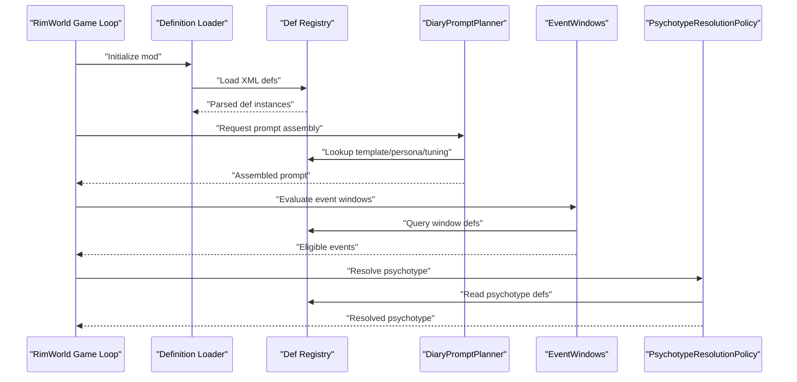
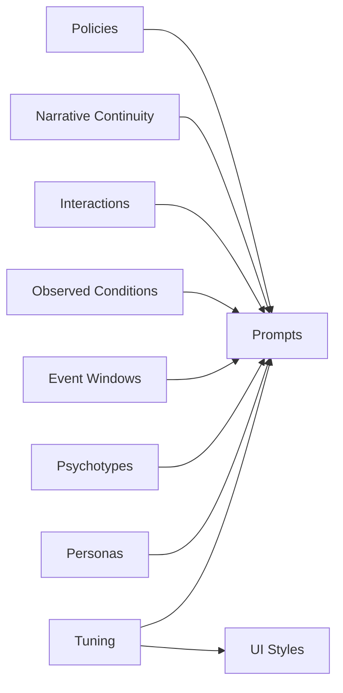

# XML Definition System

## Table of Contents
1. [Introduction](#introduction)
2. [Project Structure](#project-structure)
3. [Core Components](#core-components)
4. [Architecture Overview](#architecture-overview)
5. [Detailed Component Analysis](#detailed-component-analysis)
6. [Dependency Analysis](#dependency-analysis)
7. [Performance Considerations](#performance-considerations)
8. [Troubleshooting Guide](#troubleshooting-guide)
9. [Conclusion](#conclusion)
10. [Appendices](#appendices)

## Introduction
This document explains the XML definition system used by Pawn Diary to configure tuning, prompts, personas, event windows, psychotypes, and related systems. It covers schema structure, data types, validation rules, inheritance patterns, conditional logic, mod compatibility considerations, versioning strategies, and debugging techniques for XML configuration files. The goal is to enable both new and experienced modders to author robust definitions that integrate cleanly with the game and other mods.

## Project Structure
Pawn Diary organizes its XML definitions under 1.6/Defs, grouped by feature area (e.g., prompts, personas, event windows). Each major subsystem has a dedicated Def file and corresponding C# type(s) in Source/Defs. Runtime behavior is implemented in Source/Core and Source/Pipeline, which consume these definitions during gameplay.

```mermaid
graph TB
subgraph "XML Definitions"
A["DiaryTuningDef.xml"]
B["DiaryPromptTemplateDefs.xml"]
C["DiaryPersonaDefs.xml"]
D["DiaryEventWindowDefs.xml"]
E["DiaryPsychotypeDefs.xml"]
F["DiaryMemoryTuningDef.xml"]
G["DiaryObservedConditionDefs.xml"]
H["DiaryInteractionGroupDefs.xml"]
I["DiaryNarrativeContinuityDefs.xml"]
J["DiaryTextDecorationDefs.xml"]
K["DiaryUiStyleDef.xml"]
L["DiaryAnomalyPolicyDefs.xml"]
M["DiaryBiotechPolicyDefs.xml"]
N["DiaryOdysseyPolicyDefs.xml"]
O["DiaryRoyaltyPolicyDefs.xml"]
P["DiarySignalPolicyDefs.xml"]
Q["DiaryHediffPersonaOverrideDefs.xml"]
R["DiaryContextDetailDef.xml"]
S["DiaryContextReactionDefs.xml"]
T["DiaryHumorCueDefs.xml"]
U["DiaryPromptEnchantmentDefs.xml"]
V["DiaryPromptDef.xml"]
W["DiaryEventPromptDefs.xml"]
X["DiaryPsychotypeRollPolicyDefs.xml"]
Y["DiaryPsychotypeTraitPolicyDefs.xml"]
end
subgraph "Runtime"
Z["DiaryGameComponent.EventWindows.cs"]
AA["DiaryPromptPlanner.cs"]
AB["PsychotypeResolutionPolicy.cs"]
AC["EventWindowPolicy.cs"]
end
A --> Z
B --> AA
C --> AA
D --> Z
E --> AB
F --> AA
G --> AA
H --> AA
I --> AA
J --> AA
K --> AA
L --> AA
M --> AA
N --> AA
O --> AA
P --> AA
Q --> AA
R --> AA
S --> AA
T --> AA
U --> AA
V --> AA
W --> AA
X --> AB
Y --> AB
```

**Diagram sources**
- [DiaryTuningDef.xml:1-200](../../../../../1.6/Defs/DiaryTuningDef.xml#L1-L200)
- [DiaryPromptTemplateDefs.xml:1-200](../../../../../1.6/Defs/DiaryPromptTemplateDefs.xml#L1-L200)
- [DiaryPersonaDefs.xml:1-200](../../../../../1.6/Defs/DiaryPersonaDefs.xml#L1-L200)
- [DiaryEventWindowDefs.xml:1-200](../../../../../1.6/Defs/DiaryEventWindowDefs.xml#L1-L200)
- [DiaryPsychotypeDefs.xml:1-200](../../../../../1.6/Defs/DiaryPsychotypeDefs.xml#L1-L200)
- [DiaryGameComponent.EventWindows.cs:1-200](../../../../../Source/Core/DiaryGameComponent.EventWindows.cs#L1-L200)
- [DiaryPromptPlanner.cs:1-200](../../../../../Source/Pipeline/DiaryPromptPlanner.cs#L1-L200)
- [PsychotypeResolutionPolicy.cs:1-200](../../../../../Source/Pipeline/PsychotypeResolutionPolicy.cs#L1-L200)
- [EventWindowPolicy.cs:1-200](../../../../../Source/Pipeline/EventWindowPolicy.cs#L1-L200)

**Section sources**
- [DiaryTuningDef.xml:1-200](../../../../../1.6/Defs/DiaryTuningDef.xml#L1-L200)
- [DiaryPromptTemplateDefs.xml:1-200](../../../../../1.6/Defs/DiaryPromptTemplateDefs.xml#L1-L200)
- [DiaryPersonaDefs.xml:1-200](../../../../../1.6/Defs/DiaryPersonaDefs.xml#L1-L200)
- [DiaryEventWindowDefs.xml:1-200](../../../../../1.6/Defs/DiaryEventWindowDefs.xml#L1-L200)
- [DiaryPsychotypeDefs.xml:1-200](../../../../../1.6/Defs/DiaryPsychotypeDefs.xml#L1-L200)
- [DiaryGameComponent.EventWindows.cs:1-200](../../../../../Source/Core/DiaryGameComponent.EventWindows.cs#L1-L200)
- [DiaryPromptPlanner.cs:1-200](../../../../../Source/Pipeline/DiaryPromptPlanner.cs#L1-L200)
- [PsychotypeResolutionPolicy.cs:1-200](../../../../../Source/Pipeline/PsychotypeResolutionPolicy.cs#L1-L200)
- [EventWindowPolicy.cs:1-200](../../../../../Source/Pipeline/EventWindowPolicy.cs#L1-L200)

## Core Components
The XML definition system centers around several key subsystems:

- Tuning definitions control global behaviors such as memory retention, generation budgets, and UI styles.
- Prompt templates define reusable text structures for generating diary entries.
- Persona configurations describe character traits and narrative roles.
- Event windows determine when specific events are eligible for capture and processing.
- Psychotype settings influence personality-driven writing style and content selection.

Each subsystem is defined via XML and consumed by runtime components that validate, resolve, and apply them during gameplay.

**Section sources**
- [DiaryTuningDef.cs:1-200](../../../../../Source/Defs/DiaryTuningDef.cs#L1-L200)
- [DiaryPromptDef.cs:1-200](../../../../../Source/Defs/DiaryPromptDef.cs#L1-L200)
- [DiaryEventWindowDef.cs:1-200](../../../../../Source/Defs/DiaryEventWindowDef.cs#L1-L200)
- [DiaryPersonaDef.cs:1-200](../../../../../Source/Defs/DiaryPersonaDef.cs#L1-L200)
- [DiaryPsychotypeDef.cs:1-200](../../../../../Source/Defs/DiaryPsychotypeDef.cs#L1-L200)
- [DiaryMemoryTuningDef.cs:1-200](../../../../../Source/Defs/DiaryMemoryTuningDef.cs#L1-L200)
- [DiaryObservedConditionDef.cs:1-200](../../../../../Source/Defs/DiaryObservedConditionDef.cs#L1-L200)
- [InteractionGroups.cs:1-200](../../../../../Source/Defs/InteractionGroups.cs#L1-L200)
- [PromptArchitectureDefs.cs:1-200](../../../../../Source/Defs/PromptArchitectureDefs.cs#L1-L200)

## Architecture Overview
The XML definitions are loaded at startup and registered into the runtime. During gameplay, core components query these definitions to decide what to generate, how to format it, and when to trigger actions.

**Diagram sources**
- [DiaryPromptPlanner.cs:1-200](../../../../../Source/Pipeline/DiaryPromptPlanner.cs#L1-L200)
- [DiaryGameComponent.EventWindows.cs:1-200](../../../../../Source/Core/DiaryGameComponent.EventWindows.cs#L1-L200)
- [PsychotypeResolutionPolicy.cs:1-200](../../../../../Source/Pipeline/PsychotypeResolutionPolicy.cs#L1-L200)

## Detailed Component Analysis

### Tuning Definitions
Tuning definitions provide global knobs for memory management, generation budgets, and UI presentation. They typically include numeric ranges, boolean flags, and references to other definitions.

Key responsibilities:
- Memory retention policies and thresholds
- Generation budget controls
- UI style overrides
- Interaction group defaults

Validation rules:
- Numeric fields must be within allowed ranges
- References must resolve to existing definitions
- Boolean flags must be explicitly set where required

Inheritance patterns:
- Base tuning values can be overridden per context or mod
- Conditional overrides may depend on DLC presence or feature flags

Example customizations:
- Adjust memory eviction thresholds
- Enable or disable specific UI decorations
- Override default interaction groups

**Section sources**
- [DiaryTuningDef.xml:1-200](../../../../../1.6/Defs/DiaryTuningDef.xml#L1-L200)
- [DiaryTuningDef.cs:1-200](../../../../../Source/Defs/DiaryTuningDef.cs#L1-L200)
- [DiaryMemoryTuningDef.xml:1-200](../../../../../1.6/Defs/DiaryMemoryTuningDef.xml#L1-L200)
- [DiaryMemoryTuningDef.cs:1-200](../../../../../Source/Defs/DiaryMemoryTuningDef.cs#L1-L200)
- [DiaryUiStyleDef.xml:1-200](../../../../../1.6/Defs/DiaryUiStyleDef.xml#L1-L200)

### Prompt Templates
Prompt templates define reusable text structures for generating diary entries. They support variables, conditionals, and enrichment hooks.

Schema highlights:
- Template body with placeholders
- Context field bindings
- Enchantment integration points
- Language keyed strings

Validation rules:
- Placeholders must match available context fields
- Conditionals must reference valid keys
- Enchantments must exist and be compatible

Inheritance patterns:
- Base templates can be extended by specialized variants
- Mod-specific templates can override base behavior

Conditional logic:
- Branching based on persona traits
- Branching based on observed conditions
- Branching based on event metadata

Example customizations:
- Add new context fields to templates
- Introduce variant branches for rare events
- Inject humor cues or decorations

**Section sources**
- [DiaryPromptTemplateDefs.xml:1-200](../../../../../1.6/Defs/DiaryPromptTemplateDefs.xml#L1-L200)
- [DiaryPromptDef.cs:1-200](../../../../../Source/Defs/DiaryPromptDef.cs#L1-L200)
- [DiaryPromptEnchantmentDefs.xml:1-200](../../../../../1.6/Defs/DiaryPromptEnchantmentDefs.xml#L1-L200)
- [DiaryHumorCueDefs.xml:1-200](../../../../../1.6/Defs/DiaryHumorCueDefs.xml#L1-L200)
- [DiaryTextDecorationDefs.xml:1-200](../../../../../1.6/Defs/DiaryTextDecorationDefs.xml#L1-L200)
- [DiaryPromptPlanner.cs:1-200](../../../../../Source/Pipeline/DiaryPromptPlanner.cs#L1-L200)

### Persona Configurations
Persona configurations describe character roles, traits, and narrative preferences. They influence prompt selection and writing style.

Schema highlights:
- Trait affinities and weights
- Role-based preferences
- Style overrides
- Integration with external personality systems

Validation rules:
- Trait references must resolve
- Weights must be non-negative
- Style references must exist

Inheritance patterns:
- Personas can extend base archetypes
- Mods can add persona-specific behaviors

Example customizations:
- Define new persona archetypes
- Adjust trait affinities for balance
- Link personas to external systems

**Section sources**
- [DiaryPersonaDefs.xml:1-200](../../../../../1.6/Defs/DiaryPersonaDefs.xml#L1-L200)
- [DiaryPersonaDef.cs:1-200](../../../../../Source/Defs/DiaryPersonaDef.cs#L1-L200)
- [DiaryHediffPersonaOverrideDefs.xml:1-200](../../../../../1.6/Defs/DiaryHediffPersonaOverrideDefs.xml#L1-L200)

### Event Windows
Event windows determine when specific events are eligible for capture and processing. They use time-based and condition-based filters.

Schema highlights:
- Time windows (start/end dates)
- Condition predicates
- Priority and exclusivity flags
- Grouping and batching options

Validation rules:
- Date ranges must be valid
- Conditions must reference known keys
- Priorities must be unique within groups

Inheritance patterns:
- Base windows can be extended by DLC-specific windows
- Mods can add conditional overrides

Conditional logic:
- Branching based on DLC availability
- Branching based on colony state
- Branching based on player settings

Example customizations:
- Add new event categories
- Restrict windows to specific biomes
- Introduce seasonal variations

**Section sources**
- [DiaryEventWindowDefs.xml:1-200](../../../../../1.6/Defs/DiaryEventWindowDefs.xml#L1-L200)
- [DiaryEventWindowDef.cs:1-200](../../../../../Source/Defs/DiaryEventWindowDef.cs#L1-L200)
- [DiaryGameComponent.EventWindows.cs:1-200](../../../../../Source/Core/DiaryGameComponent.EventWindows.cs#L1-L200)
- [EventWindowPolicy.cs:1-200](../../../../../Source/Pipeline/EventWindowPolicy.cs#L1-L200)

### Psychotype Settings
Psychotype settings influence personality-driven writing style and content selection. They interact with roll policies and trait affinities.

Schema highlights:
- Psychotype definitions with weights
- Roll policy configurations
- Trait affinity mappings
- Resolution strategies

Validation rules:
- Weights must sum appropriately
- Trait references must resolve
- Policies must be compatible

Inheritance patterns:
- Base psychotypes can be extended
- Mods can add new psychotypes and policies

Conditional logic:
- Branching based on trait presence
- Branching based on mod availability
- Branching based on player choices

Example customizations:
- Define new psychotype archetypes
- Adjust roll probabilities
- Integrate with external personality systems

**Section sources**
- [DiaryPsychotypeDefs.xml:1-200](../../../../../1.6/Defs/DiaryPsychotypeDefs.xml#L1-L200)
- [DiaryPsychotypeDef.cs:1-200](../../../../../Source/Defs/DiaryPsychotypeDef.cs#L1-L200)
- [DiaryPsychotypeRollPolicyDefs.xml:1-200](../../../../../1.6/Defs/DiaryPsychotypeRollPolicyDefs.xml#L1-L200)
- [DiaryPsychotypeTraitPolicyDefs.xml:1-200](../../../../../1.6/Defs/DiaryPsychotypeTraitPolicyDefs.xml#L1-L200)
- [PsychotypeResolutionPolicy.cs:1-200](../../../../../Source/Pipeline/PsychotypeResolutionPolicy.cs#L1-L200)

### Observed Conditions and Interactions
Observed conditions and interaction groups provide additional context for prompt generation and event filtering.

Schema highlights:
- Condition definitions with predicates
- Interaction group memberships
- Context detail mappings
- Reaction definitions

Validation rules:
- Predicates must reference valid keys
- Group memberships must be consistent
- Reactions must target valid targets

Example customizations:
- Add new observed conditions
- Extend interaction groups
- Define custom reactions

**Section sources**
- [DiaryObservedConditionDefs.xml:1-200](../../../../../1.6/Defs/DiaryObservedConditionDefs.xml#L1-L200)
- [DiaryObservedConditionDef.cs:1-200](../../../../../Source/Defs/DiaryObservedConditionDef.cs#L1-L200)
- [DiaryInteractionGroupDefs.xml:1-200](../../../../../1.6/Defs/DiaryInteractionGroupDefs.xml#L1-L200)
- [InteractionGroups.cs:1-200](../../../../../Source/Defs/InteractionGroups.cs#L1-L200)
- [DiaryContextDetailDef.xml:1-200](../../../../../1.6/Defs/DiaryContextDetailDef.xml#L1-L200)
- [DiaryContextReactionDefs.xml:1-200](../../../../../1.6/Defs/DiaryContextReactionDefs.xml#L1-L200)

### Narrative Continuity and Policies
Narrative continuity and policy definitions ensure coherent storytelling across sessions and integrate with DLC features.

Schema highlights:
- Continuity rules and constraints
- Policy definitions for DLC features
- Signal policies for external integrations

Validation rules:
- Continuity rules must be consistent
- Policy references must resolve
- Signal policies must be compatible

Example customizations:
- Add new continuity rules
- Extend DLC policies
- Integrate external signals

**Section sources**
- [DiaryNarrativeContinuityDefs.xml:1-200](../../../../../1.6/Defs/DiaryNarrativeContinuityDefs.xml#L1-L200)
- [DiaryAnomalyPolicyDefs.xml:1-200](../../../../../1.6/Defs/DiaryAnomalyPolicyDefs.xml#L1-L200)
- [DiaryBiotechPolicyDefs.xml:1-200](../../../../../1.6/Defs/DiaryBiotechPolicyDefs.xml#L1-L200)
- [DiaryOdysseyPolicyDefs.xml:1-200](../../../../../1.6/Defs/DiaryOdysseyPolicyDefs.xml#L1-L200)
- [DiaryRoyaltyPolicyDefs.xml:1-200](../../../../../1.6/Defs/DiaryRoyaltyPolicyDefs.xml#L1-L200)
- [DiarySignalPolicyDefs.xml:1-200](../../../../../1.6/Defs/DiarySignalPolicyDefs.xml#L1-L200)

## Dependency Analysis
The XML definitions have well-defined dependencies between subsystems. Understanding these relationships helps avoid conflicts and ensures proper loading order.

**Diagram sources**
- [DiaryTuningDef.xml:1-200](../../../../../1.6/Defs/DiaryTuningDef.xml#L1-L200)
- [DiaryPromptTemplateDefs.xml:1-200](../../../../../1.6/Defs/DiaryPromptTemplateDefs.xml#L1-L200)
- [DiaryPersonaDefs.xml:1-200](../../../../../1.6/Defs/DiaryPersonaDefs.xml#L1-L200)
- [DiaryPsychotypeDefs.xml:1-200](../../../../../1.6/Defs/DiaryPsychotypeDefs.xml#L1-L200)
- [DiaryEventWindowDefs.xml:1-200](../../../../../1.6/Defs/DiaryEventWindowDefs.xml#L1-L200)
- [DiaryObservedConditionDefs.xml:1-200](../../../../../1.6/Defs/DiaryObservedConditionDefs.xml#L1-L200)
- [DiaryInteractionGroupDefs.xml:1-200](../../../../../1.6/Defs/DiaryInteractionGroupDefs.xml#L1-L200)
- [DiaryNarrativeContinuityDefs.xml:1-200](../../../../../1.6/Defs/DiaryNarrativeContinuityDefs.xml#L1-L200)

**Section sources**
- [DiaryPipelineContracts.cs:1-200](../../../../../Source/Pipeline/DiaryPipelineContracts.cs#L1-L200)
- [PromptArchitectureDefs.cs:1-200](../../../../../Source/Defs/PromptArchitectureDefs.cs#L1-L200)

## Performance Considerations
- Keep XML definitions lean to reduce load times
- Use conditional logic sparingly to minimize evaluation overhead
- Prefer static references over dynamic lookups where possible
- Batch operations where supported by the runtime
- Monitor memory usage when defining large numbers of templates or personas

## Troubleshooting Guide
Common issues and debugging techniques:

- Validation errors: Check for missing references and invalid ranges
- Loading failures: Verify XML syntax and namespace declarations
- Runtime errors: Inspect logs for failed resolution attempts
- Performance issues: Profile heavy templates and complex conditionals
- Compatibility problems: Test with different mod combinations and DLC states

Debugging steps:
- Use development tools to inspect loaded definitions
- Enable verbose logging for detailed error reports
- Validate definitions against schema constraints
- Test incremental changes to isolate issues

**Section sources**
- [DiaryPromptPlanner.cs:1-200](../../../../../Source/Pipeline/DiaryPromptPlanner.cs#L1-L200)
- [DiaryGameComponent.EventWindows.cs:1-200](../../../../../Source/Core/DiaryGameComponent.EventWindows.cs#L1-L200)
- [PsychotypeResolutionPolicy.cs:1-200](../../../../../Source/Pipeline/PsychotypeResolutionPolicy.cs#L1-L200)

## Conclusion
The XML definition system provides a flexible and powerful framework for customizing Pawn Diary's behavior. By understanding the schema structure, validation rules, and dependency relationships, modders can create rich and coherent experiences that integrate seamlessly with the game and other mods. Following best practices for performance, compatibility, and debugging will help ensure smooth operation across diverse playthroughs.

## Appendices

### Versioning Strategies
- Use semantic versioning for mod releases
- Maintain backward compatibility when possible
- Document breaking changes clearly
- Provide migration guides for major updates

### Mod Compatibility Considerations
- Avoid hard dependencies on other mods
- Use graceful degradation when optional features are unavailable
- Test with popular mod combinations
- Provide clear documentation for integration requirements

### Custom Definition Examples
- Extending base templates with new context fields
- Adding custom event windows with conditional logic
- Creating new psychotypes with trait affinities
- Integrating with external personality systems

[No sources needed since this section provides general guidance]
