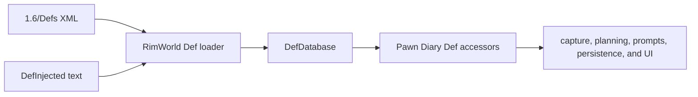

<!-- Generated by tools/generate-xml-def-wiki.ps1; do not edit by hand. -->

# XML Definition System

Pawn Diary keeps tunable policy in RimWorld XML Defs and consumes it through C# Def classes.
This page is regenerated from the shipped files so its inventory cannot drift from the repository.

## Current snapshot

- Source fingerprint: `73dce006ef601942`
- Parsed XML files below 1.6/Defs/: **44**
- XML Def types: **32**
- Named Def instances: **526**
- Abstract XML parents: **1**

Open the [Generated Def Reference](Generated%20Def%20Reference/Generated%20Def%20Reference.md)
for one live page per Def type, including source files, instances, English labels, C# declarations,
and the top-level fields observed in the current XML.

## Authoritative sources

- `1.6/Defs/**/*.xml` owns shipped policy and default Def instances.
- Matching declarations below `Source/` own the runtime schema; most live in `Source/Defs/`.
- `Languages/*/DefInjected/` localizes Def text such as labels, rules, instructions, and prompts.
- `Languages/*/Keyed/` localizes player-facing UI and prompt strings that are not Def fields.
- `1.6/Patches/` extends vanilla or optional-mod XML; those files use the singular `<Patch>` root.

## Runtime flow


```mermaid
flowchart LR
    XML["1.6/Defs XML"] --> Loader["RimWorld Def loader"]
    Localized["DefInjected text"] --> Loader
    Loader --> Database["DefDatabase<T>"]
    Database --> Accessor["Pawn Diary Def accessors"]
    Accessor --> Runtime["capture, planning, prompts, persistence, and UI"]
```

RimWorld loads Defs at startup; Pawn Diary does not parse these files during ordinary gameplay.
Consumers query typed Defs or repository accessors, then pass plain values into pure selection and
formatting code. The generated reference reports the loaded declarations, not every downstream use.

## Authoring rules

- Put prompt policy, thresholds, odds, UI style values, tags, colors, and other tunable behavior in XML.
- Use fully-qualified names for Pawn Diary types in XML `Class` or `Type` fields.
- Keep `{}`, `[]`, and template tokens out of Def labels; RimWorld validates labels before runtime substitution.
- Keep DLC and optional-mod matchers as plain strings where possible. A missing Def then simply never matches.
- If XML must reference DLC content directly, add the correct `MayRequire` package guard.
- Use `GetNamedSilentFail` plus a null check for optional Def lookups; `GetNamed` throws when content is absent.
- Localize Def prose through DefInjected and UI text through Keyed strings.

## Regeneration

```powershell
powershell -ExecutionPolicy Bypass -File tools/generate-xml-def-wiki.ps1
powershell -ExecutionPolicy Bypass -File tools/generate-xml-def-wiki.ps1 -Check
```

The first command refreshes this landing page and the generated reference. `-Check` performs no
writes and fails if committed output is missing, stale, or contains an obsolete generated type page.

## Current XML files

| File | XML types | Named records | Abstract parents |
|---|---|---:|---:|
| [DiaryCompat_AlphaMemes.xml](../../../../../1.6/Defs/Compat/DiaryCompat_AlphaMemes.xml) | `DiaryInteractionGroupDef" | 5 | 0 |
| [DiaryCompat_Hospitality.xml](../../../../../1.6/Defs/Compat/DiaryCompat_Hospitality.xml) | `DiaryInteractionGroupDef" | 2 | 0 |
| [DiaryCompat_Rimpsyche.xml](../../../../../1.6/Defs/Compat/DiaryCompat_Rimpsyche.xml) | `DiaryInteractionGroupDef" | 2 | 0 |
| [DiaryCompat_RimTalk.xml](../../../../../1.6/Defs/Compat/DiaryCompat_RimTalk.xml) | `DiaryInteractionGroupDef" | 1 | 0 |
| [DiaryCompat_SpeakUp.xml](../../../../../1.6/Defs/Compat/DiaryCompat_SpeakUp.xml) | `DiaryInteractionGroupDef" | 1 | 0 |
| [DiaryCompat_VEE.xml](../../../../../1.6/Defs/Compat/DiaryCompat_VEE.xml) | `DiaryInteractionGroupDef" | 2 | 0 |
| [DiaryCompat_VIEMemes.xml](../../../../../1.6/Defs/Compat/DiaryCompat_VIEMemes.xml) | `DiaryInteractionGroupDef" | 4 | 0 |
| [DiaryCompat_VTE.xml](../../../../../1.6/Defs/Compat/DiaryCompat_VTE.xml) | `DiaryInteractionGroupDef" | 2 | 0 |
| [DiaryCompat_WayBetterRomance.xml](../../../../../1.6/Defs/Compat/DiaryCompat_WayBetterRomance.xml) | `DiaryInteractionGroupDef" | 3 | 0 |
| [DiaryEventWindows_Hospitality.xml](../../../../../1.6/Defs/Compat/DiaryEventWindows_Hospitality.xml) | `DiaryEventWindowDef", `DiaryInteractionGroupDef" | 4 | 0 |
| [DiaryEventWindows_VEE.xml](../../../../../1.6/Defs/Compat/DiaryEventWindows_VEE.xml) | `DiaryEventWindowDef", `DiaryInteractionGroupDef" | 8 | 0 |
| [DiaryObservedConditions_VEE.xml](../../../../../1.6/Defs/Compat/DiaryObservedConditions_VEE.xml) | `DiaryObservedConditionDef" | 6 | 0 |
| [DiaryAnomalyPolicyDefs.xml](../../../../../1.6/Defs/DiaryAnomalyPolicyDefs.xml) | `DiaryAnomalyPolicyDef" | 1 | 0 |
| [DiaryAuthoritySpeechPolicyDef.xml](../../../../../1.6/Defs/DiaryAuthoritySpeechPolicyDef.xml) | `DiaryAuthoritySpeechPolicyDef" | 1 | 0 |
| [DiaryBeliefPolicyDef.xml](../../../../../1.6/Defs/DiaryBeliefPolicyDef.xml) | `DiaryBeliefPolicyDef" | 1 | 0 |
| [DiaryBiotechPolicyDefs.xml](../../../../../1.6/Defs/DiaryBiotechPolicyDefs.xml) | `DiaryBiotechPolicyDef" | 1 | 0 |
| [DiaryContextDetailDef.xml](../../../../../1.6/Defs/DiaryContextDetailDef.xml) | `DiaryContextDetailDef" | 1 | 0 |
| [DiaryContextReactionDefs.xml](../../../../../1.6/Defs/DiaryContextReactionDefs.xml) | `DiaryContextReactionDef" | 3 | 0 |
| [DiaryConversionRitualPolicyDef.xml](../../../../../1.6/Defs/DiaryConversionRitualPolicyDef.xml) | `DiaryConversionRitualPolicyDef" | 1 | 0 |
| [DiaryCultureProfileDefs.xml](../../../../../1.6/Defs/DiaryCultureProfileDefs.xml) | `DiaryCultureProfileDef" | 5 | 0 |
| [DiaryCultureTopicDefs.xml](../../../../../1.6/Defs/DiaryCultureTopicDefs.xml) | `DiaryCultureTopicDef" | 14 | 0 |
| [DiaryEventPromptDefs.xml](../../../../../1.6/Defs/DiaryEventPromptDefs.xml) | `DiaryEventPromptDef" | 70 | 0 |
| [DiaryEventWindowDefs.xml](../../../../../1.6/Defs/DiaryEventWindowDefs.xml) | `DiaryEventWindowDef" | 12 | 0 |
| [DiaryHediffPersonaOverrideDefs.xml](../../../../../1.6/Defs/DiaryHediffPersonaOverrideDefs.xml) | `DiaryHediffPersonaOverrideDef" | 7 | 0 |
| [DiaryHumorCueDefs.xml](../../../../../1.6/Defs/DiaryHumorCueDefs.xml) | `DiaryHumorCueDef" | 20 | 0 |
| [DiaryImportantEventDefs.xml](../../../../../1.6/Defs/DiaryImportantEventDefs.xml) | `DiaryImportantEventDef" | 29 | 0 |
| [DiaryInteractionGroupDefs.xml](../../../../../1.6/Defs/DiaryInteractionGroupDefs.xml) | `DiaryInteractionGroupDef" | 119 | 0 |
| [DiaryKnowledgeTuningDef.xml](../../../../../1.6/Defs/DiaryKnowledgeTuningDef.xml) | `DiaryKnowledgeTuningDef" | 1 | 0 |
| [DiaryNarrativeContinuityDefs.xml](../../../../../1.6/Defs/DiaryNarrativeContinuityDefs.xml) | `DiaryNarrativeContinuityDef" | 1 | 0 |
| [DiaryObservedConditionDefs.xml](../../../../../1.6/Defs/DiaryObservedConditionDefs.xml) | `DiaryObservedConditionDef" | 41 | 1 |
| [DiaryOdysseyPolicyDefs.xml](../../../../../1.6/Defs/DiaryOdysseyPolicyDefs.xml) | `DiaryOdysseyPolicyDef" | 1 | 0 |
| [DiaryPersonaDefs.xml](../../../../../1.6/Defs/DiaryPersonaDefs.xml) | `DiaryPersonaDef" | 51 | 0 |
| [DiaryPromptDef.xml](../../../../../1.6/Defs/DiaryPromptDef.xml) | `DiaryPromptDef" | 1 | 0 |
| [DiaryPromptEnchantmentDefs.xml](../../../../../1.6/Defs/DiaryPromptEnchantmentDefs.xml) | `DiaryPromptEnchantmentDef" | 52 | 0 |
| [DiaryPromptTemplateDefs.xml](../../../../../1.6/Defs/DiaryPromptTemplateDefs.xml) | `DiaryPromptTemplateDef" | 15 | 0 |
| [DiaryPsychotypeDefs.xml](../../../../../1.6/Defs/DiaryPsychotypeDefs.xml) | `DiaryPsychotypeDef" | 26 | 0 |
| [DiaryPsychotypeRollPolicyDefs.xml](../../../../../1.6/Defs/DiaryPsychotypeRollPolicyDefs.xml) | `DiaryPsychotypeRollPolicyDef" | 1 | 0 |
| [DiaryPsychotypeTraitPolicyDefs.xml](../../../../../1.6/Defs/DiaryPsychotypeTraitPolicyDefs.xml) | `DiaryPsychotypeTraitPolicyDef" | 1 | 0 |
| [DiaryRoyaltyPolicyDefs.xml](../../../../../1.6/Defs/DiaryRoyaltyPolicyDefs.xml) | `DiaryRoyaltyPolicyDef" | 1 | 0 |
| [DiarySignalPolicyDefs.xml](../../../../../1.6/Defs/DiarySignalPolicyDefs.xml) | `DiarySignalPolicyDef" | 5 | 0 |
| [DiaryTextDecorationDefs.xml](../../../../../1.6/Defs/DiaryTextDecorationDefs.xml) | `DiaryTextDecorationDef" | 1 | 0 |
| [DiaryTuningDef.xml](../../../../../1.6/Defs/DiaryTuningDef.xml) | `DiaryTuningDef" | 1 | 0 |
| [DiaryUiStyleDef.xml](../../../../../1.6/Defs/DiaryUiStyleDef.xml) | `DiaryUiStyleDef" | 1 | 0 |
| [PawnDiary_MainButtons.xml](../../../../../1.6/Defs/MainButtonDefs/PawnDiary_MainButtons.xml) | `MainButtonDef" | 1 | 0 |

## Topic guides

- [Tuning Definitions](Tuning%20Definitions.md)
- [Context Details](Context%20Details.md)
- [Event Windows](Event%20Windows.md)
- [Persona Configurations](Persona%20Configurations/Persona%20Configurations.md)
- [Prompt Templates](Prompt%20Templates/Prompt%20Templates.md)
- [Psychotype System](Psychotype%20System/Psychotype%20System.md)
